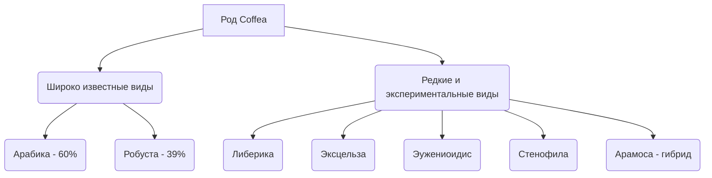

# Редкие и экспериментальные виды кофе

Мир кофе не ограничивается привычными нам арабикой и робустой. Хотя на их долю приходится более 99% коммерческого рынка, род Кофе (*Coffea*) насчитывает **более 120 известных видов**. В условиях изменения климата, болезней растений и поиска новых гастрономических горизонтов индустрия спешелти кофе всё активнее исследует редкие, дикие и экспериментальные виды.

---

## 🗺️ Обзор ключевых альтернативных видов

Каждый из этих видов обладает уникальным набором качеств, от климатической устойчивости до феноменального вкуса:

### 1. [[Liberica (Либерика)|Либерика (Coffea Liberica)]]
Крупное тропическое дерево с массивными зернами. Имеет специфический древесно-фруктовый, слегка дымный вкусовой профиль. Популярно в Юго-Восточной Азии.

### 2. [[Excelsa (Эксцельза)|Эксцельза (Coffea Excelsa)]]
Ботанический подвид Либерики, но обладающий совершенно иным вкусом — ярким, терпким и ягодным. Добавляет глубину и сложность кофейным смесям.

### 3. [[Eugenioides (Эужениоидис)|Эужениоидис (Coffea Eugenioides)]]
Генетический «родитель» арабики. Обладает крошечными зернами, рекордно низким содержанием кофеина и феноменальной естественной сладостью. Сорт-сенсация на мировых чемпионатах бариста.

### 4. [[Stenophylla (Стенофила)|Стенофила (Coffea Stenophylla)]]
Забытый западноафриканский вид, «воскрешенный» учеными в 2018 году. Способен расти в жарком климате (на 6°C теплее арабики), сохраняя при этом изысканный вкус высокогорной арабики.

### 5. [[Aramosa (Арамоса)|Арамоса (Aramosa)]]
Экспериментальный искусственный гибрид Арабики и Эужениоидиса с низким содержанием кофеина и интенсивным цветочным ароматом.

---

## 📊 Сравнительная матрица видов

| Вид кофе | Хромосомы | Родина | Ключевая особенность | Главный дескриптор вкуса |
| :--- | :--- | :--- | :--- | :--- |
| **[[Liberica (Либерика)\|Либерика]]** | 22 (диплоид) | Западная Африка | Огромные ягоды и листья | Джекфрут, пряности, дым |
| **[[Excelsa (Эксцельза)\|Эксцельза]]** | 22 (диплоид) | Центральная Африка | Стойкость к засухе и болезням | Сушеная вишня, лайм, дерево |
| **[[Eugenioides (Эужениоидис)\|Эужениоидис]]** | 22 (диплоид) | Восточная Африка | Естественная суперсладость | Зефир, кунжут, сладкая кукуруза |
| **[[Stenophylla (Стенофила)\|Стенофила]]** | 22 (диплоид) | Сьерра-Леоне | Переносит жару до 26-28°C | Жасмин, персик, черный чай |
| **[[Aramosa (Арамоса)\|Арамоса]]** | 44 (тетраплоид) | Бразилия (лаб.) | Низкий кофеин (0.7%) | Цветы апельсина, виноград |

---

## 🔬 Почему это важно для будущего кофе?

Интерес к редким видам продиктован не только модой:
1. **Генетическое разнообразие:** Скрещивание арабики с дикими видами помогает создавать новые устойчивые гибриды.
2. **Спасение от потепления:** Такие виды, как Стенофила, могут заменить арабику на плантациях, которые станут слишком теплыми из-за изменения климата.
3. **Новый вкусовой опыт:** Вкусы Эужениоидиса или Эксцельзы расширяют границы привычного понимания кофе, создавая новые ниши для гурманов.
