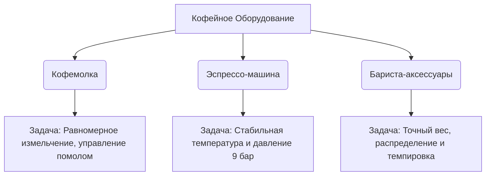

# Кофейное оборудование и профессиональные аксессуары

Приготовление кофе высокого уровня требует прецизионных инструментов. Кофейное оборудование — это мост между потенциалом зеленого зерна, мастерством обжарщика и вашей чашкой. В этом разделе собраны детальные технические руководства по главным компонентам домашней и профессиональной кофейной лаборатории.

---

## 🛠️ Архитектура кофейного оборудования

Каждый элемент оборудования отвечает за свой критический этап приготовления:

---

## 📚 Технические руководства

Детальный технический разбор оборудования, физика процессов и советы по выбору:

### 1. [[Кофемолки (Жернова и помол)|Кофемолки: Жернова, модальность и физика помола]]
Почему кофемолка важнее эспрессо-машины. Разбор конических и плоских жерновов, плоских стальных жерновов под фильтр-кофе, феномена застревания кофе (*retention*) и революции «single-dose» кофемолок.

### 2. [[5 Теория заваривания и Эспрессо/Кофейное оборудование и аксессуары/Эспрессо-машины|Эспрессо-машины: Бойлеры, группы и профилирование давления]]
Как устроены современные эспрессо-машины. Различия между однобойлерными, теплообменными (HX) и двухбойлерными системами. История легендарной группы E61, значение цифрового контроля PID и технологии профилирования потока (*flow profiling*).

### 3. [[Аксессуары (Весы, темперы, WDT)|Аксессуары бариста: Весы, распределители и борьба с каналами]]
Обзор необходимых аксессуаров для стабильного заваривания. Зачем нужны весы с шагом 0.1 г, как работает техника распределения WDT, разница между темпировкой и распределением, а также применение пук-экранов (puck screens).
