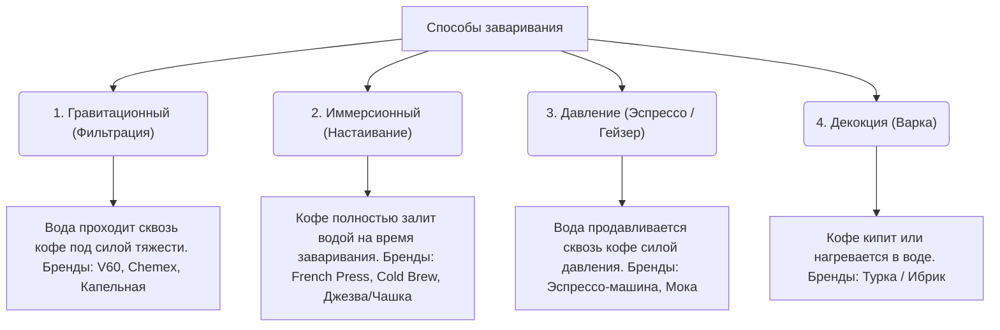

# Способы заваривания кофе

Приготовление кофе — это процесс **экстракции**, при котором вода выступает в роли растворителя, извлекающего из молотых кофейных зерен вкусовые вещества. Существует множество приспособлений для заваривания кофе, но все они основаны на четырех фундаментальных физических принципах взаимодействия воды и кофе.

---

## 🔬 Четыре физических принципа экстракции

Каждый метод приготовления относится к одной из следующих групп:

### 1. Гравитационный метод (Пуровер / Пуроверы)
Вода проливается сверху на молотый кофе, проходит сквозь него под действием силы тяжести и фильтруется через бумажный или металлический фильтр.
* *Особенности:* Дает легкую, чистую чашку, раскрывающую тонкие фруктовые и цветочные ноты.
* *Примеры:* [[Альтернативные методы (V60, Chemex, Aeropress) - Практика|Hario V60, Chemex]], Kalita Wave, автоматическая капельная кофеварка.

### 2. Иммерсионный метод (Immersion)
Молотый кофе полностью заливается водой и настаивается определенное время, после чего настой фильтруется.
* *Особенности:* Экстракция идет равномерно, но замедляется по мере насыщения раствора. Напиток получается плотным, сладким, с выраженным телом.
* *Примеры:* Френч-пресс, иммерсионная воронка Clever, каппинг (профессиональная дегустация), Cold Brew (холодное настаивание).

### 3. Заваривание под давлением
Вода под давлением (создаваемым помпой или паром) пробивается сквозь плотно спрессованную таблетку кофе мелкого помола.
* *Особенности:* Самый быстрый метод. Дает очень концентрированный напиток с плотным телом, эмульгированными маслами и пенкой крема.
* *Примеры:* [[Эспрессо-машины|Эспрессо-машина]], гейзерная кофеварка (Мока), [[Альтернативные методы (V60, Chemex, Aeropress) - Практика|AeroPress]] (гибридный метод).

### 4. Декокция (Варка / Отвар)
Кофе варится непосредственно в воде при постоянном нагреве, близком к кипению.
* *Особенности:* Кофейная гуща остается в напитке, из-за чего экстракция продолжается даже в чашке. Кофе получается плотным, насыщенным и крепким.
* *Примеры:* Джезва (турка), кофе по-восточному.

---

## 📚 Углубление в теорию и оборудование

Подробный разбор практических рецептов, химии процессов и кофейной инженерии:

* **👉 [[Альтернативные методы (V60, Chemex, Aeropress) - Практика|Альтернативные методы (Рецепты V60, Chemex, Aeropress)]]** — пошаговое руководство, техника вливания (блуминг, пульс-бокс) и температурные профили.
* **👉 [[Химия воды и экстракции кофе]]** — влияние минерализации, ионов кальция, магния и буфера гидрокарбонатов на вкус кофе.
* **👉 [[Кофейное оборудование и аксессуары]]** — путеводитель по техническому оснащению домашнего и профессионального бара (эспрессо-машины, кофемолки, аксессуары распределения).
