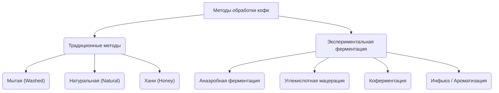

# Классификация методов обработки кофейных ягод

Сбор урожая — это лишь начало долгого пути кофе. Кофейное зерно — это семя ягоды, которое внутри плода надежно защищено несколькими слоями: внешней кожицей, сочной мякотью, липкой клейковиной (пектиновым слоем), твердым пергаментным слоем (паргаментом) и тонкой серебристой кожицей. 

Чтобы подготовить зерно к обжарке, все внешние слои необходимо удалить, а само зерно высушить до влажности 10–12%. Процесс удаления этих слоев называется **обработкой кофе**. Метод обработки оказывает колоссальное влияние на химический состав зерна и формирует до 50% вкусового потенциала будущей чашки.

---

## 🗺️ Семейство методов обработки

Все современные методы делятся на традиционные (базовые) и экспериментальные (ферментационные):

---

## 📊 Сравнение базовых традиционных методов

Традиционные методы различаются тем, **в каком виде сушится кофе**:

| Метод обработки | В каком виде сушится зерно | Плотность тела | Кислотность чашки | Сладость чашки | Чистота вкуса |
| :--- | :--- | :--- | :--- | :--- | :--- |
| **[[Мытая обработка (Washed)\|Мытая (Washed)]]** | Чистое зерно в парчменте (без мякоти и клейковины) | Легкое, чайное | Яркая, искристая, цитрусовая | Умеренная | **Исключительно высокая** |
| **[[Натуральная обработка (Natural)\|Натуральная (Natural)]]** | Цельная ягода (кожица и мякоть не удаляются) | **Очень плотное, сиропистое** | Мягкая, сладкая, ягодная | **Очень высокая** | Средняя |
| **[[Хани _ Полумытая (Honey _ Pulped Natural)\|Хани (Honey)]]** | Зерно в парчменте с остатками липкой клейковины | Среднее, обволакивающее | Сбалансированная, мягкая | Высокая, медовая | Высокая |

---

## 🔬 Экспериментальная ферментация: Новая эра вкуса

В последние 10 лет спешелти-индустрия активно заимствует технологии из виноделия. Ферментация — это биологический процесс, при котором дрожжи и бактерии расщепляют сахара в кофейной мякоти, выделяя кислоты, спирты и летучие вкусоароматические соединения. 

Контролируя этот процесс, фермеры создают экстраординарные вкусы:
1. **[[Анаэробная ферментация]]**: Брожение кофе в герметичных емкостях без доступа кислорода. Дает плотный, йогуртово-тропический вкус.
2. **[[Углекислотная мацерация (Carbonic Maceration)]]**: Ферментация целых ягод в резервуарах, заполненных углекислым газом (метод Божоле). Дает элегантный винно-ягодный профиль.
3. **[[Коферментация (Кофе с добавками)]]**: Добавление в ферментационные танки фруктов, специй или винных дрожжей.
4. **[[Инфьюз (Infused Coffee)]]**: Физическое насыщение зеленого зерна ароматическими маслами или эссенциями (вызывает споры о прозрачности в индустрии).

---

## 💡 Почему метод обработки важен для потребителя?
Зная метод обработки, вы можете легко выбрать кофе под свои предпочтения:
* Любите чистую, яркую кислинку, цветочные и чайные ноты? Выбирайте **мытый кофе**.
* Предпочитаете сладкий, плотный, фруктовый кофе с нотами шоколада и ягодного джема? Ищите **натуральный кофе**.
* Ищете баланс сладости и чистоты вкуса? Попробуйте обработку **хани**.
* Хотите вкусовой взрыв, напоминающий алкогольный коктейль, тропический сок или пряности? Экспериментируйте с **анаэробными лотами**.
