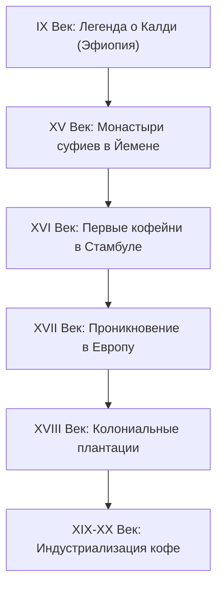

# Исторические трактаты и кофейные хроники

История кофе — это не просто хроника распространения сельскохозяйственной культуры, а захватывающий приключенческий и политический роман. За пять столетий кофе прошел путь от тайного ритуального зелья суфийских мистиков до главного напитка эпохи Просвещения, ставшего топливом для развития современного капитализма. 

Этот раздел посвящен летописи кофе, его влиянию на общество, политику, религию и культуру разных эпох.

---

## ⏳ Хронологическая шкала кофейной истории

---

## 📚 Ключевые исторические сюжеты

Ниже представлены подробные исследования важнейших вех кофейной истории:

### 1. [[Первые упоминания в Йемене (Шейх Шадли)|Йеменская колыбель и суфийский мистицизм]]
Как кофе превратился из диких ягод в горячий напиток. Роль суфийских орденов, которые использовали кофе как духовный стимулятор для ночных молитв и радений (зикров). Легенды о Шейхе Шадли и его ученике Омаре, открывшем целебные свойства отвара в пустынной пещере близ Мохи.

### 2. [[Запреты на кофе в Османской империи|Османские кофейные войны и репрессии Мурада IV]]
Почему кофейни Стамбула считались рассадниками крамолы и заговоров. Религиозные дебаты о халяльности кофе (приравнивание обжаренного зерна к углю) и жестокие репрессии султана Мурада IV, при котором за употребление кофе карали смертной казнью.

### 3. «Пенсовые университеты» Европы (XVII–XVIII века)
Когда кофе попал в Европу (через Венецию и Вену), он кардинально изменил социальную жизнь:
* **Англия:** Лондонские кофейни прозвали «Пенсовыми университетами» (Penny Universities) — за один пенни (плата за вход и чашку кофе) любой человек мог войти и часами вести дискуссии с учеными, политиками и поэтами. Из этих споров родились Лондонское королевское общество, страховой гигант *Lloyd's* и Лондонская фондовая биржа.
* **Франция:** Кофейни Парижа (такие как знаменитое *Café Procope*) стали штаб-квартирами философов-просветителей: Вольтера, Руссо и Дидро. Именно в кофейнях рождались идеи, приведшие к Великой французской революции.

---

## 📜 Древнейшие трактаты о кофе

Первые письменные работы о пользе и вреде кофе появились на арабском востоке:
* **Абу Бакр аль-Рейзи (Разес) и Ибн Сина (Авиценна):** Выдающиеся персидские врачи X–XI веков первыми описали кофейное зерно под именем *«бунн»* (bunn) и напиток *«бунчум»* (bunchum), используя его в медицинских целях для улучшения пищеварения и борьбы с апатией.
* **Трактат Абд аль-Кадира аль-Джазири (1587 год):** *«Услада души искренностью относительно кофе»* (Umdat al-safwa fi hill al-qahwa) — старейший сохранившийся полноценный исторический трактат о кофе, подробно описывающий споры вокруг легальности напитка в исламе и его путь из Йемена в Мекку и Каир.
