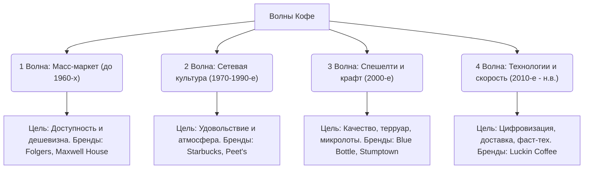

# Современные кофейные бренды и Волны кофе

Кофейный рынок — один из самых динамичных в мире. То, как люди пьют кофе, кардинально менялось на протяжении последнего столетия. Историки кофе делят эту эволюцию на три (иногда четыре) «волны», каждая из которых породила свои великие бренды. 

Понимание бизнес-моделей и философии этих брендов помогает понять, как кофе превратился из массового сырья в искусство и цифровой продукт.

---

## 🌊 Волны кофейной индустрии

Каждая волна меняла отношение потребителя к продукту:

---

## 🏢 Великие кофейные корпорации и бренды

В этом разделе представлены глубокие аналитические разборы брендов, определивших лицо современной кофейной индустрии:

### 1. [[Starbucks|Starbucks — Гигант второй волны и концепция «Третьего места»]]
Как небольшая лавка по продаже зерен в Сиэтле превратилась в крупнейшую сеть кофеен в мире. Роль Говарда Шульца, популяризация латте и превращение кофейни в социальный хаб между домом и работой.

### 2. [[Blue Bottle Coffee|Blue Bottle Coffee — Икона третьей волны и эстетика минимализма]]
История кларнетиста Джеймса Фримана, сделавшего ставку на обжарку микролотов под заказ и медленный пуровер-бар. Дилемма крафтового бренда: покупка сети корпорацией Nestlé.

### 3. [[Luckin Coffee|Luckin Coffee — Китайский фаст-тех феномен и победа мобильных приложений]]
Как стартап из Пекина бросил вызов Starbucks, используя модель без касс, pickup-точки и доставку за 15 минут. Драматическая история краха из-за фальсификации отчетов и триумфальное возвращение благодаря кокосовому латте.

### 4. [[Tim Hortons|Tim Hortons — Канадская легенда и национальный культурный код]]
Как сеть пончиковых, основанная легендарным хоккеистом Тимом Хортоном, стала частью национальной идентичности Канады. Феномен кофе «Дабл-Дабл» и культурное влияние бренда.
