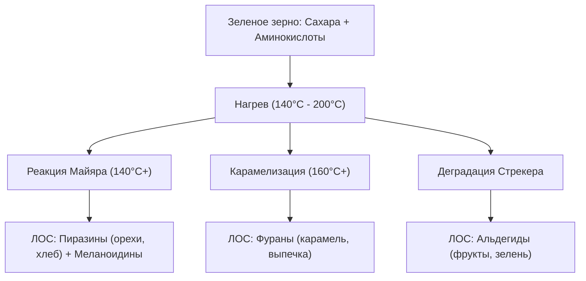

# Механизмы формирования аромата кофе

Аромат кофе — один из самых сложных химических букетов в пищевой индустрии. Обжаренное кофейное зерно содержит **более 800–1000 летучих органических соединений (ЛОС)**. Наш мозг воспринимает их двумя путями: ортоназально (когда мы вдыхаем аромат носом) и ретроназально (когда молекулы вкуса поднимаются из рта в носоглотку во время глотка).

Зеленое кофейное зерно пахнет травой и фасолью и практически не имеет кофейного запаха. Вся магия аромата рождается во время обжарки под влиянием высоких температур.

---

## 🔬 Химические реакторы обжарки: Как рождается запах?

В процессе обжарки в зерне протекают три важнейшие химические реакции:

### 1. Реакция Майяра (Maillard Reaction) — от 140°C
Взаимодействие между аминокислотами (белками) и редуцирующими сахарами.
* **Что производит:** Темные пигменты (меланоидины), формирующие тело и цвет напитка, а также сотни ароматических соединений.
* **Ароматы:** Жареный хлеб, тосты, орехи, выпечка.

### 2. Карамелизация (Caramelization) — от 160°C
Термический распад сахарозы (сахара) без участия белков.
* **Что производит:** Фураны и пироны.
* **Ароматы:** Сливочный ирис, карамель, сливочное масло, жженый сахар.

### 3. Деградация Стрекера (Strecker Degradation)
Взаимодействие аминокислот с карбонильными соединениями (промежуточными продуктами реакции Майяра).
* **Что производит:** Альдегиды и кетоны, летучие сернистые соединения.
* **Ароматы:** Сладкие, шоколадные, фруктовые и медовые ноты.

---

## 🧪 Основные химические семейства ароматов

Каждая вкусовая нота (дескриптор) в вашей чашке — это реальное химическое соединение:

| Класс соединений | Типичный дескриптор в кофе | Химический представитель |
| :--- | :--- | :--- |
| **Сложные эфиры (Esters)** | Жасмин, персик, тропические фрукты, ягоды | Этилацетат, метилбутират |
| **Альдегиды (Aldehydes)** | Зеленое яблоко, свежескошенная трава | Ацетальдегид, гексаналь |
| **Пиразины (Pyrazines)** | Жареный арахис, фундук, какао, попкорн | 2-этил-3-метилпиразин |
| **Фураны (Furans)** | Карамель, сливочная помадка, кленовый сироп | Фурфурол, фуранеол |
| **Фенолы (Phenols)** | Черный перец, гвоздика, дым, табак | Гваякол (характерен для темной обжарки) |
| **Тиолы (Thiols / серосодержащие)**| Интенсивный кофейный аромат (в малых дозах) | 2-фурфурилтиол (кахвеофуран) |

---

## 🎨 Три категории ароматов SCA (Specialty Coffee Association)

Кофейные сомелье разделяют ароматы по источнику их происхождения:

### 1. Энзимные ароматы (Enzymatic)
Органические соединения, созданные самим растением в процессе жизнедеятельности (терруарные свойства). Преобладают в кофе **светлой обжарки**.
* *Дескрипторы:* Цветы (жасмин, роза), цитрусы (лимон, грейпфрут), свежие фрукты (яблоко, персик), травы.

### 2. Сахарное потемнение (Sugar Browning)
Ароматы, родившиеся при карамелизации и реакции Майяра во время обжарки. Преобладают в кофе **средней обжарки**.
* *Дескрипторы:* Карамель, молочный шоколад, фундук, жареный миндаль, ячмень, тост.

### 3. Сухая дистилляция (Dry Distillation)
Тяжелые соединения, образующиеся при пиролизе (термическом разрушении древесных волокон) на высоких температурах обжарки. Характерны для **темной обжарки** и [[1 Виды и ботаника кофе/Робуста/Робуста|Робусты]].
* *Дескрипторы:* Дерево (кедр, сандал), специи (гвоздика, черный перец), табак, смола, дым, зола.

---

## 💡 Резюме для кофемана
Сложность и богатство кофейного аромата зависят от баланса обжарки: светлая обжарка сохраняет деликатные **энзимные** ноты ягод и цветов; средняя — раскрывает сладкую **карамель и шоколад**; темная обжарка уничтожает фруктовые кислоты, заменяя их плотными ароматами **сухой дистилляции** (дым, табак, дерево).
