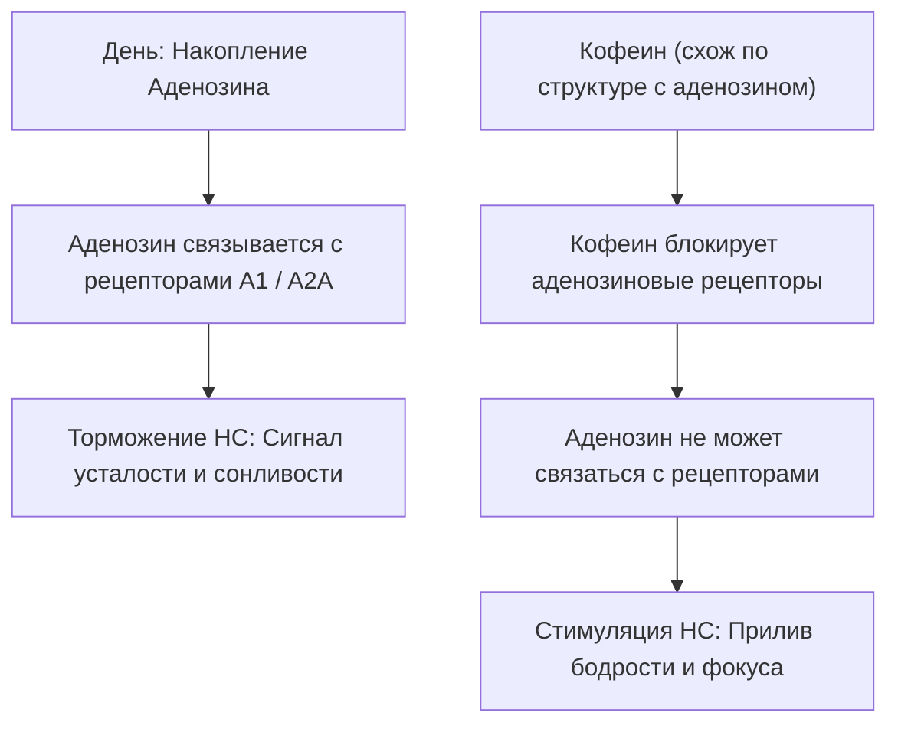

# Эффекты и состояния от кофе (Нейробиология бодрости)

Кофе — самый популярный психостимулятор на Земле. Его главное действующее вещество, **кофеин** (1,3,7-триметилксантин), оказывает мощное воздействие на центральную нервную систему, временно меняя биохимию нашего мозга. 

Понимание механизмов действия кофеина помогает использовать его осознанно, извлекая максимальную пользу для продуктивности и избегая побочных эффектов.

---

## 🧠 Нейробиологический механизм действия кофеина

Основное действие кофеина основано на **обмане рецепторов усталости**:

### 1. Блокада Аденозина (Главный выключатель сна)
В течение дня наш организм расходует энергию (молекулы АТФ), выделяя побочный продукт — нейромедиатор **аденозин**. Он накапливается в мозге и связывается со своими рецепторами, замедляя активность нервной системы и вызывая сонливость.
* **Как действует кофеин:** Молекула кофеина структурно очень похожа на аденозин. Она садится на аденозиновые рецепторы, блокируя их. Аденозин продолжает циркулировать в мозге, но рецепторы его «не видят». Вы перестаете чувствовать усталость.

### 2. Выброс Дофамина и Адреналина
Блокируя аденозин, кофеин косвенно стимулирует выделение других нейромедиаторов:
* **Дофамин:** Гормон мотивации и удовольствия. Повышает настроение, вызывает легкую эйфорию и желание действовать.
* **Норадреналин и Адреналин:** Включают режим «бей или беги». Учащается сердцебиение, расширяются бронхи, кровь приливает к мышцам, повышается общая концентрация.

---

## 📈 Когнитивные эффекты и состояния

Кофеин вызывает ряд выраженных когнитивных изменений:
* **Улучшение рабочей памяти:** Повышает скорость извлечения информации.
* **Фокус внимания:** Облегчает концентрацию на монотонных задачах.
* **Сокращение времени реакции:** Снижает время отклика на внешние стимулы (полезно для водителей и геймеров).

> [!TIP]
> **Синергия «Спокойного фокуса»:** Сочетание кофеина с аминокислотой L-теанином (содержится в зеленом чае **[[Матча (Matcha)|Матча]]**) или адаптогенами (**[[Грибной кофе (Mushroom Coffee)|Грибной кофе]]**) сглаживает побочные эффекты кофеина, давая чистую энергию без нервной дрожи и тахикардии.

---

## 📉 Обратная сторона: Кофеиновая яма и зависимость

Злоупотребление кофе имеет физиологическую цену:

### 1. Кофеиновый краш (Кофеиновая яма / Coffee Crash)
Пока кофеин блокирует рецепторы, аденозин продолжает накапливаться в мозге. Через 4–6 часов (период полувыведения кофеина) печень полностью метаболизирует кофеин. В этот момент накопившаяся лавина аденозина мгновенно обрушивается на освободившиеся рецепторы.
* *Результат:* Резкий, непреодолимый упадок сил, сонливость и апатия.

### 2. Привыкание (Толерантность)
При постоянном потреблении кофе мозг пытается защититься от перевозбуждения и **выращивает новые аденозиновые рецепторы**. 
* *Результат:* Прежняя доза кофе больше не бодрит (так как рецепторов стало больше, и кофеин не может заблокировать их все). Человеку приходится пить больше кофе просто для того, чтобы чувствовать себя «нормально».

### 3. Синдром отмены (Абстиненция)
При резком отказе от кофе новые незаблокированные рецепторы вызывают сонливость, а кровеносные сосуды мозга расширяются (кофеин сужает сосуды), что приводит к характерной **кофеиновой головной боли**. Симптомы проходят через 3–5 дней, когда мозг сокращает число лишних рецепторов до нормы.

---

## 🕒 Правила кофеиновой гигиены

Чтобы кофе приносил только пользу, соблюдайте три правила:
1. **Не пейте кофе сразу после пробуждения:** В первые 1-2 часа после сна уровень гормона бодрости кортизола в организме и так максимален. Дайте накопившемуся за ночь аденозину уйти самостоятельно. Пейте кофе через 90–120 минут после сна.
2. **Правило 10 часов:** Кофеин имеет период полувыведения около 5 часов, а полного выведения — до 10 часов. Чтобы не нарушать фазы глубокого сна, выпивайте последнюю чашку кофе минимум за 8-10 часов до сна. Или переходите на **[[Декаф (Методы декофеинизации: Swiss Water, CO2)|Декаф]]**.
3. **Пейте воду:** Кофеин ускоряет фильтрацию почек, оказывая легкий мочегонный эффект. На каждую чашку кофе выпивайте стакан чистой воды для предотвращения обезвоживания.
