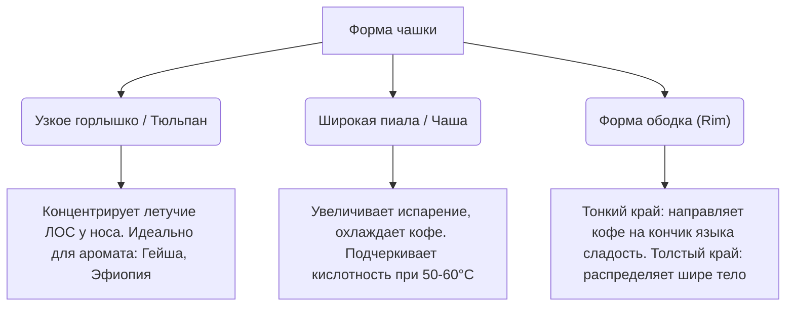

# Кофейная посуда и материалы: Физика восприятия вкуса

Форма, материал и толщина стенок чашки, из которой мы пьем кофе, кардинально меняют наши сенсорные ощущения. Научные исследования в области нейрогастрономии доказывают: один и тот же кофе, налитый в чашки разной формы или цвета, воспринимается рецепторами мозга совершенно по-разному.

Выбор правильной посуды — это завершающий штрих в раскрытии потенциала кофейного зерна.

---

## 📐 Влияние формы посуды на вкус и аромат

Геометрия чашки управляет потоком кофейного аромата и направлением струи напитка на наши вкусовые рецепторы:

### 1. Узкое горлышко (форма коньячного бокала / тюльпана)
Удерживает летучие ароматические соединения внутри бокала. Когда вы делаете глоток, ваш нос оказывается в зоне максимальной концентрации аромата.
* *Кому подходит:* Легким, парфюмерным сортам (например, [[1 Виды и ботаника кофе/Арабика/Сорта Арабики/Geisha (Гейша)|Гейша]] или мытая [[4 География и Терруар (Кофейный пояс)/Африка (Эфиопия, Кения, Руанда)|Эфиопия]]).

### 2. Широкая чаша (форма пиалы)
Увеличивает площадь соприкосновения напитка с воздухом, ускоряя остывание. 
* *Кому подходит:* Наш язык лучше всего воспринимает органические кислоты и сладость, когда кофе остывает до **50–60°C**. Широкая чаша позволяет быстро достичь этой гастрономической температуры и подчеркивает сочную кислинку.

### 3. Толщина ободка (Rim Thickness)
* **Тонкий ободок:** Направляет струю кофе непосредственно на переднюю часть языка, акцентируя внимание на сладости и деликатной кислотности.
* **Толстый ободок:** Заставляет кофе течь более широким потоком, распределяя его по боковым и задним частям языка, что подчеркивает плотность, вязкость и тело напитка (идеально для капучино).

---

## 🧪 Сравнение материалов посуды

Материал влияет на теплоемкость посуды и химическую нейтральность вкуса:

| Материал | Теплоемкость (сохранение тепла) | Химическая нейтральность | Влияние на вкус / Оценка |
| :--- | :--- | :--- | :--- |
| **Фарфор (Porcelain)** | **Очень высокая** | **Максимальная** | Золотой стандарт для эспрессо и капучино. Тяжелые фарфоровые чашки долго держат тепло, не дают посторонних привкусов. |
| **Двустенное стекло** | Высокая (эффект термоса) | **Максимальная** | Позволяет оценить цвет и слоистость напитка (особенно латте-макиато, эспрессо-тоника). Тактильно комфортно держать в руке. |
| **Керамика (Stoneware)** | Средняя | Средняя | Приятная тактильность, но дешевая неглазурованная глина пористая — она может впитывать кофейные масла и запахи. |
| **Нержавеющая сталь** | Низкая (если нет вакуума) | Средняя | Подходит для походов. Дешевая сталь может давать напитку металлический привкус, а тонкие стенки быстро остужают кофе. |
| **Бумажные стаканчики** | Низкая | **Очень низкая** | Худший выбор для спешелти. Целлюлозное волокно впитывает эфирные масла кофе (убивая тело и аромат), а пластиковая ламинация при нагревании дает привкус мокрого картона. |

---

## 🏆 Специализированная сенсорная посуда: Бокалы KRUVE

Инновационный бренд **Kruve** перенес винную культуру бокалов в кофе, создав линейку *EQ Glassware*:
* **Бокал Excite:** Имеет округлую чашу с большим диаметром и средний ободок. Он концентрирует сладость, снижает ощущение кислотности и увеличивает плотность тела (рекомендуется для плотного натурального кофе, например, Бразилии или суматранского [[3 Методы обработки и ферментация/Традиционные методы/Хани _ Полумытая (Honey _ Pulped Natural)|Хани]]).
* **Бокал Inspire:** Узкий бокал с раструбом наружу. Он направляет струю кофе на края языка, подчеркивая искристую кислотность, и концентрирует тонкие цветочные ароматы у носа (рекомендуется для высокогорного мытого фильтр-кофе).

---

## 💡 Резюме для кофемана
Если вы хотите насладиться спешелти кофе дома, забудьте о бумажных стаканчиках и дешевых кружках. Для фильтр-кофе используйте **стеклянные пиалы с тонкими краями** или бокалы типа *Inspire*, а для классического эспрессо — предварительно прогретые **толстостенные чашки из качественного фарфора** яйцеобразной формы (округлое дно чашки помогает правильно распределить крема при проливе).
