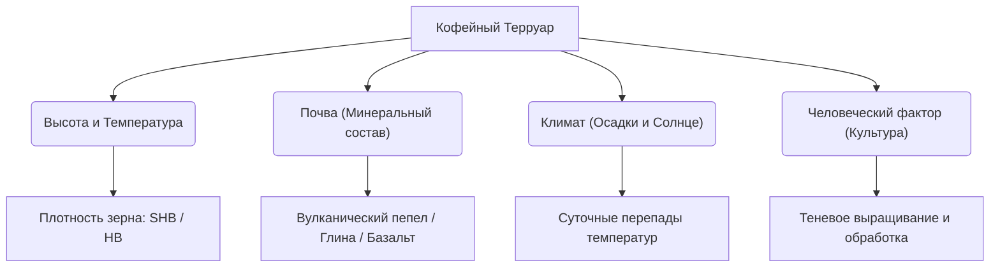

# Регионы производства и Терруары кофе

В мире спешелти кофе понятие **«терруар»** (от франц. *terroir* — земля) является фундаментальным. Заимствованное из виноделия, оно описывает совокупность факторов окружающей среды, которые определяют уникальный вкус кофейной чашки. 

Терруар — это не просто географическая точка на карте, это сложный союз почвы, высоты над уровнем моря, климата и биологического разнообразия конкретной плантации.

---

## 🏔️ Анатомия кофейного терруара

Каждая чашка спешелти кофе несет в себе отпечаток четырех главных сил природы:

### 1. Высота над уровнем моря и Температура
Чем выше растет кофе, тем ниже среднегодовая температура. Прохладный воздух замедляет метаболизм кофейного дерева, увеличивая цикл созревания ягод (иногда на 2-3 месяца). Из-за этого зерно успевает накопить больше органических кислот, сложных сахаров и ароматических предшественников.
* **SHB (Strictly Hard Bean / Исключительно твердое зерно):** кофе, выращенный на высоте более 1350–1500 метров. Такие зерна плотные, тяжелые и содержат максимум вкуса.
* **HB (Hard Bean / Твердое зерно):** кофе с высоты 1000–1350 метров.

### 2. Тип и минеральный состав почвы
* **Вулканические почвы (Andisols):** Характерны для «Огненного кольца» (Панама, Коста-Рика, Колумбия, Суматра). Почвы из вулканического пепла богаты калием, фосфором, азотом и обладают превосходным дренажем. Дают кофе с высокой кислотностью и сложным ароматом.
* **Глинистые почвы и красноземы (Oxisols):** Богаты железом и алюминием (характерно для Бразилии). Дают более плотный, но менее кислый кофе с ореховыми и шоколадными тонами.
* *Влияние минералов:* **Калий** стимулирует накопление сахаров в ягоде; **Фосфор** напрямую отвечает за искристую кислотность чашки.

### 3. Микроклимат и суточные перепады температур
Огромное значение имеют суточные колебания температур: жаркие дни запускают активный фотосинтез (выработку сахаров), а холодные ночи замедляют дыхание растения, предотвращая сжигание накопленной энергии. Кофе получается исключительно сладким.

---

## 🗺️ Кофейный пояс Земли и его терруары

Подробный разбор климата, почв и сенсорных карт основных регионов производства:

* **👉 [[Африка (Эфиопия, Кения, Руанда.)|Терруары Африки]]** — яркая кислотность, вулканический фосфор, суглинки и дикие лесные микроклиматы.
* **👉 [[Южная Америка (Бразилия, Колумбия.)|Терруары Южной Америки]]** — от кислых бразильских равнин Серрадо до высокогорных вулканических микроклиматов колумбийских Анд.
* **👉 [[Центральная Америка (Панама, Коста-Рика.)|Терруары Центральной Америки]]** — карибские туманы *bajareque*, богатейший вулканический пепел и долина Тарразу.
* **👉 [[Азия и Океания (Йемен, Суматра, Вьетнам.)|Терруары Азии и Океании]]** — экстремальный водный стресс террас Йемена, супервлажные вулканические почвы Суматры и базальты Вьетнама.
