```d2
direction: right

# ==========================================
# ГЛОБАЛЬНЫЕ СТИЛИ
# ==========================================
classes: {
  tea_card: {
    shape: rectangle
    style: {
      border-radius: 10
      stroke-width: 2
      shadow: true
    }
  }
  
  group_node: {
    shape: rectangle
    style: {
      border-radius: 15
      font-size: 16
      bold: true
      shadow: true
    }
  }
  
  link_style: {
    style: {
      stroke-width: 2
      stroke-dash: 5
      animated: true
    }
  }
}

# ==========================================
# 1. КОРЕНЬ
# ==========================================
leaf: "🌿 Свежий лист\nCamellia sinensis" {
  shape: hexagon
  style: {
    fill: "#e0f7fa"
    stroke: "#00838f"
    stroke-width: 3
    font-size: 18
    bold: true
    shadow: true
  }
}

# ==========================================
# 2. ПРОМЕЖУТОЧНЫЕ ГРУППЫ (Разветвление)
# ==========================================
light: "Слабая ферментация\n(Светлые чаи)" {
  class: group_node
  style.fill: "#f1f8e9"
  style.stroke: "#689f38"
  style.font-color: "#33691e"
}

dark: "Сильная ферментация\n(Темные чаи)" {
  class: group_node
  style.fill: "#efebe9"
  style.stroke: "#795548"
  style.font-color: "#3e2723"
}

# ==========================================
# 3. КАРТОЧКИ С ЧАЕМ (Markdown-формат)
# ==========================================
green: |md
  ### 🟢 Зеленый чай
  **🔥 Ша Цин (Убийство зелени)**
  Остановка ферментации (жарка или пар).

  **🧠 Эффект: Дзен и Фокус**
  Максимум антиоксидантов (EGCG).
  L-теанин дает спокойствие (альфа-ритмы).
  *Сорта: Лунцзин, Би Ло Чунь*
| { class: tea_card; style.fill: "#e8f5e9"; style.stroke: "#2e7d32" }

white: |md
  ### ⚪ Белый чай
  **🌬️ Вэйдяо (Увядание)**
  Минимальная обработка (сушка на солнце).

  **🧊 Эффект: Охлаждение (Инь)**
  Рекордсмен по аминокислотам.
  Снимает жар. С годами становится лекарством.
  *Сорта: Инь Чжэнь, Бай Му Дань*
| { class: tea_card; style.fill: "#fafafa"; style.stroke: "#9e9e9e" }

yellow: |md
  ### 🟡 Желтый чай
  **📦 Мэнь Хуан (Томление)**
  Влажное томление. Распад белков на аминокислоты.

  **🍯 Эффект: Забота о ЖКТ**
  Мягче зеленого, не раздражает желудок.
  Дает возвышающее, ровное состояние.
  *Сорта: Мэн Дин Хуан Я*
| { class: tea_card; style.fill: "#fffde7"; style.stroke: "#fbc02d" }

oolong: |md
  ### 🔵 Улун (Оолонг)
  **⛰️ Цзоцин (Выделка зелени)**
  Встряхивание до красной кромки. Прожарка на углях.

  **✨ Эффект: Ча Ци (Энергия)**
  Светлые дают эйфорию, темные — заземление.
  Блокирует усвоение жиров (полимеры OTPP).
  *Сорта: Да Хун Пао, Те Гуань Инь*
| { class: tea_card; style.fill: "#e3f2fd"; style.stroke: "#1976d2" }

red: |md
  ### 🔴 Красный чай
  **🩸 Фацзяо (Ферментация)**
  Сильное сминание (Жоунянь) и полное окисление.

  **🔥 Эффект: Тепло (Ян)**
  Разгоняет кровь, моментально бодрит.
  Полностью безопасен для слизистой желудка.
  *Сорта: Дянь Хун, Лапсанг Сушонг*
| { class: tea_card; style.fill: "#ffebee"; style.stroke: "#d32f2f" }

puerh: |md
  ### ⚫ Пуэр (Хэй Ча)
  **🦠 Во Дуй (Микробная ферментация)**
  Шу пуэр скирдуют во влажных кучах (работа бактерий).

  **🛡️ Эффект: Чайный Танк**
  Сжигает холестерин (природные статины).
  Шэн дает дикую энергию, Шу — плотный фокус.
  *Формы: Блин, Точа (Гнездо)*
| { class: tea_card; style.fill: "#efebe9"; style.stroke: "#5d4037" }

# ==========================================
# 4. СВЯЗИ И МАРШРУТИЗАЦИЯ
# ==========================================
leaf -> light { class: link_style }
leaf -> dark { class: link_style }

light -> green: " 0-5%" { class: link_style }
light -> white: " 5-10%" { class: link_style }
light -> yellow: " 10-20%" { class: link_style }

dark -> oolong: " 15-70%" { class: link_style }
dark -> red: " 70-90%" { class: link_style }
dark -> puerh: " Постферментация" { class: link_style }
```

```mermaid
flowchart LR

    %% ==========================================
    %% 1. КОРЕНЬ
    %% ==========================================
    leaf{{"🌿 Свежий лист<br/>Camellia sinensis"}}

    %% ==========================================
    %% 2. ПРОМЕЖУТОЧНЫЕ ГРУППЫ (Разветвление)
    %% ==========================================
    light["Слабая ферментация<br/>(Светлые чаи)"]
    dark["Сильная ферментация<br/>(Темные чаи)"]

    %% ==========================================
    %% 3. КАРТОЧКИ С ЧАЕМ (С разделителями и списками для "воздуха")
    %% ==========================================
    green["`<br/>### 🟢 Зеленый чай
    ---
    **🔥 Ша Цин (Убийство зелени)**
    * Остановка ферментации (жарка/пар).

    **🧠 Эффект: Дзен и Фокус**
    * Максимум антиоксидантов (EGCG).
    * L-теанин дает спокойствие.
    
    ---
    *Сорта: Лунцзин, Би Ло Чунь*<br/>`"]

    white["`<br/>### ⚪ Белый чай
    ---
    **🌬️ Вэйдяо (Увядание)**
    * Минимальная обработка (сушка).

    **🧊 Эффект: Охлаждение (Инь)**
    * Рекордсмен по аминокислотам.
    * Снимает жар. С годами как лекарство.
    
    ---
    *Сорта: Инь Чжэнь, Бай Му Дань*<br/>`"]

    yellow["`<br/>### 🟡 Желтый чай
    ---
    **📦 Мэнь Хуан (Томление)**
    * Влажное томление. 
    * Распад белков на аминокислоты.

    **🍯 Эффект: Забота о ЖКТ**
    * Мягче зеленого, не раздражает желудок.
    * Возвышающее, ровное состояние.
    
    ---
    *Сорта: Мэн Дин Хуан Я*<br/>`"]

    oolong["`<br/>### 🔵 Улун (Оолонг)
    ---
    **⛰️ Цзоцин (Выделка зелени)**
    * Встряхивание до красной кромки. 
    * Прожарка на углях.

    **✨ Эффект: Ча Ци (Энергия)**
    * Светлые: эйфория, Темные: заземление.
    * Блокирует усвоение жиров (OTPP).
    
    ---
    *Сорта: Да Хун Пао, Те Гуань Инь*<br/>`"]

    red["`<br/>### 🔴 Красный чай
    ---
    **🩸 Фацзяо (Ферментация)**
    * Сильное сминание (Жоунянь).
    * Полное окисление.

    **🔥 Эффект: Тепло (Ян)**
    * Разгоняет кровь, бодрит.
    * Безопасен для слизистой желудка.
    
    ---
    *Сорта: Дянь Хун, Лапсанг Сушонг*<br/>`"]

    puerh["`<br/>### ⚫ Пуэр (Хэй Ча)
    ---
    **🦠 Во Дуй (Ферментация)**
    * Скирдование во влажных кучах.
    * Активная работа микроорганизмов.

    **🛡️ Эффект: Чайный Танк**
    * Сжигает холестерин (природные статины).
    * Шэн — дикая энергия, Шу — фокус.
    
    ---
    *Формы: Блин, Точа (Гнездо)*<br/>`"]

    %% ==========================================
    %% 4. СВЯЗИ И МАРШРУТИЗАЦИЯ
    %% ==========================================
    leaf -.-> light
    leaf -.-> dark

    light -. "0-5%" .-> green
    light -. "5-10%" .-> white
    light -. "10-20%" .-> yellow

    dark -. "15-70%" .-> oolong
    dark -. "70-90%" .-> red
    dark -. "Постферментация" .-> puerh

    %% ==========================================
    %% ГЛОБАЛЬНЫЕ СТИЛИ
    %% ==========================================
    
    %% Определение классов (добавлен line-height для межстрочного интервала)
    classDef tea_card rx:10,ry:10,stroke-width:2px,text-align:left,line-height:1.4;
    classDef group_node rx:15,ry:15,font-weight:bold,font-size:16px,padding:20px;
    
    %% Привязка классов
    class green,white,yellow,oolong,red,puerh tea_card;
    class light,dark group_node;

    %% Индивидуальные стили узлов
    style leaf fill:#e0f7fa,stroke:#00838f,stroke-width:3px,font-weight:bold,font-size:18px
    
    style light fill:#f1f8e9,stroke:#689f38,color:#33691e
    style dark fill:#efebe9,stroke:#795548,color:#3e2723
    
    style green fill:#e8f5e9,stroke:#2e7d32
    style white fill:#fafafa,stroke:#9e9e9e
    style yellow fill:#fffde7,stroke:#fbc02d
    style oolong fill:#e3f2fd,stroke:#1976d2
    style red fill:#ffebee,stroke:#d32f2f
    style puerh fill:#efebe9,stroke:#5d4037

    %% Настройка стиля линий
    linkStyle default stroke-width:2px,stroke-dasharray:5 5;
```


