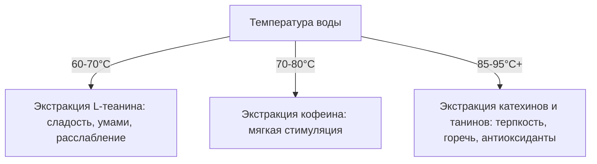

# Углубление в биохимию чая

Чайный лист — это сложнейшая биохимическая система. Уникальный вкус, аромат, цвет настоя и воздействие чая на организм человека определяются балансом органических соединений, который меняется на каждом этапе обработки и заваривания листа.

## 1. Ключевые биохимические компоненты чайного листа

Химический состав сухого вещества чайного листа включает тысячи соединений, но основные эффекты и вкусовой профиль формируют четыре группы веществ:

### 🔬 Полифенолы и Катехины
Полифенолы составляют от 20% до 35% сухой массы чайного листа. Они отвечают за терпкость, горечь и антиоксидантные свойства чая.
*   **Катехины:** Составляют до 80% всех чайных полифенолов. Это мощные антиоксиданты. В свежем листе преобладают четыре катехина: эпикатехин (EC), эпикатехин галлат (ECG), эпигаллокатехин (EGC) и **эпигаллокатехин галлат (EGCG)**.
*   **EGCG (Эпигаллокатехин галлат):** Самый биологически активный и многочисленный катехин чая (около 50-60% от общего количества катехинов). Он обладает доказанными противовоспалительными свойствами, защищает сердечно-сосудистую систему, ускоряет метаболизм и нейтрализует свободные радикалы. Больше всего EGCG сохраняется в зеленых и белых чаях, так как они не проходят стадию окисления.

### 🧠 L-теанин (L-Theanine)
Уникальная аминокислота, которая содержится почти исключительно в чайном растении (и некоторых видах грибов). Составляет около 1-2% от сухого веса листа.
*   **Действие:** L-теанин легко преодолевает гематоэнцефалический барьер и напрямую воздействует на мозг. Он стимулирует выработку альфа-волн, которые связаны с состоянием «спокойного бодрствования», глубокой концентрации и снижения уровня стресса без сонливости. Также теанин способствует синтезу дофамина и ГАМК.
*   **Вкус:** Придает чайному настою приятную сладость и вкус *умами*.

### ⚡ Кофеин (Теин)
Алкалоид, составляющий 2-5% сухой массы листа.
*   **Особенность:** В чае кофеин находится не в свободном виде (как в кофе), а в связке с чайными танинами (полифенолами), образуя *таннат кофеина*. Это соединение медленнее расщепляется в желудочно-кишечном тракте. В результате чайный кофеин всасывается постепенно, обеспечивая мягкий и пролонгированный тонизирующий эффект без резких скачков давления и учащенного сердцебиения.

### 🧪 Ферменты (Энзимы)
В чайном листе важнейшую роль играют ферменты **Полифенолоксидаза (PPO)** и **Пероксидаза (POD)**. В живой клетке они отделены от полифенолов. При сминании и скручивании чайного листа клеточные мембраны разрушаются, ферменты вступают в контакт с катехинами и кислородом, запуская процесс ферментативного окисления.

---

## 2. Биохимические трансформации чайного листа

Химический состав чая кардинально меняется под влиянием технологии обработки:

### 1️⃣ Окисление (Энзиматический процесс)
Применяется при производстве улунов и красных (черных) чаев. 
*   Под действием полифенолоксидазы простые катехины (бесцветные и горькие) окисляются и полимеризуются, превращаясь в новые соединения:
    *   **Теафлавины (Theaflavins — TF):** Желто-оранжевые пигменты. Дают настою яркость, свежесть, живость и терпкость.
    *   **Теарубигины (Thearubigins — TR):** Красно-коричневые полимеры. Обеспечивают полноту тела настоя, его насыщенность, глубину цвета и сладковатое послевкусие.
*   В зеленом и белом чае ферменты инактивируют нагревом (процесс *Шацин* — «убийство зелени») на самых ранних этапах, благодаря чему катехины остаются неизменными.

### 2️⃣ Микробная ферментация (Постферментация)
Характерна для Хэй Ча (темных чаев) и, в особенности, Шу Пуэра.
*   В отличие от окисления, это неферментативный, микробный процесс. Во время влажного скирдования (*Во Дуй*) под воздействием тепла, влаги и микроорганизмов (в основном грибка *Aspergillus niger*, дрожжей и бактерий) полифенолы подвергаются глубокому распаду и полимеризации.
*   Большинство катехинов, теафлавинов и теарубигинов превращаются в **Теаброунины (Theabrownins — TB)** — темные, водорастворимые полимеры. Теаброунины лишены горечи и терпкости, что придает Шу Пуэру его знаменитую мягкость, бархатистость, древесно-землистый профиль и темный, почти непрозрачный цвет настоя. Кроме того, этот процесс снижает содержание активного свободного кофеина, делая напиток мягким для желудка.

---

## 3. Химия заваривания и экстракции

Скорость и объем перехода веществ в настой зависят от температуры воды и времени настаивания:

*   **Зеленый и белый чай** рекомендуется заваривать водой 70-85°C. При такой температуре экстрагируется L-теанин и умеренное количество кофеина, но минимизируется выход горьких катехинов, что делает вкус сладким и сбалансированным.
*   **Красный чай, темные улуны и пуэры** заваривают крутым кипятком (90-98°C). Высокая температура необходима для извлечения тяжелых полимерных молекул (теарубигинов, теаброунинов) и слаборастворимых эфирных масел, формирующих плотное «тело» напитка и его глубокий аромат.

---

> [!important] Золотая формула экстракции чая
> Скорость экстракции компонентов чайного листа напрямую зависит от температуры воды:
> 1. **Аминокислоты (L-теанин):** растворяются первыми при температуре от 60°C, придавая настою сладость и вкус умами.
> 2. **Кофеин:** активно переходит в воду при 70-80°C.
> 3. **Катехины и танины:** требуют температуры выше 85°C для полной экстракции.
> Если заваривать нежный зеленый или белый чай крутым кипятком, катехины мгновенно выделятся в избытке, маскируя сладость теанина выраженной горечью и терпкостью.
