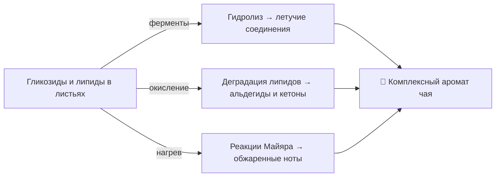

---
tags:
  - чай
  - аромат
  - биохимия
  - улун
  - ферментация
cssclass: tea-notes
---

Формирование аромата чая — это **многоступенчатый биохимический процесс**, зависящий от:
- технологии обработки листа;
- степени **окисления / ферментации**;
- исходного **химического состава**茶 (чайного листа).

> 💬 Три основных механизма ароматогенеза:
> 1️⃣ Гидролиз  
> 2️⃣ Окислительная деградация липидов  
> 3️⃣ Нагрев

---

## 1️⃣ Гидролиз

Гидролиз — это **расщепление сложных органических соединений**, чаще всего гликозидов, под действием **ферментов или воды**.  
Он высвобождает скрытые ароматические молекулы, превращая предшественники во **летучие соединения**, создающие характерный аромат.

🫖 **Улуны** особенно зависят от гидролиза: при встряхивании листа активируются ферменты, и запускаются цепочки ароматических реакций.

> 🪷 *Пример:*  
> **Те Гуань Инь (Железная Богиня Милосердия)** — цветочный, медовый аромат → результат активного гидролиза гликозидов.

---

## 2️⃣ Окислительная деградация липидов

**Липиды** в чайных листьях при **окислении** распадаются на **альдегиды и кетоны** — вещества с насыщенным, глубоким ароматом.  
Этот процесс особенно выражен в **красных (чёрных)** чаях.

🔥 **Красный чай (Hong Cha)**  
Полная ферментация активирует липидную деградацию, создавая букет из нот:
- мёда 🍯  
- сухофруктов 🍑  
- шоколада 🍫  
- лёгких специй 🌰  

> 🌾 *Пример:*  
> **Дянь Хун (Юньнань)** — сладковатый аромат с оттенками какао и сушёных фруктов.

---

## 3️⃣ Нагрев

Нагрев инициирует **неферментативные реакции** — карамелизацию и **реакции Майяра** (взаимодействие сахаров и аминокислот).  
Эти процессы рождают **тёплые, ореховые или обжаренные нотки**.

🍃 **Зелёные чаи** подвергаются быстрому прогреву, чтобы остановить ферментацию и сохранить свежесть.

> 🌿 *Пример:*  
> **Лунцзин (Колодец Дракона)** — свежий, травянистый аромат с лёгкими ореховыми оттенками.

---

## 🔄 Взаимосвязь процессов

---

## 📘 Краткое сравнение

| Процесс | Основные вещества | Результирующие ноты | Тип чая |
|----------|------------------|---------------------|---------|
| Гидролиз | Гликозиды → альдегиды, спирты | Цветочные, фруктовые | Улун |
| Окислительная деградация | Липиды → кетоны, альдегиды | Медовые, шоколадные | Красный |
| Нагрев | Сахара + аминокислоты | Ореховые, жареные | Зелёный |
