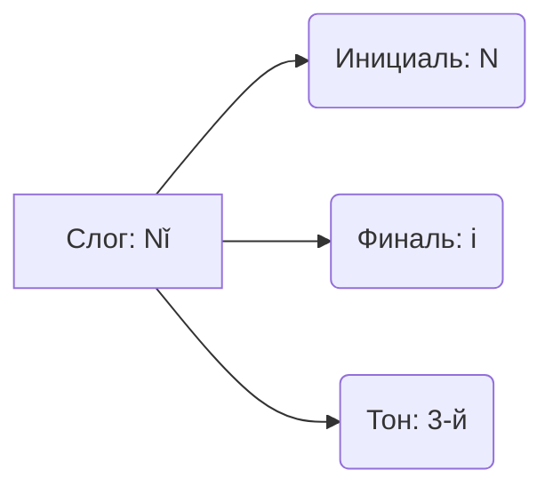

---
tags:
  - фонетика
  - пиньинь
  - справочник
  - HSK1
---
Связи: [[Трудные_Звуки]], [[Тоны_и_Правила_Изменения]]

---

## 🎧 Интерактивные таблицы (С Аудио)
Markdown не умеет воспроизводить звук, поэтому используй эти ресурсы для тренировки ушей. Это **лучшие** инструменты в сети:

> [!success] Рекомендуемые ресурсы
> *   🌐 **[Yabla Chinese Pinyin Chart](https://chinese.yabla.com/chinese-pinyin-chart.php)** — (Лучший) Видео и аудио для каждого звука.
> *   🌐 **[DigMandarin Pinyin Chart](https://www.digmandarin.com/chinese-pinyin-chart)** — Удобная навигация.
> *   📱 **Приложение:** Pleco (раздел Reference) или HelloChinese.

---

## 🧩 Анатомия слога
Китайский слог = **Инициаль** (начало) + **Финаль** (концовка) + **Тон**.

### 1. Инициали (Согласные начала)
Группировка по месту произношения. Подробнее о сложностях см. в [[🤬 Трудные звуки j q x vs zh ch sh]]

| Группа | Буквы | Комментарий |
| :--- | :--- | :--- |
| **Губные** | **b, p, m, f** | Как в русском. `P` с придыханием. |
| **Кончик языка** | **d, t, n, l** | Как в русском. `T` с придыханием. |
| **Корневые** | **g, k, h** | `H` — мягкий выдох (хэ), не хриплый. |
| **Свистящие** | **j, q, x** | **Мягкие!** (Дзь, Ць, Сь). Только с гласными `i`, `ü`. |
| **Шипящие** | **zh, ch, sh, r** | **Твердые!** Язык ложкой назад. |
| **Зубные** | **z, c, s** | З, Ц, С. Язык у зубов. |
| **Нулевые** | **w, y** | Используются, если слог начинается с гласной (`u`→`w`, `i`→`y`). |

---

### 2. Финали (Гласные концовки)

#### Простые
*   **a, o, e** (Э/Ы), **i** (И/Ы), **u** (У), **ü** (Ю).

#### Сложные (Дифтонги)
Важно читать их слитно, но с ударением на **первую** часть (обычно).
*   **ai** (ай), **ei** (эй), **ao** (ау), **ou** (оу).

#### Носовые (n / ng)
*   **an** (ан), **en** (эн), **in** (ин).
*   **ang** (ан), **eng** (эн), **ing** (ин), **ong** (он).
*   *Разница:* `n` — язык у зубов (передненёбный), `ng` — язык уходит глубоко в горло (задненёбный), как в англ. *song*.

---

## 🕵️ Секретные правила написания (Важно!)
В пиньине некоторые буквы **выпадают** на письме, но **произносятся**. Это частая причина ошибок новичков.

### 1. Правило "ui" (uei)
Если вы видите `ui`, знайте — там спряталась `e`.
*   Формула: `u` + `ei` = **ui**
*   Чтение: **Уэй** (не "уй"!)
*   *Пример:* `duì` (верно) — читаем "дуэй".
*   *Пример:* `shuǐ` (вода) — читаем "шуэй".

### 2. Правило "iu" (iou)
Если вы видите `iu`, там спряталась `o`.
*   Формула: `i` + `ou` = **iu**
*   Чтение: **Иоу** (не "ю"!)
*   *Пример:* `liù` (шесть) — читаем "лиоу".
*   *Пример:* `jiǔ` (девять) — читаем "цзиоу".

### 3. Правило "un" (uen)
Если вы видите `un`, там спряталась `e`.
*   Формула: `u` + `en` = **un**
*   Чтение: **Уэн** (не "ун"!)
*   *Пример:* `lún` (колесо) — читаем "луэн".
*   *Пример:* `kùn` (сонный) — читаем "кхуэн".

### 4. Правило точек над Ü
Буква `ü` теряет точки после **j, q, x**, но читается мягко.
*   `ju` = jü (цзю)
*   `qu` = qü (цхю)
*   `xu` = xü (сю)
*   *Но:* После `l` и `n` точки остаются! (`lǜ` - зелёный).

---

> [!tip] Лайфхак для запоминания
> Если тон стоит над `ui` или `iu`, представьте, что он раздвигает буквы и показывает скрытый звук:
> *   tuī -> tu(e)i
> *   jiǔ -> ji(o)u
