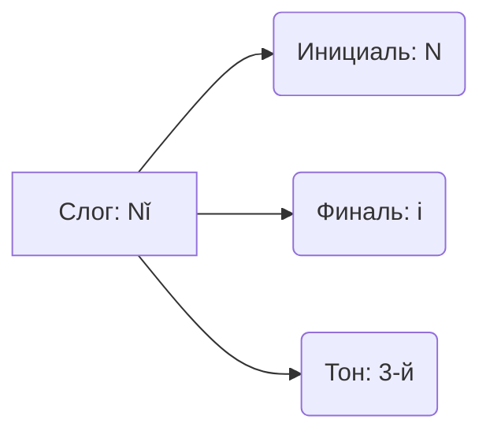

== Project Prompt ==
Generated: 2026-03-27T08:23:57.993Z
Source Directory: /home/injurka/Documents/obsidian-mark/Personal Note/Languages/Chinese
Included Files: 195
Total Size: 1300.47 KB
Format: structured
====================

=== Project File Structure ===
├── 00 Roadmaps и Оглавления
│   ├── 📊 Матрица навыков и уровней (HSK и CEFR).md
│   ├── 🧭 Roadmap A1–A2 (Полный ноль → база).md
│   ├── 🧭 Roadmap B1–B2 (Средний уровень).md
│   └── 🧭 Roadmap B2–C1 (Продвинутый уровень).md
├── 01 Фонетика
│   ├── 01 Базовые звуки и Тоны
│   │   ├── 🎵 Тоны и Правила их изменения (Tone Sandhi).md
│   │   ├── 🎹 Таблица Пиньинь.md
│   │   └── 🤬 Трудные звуки j q x vs zh ch sh.md
│   ├── 02 Слитная речь и Интонация
│   │   ├── 🎭 Эмоциональная интонация и Модальные частиц.md
│   │   ├── 🎵 Мелодика и ритм китайской речи.md
│   │   ├── 🎵 Тонирование пар (Tone Pairs).md
│   │   └── 🗣️ Слитная речь и редукция.md
│   └── 03 Акценты и Региональные особенности
│       ├── 🏴‍☠️ Рычание Эрхуа (Erhua).md
│       └── 🗺️ Акценты и региональные произношения путунхуа.md
├── 02 Иероглифика
│   ├── 01 Анатомия иероглифа
│   │   ├── 🇹🇼 Упрощенные vs Традиционные.md
│   │   ├── ✍️ Структура иероглифа.md
│   │   ├── 👀 Оптические иллюзии (Похожие иероглифы).md
│   │   ├── 🔊 Фонетики (Ключ к чтению).md
│   │   └── 🔑 214 Ключей Радикалов.md
│   ├── 02 Практика письма
│   │   ├── ⚫️ Китайская пунктуация.md
│   │   ├── ✍️ Каллиграфия.md
│   │   ├── ✍️ Порядок черт и Базовые правила письма.md
│   │   └── 📝 Бумага для прописей (Тяньцзыгэ и Мицзыгэ).md
│   └── 03 Стратегии изучения и чтения
│       ├── 🎯 Сколько иероглифов нужно знать (HSK и реальность).md
│       ├── 🔍 Стратегии чтения незнакомых текстов.md
│       └── 🧠 Мнемотехники.md
├── 03 Грамматика
│   ├── 01 Базовые элементы (Слова и Связки)
│   │   ├── ✨ Наречия степени (很, 非常, 根本, 挺).md
│   │   ├── ➕➖ Исключения Chule Yiwai.md
│   │   ├── 🏹 Направления. Wang 往 vs Xiang 向 vs Chao 朝.md
│   │   ├── 👉 Предлоги адресата 对 Dui vs 给 Gei.md
│   │   ├── 👥 Местоимения (Я, Ты, Он и Мы).md
│   │   ├── 👯 Наречие Обобщения 都 Dōu.md
│   │   ├── 📐 Числительные, дроби и проценты.md
│   │   ├── 📦 Счетные слова (Classifiers).md
│   │   ├── 🔄 Опять и Снова. Zai 再 vs You 又.md
│   │   ├── 🔗 Глаголы-связки 是 有 在.md
│   │   ├── 🔗 Союзы и Коннекторы И Но Если.md
│   │   ├── 🔮 Вероятность и предположения (估计, 可能, 大概).md
│   │   └── 🤏 Немного 有点 Youdian vs 点 Yidian.md
│   ├── 02 Время и Пространство
│   │   ├── ⏰ Скоро случится. Kuai yao... le.md
│   │   ├── ⏳ Продолжительность времени (Time Duration).md
│   │   ├── ⚡ Наречия времени 就 Jiu vs 才 Cai.md
│   │   ├── 📍 Предлоги места и расстояния Cong Li Gen.md
│   │   ├── 🔢 Разы и Повторения. Ci 次 vs Bian 遍.md
│   │   ├── 🔢 Числа Даты Время.md
│   │   └── 🖼️ Предложения наличия (На стене висит...).md
│   ├── 03 Глагольная группа и Аспекты
│   │   ├── ⏳ Аспектные частицы 了 着 过.md
│   │   ├── ⛔ Отрицания Не Bù vs Не было Méi.md
│   │   ├── 💔 Раздельно-слитные глаголы 离合词 Liheci.md
│   │   ├── 🔱 Триада De 的 地 得.md
│   │   ├── 🦜 Удвоение глаголов A-A и ABAB.md
│   │   ├── 🦜 Удвоение Прилагательных AABB.md
│   │   └── 🚦 Модальные глаголы Хочу Могу Должен.md
│   ├── 04 Основные конструкции (Patterns)
│   │   ├── ⚖️ Сравнения с 比 (Bǐ).md
│   │   ├── ⛓️ Последовательные глаголы (Serial Verbs).md
│   │   ├── ❓ Как задавать вопросы (Все способы).md
│   │   ├── 🍰 Часть от целого 有的...有的... (Youde).md
│   │   ├── 🎁 Двойное дополнение.md
│   │   ├── 🏗️ Базовая структура SVO.md
│   │   ├── 👉 Побуждение. Rang 让 vs Jiao 叫 vs Shi 使.md
│   │   ├── 📈 Чем дальше тем 越来越 (Yue Lai Yue).md
│   │   ├── 📏 Конструкция Насколько 多 (Duo).md
│   │   ├── 🔍 Конструкция 是...的 (Shì... de).md
│   │   ├── 🔗 Фиксированные конструкции (Patterns).md
│   │   ├── 🤔 Риторические вопросы 难道 (Nandao).md
│   │   ├── 🤕 Пассивный залог c 被 (Bèi).md
│   │   ├── 🤲 Конструкция 把 (Bǎ).md
│   │   └── 🚫 Запрет на SHI с прилагательными.md
│   ├── 05 Комплименты
│   │   ├── ✅ Комплименты результата.md
│   │   ├── 🌡️ Комплименты степени и состояния.md
│   │   ├── 🔓 Комплименты возможности.md
│   │   └── 🧭 Комплименты направления.md
│   ├── 06 Разговорные фишки
│   │   ├── 🤔 Частица Ne 呢.md
│   │   └── 😲 Междометия и Реакции.md
│   └── 07 Текст и дискурс
│       ├── 🎭 Фокус и топикализация.md
│       ├── 💬 Косвенная речь и цитирование.md
│       └── 🔗 Дискурсивные маркеры и переходы.md
├── 04 Морфология
│   ├── 01 Основы и Морфемы
│   │   ├── 🎯 Морфемный анализ и продуктивные морфемы.md
│   │   ├── 🧩 Способы словообразования (Сложение и Аффиксы).md
│   │   ├── 🧱 Отличие слога, морфемы и слова (Словораздел).md
│   │   └── 🪢 Полусвободные морфемы (Баоцзы, Цзы, Коу).md
│   ├── 02 Аффиксы (Приставки и Суффиксы)
│   │   ├── 👥 Суффиксы множественности и лиц (men, jia, yuan).md
│   │   ├── 👶 Суффиксы существительных zi, er, tou.md
│   │   ├── 📉 Отрицательные приставки (wu, bu, fei, wei).md
│   │   ├── 🔢 Приставки и свойства di, ke, fei.md
│   │   └── 🧪 Окраска и категории xing, hua, zhe.md
│   ├── 03 Словосложение
│   │   ├── ⚖️ Атрибутивные связи (Определение + Определяемое).md
│   │   ├── 🎬 Глагольно-объектные связи (Глагол + Существительное).md
│   │   ├── 🤝 Копулятивные связи (Синоним + Синоним).md
│   │   └── 🧱 Словосложение — типы сложных слов.md
│   └── 04 Переход частей речи и Изменения
│       ├── ✂️ Аббревиатуры и сокращения слов.md
│       ├── 🎭 Заимствования и транслитерация.md
│       └── 🔄 Конверсия (переход частей речи).md
├── 05 Лексика по темам
│   ├── 01 Быт и база
│   │   ├── 🌆 Городские вывески и навигация.md
│   │   ├── 🌤️ Погода, Климат и Смог.md
│   │   ├── 🌶️ Еда, Вкусы и Способы готовки.md
│   │   ├── 🏘️ Аренда жилья и Быт.md
│   │   ├── 🏥 Аптека, лекарства и рецепты.md
│   │   ├── 🏦 Банк, почта и бюрократия.md
│   │   ├── 👨‍👩‍👧‍👦 Семейное древо (Родственники).md
│   │   ├── 👨‍🚀 Профессии и люди.md
│   │   ├── 💪 Спорт и фитнес.md
│   │   ├── 📅 Числа, Даты и Время.md
│   │   ├── 🤔 Многоликое слово 意思 (Yisi).md
│   │   ├── 🧋 Гайд по Бабл-ти (Naicha). Лед, Сахар и Топпинги.md
│   │   ├── 🧭 Стороны света и Локализаторы.md
│   │   ├── 🚄 Путешествия и Транспорт (High-Speed Rail).md
│   │   ├── 🚑 Тело и Здоровье.md
│   │   ├── 🛒 Шопинг и Торг.md
│   │   └── 🆘 Полиция и ЧП.md
│   ├── 02 Синонимы и нюансы
│   │   ├── 🆚 Говорить 说 Shuo vs 讲 Jiang vs 谈 Tan vs 聊 Liao.md
│   │   ├── 🆚 Два года 二 Er vs 两 Liang (Полный разбор).md
│   │   ├── 🆚 Думать 觉得 Juede vs 以为 Yiwei (Ошибочно полагать).md
│   │   ├── 🆚 Знать 认识 Renshi vs 知道 Zhidao.md
│   │   ├── 🆚 Мочь 会 Hui vs 能 Neng vs 可以 Keyi (Расширенная версия).md
│   │   ├── 🆚 Немного 有点儿 Youdianr vs 稍微 Shaowei vs 一点点.md
│   │   ├── 🆚 Получить 买 Mai vs 拿 Na vs 取 Qu vs 要 Yao.md
│   │   ├── 🆚 Смотреть 看 Kan vs 瞧 Qiao vs 望 Wang vs 盯 Ding.md
│   │   └── 🆚 Хотеть 想 Xiang vs 要 Yao vs 希望 Xiwang.md
│   ├── 03 Цифровая жизнь
│   │   ├── 💸 Мобильные платежи и Банкинг.md
│   │   ├── 💻 Компьютер, Офис и IT-лексика.md
│   │   ├── 📱 Интерфейс и Приложения.md
│   │   ├── 📺 Стриминговые сервисы (Bilibili, iQIYI).md
│   │   ├── 🗺️ Навигация, Карты и Такси (Didi & Gaode).md
│   │   ├── 🤳 Соцсети и WeChat.md
│   │   └── 🥡 Заказ еды (Meituan, Eleme).md
│   ├── 04 Учеба
│   │   ├── 🎓 Университетская жизнь.md
│   │   └── 📄 Резюме и Собеседование (Mianshi).md
│   ├── 05 Продвинутый уровень
│   │   ├── 🐉 Чэнъюев Идиомы.md
│   │   ├── 💼 Деловой китайский.md
│   │   ├── 📝 Письменный vs Устный язык.md
│   │   ├── 🗣️ Слова-паразиты (Filler words).md
│   │   └── 🤬 Эмоции и Ругательства (цензурные).md
│   ├── 06 Прагматика и Диалоги
│   │   ├── 💬 Small talk и светская болтовня.md
│   │   ├── 🧩 Речевые акты Просить Отказывать Предлагать.md
│   │   └── 🛒 Диалоги Магазин и Шопинг.md
│   └── 07 Природа и экология
│       ├── ♻️ Экология и раздельный сбор мусора.md
│       └── 🌿 Природа, горы и туризм.md
├── 06 Культура и страноведение
│   ├── 01 Общество и Менталитет
│   │   ├── 🎓 Гаокао (Gaokao). Экзамен, который решает судьбу.md
│   │   ├── 🎨 Цвета и Символизм. Почему невеста в красном, а покойник в белом.md
│   │   ├── 👵 Жизнь пожилых и Танцы на площадях.md
│   │   ├── 👺 Лицо (Mianzi) и Связи (Guanxi).md
│   │   ├── 🥢 Столовый этикет. Табу палочек и кто где сидит.md
│   │   └── 🆔 Китайские имена. Почему их три.md
│   ├── 02 Современная культура и Тренды
│   │   ├── ⚽ Спорт и болельщицкая культура.md
│   │   ├── 🌙 Субкультуры (Танпин, Нэйцзюань, Фоси).md
│   │   ├── 🎤 Культура KTV. Больше чем просто пение.md
│   │   ├── 🎬 Кино, дорамы и жанры.md
│   │   ├── 🎶 Музыка, мандопоп и рэп.md
│   │   ├── 📱 Цифровой сленг 666 и 520.md
│   │   └── 📸 Визуальная эстетика и тренды Xiaohongshu.md
│   ├── 03 География, История и Традиции
│   │   ├── 🌏 География и Диалекты.md
│   │   ├── 🏙️ Система городов (Tier 1-2-3).md
│   │   ├── 🏥 Традиционная Китайская Медицина (TCM).md
│   │   ├── 🏮 Праздники Китая Традиции и Даты.md
│   │   └── 📜 История языка От костей дракона до смартфона.md
│   ├── 04 Современный язык и тренды
│   │   ├── 🎮 Язык игр и стримов.md
│   │   ├── 📱 Интернет-мемы и устойчивые формулы.md
│   │   └── 🧵 Шаблонные фразы из чатов.md
│   └── MOC Карта раздела Культура.md
├── 07 Ресурсы и стратегия
│   ├── 01 Инструменты и Стратегия
│   │   ├── ⌨️ Китайский ввод (Pinyin Input).md
│   │   ├── 📚 Учебники и Словари.md
│   │   ├── 📝 Подготовка к HSK. Структура экзамена.md
│   │   └── 🤖 Промпты для AI-учителя.md
│   ├── 02 Аудирование и Насмотренность
│   │   ├── 🎧 Аудио-марафон 30 дней.md
│   │   ├── 🎧 Аудирование подкасты кино.md
│   │   └── 📺 Плейлист сериалов и шоу по уровням.md
│   ├── 03 Говорение и Общение
│   │   ├── 🎙️ Запись и самооценка речи.md
│   │   ├── 🗣️ Техника Shadowing (Теневой повтор).md
│   │   └── 🗣️ Языковой обмен (Правила и этикет).md
│   ├── 04 Чтение и Перевод
│   │   ├── 🎯 Ложные друзья переводчика.md
│   │   ├── 📖 Чтение (Стратегии и скорочтение).md
│   │   ├── 🔄 Переводческие стратегии (Ru-Zh и Zh-Ru).md
│   │   └── 🧩 Тренажер перевода (тексты с разбором).md
│   └── 05 Письмо и Сочинение
│       ├── 👂 Диктант (Тинсе).md
│       └── 🖊️ Техника свободного письма (Free Writing).md
├── 08 Подготовка к HSKK
│   ├── 🎙️ Обзор экзамена HSKK (Структура и Уровни).md
│   ├── 🎯 HSKK Высший уровень — аргументация и анализ.md
│   ├── 🎯 HSKK Начальный уровень — стратегии и шаблоны.md
│   ├── 🎯 HSKK Средний уровень — переход к связной речи.md
│   ├── 📈 Критерии оценки HSKK (что проверяют).md
│   └── 🗣 HSKK Устный экзамен (Обзор).md
├── 09 Систематизация и ошибки
│   ├── 🃏 Карточки Anki и плагины Obsidian.md
│   ├── 📅 Настройка Anki под лексику HSK 3.0.md
│   ├── 📈 Планирование обучения и трекинг прогресса.md
│   ├── 🤕 Типичные ошибки B2–C1.md
│   ├── 🤕 Частые ошибки русскоязычных.md
│   ├── 🧠 Метанавыки изучения языков.md
│   └── 🧪 Диагностические мини-тесты по грамматике.md
├── 10 Разговорные стратегии
│   ├── 📞 Телефонные разговоры и голосовые сообщения.md
│   ├── 🔥 Горячие темы и как их обходить.md
│   ├── 🗓️ Светские ритуалы при первом знакомстве.md
│   ├── 🗣️ Искусство переспрашивания.md
│   ├── 🤝 Стратегии ведения переговоров и убеждения.md
│   └── 😄 Юмор, ирония и сарказм.md
└── Chinese Knowledge Base.md
============================

=== File List ===
- 00 Roadmaps и Оглавления/📊 Матрица навыков и уровней (HSK и CEFR).md (7.30 KB)
- 00 Roadmaps и Оглавления/🧭 Roadmap A1–A2 (Полный ноль → база).md (8.59 KB)
- 00 Roadmaps и Оглавления/🧭 Roadmap B1–B2 (Средний уровень).md (7.70 KB)
- 00 Roadmaps и Оглавления/🧭 Roadmap B2–C1 (Продвинутый уровень).md (7.70 KB)
- 01 Фонетика/01 Базовые звуки и Тоны/🎵 Тоны и Правила их изменения (Tone Sandhi).md (4.97 KB)
- 01 Фонетика/01 Базовые звуки и Тоны/🎹 Таблица Пиньинь.md (4.75 KB)
- 01 Фонетика/01 Базовые звуки и Тоны/🤬 Трудные звуки j q x vs zh ch sh.md (4.58 KB)
- 01 Фонетика/02 Слитная речь и Интонация/🎭 Эмоциональная интонация и Модальные частиц.md (6.22 KB)
- 01 Фонетика/02 Слитная речь и Интонация/🎵 Мелодика и ритм китайской речи.md (0.00 KB)
- 01 Фонетика/02 Слитная речь и Интонация/🎵 Тонирование пар (Tone Pairs).md (7.50 KB)
- 01 Фонетика/02 Слитная речь и Интонация/🗣️ Слитная речь и редукция.md (0.00 KB)
- 01 Фонетика/03 Акценты и Региональные особенности/🏴‍☠️ Рычание Эрхуа (Erhua).md (8.01 KB)
- 01 Фонетика/03 Акценты и Региональные особенности/🗺️ Акценты и региональные произношения путунхуа.md (0.00 KB)
- 02 Иероглифика/01 Анатомия иероглифа/🇹🇼 Упрощенные vs Традиционные.md (8.78 KB)
- 02 Иероглифика/01 Анатомия иероглифа/✍️ Структура иероглифа.md (8.68 KB)
- 02 Иероглифика/01 Анатомия иероглифа/👀 Оптические иллюзии (Похожие иероглифы).md (9.21 KB)
- 02 Иероглифика/01 Анатомия иероглифа/🔊 Фонетики (Ключ к чтению).md (4.88 KB)
- 02 Иероглифика/01 Анатомия иероглифа/🔑 214 Ключей Радикалов.md (15.64 KB)
- 02 Иероглифика/02 Практика письма/⚫️ Китайская пунктуация.md (7.42 KB)
- 02 Иероглифика/02 Практика письма/✍️ Каллиграфия.md (7.61 KB)
- 02 Иероглифика/02 Практика письма/✍️ Порядок черт и Базовые правила письма.md (7.48 KB)
- 02 Иероглифика/02 Практика письма/📝 Бумага для прописей (Тяньцзыгэ и Мицзыгэ).md (7.51 KB)
- 02 Иероглифика/03 Стратегии изучения и чтения/🎯 Сколько иероглифов нужно знать (HSK и реальность).md (4.78 KB)
- 02 Иероглифика/03 Стратегии изучения и чтения/🔍 Стратегии чтения незнакомых текстов.md (7.82 KB)
- 02 Иероглифика/03 Стратегии изучения и чтения/🧠 Мнемотехники.md (7.89 KB)
- 03 Грамматика/01 Базовые элементы (Слова и Связки)/✨ Наречия степени (很, 非常, 根本, 挺).md (9.36 KB)
- 03 Грамматика/01 Базовые элементы (Слова и Связки)/➕➖ Исключения Chule Yiwai.md (4.56 KB)
- 03 Грамматика/01 Базовые элементы (Слова и Связки)/🏹 Направления. Wang 往 vs Xiang 向 vs Chao 朝.md (9.98 KB)
- 03 Грамматика/01 Базовые элементы (Слова и Связки)/👉 Предлоги адресата 对 Dui vs 给 Gei.md (5.91 KB)
- 03 Грамматика/01 Базовые элементы (Слова и Связки)/👥 Местоимения (Я, Ты, Он и Мы).md (11.92 KB)
- 03 Грамматика/01 Базовые элементы (Слова и Связки)/👯 Наречие Обобщения 都 Dōu.md (5.25 KB)
- 03 Грамматика/01 Базовые элементы (Слова и Связки)/📐 Числительные, дроби и проценты.md (0.00 KB)
- 03 Грамматика/01 Базовые элементы (Слова и Связки)/📦 Счетные слова (Classifiers).md (12.81 KB)
- 03 Грамматика/01 Базовые элементы (Слова и Связки)/🔄 Опять и Снова. Zai 再 vs You 又.md (7.86 KB)
- 03 Грамматика/01 Базовые элементы (Слова и Связки)/🔗 Глаголы-связки 是 有 在.md (5.49 KB)
- 03 Грамматика/01 Базовые элементы (Слова и Связки)/🔗 Союзы и Коннекторы И Но Если.md (6.01 KB)
- 03 Грамматика/01 Базовые элементы (Слова и Связки)/🔮 Вероятность и предположения (估计, 可能, 大概).md (9.50 KB)
- 03 Грамматика/01 Базовые элементы (Слова и Связки)/🤏 Немного 有点 Youdian vs 点 Yidian.md (5.97 KB)
- 03 Грамматика/02 Время и Пространство/⏰ Скоро случится. Kuai yao... le.md (6.41 KB)
- 03 Грамматика/02 Время и Пространство/⏳ Продолжительность времени (Time Duration).md (7.25 KB)
- 03 Грамматика/02 Время и Пространство/⚡ Наречия времени 就 Jiu vs 才 Cai.md (9.24 KB)
- 03 Грамматика/02 Время и Пространство/📍 Предлоги места и расстояния Cong Li Gen.md (5.93 KB)
- 03 Грамматика/02 Время и Пространство/🔢 Разы и Повторения. Ci 次 vs Bian 遍.md (8.22 KB)
- 03 Грамматика/02 Время и Пространство/🔢 Числа Даты Время.md (6.75 KB)
- 03 Грамматика/02 Время и Пространство/🖼️ Предложения наличия (На стене висит...).md (6.90 KB)
- 03 Грамматика/03 Глагольная группа и Аспекты/⏳ Аспектные частицы 了 着 过.md (10.44 KB)
- 03 Грамматика/03 Глагольная группа и Аспекты/⛔ Отрицания Не Bù vs Не было Méi.md (6.09 KB)
- 03 Грамматика/03 Глагольная группа и Аспекты/💔 Раздельно-слитные глаголы 离合词 Liheci.md (8.21 KB)
- 03 Грамматика/03 Глагольная группа и Аспекты/🔱 Триада De 的 地 得.md (5.74 KB)
- 03 Грамматика/03 Глагольная группа и Аспекты/🦜 Удвоение глаголов A-A и ABAB.md (6.20 KB)
- 03 Грамматика/03 Глагольная группа и Аспекты/🦜 Удвоение Прилагательных AABB.md (3.63 KB)
- 03 Грамматика/03 Глагольная группа и Аспекты/🚦 Модальные глаголы Хочу Могу Должен.md (5.86 KB)
- 03 Грамматика/04 Основные конструкции (Patterns)/⚖️ Сравнения с 比 (Bǐ).md (6.20 KB)
- 03 Грамматика/04 Основные конструкции (Patterns)/⛓️ Последовательные глаголы (Serial Verbs).md (6.41 KB)
- 03 Грамматика/04 Основные конструкции (Patterns)/❓ Как задавать вопросы (Все способы).md (6.57 KB)
- 03 Грамматика/04 Основные конструкции (Patterns)/🍰 Часть от целого 有的...有的... (Youde).md (6.57 KB)
- 03 Грамматика/04 Основные конструкции (Patterns)/🎁 Двойное дополнение.md (6.49 KB)
- 03 Грамматика/04 Основные конструкции (Patterns)/🏗️ Базовая структура SVO.md (7.14 KB)
- 03 Грамматика/04 Основные конструкции (Patterns)/👉 Побуждение. Rang 让 vs Jiao 叫 vs Shi 使.md (8.86 KB)
- 03 Грамматика/04 Основные конструкции (Patterns)/📈 Чем дальше тем 越来越 (Yue Lai Yue).md (5.64 KB)
- 03 Грамматика/04 Основные конструкции (Patterns)/📏 Конструкция Насколько 多 (Duo).md (7.98 KB)
- 03 Грамматика/04 Основные конструкции (Patterns)/🔍 Конструкция 是...的 (Shì... de).md (6.64 KB)
- 03 Грамматика/04 Основные конструкции (Patterns)/🔗 Фиксированные конструкции (Patterns).md (7.34 KB)
- 03 Грамматика/04 Основные конструкции (Patterns)/🤔 Риторические вопросы 难道 (Nandao).md (6.58 KB)
- 03 Грамматика/04 Основные конструкции (Patterns)/🤕 Пассивный залог c 被 (Bèi).md (7.13 KB)
- 03 Грамматика/04 Основные конструкции (Patterns)/🤲 Конструкция 把 (Bǎ).md (6.83 KB)
- 03 Грамматика/04 Основные конструкции (Patterns)/🚫 Запрет на SHI с прилагательными.md (5.74 KB)
- 03 Грамматика/05 Комплименты/✅ Комплименты результата.md (5.96 KB)
- 03 Грамматика/05 Комплименты/🌡️ Комплименты степени и состояния.md (7.78 KB)
- 03 Грамматика/05 Комплименты/🔓 Комплименты возможности.md (6.91 KB)
- 03 Грамматика/05 Комплименты/🧭 Комплименты направления.md (6.83 KB)
- 03 Грамматика/06 Разговорные фишки/🤔 Частица Ne 呢.md (7.05 KB)
- 03 Грамматика/06 Разговорные фишки/😲 Междометия и Реакции.md (8.79 KB)
- 03 Грамматика/07 Текст и дискурс/🎭 Фокус и топикализация.md (0.00 KB)
- 03 Грамматика/07 Текст и дискурс/💬 Косвенная речь и цитирование.md (0.00 KB)
- 03 Грамматика/07 Текст и дискурс/🔗 Дискурсивные маркеры и переходы.md (0.00 KB)
- 04 Морфология/01 Основы и Морфемы/🎯 Морфемный анализ и продуктивные морфемы.md (12.58 KB)
- 04 Морфология/01 Основы и Морфемы/🧩 Способы словообразования (Сложение и Аффиксы).md (10.79 KB)
- 04 Морфология/01 Основы и Морфемы/🧱 Отличие слога, морфемы и слова (Словораздел).md (0.00 KB)
- 04 Морфология/01 Основы и Морфемы/🪢 Полусвободные морфемы (Баоцзы, Цзы, Коу).md (0.00 KB)
- 04 Морфология/02 Аффиксы (Приставки и Суффиксы)/👥 Суффиксы множественности и лиц (men, jia, yuan).md (0.00 KB)
- 04 Морфология/02 Аффиксы (Приставки и Суффиксы)/👶 Суффиксы существительных zi, er, tou.md (8.62 KB)
- 04 Морфология/02 Аффиксы (Приставки и Суффиксы)/📉 Отрицательные приставки (wu, bu, fei, wei).md (0.00 KB)
- 04 Морфология/02 Аффиксы (Приставки и Суффиксы)/🔢 Приставки и свойства di, ke, fei.md (7.53 KB)
- 04 Морфология/02 Аффиксы (Приставки и Суффиксы)/🧪 Окраска и категории xing, hua, zhe.md (9.03 KB)
- 04 Морфология/03 Словосложение/⚖️ Атрибутивные связи (Определение + Определяемое).md (0.00 KB)
- 04 Морфология/03 Словосложение/🎬 Глагольно-объектные связи (Глагол + Существительное).md (0.00 KB)
- 04 Морфология/03 Словосложение/🤝 Копулятивные связи (Синоним + Синоним).md (0.00 KB)
- 04 Морфология/03 Словосложение/🧱 Словосложение — типы сложных слов.md (11.51 KB)
- 04 Морфология/04 Переход частей речи и Изменения/✂️ Аббревиатуры и сокращения слов.md (0.00 KB)
- 04 Морфология/04 Переход частей речи и Изменения/🎭 Заимствования и транслитерация.md (0.00 KB)
- 04 Морфология/04 Переход частей речи и Изменения/🔄 Конверсия (переход частей речи).md (8.13 KB)
- 05 Лексика по темам/01 Быт и база/🌆 Городские вывески и навигация.md (0.00 KB)
- 05 Лексика по темам/01 Быт и база/🌤️ Погода, Климат и Смог.md (7.69 KB)
- 05 Лексика по темам/01 Быт и база/🌶️ Еда, Вкусы и Способы готовки.md (8.17 KB)
- 05 Лексика по темам/01 Быт и база/🏘️ Аренда жилья и Быт.md (7.55 KB)
- 05 Лексика по темам/01 Быт и база/🏥 Аптека, лекарства и рецепты.md (0.00 KB)
- 05 Лексика по темам/01 Быт и база/🏦 Банк, почта и бюрократия.md (0.00 KB)
- 05 Лексика по темам/01 Быт и база/👨‍👩‍👧‍👦 Семейное древо (Родственники).md (3.13 KB)
- 05 Лексика по темам/01 Быт и база/👨‍🚀 Профессии и люди.md (9.23 KB)
- 05 Лексика по темам/01 Быт и база/💪 Спорт и фитнес.md (0.00 KB)
- 05 Лексика по темам/01 Быт и база/📅 Числа, Даты и Время.md (6.48 KB)
- 05 Лексика по темам/01 Быт и база/🤔 Многоликое слово 意思 (Yisi).md (5.71 KB)
- 05 Лексика по темам/01 Быт и база/🧋 Гайд по Бабл-ти (Naicha). Лед, Сахар и Топпинги.md (8.30 KB)
- 05 Лексика по темам/01 Быт и база/🧭 Стороны света и Локализаторы.md (3.53 KB)
- 05 Лексика по темам/01 Быт и база/🚄 Путешествия и Транспорт (High-Speed Rail).md (11.39 KB)
- 05 Лексика по темам/01 Быт и база/🚑 Тело и Здоровье.md (7.90 KB)
- 05 Лексика по темам/01 Быт и база/🛒 Шопинг и Торг.md (6.60 KB)
- 05 Лексика по темам/01 Быт и база/🆘 Полиция и ЧП.md (8.39 KB)
- 05 Лексика по темам/02 Синонимы и нюансы/🆚 Говорить 说 Shuo vs 讲 Jiang vs 谈 Tan vs 聊 Liao.md (0.00 KB)
- 05 Лексика по темам/02 Синонимы и нюансы/🆚 Два года 二 Er vs 两 Liang (Полный разбор).md (5.29 KB)
- 05 Лексика по темам/02 Синонимы и нюансы/🆚 Думать 觉得 Juede vs 以为 Yiwei (Ошибочно полагать).md (5.62 KB)
- 05 Лексика по темам/02 Синонимы и нюансы/🆚 Знать 认识 Renshi vs 知道 Zhidao.md (3.09 KB)
- 05 Лексика по темам/02 Синонимы и нюансы/🆚 Мочь 会 Hui vs 能 Neng vs 可以 Keyi (Расширенная версия).md (7.36 KB)
- 05 Лексика по темам/02 Синонимы и нюансы/🆚 Немного 有点儿 Youdianr vs 稍微 Shaowei vs 一点点.md (0.00 KB)
- 05 Лексика по темам/02 Синонимы и нюансы/🆚 Получить 买 Mai vs 拿 Na vs 取 Qu vs 要 Yao.md (0.00 KB)
- 05 Лексика по темам/02 Синонимы и нюансы/🆚 Смотреть 看 Kan vs 瞧 Qiao vs 望 Wang vs 盯 Ding.md (0.00 KB)
- 05 Лексика по темам/02 Синонимы и нюансы/🆚 Хотеть 想 Xiang vs 要 Yao vs 希望 Xiwang.md (0.00 KB)
- 05 Лексика по темам/03 Цифровая жизнь/💸 Мобильные платежи и Банкинг.md (17.11 KB)
- 05 Лексика по темам/03 Цифровая жизнь/💻 Компьютер, Офис и IT-лексика.md (17.32 KB)
- 05 Лексика по темам/03 Цифровая жизнь/📱 Интерфейс и Приложения.md (12.46 KB)
- 05 Лексика по темам/03 Цифровая жизнь/📺 Стриминговые сервисы (Bilibili, iQIYI).md (18.19 KB)
- 05 Лексика по темам/03 Цифровая жизнь/🗺️ Навигация, Карты и Такси (Didi & Gaode).md (16.20 KB)
- 05 Лексика по темам/03 Цифровая жизнь/🤳 Соцсети и WeChat.md (10.54 KB)
- 05 Лексика по темам/03 Цифровая жизнь/🥡 Заказ еды (Meituan, Eleme).md (17.93 KB)
- 05 Лексика по темам/04 Учеба/🎓 Университетская жизнь.md (10.79 KB)
- 05 Лексика по темам/04 Учеба/📄 Резюме и Собеседование (Mianshi).md (11.05 KB)
- 05 Лексика по темам/05 Продвинутый уровень/🐉 Чэнъюев Идиомы.md (7.68 KB)
- 05 Лексика по темам/05 Продвинутый уровень/💼 Деловой китайский.md (7.45 KB)
- 05 Лексика по темам/05 Продвинутый уровень/📝 Письменный vs Устный язык.md (8.04 KB)
- 05 Лексика по темам/05 Продвинутый уровень/🗣️ Слова-паразиты (Filler words).md (8.66 KB)
- 05 Лексика по темам/05 Продвинутый уровень/🤬 Эмоции и Ругательства (цензурные).md (7.78 KB)
- 05 Лексика по темам/06 Прагматика и Диалоги/💬 Small talk и светская болтовня.md (9.59 KB)
- 05 Лексика по темам/06 Прагматика и Диалоги/🧩 Речевые акты Просить Отказывать Предлагать.md (9.70 KB)
- 05 Лексика по темам/06 Прагматика и Диалоги/🛒 Диалоги Магазин и Шопинг.md (6.85 KB)
- 05 Лексика по темам/07 Природа и экология/♻️ Экология и раздельный сбор мусора.md (0.00 KB)
- 05 Лексика по темам/07 Природа и экология/🌿 Природа, горы и туризм.md (0.00 KB)
- 06 Культура и страноведение/01 Общество и Менталитет/🎓 Гаокао (Gaokao). Экзамен, который решает судьбу.md (9.50 KB)
- 06 Культура и страноведение/01 Общество и Менталитет/🎨 Цвета и Символизм. Почему невеста в красном, а покойник в белом.md (8.02 KB)
- 06 Культура и страноведение/01 Общество и Менталитет/👵 Жизнь пожилых и Танцы на площадях.md (10.21 KB)
- 06 Культура и страноведение/01 Общество и Менталитет/👺 Лицо (Mianzi) и Связи (Guanxi).md (8.84 KB)
- 06 Культура и страноведение/01 Общество и Менталитет/🥢 Столовый этикет. Табу палочек и кто где сидит.md (7.97 KB)
- 06 Культура и страноведение/01 Общество и Менталитет/🆔 Китайские имена. Почему их три.md (8.32 KB)
- 06 Культура и страноведение/02 Современная культура и Тренды/⚽ Спорт и болельщицкая культура.md (0.00 KB)
- 06 Культура и страноведение/02 Современная культура и Тренды/🌙 Субкультуры (Танпин, Нэйцзюань, Фоси).md (0.00 KB)
- 06 Культура и страноведение/02 Современная культура и Тренды/🎤 Культура KTV. Больше чем просто пение.md (9.11 KB)
- 06 Культура и страноведение/02 Современная культура и Тренды/🎬 Кино, дорамы и жанры.md (0.00 KB)
- 06 Культура и страноведение/02 Современная культура и Тренды/🎶 Музыка, мандопоп и рэп.md (0.00 KB)
- 06 Культура и страноведение/02 Современная культура и Тренды/📱 Цифровой сленг 666 и 520.md (7.59 KB)
- 06 Культура и страноведение/02 Современная культура и Тренды/📸 Визуальная эстетика и тренды Xiaohongshu.md (0.00 KB)
- 06 Культура и страноведение/03 География, История и Традиции/🌏 География и Диалекты.md (8.28 KB)
- 06 Культура и страноведение/03 География, История и Традиции/🏙️ Система городов (Tier 1-2-3).md (7.92 KB)
- 06 Культура и страноведение/03 География, История и Традиции/🏥 Традиционная Китайская Медицина (TCM).md (9.03 KB)
- 06 Культура и страноведение/03 География, История и Традиции/🏮 Праздники Китая Традиции и Даты.md (8.02 KB)
- 06 Культура и страноведение/03 География, История и Традиции/📜 История языка От костей дракона до смартфона.md (7.39 KB)
- 06 Культура и страноведение/04 Современный язык и тренды/🎮 Язык игр и стримов.md (11.51 KB)
- 06 Культура и страноведение/04 Современный язык и тренды/📱 Интернет-мемы и устойчивые формулы.md (12.13 KB)
- 06 Культура и страноведение/04 Современный язык и тренды/🧵 Шаблонные фразы из чатов.md (10.03 KB)
- 06 Культура и страноведение/MOC Карта раздела Культура.md (0.49 KB)
- 07 Ресурсы и стратегия/01 Инструменты и Стратегия/⌨️ Китайский ввод (Pinyin Input).md (9.52 KB)
- 07 Ресурсы и стратегия/01 Инструменты и Стратегия/📚 Учебники и Словари.md (8.18 KB)
- 07 Ресурсы и стратегия/01 Инструменты и Стратегия/📝 Подготовка к HSK. Структура экзамена.md (8.34 KB)
- 07 Ресурсы и стратегия/01 Инструменты и Стратегия/🤖 Промпты для AI-учителя.md (9.41 KB)
- 07 Ресурсы и стратегия/02 Аудирование и Насмотренность/🎧 Аудио-марафон 30 дней.md (8.08 KB)
- 07 Ресурсы и стратегия/02 Аудирование и Насмотренность/🎧 Аудирование подкасты кино.md (7.17 KB)
- 07 Ресурсы и стратегия/02 Аудирование и Насмотренность/📺 Плейлист сериалов и шоу по уровням.md (8.81 KB)
- 07 Ресурсы и стратегия/03 Говорение и Общение/🎙️ Запись и самооценка речи.md (0.00 KB)
- 07 Ресурсы и стратегия/03 Говорение и Общение/🗣️ Техника Shadowing (Теневой повтор).md (7.82 KB)
- 07 Ресурсы и стратегия/03 Говорение и Общение/🗣️ Языковой обмен (Правила и этикет).md (0.00 KB)
- 07 Ресурсы и стратегия/04 Чтение и Перевод/🎯 Ложные друзья переводчика.md (0.00 KB)
- 07 Ресурсы и стратегия/04 Чтение и Перевод/📖 Чтение (Стратегии и скорочтение).md (8.50 KB)
- 07 Ресурсы и стратегия/04 Чтение и Перевод/🔄 Переводческие стратегии (Ru-Zh и Zh-Ru).md (0.00 KB)
- 07 Ресурсы и стратегия/04 Чтение и Перевод/🧩 Тренажер перевода (тексты с разбором).md (0.00 KB)
- 07 Ресурсы и стратегия/05 Письмо и Сочинение/👂 Диктант (Тинсе).md (0.00 KB)
- 07 Ресурсы и стратегия/05 Письмо и Сочинение/🖊️ Техника свободного письма (Free Writing).md (0.00 KB)
- 08 Подготовка к HSKK/🎙️ Обзор экзамена HSKK (Структура и Уровни).md (9.83 KB)
- 08 Подготовка к HSKK/🎯 HSKK Высший уровень — аргументация и анализ.md (15.67 KB)
- 08 Подготовка к HSKK/🎯 HSKK Начальный уровень — стратегии и шаблоны.md (9.92 KB)
- 08 Подготовка к HSKK/🎯 HSKK Средний уровень — переход к связной речи.md (10.85 KB)
- 08 Подготовка к HSKK/📈 Критерии оценки HSKK (что проверяют).md (13.66 KB)
- 08 Подготовка к HSKK/🗣 HSKK Устный экзамен (Обзор).md (13.03 KB)
- 09 Систематизация и ошибки/🃏 Карточки Anki и плагины Obsidian.md (8.13 KB)
- 09 Систематизация и ошибки/📅 Настройка Anki под лексику HSK 3.0.md (0.00 KB)
- 09 Систематизация и ошибки/📈 Планирование обучения и трекинг прогресса.md (8.06 KB)
- 09 Систематизация и ошибки/🤕 Типичные ошибки B2–C1.md (8.48 KB)
- 09 Систематизация и ошибки/🤕 Частые ошибки русскоязычных.md (7.67 KB)
- 09 Систематизация и ошибки/🧠 Метанавыки изучения языков.md (8.15 KB)
- 09 Систематизация и ошибки/🧪 Диагностические мини-тесты по грамматике.md (0.00 KB)
- 10 Разговорные стратегии/📞 Телефонные разговоры и голосовые сообщения.md (7.40 KB)
- 10 Разговорные стратегии/🔥 Горячие темы и как их обходить.md (9.38 KB)
- 10 Разговорные стратегии/🗓️ Светские ритуалы при первом знакомстве.md (7.82 KB)
- 10 Разговорные стратегии/🗣️ Искусство переспрашивания.md (9.41 KB)
- 10 Разговорные стратегии/🤝 Стратегии ведения переговоров и убеждения.md (9.01 KB)
- 10 Разговорные стратегии/😄 Юмор, ирония и сарказм.md (7.80 KB)
- Chinese Knowledge Base.md (32.91 KB)
=================

=== File Contents ===

--- File: 00 Roadmaps и Оглавления/📊 Матрица навыков и уровней (HSK и CEFR).md ---

---
tags:
  - hsk
  - cefr
  - планирование
  - уровни
  - стратегия
cssclasses:
  - cn-note
---

  能力标准
  

    <h1>Матрица навыков и уровней (HSK и CEFR)</h1>
    nénglì biāozhǔn
    Честное сравнение китайских экзаменов с европейской системой. Что вы реально можете на каждом этапе.
  

Связи: [[📝 Подготовка к HSK. Структура экзамена]], [[🎯 Сколько иероглифов нужно знать (HSK и реальность)]], [[🧭 Roadmap A1–A2 (Полный ноль → база)]]

---

## 🛑 Главный миф: HSK 6 ≠ Уровень C2
Официальный Китай (Ханьбань) долгие годы заявлял, что высший уровень старого экзамена HSK 6 соответствует европейскому уровню носителя (C2). **Это неправда.** 
Ассоциация преподавателей китайского языка в Европе давно доказала: человек со старым HSK 6 с трудом дотягивает до крепкого B2 / слабого C1. 

Именно поэтому в 2021 году Китай запустил **новую систему HSK 3.0 (9 уровней)**, чтобы честно привести экзамен к мировым стандартам CEFR.

---

## 📊 Сводная матрица уровней

В таблице ниже показано, как соотносятся Европейская шкала (CEFR), старый HSK 2.0 (который всё еще сдают) и новый HSK 3.0 (к которому постепенно переходят).

| CEFR | Старый HSK (2.0) | Новый HSK (3.0) | Слов (HSK 3.0) | Статус / Название |
| :---: | :---: | :---: | :---: | :--- |
| **A1** | HSK 1 – 2 | **HSK 1** | ~500 | 👶 **Выживание.** Базовые фразы. |
| **A2** | HSK 3 | **HSK 2** | ~1 200 | 🎒 **Турист.** Бытовой комфорт. |
| **B1** | HSK 4 | **HSK 3 – 4** | ~3 200 | 🗣️ **Независимость.** Общение и дружба. |
| **B2** | HSK 5 | **HSK 5 – 6** | ~5 400 | 💼 **Профессионал.** Работа и учеба. |
| **C1** | HSK 6 | **HSK 7 – 8** | ~8 000 | 🎓 **Эксперт.** Свободное потребление. |
| **C2** | *Нет аналога* | **HSK 9** | 11 000+ | 🐉 **Мастер.** Академический язык, перевод. |

---

## 🎯 Что вы реально умеете на каждом уровне?

Забудьте про списки слов. Язык измеряется тем, **какие жизненные задачи** вы можете решить.

### 🟢 Уровень A1–A2 (Базовое выживание)
*Соответствует: Старый HSK 1-3 | Новый HSK 1-2*
* **Слух:** Понимаете очень медленную, адаптированную речь диктора. На улице не понимаете почти ничего.
* **Речь:** Можете купить кофе, спросить дорогу, сказать, что у вас болит живот, и поторговаться на рынке. Говорите короткими SVO-предложениями.
* **Чтение:** Можете прочитать меню (с картинками), ценники, простые сообщения в WeChat вроде `你在哪儿？` (Ты где?).
* **Ваш маршрут:** [[🧭 Roadmap A1–A2 (Полный ноль → база)]]

### 🟡 Уровень B1 (Уверенная независимость)
*Соответствует: Старый HSK 4 | Новый HSK 3-4*
* **Слух:** Понимаете китайцев, если они говорят с вами один на один, используют путунхуа и не используют сленг.
* **Речь:** Можете рассказать историю из прошлого, объяснить свое мнение (почему вам нравится этот фильм), решить проблему в банке или больнице. Появляются сложные связки (`不但...而且`, `把`).
* **Чтение:** Свободно переписываетесь в чатах. Читаете адаптированные тексты и посты в соцсетях со словарем.
* **Ваш маршрут:** [[🧭 Roadmap B1–B2 (Средний уровень)]]

### 🟠 Уровень B2 (Свобода и Работа)
*Соответствует: Старый HSK 5 | Новый HSK 5-6*
* **Слух:** Можете смотреть современные сериалы про жизнь (с китайскими субтитрами). Улавливаете суть новостей. Понимаете шутки.
* **Речь:** Можете пройти собеседование на китайском, участвовать в рабочих совещаниях. Речь становится плавной, вы используете базовые [[🐉 Чэнъюев Идиомы]].
* **Чтение:** Читаете оригинальные статьи на Baidu, новости, контракты и маньхуа (комиксы) без постоянного заглядывания в Pleco.
* **Ваш маршрут:** [[🧭 Roadmap B2–C1 (Продвинутый уровень)]]

### 🔴 Уровень C1–C2 (Мастерство)
*Соответствует: Старый HSK 6 | Новый HSK 7-9*
* **Слух:** Свободно смотрите китайский стендап, дебаты, исторические фильмы без субтитров. Понимаете региональные акценты.
* **Речь:** Говорите не просто правильно, а **уместно**. Чувствуете разницу между письменным и устным стилем ([[📝 Письменный vs Устный язык]]). Можете аргументированно спорить о политике, экологии и философии.
* **Чтение:** Читаете классическую литературу, научные работы. Понимаете игру слов и культурный контекст.

---

> [!warning] Иллюзия бумажного сертификата
> Сертификат HSK проверяет **пассивные** навыки (чтение и аудирование). В Китае полно иностранцев с сертификатом HSK 5, которые не могут связать двух слов при заказе лапши, потому что у них не развит речевой аппарат.
> Если хотите реальной беглости — готовьтесь не только к письменному HSK, но и к устному экзамену: [[🎙️ Обзор экзамена HSKK (Структура и Уровни)]].

--- File: 00 Roadmaps и Оглавления/🧭 Roadmap A1–A2 (Полный ноль → база).md ---

---
tags:
  - roadmap
  - a1
  - a2
  - стратегия
  - начинающим
cssclasses:
  - cn-note
---

  零到一
  

    <h1>Roadmap A1–A2</h1>
    líng dào yī
    От полного нуля до уверенной базы. Пошаговый маршрут по вашей базе знаний.
  

Связи: [[📈 Планирование обучения и трекинг прогресса]], [[📚 Учебники и Словари]], [[📝 Подготовка к HSK. Структура экзамена]]

---

Добро пожаловать в китайский язык! Это марафон, в котором главное — правильный старт. Если вы заложите кривой фундамент в фонетике или логике предложений, переучиваться будет больно.

Этот роадмап — ваш навигатор по заметкам базы знаний. Идите строго по шагам.

---

## 🎧 Этап 1: Звук — это всё (Недели 1-2)
*Китайский — тоновый язык. Забудьте про иероглифы на первые две недели. Ваша задача — настроить слух и речевой аппарат.*

1. **База звуков:** Изучите [[🎹 Таблица Пиньинь]]. Обратите внимание на скрытые правила (почему *ui* читается как *uei*).
2. **Ловушка для русских:** Сразу разберитесь с придыханием и положением языка: [[🤬 Трудные звуки j q x vs zh ch sh]].
3. **Мелодия языка:** Выучите 4 тона. Поймите, почему 3-й тон обрезается: [[🎵 Тоны и Правила их изменения (Tone Sandhi)]].
4. **Практика:** Не учите тоны по одному слогу! Сразу переходите к парам: [[🎵 Тонирование пар (Tone Pairs)]].
5. **Тренировка:** Начинайте каждый день с 10 минут [[🗣️ Техника Shadowing (Теневой повтор)]].

> [!danger] Главная ошибка на старте
> Читать пиньинь как английские буквы. `Q` — это не "Кью", `C` — это не "К", а `R` — это не русская "Р". Слушайте аудио!

---

## 🧱 Этап 2: Взлом Матрицы (Иероглифика)
*Хватит зубрить картинки. Иероглифы состоят из деталей конструктора.*

1. **Правила рисования:** Узнайте, как рука должна двигаться по бумаге: [[✍️ Порядок черт и Базовые правила письма]].
2. **Алфавит смыслов:** Ознакомьтесь с таблицей (не зубрите всю сразу, выучите топ-40): [[🔑 214 Ключей Радикалов]].
3. **Логика сборки:** Узнайте, почему 80% иероглифов подсказывают, как их читать: [[✍️ Структура иероглифа]] и [[🔊 Фонетики (Ключ к чтению)]].
4. **Хак для памяти:** Если иероглиф не запоминается, используйте [[🧠 Мнемотехники]] (сочиняйте абсурдные истории).
5. **Цифровая жизнь:** Настройте телефон и ПК: [[⌨️ Китайский ввод (Pinyin Input)]].

---

## 🏗️ Этап 3: Базовая Грамматика (Уровень A1 / HSK 1)
*В китайском нет падежей, спряжений и родов. Грамматика — это порядок слов.*

1. **Фундамент:** Железное правило поезда (SVO). Место и Время всегда идут ПЕРЕД глаголом: [[🏗️ Базовая структура SVO]].
2. **Главные слова:**
   - Кто делает: [[👥 Местоимения (Я, Ты, Он и Мы)]].
   - Числа: [[🔢 Числа Даты Время]].
3. **Святая Троица (Глаголы состояния):** Вы должны четко понимать разницу между «Быть», «Иметь» и «Находиться»: [[🔗 Глаголы-связки 是 有 在]].
4. **Смертный грех русских:** Прочитайте и запомните навсегда: [[🚫 Запрет на SHI с прилагательными]].
5. **Нет!:** Как отказывать и отрицать факты: [[⛔ Отрицания Не Bù vs Не было Méi]].
6. **Как спросить:** 5 способов задать вопрос: [[❓ Как задавать вопросы (Все способы)]].

---

## 🧗 Этап 4: Расширение Базы (Уровень A2 / HSK 2)
*Делаем речь живой и учимся рассказывать о себе.*

1. **Правило Упаковки:** Почему нельзя сказать "Два человека" и зачем нужны [[📦 Счетные слова (Classifiers)]]. (Сразу читайте: [[🆚 Два года 二 Er vs 两 Liang (Полный разбор)]]).
2. **Хочу и Могу:** Учимся выражать желания и навыки: [[🚦 Модальные глаголы Хочу Могу Должен]].
3. **Где и Куда:** 
   - Предлоги: [[📍 Предлоги места и расстояния Cong Li Gen]].
   - Стороны: [[🧭 Стороны света и Локализаторы]].
4. **Прошлое:** Как сказать, что действие закончено: [[⏳ Аспектные частицы 了 着 过]]. (Начните только с частицы "Le" `了`).
5. **Принадлежность и Описание:** Как работает самая частая частица языка: [[🔱 Триада De 的 地 得]] (Сфокусируйтесь пока только на `的`).
6. **Логический клей:** Как строить сложные предложения без ошибок: [[🔗 Союзы и Коннекторы И Но Если]].

---

## 🎒 Этап 5: Словарь для Выживания (Лексика)
*Слова, которые нужно знать, чтобы не пропасть в Китае.*

*   **Семья и люди:** [[👨‍👩‍👧‍👦 Семейное древо (Родственники)]], [[👨‍🚀 Профессии и люди]].
*   **Еда (База):** [[🌶️ Еда, Вкусы и Способы готовки]].
*   **Деньги и Покупки:** [[🛒 Шопинг и Торг]].
*   **Здоровье:** [[🚑 Тело и Здоровье]].
*   **Первые нюансы (Не путать!):**
    *   [[🆚 Знать 认识 Renshi vs 知道 Zhidao]]
    *   [[🆚 Думать 觉得 Juede vs 以为 Yiwei (Ошибочно полагать)]]

---

## 🛠️ Этап 6: Инструменты и Рутина (Метанавыки)
*Как не бросить на полпути.*

1. **Повторение:** Настройте систему карточек, иначе забудете все иероглифы через неделю: [[🃏 Карточки Anki и плагины Obsidian]].
2. **Слушание:** Начинайте "тереть уши" с первого дня: [[🎧 Аудирование подкасты кино]].
3. **Чтение:** Узнайте, как не спотыкаться о каждое слово: [[📖 Чтение (Стратегии и скорочтение)]].
4. **Самопроверка:** Периодически заглядывайте в [[🤕 Частые ошибки русскоязычных]].

> [!success] Что дальше?
> Когда вы пройдете этот маршрут, вы уверенно сдадите HSK 2 и сможете вести базовый бытовой диалог. 
> Следующий шаг — это переход на средний уровень (B1 / HSK 3), где вас ждут Конструкция 把, Пассивный залог 被, Комплименты результата и раздельно-слитные глаголы. Но пока — сфокусируйтесь на базе!

--- File: 00 Roadmaps и Оглавления/🧭 Roadmap B1–B2 (Средний уровень).md ---

---
tags:
  - roadmap
  - b1
  - b2
  - средний_уровень
  - стратегия
cssclasses:
  - cn-note
---

  中级阶段
  

    <h1>Roadmap B1–B2 (Средний уровень)</h1>
    zhōngjí jiēduàn
    Выход с плато: от базового выживания к умению аргументировать, шутить и понимать контекст.
  

Связи: [[📊 Матрица навыков и уровней (HSK и CEFR)]], [[🧠 Метанавыки изучения языков]], [[🧭 Roadmap A1–A2 (Полный ноль → база)]]

---

## 🧗‍♂️ Добро пожаловать на Плато
Вы уже знаете около 1000–1500 слов. Вы не умрете с голоду в Китае и можете рассказать о своих хобби. Но когда вы включаете китайский сериал или пытаетесь прочесть пост в соцсети, вам кажется, что вы не знаете язык вообще.

Это нормально. Вы переходите от **высокочастотных слов** (хлеб, идти, я) к **контекстным синонимам и сложной грамматике**. Ваша цель на этом этапе — научиться связывать мысли и отучить мозг переводить с русского.

---

## 🏗️ Этап 1: Грамматика Манипуляций и Деталей
*На базовом уровне вы говорили фактами («Я съел яблоко»). Теперь вы учитесь описывать последствия, направления и детали действий.*

1. **Главный босс китайской грамматики:** Как делать акцент на том, *что* вы сделали с предметом: [[🤲 Конструкция 把 (Bǎ)]].
2. **Пассив и Страдания:** Как сказать, что вас уволили, обманули или съели ваш торт: [[🤕 Пассивный залог c 被 (Bèi)]].
3. **Система Комплиментов (Уточнение глаголов):**
   * Что получилось в итоге: [[✅ Комплименты результата]] (доел, нашел, сломал).
   * Куда двигался объект: [[🧭 Комплименты направления]] (вошел сюда, вынес туда).
   * Оценка действий: [[🌡️ Комплименты степени и состояния]] (бегает так быстро, что...).
   * Физическая возможность: [[🔓 Комплименты возможности]] (не влезает, не могу расслышать).
4. **Режим следователя:** Как уточнять время, место и способ в прошлом (Это *где* ты такое купил?): [[🔍 Конструкция 是...的 (Shì... de)]].

---

## 🎒 Этап 2: Битва Синонимов
*На уровне A2 слово «смотреть» — это просто `看`. На уровне B2 вам нужно выбирать между `看`, `瞧`, `望` и `盯`. Перестаньте зубрить перевод, учите разницу!*

1. Разберитесь с оттенками смыслов в блоке синонимов:
   * Как общаться: [[🆚 Говорить 说 Shuo vs 讲 Jiang vs 谈 Tan vs 聊 Liao]]
   * Как брать свое: [[🆚 Получить 买 Mai vs 拿 Na vs 取 Qu vs 要 Yao]]
   * Как желать: [[🆚 Хотеть 想 Xiang vs 要 Yao vs 希望 Xiwang]]
2. **Сборка слов (Лайфхак для ленивых):** Чтобы не зубрить каждое слово отдельно, поймите логику, как китайцы склеивают иероглифы: [[🎯 Морфемный анализ и продуктивные морфемы]] и [[🧱 Словосложение — типы сложных слов]].

---

## 🎧 Этап 3: Аудирование без костылей
*Дикторы в учебниках HSK говорят как роботы. Пора тренировать уши на реальных людях.*

1. **Интенсив:** Пройдите [[🎧 Аудио-марафон 30 дней]], чтобы научиться членить быструю речь на слова.
2. **Реальная речь:** Изучите, как китайцы «глотают» звуки: [[🗣️ Слитная речь и редукция]].
3. **Смена контента:** Отложите учебные диалоги и выберите что-то из [[📺 Плейлист сериалов и шоу по уровням]] (начните с семейных ситкомов вроде «Дом с детьми»).

---

## 💬 Этап 4: Разговорный апгрейд
*Учимся быть вежливыми, звучать естественно и поддерживать диалог, даже если забыли слово.*

1. **Заполнение пауз:** Как перестать мычать «э-э-э» и начать мычать по-китайски: [[🗣️ Слова-паразиты (Filler words)]].
2. **Если вы не поняли:** Перестаньте говорить `听不懂` (Я не понимаю). Научитесь элегантно просить повторить: [[🗣️ Искусство переспрашивания]].
3. **Диалоги в городе:**
   * Как болтать с таксистом и коллегами: [[💬 Small talk и светская болтовня]].
   * Как вежливо отказаться: [[🧩 Речевые акты Просить Отказывать Предлагать]].
4. **Сдача устного экзамена (По желанию):** Изучите [[🎯 HSKK Средний уровень — переход к связной речи]], даже если не собираетесь сдавать тест. Это отличный тренажер беглости.

---

## 📖 Этап 5: Погружение в текст
*Чтение — ваш главный источник новой лексики на этом уровне.*

1. **Как читать:** Перестаньте лезть в словарь за каждым иероглифом. Освойте [[🔍 Стратегии чтения незнакомых текстов]] и учитесь угадывать смысл по ключам.
2. **Цифровая среда:** Переключите телефон на китайский. Изучите:
   * [[💻 Компьютер, Офис и IT-лексика]]
   * [[📱 Интерфейс и Приложения]]
   * [[🧵 Шаблонные фразы из чатов]]

> [!success] Точка контроля
> Вы прошли уровень B1-B2, если можете:
> 1. Без подготовки забронировать отель по телефону.
> 2. Понять 70% смысла в выпуске новостей.
> 3. Объяснить разницу между `把` и `被`.
> 4. Выразить несогласие так, чтобы китаец не потерял лицо ([[👺 Лицо (Mianzi) и Связи (Guanxi)]]).
> 
> *Готовы двигаться дальше? Ваш следующий шаг:* [[🧭 Roadmap B2–C1 (Продвинутый уровень)]].

--- File: 00 Roadmaps и Оглавления/🧭 Roadmap B2–C1 (Продвинутый уровень).md ---

---
tags:
  - roadmap
  - b2
  - c1
  - продвинутый_уровень
  - стратегия
cssclasses:
  - cn-note
---

  高级阶段
  

    <h1>Roadmap B2–C1 (Продвинутый уровень)</h1>
    gāojí jiēduàn
    Покорение вершины: от правильной грамматики к стилистической безупречности, чэнъюям и глубокому пониманию культуры.
  

Связи: [[📊 Матрица навыков и уровней (HSK и CEFR)]], [[🤕 Типичные ошибки B2–C1]], [[🧭 Roadmap B1–B2 (Средний уровень)]]

---

## 🏔️ Добро пожаловать на Вершину
На уровне B2-C1 (HSK 5-6+) вас понимают всегда. Вы можете решить любую бытовую и рабочую проблему. Но теперь перед вами стоит новый, самый сложный барьер: **вы звучите как иностранец, который переводит с русского**. 

Ваша цель на этом этапе — избавиться от кальки, освоить стилистические регистры и научиться читать между строк. Здесь заканчиваются строгие грамматические правила и начинаются нюансы.

---

## 🎭 Этап 1: Битва Стилей (Регистры)
*Самая частая ошибка продвинутых студентов — использовать разговорные словечки в деловом письме и сыпать книжными терминами в баре с друзьями.*

1. **Разделение потоков:** Навсегда усвойте разницу между 書面語 (Shūmiànyǔ - письменный) и 口語 (Kǒuyǔ - устный). Изучите [[📝 Письменный vs Устный язык]].
2. **Офис и Бизнес:** Как писать письма, составлять контракты и обращаться к начальству. Погрузитесь в [[💼 Деловой китайский]] и [[🤝 Стратегии ведения переговоров и убеждения]].
3. **Сжатие смыслов:** Китайский язык стремится к краткости. Узнайте, как носители выкидывают половину иероглифов из длинных слов: [[✂️ Аббревиатуры и сокращения слов]].

---

## 🐉 Этап 2: Лексическая глубина и Идиоматика
*Хватит говорить простыми словами. Пора украшать речь.*

1. **Четырехсложная мудрость:** Вы не сдадите ни один серьезный экзамен и не прочтете газету без знания [[🐉 Чэнъюев Идиомы]]. Учите их с историями происхождения, иначе они не запомнятся.
2. **Скрытые угрозы:** Слова, которые вы "вроде бы знаете", но используете неправильно. Изучите [[🎯 Ложные друзья переводчика]].
3. **Морфология C1:** Как китайцы создают новые термины на лету: [[🔄 Конверсия (переход частей речи)]] и [[🎭 Заимствования и транслитерация]].

---

## 🏗️ Этап 3: Синтаксис и Дискурс (Как звучать «по-китайски»)
*Избавляемся от русских многоэтажных предложений с кучей придаточных.*

1. **Топикализация:** Китайский — язык топиков, а не подлежащих. Учимся выносить главное в начало: [[🎭 Фокус и топикализация]].
2. **Клей для текста:** Чтобы ваша речь звучала плавно, а эссе получали высший балл, вам нужны [[🔗 Дискурсивные маркеры и переходы]] (однако, следовательно, с одной стороны).
3. **Передача чужих мыслей:** Как пересказывать новости и ссылаться на источники: [[💬 Косвенная речь и цитирование]].
4. **Лечение симптомов:** Проверьте себя по чек-листу [[🤕 Типичные ошибки B2–C1]].

---

## 🧠 Этап 4: Культурная беглость (Прагматика)
*Понимать слова — это уровень B1. Понимать, почему они были сказаны именно так — это C1.*

1. **Социальный интеллект:** Как отказать начальнику или не согласиться с партнером, чтобы никто не пострадал. Перечитайте [[👺 Лицо (Mianzi) и Связи (Guanxi)]].
2. **Чувство юмора:** Сарказм, самоирония и игра слов (се諧音 - xiéyīn). Изучите [[😄 Юмор, ирония и сарказм]].
3. **Опасные воды:** О чем можно и нельзя спорить с китайцами. Ваш навигатор: [[🔥 Горячие темы и как их обходить]].
4. **Современные смыслы:** Чтобы понимать молодежь и соцсети, изучите [[🌙 Субкультуры (Танпин, Нэйцзюань, Фоси)]].

---

## ✍️ Этап 5: Производство (Output) и Экзамены
*На этом уровне вы должны не только потреблять информацию, но и создавать качественный контент.*

1. **Письмо:** Избавьтесь от страха белого листа. Практикуйте [[🖊️ Техника свободного письма (Free Writing)]].
2. **Перевод:** Научитесь переводить не слова, а смыслы: [[🔄 Переводческие стратегии (Ru-Zh и Zh-Ru)]].
3. **Вершина устной речи:** Подготовка к высшему пилотажу: [[🎯 HSKK Высший уровень — аргументация и анализ]]. Тренируйтесь отстаивать свою точку зрения на китайском 3 минуты без остановки.

> [!success] Точка мастерства
> Вы достигли твердого C1, если:
> 1. Можете смотреть новости CCTV и понимать 90% без субтитров.
> 2. Читаете статьи в WeChat (公众号) со скоростью, близкой к родному языку, угадывая незнакомые слова по контексту.
> 3. Можете аргументированно поспорить с носителем на абстрактную тему (экология, экономика, ИИ), используя формальные связки.
> 4. Ваша речь перестроилась: вы больше не конструируете фразу на русском, чтобы перевести ее на китайский. Вы сразу **думаете** готовыми китайскими блоками.

--- File: 01 Фонетика/01 Базовые звуки и Тоны/🎵 Тоны и Правила их изменения (Tone Sandhi).md ---

---
tags:
  - фонетика
  - тоны
  - HSK1
---
Связи: [[🎹 Таблица Пиньинь]], [[🤬 Трудные звуки j q x vs zh ch sh]]

---

## 1. Базовые 4 тона
В китайском языке от тона зависит смысл слова. Классический пример: `mā` (мама) vs `mǎ` (лошадь).

| Тон | Обозначение | Описание | Пример |
| :--- | :---: | :--- | :--- |
| **1-й** | `¯` (mā) | **Высокий ровный.** Голос высокий, как у оперного певца, не меняется. | 妈 (mā) |
| **2-й** | `ˊ` (má) | **Восходящий.** Как будто переспрашиваете: «А?». | 麻 (má) |
| **3-й** | `ˇ` (mǎ) | **Нисходяще-восходящий.** Вниз, а потом чуть вверх. Самый низкий голос. | 马 (mǎ) |
| **4-й** | `ˋ` (mà) | **Падающий.** Резкий, как команда или отказ: «Нет!». | 骂 (mà) |

> [!note] Нулевой (нейтральный) тон
> Обозначается без значка (ma). Произносится коротко и легко.
> Чаще всего встречается в конце слов (частицы `ma`, `le`) или во втором слоге удвоений (`māma`).

---

## 2. Изменение тонов (Tone Sandhi)
**⚠️ Важно:** Эти правила работают **только в устной речи**. В словарях и учебниках пиньинь часто пишется в *исходном* тоне, но читать нужно с изменениями.

### А. Правила Третьего тона (ˇ)
Третий тон меняется чаще всего, чтобы речь была плавной.

> [!example] Правило 3+3 → 2+3
> Если два 3-х тона стоят рядом, первый превращается во **2-й**.
> *   `ˇ` + `ˇ` = `ˊ` + `ˇ`
> *   你好 (nǐ hǎo) → читаем **ní** hǎo
> *   水果 (shuǐ guǒ) → читаем **shuí** guǒ

> [!example] Правило «Полутретий»
> Если за 3-м тоном идет **любой другой** (1, 2, 4, нейтральный), то 3-й произносится **только вниз**. Хвостик вверх отбрасывается.
> *   `ˇ` + (`¯`/`ˊ`/`ˋ`) = **(только низ)** + ...
> *   北京 (Běijīng) → Běi (низко) - jīng
> *   好忙 (hǎo máng) → hǎo (низко) - máng

---

### Б. Правила для «НЕ» (不 — bù)
Исходный тон: **4-й** (падающий).

1.  **Перед 4-м тоном → Меняется на 2-й.**
    *   Чтобы не «лаять» и не делать паузу между двумя резкими звуками.
    *   `ˋ` + `ˋ` = `ˊ` + `ˋ`
    *   Пример: 不用 (bù yòng) → **bú** yòng.
    *   Пример: 是不是 (shì **bu** shì) — *исключение: в середине вопроса тон нейтральный.*

2.  **Перед 1, 2, 3 тонами → Без изменений (4-й).**
    *   Пример: 不吃 (bù chī), 不来 (bù lái), 不买 (bù mǎi).

---

### В. Правила для «ОДИН» (一 — yī)
Исходный тон: **1-й** (высокий ровный).

1.  **При счете, в датах и в конце фразы → Без изменений (1-й).**
    *   一二三 (yī èr sān), 第一 (dì yī — первый).

2.  **Перед 4-м тоном → Меняется на 2-й.**
    *   `¯` + `ˋ` = `ˊ` + `ˋ`
    *   Пример: 一个 (yī gè) → **yí** gè.
    *   Пример: 一样 (yī yàng) → **yí** yàng.

3.  **Перед 1, 2, 3 тонами → Меняется на 4-й.** (Самое частое!)
    *   `¯` + (`¯`/`ˊ`/`ˇ`) = `ˋ` + ...
    *   Пример: 一天 (yī tiān) → **yì** tiān.
    *   Пример: 一起 (yī qǐ) → **yì** qǐ.

---

## 3. Шпаргалка-резюме

| Иероглиф | Что стоит ПОСЛЕ него | Как читать | Пример |
| :--- | :--- | :--- | :--- |
| **3-й тон** | 3-й тон | **2-й тон** | 你好 (Ní hǎo) |
| **3-й тон** | Остальные | **Полу-3** (низко) | 好吃 (Hǎo chī) |
| **不 (Bù)** | 4-й тон | **2-й тон** | 不累 (Bú lèi) |
| **不 (Bù)** | Остальные | **4-й тон** | 不好 (Bù hǎo) |
| **一 (Yī)** | 4-й тон | **2-й тон** | 一半 (Yí bàn) |
| **一 (Yī)** | 1, 2, 3 тона | **4-й тон** | 一杯 (Yì bēi) |
| **一 (Yī)** | Конец / Счет | **1-й тон** | 十一 (Shí yī) |

---
> [!tip] Совет по практике
> Слушая аудио к учебникам, обращай внимание на `不` и `一`. Старайся копировать диктора, даже если в тексте стоит другой значок тона.

--- File: 01 Фонетика/01 Базовые звуки и Тоны/🎹 Таблица Пиньинь.md ---

---
tags:
  - фонетика
  - пиньинь
  - справочник
  - HSK1
---
Связи: [[🤬 Трудные звуки j q x vs zh ch sh]], [[🎵 Тоны и Правила их изменения (Tone Sandhi)]]

---

## 🎧 Интерактивные таблицы (С Аудио)
Markdown не умеет воспроизводить звук, поэтому используй эти ресурсы для тренировки ушей. Это **лучшие** инструменты в сети:

> [!success] Рекомендуемые ресурсы
> *   🌐 **[Yabla Chinese Pinyin Chart](https://chinese.yabla.com/chinese-pinyin-chart.php)** — (Лучший) Видео и аудио для каждого звука.
> *   🌐 **[DigMandarin Pinyin Chart](https://www.digmandarin.com/chinese-pinyin-chart)** — Удобная навигация.
> *   📱 **Приложение:** Pleco (раздел Reference) или HelloChinese.

---

## 🧩 Анатомия слога
Китайский слог = **Инициаль** (начало) + **Финаль** (концовка) + **Тон**.

### 1. Инициали (Согласные начала)
Группировка по месту произношения. Подробнее о сложностях см. в [[🤬 Трудные звуки j q x vs zh ch sh]]

| Группа | Буквы | Комментарий |
| :--- | :--- | :--- |
| **Губные** | **b, p, m, f** | Как в русском. `P` с придыханием. |
| **Кончик языка** | **d, t, n, l** | Как в русском. `T` с придыханием. |
| **Корневые** | **g, k, h** | `H` — мягкий выдох (хэ), не хриплый. |
| **Свистящие** | **j, q, x** | **Мягкие!** (Дзь, Ць, Сь). Только с гласными `i`, `ü`. |
| **Шипящие** | **zh, ch, sh, r** | **Твердые!** Язык ложкой назад. |
| **Зубные** | **z, c, s** | З, Ц, С. Язык у зубов. |
| **Нулевые** | **w, y** | Используются, если слог начинается с гласной (`u`→`w`, `i`→`y`). |

---

### 2. Финали (Гласные концовки)

#### Простые
*   **a, o, e** (Э/Ы), **i** (И/Ы), **u** (У), **ü** (Ю).

#### Сложные (Дифтонги)
Важно читать их слитно, но с ударением на **первую** часть (обычно).
*   **ai** (ай), **ei** (эй), **ao** (ау), **ou** (оу).

#### Носовые (n / ng)
*   **an** (ан), **en** (эн), **in** (ин).
*   **ang** (ан), **eng** (эн), **ing** (ин), **ong** (он).
*   *Разница:* `n` — язык у зубов (передненёбный), `ng` — язык уходит глубоко в горло (задненёбный), как в англ. *song*.

---

## 🕵️ Секретные правила написания (Важно!)
В пиньине некоторые буквы **выпадают** на письме, но **произносятся**. Это частая причина ошибок новичков.

### 1. Правило "ui" (uei)
Если вы видите `ui`, знайте — там спряталась `e`.
*   Формула: `u` + `ei` = **ui**
*   Чтение: **Уэй** (не "уй"!)
*   *Пример:* `duì` (верно) — читаем "дуэй".
*   *Пример:* `shuǐ` (вода) — читаем "шуэй".

### 2. Правило "iu" (iou)
Если вы видите `iu`, там спряталась `o`.
*   Формула: `i` + `ou` = **iu**
*   Чтение: **Иоу** (не "ю"!)
*   *Пример:* `liù` (шесть) — читаем "лиоу".
*   *Пример:* `jiǔ` (девять) — читаем "цзиоу".

### 3. Правило "un" (uen)
Если вы видите `un`, там спряталась `e`.
*   Формула: `u` + `en` = **un**
*   Чтение: **Уэн** (не "ун"!)
*   *Пример:* `lún` (колесо) — читаем "луэн".
*   *Пример:* `kùn` (сонный) — читаем "кхуэн".

### 4. Правило точек над Ü
Буква `ü` теряет точки после **j, q, x**, но читается мягко.
*   `ju` = jü (цзю)
*   `qu` = qü (цхю)
*   `xu` = xü (сю)
*   *Но:* После `l` и `n` точки остаются! (`lǜ` - зелёный).

---

> [!tip] Лайфхак для запоминания
> Если тон стоит над `ui` или `iu`, представьте, что он раздвигает буквы и показывает скрытый звук:
> *   tuī -> tu(e)i
> *   jiǔ -> ji(o)u

--- File: 01 Фонетика/01 Базовые звуки и Тоны/🤬 Трудные звуки j q x vs zh ch sh.md ---

---
tags:
  - фонетика
  - пиньинь
  - произношение
---
Связи: [[🎹 Таблица Пиньинь]], [[🎵 Тоны и Правила их изменения (Tone Sandhi)]]

---

## 🔑 Главный секрет: Положение языка
В китайском есть три группы согласных, которые для русского уха звучат похоже (как «ч», «ж», «ш» или «ц»), но произносятся совершенно разными частями рта.

### Группа 1: «Улыбка» (j, q, x) — Мягкие
**j (цзи), q (цхи), x (си)**
*   **Рот:** Растянут в улыбке.
*   **Язык:** Кончик языка упирается в **нижние** зубы. Спинка языка поднимается к нёбу.
*   **Звук:** Очень мягкий, «сюсюкающий».

### Группа 2: «Ложка» (zh, ch, sh, r) — Твердые
**zh (чж), ch (чх), sh (ш), r (ж)**
*   **Рот:** Округлен (губы чуть вперед, как будто хотите поцеловать).
*   **Язык:** Кончик поднят вверх и загнут назад (как ложка), не касается зубов.
*   **Звук:** Глухой, твердый, «бархатный».

### Группа 3: «Зубы» (z, c, s) — Свистящие
**z (цз), c (цх), s (с)**
*   **Рот:** Расслаблен.
*   **Язык:** Упирается в верхние зубы или находится прямо за ними.
*   **Звук:** Резкий, свистящий. Похоже на русский.

---

## ⚔️ Битва: J / Q / X против ZH / CH / SH

| Признак | **j / q / x** (Мягкие) | **zh / ch / sh** (Твердые) |
| :--- | :--- | :--- |
| **Положение губ** | 😬 Улыбка (шире!) | 😙 Трубочка / Округление |
| **Кончик языка** | 👇 Внизу (за нижними зубами) | 👆 Вверху (загнут назад) |
| **Гласная "i" после них** | Читается как **«И»** (ji = дзи) | Читается как **«Ы»** (zhi = чжы) |
| **Гласная "u" после них** | Превращается в **«Ю»** (ü)* | Читается как **«У»** (zhu = чжу) |

> [!danger] Внимание: Правило "U"
> После **j, q, x** буква `u` всегда читается как `ü` (ю), даже если точки не написаны!
> *   `ju` = цзю
> *   `qu` = цхю
> *   `xu` = сю
> 
> После **zh, ch, sh** буква `u` остается твердой `у`.
> *   `zhu` = чжу

---

## 🌬️ Придыхание (Aspiration)
Вторая сложность — отличие обычных звуков от придыхательных.
**Тест с салфеткой:** Если поднести листок ко рту, на придыхательных звуках он должен дернуться.

| Без придыхания (Воздух не выходит) | С придыханием (Сильный выдох) | Русский аналог (примерно) |
| :--- | :--- | :--- |
| **b** (bō) | **p** (pō) | Б vs Пх |
| **d** (dé) | **t** (tè) | Д vs Тх |
| **g** (gē) | **k** (kē) | Г vs Кх |
| **z** (zài) | **c** (cài) | Дз vs Цх (Ц с воздухом) |
| **zh** (zhè) | **ch** (chī) | Чж vs Чх (Ч с воздухом) |
| **j** (jiào) | **q** (qù) | Дзь vs Цсь (очень мягко) |

---

## 🏋️‍♂️ Практика (Минимальные пары)

Попробуй прочитать вслух, меняя положение рта.

**1. "И" против "Ы" (Язык внизу vs Язык вверху)**
*   **Ji** (мягко дзи) — **Zhi** (твердо чжы)
*   **Xi** (мягко си) — **Shi** (твердо шы)
*   **Qi** (мягко ци) — **Chi** (твердо чхы)

**2. "Ю" против "У"**
*   **Ju** (дзю) — **Zhu** (чжу)
*   **Qu** (цю) — **Chu** (чху)
*   **Xu** (сю) — **Shu** (шу)

**3. Придыхание**
*   **Ji** (курица) — **Qi** (семь)
*   **Zhu** (свинья) — **Chu** (выходить)

> [!tip] Как запомнить Q и X?
> *   **Q (qi)** — похоже на слово "Cheek" (щека). Улыбаемся, воздух идет сильно.
> *   **X (xi)** — похоже на "She" (она), но с сильной улыбкой, как будто говорим "хи-хи-хи".

--- File: 01 Фонетика/02 Слитная речь и Интонация/🎭 Эмоциональная интонация и Модальные частиц.md ---

---
tags:
  - разговорный
  - интонация
  - частицы
  - HSK1
  - HSK2
---
Связи: [[🎵 Тоны и Правила их изменения (Tone Sandhi)]], [[🔱 Триада De 的 地 得]]

---

## 🌊 Тоны vs Интонация: Как это работает?
Существует миф: *"В китайском нельзя менять интонацию, иначе изменится смысл слова"*. Это не совсем так.

*   **Тоны (Tones)** — это «рябь» на воде (локальная мелодия слога).
*   **Интонация (Intonation)** — это «большая волна» (общая мелодия предложения).

> [!info] Аналогия
> Представьте, что предложение — это нитка, на которую нанизаны бусины (слова).
> *   Если вы удивляетесь, вы поднимаете всю нитку вверх ⤴️.
> *   Если утверждаете, опускаете конец нитки вниз ⤵️.
> *   **Но форма самих бусин (тоны) при этом не меняется!**

---

## 🍬 Модальные частицы (Сердце эмоций)
В русском мы меняем голос («Ты идешь?» vs «Ты идешь!»). В китайском для этого служат **частицы в конце предложения**. Они не имеют перевода, но задают настроение.

### 1. Большая четверка

| Частица | Пиньинь | Эмоция / Функция | Пример |
| :--- | :--- | :--- | :--- |
| **吗** | **ma** | **Вопрос (Нейтральный).** Просто запрашивает информацию. Да/Нет. | 你好吗？ (Как ты?) |
| **吧** | **ba** | **Предложение / Догадка / Смягчение.** «Давай...», «Наверное...», «Ладно...». Делает речь вежливой. | 走吧 (Пошли!) / 是吧 (Верно?) |
| **呢** | **ne** | **Интерес / "А ты?".** Смягчает вопрос или указывает на продолжение действия. | 你呢？ (А ты?) / 我在吃饭呢 (Я же ем). |
| **啊** | **a** | **Восклицание / Удивление.** Усиливает любую эмоцию (радость, шок, согласие). | 好啊！ (Давай! Супер!) |

---

### 2. Магия частицы «吧» (Ba)
Если хотите звучать вежливо и не агрессивно, используйте `ba` вместо повелительного наклонения.

*   **Приказ:** 给我 (Gěi wǒ) — Дай мне. (Грубо)
*   **Просьба:** 给我吧 (Gěi wǒ ba) — Дай-ка мне / Ну давай мне. (Мягко)
*   **Утверждение:** 你是俄罗斯人 (Ты русский). — Факт.
*   **Догадка:** 你是俄罗斯人吧? (Ты ведь русский, да?) — Ожидание подтверждения.

---

### 3. Хамелеон «啊» (A)
Частица `啊` меняет свое звучание в зависимости от того, на какой звук заканчивалось предыдущее слово. Это происходит естественно, чтобы речь лилась плавно.

*   **Ya (呀):** Если слово кончается на `a`, `e`, `i`, `o`, `ü`.
    *   *Пример:* 对呀 (Duì ya) — Верно же! / Ага!
    *   *Пример:* 来呀 (Lái ya) — Приходи давай!
*   **Wa (哇):** Если слово кончается на `u`, `ao`.
    *   *Пример:* 好哇 (Hǎo wa) — Хорошо! (Звучит как Hǎo-a -> Hǎo-wa).
*   **Na (哪):** Если слово кончается на `n`.
    *   *Пример:* 天哪 (Tiān na) — О боже! (Tiān-a).

> [!tip] Не зубри это!
> Просто попробуйте сказать быстро `Hǎo a`. Губы сами сомкнутся в `wa`. Китайцы пишут разные иероглифы (呀, 哇, 哪), чтобы показать этот звук, но суть одна — это всё то же **Ah**.

---

### 4. Междометия (В начале фразы)
Эмоции, с которых начинается предложение.

| Иероглиф | Пиньинь | Эмоция | Русский аналог |
| :--- | :--- | :--- | :--- |
| **哎呀** | **āiyā** | Недовольство, удивление, боль, шок. (Самое популярное!) | Ой! / Блин! / Ого! |
| **哈哈** | **hāhā** | Смех. | Ха-ха. |
| **喂** | **wéi / wèi** | 2-й тон: "Алло?". 4-й тон: "Эй!" (Грубо). | Алло / Эй. |
| **哦** | **ò** | Понимание (4-й тон). | А-а-а, понятно. |

---

## 📈 Паттерны интонации
Как менять голос, сохраняя тоны.

1.  **Вопрос (Общий):**
    *   Голос в конце предложения идет **вверх** (общий регистр), даже если последний иероглиф имеет падающий 4-й тон. Падающий тон станет «менее падающим», но не превратится в восходящий.
    
2.  **Удивление:**
    *   Регистр речи расширяется. Высокие тоны становятся выше, низкие — ниже. Громкость увеличивается.

3.  **Перечисление:**
    *   Паузы между словами, тон слегка задерживается («повисает») перед запятой.

> [!example] Пример разницы
> Фраза: **他不去** (Tā bù qù - Он не пойдет).
> 
> *   **Факт:** Tā bù qù. (Спокойно, ровно, в конце точка).
> *   **Вопрос:** Tā bù qù? ⤴️ (Регистр поднимается к концу. "Он не пойдет??").
> *   **Эмоция (с частицей):** Tā bù qù **a**! (Он же не пойдет! / Да не пойдет он!).

--- File: 01 Фонетика/02 Слитная речь и Интонация/🎵 Мелодика и ритм китайской речи.md ---

TODO

--- File: 01 Фонетика/02 Слитная речь и Интонация/🎵 Тонирование пар (Tone Pairs).md ---

---
tags:
  - фонетика
  - тоны
  - практика
  - speaking
  - HSK2
cssclasses:
  - cn-note
---

  声调搭配
  

    <h1>Тонирование пар (Tone Pairs)</h1>
    shēngdiào dāpèi
    Секрет плавности: как связывать слоги, чтобы не звучать как робот
  

Связи: [[🎵 Тоны и Правила их изменения (Tone Sandhi)]], [[🤬 Трудные звуки j q x vs zh ch sh]]

---

## 🎹 Почему это важно?
Произнести **один** иероглиф правильно — легко.
Произнести **два** подряд — сложно. Голос должен совершить акробатический трюк: резко прыгнуть вверх, упасть вниз или удержать высоту.

В китайском языке 80% слов состоят из **двух слогов** (дисиллабы).
Если вы учите тоны по отдельности, ваша речь будет рубленой и неестественной. Если вы учите **Пары Тонов**, вы учите ритм языка.

Всего существует **20 комбинаций** (4 тона × 4 тона + нейтральные).

---

## 🏔️ Группа 1: Старт с Высоты (1-й тон + ...)
**Ощущение:** Вы стоите на крыше небоскреба. Голос высокий и напряженный.

| Пара | Движение голоса | Пример | Пиньинь | Перевод |
| :---: | :--- | :--- | :--- | :--- |
| **1 + 1** | **Ровная линия.** Высоко-Высоко. Не расслабляйтесь на втором слоге! | **飞机** | fēijī | Самолет |
| **1 + 2** | **Взлет с крыши.** Высоко, затем еще выше (как вопрос). | **中国** | Zhōngguó | Китай |
| **1 + 3** | **Прыжок в яму.** Высоко, затем резкое падение на самое дно. | **冰水** | bīngshuǐ | Ледяная вода |
| **1 + 4** | **Падение с обрыва.** Высоко, затем резкий удар вниз. | **高兴** | gāoxìng | Радостный |

> [!tip] Совет
> В комбинации **1+4** важно сделать паузу микросекунду перед ударом вниз, чтобы набрать энергию.

---

## 🚀 Группа 2: Старт с Подъема (2-й тон + ...)
**Ощущение:** Вы разгоняетесь в гору.

| Пара | Движение голоса | Пример | Пиньинь | Перевод |
| :---: | :--- | :--- | :--- | :--- |
| **2 + 1** | **Выход на плато.** Поднялись и остались там высоко. | **明天** | míngtiān | Завтра |
| **2 + 2** | **Ступеньки.** Подъем, потом еще один подъем. | **银行** | yínháng | Банк |
| **2 + 3** | **Американские горки.** Вверх, затем резко вниз в яму. | **没有** | méiyǒu | Не иметь |
| **2 + 4** | **Пик горы.** Взлетели на вершину и сразу камнем вниз. | **不是** | búshì | Не являюсь |

---

## 🕳️ Группа 3: Старт с Низины (3-й тон + ...)
**Ощущение:** Вы в подвале. Самая сложная группа из-за правил изменения тонов ([[Tone Sandhi]]).

> [!danger] Правило полутретьего
> Если 3-й тон стоит первым, он **почти никогда** не читается полностью (галочкой).
> Он читается просто **НИЗКО** (как будто вы ворчите). Хвостик вверх отбрасывается!

| Пара | Реальное звучание | Пример | Пиньинь | Перевод |
| :---: | :--- | :--- | :--- | :--- |
| **3 + 1** | **Низко -> Высоко.** Из подвала прыгаем на крышу. | **老师** | lǎoshī | Учитель |
| **3 + 2** | **Низко -> Вверх.** Из подвала поднимаемся на 1-й этаж. | **语言** | yǔyán | Язык |
| **3 + 4** | **Низко -> Удар вниз.** Ворчим, потом ругаемся. | **考试** | kǎoshì | Экзамен |
| **3 + 3** | ⚠️ **Превращается в 2+3!** (Sandhi). | **你好** | nǐhǎo | Привет |

---

## 🔨 Группа 4: Старт с Падения (4-й тон + ...)
**Ощущение:** Удар молотком. Резкий выдох.

| Пара | Движение голоса | Пример | Пиньинь | Перевод |
| :---: | :--- | :--- | :--- | :--- |
| **4 + 1** | **Удар и отскок.** Упали, и сразу взлетели высоко. | **大巴** | dàbā | Автобус |
| **4 + 2** | **Яма.** Упали вниз, а потом медленно всплываем. | **地图** | dìtú | Карта |
| **4 + 3** | **Удар и ворчание.** Упали и остались там внизу. | **电脑** | diànnǎo | Компьютер |
| **4 + 4** | **Два удара.** Бам! Бам! Второй удар должен быть ниже первого. | **世界** | shìjiè | Мир |

---

## 👻 Нейтральный тон (Легкий)
Нейтральный тон (0) не имеет своей высоты. Он зависит от того, **после какого** тона стоит.

1.  **1 + 0 (Māma):** Высоко -> Середина. Легкое падение.
    *   *Пример:* **妈妈** (Мама).
2.  **2 + 0 (Yéye):** Вверх -> Середина. Как будто мячик взлетел и завис.
    *   *Пример:* **爷爷** (Дедушка).
3.  **3 + 0 (Nǎinai):** Низко -> Высоко. Резкий подскок (единственный случай!).
    *   *Пример:* **奶奶** (Бабушка), **喜欢** (Xǐhuan).
4.  **4 + 0 (Bàba):** Вниз -> Самый низ. Падение, а потом эхо в подвале.
    *   *Пример:* **爸爸** (Папа).

---

## 🏋️‍♂️ Как тренироваться? (Метод «Дирижер»)

Не пытайтесь просто повторять. Подключите **руку**.

1.  **Визуализация:** Рисуйте тоны пальцем в воздухе, пока говорите.
    *   *1-й:* Линия.
    *   *2-й:* Вверх.
    *   *3-й:* Чаша.
    *   *4-й:* Рубящий удар.
2.  **Гиперболизация:** Утрируйте. Если тон высокий — пищите. Если низкий — хрипите. В обычной речи это сгладится, но мозг запомнит амплитуду.
3.  **Запись:** Запишите себя на диктофон, произносящего пары `Fēijī`, `Míngtiān`, `Lǎoshī`, `Dàbā`. Сравните с Pleco. Вы удивитесь, насколько вы «не дотягиваете» высоту.

### Чек-лист сложных пар (Проверь себя)
Эти пары чаще всего путают иностранцы:
*   **1+4 (Shāngdiàn)** vs **4+1 (Dàbā)**
*   **2+3 (Méiyǒu)** vs **3+2 (Yǔyán)**

--- File: 01 Фонетика/02 Слитная речь и Интонация/🗣️ Слитная речь и редукция.md ---

TODO

--- File: 01 Фонетика/03 Акценты и Региональные особенности/🏴‍☠️ Рычание Эрхуа (Erhua).md ---

---
tags:
  - фонетика
  - произношение
  - пекинский_акцент
  - HSK1
  - HSK2
cssclasses:
  - cn-note
---

  儿化音
  

    <h1>Рычание Эрхуа (Erhua)</h1>
    érhuà yīn
    Пекинский стиль: как говорить «по-пиратски» и зачем заворачивать язык
  

Связи: [[🎹 Таблица Пиньинь]], [[🌏 География и Диалекты]], [[🤬 Трудные звуки j q x vs zh ch sh]]

---

## 🏴‍☠️ Что это такое?
Если вы приедете в Пекин, вам покажется, что у местных жителей во рту горячая картошка. Они постоянно рычат.
Это явление называется **Эрхуа (Erhua)** — добавление суффикса **儿 (r)** в конце слов.

*   Обычный китайский: **Нар** (Nǎr).
*   Южный китайский: **На-ли** (Nǎlǐ).

> [!info] Механика звука
> **Эрхуа** — это не отдельный слог. Вы не говорите «Хуа-Ар».
> Это **окраска** предыдущего слога. Вы начинаете говорить слово, и в самом конце плавно загибаете кончик языка назад (к мягкому нёбу), как будто хотите сказать английское **R** в слове *Ca**r***.

---

## 🏗️ Зачем это нужно?
Многие думают, что это просто «деревенский акцент», но у Эрхуа есть три важные функции.

### 1. Смена значения (Грамматика)
Иногда суффикс `儿` полностью меняет смысл слова. Это критически важно!

| Без R (Основа) | Перевод | С R (Erhua) | Перевод |
| :--- | :--- | :--- | :--- |
| **那** (Nà) | Тот / Та | **那儿** (Nàr) | **Там** (Место) |
| **这** (Zhè) | Этот | **这儿** (Zhèr) | **Здесь** (Место) |
| **哪** (Nǎ) | Который? | **哪儿** (Nǎr) | **Где?** (Место) |
| **头** (Tóu) | Голова | **头儿** (Tóur) | **Босс / Лидер** (Главарь) |
| **门** (Mén) | Дверь | **门儿** (Ménr) | **Способ / Лазейка** ("Нет пути") |

### 2. Уменьшительно-ласкательное (Мимимишность)
Работает как русские суффиксы **-ик, -ка, -ок**. Делает предмет маленьким, милым или несерьезным.

*   **花** (Huā - Цветок) → **花儿** (Huār - Цветочек).
*   **鸟** (Niǎo - Птица) → **鸟儿** (Niǎor - Птичка).
*   **孩** (Hái - Ребенок) → **小孩儿** (Xiǎoháir - Малыш).
*   **皮** (Pí - Кожа) → **皮儿** (Pír - Кожура/Шкурка от семечек).

### 3. Разговорный стиль (Casual)
Добавляет речи расслабленность. Без `儿` речь может звучать слишком официально или «роботизированно» (как диктор новостей).

*   **玩** (Wán - Играть) → **玩儿** (Wánr - Тусить, развлекаться).
*   **一点** (Yīdiǎn - Немного) → **一点儿** (Yīdiǎnr).
*   **没事** (Méishì - Нет проблем) → **没事儿** (Méishìr).

---

## 👅 Как это произносить? (Правила слияния)
Самое сложное — `儿` часто «съедает» концовку слова.

### 1. Простые финаль (a, o, e, u) — Просто добавь R
Здесь всё просто. Язык загибается в конце.
*   **歌 (Gē)** → **Gēr** (Гэ-р).
*   **兔 (Tù)** → **Tùr** (Тху-р).

### 2. Убийца «N» и «NG» (Носовые)
Если слово заканчивается на **-n**, то `n` исчезает, а гласная становится «эр-образной».
*   **玩 (Wán)** + r → Читается как **Wár** (Ва-р). *Звука «н» нет!*
*   **盘 (Pán)** + r → **Pár** (Пха-р).

Если слово заканчивается на **-ng**, то `ng` исчезает, но гласная становится носовой (в нос).
*   **电影 (Yǐng)** + r → **Yǐngr** (Йи-ер с носовым оттенком).

### 3. Убийца «I» и «Ü»
Самый сложный случай. После шипящих (`zh, ch, sh`) и свистящих (`z, c, s`) гласная `i` исчезает.
*   **事 (Shì)** + r → **Shèr** (Шэр). *Звучит почти как английское Sure*.
*   **词 (Cí)** + r → **Cér** (Цхэр).

---

## ⚔️ Север vs Юг: Битва Акцентов
Китай разделен по реке Янцзы.

### ❄️ Северяне (Пекин, Харбин)
Обожают Эрхуа. Могут прилепить `儿` к чему угодно.
*   «Пойдем в *парк-р* через *дверь-р*, купим *цветов-р*.»
*   Для них это звучит «душевно» и «по-родному».

### 🌴 Южане (Шанхай, Гуанчжоу, Шэньчжэнь)
Ненавидят Эрхуа или просто не умеют его произносить. Им физически лень заворачивать язык.
*   Вместо `哪儿` (Nǎr) говорят **哪里 (Nǎlǐ)**.
*   Вместо `一点儿` (Yīdiǎnr) говорят **一点点 (Yīdiǎndiǎn)**.
*   Вместо `玩儿` (Wánr) говорят просто **玩 (Wán)**.

> [!warning] Совет для иностранца
> Какой акцент выбрать?
> 1.  **Учите стандарт (Путунхуа):** В нём есть `儿`, но в меру.
> 2.  **Обязательный список:** Слова `哪儿` (где), `这儿` (здесь), `那儿` (там), `一点儿` (немного), `玩儿` (гулять) — нужно знать с "R". Их используют почти везде (кроме самого глубокого юга).
> 3.  **Не переборщите:** Если вы будете говорить `我是俄国人儿` (Я русский-р), вы будете звучать как иностранец, который слишком старается подражать пекинскому таксисту. Это смешно.

---

## 📝 Список слов с обязательным (или очень частым) Эрхуа

Эти слова без `儿` звучат неестественно сухо:

| Иероглифы | Пиньинь | Значение |
| :--- | :--- | :--- |
| **哪儿** | **Nǎr** | Где? |
| **这儿 / 那儿** | **Zhèr / Nàr** | Здесь / Там |
| **一会儿** | **Yīhuìr** | Немного (времени), чуть-чуть |
| **一点儿** | **Yīdiǎnr** | Немного (количества) |
| **好玩儿** | **Hǎowánr** | Интересный / Веселый |
| **聊天儿** | **Liáotiānr** | Болтать |
| **没事儿** | **Méishìr** | Не за что / Ничего страшного |
| **哥们儿** | **Gēmenr** | Братан / Дружище (Сленг) |
| **慢慢儿** | **Mànmānr** | Потихоньку / Медленно |

---

## 📊 Резюме
1.  **Эрхуа** — это суффикс, а не отдельный слог.
2.  Загибай язык назад в конце слова.
3.  Если слово кончается на **-n**, глотай букву "н" (`Wan` -> `War`).
4.  В Пекине рычат все. В Шанхае не рычит никто.
5.  Слова места (**Где/Там/Здесь**) лучше учить с "R", это стандарт.

--- File: 01 Фонетика/03 Акценты и Региональные особенности/🗺️ Акценты и региональные произношения путунхуа.md ---

TODO

--- File: 02 Иероглифика/01 Анатомия иероглифа/🇹🇼 Упрощенные vs Традиционные.md ---

---
tags:
  - иероглифика
  - культура
  - история
  - тайвань
  - гонконг
cssclasses:
  - cn-note
---

  简繁之争
  

    <h1>Упрощенные vs Традиционные</h1>
    jiǎntǐ vs fántǐ
    Одна страна — две системы письма. Битва за наследие и удобство.
  

Связи: [[📜 История языка От костей дракона до смартфона]], [[🔑 214 Ключей Радикалов]], [[✍️ Каллиграфия]]

---

## 🌏 Одна нация, два алфавита
Первое, что нужно понять: **это не два разных языка**.
Если вы скажете слово «Дракон» в Пекине и на Тайване, оно будет звучать одинаково (Lóng). Но напишут его по-разному.

*   **Упрощенные (Simplified Chinese — 简体字):** Стандарт с меньшим количеством черт.
*   **Традиционные (Traditional Chinese — 繁体字):** Древний стандарт, сохранившийся веками.

Это как если бы в России часть книг печатали современным шрифтом, а другую часть — дореволюционным с «ѣ» (ять) и «ъ» на конце, но читали бы одинаково.

---

## 📜 Зачем нужно было упрощать?
До 1950-х годов весь Китай писал полными, сложными иероглифами.
В 1949 году к власти пришли коммунисты (КНР). Страна была огромной, бедной и неграмотной. Крестьянину было сложно запомнить иероглиф из 30 черт.

**Реформа 1956 года:** Правительство Мао Цзэдуна провело массовое упрощение письменности, чтобы:
1.  Повысить грамотность населения.
2.  Ускорить письмо (ручкой, а не кистью).
3.  Модернизировать страну.

> [!info] Кто не принял реформу?
> Правительство Гоминьдана, сбежавшее на **Тайвань**, и британский **Гонконг** реформу не поддержали. Они посчитали это уничтожением культуры и сохранили верность традициям.

---

## ⚔️ В чем разница? (На примерах)

### 1. Сокращение черт
Самый очевидный метод. Сложные элементы заменяли на простые крестики или линии.

| Слово | Упрощенный (КНР) | Традиционный (Тайвань/Гонконг) | Что изменилось |
| :--- | :---: | :---: | :--- |
| **Дракон** | **龙** | **龍** | От величественного зверя остался только контур. |
| **Лошадь** | **马** | **馬** | 4 ноги (точки внизу) превратились в одну черту. |
| **Черепаха** | **龟** | **龜** | Один из самых сложных знаков стал простым. |
| **Электричество** | **电** | **電** | Убрали верхний ключ «Дождь» (雨). |

### 2. Слияние смыслов (Омофоны)
Иногда несколько разных традиционных иероглифов объединяли в один упрощенный, если они звучали одинаково.

> [!warning] Ловушка контекста
> *   Упрощенный иероглиф: **发** (fā).
> *   Традиционные (их два!):
>     1.  **發** — Отправлять / Развивать (как в *Fācái* - богатеть).
>     2.  **髮** — Волосы (как в *Tóufa*).
>
> *В КНР слово «Волосы» и «Богатеть» пишутся одинаково (发). На Тайване — это разные иероглифы.*

### 3. Философский спор: «Любовь без сердца»
Это главный аргумент защитников традиционного письма.

*   **Любовь (Ai):**
    *   Традиционный: **愛** (В центре стоит **心** — Сердце).
    *   Упрощенный: **爱** (Сердце убрали, осталась «дружба» или просто черта).
    *   *Критика:* «Как можно любить без сердца?»
*   **Слушать (Ting):**
    *   Традиционный: **聽** (Есть ухо 耳, король 王, глаза и сердце). «Слушать короля всем сердцем».
    *   Упрощенный: **听** (Просто Рот + Топор. Смысл потерян).

---

## 🗺️ География: Где что используется?

| Регион | Письменность | Комментарий |
| :--- | :--- | :--- |
| **Материковый Китай** (КНР) | **Упрощенные** | Официальный стандарт. |
| **Сингапур** | **Упрощенные** | Приняли реформу вслед за КНР. |
| **Малайзия** | **Упрощенные** | В основном (но вывески старых лавок могут быть полными). |
| **Тайвань** | **Традиционные** | Принципиально не используют упрощенные. |
| **Гонконг / Макао** | **Традиционные** | Исторически сложилось. |
| **Чайнатауны** (США/Европа) | **Смесь** | Старые эмигранты — Традиционные. Новые — Упрощенные. |
| **Караоке (KTV)** | **Традиционные** | Даже в КНР в караоке часто полные титры (из-за клипов из Гонконга/Тайваня). |

---

## 🥋 Что учить новичку?

Однозначно начинайте с **Упрощенных (Simplified)**.
1.  **HSK** сдается только на упрощенных.
2.  Ими пользуется 1.4 миллиарда людей.
3.  В учебниках и приложениях это дефолт.

### Как читать Традиционные, если учил Упрощенные?
Вам не придется учить язык заново.
1.  **80% иероглифов одинаковы** (или почти одинаковы).
    *   *Пример:* 我 (Я), 你 (Ты), 好 (Хорошо), 人 (Человек) — не менялись.
2.  **Системность:** Вы быстро привыкнете к паттернам.
    *   Если видите ключ «Речь» **讠** (в КНР), то в традиционном это всегда **言**.
    *   `语` -> `語`, `说` -> `說`.
    *   Если видите **门** (дверь), то в традиционном это **門**.
    *   `们` -> `們`, `问` -> `問`.

> [!tip] Лайфхак для путешествий
> Если вы едете на Тайвань или в Гонконг, просто переключите клавиатуру в телефоне (или Pleco) на **Traditional Chinese**. Вы вводите пиньинь так же, а телефон сам подставляет сложные иероглифы. Читать их интуитивно легче, чем писать.

---

## 🎨 Каллиграфия
В искусстве каллиграфии ([[✍️ Каллиграфия]]) до сих пор чаще используют **Традиционные** иероглифы, даже в материковом Китае. Они считаются более эстетичными, сбалансированными и «наполненными», чем их «обрезанные» упрощенные версии.

---

## 📊 Резюме

| Характеристика | Упрощенные (Jianti) | Традиционные (Fanti) |
| :--- | :--- | :--- |
| **Где?** | КНР, Сингапур | Тайвань, Гонконг, Макао |
| **Сложность** | Легче писать и учить | Легче понять этимологию (смысл) |
| **Для HSK?** | ✅ Да | ❌ Нет |
| **Пример (Китай)** | **中国** | **中國** |
| **Пример (Любовь)** | **爱** (без сердца) | **愛** (с сердцем) |

--- File: 02 Иероглифика/01 Анатомия иероглифа/✍️ Структура иероглифа.md ---

---
tags:
  - иероглифика
  - теория
  - база
  - HSK1
  - HSK2
cssclasses:
  - cn-note
---

  结构
  

    <h1>Структура иероглифа</h1>
    jiégòu
    Это не рисунки, это конструктор LEGO
  

Связи: [[✍️ Порядок черт и Базовые правила письма]], [[🔑 214 Ключей Радикалов]], [[📜 История языка От костей дракона до смартфона]]

---

## 🏗️ Принцип LEGO
Главная ошибка новичка — воспринимать иероглиф как хаотичный набор черточек.
На самом деле, 95% иероглифов — это **сборная конструкция**.

**Иерархия языка:**
1.  **Черта (Stroke):** Самая мелкая деталь (точка, палочка). Сама по себе смысла не несет.
2.  **Графема / Компонент:** Устойчивый блок из черт. Часто имеет свой смысл (например, «Рука», «Рот»).
3.  **Иероглиф:** Собран из графем.

> [!tip] Лайфхак для памяти
> Не учите иероглифы по чертам! Это как запоминать номер телефона по пикселям на экране.
> Учите их **блоками**.
> *   Вместо: *Откидная, вертикальная, точка...*
> *   Видьте: *Человек (亻) + Дерево (木) = Отдыхать (休).*

---

## 🧬 4 Типа иероглифов (Логика создания)
В китайской филологии есть понятие **Люшу (六书)** — 6 категорий иероглифов. Нам для практики важны 4 основные.

### 1. 🖼️ Пиктограммы (Xiàngxíng — 象形)
*Самые древние (4%).*
Это прямые рисунки предметов. То, что видите, то и значит.
*   **日** (Rì) — Солнце (раньше было кружком с точкой).
*   **月** (Yuè) — Луна (полумесяц).
*   **木** (Mù) — Дерево (ствол и ветки).
*   **口** (Kǒu) — Рот (разинутый).
*   **人** (Rén) — Человек (шагающие ноги).

### 2. 👉 Указательные / Идеограммы (Zhǐshì — 指事)
*Абстрактные понятия (1%).*
Рисунки идей, которые нельзя потрогать.
*   **一 / 二 / 三** — Числа (палочки).
*   **上** (Shàng) — Верх (палочка указывает вверх от основания).
*   **下** (Xià) — Низ (палочка указывает вниз).
*   **本** (Běn) — Корень (иероглиф Дерево 木 + черточка внизу, указывающая на корни).

### 3. 🧩 Логические агрегаты (Huìyì — 会意)
*Смысл + Смысл = Новый смысл (13%).*
Самые интересные для запоминания. Два предмета соединяются и рождают историю.
*   **休** (Xiū) — Отдыхать. Человек (人) прислонился к дереву (木).
*   **林** (Lín) — Лес. Два дерева (木 + 木).
*   **好** (Hǎo) — Хорошо. Женщина (女) + Ребенок (子). (Счастье материнства).
*   **明** (Míng) — Яркий/Ясный. Солнце (日) + Луна (月).

### 4. 🔊 Фоноидеограммы (Xíngshēng — 形声)
*Смысл + Звук (82%).*
**Самая важная категория!** Почти все сложные иероглифы устроены так.
Иероглиф делится на две части:
1.  **Детерминатив (Смысл):** Обычно это [[214 Ключей Радикалов|Ключ]], который намекает на *тему* слова.
2.  **Фонетик (Звук):** Часть, которая подсказывает, как иероглиф *читается* (или читался 2000 лет назад).

> [!example] Пример: База «Ma» (Лошадь)
> Возьмем иероглиф **马 (Mǎ)** — Лошадь. Он дает звук.
>
> *   **妈** (Mā) = Женщина (女) + Лошадь (Ma). *Перевод:* **Мама**.
> *   **吗** (Ma) = Рот (口) + Лошадь (Ma). *Перевод:* **Вопросительная частица**.
> *   **骂** (Mà) = Два рта (吅) + Лошадь (Ma). *Перевод:* **Ругать**.
> *   **码** (Mǎ) = Камень (石) + Лошадь (Ma). *Перевод:* **Цифра/Код**.

> [!success] Вывод
> Если вы видите незнакомый сложный иероглиф, найдите в нем знакомую часть. Скорее всего, он читается так же (или похоже)!

---

## 📐 Геометрия: Как части стоят в квадрате
Все иероглифы должны вписываться в идеальный квадрат. Компоненты могут располагаться по-разному.

| Тип | Схема | Пример | Описание |
| :--- | :---: | :---: | :--- |
| **Слева-Направо** | `[ A | B ]` | **你** (nǐ) | Самый частый тип. Ключ обычно слева и узкий. |
| **Сверху-Вниз** | `[ A ]` `[ B ]` | **爸** (bà) | Верхняя часть «придавливает» нижнюю. |
| **Полу-окружение** | `╔ B` | **厅** (tīng) | Рамка с двух сторон. |
| **Полное окружение** | `[ B ]` | **国** (guó) | Рамка со всех сторон (Ограда). |
| **Триплет (Пирамида)** | ` A ` `B C` | **品** (pǐn) | Три одинаковых элемента. (Три рта = Качество). |
| **Триплет (Лес)** | `A | B | C` | **谢** (xiè) | Три вертикальные части. |

---

## 🕵️ Как разбирать иероглиф (Алгоритм)

Возьмем слово **想 (Xiǎng)** — Думать / Хотеть / Скучать.

1.  **Визуальный анализ:** Это структура «Верх-Низ».
    *   Верх: **相** (Xiāng).
    *   Низ: **心** (Xīn).
2.  **Анализ Верха:** **相** (Взаимно / Внешность).
    *   Делится на «Дерево» (木) и «Глаз» (目). (Глаз смотрит на дерево).
    *   *Фонетик:* Звучит как **Xiang**. Значит, всё слово будет читаться похоже!
3.  **Анализ Низа:** **心** (Сердце).
    *   *Детерминатив:* Это ключ. Он дает **смысл**. Слово связано с чувствами, мыслями, душой.
4.  **Сборка:** Звук «Xiang» + Смысл «Сердце» = «Думать/Скучать».

---

## 🧠 Мнемотехника (Как запоминать)
Лучший способ запомнить иероглиф — придумать про него дурацкую историю. Чем абсурднее, тем лучше.

*   **看 (Kàn - Смотреть):**
    *   Верх: **手** (Рука — в искаженном виде).
    *   Низ: **目** (Глаз).
    *   *История:* Приложил руку ко лбу (над глазом), чтобы посмотреть вдаль. 🔭
*   **家 (Jiā - Семья/Дом):**
    *   Верх: **宀** (Крыша).
    *   Низ: **豕** (Свинья).
    *   *История:* В древнем Китае ты богат и у тебя есть дом, если под крышей живет свинья. 🐷🏠
*   **安 (Ān - Спокойствие):**
    *   Верх: **宀** (Крыша).
    *   Низ: **女** (Женщина).
    *   *История:* Когда женщина дома (под крышей), а не где-то гуляет — в семье спокойно. (Древний сексизм, но запоминается отлично!). 🧘‍♀️

---

## 📊 Шпаргалка
1.  Ищите **Ключ** (обычно слева или сверху) — он подскажет **тему**.
2.  Ищите **Фонетик** (оставшаяся часть) — он подскажет **чтение**.
3.  Разбивайте сложные знаки на простые кубики.

--- File: 02 Иероглифика/01 Анатомия иероглифа/👀 Оптические иллюзии (Похожие иероглифы).md ---

---
tags:
  - иероглифика
  - ошибки
  - мнемотехника
  - база
  - HSK1
  - HSK2
cssclasses:
  - cn-note
---

  形近字
  

    <h1>Оптические иллюзии</h1>
    xíngjìnzì
    Найди 10 отличий. Иероглифы-близнецы, которые все путают.
  

Связи: [[✍️ Структура иероглифа]], [[✍️ Порядок черт и Базовые правила письма]]

---

## 🧐 Почему глаза нас обманывают?
Китайская письменность стандартизирована. Многие иероглифы отличаются только **длиной одной черты** или наличием **маленькой точки**.
В беглом чтении мозг «достраивает» картинку, и мы часто видим то, что ожидаем увидеть, а не то, что написано.

Чтобы не попасть впросак, нужно знать «врага» в лицо и иметь четкое правило для различения.

---

## 📏 Группа 1. Геометрия: Длина черты
Эти знаки выглядят одинаково, но пропорции разные.

### ⚔️ Воин vs Земля (士 — 土)
Разница в длине горизонталей.

1.  **士 (Shì)** — **Воин / Ученый / Сержант**.
    *   **Вид:** Верхняя черта **ДЛИННЕЕ** нижней.
    *   *Мнемоника:* У солдата широкие плечи (верх) и узкая талия/ноги (низ). Перевернутая трапеция.
2.  **土 (Tǔ)** — **Земля / Почва**.
    *   **Вид:** Нижняя черта **ДЛИННЕЕ** верхней.
    *   *Мнемоника:* У земли должен быть широкий, устойчивый фундамент (низ). Пирамида.

### 🌳 Будущее vs Конец (未 — 末)
Оба иероглифа — это дерево (**木**), на котором поставили метку.

1.  **未 (Wèi)** — **Ещё не / Будущее** (в слове `未来` - будущее).
    *   **Вид:** Верхняя черта **КОРОЧЕ** нижней.
    *   *Мнемоника:* Дерево еще молодое, ветки наверху короткие. Оно **ещё** растет вверх.
2.  **末 (Mò)** — **Конец / Верхушка** (в слове `周末` - выходные/конец недели).
    *   **Вид:** Верхняя черта **ДЛИННЕЕ** нижней.
    *   *Мнемоника:* Дерево выросло до предела. Длинная черта наверху блокирует рост. Это **конец**.

---

## 💰 Группа 2. Наличие «Шапки»: Купить vs Продать
Это классика ошибок.

1.  **买 (Mǎi)** — **Покупать**.
    *   **Вид:** Сверху ничего нет (только "сетка/глаз").
    *   *Мнемоника:* У меня нет товара (нет "шапки"), мне нужно его купить. "Без головы".
2.  **卖 (Mài)** — **Продавать**.
    *   **Вид:** Сверху есть крестик **十** (плюс).
    *   *Мнемоника:* У меня есть товар (плюс), я хочу получить прибыль. Крестик = Прибыль.

> *Лайфхак:* Тот, у кого есть крестик (**卖**), отдает товар тому, у кого его нет (**买**).

---

## 🐍 Группа 3. «Змеиная нора»: Самость vs Уже
Три иероглифа, которые отличаются степенью «открытости рта».

| Иероглиф | Пиньинь | Значение | Вид (Коробка) | Мнемоника |
| :---: | :---: | :--- | :---: | :--- |
| **己** | **jǐ** | **Сам / Себя** (Zìjǐ) | **Полностью открыт** | Я (Сам) люблю поговорить, рот открыт. |
| **已** | **yǐ** | **Уже** (Yǐjīng) | **Полузакрыт** | Дело сделано наполовину ("Уже" начали), дверь прикрывается. |
| **巳** | **sì** | **Змея / 9-11 утра** | **Полностью закрыт** | Змея запечатана в коробке. Опасно! |

---

## 🐮 Группа 4. Рога и Хвосты: Полдень vs Корова
Отличаются тем, торчит ли палка сверху.

1.  **午 (Wǔ)** — **Полдень** (в слове `中午`).
    *   **Вид:** Вертикальная черта **не пересекает** верхнюю.
    *   *Мнемоника:* Солнце в зените, тень спряталась под крышу. Ничего не торчит.
2.  **牛 (Niú)** — **Корова / Бык**.
    *   **Вид:** Вертикальная черта **торчит** сверху.
    *   *Мнемоника:* У коровы есть рог! Палка торчит вверх — это рог.

---

## 🦵 Группа 5. Танцы ног: Человек vs Вход vs Восемь
Все состоят из двух палочек, но они по-разному касаются друг друга.

1.  **人 (Rén)** — **Человек**.
    *   **Вид:** Левая нога опирается на правую.
    *   *Мнемоника:* Человек шагает вперед.
2.  **入 (Rù)** — **Входить** (в слове `入口` - вход).
    *   **Вид:** Правая палка накрывает левую. (Зеркально Человеку).
    *   *Мнемоника:* Похоже на стрелку, указывающую вправо-вверх или внутрь. Или: "Входить неудобно, спотыкаешься".
3.  **八 (Bā)** — **Восемь**.
    *   **Вид:** Палочки **НЕ касаются** друг друга сверху. Есть просвет.
    *   *Мнемоника:* Усы дракона или просто цифра 8 (разрезанная).

---

## 🐶 Группа 6. Лишняя точка: Большой vs Собака
Точка меняет смысл кардинально.

1.  **大 (Dà)** — **Большой**.
    *   Человек расставил руки и ноги: "Вот такой огромный!".
2.  **太 (Tài)** — **Слишком**.
    *   `大` + точка внизу (между ног).
    *   *Мнемоника:* Большой, но с лишней деталью. "Слишком" большой.
3.  **犬 (Quǎn)** — **Собака** (древний иероглиф, сейчас часть слов типа `警犬` - полицейский пес).
    *   `大` + точка **сверху справа** (возле плеча).
    *   *Мнемоника:* Это большой человек, на которого прыгнула собака (точка на плече).

---

## 🗡️ Группа 7. Генерал vs Красавчик (Учитель vs Командир)
Опасная пара для тех, кто учит профессии.

1.  **师 (Shī)** — **Учитель / Мастер** (Lǎoshī).
    *   **Ключ:** Слева маленькая «тряпочка» (巾 - полотенце), сверху **одна** горизонталь.
    *   *Выглядит:* | ノ 一 | ...
2.  **帅 (Shuài)** — **Красивый / Командир** (Shuàigē).
    *   **Ключ:** Слева то же самое, но справа **две** вертикали (как ножки).
    *   *Отличие:* У красавчика «челка» зачесана набок (верхняя черта наклонная слева направо `ノ`), а у учителя черта ровная горизонтальная `一`.

---

## 🏗️ Группа 8. Работа vs Земля (Gong vs Tu)
Похожи, но разные ключи.

1.  **工 (Gōng)** — **Работа** (Gōngzuò).
    *   Буква `I` с засечками. Вертикаль посередине.
2.  **土 (Tǔ)** — **Земля**.
    *   Крест на земле. Вертикаль пересекает горизонталь и упирается в дно.

---

## 🧠 Как тренироваться?
Когда вы учите новый иероглиф, спросите себя: **«На что он похож?»**.
Если вы нашли «двойника», запишите их парой в Anki.

> [!tip] Пример карточки
> **Вопрос:** В чем разница между `贝` (Bèi - Ракушка/Деньги) и `见` (Jiàn - Видеть)?
> **Ответ:**
> *   `贝` (Деньги) — "квадратный" низ, ножки маленькие. (Ракушка закрыта).
> *   `见` (Видеть) — длинный изогнутый хвост вправо. (Глаз на ножках).

--- File: 02 Иероглифика/01 Анатомия иероглифа/🔊 Фонетики (Ключ к чтению).md ---

---
tags:
  - иероглифика
  - фонетика
  - лайфхаки
  - HSK3
cssclasses:
  - cn-note
---

  形声字
  

    <h1>Фонетики: ключ к чтению</h1>
    xíngshēngzì
    Как угадывать чтение 80% незнакомых иероглифов
  

Связи: [[✍️ Структура иероглифа]], [[🔑 214 Ключей Радикалов]]

---

## 🤫 Главный секрет китайской письменности
Выучив первые 300-500 иероглифов, вы заметите странную вещь: многие сложные знаки содержат в себе уже знакомые простые. И, о чудо, они часто читаются так же!

Это не совпадение. Это работа **фоноидеограмм** — самого многочисленного класса иероглифов (~82%).

**Формула:** `Иероглиф = Ключ (Смысл) + Фонетик (Звук)`

*   **Ключ** намекает на категорию (дерево, вода, рука).
*   **Фонетик** дает примерное произношение.

> [!info] Почему «примерное»?
> Фонетики были созданы тысячи лет назад. За это время произношение в языке изменилось (как в английском "knight"), а иероглиф остался. Поэтому иногда звук совпадает на 100%, иногда — только инициаль или финаль, а иногда — не совпадает совсем. Но это все равно лучшая подсказка, которая у вас есть!

---

## ⚙️ Фонетики в действии: Разбираем на примерах

### 1. Фонетик 青 (qīng) — Сине-зеленый
Этот компонент почти всегда дает звук **qīng** или **jīng**.

| Иероглиф | Состав | Чтение | Перевод | Логика |
| :---: | :--- | :---: | :--- | :--- |
| **清** | 氵(Вода) + 青 | **qīng** | Чистый / Прозрачный | "Чистая вода" |
| **情** | 忄(Сердце) + 青 | **qíng** | Чувства / Эмоции | "Дела сердечные" |
| **晴** | 日 (Солнце) + 青 | **qíng** | Ясный (о погоде) | "Ясное солнце" |
| **请** | 讠(Речь) + 青 | **qǐng** | Просить / Пожалуйста | "Вежливая речь" |
| **睛** | 目 (Глаз) + 青 | **jīng** | Зрачок | "Глазное яблоко" (в слове 眼睛) |
| **精** | 米 (Рис) + 青 | **jīng** | Эссенция / Дух | "Отборный рис" |

### 2. Фонетик 方 (fāng) — Квадрат / Сторона
Дает звук **fāng** или похожий **fáng**.

| Иероглиф | Состав | Чтение | Перевод |
| :---: | :--- | :---: | :--- |
| **防** | 阝(Холм) + 方 | **fáng** | Защищать |
| **访** | 讠(Речь) + 方 | **fǎng** | Навещать / Посещать |
| **房** | 户 (Дверь) + 方 | **fáng** | Комната / Дом |
| **放** | 攵 (Бить/Действие) + 方 | **fàng** | Класть / Отпускать |

---

## 🚀 Как этим пользоваться? (Алгоритм угадывания)

Когда вы встречаете незнакомый иероглиф (например, **“B”** в слове **“A B C”**):
1.  **Найдите ключ.** Обычно он стоит слева или сверху и знаком вам по [[214 Ключей Радикалов|таблице ключей]]. Отбросьте его.
    *   *Пример: в иероглифе **“炒”** ключ слева — **“火”** (огонь). Значит, слово связано с готовкой.*
2.  **Посмотрите на оставшуюся часть.** Оставшаяся часть — **“少”**.
3.  **Вспомните, как она читается.** Вы знаете, что **少** читается как **shǎo**.
4.  **Сделайте предположение.** Скорее всего, иероглиф **炒** читается как **shǎo** или очень похоже.
5.  **Проверка:** Вы правы! **炒 (chǎo)** — жарить.

> [!success] Вывод
> Этот навык превращает изучение языка из зубрежки в увлекательную детективную игру. Вы начинаете видеть систему в хаосе. Ваша скорость чтения и запоминания увеличивается в разы.

--- File: 02 Иероглифика/01 Анатомия иероглифа/🔑 214 Ключей Радикалов.md ---

## Таблица ключей китайского языка
| - Иероглиф - | - Пиньин - | - Перевод-                   |
| ------------ | ---------- | ---------------------------- |
| `一`          | yī         | единица                      |
| `丨`          | gǔn        | вертикальная                 |
| `丶`          | zhǔ        | точка                        |
| `丿`          | piě        | откидная влево               |
| `乙` 乚        | yǐ         | второй (цикличный знак)      |
| `亅`          | jué        | вертикальная с крюком        |
| `二`          | èr         | èr                           |
| `亠`          | tóu        | горизонтальная с точкой      |
| `人` 亻        | rén        | человек                      |
| `儿`          | ér         | идущий человек               |
| `入`          | rù         | входить                      |
| `八`          | bā         | восемь; делить               |
| `冂`          | jiōng      | границы                      |
| `冖`          | mì         | крышка                       |
| `冫`          | bīng       | лёд                          |
| `几`          | jī         | столик; несколько            |
| `凵`          | kǎn        | яма                          |
| `刀` 刂        | dāo        | нож                          |
| `力`          | lì         | сила                         |
| `勹`          | bāo        | обёртывать                   |
| `匕`          | bǐ         | черпак; кинжал               |
| `匚`          | fāng       | ящик; короб                  |
| `匸`          | xì         | прятать                      |
| `十`          | shí        | десять                       |
| `卜`          | bǔ         | гадать                       |
| `卩` ⺋        | jié        | печать; власть               |
| `厂`          | hǎn        | обрыв; круча                 |
| `厶`          | sī         | частный; личный              |
| `又`          | yòu        | правая рука; опять           |
| `口`          | kǒu        | рот                          |
| `囗`          | wéi        | окружать; ограда             |
| `土`          | tǔ         | земля                        |
| `士`          | shì        | воин                         |
| `夂`          | zhǐ        | шагать вперед; продвигаться  |
| `夊`          | suī        | медленно идти; волочить ноги |
| `夕`          | xī         | вечер                        |
| `大`          | dà         | большой                      |
| `女`          | nǚ         | женщина                      |
| `子`          | zǐ         | ребёнок; сын                 |
| `宀`          | mián       | крыша с точкой; крыша        |
| `寸`          | cùn        | вершок                       |
| `小` ⺌⺍       | xiǎo       | маленький                    |
| `尢` 尣        | wāng       | хромой                       |
| `尸`          | shī        | труп                         |
| `屮`          | chè        | росток                       |
| `山`          | shān       | гора                         |
| `巛` 川巜       | chuān      | поток; река                  |
| `工`          | gōng       | работа                       |
| `己` 已巳       | jǐ         | сам                          |
| `巾`          | jīn        | полотенце; салфетка          |
| `干`          | gān        | щит; вмешиваться             |
| `幺`          | yāo        | незрелый; младший            |
| `广`          | yǎn        | навес                        |
| `廴`          | yǐn        | двигаться вперед; тащить     |
| `廾`          | gǒng       | соединить руки               |
| `弋`          | yì         | стрелять из лука             |
| `弓`          | gōng       | лук                          |
| `彐` 彑        | jì         | голова свиньи                |
| `彡`          | shān       | перья; длинная шерсть        |
| `彳`          | chì        | шаг (левой ногой)            |
| `心` 忄⺗       | xīn        | сердце                       |
| `戈`          | gē         | копье; клевец                |
| `户` 戸戶       | hù         | двор                         |
| `手` 扌龵       | shǒu       | рука                         |
| `支`          | zhī        | ветка                        |
| `攴` 攵        | pū         | бить; ударять                |
| `文`          | wén        | текст; письмена              |
| `斗`          | dǒu        | ковш; хлебная мерка          |
| `斤`          | jīn        | топор                        |
| `方`          | fāng       | квадрат; сторона             |
| `无`          | wú         | не; без                      |
| `日`          | rì         | солнце                       |
| `曰`          | yuē        | говорить                     |
| `月`          | yuè        | луна                         |
| `木`          | mù         | дерево                       |
| `欠`          | qiàn       | недоставать                  |
| `止`          | zhǐ        | стопа; останавливаться       |
| `歹` 歺        | dǎi        | злой; плохой                 |
| `殳`          | shū        | бамбуковая пика              |
| `毋`          | wú         | нет; нельзя                  |
| `比`          | bǐ         | сравнивать                   |
| `毛`          | máo        | шерсть; волосы               |
| `氏`          | shì        | род; клан                    |
| `气`          | qì         | воздух; газ                  |
| `水` 氵氺       | shuǐ       | вода                         |
| `火` 灬        | huǒ        | огонь                        |
| `爪` 爫        | zhǎo       | когти                        |
| `父`          | fù         | отец                         |
| `爻`          | yáo        | воздействие; влияние         |
| `爿` 丬        | qiáng      | доска; кровать               |
| `片`          | piàn       | карточка; щепка              |
| `牙`          | yá         | зуб                          |
| `牛` 牜⺧       | niú        | корова; бык                  |
| `犬` 犭        | quǎn       | собака                       |
| `玄`          | xuán       | темный; тайный               |
| `玉` ⺩        | yù         | яшма                         |
| `瓜`          | guā        | дыня; тыква                  |
| `瓦`          | wǎ         | черепица                     |
| `甘`          | gān        | сладкий                      |
| `生`          | shēng      | рождаться; сырой             |
| `用` 甩        | yòng       | применять; использовать      |
| `田`          | tián       | поле                         |
| `疋` ⺪        | pǐ         | нога; колено                 |
| `疒`          | chuáng     | болезнь                      |
| `癶`          | bō         | ноги врозь                   |
| `白`          | bái        | белый                        |
| `皮`          | pí         | кожа; шкура                  |
| `皿`          | mǐn        | блюдо; посуда                |
| `目`          | mù         | глаз                         |
| `矛`          | máo        | копье                        |
| `矢`          | shǐ        | стрела                       |
| `石`          | shí        | камень                       |
| `示` 礻        | shì        | алтарь; демонстрировать      |
| `禸`          | róu        | след зверя                   |
| `禾`          | hé         | хлеб на корню                |
| `穴`          | xué        | пещера                       |
| `立`          | lì         | стоять                       |
| `竹` ⺮        | zhú        | бамбук                       |
| `米`          | mǐ         | рис                          |
| `纟` 糹 糸      | mì         | нить; шелк                   |
| `缶`          | fǒu        | глиняная посуда; керамика    |
| `网` 罒罓⺳      | wǎng       | сеть                         |
| `羊` ⺶⺷       | yáng       | баран                        |
| `羽`          | yǔ         | перья; крылья                |
| `老` 耂        | lǎo        | старый                       |
| `而`          | ér         | а; но                        |
| `耒`          | lěi        | плуг; соха                   |
| `耳`          | ěr         | ухо                          |
| `聿` ⺻肀       | yù         | кисть для письма             |
| `肉` ⺼        | ròu        | мясо                         |
| `臣`          | chén       | подданный                    |
| `自`          | zì         | сам; нос                     |
| `至`          | zhì        | достигать; прибывать         |
| `臼`          | jiù        | ступа                        |
| `舌`          | shé        | язык                         |
| `舛`          | chuǎn      | ошибка; неудача              |
| `舟`          | zhōu       | лодка; корабль               |
| `艮`          | gēn        | твердый; крепкий             |
| `色`          | sè         | цвет                         |
| `艸` 艹        | cǎo        | трава                        |
| `虍`          | hū         | тигр                         |
| `虫`          | chóng      | насекомое; ядовитая змея     |
| `血`          | xuè        | кровь                        |
| `行`          | xíng       | идти; ряд                    |
| `衣` 衤        | yī         | одежда                       |
| `襾` 西覀       | yà         | накрывать; крышка            |
| `见` 見        | jiàn       | видеть; смотреть             |
| `角`          | jiǎo       | рог; угол                    |
| `讠` 訁 言      | yán        | речь                         |
| `谷`          | gǔ         | долина                       |
| `豆`          | dòu        | бобы                         |
| `豕`          | shǐ        | свинья                       |
| `豸`          | zhì        | единорог                     |
| `贝` 貝        | bèi        | раковина; сокровище          |
| `赤`          | chì        | красный                      |
| `走` 赱        | zǒu        | ходить; уходить              |
| `足` ⻊        | zú         | нога                         |
| `身`          | shēn       | тело (человека)              |
| `车` 車        | chē        | телега; повозка              |
| `辛`          | xīn        | горький                      |
| `辰`          | chén       | время (циклический знак)     |
| `辵` 辶⻌⻍      | chuò       | идти быстро                  |
| `邑` 阝        | yì         | город                        |
| `酉`          | yǒu        | сосуд для вина               |
| `釆`          | biàn       | различать; сортировать       |
| `里`          | lǐ         | верста; деревня              |
| `钅` 釒 金      | jīn        | золото; металл               |
| `长` 镸 長      | cháng      | длинный; старший             |
| `门` 門        | mén        | ворота                       |
| `阜` 阝        | fù         | холм                         |
| `隶`          | lì         | достигать; поймать           |
| `隹`          | zhuī       | короткохвостая птица         |
| `雨`          | yǔ         | дождь                        |
| `青` 靑        | qīng       | синий; зелёный               |
| `非`          | fēi        | не быть; отрицать            |
| `面` 靣     | miàn       | лицо                         |
| `革`          | gé         | сырая кожа                   |
| `韦` 韋        | wéi        | выделанная кожа              |
| `韭`          | jiǔ        | дикий чеснок                 |
| `音`          | yīn        | звук                         |
| `页` 頁        | yè         | страница                     |
| `风` 風        | fēng       | ветер                        |
| `飞` 飛        | fēi        | летать                       |
| `饣` 飠 食      | shí        | еда; пища                    |
| `首`          | shǒu       | голова; глава                |
| `香`          | xiāng      | аромат                       |
| `马` 馬        | mǎ         | лошадь                       |
| `骨`          | gǔ         | кости                        |
| `高` 髙        | gāo        | высокий                      |
| `髟`       | biāo       | волосы                       |
| `斗` 鬥        | dòu        | борьба                    |
| `鬯`          | chàng      | жертвенное вино              |
| `鬲`          | lì         | кувшин; трипод               |
| `鬼`          | guǐ        | черт                         |
| `鱼` 魚        | yú         | рыба                         |
| `鸟` 鳥        | niǎo       | птица                        |
| `卤` 鹵        | lǔ         | соляная мель; солончак       |
| `鹿`          | lù         | олень                        |
| `麦` 麥        | mài        | пшеница                      |
| `麻`          | má         | конопля                   |
| `黃`          | huáng      | желтый                       |
| `黍`          | shǔ        | просо                     |
| `黑`          | hēi        | черный                       |
| `黹`          | zhǐ        | вышивка                      |
| `黾` 黽        | mǐn        | лягушка; жаба                |
| `鼎`          | dǐng       | бронзовый треножник          |
| `鼓`          | gǔ         | барабан                   |
| `鼠`          | shǔ        | мышь                         |
| `鼻`          | bí         | нос                          |
| `齐` 齊        | qí         | ровный; одинаковый           |
| `齿` 齒        | chǐ        | зубы                         |
| `龙` 龍        | lóng       | дракон                       |
| `龟` 龜     | guī        | черепаха                     |
| `龠`          | yuè        | флейта                       |

--- File: 02 Иероглифика/02 Практика письма/⚫️ Китайская пунктуация.md ---

---
tags:
  - иероглифика
  - письмо
  - пунктуация
  - культура
  - HSK2
cssclasses:
  - cn-note
---

  标点符号
  

    <h1>Китайская пунктуация</h1>
    biāodiǎn fúhào
    Почему точка — это кружок, а запятых — две?
  

Связи: [[✍️ Каллиграфия]], [[✍️ Порядок черт и Базовые правила письма]]

---

## 🛑 Ширина знака (Full-width)
Главное отличие от европейских языков: **китайский знак препинания занимает столько же места, сколько и иероглиф.**

*   В русском: `Слово.` (Точка прилипла к слову).
*   В китайском: `字。` (Точка сидит в центре своего собственного невидимого квадрата).

Вам не нужно ставить пробел после китайской точки или запятой! Пробел уже «встроен» в сам знак.

---

## 1. ⚪️ Пустая точка (Juhào — 句号)
**Символ:** `。`

### Почему кружок, а не точка?
Посмотрите на иероглифы. Они состоят из множества черточек и точек (как в `下` или `太`).
Если поставить обычную точку `.`, она **потеряется** на фоне сложного текста или будет принята за часть иероглифа.
Поэтому китайцы рисуют маленький кружок.

*   **Использование:** В конце утвердительного предложения.
*   **Пример:** 我是中国人。 (Я китаец.)

> [!warning] Исключение
> Обычная точка `.` используется в китайском только в двух случаях:
> 1.  В науке и технике (в формулах).
> 2.  В английских текстах.

---

## 2. 🥢 Битва запятых: Обычная vs Каплевидная

В китайском языке две разные запятые. Путать их — грубая ошибка.

### А. Обычная запятая (Douhào — 逗号)
**Символ:** `，`
Используется для **разделения частей предложения**. Точно так же, как в русском: для пауз, между грамматическими основами, после вводных слов.

*   **Пример:** 因为下雨，所以我不去。 (Так как дождь, [пауза] я не пойду).

### Б. Каплевидная запятая (Dunhào — 顿号)
**Символ:** `、` (Наклонная капля вправо-вниз).
Используется **ТОЛЬКО для перечисления** существительных или коротких фраз (однородных членов).

*   **Функция:** Работает как маркер списка.
*   **Пример:** Я купил яблоки, груши и бананы.
    *   ❌ 我买苹果，梨，香蕉。 (Ошибка! Это выглядит как три разных предложения).
    *   ✅ 我买苹果**、**梨**、**香蕉。 (Правильно. Это список предметов).

---

## 3. 📖 Кавычки-книжки (Shūmínghào — 书名号)
**Символ:** `《 》`

Если в русском мы выделяем названия книг, фильмов и песен кавычками ("Война и мир"), то китайцы используют двойные угловые скобки.
Это очень удобно: сразу видно, что речь идет о **произведении искусства**.

*   **Использование:** Книги, фильмы, названия статей, названия законов, альбомы песен.
*   **Пример:** Я читаю **《**Гарри Поттер**》**。
*   **Пример:** Ты смотрел фильм **《**Титаник**》**?

> [!info] Одинарные скобки
> Если внутри названия книги нужно упомянуть название главы, используют одинарные скобки `〈 〉`.
> *   `《Книга 〈Глава 1〉 》`.

---

## 4. 🗣️ Кавычки для речи (Yǐnhào — 引号)

### Горизонтальное письмо (КНР)
Используются привычные нам «лапки» (как в английском), но они занимают полную ширину клетки.
*   **Символ:** `“ ”` (Двойные) и `‘ ’` (Одинарные — внутри двойных).

### Вертикальное письмо (Тайвань, Гонконг, Каллиграфия)
Используются «уголки».
*   **Символ:** `「 」`
*   Это нужно знать, если вы читаете мангу (маньхуа) или смотрите субтитры к старым фильмам.

---

## 5. · Точка посередине (Jiàngéhào — 间隔号)
**Символ:** `·`

Используется для **разделения иностранных имен**.
У китайцев Фамилия и Имя пишутся слитно (ВанВэй). У иностранцев (Леонардо Ди Каприо) части имени принято разделять. Пробел китайцы не любят, поэтому ставят точку в центре строки.

*   **Пример:** Леонардо **·** Ди Каприо (Lái'ào'nàduō · Díkǎpǔlǐ'ào).
*   **Пример:** Владимир **·** Путин.

---

## 6. …… Многоточие (Shěnglüèhào — 省略号)
**Символ:** `……` (Шесть точек!)

Китайское многоточие состоит из **шести** точек, и они (часто) висят **посередине строки**, а не лежат на полу.
*   **Пример:** 等等我…… (Подожди меня...).

---

## 📊 Шпаргалка: Как набрать на клавиатуре?

Если у вас включена китайская раскладка (Pinyin), знаки меняются автоматически:

| Клавиша на ПК | Китайский знак | Функция |
| :---: | :---: | :--- |
| **.** (Точка) | **。** | Конец предложения |
| **,** (Запятая) | **，** | Пауза |
| **\** (Слэш) | **、** | Перечисление (список) |
| **Shift + <** | **《** | Название книги/фильма |
| **Shift + 6** | **……** | Многоточие |
| **@** (на нек. раскладках) | **·** | Точка для имен |

> [!tip] Практика
> Попробуйте набрать:
> 1.  Привет. (Nihao.) -> 你好。
> 2.  Мама, папа и я. (Mama, baba, wo) -> **Внимание:** чтобы получить `、`, на клавиатуре обычно нужно нажать клавишу слэша `\` (над Enter) или иногда клавишу `]`.

--- File: 02 Иероглифика/02 Практика письма/✍️ Каллиграфия.md ---

---
tags:
  - культура
  - искусство
  - письмо
  - хобби
cssclasses:
  - cn-note
---

  书法
  

    <h1>Каллиграфия (Shūfǎ)</h1>
    shūfǎ
    Искусство линий: когда письмо становится медитацией
  

Связи: [[✍️ Порядок черт и Базовые правила письма]], [[📜 История языка От костей дракона до смартфона]], [[✍️ Структура иероглифа]]

---

## 🖌️ Больше, чем просто текст
В Европе каллиграфия — это «красивое письмо» (декоративный шрифт).
В Китае **Шуфа (书法)** — это высшее из искусств, стоящее в одном ряду с живописью и поэзией.

Считается, что по почерку можно узнать характер человека, его настроение и даже уровень его внутренней энергии **Ци (气)**.
*   **Иероглиф** — это слепок движения мастера в момент времени. Его нельзя исправить или подрисовать.

---

## 💎 Четыре сокровища кабинета (Wénfáng Sìbǎo)
Традиционный набор джентльмена и ученого. Без этих четырех предметов каллиграфии не существует.

### 1. 🖌️ Кисть (Bǐ — 笔)
В отличие от жесткой ручки, кисть — мягкая и живая. Она реагирует на малейшее нажатие.
*   **Материал:** Бамбуковая ручка + шерсть животных.
*   **Типы:**
    *   **Волк (жесткая):** Для четких линий и мелкого текста.
    *   **Коза (мягкая):** Для впитывания туши, жирных линий и экспрессии.
    *   **Кролик/Смешанная:** Универсальные.

### 2. 🌑 Тушь (Mò — 墨)
Традиционная тушь — это не жидкость в баночке, а **твердый брусок**, сделанный из сажи сосны и клея.
*   Его нужно растирать с водой перед письмом. Это процесс медитации и настройки на работу.
*   *Запах:* Хорошая тушь пахнет мускусом и травами.

### 3. 📜 Бумага (Zhǐ — 纸)
Не обычная офисная А4, а **Рисовая бумага (Сюаньчжи — 宣纸)**.
*   **Особенность:** Она невероятно тонкая и впитывающая. Если задержать кисть на долю секунды дольше — расплывется клякса. Это учит решительности: думай до того, как коснулся бумаги.

### 4. 🗿 Тушечница (Yàn — 砚)
Каменный сосуд, о который трут палочку туши, смешивая её с водой.

---

## ⏳ Пять стилей (Эволюция почерка)
Каллиграфия бывает разной. То, что вы учите в учебниках — это лишь один из стилей.

| Стиль | Название | Характеристика | Аналог в жизни |
| :--- | :--- | :--- | :--- |
| **Чжуаньшу** | **Печать** (Seal Script) | Древний, круглый, линии одной толщины. | Логотипы, печати, "Кости дракона". Читать невозможно. |
| **Лишу** | **Официальный** (Clerical) | Приплюснутый, широкий. "Голова шелкопряда, хвост гуся". | Вывески банков, заголовки газет. Ретро-стиль. |
| **Кайшу** 👑 | **Уставной** (Standard) | Квадратный, четкий, строгий. **База для обучения.** | Шрифт в учебниках, **Times New Roman**. |
| **Синшу** | **Ходовой** (Running) | Черты соединяются, пишется быстро, но читаемо. | Обычный рукописный почерк людей. |
| **Цаошу** | **Трава** (Cursive) | Безумный, абстрактный, безотрывный. | Искусство ради искусства. "Врачи пишут разборчивее". |

> [!tip] Что учить новичку?
> Всегда начинайте с **Кайшу (楷书)**.
> Это фундамент. Нельзя учиться "бегать" (Синшу), пока не научился твердо "стоять" (Кайшу).

---

## 🧘 Техника: Как держать кисть?
Это не шариковая ручка!

1.  **Вертикальность:** Кисть держат строго перпендикулярно столу (90 градусов).
2.  **Хват:** Пальцы работают как зажимы, ладонь пустая («в ладони должно поместиться яйцо»).
3.  **Движение:** Пишут не пальцами, и даже не кистью руки, а **локтем и плечом**. Энергия идет от корпуса.

---

## 🛠️ Лайфхак: «Водная пропись» (Shuǐxiěbù)
Каллиграфия — дорогое хобби (бумага расходуется метрами). Но китайцы придумали гениальную вещь для тренировок.

**Водная бумага (水写布)** — это специальная ткань.
*   Вы макаете кисть в **обычную воду**.
*   Пишете по ткани — она становится черной, как от туши.
*   Через 3 минуты вода высыхает, и ткань снова чистая.
*   **Итог:** Вечная бумага, никакой грязи, бесплатно. Идеально для дзен-практики.

---

## 🧠 Философия: Черное и Белое
В каллиграфии важно не только то, что написано (черное), но и то, что не написано (белое).
*   **Композиция:** Иероглиф должен дышать. Пустота вокруг черт так же важна, как и сами черты.
*   **Баланс:** Если одна черта длинная, другая должна быть короткой. Если левая часть тяжелая, правая должна её уравновесить.

> [!quote] Цитата
> *"Сердце должно быть правильным, тогда и кисть будет правильной"* — Лю Гунцюань.
> Каллиграфия не терпит суеты. Это лучший способ успокоить нервы после рабочего дня.

---

## 📊 Резюме
1.  **Шуфа** — это искусство контроля энергии и тела.
2.  **Четыре сокровища:** Кисть, Тушь, Бумага, Тушечница.
3.  Новички учат стиль **Кайшу** (Квадратный).
4.  Для старта купите кисть и **водную пропись** (magic water paper).

