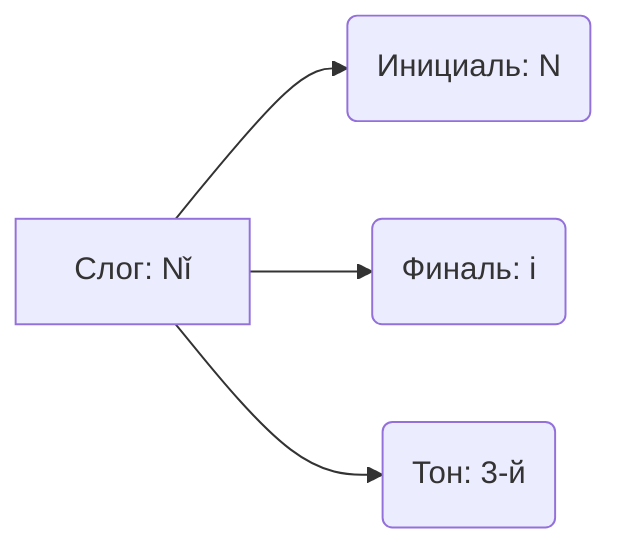

== Project Prompt ==
Generated: 2026-03-19T11:15:19.530Z
Source Directory: /mnt/c/Users/evai/Documents/obsidian-mark/Personal Note/Languages/Chinese
Included Files: 145
Total Size: 1102.32 KB
Format: structured
====================

=== Project File Structure ===
├── 00 Roadmaps и Оглавления
│   ├── 📚 MOC Грамматика.md
│   └── 🧭 Roadmap A1–A2 (Полный ноль → база).md
├── 01 Фонетика
│   ├── 🎭 Эмоциональная интонация и Модальные частиц.md
│   ├── 🎵 Тонирование пар (Tone Pairs).md
│   ├── 🎵 Тоны и Правила их изменения (Tone Sandhi).md
│   ├── 🎹 Таблица Пиньинь.md
│   ├── 🏴‍☠️ Рычание Эрхуа (Erhua).md
│   └── 🤬 Трудные звуки j q x vs zh ch sh.md
├── 02 Иероглифика
│   ├── ⚫️ Китайская пунктуация.md
│   ├── 🇹🇼 Упрощенные vs Традиционные.md
│   ├── ✍️ Каллиграфия.md
│   ├── ✍️ Порядок черт и Базовые правила письма.md
│   ├── ✍️ Структура иероглифа.md
│   ├── 🎯 Сколько иероглифов нужно знать (HSK и реальность).md
│   ├── 👀 Оптические иллюзии (Похожие иероглифы).md
│   ├── 🔊 Фонетики (Ключ к чтению).md
│   ├── 🔑 214 Ключей Радикалов.md
│   └── 🧠 Мнемотехники.md
├── 03 Грамматика
│   ├── 01 Базовые элементы (Слова и Связки)
│   │   ├── ✨ Наречия степени (很, 非常, 根本, 挺).md
│   │   ├── ➕➖ Исключения Chule Yiwai.md
│   │   ├── 🏹 Направления. Wang 往 vs Xiang 向 vs Chao 朝.md
│   │   ├── 👉 Предлоги адресата 对 Dui vs 给 Gei.md
│   │   ├── 👥 Местоимения (Я, Ты, Он и Мы).md
│   │   ├── 👯 Наречие Обобщения 都 Dōu.md
│   │   ├── 📦 Счетные слова (Classifiers).md
│   │   ├── 🔄 Опять и Снова. Zai 再 vs You 又.md
│   │   ├── 🔗 Глаголы-связки 是 有 在.md
│   │   ├── 🔗 Союзы и Коннекторы И Но Если.md
│   │   ├── 🔮 Вероятность и предположения (估计, 可能, 大概).md
│   │   └── 🤏 Немного 有点 Youdian vs 点 Yidian.md
│   ├── 02 Время и Пространство
│   │   ├── ⏰ Скоро случится. Kuai yao... le.md
│   │   ├── ⏳ Продолжительность времени (Time Duration).md
│   │   ├── ⚡ Наречия времени 就 Jiu vs 才 Cai.md
│   │   ├── 📍 Предлоги места и расстояния Cong Li Gen.md
│   │   ├── 🔢 Разы и Повторения. Ci 次 vs Bian 遍.md
│   │   ├── 🔢 Числа Даты Время.md
│   │   └── 🖼️ Предложения наличия (На стене висит...).md
│   ├── 03 Глагольная группа и Аспекты
│   │   ├── ⏳ Аспектные частицы 了 着 过.md
│   │   ├── ⛔ Отрицания Не Bù vs Не было Méi.md
│   │   ├── 💔 Раздельно-слитные глаголы 离合词 Liheci.md
│   │   ├── 🔱 Триада De 的 地 得.md
│   │   ├── 🦜 Удвоение глаголов A-A и ABAB.md
│   │   ├── 🦜 Удвоение Прилагательных AABB.md
│   │   └── 🚦 Модальные глаголы Хочу Могу Должен.md
│   ├── 04 Основные конструкции (Patterns)
│   │   ├── ⚖️ Сравнения с 比 (Bǐ).md
│   │   ├── ⛓️ Последовательные глаголы (Serial Verbs).md
│   │   ├── ❓ Как задавать вопросы (Все способы).md
│   │   ├── 🍰 Часть от целого 有的...有的... (Youde).md
│   │   ├── 🎁 Двойное дополнение.md
│   │   ├── 🏗️ Базовая структура SVO.md
│   │   ├── 👉 Побуждение. Rang 让 vs Jiao 叫 vs Shi 使.md
│   │   ├── 📈 Чем дальше тем 越来越 (Yue Lai Yue).md
│   │   ├── 📏 Конструкция Насколько 多 (Duo).md
│   │   ├── 🔍 Конструкция 是...的 (Shì... de).md
│   │   ├── 🔗 Фиксированные конструкции (Patterns).md
│   │   ├── 🤔 Риторические вопросы 难道 (Nandao).md
│   │   ├── 🤕 Пассивный залог c 被 (Bèi).md
│   │   ├── 🤲 Конструкция 把 (Bǎ).md
│   │   └── 🚫 Запрет на SHI с прилагательными.md
│   ├── 05 Комплименты
│   │   ├── ✅ Комплименты результата.md
│   │   ├── 🌡️ Комплименты степени и состояния.md
│   │   ├── 🔓 Комплименты возможности.md
│   │   └── 🧭 Комплименты направления.md
│   └── 06 Разговорные фишки
│       ├── 🤔 Частица Ne 呢.md
│       └── 😲 Междометия и Реакции.md
├── 04 Морфология
│   ├── 🎯 Морфемный анализ и продуктивные морфемы.md
│   ├── 👶 Суффиксы существительных zi, er, tou.md
│   ├── 🔄 Конверсия (переход частей речи).md
│   ├── 🔢 Приставки и свойства di, ke, fei.md
│   ├── 🧩 Способы словообразования (Сложение и Аффиксы).md
│   ├── 🧪 Окраска и категории xing, hua, zhe.md
│   └── 🧱 Словосложение — типы сложных слов.md
├── 05 Лексика по темам
│   ├── 01 Быт и база
│   │   ├── 🌤️ Погода, Климат и Смог.md
│   │   ├── 🌶️ Еда, Вкусы и Способы готовки.md
│   │   ├── 🏘️ Аренда жилья и Быт.md
│   │   ├── 👨‍👩‍👧‍👦 Семейное древо (Родственники).md
│   │   ├── 👨‍🚀 Профессии и люди.md
│   │   ├── 📅 Числа, Даты и Время.md
│   │   ├── 🤔 Многоликое слово 意思 (Yisi).md
│   │   ├── 🧋 Гайд по Бабл-ти (Naicha). Лед, Сахар и Топпинги.md
│   │   ├── 🧭 Стороны света и Локализаторы.md
│   │   ├── 🚄 Путешествия и Транспорт (High-Speed Rail).md
│   │   ├── 🚑 Тело и Здоровье.md
│   │   ├── 🛒 Шопинг и Торг.md
│   │   └── 🆘 Полиция и ЧП.md
│   ├── 02 Синонимы и нюансы
│   │   ├── 🆚 Два года 二 Er vs 两 Liang (Полный разбор).md
│   │   ├── 🆚 Думать 觉得 Juede vs 以为 Yiwei (Ошибочно полагать).md
│   │   ├── 🆚 Знать 认识 Renshi vs 知道 Zhidao.md
│   │   └── 🆚 Мочь 会 Hui vs 能 Neng vs 可以 Keyi (Расширенная версия).md
│   ├── 03 Цифровая жизнь
│   │   ├── 💸 Мобильные платежи и Банкинг.md
│   │   ├── 💻 Компьютер, Офис и IT-лексика.md
│   │   ├── 📱 Интерфейс и Приложения.md
│   │   ├── 📺 Стриминговые сервисы (Bilibili, iQIYI).md
│   │   ├── 🗺️ Навигация, Карты и Такси (Didi & Gaode).md
│   │   ├── 🤳 Соцсети и WeChat.md
│   │   └── 🥡 Заказ еды (Meituan, Eleme).md
│   ├── 04 Учеба
│   │   ├── 🎓 Университетская жизнь.md
│   │   └── 📄 Резюме и Собеседование (Mianshi).md
│   ├── 05 Продвинутый уровень
│   │   ├── 🐉 Чэнъюев Идиомы.md
│   │   ├── 💼 Деловой китайский.md
│   │   ├── 📝 Письменный vs Устный язык.md
│   │   ├── 🗣️ Слова-паразиты (Filler words).md
│   │   └── 🤬 Эмоции и Ругательства (цензурные).md
│   └── 06 Прагматика и Диалоги
│       ├── 💬 Small talk и светская болтовня.md
│       ├── 🧩 Речевые акты Просить Отказывать Предлагать.md
│       └── 🛒 Диалоги Магазин и Шопинг.md
├── 06 Культура и страноведение
│   ├── 🌏 География и Диалекты.md
│   ├── 🎓 Гаокао (Gaokao). Экзамен, который решает судьбу.md
│   ├── 🎤 Культура KTV. Больше чем просто пение.md
│   ├── 🎨 Цвета и Символизм. Почему невеста в красном, а покойник в белом.md
│   ├── 🏙️ Система городов (Tier 1-2-3).md
│   ├── 🏥 Традиционная Китайская Медицина (TCM).md
│   ├── 🏮 Праздники Китая Традиции и Даты.md
│   ├── 👵 Жизнь пожилых и Танцы на площадях.md
│   ├── 👺 Лицо (Mianzi) и Связи (Guanxi).md
│   ├── 📜 История языка От костей дракона до смартфона.md
│   ├── 📱 Цифровой сленг 666 и 520.md
│   ├── 🥢 Столовый этикет. Табу палочек и кто где сидит.md
│   ├── 🆔 Китайские имена. Почему их три.md
│   └── MOC Карта раздела Культура.md
├── 07 Ресурсы и стратегия
│   ├── 🎧 Аудио-марафон 30 дней.md
│   ├── 🎧 Аудирование подкасты кино.md
│   ├── 📚 Учебники и Словари.md
│   ├── 📝 Подготовка к HSK. Структура экзамена.md
│   ├── 📺 Плейлист сериалов и шоу по уровням.md
│   └── 🤖 Промпты для AI-учителя.md
├── 08 Практика навыков
│   ├── ⌨️ Китайский ввод (Pinyin Input).md
│   ├── 📖 Чтение (Стратегии и скорочтение).md
│   └── 🗣️ Техника Shadowing (Теневой повтор).md
├── 09 Систематизация и ошибки
│   ├── 🃏 Карточки Anki и плагины Obsidian.md
│   ├── 📈 Планирование обучения и трекинг прогресса.md
│   ├── 🤕 Типичные ошибки B2–C1.md
│   ├── 🤕 Частые ошибки русскоязычных.md
│   └── 🧠 Метанавыки изучения языков.md
├── 10 Разговорные стратегии
│   └── 🗣️ Искусство переспрашивания.md
├── 11 Подготовка к HSKK
│   ├── 🎙️ Обзор экзамена HSKK (Структура и Уровни).md
│   ├── 🎯 HSKK Высший уровень — аргументация и анализ.md
│   ├── 🎯 HSKK Начальный уровень — стратегии и шаблоны.md
│   ├── 🎯 HSKK Средний уровень — переход к связной речи.md
│   ├── 📈 Критерии оценки HSKK (что проверяют).md
│   └── 🗣 HSKK Устный экзамен (Обзор).md
├── 12 Современный язык и тренды
│   ├── 🎮 Язык игр и стримов.md
│   ├── 📱 Интернет-мемы и устойчивые формулы.md
│   └── 🧵 Шаблонные фразы из чатов.md
└── Chinese Knowledge Base.md
============================

=== File List ===
- 00 Roadmaps и Оглавления/📚 MOC Грамматика.md (0.00 KB)
- 00 Roadmaps и Оглавления/🧭 Roadmap A1–A2 (Полный ноль → база).md (0.00 KB)
- 01 Фонетика/🎭 Эмоциональная интонация и Модальные частиц.md (6.22 KB)
- 01 Фонетика/🎵 Тонирование пар (Tone Pairs).md (7.50 KB)
- 01 Фонетика/🎵 Тоны и Правила их изменения (Tone Sandhi).md (4.97 KB)
- 01 Фонетика/🎹 Таблица Пиньинь.md (4.75 KB)
- 01 Фонетика/🏴‍☠️ Рычание Эрхуа (Erhua).md (8.01 KB)
- 01 Фонетика/🤬 Трудные звуки j q x vs zh ch sh.md (4.58 KB)
- 02 Иероглифика/⚫️ Китайская пунктуация.md (7.42 KB)
- 02 Иероглифика/🇹🇼 Упрощенные vs Традиционные.md (8.78 KB)
- 02 Иероглифика/✍️ Каллиграфия.md (7.61 KB)
- 02 Иероглифика/✍️ Порядок черт и Базовые правила письма.md (7.48 KB)
- 02 Иероглифика/✍️ Структура иероглифа.md (8.68 KB)
- 02 Иероглифика/🎯 Сколько иероглифов нужно знать (HSK и реальность).md (4.78 KB)
- 02 Иероглифика/👀 Оптические иллюзии (Похожие иероглифы).md (9.21 KB)
- 02 Иероглифика/🔊 Фонетики (Ключ к чтению).md (4.88 KB)
- 02 Иероглифика/🔑 214 Ключей Радикалов.md (15.64 KB)
- 02 Иероглифика/🧠 Мнемотехники.md (7.89 KB)
- 03 Грамматика/01 Базовые элементы (Слова и Связки)/✨ Наречия степени (很, 非常, 根本, 挺).md (9.36 KB)
- 03 Грамматика/01 Базовые элементы (Слова и Связки)/➕➖ Исключения Chule Yiwai.md (4.56 KB)
- 03 Грамматика/01 Базовые элементы (Слова и Связки)/🏹 Направления. Wang 往 vs Xiang 向 vs Chao 朝.md (9.98 KB)
- 03 Грамматика/01 Базовые элементы (Слова и Связки)/👉 Предлоги адресата 对 Dui vs 给 Gei.md (5.91 KB)
- 03 Грамматика/01 Базовые элементы (Слова и Связки)/👥 Местоимения (Я, Ты, Он и Мы).md (11.92 KB)
- 03 Грамматика/01 Базовые элементы (Слова и Связки)/👯 Наречие Обобщения 都 Dōu.md (5.25 KB)
- 03 Грамматика/01 Базовые элементы (Слова и Связки)/📦 Счетные слова (Classifiers).md (12.81 KB)
- 03 Грамматика/01 Базовые элементы (Слова и Связки)/🔄 Опять и Снова. Zai 再 vs You 又.md (7.86 KB)
- 03 Грамматика/01 Базовые элементы (Слова и Связки)/🔗 Глаголы-связки 是 有 在.md (5.49 KB)
- 03 Грамматика/01 Базовые элементы (Слова и Связки)/🔗 Союзы и Коннекторы И Но Если.md (6.01 KB)
- 03 Грамматика/01 Базовые элементы (Слова и Связки)/🔮 Вероятность и предположения (估计, 可能, 大概).md (9.50 KB)
- 03 Грамматика/01 Базовые элементы (Слова и Связки)/🤏 Немного 有点 Youdian vs 点 Yidian.md (5.97 KB)
- 03 Грамматика/02 Время и Пространство/⏰ Скоро случится. Kuai yao... le.md (6.41 KB)
- 03 Грамматика/02 Время и Пространство/⏳ Продолжительность времени (Time Duration).md (7.25 KB)
- 03 Грамматика/02 Время и Пространство/⚡ Наречия времени 就 Jiu vs 才 Cai.md (9.24 KB)
- 03 Грамматика/02 Время и Пространство/📍 Предлоги места и расстояния Cong Li Gen.md (5.93 KB)
- 03 Грамматика/02 Время и Пространство/🔢 Разы и Повторения. Ci 次 vs Bian 遍.md (8.22 KB)
- 03 Грамматика/02 Время и Пространство/🔢 Числа Даты Время.md (6.75 KB)
- 03 Грамматика/02 Время и Пространство/🖼️ Предложения наличия (На стене висит...).md (6.90 KB)
- 03 Грамматика/03 Глагольная группа и Аспекты/⏳ Аспектные частицы 了 着 过.md (10.44 KB)
- 03 Грамматика/03 Глагольная группа и Аспекты/⛔ Отрицания Не Bù vs Не было Méi.md (6.09 KB)
- 03 Грамматика/03 Глагольная группа и Аспекты/💔 Раздельно-слитные глаголы 离合词 Liheci.md (8.21 KB)
- 03 Грамматика/03 Глагольная группа и Аспекты/🔱 Триада De 的 地 得.md (5.74 KB)
- 03 Грамматика/03 Глагольная группа и Аспекты/🦜 Удвоение глаголов A-A и ABAB.md (6.20 KB)
- 03 Грамматика/03 Глагольная группа и Аспекты/🦜 Удвоение Прилагательных AABB.md (3.63 KB)
- 03 Грамматика/03 Глагольная группа и Аспекты/🚦 Модальные глаголы Хочу Могу Должен.md (5.86 KB)
- 03 Грамматика/04 Основные конструкции (Patterns)/⚖️ Сравнения с 比 (Bǐ).md (6.20 KB)
- 03 Грамматика/04 Основные конструкции (Patterns)/⛓️ Последовательные глаголы (Serial Verbs).md (6.41 KB)
- 03 Грамматика/04 Основные конструкции (Patterns)/❓ Как задавать вопросы (Все способы).md (6.57 KB)
- 03 Грамматика/04 Основные конструкции (Patterns)/🍰 Часть от целого 有的...有的... (Youde).md (6.57 KB)
- 03 Грамматика/04 Основные конструкции (Patterns)/🎁 Двойное дополнение.md (6.49 KB)
- 03 Грамматика/04 Основные конструкции (Patterns)/🏗️ Базовая структура SVO.md (7.14 KB)
- 03 Грамматика/04 Основные конструкции (Patterns)/👉 Побуждение. Rang 让 vs Jiao 叫 vs Shi 使.md (8.86 KB)
- 03 Грамматика/04 Основные конструкции (Patterns)/📈 Чем дальше тем 越来越 (Yue Lai Yue).md (5.64 KB)
- 03 Грамматика/04 Основные конструкции (Patterns)/📏 Конструкция Насколько 多 (Duo).md (7.98 KB)
- 03 Грамматика/04 Основные конструкции (Patterns)/🔍 Конструкция 是...的 (Shì... de).md (6.64 KB)
- 03 Грамматика/04 Основные конструкции (Patterns)/🔗 Фиксированные конструкции (Patterns).md (7.34 KB)
- 03 Грамматика/04 Основные конструкции (Patterns)/🤔 Риторические вопросы 难道 (Nandao).md (6.58 KB)
- 03 Грамматика/04 Основные конструкции (Patterns)/🤕 Пассивный залог c 被 (Bèi).md (7.13 KB)
- 03 Грамматика/04 Основные конструкции (Patterns)/🤲 Конструкция 把 (Bǎ).md (6.83 KB)
- 03 Грамматика/04 Основные конструкции (Patterns)/🚫 Запрет на SHI с прилагательными.md (5.74 KB)
- 03 Грамматика/05 Комплименты/✅ Комплименты результата.md (5.96 KB)
- 03 Грамматика/05 Комплименты/🌡️ Комплименты степени и состояния.md (7.78 KB)
- 03 Грамматика/05 Комплименты/🔓 Комплименты возможности.md (6.91 KB)
- 03 Грамматика/05 Комплименты/🧭 Комплименты направления.md (6.83 KB)
- 03 Грамматика/06 Разговорные фишки/🤔 Частица Ne 呢.md (7.05 KB)
- 03 Грамматика/06 Разговорные фишки/😲 Междометия и Реакции.md (8.79 KB)
- 04 Морфология/🎯 Морфемный анализ и продуктивные морфемы.md (12.58 KB)
- 04 Морфология/👶 Суффиксы существительных zi, er, tou.md (8.62 KB)
- 04 Морфология/🔄 Конверсия (переход частей речи).md (8.13 KB)
- 04 Морфология/🔢 Приставки и свойства di, ke, fei.md (7.53 KB)
- 04 Морфология/🧩 Способы словообразования (Сложение и Аффиксы).md (10.79 KB)
- 04 Морфология/🧪 Окраска и категории xing, hua, zhe.md (9.03 KB)
- 04 Морфология/🧱 Словосложение — типы сложных слов.md (11.51 KB)
- 05 Лексика по темам/01 Быт и база/🌤️ Погода, Климат и Смог.md (7.69 KB)
- 05 Лексика по темам/01 Быт и база/🌶️ Еда, Вкусы и Способы готовки.md (8.17 KB)
- 05 Лексика по темам/01 Быт и база/🏘️ Аренда жилья и Быт.md (7.55 KB)
- 05 Лексика по темам/01 Быт и база/👨‍👩‍👧‍👦 Семейное древо (Родственники).md (3.13 KB)
- 05 Лексика по темам/01 Быт и база/👨‍🚀 Профессии и люди.md (9.23 KB)
- 05 Лексика по темам/01 Быт и база/📅 Числа, Даты и Время.md (6.48 KB)
- 05 Лексика по темам/01 Быт и база/🤔 Многоликое слово 意思 (Yisi).md (5.71 KB)
- 05 Лексика по темам/01 Быт и база/🧋 Гайд по Бабл-ти (Naicha). Лед, Сахар и Топпинги.md (8.30 KB)
- 05 Лексика по темам/01 Быт и база/🧭 Стороны света и Локализаторы.md (3.53 KB)
- 05 Лексика по темам/01 Быт и база/🚄 Путешествия и Транспорт (High-Speed Rail).md (11.39 KB)
- 05 Лексика по темам/01 Быт и база/🚑 Тело и Здоровье.md (7.90 KB)
- 05 Лексика по темам/01 Быт и база/🛒 Шопинг и Торг.md (6.60 KB)
- 05 Лексика по темам/01 Быт и база/🆘 Полиция и ЧП.md (8.39 KB)
- 05 Лексика по темам/02 Синонимы и нюансы/🆚 Два года 二 Er vs 两 Liang (Полный разбор).md (5.29 KB)
- 05 Лексика по темам/02 Синонимы и нюансы/🆚 Думать 觉得 Juede vs 以为 Yiwei (Ошибочно полагать).md (5.62 KB)
- 05 Лексика по темам/02 Синонимы и нюансы/🆚 Знать 认识 Renshi vs 知道 Zhidao.md (3.09 KB)
- 05 Лексика по темам/02 Синонимы и нюансы/🆚 Мочь 会 Hui vs 能 Neng vs 可以 Keyi (Расширенная версия).md (7.36 KB)
- 05 Лексика по темам/03 Цифровая жизнь/💸 Мобильные платежи и Банкинг.md (17.11 KB)
- 05 Лексика по темам/03 Цифровая жизнь/💻 Компьютер, Офис и IT-лексика.md (17.32 KB)
- 05 Лексика по темам/03 Цифровая жизнь/📱 Интерфейс и Приложения.md (12.46 KB)
- 05 Лексика по темам/03 Цифровая жизнь/📺 Стриминговые сервисы (Bilibili, iQIYI).md (18.19 KB)
- 05 Лексика по темам/03 Цифровая жизнь/🗺️ Навигация, Карты и Такси (Didi & Gaode).md (16.20 KB)
- 05 Лексика по темам/03 Цифровая жизнь/🤳 Соцсети и WeChat.md (10.54 KB)
- 05 Лексика по темам/03 Цифровая жизнь/🥡 Заказ еды (Meituan, Eleme).md (17.93 KB)
- 05 Лексика по темам/04 Учеба/🎓 Университетская жизнь.md (10.79 KB)
- 05 Лексика по темам/04 Учеба/📄 Резюме и Собеседование (Mianshi).md (11.05 KB)
- 05 Лексика по темам/05 Продвинутый уровень/🐉 Чэнъюев Идиомы.md (7.68 KB)
- 05 Лексика по темам/05 Продвинутый уровень/💼 Деловой китайский.md (7.45 KB)
- 05 Лексика по темам/05 Продвинутый уровень/📝 Письменный vs Устный язык.md (8.04 KB)
- 05 Лексика по темам/05 Продвинутый уровень/🗣️ Слова-паразиты (Filler words).md (8.66 KB)
- 05 Лексика по темам/05 Продвинутый уровень/🤬 Эмоции и Ругательства (цензурные).md (7.78 KB)
- 05 Лексика по темам/06 Прагматика и Диалоги/💬 Small talk и светская болтовня.md (0.00 KB)
- 05 Лексика по темам/06 Прагматика и Диалоги/🧩 Речевые акты Просить Отказывать Предлагать.md (0.00 KB)
- 05 Лексика по темам/06 Прагматика и Диалоги/🛒 Диалоги Магазин и Шопинг.md (0.00 KB)
- 06 Культура и страноведение/🌏 География и Диалекты.md (8.28 KB)
- 06 Культура и страноведение/🎓 Гаокао (Gaokao). Экзамен, который решает судьбу.md (9.50 KB)
- 06 Культура и страноведение/🎤 Культура KTV. Больше чем просто пение.md (9.11 KB)
- 06 Культура и страноведение/🎨 Цвета и Символизм. Почему невеста в красном, а покойник в белом.md (8.02 KB)
- 06 Культура и страноведение/🏙️ Система городов (Tier 1-2-3).md (7.92 KB)
- 06 Культура и страноведение/🏥 Традиционная Китайская Медицина (TCM).md (9.03 KB)
- 06 Культура и страноведение/🏮 Праздники Китая Традиции и Даты.md (8.02 KB)
- 06 Культура и страноведение/👵 Жизнь пожилых и Танцы на площадях.md (10.21 KB)
- 06 Культура и страноведение/👺 Лицо (Mianzi) и Связи (Guanxi).md (8.84 KB)
- 06 Культура и страноведение/📜 История языка От костей дракона до смартфона.md (7.39 KB)
- 06 Культура и страноведение/📱 Цифровой сленг 666 и 520.md (7.59 KB)
- 06 Культура и страноведение/🥢 Столовый этикет. Табу палочек и кто где сидит.md (7.97 KB)
- 06 Культура и страноведение/🆔 Китайские имена. Почему их три.md (8.32 KB)
- 06 Культура и страноведение/MOC Карта раздела Культура.md (3.24 KB)
- 07 Ресурсы и стратегия/🎧 Аудио-марафон 30 дней.md (0.00 KB)
- 07 Ресурсы и стратегия/🎧 Аудирование подкасты кино.md (7.17 KB)
- 07 Ресурсы и стратегия/📚 Учебники и Словари.md (8.18 KB)
- 07 Ресурсы и стратегия/📝 Подготовка к HSK. Структура экзамена.md (8.34 KB)
- 07 Ресурсы и стратегия/📺 Плейлист сериалов и шоу по уровням.md (0.00 KB)
- 07 Ресурсы и стратегия/🤖 Промпты для AI-учителя.md (9.41 KB)
- 08 Практика навыков/⌨️ Китайский ввод (Pinyin Input).md (9.52 KB)
- 08 Практика навыков/📖 Чтение (Стратегии и скорочтение).md (8.50 KB)
- 08 Практика навыков/🗣️ Техника Shadowing (Теневой повтор).md (7.82 KB)
- 09 Систематизация и ошибки/🃏 Карточки Anki и плагины Obsidian.md (0.00 KB)
- 09 Систематизация и ошибки/📈 Планирование обучения и трекинг прогресса.md (8.06 KB)
- 09 Систематизация и ошибки/🤕 Типичные ошибки B2–C1.md (0.00 KB)
- 09 Систематизация и ошибки/🤕 Частые ошибки русскоязычных.md (7.67 KB)
- 09 Систематизация и ошибки/🧠 Метанавыки изучения языков.md (0.00 KB)
- 10 Разговорные стратегии/🗣️ Искусство переспрашивания.md (9.41 KB)
- 11 Подготовка к HSKK/🎙️ Обзор экзамена HSKK (Структура и Уровни).md (9.83 KB)
- 11 Подготовка к HSKK/🎯 HSKK Высший уровень — аргументация и анализ.md (15.67 KB)
- 11 Подготовка к HSKK/🎯 HSKK Начальный уровень — стратегии и шаблоны.md (9.92 KB)
- 11 Подготовка к HSKK/🎯 HSKK Средний уровень — переход к связной речи.md (10.85 KB)
- 11 Подготовка к HSKK/📈 Критерии оценки HSKK (что проверяют).md (13.66 KB)
- 11 Подготовка к HSKK/🗣 HSKK Устный экзамен (Обзор).md (13.03 KB)
- 12 Современный язык и тренды/🎮 Язык игр и стримов.md (0.00 KB)
- 12 Современный язык и тренды/📱 Интернет-мемы и устойчивые формулы.md (0.00 KB)
- 12 Современный язык и тренды/🧵 Шаблонные фразы из чатов.md (0.00 KB)
- Chinese Knowledge Base.md (21.63 KB)
=================

=== File Contents ===

--- File: 00 Roadmaps и Оглавления/📚 MOC Грамматика.md ---

TODO

--- File: 00 Roadmaps и Оглавления/🧭 Roadmap A1–A2 (Полный ноль → база).md ---

TODO

--- File: 01 Фонетика/🎭 Эмоциональная интонация и Модальные частиц.md ---

---
tags:
  - разговорный
  - интонация
  - частицы
  - HSK1
  - HSK2
---
Связи: [[🎵 Тоны и Правила их изменения (Tone Sandhi)]], [[🔱 Триада De 的 地 得]]

---

## 🌊 Тоны vs Интонация: Как это работает?
Существует миф: *"В китайском нельзя менять интонацию, иначе изменится смысл слова"*. Это не совсем так.

*   **Тоны (Tones)** — это «рябь» на воде (локальная мелодия слога).
*   **Интонация (Intonation)** — это «большая волна» (общая мелодия предложения).

> [!info] Аналогия
> Представьте, что предложение — это нитка, на которую нанизаны бусины (слова).
> *   Если вы удивляетесь, вы поднимаете всю нитку вверх ⤴️.
> *   Если утверждаете, опускаете конец нитки вниз ⤵️.
> *   **Но форма самих бусин (тоны) при этом не меняется!**

---

## 🍬 Модальные частицы (Сердце эмоций)
В русском мы меняем голос («Ты идешь?» vs «Ты идешь!»). В китайском для этого служат **частицы в конце предложения**. Они не имеют перевода, но задают настроение.

### 1. Большая четверка

| Частица | Пиньинь | Эмоция / Функция | Пример |
| :--- | :--- | :--- | :--- |
| **吗** | **ma** | **Вопрос (Нейтральный).** Просто запрашивает информацию. Да/Нет. | 你好吗？ (Как ты?) |
| **吧** | **ba** | **Предложение / Догадка / Смягчение.** «Давай...», «Наверное...», «Ладно...». Делает речь вежливой. | 走吧 (Пошли!) / 是吧 (Верно?) |
| **呢** | **ne** | **Интерес / "А ты?".** Смягчает вопрос или указывает на продолжение действия. | 你呢？ (А ты?) / 我在吃饭呢 (Я же ем). |
| **啊** | **a** | **Восклицание / Удивление.** Усиливает любую эмоцию (радость, шок, согласие). | 好啊！ (Давай! Супер!) |

---

### 2. Магия частицы «吧» (Ba)
Если хотите звучать вежливо и не агрессивно, используйте `ba` вместо повелительного наклонения.

*   **Приказ:** 给我 (Gěi wǒ) — Дай мне. (Грубо)
*   **Просьба:** 给我吧 (Gěi wǒ ba) — Дай-ка мне / Ну давай мне. (Мягко)
*   **Утверждение:** 你是俄罗斯人 (Ты русский). — Факт.
*   **Догадка:** 你是俄罗斯人吧? (Ты ведь русский, да?) — Ожидание подтверждения.

---

### 3. Хамелеон «啊» (A)
Частица `啊` меняет свое звучание в зависимости от того, на какой звук заканчивалось предыдущее слово. Это происходит естественно, чтобы речь лилась плавно.

*   **Ya (呀):** Если слово кончается на `a`, `e`, `i`, `o`, `ü`.
    *   *Пример:* 对呀 (Duì ya) — Верно же! / Ага!
    *   *Пример:* 来呀 (Lái ya) — Приходи давай!
*   **Wa (哇):** Если слово кончается на `u`, `ao`.
    *   *Пример:* 好哇 (Hǎo wa) — Хорошо! (Звучит как Hǎo-a -> Hǎo-wa).
*   **Na (哪):** Если слово кончается на `n`.
    *   *Пример:* 天哪 (Tiān na) — О боже! (Tiān-a).

> [!tip] Не зубри это!
> Просто попробуйте сказать быстро `Hǎo a`. Губы сами сомкнутся в `wa`. Китайцы пишут разные иероглифы (呀, 哇, 哪), чтобы показать этот звук, но суть одна — это всё то же **Ah**.

---

### 4. Междометия (В начале фразы)
Эмоции, с которых начинается предложение.

| Иероглиф | Пиньинь | Эмоция | Русский аналог |
| :--- | :--- | :--- | :--- |
| **哎呀** | **āiyā** | Недовольство, удивление, боль, шок. (Самое популярное!) | Ой! / Блин! / Ого! |
| **哈哈** | **hāhā** | Смех. | Ха-ха. |
| **喂** | **wéi / wèi** | 2-й тон: "Алло?". 4-й тон: "Эй!" (Грубо). | Алло / Эй. |
| **哦** | **ò** | Понимание (4-й тон). | А-а-а, понятно. |

---

## 📈 Паттерны интонации
Как менять голос, сохраняя тоны.

1.  **Вопрос (Общий):**
    *   Голос в конце предложения идет **вверх** (общий регистр), даже если последний иероглиф имеет падающий 4-й тон. Падающий тон станет «менее падающим», но не превратится в восходящий.
    
2.  **Удивление:**
    *   Регистр речи расширяется. Высокие тоны становятся выше, низкие — ниже. Громкость увеличивается.

3.  **Перечисление:**
    *   Паузы между словами, тон слегка задерживается («повисает») перед запятой.

> [!example] Пример разницы
> Фраза: **他不去** (Tā bù qù - Он не пойдет).
> 
> *   **Факт:** Tā bù qù. (Спокойно, ровно, в конце точка).
> *   **Вопрос:** Tā bù qù? ⤴️ (Регистр поднимается к концу. "Он не пойдет??").
> *   **Эмоция (с частицей):** Tā bù qù **a**! (Он же не пойдет! / Да не пойдет он!).

--- File: 01 Фонетика/🎵 Тонирование пар (Tone Pairs).md ---

---
tags:
  - фонетика
  - тоны
  - практика
  - speaking
  - HSK2
cssclasses:
  - cn-note
---

<div class="hero">
  <span class="hanzi">声调搭配</span>
  <div class="meta">
    <h1>Тонирование пар (Tone Pairs)</h1>
    <span class="pinyin">shēngdiào dāpèi</span>
    <span class="desc">Секрет плавности: как связывать слоги, чтобы не звучать как робот</span>
  </div>
</div>

Связи: [[🎵 Тоны и Правила их изменения (Tone Sandhi)]], [[🤬 Трудные звуки j q x vs zh ch sh]]

---

## 🎹 Почему это важно?
Произнести **один** иероглиф правильно — легко.
Произнести **два** подряд — сложно. Голос должен совершить акробатический трюк: резко прыгнуть вверх, упасть вниз или удержать высоту.

В китайском языке 80% слов состоят из **двух слогов** (дисиллабы).
Если вы учите тоны по отдельности, ваша речь будет рубленой и неестественной. Если вы учите **Пары Тонов**, вы учите ритм языка.

Всего существует **20 комбинаций** (4 тона × 4 тона + нейтральные).

---

## 🏔️ Группа 1: Старт с Высоты (1-й тон + ...)
**Ощущение:** Вы стоите на крыше небоскреба. Голос высокий и напряженный.

| Пара | Движение голоса | Пример | Пиньинь | Перевод |
| :---: | :--- | :--- | :--- | :--- |
| **1 + 1** | **Ровная линия.** Высоко-Высоко. Не расслабляйтесь на втором слоге! | **飞机** | fēijī | Самолет |
| **1 + 2** | **Взлет с крыши.** Высоко, затем еще выше (как вопрос). | **中国** | Zhōngguó | Китай |
| **1 + 3** | **Прыжок в яму.** Высоко, затем резкое падение на самое дно. | **冰水** | bīngshuǐ | Ледяная вода |
| **1 + 4** | **Падение с обрыва.** Высоко, затем резкий удар вниз. | **高兴** | gāoxìng | Радостный |

> [!tip] Совет
> В комбинации **1+4** важно сделать паузу микросекунду перед ударом вниз, чтобы набрать энергию.

---

## 🚀 Группа 2: Старт с Подъема (2-й тон + ...)
**Ощущение:** Вы разгоняетесь в гору.

| Пара | Движение голоса | Пример | Пиньинь | Перевод |
| :---: | :--- | :--- | :--- | :--- |
| **2 + 1** | **Выход на плато.** Поднялись и остались там высоко. | **明天** | míngtiān | Завтра |
| **2 + 2** | **Ступеньки.** Подъем, потом еще один подъем. | **银行** | yínháng | Банк |
| **2 + 3** | **Американские горки.** Вверх, затем резко вниз в яму. | **没有** | méiyǒu | Не иметь |
| **2 + 4** | **Пик горы.** Взлетели на вершину и сразу камнем вниз. | **不是** | búshì | Не являюсь |

---

## 🕳️ Группа 3: Старт с Низины (3-й тон + ...)
**Ощущение:** Вы в подвале. Самая сложная группа из-за правил изменения тонов ([[Tone Sandhi]]).

> [!danger] Правило полутретьего
> Если 3-й тон стоит первым, он **почти никогда** не читается полностью (галочкой).
> Он читается просто **НИЗКО** (как будто вы ворчите). Хвостик вверх отбрасывается!

| Пара | Реальное звучание | Пример | Пиньинь | Перевод |
| :---: | :--- | :--- | :--- | :--- |
| **3 + 1** | **Низко -> Высоко.** Из подвала прыгаем на крышу. | **老师** | lǎoshī | Учитель |
| **3 + 2** | **Низко -> Вверх.** Из подвала поднимаемся на 1-й этаж. | **语言** | yǔyán | Язык |
| **3 + 4** | **Низко -> Удар вниз.** Ворчим, потом ругаемся. | **考试** | kǎoshì | Экзамен |
| **3 + 3** | ⚠️ **Превращается в 2+3!** (Sandhi). | **你好** | nǐhǎo | Привет |

---

## 🔨 Группа 4: Старт с Падения (4-й тон + ...)
**Ощущение:** Удар молотком. Резкий выдох.

| Пара | Движение голоса | Пример | Пиньинь | Перевод |
| :---: | :--- | :--- | :--- | :--- |
| **4 + 1** | **Удар и отскок.** Упали, и сразу взлетели высоко. | **大巴** | dàbā | Автобус |
| **4 + 2** | **Яма.** Упали вниз, а потом медленно всплываем. | **地图** | dìtú | Карта |
| **4 + 3** | **Удар и ворчание.** Упали и остались там внизу. | **电脑** | diànnǎo | Компьютер |
| **4 + 4** | **Два удара.** Бам! Бам! Второй удар должен быть ниже первого. | **世界** | shìjiè | Мир |

---

## 👻 Нейтральный тон (Легкий)
Нейтральный тон (0) не имеет своей высоты. Он зависит от того, **после какого** тона стоит.

1.  **1 + 0 (Māma):** Высоко -> Середина. Легкое падение.
    *   *Пример:* **妈妈** (Мама).
2.  **2 + 0 (Yéye):** Вверх -> Середина. Как будто мячик взлетел и завис.
    *   *Пример:* **爷爷** (Дедушка).
3.  **3 + 0 (Nǎinai):** Низко -> Высоко. Резкий подскок (единственный случай!).
    *   *Пример:* **奶奶** (Бабушка), **喜欢** (Xǐhuan).
4.  **4 + 0 (Bàba):** Вниз -> Самый низ. Падение, а потом эхо в подвале.
    *   *Пример:* **爸爸** (Папа).

---

## 🏋️‍♂️ Как тренироваться? (Метод «Дирижер»)

Не пытайтесь просто повторять. Подключите **руку**.

1.  **Визуализация:** Рисуйте тоны пальцем в воздухе, пока говорите.
    *   *1-й:* Линия.
    *   *2-й:* Вверх.
    *   *3-й:* Чаша.
    *   *4-й:* Рубящий удар.
2.  **Гиперболизация:** Утрируйте. Если тон высокий — пищите. Если низкий — хрипите. В обычной речи это сгладится, но мозг запомнит амплитуду.
3.  **Запись:** Запишите себя на диктофон, произносящего пары `Fēijī`, `Míngtiān`, `Lǎoshī`, `Dàbā`. Сравните с Pleco. Вы удивитесь, насколько вы «не дотягиваете» высоту.

### Чек-лист сложных пар (Проверь себя)
Эти пары чаще всего путают иностранцы:
*   **1+4 (Shāngdiàn)** vs **4+1 (Dàbā)**
*   **2+3 (Méiyǒu)** vs **3+2 (Yǔyán)**

--- File: 01 Фонетика/🎵 Тоны и Правила их изменения (Tone Sandhi).md ---

---
tags:
  - фонетика
  - тоны
  - HSK1
---
Связи: [[🎹 Таблица Пиньинь]], [[🤬 Трудные звуки j q x vs zh ch sh]]

---

## 1. Базовые 4 тона
В китайском языке от тона зависит смысл слова. Классический пример: `mā` (мама) vs `mǎ` (лошадь).

| Тон | Обозначение | Описание | Пример |
| :--- | :---: | :--- | :--- |
| **1-й** | `¯` (mā) | **Высокий ровный.** Голос высокий, как у оперного певца, не меняется. | 妈 (mā) |
| **2-й** | `ˊ` (má) | **Восходящий.** Как будто переспрашиваете: «А?». | 麻 (má) |
| **3-й** | `ˇ` (mǎ) | **Нисходяще-восходящий.** Вниз, а потом чуть вверх. Самый низкий голос. | 马 (mǎ) |
| **4-й** | `ˋ` (mà) | **Падающий.** Резкий, как команда или отказ: «Нет!». | 骂 (mà) |

> [!note] Нулевой (нейтральный) тон
> Обозначается без значка (ma). Произносится коротко и легко.
> Чаще всего встречается в конце слов (частицы `ma`, `le`) или во втором слоге удвоений (`māma`).

---

## 2. Изменение тонов (Tone Sandhi)
**⚠️ Важно:** Эти правила работают **только в устной речи**. В словарях и учебниках пиньинь часто пишется в *исходном* тоне, но читать нужно с изменениями.

### А. Правила Третьего тона (ˇ)
Третий тон меняется чаще всего, чтобы речь была плавной.

> [!example] Правило 3+3 → 2+3
> Если два 3-х тона стоят рядом, первый превращается во **2-й**.
> *   `ˇ` + `ˇ` = `ˊ` + `ˇ`
> *   你好 (nǐ hǎo) → читаем **ní** hǎo
> *   水果 (shuǐ guǒ) → читаем **shuí** guǒ

> [!example] Правило «Полутретий»
> Если за 3-м тоном идет **любой другой** (1, 2, 4, нейтральный), то 3-й произносится **только вниз**. Хвостик вверх отбрасывается.
> *   `ˇ` + (`¯`/`ˊ`/`ˋ`) = **(только низ)** + ...
> *   北京 (Běijīng) → Běi (низко) - jīng
> *   好忙 (hǎo máng) → hǎo (низко) - máng

---

### Б. Правила для «НЕ» (不 — bù)
Исходный тон: **4-й** (падающий).

1.  **Перед 4-м тоном → Меняется на 2-й.**
    *   Чтобы не «лаять» и не делать паузу между двумя резкими звуками.
    *   `ˋ` + `ˋ` = `ˊ` + `ˋ`
    *   Пример: 不用 (bù yòng) → **bú** yòng.
    *   Пример: 是不是 (shì **bu** shì) — *исключение: в середине вопроса тон нейтральный.*

2.  **Перед 1, 2, 3 тонами → Без изменений (4-й).**
    *   Пример: 不吃 (bù chī), 不来 (bù lái), 不买 (bù mǎi).

---

### В. Правила для «ОДИН» (一 — yī)
Исходный тон: **1-й** (высокий ровный).

1.  **При счете, в датах и в конце фразы → Без изменений (1-й).**
    *   一二三 (yī èr sān), 第一 (dì yī — первый).

2.  **Перед 4-м тоном → Меняется на 2-й.**
    *   `¯` + `ˋ` = `ˊ` + `ˋ`
    *   Пример: 一个 (yī gè) → **yí** gè.
    *   Пример: 一样 (yī yàng) → **yí** yàng.

3.  **Перед 1, 2, 3 тонами → Меняется на 4-й.** (Самое частое!)
    *   `¯` + (`¯`/`ˊ`/`ˇ`) = `ˋ` + ...
    *   Пример: 一天 (yī tiān) → **yì** tiān.
    *   Пример: 一起 (yī qǐ) → **yì** qǐ.

---

## 3. Шпаргалка-резюме

| Иероглиф | Что стоит ПОСЛЕ него | Как читать | Пример |
| :--- | :--- | :--- | :--- |
| **3-й тон** | 3-й тон | **2-й тон** | 你好 (Ní hǎo) |
| **3-й тон** | Остальные | **Полу-3** (низко) | 好吃 (Hǎo chī) |
| **不 (Bù)** | 4-й тон | **2-й тон** | 不累 (Bú lèi) |
| **不 (Bù)** | Остальные | **4-й тон** | 不好 (Bù hǎo) |
| **一 (Yī)** | 4-й тон | **2-й тон** | 一半 (Yí bàn) |
| **一 (Yī)** | 1, 2, 3 тона | **4-й тон** | 一杯 (Yì bēi) |
| **一 (Yī)** | Конец / Счет | **1-й тон** | 十一 (Shí yī) |

---
> [!tip] Совет по практике
> Слушая аудио к учебникам, обращай внимание на `不` и `一`. Старайся копировать диктора, даже если в тексте стоит другой значок тона.

--- File: 01 Фонетика/🎹 Таблица Пиньинь.md ---

---
tags:
  - фонетика
  - пиньинь
  - справочник
  - HSK1
---
Связи: [[🤬 Трудные звуки j q x vs zh ch sh]], [[🎵 Тоны и Правила их изменения (Tone Sandhi)]]

---

## 🎧 Интерактивные таблицы (С Аудио)
Markdown не умеет воспроизводить звук, поэтому используй эти ресурсы для тренировки ушей. Это **лучшие** инструменты в сети:

> [!success] Рекомендуемые ресурсы
> *   🌐 **[Yabla Chinese Pinyin Chart](https://chinese.yabla.com/chinese-pinyin-chart.php)** — (Лучший) Видео и аудио для каждого звука.
> *   🌐 **[DigMandarin Pinyin Chart](https://www.digmandarin.com/chinese-pinyin-chart)** — Удобная навигация.
> *   📱 **Приложение:** Pleco (раздел Reference) или HelloChinese.

---

## 🧩 Анатомия слога
Китайский слог = **Инициаль** (начало) + **Финаль** (концовка) + **Тон**.



### 1. Инициали (Согласные начала)
Группировка по месту произношения. Подробнее о сложностях см. в [[🤬 Трудные звуки j q x vs zh ch sh]]

| Группа | Буквы | Комментарий |
| :--- | :--- | :--- |
| **Губные** | **b, p, m, f** | Как в русском. `P` с придыханием. |
| **Кончик языка** | **d, t, n, l** | Как в русском. `T` с придыханием. |
| **Корневые** | **g, k, h** | `H` — мягкий выдох (хэ), не хриплый. |
| **Свистящие** | **j, q, x** | **Мягкие!** (Дзь, Ць, Сь). Только с гласными `i`, `ü`. |
| **Шипящие** | **zh, ch, sh, r** | **Твердые!** Язык ложкой назад. |
| **Зубные** | **z, c, s** | З, Ц, С. Язык у зубов. |
| **Нулевые** | **w, y** | Используются, если слог начинается с гласной (`u`→`w`, `i`→`y`). |

---

### 2. Финали (Гласные концовки)

#### Простые
*   **a, o, e** (Э/Ы), **i** (И/Ы), **u** (У), **ü** (Ю).

#### Сложные (Дифтонги)
Важно читать их слитно, но с ударением на **первую** часть (обычно).
*   **ai** (ай), **ei** (эй), **ao** (ау), **ou** (оу).

#### Носовые (n / ng)
*   **an** (ан), **en** (эн), **in** (ин).
*   **ang** (ан), **eng** (эн), **ing** (ин), **ong** (он).
*   *Разница:* `n` — язык у зубов (передненёбный), `ng` — язык уходит глубоко в горло (задненёбный), как в англ. *song*.

---

## 🕵️ Секретные правила написания (Важно!)
В пиньине некоторые буквы **выпадают** на письме, но **произносятся**. Это частая причина ошибок новичков.

### 1. Правило "ui" (uei)
Если вы видите `ui`, знайте — там спряталась `e`.
*   Формула: `u` + `ei` = **ui**
*   Чтение: **Уэй** (не "уй"!)
*   *Пример:* `duì` (верно) — читаем "дуэй".
*   *Пример:* `shuǐ` (вода) — читаем "шуэй".

### 2. Правило "iu" (iou)
Если вы видите `iu`, там спряталась `o`.
*   Формула: `i` + `ou` = **iu**
*   Чтение: **Иоу** (не "ю"!)
*   *Пример:* `liù` (шесть) — читаем "лиоу".
*   *Пример:* `jiǔ` (девять) — читаем "цзиоу".

### 3. Правило "un" (uen)
Если вы видите `un`, там спряталась `e`.
*   Формула: `u` + `en` = **un**
*   Чтение: **Уэн** (не "ун"!)
*   *Пример:* `lún` (колесо) — читаем "луэн".
*   *Пример:* `kùn` (сонный) — читаем "кхуэн".

### 4. Правило точек над Ü
Буква `ü` теряет точки после **j, q, x**, но читается мягко.
*   `ju` = jü (цзю)
*   `qu` = qü (цхю)
*   `xu` = xü (сю)
*   *Но:* После `l` и `n` точки остаются! (`lǜ` - зелёный).

---

> [!tip] Лайфхак для запоминания
> Если тон стоит над `ui` или `iu`, представьте, что он раздвигает буквы и показывает скрытый звук:
> *   tuī -> tu(e)i
> *   jiǔ -> ji(o)u

--- File: 01 Фонетика/🏴‍☠️ Рычание Эрхуа (Erhua).md ---

---
tags:
  - фонетика
  - произношение
  - пекинский_акцент
  - HSK1
  - HSK2
cssclasses:
  - cn-note
---

<div class="hero">
  <span class="hanzi">儿化音</span>
  <div class="meta">
    <h1>Рычание Эрхуа (Erhua)</h1>
    <span class="pinyin">érhuà yīn</span>
    <span class="desc">Пекинский стиль: как говорить «по-пиратски» и зачем заворачивать язык</span>
  </div>
</div>

Связи: [[🎹 Таблица Пиньинь]], [[🌏 География и Диалекты]], [[🤬 Трудные звуки j q x vs zh ch sh]]

---

## 🏴‍☠️ Что это такое?
Если вы приедете в Пекин, вам покажется, что у местных жителей во рту горячая картошка. Они постоянно рычат.
Это явление называется **Эрхуа (Erhua)** — добавление суффикса **儿 (r)** в конце слов.

*   Обычный китайский: **Нар** (Nǎr).
*   Южный китайский: **На-ли** (Nǎlǐ).

> [!info] Механика звука
> **Эрхуа** — это не отдельный слог. Вы не говорите «Хуа-Ар».
> Это **окраска** предыдущего слога. Вы начинаете говорить слово, и в самом конце плавно загибаете кончик языка назад (к мягкому нёбу), как будто хотите сказать английское **R** в слове *Ca**r***.

---

## 🏗️ Зачем это нужно?
Многие думают, что это просто «деревенский акцент», но у Эрхуа есть три важные функции.

### 1. Смена значения (Грамматика)
Иногда суффикс `儿` полностью меняет смысл слова. Это критически важно!

| Без R (Основа) | Перевод | С R (Erhua) | Перевод |
| :--- | :--- | :--- | :--- |
| **那** (Nà) | Тот / Та | **那儿** (Nàr) | **Там** (Место) |
| **这** (Zhè) | Этот | **这儿** (Zhèr) | **Здесь** (Место) |
| **哪** (Nǎ) | Который? | **哪儿** (Nǎr) | **Где?** (Место) |
| **头** (Tóu) | Голова | **头儿** (Tóur) | **Босс / Лидер** (Главарь) |
| **门** (Mén) | Дверь | **门儿** (Ménr) | **Способ / Лазейка** ("Нет пути") |

### 2. Уменьшительно-ласкательное (Мимимишность)
Работает как русские суффиксы **-ик, -ка, -ок**. Делает предмет маленьким, милым или несерьезным.

*   **花** (Huā - Цветок) → **花儿** (Huār - Цветочек).
*   **鸟** (Niǎo - Птица) → **鸟儿** (Niǎor - Птичка).
*   **孩** (Hái - Ребенок) → **小孩儿** (Xiǎoháir - Малыш).
*   **皮** (Pí - Кожа) → **皮儿** (Pír - Кожура/Шкурка от семечек).

### 3. Разговорный стиль (Casual)
Добавляет речи расслабленность. Без `儿` речь может звучать слишком официально или «роботизированно» (как диктор новостей).

*   **玩** (Wán - Играть) → **玩儿** (Wánr - Тусить, развлекаться).
*   **一点** (Yīdiǎn - Немного) → **一点儿** (Yīdiǎnr).
*   **没事** (Méishì - Нет проблем) → **没事儿** (Méishìr).

---

## 👅 Как это произносить? (Правила слияния)
Самое сложное — `儿` часто «съедает» концовку слова.

### 1. Простые финаль (a, o, e, u) — Просто добавь R
Здесь всё просто. Язык загибается в конце.
*   **歌 (Gē)** → **Gēr** (Гэ-р).
*   **兔 (Tù)** → **Tùr** (Тху-р).

### 2. Убийца «N» и «NG» (Носовые)
Если слово заканчивается на **-n**, то `n` исчезает, а гласная становится «эр-образной».
*   **玩 (Wán)** + r → Читается как **Wár** (Ва-р). *Звука «н» нет!*
*   **盘 (Pán)** + r → **Pár** (Пха-р).

Если слово заканчивается на **-ng**, то `ng` исчезает, но гласная становится носовой (в нос).
*   **电影 (Yǐng)** + r → **Yǐngr** (Йи-ер с носовым оттенком).

### 3. Убийца «I» и «Ü»
Самый сложный случай. После шипящих (`zh, ch, sh`) и свистящих (`z, c, s`) гласная `i` исчезает.
*   **事 (Shì)** + r → **Shèr** (Шэр). *Звучит почти как английское Sure*.
*   **词 (Cí)** + r → **Cér** (Цхэр).

---

## ⚔️ Север vs Юг: Битва Акцентов
Китай разделен по реке Янцзы.

### ❄️ Северяне (Пекин, Харбин)
Обожают Эрхуа. Могут прилепить `儿` к чему угодно.
*   «Пойдем в *парк-р* через *дверь-р*, купим *цветов-р*.»
*   Для них это звучит «душевно» и «по-родному».

### 🌴 Южане (Шанхай, Гуанчжоу, Шэньчжэнь)
Ненавидят Эрхуа или просто не умеют его произносить. Им физически лень заворачивать язык.
*   Вместо `哪儿` (Nǎr) говорят **哪里 (Nǎlǐ)**.
*   Вместо `一点儿` (Yīdiǎnr) говорят **一点点 (Yīdiǎndiǎn)**.
*   Вместо `玩儿` (Wánr) говорят просто **玩 (Wán)**.

> [!warning] Совет для иностранца
> Какой акцент выбрать?
> 1.  **Учите стандарт (Путунхуа):** В нём есть `儿`, но в меру.
> 2.  **Обязательный список:** Слова `哪儿` (где), `这儿` (здесь), `那儿` (там), `一点儿` (немного), `玩儿` (гулять) — нужно знать с "R". Их используют почти везде (кроме самого глубокого юга).
> 3.  **Не переборщите:** Если вы будете говорить `我是俄国人儿` (Я русский-р), вы будете звучать как иностранец, который слишком старается подражать пекинскому таксисту. Это смешно.

---

## 📝 Список слов с обязательным (или очень частым) Эрхуа

Эти слова без `儿` звучат неестественно сухо:

| Иероглифы | Пиньинь | Значение |
| :--- | :--- | :--- |
| **哪儿** | **Nǎr** | Где? |
| **这儿 / 那儿** | **Zhèr / Nàr** | Здесь / Там |
| **一会儿** | **Yīhuìr** | Немного (времени), чуть-чуть |
| **一点儿** | **Yīdiǎnr** | Немного (количества) |
| **好玩儿** | **Hǎowánr** | Интересный / Веселый |
| **聊天儿** | **Liáotiānr** | Болтать |
| **没事儿** | **Méishìr** | Не за что / Ничего страшного |
| **哥们儿** | **Gēmenr** | Братан / Дружище (Сленг) |
| **慢慢儿** | **Mànmānr** | Потихоньку / Медленно |

---

## 📊 Резюме
1.  **Эрхуа** — это суффикс, а не отдельный слог.
2.  Загибай язык назад в конце слова.
3.  Если слово кончается на **-n**, глотай букву "н" (`Wan` -> `War`).
4.  В Пекине рычат все. В Шанхае не рычит никто.
5.  Слова места (**Где/Там/Здесь**) лучше учить с "R", это стандарт.

--- File: 01 Фонетика/🤬 Трудные звуки j q x vs zh ch sh.md ---

---
tags:
  - фонетика
  - пиньинь
  - произношение
---
Связи: [[🎹 Таблица Пиньинь]], [[🎵 Тоны и Правила их изменения (Tone Sandhi)]]

---

## 🔑 Главный секрет: Положение языка
В китайском есть три группы согласных, которые для русского уха звучат похоже (как «ч», «ж», «ш» или «ц»), но произносятся совершенно разными частями рта.

### Группа 1: «Улыбка» (j, q, x) — Мягкие
**j (цзи), q (цхи), x (си)**
*   **Рот:** Растянут в улыбке.
*   **Язык:** Кончик языка упирается в **нижние** зубы. Спинка языка поднимается к нёбу.
*   **Звук:** Очень мягкий, «сюсюкающий».

### Группа 2: «Ложка» (zh, ch, sh, r) — Твердые
**zh (чж), ch (чх), sh (ш), r (ж)**
*   **Рот:** Округлен (губы чуть вперед, как будто хотите поцеловать).
*   **Язык:** Кончик поднят вверх и загнут назад (как ложка), не касается зубов.
*   **Звук:** Глухой, твердый, «бархатный».

### Группа 3: «Зубы» (z, c, s) — Свистящие
**z (цз), c (цх), s (с)**
*   **Рот:** Расслаблен.
*   **Язык:** Упирается в верхние зубы или находится прямо за ними.
*   **Звук:** Резкий, свистящий. Похоже на русский.

---

## ⚔️ Битва: J / Q / X против ZH / CH / SH

| Признак | **j / q / x** (Мягкие) | **zh / ch / sh** (Твердые) |
| :--- | :--- | :--- |
| **Положение губ** | 😬 Улыбка (шире!) | 😙 Трубочка / Округление |
| **Кончик языка** | 👇 Внизу (за нижними зубами) | 👆 Вверху (загнут назад) |
| **Гласная "i" после них** | Читается как **«И»** (ji = дзи) | Читается как **«Ы»** (zhi = чжы) |
| **Гласная "u" после них** | Превращается в **«Ю»** (ü)* | Читается как **«У»** (zhu = чжу) |

> [!danger] Внимание: Правило "U"
> После **j, q, x** буква `u` всегда читается как `ü` (ю), даже если точки не написаны!
> *   `ju` = цзю
> *   `qu` = цхю
> *   `xu` = сю
> 
> После **zh, ch, sh** буква `u` остается твердой `у`.
> *   `zhu` = чжу

---

## 🌬️ Придыхание (Aspiration)
Вторая сложность — отличие обычных звуков от придыхательных.
**Тест с салфеткой:** Если поднести листок ко рту, на придыхательных звуках он должен дернуться.

| Без придыхания (Воздух не выходит) | С придыханием (Сильный выдох) | Русский аналог (примерно) |
| :--- | :--- | :--- |
| **b** (bō) | **p** (pō) | Б vs Пх |
| **d** (dé) | **t** (tè) | Д vs Тх |
| **g** (gē) | **k** (kē) | Г vs Кх |
| **z** (zài) | **c** (cài) | Дз vs Цх (Ц с воздухом) |
| **zh** (zhè) | **ch** (chī) | Чж vs Чх (Ч с воздухом) |
| **j** (jiào) | **q** (qù) | Дзь vs Цсь (очень мягко) |

---

## 🏋️‍♂️ Практика (Минимальные пары)

Попробуй прочитать вслух, меняя положение рта.

**1. "И" против "Ы" (Язык внизу vs Язык вверху)**
*   **Ji** (мягко дзи) — **Zhi** (твердо чжы)
*   **Xi** (мягко си) — **Shi** (твердо шы)
*   **Qi** (мягко ци) — **Chi** (твердо чхы)

**2. "Ю" против "У"**
*   **Ju** (дзю) — **Zhu** (чжу)
*   **Qu** (цю) — **Chu** (чху)
*   **Xu** (сю) — **Shu** (шу)

**3. Придыхание**
*   **Ji** (курица) — **Qi** (семь)
*   **Zhu** (свинья) — **Chu** (выходить)

> [!tip] Как запомнить Q и X?
> *   **Q (qi)** — похоже на слово "Cheek" (щека). Улыбаемся, воздух идет сильно.
> *   **X (xi)** — похоже на "She" (она), но с сильной улыбкой, как будто говорим "хи-хи-хи".

--- File: 02 Иероглифика/⚫️ Китайская пунктуация.md ---

---
tags:
  - иероглифика
  - письмо
  - пунктуация
  - культура
  - HSK2
cssclasses:
  - cn-note
---

<div class="hero">
  <span class="hanzi">标点符号</span>
  <div class="meta">
    <h1>Китайская пунктуация</h1>
    <span class="pinyin">biāodiǎn fúhào</span>
    <span class="desc">Почему точка — это кружок, а запятых — две?</span>
  </div>
</div>

Связи: [[✍️ Каллиграфия]], [[✍️ Порядок черт и Базовые правила письма]]

---

## 🛑 Ширина знака (Full-width)
Главное отличие от европейских языков: **китайский знак препинания занимает столько же места, сколько и иероглиф.**

*   В русском: `Слово.` (Точка прилипла к слову).
*   В китайском: `字。` (Точка сидит в центре своего собственного невидимого квадрата).

Вам не нужно ставить пробел после китайской точки или запятой! Пробел уже «встроен» в сам знак.

---

## 1. ⚪️ Пустая точка (Juhào — 句号)
**Символ:** `。`

### Почему кружок, а не точка?
Посмотрите на иероглифы. Они состоят из множества черточек и точек (как в `下` или `太`).
Если поставить обычную точку `.`, она **потеряется** на фоне сложного текста или будет принята за часть иероглифа.
Поэтому китайцы рисуют маленький кружок.

*   **Использование:** В конце утвердительного предложения.
*   **Пример:** 我是中国人。 (Я китаец.)

> [!warning] Исключение
> Обычная точка `.` используется в китайском только в двух случаях:
> 1.  В науке и технике (в формулах).
> 2.  В английских текстах.

---

## 2. 🥢 Битва запятых: Обычная vs Каплевидная

В китайском языке две разные запятые. Путать их — грубая ошибка.

### А. Обычная запятая (Douhào — 逗号)
**Символ:** `，`
Используется для **разделения частей предложения**. Точно так же, как в русском: для пауз, между грамматическими основами, после вводных слов.

*   **Пример:** 因为下雨，所以我不去。 (Так как дождь, [пауза] я не пойду).

### Б. Каплевидная запятая (Dunhào — 顿号)
**Символ:** `、` (Наклонная капля вправо-вниз).
Используется **ТОЛЬКО для перечисления** существительных или коротких фраз (однородных членов).

*   **Функция:** Работает как маркер списка.
*   **Пример:** Я купил яблоки, груши и бананы.
    *   ❌ 我买苹果，梨，香蕉。 (Ошибка! Это выглядит как три разных предложения).
    *   ✅ 我买苹果**、**梨**、**香蕉。 (Правильно. Это список предметов).

---

## 3. 📖 Кавычки-книжки (Shūmínghào — 书名号)
**Символ:** `《 》`

Если в русском мы выделяем названия книг, фильмов и песен кавычками ("Война и мир"), то китайцы используют двойные угловые скобки.
Это очень удобно: сразу видно, что речь идет о **произведении искусства**.

*   **Использование:** Книги, фильмы, названия статей, названия законов, альбомы песен.
*   **Пример:** Я читаю **《**Гарри Поттер**》**。
*   **Пример:** Ты смотрел фильм **《**Титаник**》**?

> [!info] Одинарные скобки
> Если внутри названия книги нужно упомянуть название главы, используют одинарные скобки `〈 〉`.
> *   `《Книга 〈Глава 1〉 》`.

---

## 4. 🗣️ Кавычки для речи (Yǐnhào — 引号)

### Горизонтальное письмо (КНР)
Используются привычные нам «лапки» (как в английском), но они занимают полную ширину клетки.
*   **Символ:** `“ ”` (Двойные) и `‘ ’` (Одинарные — внутри двойных).

### Вертикальное письмо (Тайвань, Гонконг, Каллиграфия)
Используются «уголки».
*   **Символ:** `「 」`
*   Это нужно знать, если вы читаете мангу (маньхуа) или смотрите субтитры к старым фильмам.

---

## 5. · Точка посередине (Jiàngéhào — 间隔号)
**Символ:** `·`

Используется для **разделения иностранных имен**.
У китайцев Фамилия и Имя пишутся слитно (ВанВэй). У иностранцев (Леонардо Ди Каприо) части имени принято разделять. Пробел китайцы не любят, поэтому ставят точку в центре строки.

*   **Пример:** Леонардо **·** Ди Каприо (Lái'ào'nàduō · Díkǎpǔlǐ'ào).
*   **Пример:** Владимир **·** Путин.

---

## 6. …… Многоточие (Shěnglüèhào — 省略号)
**Символ:** `……` (Шесть точек!)

Китайское многоточие состоит из **шести** точек, и они (часто) висят **посередине строки**, а не лежат на полу.
*   **Пример:** 等等我…… (Подожди меня...).

---

## 📊 Шпаргалка: Как набрать на клавиатуре?

Если у вас включена китайская раскладка (Pinyin), знаки меняются автоматически:

| Клавиша на ПК | Китайский знак | Функция |
| :---: | :---: | :--- |
| **.** (Точка) | **。** | Конец предложения |
| **,** (Запятая) | **，** | Пауза |
| **\** (Слэш) | **、** | Перечисление (список) |
| **Shift + <** | **《** | Название книги/фильма |
| **Shift + 6** | **……** | Многоточие |
| **@** (на нек. раскладках) | **·** | Точка для имен |

> [!tip] Практика
> Попробуйте набрать:
> 1.  Привет. (Nihao.) -> 你好。
> 2.  Мама, папа и я. (Mama, baba, wo) -> **Внимание:** чтобы получить `、`, на клавиатуре обычно нужно нажать клавишу слэша `\` (над Enter) или иногда клавишу `]`.

--- File: 02 Иероглифика/🇹🇼 Упрощенные vs Традиционные.md ---

---
tags:
  - иероглифика
  - культура
  - история
  - тайвань
  - гонконг
cssclasses:
  - cn-note
---

<div class="hero">
  <span class="hanzi">简繁之争</span>
  <div class="meta">
    <h1>Упрощенные vs Традиционные</h1>
    <span class="pinyin">jiǎntǐ vs fántǐ</span>
    <span class="desc">Одна страна — две системы письма. Битва за наследие и удобство.</span>
  </div>
</div>

Связи: [[📜 История языка От костей дракона до смартфона]], [[🔑 214 Ключей Радикалов]], [[✍️ Каллиграфия]]

---

## 🌏 Одна нация, два алфавита
Первое, что нужно понять: **это не два разных языка**.
Если вы скажете слово «Дракон» в Пекине и на Тайване, оно будет звучать одинаково (Lóng). Но напишут его по-разному.

*   **Упрощенные (Simplified Chinese — 简体字):** Стандарт с меньшим количеством черт.
*   **Традиционные (Traditional Chinese — 繁体字):** Древний стандарт, сохранившийся веками.

Это как если бы в России часть книг печатали современным шрифтом, а другую часть — дореволюционным с «ѣ» (ять) и «ъ» на конце, но читали бы одинаково.

---

## 📜 Зачем нужно было упрощать?
До 1950-х годов весь Китай писал полными, сложными иероглифами.
В 1949 году к власти пришли коммунисты (КНР). Страна была огромной, бедной и неграмотной. Крестьянину было сложно запомнить иероглиф из 30 черт.

**Реформа 1956 года:** Правительство Мао Цзэдуна провело массовое упрощение письменности, чтобы:
1.  Повысить грамотность населения.
2.  Ускорить письмо (ручкой, а не кистью).
3.  Модернизировать страну.

> [!info] Кто не принял реформу?
> Правительство Гоминьдана, сбежавшее на **Тайвань**, и британский **Гонконг** реформу не поддержали. Они посчитали это уничтожением культуры и сохранили верность традициям.

---

## ⚔️ В чем разница? (На примерах)

### 1. Сокращение черт
Самый очевидный метод. Сложные элементы заменяли на простые крестики или линии.

| Слово | Упрощенный (КНР) | Традиционный (Тайвань/Гонконг) | Что изменилось |
| :--- | :---: | :---: | :--- |
| **Дракон** | **龙** | **龍** | От величественного зверя остался только контур. |
| **Лошадь** | **马** | **馬** | 4 ноги (точки внизу) превратились в одну черту. |
| **Черепаха** | **龟** | **龜** | Один из самых сложных знаков стал простым. |
| **Электричество** | **电** | **電** | Убрали верхний ключ «Дождь» (雨). |

### 2. Слияние смыслов (Омофоны)
Иногда несколько разных традиционных иероглифов объединяли в один упрощенный, если они звучали одинаково.

> [!warning] Ловушка контекста
> *   Упрощенный иероглиф: **发** (fā).
> *   Традиционные (их два!):
>     1.  **發** — Отправлять / Развивать (как в *Fācái* - богатеть).
>     2.  **髮** — Волосы (как в *Tóufa*).
>
> *В КНР слово «Волосы» и «Богатеть» пишутся одинаково (发). На Тайване — это разные иероглифы.*

### 3. Философский спор: «Любовь без сердца»
Это главный аргумент защитников традиционного письма.

*   **Любовь (Ai):**
    *   Традиционный: **愛** (В центре стоит **心** — Сердце).
    *   Упрощенный: **爱** (Сердце убрали, осталась «дружба» или просто черта).
    *   *Критика:* «Как можно любить без сердца?»
*   **Слушать (Ting):**
    *   Традиционный: **聽** (Есть ухо 耳, король 王, глаза и сердце). «Слушать короля всем сердцем».
    *   Упрощенный: **听** (Просто Рот + Топор. Смысл потерян).

---

## 🗺️ География: Где что используется?

| Регион | Письменность | Комментарий |
| :--- | :--- | :--- |
| **Материковый Китай** (КНР) | **Упрощенные** | Официальный стандарт. |
| **Сингапур** | **Упрощенные** | Приняли реформу вслед за КНР. |
| **Малайзия** | **Упрощенные** | В основном (но вывески старых лавок могут быть полными). |
| **Тайвань** | **Традиционные** | Принципиально не используют упрощенные. |
| **Гонконг / Макао** | **Традиционные** | Исторически сложилось. |
| **Чайнатауны** (США/Европа) | **Смесь** | Старые эмигранты — Традиционные. Новые — Упрощенные. |
| **Караоке (KTV)** | **Традиционные** | Даже в КНР в караоке часто полные титры (из-за клипов из Гонконга/Тайваня). |

---

## 🥋 Что учить новичку?

Однозначно начинайте с **Упрощенных (Simplified)**.
1.  **HSK** сдается только на упрощенных.
2.  Ими пользуется 1.4 миллиарда людей.
3.  В учебниках и приложениях это дефолт.

### Как читать Традиционные, если учил Упрощенные?
Вам не придется учить язык заново.
1.  **80% иероглифов одинаковы** (или почти одинаковы).
    *   *Пример:* 我 (Я), 你 (Ты), 好 (Хорошо), 人 (Человек) — не менялись.
2.  **Системность:** Вы быстро привыкнете к паттернам.
    *   Если видите ключ «Речь» **讠** (в КНР), то в традиционном это всегда **言**.
    *   `语` -> `語`, `说` -> `說`.
    *   Если видите **门** (дверь), то в традиционном это **門**.
    *   `们` -> `們`, `问` -> `問`.

> [!tip] Лайфхак для путешествий
> Если вы едете на Тайвань или в Гонконг, просто переключите клавиатуру в телефоне (или Pleco) на **Traditional Chinese**. Вы вводите пиньинь так же, а телефон сам подставляет сложные иероглифы. Читать их интуитивно легче, чем писать.

---

## 🎨 Каллиграфия
В искусстве каллиграфии ([[✍️ Каллиграфия]]) до сих пор чаще используют **Традиционные** иероглифы, даже в материковом Китае. Они считаются более эстетичными, сбалансированными и «наполненными», чем их «обрезанные» упрощенные версии.

---

## 📊 Резюме

| Характеристика | Упрощенные (Jianti) | Традиционные (Fanti) |
| :--- | :--- | :--- |
| **Где?** | КНР, Сингапур | Тайвань, Гонконг, Макао |
| **Сложность** | Легче писать и учить | Легче понять этимологию (смысл) |
| **Для HSK?** | ✅ Да | ❌ Нет |
| **Пример (Китай)** | **中国** | **中國** |
| **Пример (Любовь)** | **爱** (без сердца) | **愛** (с сердцем) |

--- File: 02 Иероглифика/✍️ Каллиграфия.md ---

---
tags:
  - культура
  - искусство
  - письмо
  - хобби
cssclasses:
  - cn-note
---

<div class="hero">
  <span class="hanzi">书法</span>
  <div class="meta">
    <h1>Каллиграфия (Shūfǎ)</h1>
    <span class="pinyin">shūfǎ</span>
    <span class="desc">Искусство линий: когда письмо становится медитацией</span>
  </div>
</div>

Связи: [[✍️ Порядок черт и Базовые правила письма]], [[📜 История языка От костей дракона до смартфона]], [[✍️ Структура иероглифа]]

---

## 🖌️ Больше, чем просто текст
В Европе каллиграфия — это «красивое письмо» (декоративный шрифт).
В Китае **Шуфа (书法)** — это высшее из искусств, стоящее в одном ряду с живописью и поэзией.

Считается, что по почерку можно узнать характер человека, его настроение и даже уровень его внутренней энергии **Ци (气)**.
*   **Иероглиф** — это слепок движения мастера в момент времени. Его нельзя исправить или подрисовать.

---

## 💎 Четыре сокровища кабинета (Wénfáng Sìbǎo)
Традиционный набор джентльмена и ученого. Без этих четырех предметов каллиграфии не существует.

### 1. 🖌️ Кисть (Bǐ — 笔)
В отличие от жесткой ручки, кисть — мягкая и живая. Она реагирует на малейшее нажатие.
*   **Материал:** Бамбуковая ручка + шерсть животных.
*   **Типы:**
    *   **Волк (жесткая):** Для четких линий и мелкого текста.
    *   **Коза (мягкая):** Для впитывания туши, жирных линий и экспрессии.
    *   **Кролик/Смешанная:** Универсальные.

### 2. 🌑 Тушь (Mò — 墨)
Традиционная тушь — это не жидкость в баночке, а **твердый брусок**, сделанный из сажи сосны и клея.
*   Его нужно растирать с водой перед письмом. Это процесс медитации и настройки на работу.
*   *Запах:* Хорошая тушь пахнет мускусом и травами.

### 3. 📜 Бумага (Zhǐ — 纸)
Не обычная офисная А4, а **Рисовая бумага (Сюаньчжи — 宣纸)**.
*   **Особенность:** Она невероятно тонкая и впитывающая. Если задержать кисть на долю секунды дольше — расплывется клякса. Это учит решительности: думай до того, как коснулся бумаги.

### 4. 🗿 Тушечница (Yàn — 砚)
Каменный сосуд, о который трут палочку туши, смешивая её с водой.

---

## ⏳ Пять стилей (Эволюция почерка)
Каллиграфия бывает разной. То, что вы учите в учебниках — это лишь один из стилей.

| Стиль | Название | Характеристика | Аналог в жизни |
| :--- | :--- | :--- | :--- |
| **Чжуаньшу** | **Печать** (Seal Script) | Древний, круглый, линии одной толщины. | Логотипы, печати, "Кости дракона". Читать невозможно. |
| **Лишу** | **Официальный** (Clerical) | Приплюснутый, широкий. "Голова шелкопряда, хвост гуся". | Вывески банков, заголовки газет. Ретро-стиль. |
| **Кайшу** 👑 | **Уставной** (Standard) | Квадратный, четкий, строгий. **База для обучения.** | Шрифт в учебниках, **Times New Roman**. |
| **Синшу** | **Ходовой** (Running) | Черты соединяются, пишется быстро, но читаемо. | Обычный рукописный почерк людей. |
| **Цаошу** | **Трава** (Cursive) | Безумный, абстрактный, безотрывный. | Искусство ради искусства. "Врачи пишут разборчивее". |

> [!tip] Что учить новичку?
> Всегда начинайте с **Кайшу (楷书)**.
> Это фундамент. Нельзя учиться "бегать" (Синшу), пока не научился твердо "стоять" (Кайшу).

---

## 🧘 Техника: Как держать кисть?
Это не шариковая ручка!

1.  **Вертикальность:** Кисть держат строго перпендикулярно столу (90 градусов).
2.  **Хват:** Пальцы работают как зажимы, ладонь пустая («в ладони должно поместиться яйцо»).
3.  **Движение:** Пишут не пальцами, и даже не кистью руки, а **локтем и плечом**. Энергия идет от корпуса.

---

## 🛠️ Лайфхак: «Водная пропись» (Shuǐxiěbù)
Каллиграфия — дорогое хобби (бумага расходуется метрами). Но китайцы придумали гениальную вещь для тренировок.

**Водная бумага (水写布)** — это специальная ткань.
*   Вы макаете кисть в **обычную воду**.
*   Пишете по ткани — она становится черной, как от туши.
*   Через 3 минуты вода высыхает, и ткань снова чистая.
*   **Итог:** Вечная бумага, никакой грязи, бесплатно. Идеально для дзен-практики.

---

## 🧠 Философия: Черное и Белое
В каллиграфии важно не только то, что написано (черное), но и то, что не написано (белое).
*   **Композиция:** Иероглиф должен дышать. Пустота вокруг черт так же важна, как и сами черты.
*   **Баланс:** Если одна черта длинная, другая должна быть короткой. Если левая часть тяжелая, правая должна её уравновесить.

> [!quote] Цитата
> *"Сердце должно быть правильным, тогда и кисть будет правильной"* — Лю Гунцюань.
> Каллиграфия не терпит суеты. Это лучший способ успокоить нервы после рабочего дня.

---

## 📊 Резюме
1.  **Шуфа** — это искусство контроля энергии и тела.
2.  **Четыре сокровища:** Кисть, Тушь, Бумага, Тушечница.
3.  Новички учат стиль **Кайшу** (Квадратный).
4.  Для старта купите кисть и **водную пропись** (magic water paper).

--- File: 02 Иероглифика/✍️ Порядок черт и Базовые правила письма.md ---

---
tags:
  - иероглифика
  - письмо
  - база
  - HSK1
cssclasses:
  - cn-note
---

<div class="hero">
  <span class="hanzi">笔顺</span>
  <div class="meta">
    <h1>Порядок черт (Bǐshùn)</h1>
    <span class="pinyin">bǐshùn</span>
    <span class="desc">Геометрия и логика: как писать иероглифы правильно</span>
  </div>
</div>

Связи: [[🔑 214 Ключей Радикалов]], [[📜 История языка От костей дракона до смартфона]], [[📚 Учебники и Словари]]

---

## 🤯 Зачем это нужно?
Многие новички думают: *"Какая разница, в каком порядке рисовать палочки, если в итоге картинка похожа?"*.

**Разница огромная:**
1.  **Скорость:** Правильный порядок — самый эргономичный. Рука движется быстрее и меньше устает.
2.  **Эстетика:** Если писать в неверном порядке, иероглиф «развалится» и будет выглядеть криво (нарушится баланс).
3.  **Поиск:** В словарях и приложениях рукописный ввод работает по порядку черт. Если вы напишете `十` как "Вертикальная → Горизонтальная", телефон может вас не понять.

---

## 🖌️ 8 Базовых черт (Кирпичики)
Все тысячи иероглифов состоят всего из нескольких базовых движений.
Классический пример — иероглиф **永 (yǒng - вечность)**, который содержит их все.

| Черта | Название | Пиньинь | Описание | Пример |
| :---: | :--- | :--- | :--- | :---: |
| `丶` | **Дянь** | Diǎn | **Точка.** Капля, падающая вниз. | **六** (верх) |
| `一` | **Хэн** | Héng | **Горизонтальная.** Слева направо. Основа всего. | **一** |
| `丨` | **Шу** | Shù | **Вертикальная.** Сверху вниз. | **十** |
| `丿` | **Пхе** | Piě | **Откидная влево.** Изогнутая линия вниз-влево. | **人** |
| `乀` | **На** | Nà | **Откидная вправо.** Расширяется к концу ("нога"). | **人** |
| `㇀` | **Тхи** | Tí | **Восходящая.** Снизу вверх-вправо. | **打** (рука) |
| `亅` | **Гоу** | Gōu | **Крюк.** Резкий загиб на конце черты. | **小** |
| `乛` | **Чжэ** | Zhé | **Ломаная.** Угол (поворот кисти). | **口** |

---

## 📐 7 Золотых Правил Порядка
Вам не нужно зубрить порядок для каждого иероглифа. Достаточно запомнить эти 7 принципов логики.

### 1. Сверху → Вниз
Как водопад. Сначала строим крышу, потом пол.
*   **Пример:** `二` (Верхняя → Нижняя).
*   **Пример:** `工`.

### 2. Слева → Направо
Как пишем по-русски.
*   **Пример:** `川` (Левая → Средняя → Правая).
*   **Пример:** `你` (Сначала ключ "Человек" слева, потом "Ты" справа).

### 3. Горизонталь → Вертикаль (Правило Креста)
Если линии пересекаются крестом, сначала «режем» горизонт, потом ставим столб.
*   **Пример:** `十` (Сначала `一`, потом `丨`).

### 4. Откидная влево (Пхе) → Откидная вправо (На)
Сначала левая нога, потом правая.
*   **Пример:** `人` (Сначала `/`, потом `\`).
*   **Пример:** `八`.

### 5. Сначала Центр → Потом Бока
Работает, если есть центральная вертикаль, а бока симметричны.
*   **Пример:** `小` (Сначала крюк по центру, потом левая точка, потом правая).
*   **Пример:** `水`.

### 6. Сначала Каркас → Потом Внутренности
Если есть рамка (открытая или закрытая), сначала строим внешний контур.
*   **Пример:** `月` (Внешний контур → Горизонтали внутри).
*   **Пример:** `同`.

### 7. Сначала Входим → Потом Закрываем дверь
Самое важное правило для коробок!
Если иероглиф полностью закрыт рамкой (`口`, `回`, `国`), мы:
1.  Рисуем левую стену.
2.  Рисуем верх и правую стену (одной чертой!).
3.  **Заходим внутрь** (пишем содержимое).
4.  **Закрываем дно** в самом конце.

> [!tip] Аналогия: Чемодан
> Нельзя закрыть чемодан, пока не положил в него вещи.
> **Пример:** `国` (Страна) = Рамка → Нефрит внутри → Запирающая черта внизу.

---

## 🔍 Разбор сложных случаев

### Иероглиф «Я» (我 - Wǒ)
Очень сложный для новичка.
1.  Верхняя Пхе (丿)
2.  Горизонталь (一)
3.  Вертикаль с крюком (亅) — *Центральная ось левой части*
4.  Восходящая (㇀)
5.  Правая изогнутая с крюком (㇂) — *Главная дуга*
6.  Пхе (丿) — *Пересекает дугу*
7.  Точка (丶) — *Сверху справа*

### Иероглиф «Девушка» (女 - Nǚ)
Нарушает привычную логику "Креста".
1.  Угловая черта (<)
2.  Пхе (丿)
3.  **Последней** пишется длинная горизонталь (一), которая «запирает» фигуру.

---

## 🛠️ Как тренироваться? (Прописи)
Не пишите иероглифы в тетради в клетку. Используйте специальные сетки.

1.  **田 (Tián zì gé)** — Клетка поделена на 4 части. Помогает держать центр.
2.  **米 (Mǐ zì gé)** — Клетка со "снежинкой" (диагонали). Помогает писать наклонные черты (Пхе и На).

> [!success] Ресурсы для практики
> *   📱 **Pleco (App):** Вкладка "Stroke Order" (анимация).
> *   📱 **Tofu Learn / Skritter:** Приложения, где вы пальцем пишете иероглиф, а оно исправляет порядок.
> *   🌐 **Arch Chinese:** Генератор прописей PDF.

---

## 📊 Шпаргалка: Быстрый чек-лист

1.  **Верх** перед Низом.
2.  **Лево** перед Правом.
3.  **Горизонталь** перед Вертикалью (`十`).
4.  **Коробка:** Стены -> Внутренности -> Дно (`国`).
5.  **Центр** перед Ушами (`小`).

--- File: 02 Иероглифика/✍️ Структура иероглифа.md ---

---
tags:
  - иероглифика
  - теория
  - база
  - HSK1
  - HSK2
cssclasses:
  - cn-note
---

<div class="hero">
  <span class="hanzi">结构</span>
  <div class="meta">
    <h1>Структура иероглифа</h1>
    <span class="pinyin">jiégòu</span>
    <span class="desc">Это не рисунки, это конструктор LEGO</span>
  </div>
</div>

Связи: [[✍️ Порядок черт и Базовые правила письма]], [[🔑 214 Ключей Радикалов]], [[📜 История языка От костей дракона до смартфона]]

---

## 🏗️ Принцип LEGO
Главная ошибка новичка — воспринимать иероглиф как хаотичный набор черточек.
На самом деле, 95% иероглифов — это **сборная конструкция**.

**Иерархия языка:**
1.  **Черта (Stroke):** Самая мелкая деталь (точка, палочка). Сама по себе смысла не несет.
2.  **Графема / Компонент:** Устойчивый блок из черт. Часто имеет свой смысл (например, «Рука», «Рот»).
3.  **Иероглиф:** Собран из графем.

> [!tip] Лайфхак для памяти
> Не учите иероглифы по чертам! Это как запоминать номер телефона по пикселям на экране.
> Учите их **блоками**.
> *   Вместо: *Откидная, вертикальная, точка...*
> *   Видьте: *Человек (亻) + Дерево (木) = Отдыхать (休).*

---

## 🧬 4 Типа иероглифов (Логика создания)
В китайской филологии есть понятие **Люшу (六书)** — 6 категорий иероглифов. Нам для практики важны 4 основные.

### 1. 🖼️ Пиктограммы (Xiàngxíng — 象形)
*Самые древние (4%).*
Это прямые рисунки предметов. То, что видите, то и значит.
*   **日** (Rì) — Солнце (раньше было кружком с точкой).
*   **月** (Yuè) — Луна (полумесяц).
*   **木** (Mù) — Дерево (ствол и ветки).
*   **口** (Kǒu) — Рот (разинутый).
*   **人** (Rén) — Человек (шагающие ноги).

### 2. 👉 Указательные / Идеограммы (Zhǐshì — 指事)
*Абстрактные понятия (1%).*
Рисунки идей, которые нельзя потрогать.
*   **一 / 二 / 三** — Числа (палочки).
*   **上** (Shàng) — Верх (палочка указывает вверх от основания).
*   **下** (Xià) — Низ (палочка указывает вниз).
*   **本** (Běn) — Корень (иероглиф Дерево 木 + черточка внизу, указывающая на корни).

### 3. 🧩 Логические агрегаты (Huìyì — 会意)
*Смысл + Смысл = Новый смысл (13%).*
Самые интересные для запоминания. Два предмета соединяются и рождают историю.
*   **休** (Xiū) — Отдыхать. Человек (人) прислонился к дереву (木).
*   **林** (Lín) — Лес. Два дерева (木 + 木).
*   **好** (Hǎo) — Хорошо. Женщина (女) + Ребенок (子). (Счастье материнства).
*   **明** (Míng) — Яркий/Ясный. Солнце (日) + Луна (月).

### 4. 🔊 Фоноидеограммы (Xíngshēng — 形声)
*Смысл + Звук (82%).*
**Самая важная категория!** Почти все сложные иероглифы устроены так.
Иероглиф делится на две части:
1.  **Детерминатив (Смысл):** Обычно это [[214 Ключей Радикалов|Ключ]], который намекает на *тему* слова.
2.  **Фонетик (Звук):** Часть, которая подсказывает, как иероглиф *читается* (или читался 2000 лет назад).

> [!example] Пример: База «Ma» (Лошадь)
> Возьмем иероглиф **马 (Mǎ)** — Лошадь. Он дает звук.
>
> *   **妈** (Mā) = Женщина (女) + Лошадь (Ma). *Перевод:* **Мама**.
> *   **吗** (Ma) = Рот (口) + Лошадь (Ma). *Перевод:* **Вопросительная частица**.
> *   **骂** (Mà) = Два рта (吅) + Лошадь (Ma). *Перевод:* **Ругать**.
> *   **码** (Mǎ) = Камень (石) + Лошадь (Ma). *Перевод:* **Цифра/Код**.

> [!success] Вывод
> Если вы видите незнакомый сложный иероглиф, найдите в нем знакомую часть. Скорее всего, он читается так же (или похоже)!

---

## 📐 Геометрия: Как части стоят в квадрате
Все иероглифы должны вписываться в идеальный квадрат. Компоненты могут располагаться по-разному.

| Тип | Схема | Пример | Описание |
| :--- | :---: | :---: | :--- |
| **Слева-Направо** | `[ A | B ]` | **你** (nǐ) | Самый частый тип. Ключ обычно слева и узкий. |
| **Сверху-Вниз** | `[ A ]`<br>`[ B ]` | **爸** (bà) | Верхняя часть «придавливает» нижнюю. |
| **Полу-окружение** | `╔ B` | **厅** (tīng) | Рамка с двух сторон. |
| **Полное окружение** | `[ B ]` | **国** (guó) | Рамка со всех сторон (Ограда). |
| **Триплет (Пирамида)** | ` A `<br>`B C` | **品** (pǐn) | Три одинаковых элемента. (Три рта = Качество). |
| **Триплет (Лес)** | `A | B | C` | **谢** (xiè) | Три вертикальные части. |

---

## 🕵️ Как разбирать иероглиф (Алгоритм)

Возьмем слово **想 (Xiǎng)** — Думать / Хотеть / Скучать.

1.  **Визуальный анализ:** Это структура «Верх-Низ».
    *   Верх: **相** (Xiāng).
    *   Низ: **心** (Xīn).
2.  **Анализ Верха:** **相** (Взаимно / Внешность).
    *   Делится на «Дерево» (木) и «Глаз» (目). (Глаз смотрит на дерево).
    *   *Фонетик:* Звучит как **Xiang**. Значит, всё слово будет читаться похоже!
3.  **Анализ Низа:** **心** (Сердце).
    *   *Детерминатив:* Это ключ. Он дает **смысл**. Слово связано с чувствами, мыслями, душой.
4.  **Сборка:** Звук «Xiang» + Смысл «Сердце» = «Думать/Скучать».

---

## 🧠 Мнемотехника (Как запоминать)
Лучший способ запомнить иероглиф — придумать про него дурацкую историю. Чем абсурднее, тем лучше.

*   **看 (Kàn - Смотреть):**
    *   Верх: **手** (Рука — в искаженном виде).
    *   Низ: **目** (Глаз).
    *   *История:* Приложил руку ко лбу (над глазом), чтобы посмотреть вдаль. 🔭
*   **家 (Jiā - Семья/Дом):**
    *   Верх: **宀** (Крыша).
    *   Низ: **豕** (Свинья).
    *   *История:* В древнем Китае ты богат и у тебя есть дом, если под крышей живет свинья. 🐷🏠
*   **安 (Ān - Спокойствие):**
    *   Верх: **宀** (Крыша).
    *   Низ: **女** (Женщина).
    *   *История:* Когда женщина дома (под крышей), а не где-то гуляет — в семье спокойно. (Древний сексизм, но запоминается отлично!). 🧘‍♀️

---

## 📊 Шпаргалка
1.  Ищите **Ключ** (обычно слева или сверху) — он подскажет **тему**.
2.  Ищите **Фонетик** (оставшаяся часть) — он подскажет **чтение**.
3.  Разбивайте сложные знаки на простые кубики.

--- File: 02 Иероглифика/🎯 Сколько иероглифов нужно знать (HSK и реальность).md ---

---
tags:
  - иероглифика
  - HSK
  - стратегия
  - статистика
cssclasses:
  - cn-note
---

<div class="hero">
  <span class="hanzi">汉字量</span>
  <div class="meta">
    <h1>Сколько иероглифов нужно знать?</h1>
    <span class="pinyin">hànzì liàng</span>
    <span class="desc">От выживания в Пекине до чтения Конфуция</span>
  </div>
</div>

Связи: [[📚 Учебники и Словари]], [[Chinese Knowledge Base]]

---

## 😱 Миф: «Нужно выучить 50,000 иероглифов»
Это самая большая страшилка для новичков. Да, в полных словарях вроде «Чжунхуа Цзыхай» их более 85,000.
**Но 99% из них — это мертвые знаки**, которые не видел в глаза даже профессор филологии. Они нужны для чтения древних текстов или каллиграфии.

**Реальность:** Образованный китаец активно использует **3000-4000** иероглифов.

---

## 🔑 Ключевое различие: Иероглиф (字) vs Слово (词)
Это главная причина путаницы. Выучить 3000 иероглифов — это не выучить 3000 слов. Это выучить **3000 «букв»-конструкторов**.
Большинство современных китайских слов состоят из **двух** иероглифов.

> [!example] Пример с «Электричеством» (电)
> Выучив один иероглиф **电 (diàn)**, вы открываете доступ к десяткам слов:
> *   **电** + 脑 (Мозг) → **电脑** (Компьютер)
> *   **电** + 话 (Речь) → **电话** (Телефон)
> *   **电** + 视 (Зрение) → **电视** (Телевизор)
> *   **电** + 影 (Тень) → **电影** (Фильм)
>
> **Вывод:** Знание 1000 иероглифов позволяет вам понимать 3000-5000 слов!

---

## 📈 Уровни владения (От туриста до мудреца)

### Уровень 1: Выживание (HSK 1-3)
*   **Количество:** ~600 иероглифов.
*   **Что вы можете:** Читать вывески («Вход», «Выход», «Туалет»), меню в ресторане (с картинками), понимать простые сообщения в чате. Вы можете объяснить таксисту, куда ехать. Это база для бытового общения.

### Уровень 2: Функциональная грамотность (HSK 4-5)
*   **Количество:** 1200 - 2500 иероглифов.
*   **Что вы можете:** Читать газеты, журналы, субтитры к фильмам, посты в соцсетях. Вы можете работать в китайской компании, если ваша сфера не связана со сложной документацией. Это уровень, к которому стремится большинство иностранцев.

### Уровень 3: Образованный носитель (HSK 6+)
*   **Количество:** 3000-5000 иероглифов.
*   **Что вы можете:** Читать неадаптированную художественную литературу, научные статьи, понимать игру слов и культурные отсылки. Вы можете смотреть новости по CCTV и понимать 95% происходящего.

> [!success] Ваша цель на первые 2-3 года
> **2500 иероглифов.** Это магическое число открывает 98% всех текстов. Остальные 2% — это редкие иероглифы, которые можно посмотреть в словаре.

---

## 📊 Статистика HSK (Официальные требования)

| Уровень | Новых иероглифов | Всего иероглифов | Новых слов | Всего слов |
| :---: | :---: | :---: | :---: | :---: |
| **HSK 1** | 174 | 174 | 150 | 150 |
| **HSK 2** | 171 | 345 | 150 | 300 |
| **HSK 3** | 273 | 618 | 300 | 600 |
| **HSK 4** | ~300 | ~1000 | 600 | 1200 |
| **HSK 5** | ~500 | ~1700 | 1300 | 2500 |
| **HSK 6** | ~800 | ~2600 | 2500 | 5000 |
| **HSK 7-9** | - | > 3000 | 5636 | 11000+ |

**Вывод:** HSK — отличный структурированный путь. Просто идите по нему, и вы незаметно для себя освоите необходимый минимум.

--- File: 02 Иероглифика/👀 Оптические иллюзии (Похожие иероглифы).md ---

---
tags:
  - иероглифика
  - ошибки
  - мнемотехника
  - база
  - HSK1
  - HSK2
cssclasses:
  - cn-note
---

<div class="hero">
  <span class="hanzi">形近字</span>
  <div class="meta">
    <h1>Оптические иллюзии</h1>
    <span class="pinyin">xíngjìnzì</span>
    <span class="desc">Найди 10 отличий. Иероглифы-близнецы, которые все путают.</span>
  </div>
</div>

Связи: [[✍️ Структура иероглифа]], [[✍️ Порядок черт и Базовые правила письма]]

---

## 🧐 Почему глаза нас обманывают?
Китайская письменность стандартизирована. Многие иероглифы отличаются только **длиной одной черты** или наличием **маленькой точки**.
В беглом чтении мозг «достраивает» картинку, и мы часто видим то, что ожидаем увидеть, а не то, что написано.

Чтобы не попасть впросак, нужно знать «врага» в лицо и иметь четкое правило для различения.

---

## 📏 Группа 1. Геометрия: Длина черты
Эти знаки выглядят одинаково, но пропорции разные.

### ⚔️ Воин vs Земля (士 — 土)
Разница в длине горизонталей.

1.  **士 (Shì)** — **Воин / Ученый / Сержант**.
    *   **Вид:** Верхняя черта **ДЛИННЕЕ** нижней.
    *   *Мнемоника:* У солдата широкие плечи (верх) и узкая талия/ноги (низ). Перевернутая трапеция.
2.  **土 (Tǔ)** — **Земля / Почва**.
    *   **Вид:** Нижняя черта **ДЛИННЕЕ** верхней.
    *   *Мнемоника:* У земли должен быть широкий, устойчивый фундамент (низ). Пирамида.

### 🌳 Будущее vs Конец (未 — 末)
Оба иероглифа — это дерево (**木**), на котором поставили метку.

1.  **未 (Wèi)** — **Ещё не / Будущее** (в слове `未来` - будущее).
    *   **Вид:** Верхняя черта **КОРОЧЕ** нижней.
    *   *Мнемоника:* Дерево еще молодое, ветки наверху короткие. Оно **ещё** растет вверх.
2.  **末 (Mò)** — **Конец / Верхушка** (в слове `周末` - выходные/конец недели).
    *   **Вид:** Верхняя черта **ДЛИННЕЕ** нижней.
    *   *Мнемоника:* Дерево выросло до предела. Длинная черта наверху блокирует рост. Это **конец**.

---

## 💰 Группа 2. Наличие «Шапки»: Купить vs Продать
Это классика ошибок.

1.  **买 (Mǎi)** — **Покупать**.
    *   **Вид:** Сверху ничего нет (только "сетка/глаз").
    *   *Мнемоника:* У меня нет товара (нет "шапки"), мне нужно его купить. "Без головы".
2.  **卖 (Mài)** — **Продавать**.
    *   **Вид:** Сверху есть крестик **十** (плюс).
    *   *Мнемоника:* У меня есть товар (плюс), я хочу получить прибыль. Крестик = Прибыль.

> *Лайфхак:* Тот, у кого есть крестик (**卖**), отдает товар тому, у кого его нет (**买**).

---

## 🐍 Группа 3. «Змеиная нора»: Самость vs Уже
Три иероглифа, которые отличаются степенью «открытости рта».

| Иероглиф | Пиньинь | Значение | Вид (Коробка) | Мнемоника |
| :---: | :---: | :--- | :---: | :--- |
| **己** | **jǐ** | **Сам / Себя** (Zìjǐ) | **Полностью открыт** | Я (Сам) люблю поговорить, рот открыт. |
| **已** | **yǐ** | **Уже** (Yǐjīng) | **Полузакрыт** | Дело сделано наполовину ("Уже" начали), дверь прикрывается. |
| **巳** | **sì** | **Змея / 9-11 утра** | **Полностью закрыт** | Змея запечатана в коробке. Опасно! |

---

## 🐮 Группа 4. Рога и Хвосты: Полдень vs Корова
Отличаются тем, торчит ли палка сверху.

1.  **午 (Wǔ)** — **Полдень** (в слове `中午`).
    *   **Вид:** Вертикальная черта **не пересекает** верхнюю.
    *   *Мнемоника:* Солнце в зените, тень спряталась под крышу. Ничего не торчит.
2.  **牛 (Niú)** — **Корова / Бык**.
    *   **Вид:** Вертикальная черта **торчит** сверху.
    *   *Мнемоника:* У коровы есть рог! Палка торчит вверх — это рог.

---

## 🦵 Группа 5. Танцы ног: Человек vs Вход vs Восемь
Все состоят из двух палочек, но они по-разному касаются друг друга.

1.  **人 (Rén)** — **Человек**.
    *   **Вид:** Левая нога опирается на правую.
    *   *Мнемоника:* Человек шагает вперед.
2.  **入 (Rù)** — **Входить** (в слове `入口` - вход).
    *   **Вид:** Правая палка накрывает левую. (Зеркально Человеку).
    *   *Мнемоника:* Похоже на стрелку, указывающую вправо-вверх или внутрь. Или: "Входить неудобно, спотыкаешься".
3.  **八 (Bā)** — **Восемь**.
    *   **Вид:** Палочки **НЕ касаются** друг друга сверху. Есть просвет.
    *   *Мнемоника:* Усы дракона или просто цифра 8 (разрезанная).

---

## 🐶 Группа 6. Лишняя точка: Большой vs Собака
Точка меняет смысл кардинально.

1.  **大 (Dà)** — **Большой**.
    *   Человек расставил руки и ноги: "Вот такой огромный!".
2.  **太 (Tài)** — **Слишком**.
    *   `大` + точка внизу (между ног).
    *   *Мнемоника:* Большой, но с лишней деталью. "Слишком" большой.
3.  **犬 (Quǎn)** — **Собака** (древний иероглиф, сейчас часть слов типа `警犬` - полицейский пес).
    *   `大` + точка **сверху справа** (возле плеча).
    *   *Мнемоника:* Это большой человек, на которого прыгнула собака (точка на плече).

---

## 🗡️ Группа 7. Генерал vs Красавчик (Учитель vs Командир)
Опасная пара для тех, кто учит профессии.

1.  **师 (Shī)** — **Учитель / Мастер** (Lǎoshī).
    *   **Ключ:** Слева маленькая «тряпочка» (巾 - полотенце), сверху **одна** горизонталь.
    *   *Выглядит:* | ノ 一 | ...
2.  **帅 (Shuài)** — **Красивый / Командир** (Shuàigē).
    *   **Ключ:** Слева то же самое, но справа **две** вертикали (как ножки).
    *   *Отличие:* У красавчика «челка» зачесана набок (верхняя черта наклонная слева направо `ノ`), а у учителя черта ровная горизонтальная `一`.

---

## 🏗️ Группа 8. Работа vs Земля (Gong vs Tu)
Похожи, но разные ключи.

1.  **工 (Gōng)** — **Работа** (Gōngzuò).
    *   Буква `I` с засечками. Вертикаль посередине.
2.  **土 (Tǔ)** — **Земля**.
    *   Крест на земле. Вертикаль пересекает горизонталь и упирается в дно.

---

## 🧠 Как тренироваться?
Когда вы учите новый иероглиф, спросите себя: **«На что он похож?»**.
Если вы нашли «двойника», запишите их парой в Anki.

> [!tip] Пример карточки
> **Вопрос:** В чем разница между `贝` (Bèi - Ракушка/Деньги) и `见` (Jiàn - Видеть)?
> **Ответ:**
> *   `贝` (Деньги) — "квадратный" низ, ножки маленькие. (Ракушка закрыта).
> *   `见` (Видеть) — длинный изогнутый хвост вправо. (Глаз на ножках).

--- File: 02 Иероглифика/🔊 Фонетики (Ключ к чтению).md ---

---
tags:
  - иероглифика
  - фонетика
  - лайфхаки
  - HSK3
cssclasses:
  - cn-note
---

<div class="hero">
  <span class="hanzi">形声字</span>
  <div class="meta">
    <h1>Фонетики: ключ к чтению</h1>
    <span class="pinyin">xíngshēngzì</span>
    <span class="desc">Как угадывать чтение 80% незнакомых иероглифов</span>
  </div>
</div>

Связи: [[✍️ Структура иероглифа]], [[🔑 214 Ключей Радикалов]]

---

## 🤫 Главный секрет китайской письменности
Выучив первые 300-500 иероглифов, вы заметите странную вещь: многие сложные знаки содержат в себе уже знакомые простые. И, о чудо, они часто читаются так же!

Это не совпадение. Это работа **фоноидеограмм** — самого многочисленного класса иероглифов (~82%).

**Формула:** `Иероглиф = Ключ (Смысл) + Фонетик (Звук)`

*   **Ключ** намекает на категорию (дерево, вода, рука).
*   **Фонетик** дает примерное произношение.

> [!info] Почему «примерное»?
> Фонетики были созданы тысячи лет назад. За это время произношение в языке изменилось (как в английском "knight"), а иероглиф остался. Поэтому иногда звук совпадает на 100%, иногда — только инициаль или финаль, а иногда — не совпадает совсем. Но это все равно лучшая подсказка, которая у вас есть!

---

## ⚙️ Фонетики в действии: Разбираем на примерах

### 1. Фонетик 青 (qīng) — Сине-зеленый
Этот компонент почти всегда дает звук **qīng** или **jīng**.

| Иероглиф | Состав | Чтение | Перевод | Логика |
| :---: | :--- | :---: | :--- | :--- |
| **清** | 氵(Вода) + 青 | **qīng** | Чистый / Прозрачный | "Чистая вода" |
| **情** | 忄(Сердце) + 青 | **qíng** | Чувства / Эмоции | "Дела сердечные" |
| **晴** | 日 (Солнце) + 青 | **qíng** | Ясный (о погоде) | "Ясное солнце" |
| **请** | 讠(Речь) + 青 | **qǐng** | Просить / Пожалуйста | "Вежливая речь" |
| **睛** | 目 (Глаз) + 青 | **jīng** | Зрачок | "Глазное яблоко" (в слове 眼睛) |
| **精** | 米 (Рис) + 青 | **jīng** | Эссенция / Дух | "Отборный рис" |

### 2. Фонетик 方 (fāng) — Квадрат / Сторона
Дает звук **fāng** или похожий **fáng**.

| Иероглиф | Состав | Чтение | Перевод |
| :---: | :--- | :---: | :--- |
| **防** | 阝(Холм) + 方 | **fáng** | Защищать |
| **访** | 讠(Речь) + 方 | **fǎng** | Навещать / Посещать |
| **房** | 户 (Дверь) + 方 | **fáng** | Комната / Дом |
| **放** | 攵 (Бить/Действие) + 方 | **fàng** | Класть / Отпускать |

---

## 🚀 Как этим пользоваться? (Алгоритм угадывания)

Когда вы встречаете незнакомый иероглиф (например, **“B”** в слове **“A B C”**):
1.  **Найдите ключ.** Обычно он стоит слева или сверху и знаком вам по [[214 Ключей Радикалов|таблице ключей]]. Отбросьте его.
    *   *Пример: в иероглифе **“炒”** ключ слева — **“火”** (огонь). Значит, слово связано с готовкой.*
2.  **Посмотрите на оставшуюся часть.** Оставшаяся часть — **“少”**.
3.  **Вспомните, как она читается.** Вы знаете, что **少** читается как **shǎo**.
4.  **Сделайте предположение.** Скорее всего, иероглиф **炒** читается как **shǎo** или очень похоже.
5.  **Проверка:** Вы правы! **炒 (chǎo)** — жарить.

> [!success] Вывод
> Этот навык превращает изучение языка из зубрежки в увлекательную детективную игру. Вы начинаете видеть систему в хаосе. Ваша скорость чтения и запоминания увеличивается в разы.

--- File: 02 Иероглифика/🔑 214 Ключей Радикалов.md ---

## Таблица ключей китайского языка
| - Иероглиф - | - Пиньин - | - Перевод-                   |
| ------------ | ---------- | ---------------------------- |
| `一`          | yī         | единица                      |
| `丨`          | gǔn        | вертикальная                 |
| `丶`          | zhǔ        | точка                        |
| `丿`          | piě        | откидная влево               |
| `乙` 乚        | yǐ         | второй (цикличный знак)      |
| `亅`          | jué        | вертикальная с крюком        |
| `二`          | èr         | èr                           |
| `亠`          | tóu        | горизонтальная с точкой      |
| `人` 亻        | rén        | человек                      |
| `儿`          | ér         | идущий человек               |
| `入`          | rù         | входить                      |
| `八`          | bā         | восемь; делить               |
| `冂`          | jiōng      | границы                      |
| `冖`          | mì         | крышка                       |
| `冫`          | bīng       | лёд                          |
| `几`          | jī         | столик; несколько            |
| `凵`          | kǎn        | яма                          |
| `刀` 刂        | dāo        | нож                          |
| `力`          | lì         | сила                         |
| `勹`          | bāo        | обёртывать                   |
| `匕`          | bǐ         | черпак; кинжал               |
| `匚`          | fāng       | ящик; короб                  |
| `匸`          | xì         | прятать                      |
| `十`          | shí        | десять                       |
| `卜`          | bǔ         | гадать                       |
| `卩` ⺋        | jié        | печать; власть               |
| `厂`          | hǎn        | обрыв; круча                 |
| `厶`          | sī         | частный; личный              |
| `又`          | yòu        | правая рука; опять           |
| `口`          | kǒu        | рот                          |
| `囗`          | wéi        | окружать; ограда             |
| `土`          | tǔ         | земля                        |
| `士`          | shì        | воин                         |
| `夂`          | zhǐ        | шагать вперед; продвигаться  |
| `夊`          | suī        | медленно идти; волочить ноги |
| `夕`          | xī         | вечер                        |
| `大`          | dà         | большой                      |
| `女`          | nǚ         | женщина                      |
| `子`          | zǐ         | ребёнок; сын                 |
| `宀`          | mián       | крыша с точкой; крыша        |
| `寸`          | cùn        | вершок                       |
| `小` ⺌⺍       | xiǎo       | маленький                    |
| `尢` 尣        | wāng       | хромой                       |
| `尸`          | shī        | труп                         |
| `屮`          | chè        | росток                       |
| `山`          | shān       | гора                         |
| `巛` 川巜       | chuān      | поток; река                  |
| `工`          | gōng       | работа                       |
| `己` 已巳       | jǐ         | сам                          |
| `巾`          | jīn        | полотенце; салфетка          |
| `干`          | gān        | щит; вмешиваться             |
| `幺`          | yāo        | незрелый; младший            |
| `广`          | yǎn        | навес                        |
| `廴`          | yǐn        | двигаться вперед; тащить     |
| `廾`          | gǒng       | соединить руки               |
| `弋`          | yì         | стрелять из лука             |
| `弓`          | gōng       | лук                          |
| `彐` 彑        | jì         | голова свиньи                |
| `彡`          | shān       | перья; длинная шерсть        |
| `彳`          | chì        | шаг (левой ногой)            |
| `心` 忄⺗       | xīn        | сердце                       |
| `戈`          | gē         | копье; клевец                |
| `户` 戸戶       | hù         | двор                         |
| `手` 扌龵       | shǒu       | рука                         |
| `支`          | zhī        | ветка                        |
| `攴` 攵        | pū         | бить; ударять                |
| `文`          | wén        | текст; письмена              |
| `斗`          | dǒu        | ковш; хлебная мерка          |
| `斤`          | jīn        | топор                        |
| `方`          | fāng       | квадрат; сторона             |
| `无`          | wú         | не; без                      |
| `日`          | rì         | солнце                       |
| `曰`          | yuē        | говорить                     |
| `月`          | yuè        | луна                         |
| `木`          | mù         | дерево                       |
| `欠`          | qiàn       | недоставать                  |
| `止`          | zhǐ        | стопа; останавливаться       |
| `歹` 歺        | dǎi        | злой; плохой                 |
| `殳`          | shū        | бамбуковая пика              |
| `毋`          | wú         | нет; нельзя                  |
| `比`          | bǐ         | сравнивать                   |
| `毛`          | máo        | шерсть; волосы               |
| `氏`          | shì        | род; клан                    |
| `气`          | qì         | воздух; газ                  |
| `水` 氵氺       | shuǐ       | вода                         |
| `火` 灬        | huǒ        | огонь                        |
| `爪` 爫        | zhǎo       | когти                        |
| `父`          | fù         | отец                         |
| `爻`          | yáo        | воздействие; влияние         |
| `爿` 丬        | qiáng      | доска; кровать               |
| `片`          | piàn       | карточка; щепка              |
| `牙`          | yá         | зуб                          |
| `牛` 牜⺧       | niú        | корова; бык                  |
| `犬` 犭        | quǎn       | собака                       |
| `玄`          | xuán       | темный; тайный               |
| `玉` ⺩        | yù         | яшма                         |
| `瓜`          | guā        | дыня; тыква                  |
| `瓦`          | wǎ         | черепица                     |
| `甘`          | gān        | сладкий                      |
| `生`          | shēng      | рождаться; сырой             |
| `用` 甩        | yòng       | применять; использовать      |
| `田`          | tián       | поле                         |
| `疋` ⺪        | pǐ         | нога; колено                 |
| `疒`          | chuáng     | болезнь                      |
| `癶`          | bō         | ноги врозь                   |
| `白`          | bái        | белый                        |
| `皮`          | pí         | кожа; шкура                  |
| `皿`          | mǐn        | блюдо; посуда                |
| `目`          | mù         | глаз                         |
| `矛`          | máo        | копье                        |
| `矢`          | shǐ        | стрела                       |
| `石`          | shí        | камень                       |
| `示` 礻        | shì        | алтарь; демонстрировать      |
| `禸`          | róu        | след зверя                   |
| `禾`          | hé         | хлеб на корню                |
| `穴`          | xué        | пещера                       |
| `立`          | lì         | стоять                       |
| `竹` ⺮        | zhú        | бамбук                       |
| `米`          | mǐ         | рис                          |
| `纟` 糹 糸      | mì         | нить; шелк                   |
| `缶`          | fǒu        | глиняная посуда; керамика    |
| `网` 罒罓⺳      | wǎng       | сеть                         |
| `羊` ⺶⺷       | yáng       | баран                        |
| `羽`          | yǔ         | перья; крылья                |
| `老` 耂        | lǎo        | старый                       |
| `而`          | ér         | а; но                        |
| `耒`          | lěi        | плуг; соха                   |
| `耳`          | ěr         | ухо                          |
| `聿` ⺻肀       | yù         | кисть для письма             |
| `肉` ⺼        | ròu        | мясо                         |
| `臣`          | chén       | подданный                    |
| `自`          | zì         | сам; нос                     |
| `至`          | zhì        | достигать; прибывать         |
| `臼`          | jiù        | ступа                        |
| `舌`          | shé        | язык                         |
| `舛`          | chuǎn      | ошибка; неудача              |
| `舟`          | zhōu       | лодка; корабль               |
| `艮`          | gēn        | твердый; крепкий             |
| `色`          | sè         | цвет                         |
| `艸` 艹        | cǎo        | трава                        |
| `虍`          | hū         | тигр                         |
| `虫`          | chóng      | насекомое; ядовитая змея     |
| `血`          | xuè        | кровь                        |
| `行`          | xíng       | идти; ряд                    |
| `衣` 衤        | yī         | одежда                       |
| `襾` 西覀       | yà         | накрывать; крышка            |
| `见` 見        | jiàn       | видеть; смотреть             |
| `角`          | jiǎo       | рог; угол                    |
| `讠` 訁 言      | yán        | речь                         |
| `谷`          | gǔ         | долина                       |
| `豆`          | dòu        | бобы                         |
| `豕`          | shǐ        | свинья                       |
| `豸`          | zhì        | единорог                     |
| `贝` 貝        | bèi        | раковина; сокровище          |
| `赤`          | chì        | красный                      |
| `走` 赱        | zǒu        | ходить; уходить              |
| `足` ⻊        | zú         | нога                         |
| `身`          | shēn       | тело (человека)              |
| `车` 車        | chē        | телега; повозка              |
| `辛`          | xīn        | горький                      |
| `辰`          | chén       | время (циклический знак)     |
| `辵` 辶⻌⻍      | chuò       | идти быстро                  |
| `邑` 阝        | yì         | город                        |
| `酉`          | yǒu        | сосуд для вина               |
| `釆`          | biàn       | различать; сортировать       |
| `里`          | lǐ         | верста; деревня              |
| `钅` 釒 金      | jīn        | золото; металл               |
| `长` 镸 長      | cháng      | длинный; старший             |
| `门` 門        | mén        | ворота                       |
| `阜` 阝        | fù         | холм                         |
| `隶`          | lì         | достигать; поймать           |
| `隹`          | zhuī       | короткохвостая птица         |
| `雨`          | yǔ         | дождь                        |
| `青` 靑        | qīng       | синий; зелёный               |
| `非`          | fēi        | не быть; отрицать            |
| `面` 靣<br>    | miàn       | лицо                         |
| `革`          | gé         | сырая кожа                   |
| `韦` 韋        | wéi        | выделанная кожа              |
| `韭`          | jiǔ        | дикий чеснок                 |
| `音`          | yīn        | звук                         |
| `页` 頁        | yè         | страница                     |
| `风` 風        | fēng       | ветер                        |
| `飞` 飛        | fēi        | летать                       |
| `饣` 飠 食      | shí        | еда; пища                    |
| `首`          | shǒu       | голова; глава                |
| `香`          | xiāng      | аромат                       |
| `马` 馬        | mǎ         | лошадь                       |
| `骨`          | gǔ         | кости                        |
| `高` 髙        | gāo        | высокий                      |
| `髟`<br>      | biāo       | волосы                       |
| `斗` 鬥        | dòu        | борьба<br>                   |
| `鬯`          | chàng      | жертвенное вино              |
| `鬲`          | lì         | кувшин; трипод               |
| `鬼`          | guǐ        | черт                         |
| `鱼` 魚        | yú         | рыба                         |
| `鸟` 鳥        | niǎo       | птица                        |
| `卤` 鹵        | lǔ         | соляная мель; солончак       |
| `鹿`          | lù         | олень                        |
| `麦` 麥        | mài        | пшеница                      |
| `麻`          | má         | конопля<br>                  |
| `黃`          | huáng      | желтый                       |
| `黍`          | shǔ        | просо<br>                    |
| `黑`          | hēi        | черный                       |
| `黹`          | zhǐ        | вышивка                      |
| `黾` 黽        | mǐn        | лягушка; жаба                |
| `鼎`          | dǐng       | бронзовый треножник          |
| `鼓`          | gǔ         | барабан<br>                  |
| `鼠`          | shǔ        | мышь                         |
| `鼻`          | bí         | нос                          |
| `齐` 齊        | qí         | ровный; одинаковый           |
| `齿` 齒        | chǐ        | зубы                         |
| `龙` 龍        | lóng       | дракон                       |
| `龟` 龜<br>    | guī        | черепаха                     |
| `龠`          | yuè        | флейта                       |

--- File: 02 Иероглифика/🧠 Мнемотехники.md ---

---
tags:
  - лайфхаки
  - память
  - обучение
  - стратегия
cssclasses:
  - cn-note
---

<div class="hero">
  <span class="hanzi">记忆法</span>
  <div class="meta">
    <h1>Мнемотехники</h1>
    <span class="pinyin">jìyìfǎ</span>
    <span class="desc">Как хакнуть мозг и запомнить 3000 иероглифов</span>
  </div>
</div>

Связи: [[🔑 214 Ключей Радикалов]], [[✍️ Структура иероглифа]], [[📚 Учебники и Словари]]

---

## 🤯 Проблема: Зубрежка не работает
Китайский язык нельзя выучить методом «смотрю и повторяю 100 раз». Механическая память имеет предел (примерно 300-400 иероглифов), после которого в голове начинается каша.
Чтобы запомнить тысячи знаков, нужно создавать **нейронные связи** (крючки).

**Золотое правило:**
`Неизвестное (Иероглиф) + Известное (Образ) = Память`

---

## 1. 🧩 Метод «Истории» (Storytelling)
Самый мощный метод для иероглифов.
Вы уже знаете, что иероглифы состоят из [[🔑 214 Ключей Радикалов]]. Ваша задача — придумать **микро-историю**, связывающую эти ключи.

> [!tip] Секрет успеха
> История должна быть **абсурдной, смешной, пошлой или страшной**.
> Мозг лучше всего запоминает эмоции и странности, а не скучную логику.

### Примеры разбора:

*   **忙 (Máng) — Занят.**
    *   *Состав:* 忄(Сердце) + 亡 (Смерть/Гибель).
    *   *История:* Ты настолько **занят**, что твое **сердце** **погибает** от перегрузки. 💔
*   **家 (Jiā) — Дом/Семья.**
    *   *Состав:* 宀 (Крыша) + 豕 (Свинья).
    *   *История:* В древности ты считался богатым и семейным, только если у тебя под **крышей** жила жирная **свинья**. 🐷🏠
*   **男 (Nán) — Мужчина.**
    *   *Состав:* 田 (Поле) + 力 (Сила).
    *   *История:* Мужчина — это **сила**, работающая в **поле**. 💪🚜
*   **看 (Kàn) — Смотреть.**
    *   *Состав:* 手 (Рука) + 目 (Глаз).
    *   *История:* Приложил **руку** ко лбу над **глазом**, чтобы посмотреть вдаль (как капитан корабля). 🫡

---

## 2. 🔊 Метод «Звуковых Ассоциаций»
Как запомнить произношение (Пиньинь)? Ищите похожие слова в русском или английском языке.

*   **书 (Shū) — Книга.**
    *   *Звук:* Шуршание.
    *   *Ассоциация:* Книга **ШУ**ршит страницами.
*   **哭 (Kū) — Плакать.**
    *   *Звук:* Ку.
    *   *Ассоциация:* **КУ**кла плачет. Или звук плача «У-у-у».
*   **累 (Lèi) — Усталый.**
    *   *Звук:* Лэй.
    *   *Ассоциация:* Я так устал, что мне нужно **ЛЕ**чь. (Звучит почти как Лэй).
*   **饿 (È) — Голодный.**
    *   *Звук:* Э (4-й тон, резкий).
    *   *Ассоциация:* Когда тебя бьют в живот от голода, ты издаешь звук «Э!».

---

## 3. 🎨 Метод «Цветных Тонов»
Тоны — это абстракция. Чтобы их запомнить, привяжите их к **эмоциям** или **визуальным образам**.

### Эмоциональная привязка
Представьте, что вы актер:

| Тон | Эмоция / Интонация | Пример (Ma) |
| :--- | :--- | :--- |
| **1 (Ровный)** | 🤖 **Робот / Монах.** Монотонно, высоко. | Мааа... (Я завис). |
| **2 (Вверх)** | ❓ **Удивление.** "Что?". | Маа? (Ты серьезно?). |
| **3 (Яма)** | 🤨 **Подозрение / Усталость.** "Нууу...". | Ма-а-а (Ну такое...). |
| **4 (Вниз)** | 🤬 **Приказ / Гнев.** "Нет!". | Ма! (Резко обрубил). |

### Визуальная привязка (В приложениях)
Многие приложения (Pleco, Skritter) красят иероглифы в разные цвета в зависимости от тона. Приучите глаз к этому стандарту:
*   1 тон — **Красный** 🔴
*   2 тон — **Зеленый** 🟢
*   3 тон — **Синий** 🔵
*   4 тон — **Фиолетовый** 🟣

---

## 4. 🧠 Интервальное повторение (SRS)
Даже самая крутая мнемотехника забудется, если её не повторить.
Кривая забывания Эббингауза беспощадна: через час вы забудете 50% информации, через день — 70%.

**Решение:** Программы **Anki** или встроенные флеш-карты в **Pleco**.
Они показывают карточку ровно в тот момент, когда вы *почти* забыли её.

> [!warning] Правило карточек
> На одной стороне — Иероглиф.
> На другой — Пиньинь + Перевод + **ВАША ИСТОРИЯ** (одной строкой).
> Если вы просто смотрите перевод без истории, мозг не работает.

---

## 5. 🧱 Метод «Контекстных цепочек»
Учить отдельные иероглифы — зло. Учите слова и фразы.

*   Вместо того чтобы зубрить **电 (Diàn - Электричество)**, выучите цепочку:
    *   **电**脑 (Электро-мозг) = Компьютер.
    *   **电**话 (Электро-речь) = Телефон.
    *   **电**视 (Электро-зрение) = ТВ.
    *   **电**影 (Электро-тень) = Фильм.

Так один иероглиф тянет за собой сразу 4 слова. Это создает **семантическую сеть** в голове.

---

## 🛠️ Практическое упражнение

Попробуйте прямо сейчас придумать мнемонику для сложного иероглифа **赢 (Yíng - Выиграть)**.
Он состоит из 5 частей:
1.  **亡** (Смерть)
2.  **口** (Рот/Ораторское искусство)
3.  **月** (Луна/Время)
4.  **贝** (Ракушка/Деньги)
5.  **凡** (Обыденность/Спокойствие)

> *Вариант истории:*
> Чтобы **ВЫИГРАТЬ**, тебе нужно рисковать **смертью**, работать языком (**ртом**), потратить много времени (**лун**), вложить **деньги**, и при этом сохранять **спокойствие**.

---

## 📊 Резюме
1.  **Разбирай:** Не учи палочки, учи Ключи.
2.  **Сочиняй:** Чем бредовее история, тем лучше.
3.  **Связывай:** Звук — с русским словом, Тон — с эмоцией.
4.  **Повторяй:** Используй Anki, иначе всё зря.

--- File: 03 Грамматика/01 Базовые элементы (Слова и Связки)/✨ Наречия степени (很, 非常, 根本, 挺).md ---

---
tags:
  - грамматика
  - наречия
  - HSK1
  - HSK2
  - HSK3
  - лексика
cssclasses:
  - cn-note
---

<div class="hero">
  <span class="hanzi">程度</span>
  <div class="meta">
    <h1>Наречия степени</h1>
    <span class="pinyin">Chéngdù</span>
    <span class="desc">От «просто» до «вообще»: настраиваем громкость ваших эмоций (很, 非常, 根本, 挺)</span>
  </div>
</div>

## 🌡 Градусник эмоций

Представьте, что китайские прилагательные — это лампочки. Сами по себе они могут гореть тускло или вообще не включаться. **Наречия степени** — это диммер (регулятор), который позволяет вам выкрутить яркость на максимум или приглушить свет.

В русском языке мы часто обходимся интонацией. В китайском, если вы просто скажете «Я радостный» без наречия, это будет звучать как незаконченное предложение или как будто вы сравниваете себя с кем-то.

> [!info] Золотое правило китайского прилагательного
> Качественное сказуемое (прилагательное) в китайском языке **почти никогда** не гуляет само по себе. Ему нужна «свита» в виде наречия степени.

В этой заметке разберем «Великую Четверку», которую путают чаще всего.

---

## 1. 很 (hěn): Великий уравнитель

Самая большая ложь учебников для новичков: **很 = очень**.
На самом деле, **很 — это часто просто грамматический "клей"**.

*   **Значение:** "Очень" (но чаще переводится никак).
*   **Функция:** Связывает подлежащее и сказуемое, когда нет сравнения.

Если вы хотите сказать «Я занят», вы **не можете** сказать `我忙` (Wǒ máng) — это звучит грубо и обрывисто. Вы обязаны сказать `我很忙` (Wǒ hěn máng). Здесь `很` не несет смысла "очень", оно просто делает фразу грамматически верной.

> [!danger] Смертный грех новичка: Глагол "Быть" (是)
> Никогда не говорите `我是忙` (Я есть занят). Глагол-связка `是` не дружит с качественными прилагательными!
> Подробнее здесь: [[🕊 Связка "Быть" (是) vs. Качественные глаголы]].

**Примеры:**
*   **Стандарт:** 这里的风景**很**美。 (Zhèlǐ de fēngjǐng hěn měi) — Здешний пейзаж красив. (Нейтрально).
*   **Усиление голосом:** Если вы выделите `很` интонацией, тогда оно вернет свое значение "очень".

---

## 2. 非常 (fēicháng): Настоящее "Очень"

Если `很` — это повседневная футболка, то `非常` — это парадный костюм. Это слово действительно усиливает значение.

*   **Этимология:** `非` (не) + `常` (обычный). То есть "необычайно", "неординарно".
*   **Тон:** Чуть более формальный, но используется везде.

**Пример:**
*   我**非常**喜欢学习汉语。
    *   *Wǒ fēicháng xǐhuan xuéxí hànyǔ.*
    *   Мне **чрезвычайно** (сильно) нравится учить китайский.

> [!tip] Лайфхак
> Если вы действительно хотите похвалить чью-то еду или наряд, используйте `非常`, а не `很`. Это звучит искренне, а `很` может сойти за вежливую отмазку.

---

## 3. 挺 (tǐng) ... 的 (de): Расслабленный "Вполне себе"

Это король разговорной речи, особенно на севере Китая. Если вы хотите звучать как «свой», используйте эту конструкцию.

*   **Структура:** `挺 + [Прилагательное] + 的`. (Частица `的` в конце желательна для баланса, но в беглой речи иногда выпадает).
*   **Значение:** "Довольно-таки", "Вполне", "Весьма". Это мягкое, уютное утверждение.

**Примеры:**
*   这件衣服**挺**好看**的**。
    *   *Zhè jiàn yīfu tǐng hǎokàn de.*
    *   Эта одежда **вполне себе** симпатичная.
*   他**挺**高兴**的**。
    *   *Tā tǐng gāoxìng de.*
    *   Он **довольно-таки** радостный.

---

## 4. 根本 (gēnběn): Радикальное "Вообще"

Слово для тех случаев, когда нужно категорически что-то отрицать. Это «тяжелая артиллерия».

*   **Этимология:** `根` (корень) + `本` (основа). "В корне", "В основе".
*   **Главная фишка:** Чаще всего используется в **отрицательных** предложениях (`根本不` / `根本没`).

**Значение:**
1.  "Вообще не..."
2.  "Совершенно не..."
3.  "В упор не..."

> [!warning] Осторожно, негатив!
> `根本` часто передает раздражение или сильное несогласие.

**Примеры:**
*   我**根本**不知道他在说什么！
    *   *Wǒ gēnběn bù zhīdào tā zài shuō shénme!*
    *   Я **вообще без понятия**, о чем он говорит! (Даже близко не знаю).
*   他**根本**没去过中国。
    *   *Tā gēnběn méi qùguò Zhōngguó.*
    *   Он **вообще никогда** не был в Китае (А врет, что был).

---

## ⚔️ Битва Титанов: Шкала интенсивности

Чтобы понять место каждого наречия, взгляните на эту условную шкалу силы эмоций (от слабого к сильному):

| Наречие | Пиньинь | Значение | Уровень пафоса | Аналог в русском |
| :--- | :--- | :--- | :--- | :--- |
| **有点儿** | *yǒudiǎnr* | Немного (обычно о плохом) | 📉 Низкий | "Слегка", "Чет как-то..." |
| **挺...的** | *tǐng...de* | Вполне, Довольно | ☕ Уютный | "Вполне себе норм" |
| **很** | *hěn* | (Связка) / Очень | 😐 Нейтральный | (Опускается) / "Очень" |
| **真** | *zhēn* | Реально, Действительно | 😲 Эмоциональный | "Реально!" |
| **非常** | *fēicháng* | Чрезвычайно | 👔 Высокий | "Весьма", "Сильно" |
| **太...了** | *tài...le* | Слишком / Так...! | 💥 Экспрессивный | "Ну так..!", "Слишком" |
| **根本(不)** | *gēnběn* | Вообще (нет) | 🛑 Категоричный | "Абсолютно", "В корню" |

> [!example] Сравним на примере «Вкусно» (好吃)
> 1. **挺**好吃的 — Вполне вкусно (можно есть, неплохо).
> 2. **很**好吃 — Вкусно (стандартная фраза).
> 3. **非常**好吃 — Очень вкусно (стоит похвалы).
> 4. **太**好吃**了**! — Ну так вкусно! (объедение).
> 5. 我**根本**不想吃 — Я **вообще** не хочу есть.

---

## 🧠 Систематизация: Как не запутаться?

1.  Если просто описываете факт (`Погода хорошая`) → ставьте **很** (`天气很好`), чтобы не звучать как иностранец с словарём.
2.  Если хотите похвалить от души или усилить эффект → берите **非常**.
3.  В разговоре с друзьями за чашкой чая → используйте **挺...的**.
4.  Если вас в чем-то обвиняют или вы что-то категорически отрицаете → используйте **根本(不/没)**.

Связанные темы для углубления:
*   [[🙅‍♂️ Отрицание (不 vs 没)]] — как правильно использовать `根本` с разными видами "нет".
*   [[🍦 Наречие 太 (tài) и конструкция 太...了]] — когда эмоции зашкаливают.
*   [[🤏 Немного: 有点儿 vs 一点儿]] — как сказать "немного" и не ошибиться.

--- File: 03 Грамматика/01 Базовые элементы (Слова и Связки)/➕➖ Исключения Chule Yiwai.md ---

---
tags:
  - грамматика
  - союзы
  - синтаксис
  - HSK3
cssclasses:
  - cn-note
---

<div class="hero">
  <span class="hanzi">除了...以外</span>
  <div class="meta">
    <h1>Математика языка (Chule... Yiwai)</h1>
    <span class="pinyin">chúle ... yǐwài</span>
    <span class="desc">Сложение и Вычитание в одной фразе</span>
  </div>
</div>
Связи: [[👯 Наречие Обобщения 都 Dōu]], [[🔗 Союзы и Коннекторы И Но Если]]

---

## 🎭 Двуликий Янус
Конструкция начинается со слов **除了 (chúle)** — «Исключая...».
Хвост **以外 (yǐwài)** — «за пределами» — часто добавляется для красоты, но его можно и опустить.

Главная магия происходит **после запятой**. Там стоит «переключатель» (Наречие), который определяет смысл:
1.  **ПЛЮС (+):** Кроме А, есть **ещё** и Б. (Вдобавок).
2.  **МИНУС (-):** Кроме А, **никто/ничто** другое. (Только А).

---

## 1. ➕ Режим «Сложение» (Вдобавок)
*Значение: И то, и другое. Список расширяется.*

Ключевые слова-маркеры во второй части:
*   **还 (hái)** — ещё / к тому же.
*   **也 (yě)** — тоже / также.

**Формула:** `除了 A (以外)，... 还 / 也 ...`

> [!example] Примеры
> *   **除了英语，我也说汉语。**
>     *   (Chúle Yīngyǔ, wǒ **yě** shuō Hànyǔ).
>     *   *Математика:* Английский (+) Китайский.
>     *   *Перевод:* Помимо английского, я **также** говорю по-китайски.
> *   **除了北京，他还想去上海。**
>     *   *Математика:* Пекин (+) Шанхай.
>     *   *Перевод:* Кроме Пекина, он **ещё** хочет поехать в Шанхай.

---

## 2. ➖ Режим «Вычитание» (Исключение)
*Значение: Только этот. Все остальные — нет.*

Ключевое слово-маркер:
*   **都 (dōu)** — все / всё / в любом случае.

Логика такая: «Если убрать [А] в сторону, то **ВСЕ** остальные [делают по-другому]».

**Формула:** `除了 A (以外)，... 都 ...`

> [!example] Примеры
> *   **除了我，大家都去了。**
>     *   (Chúle wǒ, dàjiā **dōu** qù le).
>     *   *Математика:* Все (-) Я.
>     *   *Перевод:* Кроме меня, **все** пошли. (Я единственный не пошел).
> *   **除了苹果，什么水果我都不吃。**
>     *   *Математика:* Никакие фрукты (-) Яблоко.
>     *   *Перевод:* Кроме яблок, я **никакие** фрукты не ем. (Только яблоки).

---

## 🕵️ Как не запутаться? (Смотри на наречие)
Вся суть — в одном маленьком иероглифе после запятой.

| Фраза | Маркер | Смысл | Перевод |
| :--- | :--- | :--- | :--- |
| 除了小王，**也**有小李。 | **Ye (+)** | 1 + 1 = 2 | Кроме Сяо Вана, есть **также** Сяо Ли. (Оба тут). |
| 除了小王，**都**走了。 | **Dou (-)** | Все - 1 | Кроме Сяо Вана, **все** ушли. (Сяо Ван остался один). |

---

## 🧩 Нюанс: "Yiwai"
Слово **以外** (yǐwài) можно:
1.  Опустить вообще (Оставить просто `除了...`).
2.  Заменить на **之外** (zhīwài) — звучит более книжно.
3.  Опустить первое слово `除了` и оставить только `...以外` (редко, но бывает).

*Самый частый разговорный вариант:* Полная форма `除了 ... 以外` или просто `除了 ...`.

---

## 🧠 Тест-ситуация

Представьте вечеринку.
1.  Вы хотите сказать, что пили **И** пиво, **И** вино.
    *   ✅ 除了啤酒，我 **还** 喝了红酒。
2.  Вы хотите сказать, что **ВСЕ** пили, а вы один сидели трезвый.
    *   ✅ 除了我，大家 **都** 喝了。

--- File: 03 Грамматика/01 Базовые элементы (Слова и Связки)/🏹 Направления. Wang 往 vs Xiang 向 vs Chao 朝.md ---

---
tags:
  - грамматика
  - предлоги
  - направления
  - синонимы
  - HSK3
  - HSK4
cssclasses:
  - cn-note
---

<div class="hero">
  <span class="hanzi">往 向 朝</span>
  <div class="meta">
    <h1>Направления: Wang, Xiang, Chao</h1>
    <span class="pinyin">wǎng / xiàng / cháo</span>
    <span class="desc">Три стрелки компаса: Движение, Цель и Ориентация. В чем разница?</span>
  </div>
</div>

Связи: [[📍 Предлоги места и расстояния Cong Li Gen]], [[🏗️ Базовая структура SVO]], [[🧭 Стороны света и Локализаторы]]

---

## 🤯 Три слова — один перевод?
В словаре все три слова — **往 (wǎng)**, **向 (xiàng)** и **朝 (cháo)** — переводятся как «к», «в», «в направлении».
В некоторых фразах (например, «Иди на восток») их можно менять местами без потери смысла. Но в 80% случаев у каждого есть своя **уникальная территория**.

### ⚡ Быстрая метафора
Представьте лучника, стрелу и мишень.
1.  **往 (Wǎng)** — Это **полет стрелы**. Акцент на *движении* в пространстве. (Ехать в город).
2.  **向 (Xiàng)** — Это **мишень**. Акцент на *конечном получателе* действия (абстрактном или живом). (Извиниться перед другом).
3.  **朝 (Cháo)** — Это **поза лучника**. Акцент на *ориентации тела* или лица. (Повернуться лицом к солнцу).

---

## 1. 🚶‍♂️ 往 (Wǎng) — Навигатор (Движение)
*Основное значение: «По направлению к...»*

Это самый «физический» предлог. Он используется **только с глаголами движения**. Он показывает, куда перемещается тело или транспорт.

**Формула:** `往 + [Направление / Место] + Глагол Движения`

*   **Глаголы-друзья:** 走 (идти), 开 (вести), 跑 (бежать), 飞 (лететь), 拐 (поворачивать).

> [!example] Примеры
> *   **往右拐** (Wǎng yòu guǎi) — Поверни направо.
> *   **往前走** (Wǎng qián zǒu) — Иди вперед.
> *   **这列火车开往北京** (Zhè liè huǒchē kāi wǎng Běijīng) — Этот поезд едет **в** (по направлению к) Пекин.

> [!danger] Запретная зона
> **往** нельзя использовать с абстрактными действиями или действиями на месте!
> *   ❌ Учиться **у** него: ~~**往**他学习~~. (Нельзя физически «уехать» в него).
> *   ❌ Смотреть **на** меня: ~~**往**我看~~. (Смотреть — это не перемещение тела).

---

## 2. 🎯 向 (Xiàng) — Мишень (Адресат)
*Основное значение: «К / На / У» (Target).*

Это самый универсальный и часто самый «абстрактный» предлог. Он указывает на **объект**, на который направлено действие (эмоция, слова, взгляд).

**Формула:** `向 + [Цель / Человек] + Глагол`

### А. Абстрактные действия (Главная фишка!)
Если вы хотите сказать «Учиться у...», «Просить у...», «Извиняться перед...», используйте **только 向**.
*   **向雷锋学习** (Xiàng Léifēng xuéxí) — Учиться **у** Лэй Фэна (брать пример).
*   **向你道歉** (Xiàng nǐ dàoqiàn) — Приносить извинения **тебе**.
*   **向他问好** (Xiàng tā wènhǎo) — Передавать ему привет.

### Б. Физические действия
С глаголами движения `向` тоже работает (как синоним `往`), но звучит чуть более формально.
*   **向右转** (Xiàng yòu zhuǎn) — Напра-во! (Армейская команда).

> [!tip] Уникальная способность: Постпозиция
> Только **向** может стоять **ПОСЛЕ** глагола как комплимент направления (в редких книжных фразах).
> *   **走向未来** (Zǒu xiàng wèilái) — Идти **в** будущее.
> *   **流向大海** (Liú xiàng dàhǎi) — Течь **в** море.
> *   *(Сказать `Zou Wang` или `Zou Chao` нельзя).*

---

## 3. 🗿 朝 (Cháo) — Компас (Ориентация)
*Основное значение: «Лицом к...» / «В сторону...».*

Изначально **朝** означало «Императорский двор» (куда все смотрели с благоговением).
Сейчас это слово используется, когда мы говорим о **положении тела** или **направлении лица/окон**, даже если движения нет.

**Формула:** `朝 + [Направление / Человек] + Глагол`

### А. Поза и Жесты (Body Language)
*   **朝我笑** (Cháo wǒ xiào) — Улыбаться мне (повернув лицо ко мне).
*   **朝天看** (Cháo tiān kàn) — Смотреть в небо.
*   **朝他挥手** (Cháo tā huīshǒu) — Махать ему рукой.
    *   *Нюанс:* Здесь можно использовать и `向`, но `朝` подчеркивает физический разворот в сторону человека.

### Б. Ориентация зданий
*   **大门朝南** (Dàmén cháo nán) — Главные ворота выходят **на** юг. (Здание никуда не идет, оно просто так стоит).
*   **坐北朝南** (Zuò běi cháo nán) — (Дом) сидит на севере, лицом **на** юг. (Идеальный фэншуй).

> [!info] Энергичность
> **朝** часто подразумевает быстрое, энергичное действие в конкретную сторону.
> *   **朝前跑!** (Cháo qián pǎo!) — Беги вперед! (Звучит динамичнее, чем `往`).

---

## ⚔️ Битва Титанов: Сравнение

### Ситуация 1: «Поверни направо» (Движение)
*   ✅ **往**右拐 (Самый частый, разговорный вариант).
*   ✅ **向**右拐 (Формальный, навигатор).
*   ❓ **朝**右拐 (Редко, звучит странно для смены курса транспорта).

### Ситуация 2: «Посмотри на меня» (Взгляд)
*   ❌ **往**我看 (Нельзя, глаз не "бежит" ко мне ногами).
*   ✅ **向**我看 (Нормально).
*   ✅ **朝**我看 (Отлично: "Повернись ко мне лицом и смотри").
*   ✅ **看**我 (Самый простой вариант: Глагол + Объект).

### Ситуация 3: «Учиться у учителя» (Абстракция)
*   ❌ **往**老师学习.
*   ❌ **朝**老师学习. (Мы не копируем позу учителя, мы берем знания).
*   ✅ **向**老师学习. (Направление внимания/уважения).
*   ✅ **跟**老师学习. (Предлог "С" — учиться *с* учителем).

---

## 📊 Итоговая таблица

| Характеристика | **往 (Wǎng)** | **向 (Xiàng)** | **朝 (Cháo)** |
| :--- | :--- | :--- | :--- |
| **Ключевой смысл** | 🏃‍♂️ **Движение** (Path) | 🎯 **Цель** (Target) | 🧭 **Ориентация** (Face) |
| **С какими глаголами?** | Только движения (идти, ехать) | Любые (учить, просить, смотреть) | Поза, взгляд, жесты, движение |
| **Абстрактные цели?**<br>*(Извиниться, учиться)* | ❌ НЕТ | ✅ **ДА** (Лучший выбор) | ❌ НЕТ |
| **Статичное положение?**<br>*(Окна выходят на...)* | ❌ НЕТ | ✅ ДА | ✅ **ДА** (Лучший выбор) |
| **Где стоит?** | Перед глаголом | Перед (иногда после) | Только перед глаголом |

---

## 🧠 Проверь себя (Quiz)

Вставьте подходящий предлог (иногда подходит несколько).

1.  Поезд едет __ Шанхай.
    *   *Ответ:* **往** (или 开往), **向**. (Движение транспорта).
2.  Я __ него кивнул (diǎntóu).
    *   *Ответ:* **朝** или **向**. (Жест тела). **往** — нельзя.
3.  Надо __ мамы попросить денег.
    *   *Ответ:* **向** (или **跟**). Это абстрактное действие "просить у".
4.  Иди __ юг.
    *   *Ответ:* **往**, **向**, **朝** (все подходят, это физическое движение).

> [!tip] Лайфхак для ленивых
> Если вы говорите о **физическом движении** (идти, ехать) — используйте **往 (Wǎng)**.
> Во всех остальных случаях (смотреть, говорить, учиться, махать) — используйте **向 (Xiàng)**.
> Вы угадаете в 90% случаев.

--- File: 03 Грамматика/01 Базовые элементы (Слова и Связки)/👉 Предлоги адресата 对 Dui vs 给 Gei.md ---

---
tags:
  - грамматика
  - предлоги
  - HSK2
  - HSK3
cssclasses:
  - cn-note
---

<div class="hero">
  <span class="hanzi">对 vs 给</span>
  <div class="meta">
    <h1>Битва предлогов (Dui vs Gei)</h1>
    <span class="pinyin">duì / gěi</span>
    <span class="desc">Кому? Для кого? По отношению к кому?</span>
  </div>
</div>

Связи: [[📍 Предлоги места и расстояния Cong Li Gen]], [[🏗️ Базовая структура SVO]]

---

## 🤯 В чем проблема?
В русском языке мы говорим:
1.  Я звоню **тебе**. (Дательный падеж).
2.  Я улыбаюсь **тебе**. (Дательный падеж).
3.  Я добр **к тебе**. (Предлог К).

В китайском для этих трех случаев нужны **разные** предлоги. Если перепутать — смысл изменится или станет абсурдным.

---

## 1. 🎁 给 (Gěi) — «Почтальон» (Передача)
Изначально **给** — это глагол «Давать».
Как предлог он используется, когда есть **передача чего-то** (предмета, информации, звонка) от А к Б.

*   **Суть:** Есть «получатель» (Recipient). Он что-то приобретает.
*   **Ключевые глаголы:** Звонить, Писать, Отправлять, Дарить.

> [!example] Примеры
> *   **打电话** (dǎ diànhuà — звонить): 我**给**你打电话 (Я звоню тебе / «Даю» тебе звонок).
> *   **发微信** (fā wēixìn — отправить сообщение): 我**给**他发照片 (Я отправляю ему фото).
> *   **买** (mǎi — купить): 妈妈**给**我买衣服 (Мама покупает **мне/для меня** одежду).

---

## 2. 👉 对 (Duì) — «Прожектор» (Направление/Отношение)
Изначально **对** — это «Правильно» или «Лицом к».
Как предлог он показывает, **на кого направлено действие или эмоция**. Ничего материального не передается.

*   **Суть:** Есть «мишень» (Target). На неё смотрят, улыбаются или испытывают чувства.
*   **Ключевые слова:** Отношение (хорошее/плохое), Улыбка, Интерес, Доверие.

> [!danger] Железное правило: Отношения
> Если вы хотите сказать «Он хорошо ко мне относится» или «Он добр ко мне», используйте **ТОЛЬКО 对**.
> 
> *   ❌ **Gei** wo hao (Дал мне хорошо) — Бред.
> *   ✅ **对**我好 (Duì wǒ hǎo) — Ко мне добр.
> *   *Пример:* 他**对**我很客气 (Он ко мне очень вежлив).

> [!example] Примеры
> *   **笑** (xiào — смеяться/улыбаться): 她**对**我笑 (Она мне улыбается).
> *   **感兴趣** (gǎn xìngqù — интересоваться): 我**对**音乐感兴趣 (Я интересуюсь музыкой / У меня к музыке интерес).

---

## 3. 🗣️ Глагол «Говорить» (Shuō): Битва трех
Как сказать «Я говорю тебе»? Тут китайский язык предлагает меню из трех блюд.

### А. 跟 (Gēn) / 和 (Hé) — Диалог
*   **Значение:** «С». Общение, обмен.
*   **Контекст:** Самый частый вариант для беседы.
*   **Пример:** 我**跟**你说 (Я с тобой говорю / Я тебе говорю).

### Б. 对 (Duì) — Монолог / Обращение
*   **Значение:** «К / В сторону».
*   **Контекст:** Один говорит, другой слушает. Или торжественное обращение.
*   **Пример:** 老师**对**学生说... (Учитель сказал ученикам...).
*   **Пример:** 我**对**天发誓! (Я клянусь небу!).

### В. 给 (Gěi) — Информирование (Разговорное)
*   **Значение:** «Передать информацию».
*   **Контекст:** Часто используется на севере Китая в значении «рассказать/сообщить».
*   **Пример:** 我**给**你说个秘密 (Я «дам» тебе секрет / Расскажу секрет).

---

## ⚔️ Резюме: Как не перепутать?

Представьте ситуацию с девушкой.

1.  **Я звоню ей:**
    *   Я передаю звонок → **给**她打电话 (Gěi).
2.  **Я улыбаюсь ей:**
    *   Я направляю эмоцию → **对**她笑 (Duì).
3.  **Я хорош к ней (люблю, забочусь):**
    *   Это мое отношение → **对**她好 (Duì).
4.  **Я разговариваю с ней:**
    *   Мы болтаем → **跟**她说话 (Gēn).

## 📊 Шпаргалка

| Глагол/Ситуация | Какой предлог? | Пример |
| :--- | :--- | :--- |
| **Звонить** (dǎ diànhuà) | **给** (Gěi) | **给**我打 |
| **Отправлять** (fā) | **给** (Gěi) | **给**我发 |
| **Покупать для...** (mǎi) | **给** (Gěi) | **给**你买 |
| **Быть добрым** (hǎo) | **对** (Duì) | **对**你好 |
| **Интересоваться** (gǎn xìngqù) | **对** (Duì) | **对**书感兴趣 |
| **Улыбаться** (xiào) | **对** (Duì) | **对**我笑 |
| **Говорить** (shuō) | **跟** (Gēn) / **对** (Duì) | **跟**你说 |

--- File: 03 Грамматика/01 Базовые элементы (Слова и Связки)/👥 Местоимения (Я, Ты, Он и Мы).md ---

---
tags:
  - грамматика
  - местоимения
  - HSK1
  - лексика
cssclasses:
  - cn-note
---

<div class="hero">
  <span class="hanzi">我</span>
  <div class="meta">
    <h1>Я, Ты, Он (Местоимения)</h1>
    <span class="pinyin">wǒ / nǐ / tā</span>
    <span class="desc">Святая троица, суффикс 们 и загадка Tā. Фундамент общения.</span>
  </div>
</div>

Связи: [[🏗️ Базовая структура SVO]], [[🔗 Глаголы-связки 是 有 在]]

---

Добро пожаловать в мир китайских местоимений. Сразу спойлер: это **самая приятная часть языка**.

Пока в русском мы мучаемся с падежами («Меня», «Мной», «Обо мне»), а в английском путаем «He» и «Him», китайский предлагает нам абсолютный дзен. Местоимения здесь — это несокрушимые кирпичи. Куда бы ты их ни поставил, они не меняют форму.

## 1. Святая Троица: Я, Ты, Он

Вся система держится на трех китах. Запомните их, и вы уже сможете объяснить, кто есть кто.
Главное правило: **Никаких падежей.**

*   **我 (wǒ)** = Я. (А также: Меня, Мне, Мной).
*   **你 (nǐ)** = Ты. (А также: Тебя, Тебе).
*   **他 (tā)** = Он. (А также: Его, Ему).

### 🕵️ Феномен «Tā»: Кот Шрёдингера
В китайском есть удивительная особенность, которая взрывает мозг новичкам, но очень удобна для шпионов.

В **устной речи** местоимения «Он», «Она» и «Оно» звучат **абсолютно одинаково** — **tā** (высокий ровный тон).
Представьте: друг рассказывает вам историю про свою любовь, постоянно повторяя «tā... tā...», и вы до самого конца не понимаете, о парне речь или о девушке.

Разница видна **только на письме**. Здесь в игру вступают ключи (радикалы) — левые части иероглифа:

| Иероглиф | Пиньинь | Значение | Логика ключа (левая часть) |
| :---: | :---: | :--- | :--- |
| **他** | **tā** | **Он** | **亻** (Человек). Стандартный мужской род. |
| **她** | **tā** | **Она** | **女** (Женщина). Появился только в XX веке под влиянием Запада. |
| **它** | **tā** | **Оно** | **宀** (Крыша). Для животных, предметов и абстракций. |

> [!danger] Осторожно в чатах
> Автокоррекция часто подставляет **他** (мужской) по умолчанию. Если вы пишете девушке и назовете её мужским иероглифом, это будет выглядеть неграмотно. А если назовете своего кота через **他** (как человека) — это, наоборот, будет мило, вы как бы очеловечиваете питомца.

---

## 2. Множественное число: Магия суффикса 们 (Men)

Как сделать из одного человека толпу? Китайцы не придумывают новые слова (как мы: Я → Мы). Они действуют как инженеры: берут исходный блок и прикручивают к нему множитель.

Этот множитель — суффикс **们 (men)**. Он читается легким, нейтральным тоном.

*   **我们** (wǒmen) — Мы.
*   **你们** (nǐmen) — Вы (ребята, группа людей).
*   **他们** (tāmen) — Они (мужчины или смешанная компания).
*   **她们** (tāmen) — Они (чисто женский коллектив).

> [!quote] Правило «Мужского зонтика»
> Если в комнате сидит 100 женщин и заходит один мужчина, грамматически вся группа превращается в мужское **他们**.

### Главный подвох суффикса 们
Здесь ошибаются 90% начинающих. Логика китайцев проста: **масло масляное не нужно.**
Если в предложении уже есть **цифра** или слово, указывающее на количество («много», «все»), суффикс `们` **исчезает**.

> [!danger] Правило количества
> Суффикс `们` используется **только** с местоимениями или людьми, когда число **неизвестно**.
> 
> *   ✅ **我们** (Мы) — Правильно. (Неясно, сколько нас).
> *   ❌ **三个我们** (Три мы) — **ОШИБКА!**
> *   ✅ **三个学生** (Три студента) — Правильно.
> *   ❌ **三个学生们** (Три студента-men) — **ГРУБАЯ ОШИБКА!** Цифра «Три» уже сказала нам, что их много. Суффикс тут лишний.

---

## 3. ❤️ Уровень «Бог вежливости»: 您 (Nín)

Вы говорите с боссом, профессором или просто пожилым человеком на улице? Забудьте про простое **你**.
Включаем режим уважения.

Посмотрите на иероглиф **您**:
*   Сверху: **你** (ты).
*   Снизу: **心** (сердце).

Дословно это значит: **«Ты у меня на сердце»**. Очень красивый образ для официального «Вы».

> [!tip] Важный нюанс
> У слова `您` в стандартном языке **нет множественного числа**.
> Сказать ~~您们 (nínmen)~~ — это звучит коряво (хотя в некоторых диалектах встречается).
> 
> Если перед вами группа уважаемых профессоров, лучше сказать:
> *   **你们** (Вы — обычное)
> *   Или элегантно: **各位** (gèwèi — господа / уважаемые).

---

## 4. ⚔️ Битва «Мы»: 我们 (Wǒmen) vs 咱们 (Zánmen)

Представьте сцену в баре. Вы с другом собираетесь уходить.
В русском слово «МЫ» может означать две вещи:
1.  Мы (я и мой друг, но не ты, официант).
2.  Мы (я и ты, друг мой).

В китайском (особенно на севере и в Пекине) для второго случая есть специальное, очень теплое слово.

1.  **我们 (Wǒmen):** Сухое, стандартное «Мы». Может включать собеседника, а может исключать его.
    *   *Пример:* Вы говорите боссу: «Босс, **мы** (с коллегами) пошли домой». (Босса с собой не зовем).
2.  **咱们 (Zánmen):** «Мы с тобой». **Обязательно** включает того, с кем вы говорите.
    *   *Пример:* Вы говорите девушке: «**Мы (с тобой)** идем в кино!» (Zánmen qù kàn diànyǐng!).

> [!tip] Лайфхак для сближения
> Хотите стать «своим»? Используйте **咱们 (zánmen)**, когда предлагаете что-то сделать вместе с собеседником. Это сокращает дистанцию мгновенно.

---

## 5. 👉 Указательные местоимения: Это и То

Как тыкать пальцем в предметы?

*   **这 (zhè)** — **ЭТО** (то, что рядом, можно потрогать).
*   **那 (nà)** — **ТО** (то, что вдалеке).

### Пекинский стиль и «Запретное слово»
В беглой речи китайцы почти никогда не говорят чистое *zhè* или *nà*, если дальше идет счетное слово. Звук меняется:

*   **Zhè** превращается в **Zhèi** (Чжэй).
    *   *Zhèi ge* (Этот самый...)
*   **Nà** превращается в **Nèi** (Нэй).
    *   *Nèi ge* (Тот самый...)

> [!danger] Культурный шок: "Nèi ge"
> Вы будете слышать **«Nèi ge»** постоянно. Китайцы используют его как слово-паразит (аналог нашего «Э-э-э...», «Ну, это...»), когда подбирают слова.
>
> **Внимание:** Для уха иностранца это звучит пугающе похоже на английское "N-word". Не пугайтесь, на вас никто не ругается! Человек просто вспоминает слово.

---

## 6. 🪞 Возвратное местоимение: 自己 (Zìjǐ)

Означает «Сам» / «Себя». Китайцы обожают конкретику, поэтому часто ставят это слово сразу после личного местоимения для усиления.

*   **我自己** (Wǒ zìjǐ) — Я сам / Я лично.
*   **你自己** (Nǐ zìjǐ) — Ты сам.

> [!example] Примеры
> *   **我自己做** (Wǒ zìjǐ zuò) — Я сделаю это сам (не помогай).
> *   **他很爱自己** (Tā hěn ài zìjǐ) — Он очень любит себя (эгоист).

---

## 7. Притяжательность (Мой, Твой, Наш)

Как сказать «Мой»? Просто возьмите «Я» и приклейте к нему «притяжательный скотч» — частицу [[Триада_De_的_得_地|的 (de)]].

*   **我的** (wǒ de) — Мой.
*   **你的** (nǐ de) — Твой.
*   **他们的** (tāmen de) — Их.

### Исключение «Близкого круга»
Китайский язык очень логичен. Частица **的** показывает дистанцию/принадлежность. Но если дистанции нет (очень близкие отношения), то и частица не нужна.

Мы часто опускаем **的**, когда говорим о:
1.  **Родственниках:** 我妈妈 (Я мама -> Моя мама).
2.  **Организациях/Стране:** 我国 (Я страна -> Моя страна), 我们公司 (Мы компания -> Наша компания).
3.  **Близких друзьях:** 我朋友 (Мой друг).

---

## 📊 Итоговая шпаргалка

Всё, что нужно знать, в одной таблице:

| Лицо | Единственное число | Множественное число | Притяжательное (Чей?) |
| :--- | :--- | :--- | :--- |
| **1-е (Я)** | **我** (wǒ) | **我们** (wǒmen)<br>**咱们** (zánmen — мы с тобой) | **我的** (wǒ de) |
| **2-е (Ты)** | **你** (nǐ)<br>**您** (nín — Вы, уваж.) | **你们** (nǐmen) | **你的** (nǐ de) |
| **3-е (Он/Она)** | **他** (tā) — м.<br>**她** (tā) — ж.<br>**它** (tā) — ср. | **他们** (tāmen)<br>**她们** (tāmen) | **他的** (tā de) |

--- File: 03 Грамматика/01 Базовые элементы (Слова и Связки)/👯 Наречие Обобщения 都 Dōu.md ---

---
tags:
  - грамматика
  - наречия
  - синтаксис
  - HSK2
cssclasses:
  - cn-note
---

<div class="hero">
  <span class="hanzi">都</span>
  <div class="meta">
    <h1>Все и Сразу (Наречие Dou)</h1>
    <span class="pinyin">dōu</span>
    <span class="desc">Как сказать «все», «никто», «не все» и «даже»?</span>
  </div>
</div>

Связи: [[🏗️ Базовая структура SVO]], [[⛔ Отрицания Не Bù vs Не было Méi]], [[👥 Местоимения (Я, Ты, Он и Мы)]]

---

## 🏗️ Железное правило места
В русском мы говорим:
*   «**Все** мы идем».
*   «Мы **все** идем».
*   «Мы идем **все**».

В китайском языке **都 (dōu)** — это наречие. А наречия всегда стоят **ПОСЛЕ** Субъекта и **ПЕРЕД** Глаголом.

**Формула:** `СУБЪЕКТ (Группа) + 都 + ГЛАГОЛ`

> [!danger] Главная ошибка
> **Никогда** не ставьте `都` в начало предложения!
> *   ❌ **Dou** women qù (Все мы идем).
> *   ✅ **Women dōu** qù (Мы **все** идем).

---

## 1. Базовое использование (Все / Оба)
Слово `都` переводится как «Все» (если людей много) или «Оба» (если их двое). Оно суммирует то, что было сказано *до него*.

*   **我们都是中国人** (Wǒmen **dōu** shì Zhōngguó rén) — Мы **все** китайцы.
*   **爸爸妈妈都在家** (Bàba māma **dōu** zài jiā) — Папа и мама **оба** дома.
*   **苹果和香蕉我都喜欢** (Píngguǒ hé xiāngjiāo wǒ **dōu** xǐhuan) — Яблоки и бананы — я (всё это) люблю.

> [!tip] Связка с "Каждый" (Mei... Dou)
> Если в предложении есть слово **每 (měi - каждый)**, то частица **都** обязательна!
> *   **每个人都**喜欢钱 (Měi gè rén **dōu** xǐhuan qián) — Каждый человек любит деньги.
> *   **每天都**很忙 (Měi tiān **dōu** hěn máng) — Каждый день (всё время) занят.

---

## 2. 🤯 Ловушка отрицания: «Никто» vs «Не все»
Как сказать «Мы не все пойдем» и «Никто из нас не пойдет»? Порядок слов меняет смысл на 180 градусов.

### А. Полное отрицание: 都不 (Dōu bù)
*Значение: Ни один из; Никто; Ничего.*
`都` стоит первым и «цементирует» группу, а `不` отрицает действие для всей группы.

*   **我们都不是老师** (Wǒmen **dōu bù** shì lǎoshī).
    *   Перевод: **Никто из нас не** учитель. (Все мы — не учителя).

### Б. Частичное отрицание: 不都 (Bù dōu)
*Значение: Не все.*
`不` разбивает целостность `都`. Кто-то да, а кто-то нет.

*   **我们不都是老师** (Wǒmen **bù dōu** shì lǎoshī).
    *   Перевод: Мы **не все** учителя. (Я учитель, а Вася — нет).

---

## 3. 📈 Продвинутый уровень: Усиление
Иногда `都` используется не для количества («все»), а для эмоций («уже» или «даже»).

### А. Конструкция «Даже...» (Lián... Dōu...)
Используется, чтобы показать что-то удивительное.
*   **Формула:** `连 (Lián) + Объект + 都 + Глагол`
*   **Пример:** **连**我也知道! (Lián wǒ **dōu** zhīdào!) — **Даже** я знаю! (А я обычно ничего не знаю).
*   **Пример:** 他**连**你好**都**不会说 (Он **даже** «привет» сказать не может).

### Б. Возмущение временем (Уже!)
Используется, чтобы пожаловаться, что времени уже много или возраст уже большой.
*   **Пример:** **都**八点了，快起床! (**Dōu** bā diǎn le!) — **Уже** 8 часов, вставай быстрей!
*   **Пример:** 你**都**二十岁了... (Тебе **уже** 20 лет, а ты...).
*   *Здесь `都` = `已经` (yǐjīng - уже), но более эмоционально.*

---

## 📊 Шпаргалка: Где ставить?

| Русская фраза | Китайская логика | Китайский пример |
| :--- | :--- | :--- |
| **Все** они пришли. | Они **все** пришли. | 他们**都**来了。 |
| Я люблю **всё**. | Я **всё** люблю. | 我**都**喜欢。 |
| **Никто** не пришел. | Они **все не** пришли. | 他们**都不**来。 |
| **Не все** пришли. | Они **не все** пришли. | 他们**不都**来。 |
| **Каждый** день. | Каждый день **все**... | 每天**都**... |

--- File: 03 Грамматика/01 Базовые элементы (Слова и Связки)/📦 Счетные слова (Classifiers).md ---

---
tags:
  - грамматика
  - лексика
  - HSK1
  - HSK2
cssclasses:
  - cn-note
---

<div class="hero">
  <span class="hanzi">个</span>
  <div class="meta">
    <h1>Счетные слова (Classifiers)</h1>
    <span class="pinyin">gè / zhāng / běn</span>
    <span class="desc">Правило упаковки: почему нельзя сказать «два человека»?</span>
  </div>
</div>


Связи: [[📅 Числа, Даты и Время]], [[👥 Местоимения (Я, Ты, Он и Мы)]]

---

## 🤷‍♂️ Зачем они нужны?
В русском языке мы не можем сказать «Два воды». Мы говорим «Два **стакана** воды» или «Две **бутылки** воды».
В китайском языке **ВСЕ** существительные требуют такой «упаковки». Нельзя просто поставить число рядом с предметом.

### 🥇 Золотая формула
`ЧИСЛО + [Счетное Слово] + ПРЕДМЕТ`

Так же работает с указательными местоимениями («Этот», «Тот»):
`这 (Этот) + [Счетное Слово] + ПРЕДМЕТ`

> [!danger] Правило Двойки (2)
> Самое важное правило! Когда мы считаем предметы, цифра **2 (èr)** превращается в **两 (liǎng)**.
> *   ❌ **Er** ge rén (Два человека).
> *   ✅ **Liǎng** ge rén.

---

## 1. 👑 Универсальный солдат: 个 (Gè)
Если вы забыли нужное счетное слово — используйте **个**.
Оно подходит для **Людей** и **Абстрактных понятий**, но в разговорной речи заменяет почти всё.

*   **一个人** (yī gè rén) — Один человек.
*   **一个苹果** (yī gè píngguǒ) — Одно яблоко.
*   **这个问题** (zhè gè wèntí) — Этот вопрос.

> [!tip] Совет
> Если использовать `个` вместо специального слова (например, для собаки), это не будет грубой ошибкой. Вы прозвучите как ребенок или иностранец, но вас поймут.

---

## 2. 📏 По форме предмета (Визуализация)

### 📄 Плоские предметы: 张 (Zhāng)
Всё, у чего есть ровная плоская поверхность.
*   **Бумага / Билет:** 一**张**纸 (бумага), 车票 (билет).
*   **Мебель:** 一**张**床 (кровать), 桌子 (стол).
*   **Лицо:** 一**张**脸 (liǎn).

### 📚 Переплетенные предметы: 本 (Běn)
Всё, что похоже на книгу (имеет корешок).
*   **Книги:** 一**本**书.
*   **Словари/Журналы:** 一**本**词典.

### 🐍 Длинные и гибкие: 条 (Tiáo)
Всё длинное, извилистое или вытянутое.
*   **Одежда (Низ):** 一**条**裤子 (брюки), 裙子 (юбка).
*   **Природа:** 一**条**河 (река), 路 (дорога).
*   **Животные (Длинные):** 一**条**鱼 (рыба), 蛇 (змея), 狗 (собака — *да, для собак часто используют Tiáo!*).

### ✏️ Тонкие и твердые (Палочки): 支 (Zhī)
Похожие на ветку.
*   **Канцелярия:** 一**支**笔 (ручка).
*   **Сигареты:** 一**支**烟.

---

## 3. 🚗 Техника и Одежда

### 👕 Верхняя одежда / Дела: 件 (Jiàn)
*   **Одежда (Верх):** 一**件**衣服 (одежда), 衬衫 (рубашка).
*   **Дела/События:** 一**件**事 (дело). *Например: "У меня к тебе одно дело"*.
*   **Подарки:** 一**件**礼物.

### 🚜 Транспорт: 辆 (Liàng)
Всё, что на колесах (кроме поездов).
*   **Авто:** 一**辆**车, 出租车 (такси).
*   **Велик:** 一**辆**自行车.

### 💻 Приборы: 台 (Tái)
Тяжелая техника или аппаратура (на платформе).
*   **Компьютер:** 一**台**电脑.
*   **Телевизор:** 一**台**电视.

---

## 4. 🐾 Животные

*   **只 (Zhī):** Для большинства животных (кошки, птицы, *одна* из парных частей тела — одна рука).
    *   一**只**猫 (кошка).
*   **条 (Tiáo):** Для рыб и собак (вытянутые).
*   **匹 (Pǐ):** Только для **Лошадей**! (一**匹**马).
*   **头 (Tóu):** Для крупного скота (коровы, свиньи). Буквально "Голова".

---

## 5. 🥛 Контейнеры (Тоже счетные слова)
Работают так же, как в русском.

*   **杯 (Bēi):** Стакан/Чашка. (一杯茶 — Чашка чая).
*   **瓶 (Píng):** Бутылка. (一瓶水 — Бутылка воды).
*   **碗 (Wǎn):** Пиала/Миска. (一碗米饭 — Миска риса).

---

## 6. 👨‍👩‍👧‍👦 Нюанс с людьми: 口 (Kǒu) vs 个 (Gè)
Обычно людей считают на **个** (Gè).
Слово **口** (рот) используется только в контексте **членов семьи**.

*   你家有几**口**人? (Сколько человек в твоей семье? / Сколько "ртов" кормить?).
*   我家有三**口**人.

Если вы считаете людей в классе или на улице, используйте **个** (или вежливое **位** wèi — для персон/господ).

---

## 📊 Шпаргалка: Топ-10

| Счетное слово  | Ассоциация         | Примеры                      |
| :------------: | :----------------- | :--------------------------- |
|   **个 (gè)**   | Универсальное      | Человек, яблоко, абстракция  |
| **张 (zhāng)**  | Плоское            | Стол, билет, бумага, кровать |
|  **本 (běn)**   | Книжное            | Книга, журнал                |
|  **杯 (bēi)**   | Жидкость           | Стакан воды/чая              |
|  **件 (jiàn)**  | Одежда (Верх)      | Рубашка, пальто, Дело        |
|  **条 (tiáo)**  | Длинное            | Брюки, река, дорога, рыба    |
| **双 (shuāng)** | Пара               | Обувь, палочки для еды, руки |
|  **只 (zhī)**   | Животное           | Кошка, птица                 |
| **辆 (liàng)**  | Машина             | Автобус, авто                |
|  **位 (wèi)**   | Вежливое (Персона) | Учитель, клиент (一位老师)       |

### 1. Форма и размер (Самые важные)

| Счетное слово | Ассоциация | Для чего используется | Примеры |
| :---: | :--- | :--- | :--- |
| **张 (zhāng)** | Плоское / Поверхность | Бумага, столы, плоские предметы | Билет (票), кровать (床), карта (地图), стол (桌子) |
| **条 (tiáo)** | Длинное и гибкое | Тонкое, длинное, извивающееся | Брюки (裤子), река (河), змея (蛇), дорога (路) |
| **支 (zhī)** | Тонкое и твердое | Похоже на палочку/ветку | Ручка (笔), карандаш, сигарета |
| **把 (bǎ)** | С ручкой (хватать) | То, что берут рукой за ручку | Стул (椅子), зонт (雨伞), нож (刀), ключ (钥匙) |
| **块 (kuài)** | Кусок / Глыба | Неровные куски, кубики, деньги | Деньги (元), торт (蛋糕), камень (石头), мыло |
| **颗 (kē)** | Зерно / Гранула | Маленькое и круглое | Конфета (糖), звезда (星星), сердце (心), таблетка |

---

### 2. Техника, Транспорт и Здания

| Счетное слово | Ассоциация | Для чего используется | Примеры |
| :---: | :--- | :--- | :--- |
| **辆 (liàng)** | Колеса | Колесный транспорт (кроме поездов) | Машина (车), автобус, велосипед |
| **台 (tái)** | Платформа / Сцена | Тяжелая техника, приборы | Компьютер (电脑), телевизор, стиральная машина |
| **座 (zuò)** | Фундамент (сидеть) | Крупное, неподвижное, величественное | Гора (山), мост (桥), небоскреб (大楼), город |
| **家 (jiā)** | Семья / Бизнес | Учреждения, бизнесы | Компания (公司), ресторан (饭店), банк, магазин |
| **间 (jiān)** | Пространство | Помещения внутри зданий | Комната (房间), спальня, кухня |

---

### 3. Животные и Природа

| Счетное слово | Ассоциация | Для чего используется | Примеры |
| :---: | :--- | :--- | :--- |
| **只 (zhī)** | Единственный | Мелкие животные (или одна парная часть тела) | Кошка (猫), птица, один глаз (一只眼睛), одна рука |
| **头 (tóu)** | Голова (крупная) | Крупный рогатый скот | Корова (牛), свинья (猪), слон, осел |
| **匹 (pǐ)** | Уникальное | Только для лошадей (и ткани в рулонах) | Лошадь (马) — **исключение, надо запомнить** |
| **棵 (kē)** | Корень | Растения, деревья | Дерево (树), капуста |
| **朵 (duǒ)** | Бутон / Клок | Цветы и облака | Цветок (花), облако (云) |

---

### 4. Книги, Одежда, Абстракция

| Счетное слово | Ассоциация | Для чего используется | Примеры |
| :---: | :--- | :--- | :--- |
| **本 (běn)** | Корешок | Все переплетенное | Книга (书), словарь, журнал |
| **件 (jiàn)** | Деталь / Предмет | Одежда (верх), дела, события | Рубашка (衬衫), пальто, дело (事情), подарок (礼物) |
| **双 (shuāng)** | Пара | Парные предметы | Обувь (鞋), носки, палочки для еды (筷子) |
| **份 (fèn)** | Порция / Доля | Документы, еда, подарки | Газета (报纸), порция риса, резюме |
| **封 (fēng)** | Запечатанное | Письма, конверты | Письмо (信), email (邮件) |

---

### 5. Действия и события (Очень полезно!)

| Счетное слово | Ассоциация | Для чего используется | Примеры |
| :---: | :--- | :--- | :--- |
| **次 (cì)** | Раз | Количество повторений | Я был там один раз (去过一次) |
| **场 (chǎng)** | Площадка / Сцена | Протяженные события (процессы) | Фильм (电影), дождь (雨), игра/матч (比赛) |
| **种 (zhǒng)** | Вид / Тип | Разновидности | Этот вид яблок (这种苹果), язык (语言) |

---

### Лайфхак для выживания 💡

Если вы забыли правильное счетное слово:

1.  Говорите **个 (gè)**. Это "джокер". Вас поймут, хоть это и будет звучать как "одна штука коровы" или "одна штука книги".
2.  Если вы укажете пальцем и скажете **这个 (zhè ge - это)** или **那个 (nà ge - то)**, китайцы вас поймут в 100% случаев, даже если грамматически нужен был "лист" или "корень".

**Самая частая ошибка:**
Путать **位 (wèi)** и **个 (gè)** для людей.
*   `一位人` (yī wèi rén) — Масло масляное ("одна персона человека"). Так не говорят. Либо `一个人`, либо `一位老师` (уважаемый учитель). Слово "человек" (人) почти всегда идет с **个**.

--- File: 03 Грамматика/01 Базовые элементы (Слова и Связки)/🔄 Опять и Снова. Zai 再 vs You 又.md ---

---
tags:
  - грамматика
  - наречия
  - время
  - HSK2
  - HSK3
cssclasses:
  - cn-note
---

<div class="hero">
  <span class="hanzi">再 vs 又</span>
  <div class="meta">
    <h1>Опять и Снова (Zai vs You)</h1>
    <span class="pinyin">zài / yòu</span>
    <span class="desc">Стрела времени: одно смотрит в Прошлое, другое — в Будущее</span>
  </div>
</div>

Связи: [[⏳ Аспектные частицы 了 着 过]], [[⚡ Наречия времени 就 Jiu vs 才 Cai]], [[🔗 Союзы и Коннекторы И Но Если]]

---

## 🤯 Почему «Опять» два раза?
В русском языке слово «Опять» универсально:
1.  Он **опять** опоздал (вчера).
2.  Приходи **опять** (завтра).

В китайском языке время играет решающую роль. Нельзя использовать слово для прошлого, говоря о будущем.

*   **又 (yòu)** — Повторение в **ПРОШЛОМ** (Свершившийся факт).
*   **再 (zài)** — Повторение в **БУДУЩЕМ** (Намерение / План).

> [!tip] Самая простая мнемоника
> *   **再见 (Zàijiàn)** — «До свидания» (Буквально: Увидимся **снова**).
>     *   Мы еще не увиделись, это план на будущее. Поэтому **Zai**.
> *   **又来了 (Yòu lái le)** — «Ну вот, **опять** началось...»
>     *   Это уже случилось, вы это видите. Поэтому **You**.

---

## 1. ⏪ 又 (Yòu) — Архив событий
*Значение: Опять (и это уже случилось).*

Используется для действий, которые повторялись. Часто (но не всегда) несет оттенок **недовольства, досады или удивления**: «Да сколько ж можно!».

**Формула:** `Субъект + 又 + Глагол + (了)`

> [!example] Примеры
> *   **昨天下雨，今天又下雨了。**
>     (Zuótiān xià yǔ, jīntiān **yòu** xià yǔ le).
>     *Вчера был дождь, и сегодня **опять** дождь.* (Факт, смотрю в окно).
> *   **你怎么又迟到了？**
>     (Nǐ zěnme **yòu** chídào le?)
>     *Ты почему **опять** опоздал?* (Ты уже здесь, факт опоздания свершился).
> *   **我又忘了。**
>     (Wǒ **yòu** wàng le).
>     *Я **снова** забыл.* (Блин!).

> [!danger] Важно про "Le"
> Поскольку `又` говорит о свершившемся, в конце таких предложений очень часто стоит частица **了 (le)**.

---

## 2. ⏩ 再 (Zài) — План действий
*Значение: Снова / Еще раз (сделаю потом).*

Используется для действий, которые еще не произошли, но мы хотим их повторить. Это просьбы, приказы, планы.

**Формула:** `Субъект + 再 + Глагол`

> [!example] Примеры
> *   **请再说一遍。**
>     (Qǐng **zài** shuō yī biàn).
>     *Пожалуйста, скажи **еще раз**.* (Ты молчишь, я прошу тебя сказать в будущем).
> *   **欢迎再来!**
>     (Huānyíng **zài** lái!)
>     *Приходите **еще**!* (Прощание в магазине).
> *   **我想再去一次中国。**
>     (Wǒ xiǎng **zài** qù yī cì Zhōngguó).
>     *Я хочу поехать в Китай **еще раз**.* (Мечта).

---

## 3. 🌀 Исключение: «День Сурка» (You в будущем)
Есть один случай, когда **又 (Yòu)** можно использовать для будущего времени.
Это происходит, когда событие **неизбежно** и повторяется регулярно, как цикл, независимо от вашей воли.

*   **Завтра опять понедельник.** (Это неизбежность, а не ваш план).
    *   ✅ 明天**又**是星期一了。 (Míngtiān **yòu** shì xīngqīyī le).
*   **Скоро опять Новый год.**
    *   ✅ 马上**又**要过年了。

> [!info] Эмоция безысходности
> В таких фразах `又` подчеркивает цикличность: "Опять двадцать пять", "Снова здорова".

---

## 4. 🔗 «Сначала..., а потом...» (Zai как последовательность)
У слова **再 (zài)** есть второе важное значение, которое не переводится как «опять».
Оно означает **«затем» / «потом» / «только после этого»**.

**Конструкция:** `先 (xiān) A ...，再 (zài) B ...`
*(Сначала сделай А, и только потом Б).*

> [!example] Примеры
> *   **我先做作业，再看电视。**
>     (Wǒ xiān zuò zuòyè, **zài** kàn diànshì).
>     *Я сначала сделаю домашку, а **потом** посмотрю ТВ.*
>     *(Здесь Zai = Then).*
> *   **吃完饭再说。**
>     (Chī wán fàn **zài** shuō).
>     *Доешь, **потом** поговорим.*

---

## ⛔ Отрицание: Больше не vs Опять не

Отрицания работают очень логично, но по-разному.

### А. 不再 (Bù zài) — Больше не буду
*Отказ от действия в будущем.*
*   **我不再喝酒了。** (Wǒ **bù zài** hējiǔ le).
*   *Перевод:* Я **больше не** пью. (Бросил).

### Б. 又没 (Yòu méi) — Опять не сделал
*Повторение неудачи в прошлом.*
*   **他又没来。** (Tā **yòu méi** lái).
*   *Перевод:* Он **опять не** пришел. (Второй раз подряд прогулял).

---

## ⚔️ Битва на примерах

Представьте, что вы едите яблоко. 🍎

1.  **Я вчера ел яблоко, и сегодня опять ем.** (Факт).
    *   我昨天吃苹果，今天 **又** 吃苹果。(Yòu).
2.  **Я съел яблоко, хочу съесть еще одно.** (Желание).
    *   我吃了一个苹果，想 **再** 吃一个。(Zài).
3.  **Я сначала помою яблоко, потом съем.** (Порядок).
    *   我先洗苹果，**再** 吃。(Zài).

---

## 📊 Шпаргалка: Алгоритм выбора

Задайте себе вопрос: **«Это уже случилось?»**

| Ответ | Какое слово? | Пример |
| :--- | :--- | :--- |
| **ДА (✅)** | **又 (Yòu)** | Он **опять** звонил. (Tā **yòu** dǎ diànhuà le). |
| **НЕТ (❌)** | **再 (Zài)** | Позвони **еще раз**. (**Zài** dǎ yī cì). |
| **НЕИЗБЕЖНО (🌀)** | **又 (Yòu)** | Завтра **опять** на работу. (Míngtiān **yòu** yào shàngbān). |
| **ПОТОМ (🔗)** | **再 (Zài)** | Сначала думай, **потом** говори. (Xiān xiǎng, **zài** shuō). |

> [!tip] Лайфхак для запоминания иероглифов
> *   **又** (Yòu) — Похож на **X** (крестик). Крестик мы ставим, когда дело сделано. (Прошлое).
> *   **再** (Zài) — Похож на стопку кирпичей или лесенку. Мы строим планы, кирпичик за кирпичиком. (Будущее).

--- File: 03 Грамматика/01 Базовые элементы (Слова и Связки)/🔗 Глаголы-связки 是 有 在.md ---

---
cssclasses:
  - cn-note
---

<div class="hero">
  <span class="hanzi">是 / 在 / 有</span>
  <div class="meta">
    <h1>Быть, Находиться, Иметь</h1>
    <span class="pinyin">shì / zài / yǒu</span>
    <span class="desc">Три лика глагола «Быть»: Идентификация, Локация и Владение</span>
  </div>
</div>

Связи: [[🏗️ Базовая структура SVO]], [[⛔ Отрицания Не Bù vs Не было Méi]]

---

## 🤯 Проблема глагола «Быть»
В русском мы говорим:
1.  Я **(есть)** студент. (Суть/Профессия)
2.  Я **(есть)** в школе. (Место)
3.  Я **(есть)** занят. (Качество)

В китайском для каждого случая — **свой глагол**.

---

## 1. 🆔 Глагол 是 (Shì) — «Являться»
*Знак Равенства (=)*

Используется **только**, когда мы связываем два **Существительных**.
`Существительное А = Существительное Б`

*   **Использование:** Профессия, Национальность, Имя, Идентификация предмета.
*   **Отрицание:** 不是 (Bú shì).

> [!example] Примеры
> *   我是医生 (Wǒ **shì** yīshēng) — Я врач. (Я = Врач).
> *   这是我的书 (Zhè **shì** wǒ de shū) — Это моя книга. (Это = Книга).

> [!danger] Главная ошибка новичков (Adjective Trap)
> **НИКОГДА** не используйте `是` с прилагательными!
> 
> *   ❌ Я занят: ~~Wǒ **shì** máng.~~
> *   ✅ Я занят: 我**很**忙 (Wǒ **hěn** máng).
> 
> *Почему?* Потому что `是` — это знак равенства. Вы не «являетесь занятостью», вы обладаете качеством «быть занятым». Вместо связки здесь используется наречие `很` (hěn).

---

## 2. 📍 Глагол 在 (Zài) — «Находиться»
*Геолокация*

Используется, когда мы говорим о **Месте**.
`Субъект + находится в + Месте`

*   **Использование:** Где я? Где книга?
*   **Отрицание:** 不在 (Bú zài).

> [!example] Примеры
> *   我在家 (Wǒ **zài** jiā) — Я (нахожусь) дома.
> *   书在桌子上 (Shū **zài** zhuōzi shàng) — Книга (находится) на столе.
> *   **Сравните:**
>     *   我是医院 (Я — больница). 🏢 *Я само здание.*
>     *   我在医院 (Я в больнице). 🏥 *Я лечусь там.*

---

## 3. 🎒 Глагол 有 (Yǒu) — «Иметь» / «Существовать»
*Наличие*

У этого глагола две функции:

### А. Владение (To Have)
`У кого-то + 有 + Что-то`
*   我有钱 (Wǒ **yǒu** qián) — У меня есть деньги.
*   我有一个哥哥 (Wǒ **yǒu** yī gè gēge) — У меня есть старший брат.

### Б. Существование (There is...)
`В месте + 有 + Предмет`
*   桌子上**有**书 (Zhuōzi shàng **yǒu** shū) — На столе **есть** (лежат) книги.
*   这里**有**人吗？ (Zhèlǐ **yǒu** rén ma?) — Здесь есть кто-нибудь? (Место занято?).

> [!warning] Исключительное отрицание
> Глагол **有** — единственный в языке, который отрицается через **没 (méi)**.
> *   ❌ 不有 (Bù yǒu) — Нельзя!
> *   ✅ **没有 (Méiyǒu)** — Нет (не имею).

---

## 4. 🔤 Особый глагол: 姓 (Xìng) — «Моя фамилия...»
В русском «фамилия» — это существительное. В китайском **姓** — это глагол!

*   **Формула:** `Я + фамильствуюсь + [Фамилия]`
*   **Пример:** 我**姓**王 (Wǒ **xìng** Wáng).
    *   *Неправильно:* ~~我的姓是王 (Wǒ de xìng shì Wáng)~~ — Так поймут, но это очень «по-иностранному».

---

## ⚔️ Битва: Какой глагол выбрать?

Представьте, что вы говорите о **Маме**.

| Что хотим сказать | Какой глагол? | Китайская фраза | Почему? |
| :--- | :--- | :--- | :--- |
| **Мама — учитель.** | **是 (Shì)** | 妈妈**是**老师 | Мама = Учитель (Сущ = Сущ). |
| **Мама добрая.** | **(Нет/Hěn)** | 妈妈**很**好 | Качество (Прилагательное). |
| **Мама дома.** | **在 (Zài)** | 妈妈**在**家 | Местоположение. |
| **У мамы есть кошка.** | **有 (Yǒu)** | 妈妈**有**猫 | Владение. |

---

## 📊 Сводная таблица

| Глагол | Значение | Функция | Отрицание | Пример |
| :---: | :--- | :--- | :--- | :--- |
| **是** | Быть / Являться | Идентификация (=) | **不**是 | 我是人 (Я человек) |
| **在** | Находиться | Место | **不**在 | 我在俄罗斯 (Я в РФ) |
| **有** | Иметь | Наличие | **没**有 | 我没有车 (Нет машины) |

--- File: 03 Грамматика/01 Базовые элементы (Слова и Связки)/🔗 Союзы и Коннекторы И Но Если.md ---

---
tags:
  - грамматика
  - союзы
  - HSK2
  - HSK3
  - структура
cssclasses:
  - cn-note
---

<div class="hero">
  <span class="hanzi">和</span>
  <div class="meta">
    <h1>Союзы и Связки (И / Но / Если)</h1>
    <span class="pinyin">hé / dànshì / rúguǒ</span>
    <span class="desc">Логический клей: как соединять слова и не попасть в ловушку «He»</span>
  </div>
</div>


Связи: [[🏗️ Базовая структура SVO]], [[❓ Как задавать вопросы (Ли, Разве, Неужели)]]

---

## 1. ☠️ Ловушка союза «И» (和 — Hé)
Самая частая ошибка новичков. В русском мы используем «И» везде. В китайском **和 (Hé)** имеет очень узкую сферу применения.

### Правило: 和 соединяет ТОЛЬКО Существительные
*   ✅ **Я и ты:** 我**和**你.
*   ✅ **Яблоко и банан:** 苹果**和**香蕉.
*   ❌ **Я поем И посплю:** ~~我吃饭**和**睡觉~~. (Запрещено!).

### Как соединять действия (Глаголы)?
1.  **Также (Ye):** Используйте наречие **也 (yě)**.
    *   *Я ем, и он тоже ест:* 我吃饭，他**也**吃饭.
2.  **К тому же (Hai):** Наречие **还 (hái)**.
    *   *Я хочу купить яблоки, (и) еще бананы:* 我想买苹果，**还**想买香蕉.
3.  **И то, и другое (You... You):** Конструкция **又...又...**.
    *   *И красиво, и дешево:* **又**漂亮**又**便宜.

---

## 2. 🛡️ Противопоставление: НО (But)
Как возразить собеседнику.

### Главные слова
1.  **但是 (Dànshì)** — «Но / Однако». Стандартный, сильный вариант.
2.  **可是 (Kěshì)** — «Но». Более мягкий, разговорный.
3.  **不过 (Bùguò)** — «Впрочем / Тем не менее». Самый мягкий, для легкой смены темы.

### Конструкция «Хотя... Но...»
В русском мы часто опускаем «но» (Хотя он устал, он пошел работать). Китайцы любят **парные союзы**. Если есть «Хотя», должно быть «Но».

*   **Схема:** `虽然 (Suīrán) ... 但是 (dànshì) ...`
*   **Пример:** **虽然**他是外国人，**但是**他的汉语很好。(Хотя он иностранец, [НО] его китайский очень хорош).

---

## 3. 🧩 Причина и Следствие: Потому что...
Логическая пара.

*   **Схема:** `因为 (Yīnwèi) ... 所以 (suǒyǐ) ...`
*   *Потому что [Причина], поэтому [Следствие].*

> [!example] Примеры
> *   **因为**下雨了，**所以**我不去。(Так как пошел дождь, [поэтому] я не пойду).
> *   *В разговоре первую часть часто опускают:*
>     *   (因为) 我太忙了，所以没给你打电话。(Я был слишком занят, поэтому не позвонил).

---

## 4. 🔮 Условие: Если... То...
Самая важная конструкция для HSK 2-3.

*   **Схема:** `如果 (Rúguǒ) ... 就 (jiù) ...`
*   *Альтернатива для "Если":* 要是 (Yàoshi) — более разговорное.

> [!danger] Правило частицы 就 (Jiù)
> В русском «ТО» стоит в начале второй части («Если дождь, **ТО** я не пойду»).
> В китайском **就** стоит **ПОСЛЕ** субъекта второй части!
>
> *   ❌ Rúguǒ ..., **jiù** wǒ bú qù. (Ошибка!).
> *   ✅ Rúguǒ ..., wǒ **jiù** bú qù. (Если ..., я **тогда** не пойду).

---

## 5. ⏳ Последовательность: Сначала... Потом...
Когда вы рассказываете историю или алгоритм действий.

*   **Схема:** `先 (Xiān) ... 然后 (ránhòu) ...`
*   *Сначала [Действие 1], затем [Действие 2].*

> [!note] Место слова "Сначала" (先)
> Оно ставится **после** субъекта, перед глаголом!
> *   ❌ **Xiān** wǒ chīfàn... (Сначала я ем...).
> *   ✅ Wǒ **xiān** chīfàn... (Я сначала ем...).
> 
> **Пример:** 我**先**想一想，**然后**告诉你。(Я сначала подумаю, потом тебе скажу).

---

## 6. ⚔️ Выбор: ИЛИ (Or)
Мы уже разбирали это в теме Вопросов, но повторим, так как это важно.

| Слово | Пиньинь | Где используется? | Пример |
| :--- | :--- | :--- | :--- |
| **还是** | **háishì** | Только в **ВОПРОСАХ** (?) | 你喝茶**还是**咖啡？ (Чай или кофе?) |
| **或者** | **huòzhě** | Только в **УТВЕРЖДЕНИЯХ** (.) | 我喝茶**或者**咖啡都可以。(Буду чай или кофе — всё ок). |

---

## 🧠 Шпаргалка: Топ-5 связок

| Логика | Пара (Кит.) | Перевод | Нюанс |
| :--- | :--- | :--- | :--- |
| **И** | A **和** B | А и Б | Только сущ. |
| **Но** | **虽然**... **但是**... | Хотя... Но... | Оба слова обязательны. |
| **Причина** | **因为**... **所以**... | Т.к. ... Поэтому... | Сначала причина. |
| **Условие** | **如果**... **就**... | Если... То... | `就` после субъекта! |
| **Время** | ...**的时候** (...de shíhou) | Когда... | Ставится в КОНЦЕ фразы ("Когда я ел" -> "Я ел de shihou"). |

--- File: 03 Грамматика/01 Базовые элементы (Слова и Связки)/🔮 Вероятность и предположения (估计, 可能, 大概).md ---

---
tags:
  - грамматика
  - лексика
  - синонимы
  - HSK3
  - HSK4
  - модальность
cssclasses:
  - cn-note
---

<div class="hero">
  <span class="hanzi">估计 / 可能 / 大概</span>
  <div class="meta">
    <h1>Вероятность и предположения</h1>
    <span class="pinyin">gūjì / kěnéng / dàgài</span>
    <span class="desc">Гадаем на кофейной гуще: как не перепутать «может быть», «наверное» и «я полагаю». Шкала уверенности от 50% до 80%.</span>
  </div>
</div>

Жизнь — штука непредсказуемая, и китайцы это прекрасно понимают. Не всегда можно сказать твердое «да» или «нет». Иногда нам нужно включить режим Ванги и сделать предположение.

В русском языке мы часто используем слова «наверное», «возможно» и «кажется» как полные синонимы. Но в китайском (как и в случае с [[🤔 Глаголы мышления (觉得, 认为, 以为, 想)|глаголами мышления]]) у каждого из этих слов есть свой **уровень уверенности** и своя сфера применения.

Давайте разберем «Великую Тройку» китайских предположений: от простого гадания до аналитического прогноза.

---

## 1. 可能 (Kěnéng) — 50/50: «Может быть»

Самое популярное и нейтральное слово. Это классическое **«возможно»**.
Оно выражает **объективную возможность**. То есть, обстоятельств, препятствующих событию, нет, но и гарантий тоже нет.

> [!info] Ключ к пониманию
> Представьте подбрасывание монетки. Орёл или решка? **可能**.
> **Уровень уверенности:** ≈ 50%

### Грамматика и использование
Может выступать как модальный глагол, наречие или даже существительное («возможность»).

*   **Как «Возможно / Может быть»:**
    *   明天**可能**会下雨。
    *   *Míngtiān kěnéng huì xià yǔ.*
    *   Завтра, **возможно**, пойдет дождь. (А может и нет).

*   **Как «Невозможно» (с отрицанием):**
    *   这不**可能**！
    *   *Zhè bù kěnéng!*
    *   Это не**возможно**! (Стандартная фраза в дорамах, когда герой узнает шокирующую правду).

> [!tip] Лайфхак
> **可能** часто работает в паре с **会 (huì)**, который указывает на будущее время или закономерность.
> `Subj + 可能 + 会 + Verb`

---

## 2. 大概 (Dàgài) — 70-80%: «Вероятнее всего»

Здесь уверенности уже больше. Это слово переводится как **«наверное», «вероятно», «в общих чертах»**.
Если `可能` — это гадание на ромашке, то `大概` — это предположение, основанное на опыте или здравом смысле.

> [!info] Ключ к пониманию
> Человек обычно приходит домой в 18:00. Сейчас 18:05. Он дома?
> **大概** (Скорее всего, да).
> **Уровень уверенности:** ≈ 75%

### Важная особенность: Приблизительные числа
В отличие от своих "коллег", **大概** обожает цифры. Оно используется для обозначения **приблизительного количества** (около, приблизительно).

*   **Предположение:**
    *   他**大概**是中国人。
    *   *Tā dàgài shì Zhōngguórén.*
    *   Он, **наверное**, китаец. (Судя по акценту/виду).

*   **Приблизительное число (Китайская математика):**
    *   这里有**大概**五百人。
    *   *Zhèlǐ yǒu dàgài wǔbǎi rén.*
    *   Здесь **около** 500 человек.

> [!warning] Ложный друг переводчика
> Не путайте с **大约 (dàyuē)**. Они похожи в значении «около» (с цифрами), но `大约` **не используется** для выражения вероятности события (как «наверное»).
> *   ✅ 他**大概**不来了 (Он, наверное, не придет).
> *   ❌ 他**大约**不来了 (Звучит странно).

---

## 3. 估计 (Gūjì) — «Я оцениваю / Я полагаю»

Это слово стоит особняком. Изначально `估计` означает **«оценивать»** (убытки, стоимость, ситуацию). В разговорной речи оно превратилось в синоним «Я полагаю» или «По моим прикидкам».

Это **субъективная оценка**. Вы посмотрели на тучи, понюхали воздух и выдали прогноз.

> [!info] Ключ к пониманию
> Шерлок Холмс не гадает, он **估计**.
> «Судя по уликам, убийца — садовник».
> **Уровень уверенности:** Субъективно высокая. Это ваше личное мнение.

### Примеры
Очень часто ставится в самом начале предложения, как вводное слово.

*   **Вводное слово:**
    *   **估计**他今天没空。
    *   *Gūjì tā jīntiān méi kòng.*
    *   **Полагаю** (по моим прикидкам), у него сегодня нет времени.

*   **Глагол "Оценивать":**
    *   我**估计**这辆车很贵。
    *   *Wǒ gūjì zhè liàng chē hěn guì.*
    *   Я **оцениваю/думаю**, что эта машина дорогая.

---

## Битва Титанов: Сводная таблица

Чтобы раз и навсегда разложить всё по полочкам, посмотрим на них в сравнении.

| Слово | Пиньинь | Значение | Уверенность | Нюанс использования |
| :--- | :--- | :--- | :--- | :--- |
| **可能** | kěnéng | Возможно, может быть | **50%** | Объективная возможность. Может да, может нет. Самое нейтральное. |
| **大概** | dàgài | Наверное, вероятно | **70-80%** | Большая вероятность. Также используется для **приблизительных чисел**. |
| **估计** | gūjì | Полагаю, оцениваю | **Субъективная** | Личная оценка говорящего, прогноз, "чуйка". Разговорный стиль. |

---

## 🧪 Лабораторная работа: Сравнение в контексте

Представьте ситуацию: **Коллега опаздывает на работу.**

1.  **Ситуация А (Мы ничего не знаем):**
    *   他**可能**病了。
    *   *Возможно, он заболел.* (А может проспал. А может его похитили инопланетяне. Всё возможно).

2.  **Ситуация Б (Он кашлял вчера):**
    *   他**大概**病了。
    *   *Наверное, он заболел.* (Вчера выглядел плохо, так что скорее всего причина в этом).

3.  **Ситуация В (Мы анализируем его характер):**
    *   我**估计**他又睡过头了！
    *   *Я полагаю (зуб даю), он снова проспал!* (Это моя личная оценка, основанная на том, что он ленивый).

> [!danger] Частая ошибка
> Русскоговорящие часто используют `可能` там, где нужно `大概` при разговоре о числах.
> *   ❌ 这件衣服**可能**五百块。 (Грамматически не совсем верно для "около 500 юаней", звучит как "Возможно, [цена] 500 юаней").
> *   ✅ 这件衣服**大概**五百块。 (Эта одежда стоит **около** 500 юаней).
>
> Если хотите сказать "около", используйте `大概` или [[🔢 Числительные и счет|左右 / 大约]].

## 🔗 Связанные темы
*   [[🤔 Глаголы мышления (觉得, 认为, 以为, 想)]] — как выражать своё мнение.
*   [[🛡️ Модальные глаголы (能, 会, 可以)]] — разница между физической возможностью и умением.
*   [[🔢 Числительные и счет]] — как правильно называть приблизительные числа.

--- File: 03 Грамматика/01 Базовые элементы (Слова и Связки)/🤏 Немного 有点 Youdian vs 点 Yidian.md ---

---
tags:
  - грамматика
  - наречия
  - сравнение
  - HSK2
cssclasses:
  - cn-note
---

<div class="hero">
  <span class="hanzi">有点 vs 一点</span>
  <div class="meta">
    <h1>Маленькая разница (Youdian vs Yidian)</h1>
    <span class="pinyin">yǒudiǎn / yīdiǎn</span>
    <span class="desc">Жалоба против Количества</span>
  </div>
</div>

Связи: [[🏗️ Базовая структура SVO]], [[⚖️ Сравнения с 比 (Bǐ)]]

---

## 🤯 В чем проблема?
В русском языке слово «немного» универсально:
1.  Я **немного** занят. (Чувство/Состояние).
2.  Дай мне **немного** чая. (Количество предмета).
3.  Говори **немного** медленнее. (Сравнение).

В китайском для этих случаев используются **разные** слова с разной грамматикой.

---

## 1. 😒 有点儿 (Yǒudiǎn) — «Жалоба»
*Полная форма: 有一点儿 (yǒu yīdiǎnr), но "yī" почти всегда выкидывают.*

Это **Наречие степени**. Оно ставится **ПЕРЕД Прилагательным**.
Главная фишка: оно почти всегда несет **негативный оттенок**. Вы используете его, когда вам что-то не нравится или доставляет дискомфорт.

*   **Формула:** `Субъект + 有点(儿) + Прилагательное`
*   **Смысл:** Слегка, чуток (в плохом смысле).

> [!example] Примеры
> *   **今天有点冷** (Jīntiān **yǒudiǎn** lěng) — Сегодня **немного** холодно (мне неприятно).
> *   **这件衣服有点贵** (Zhè jiàn yīfu **yǒudiǎn** guì) — Эта одежда **дороговата**.
> *   **我有点累** (Wǒ **yǒudiǎn** lèi) — Я **немного** устал.

> [!warning] Можно ли сказать "Немного рад"?
> Обычно нет. Нельзя сказать ~~我有点高兴~~ (Я немного рад).
> Радость — это позитив. Если хотите сказать "слегка рад", используйте `比较` (bǐjiào - сравнительно) или `挺` (tǐng - весьма).
> *Исключение:* Если вы *не хотели* радоваться, но обрадовались (неожиданная эмоция), иногда можно, но это редкость.

---

## 2. 🥄 一点儿 (Yīdiǎn) — «Щепотка»
Это **Счетное слово** (количество).
Оно используется в двух разных конструкциях.

### А. Количество предмета (Существительное)
Ставится **ПЕРЕД Существительным** (или после глагола). Обозначает небольшое количество чего-то материального.

*   **Формула:** `Глагол + 一点(儿) + Существительное`
*   **Смысл:** Немного (чая, денег, времени).

> [!example] Примеры
> *   **我想喝一点儿水** (Wǒ xiǎng hē **yīdiǎnr** shuǐ) — Я хочу выпить **немного** воды.
> *   **我有一点儿钱** (Wǒ yǒu **yīdiǎnr** qián) — У меня есть **немного** денег.
> *   **请给我一点儿时间** (Qǐng gěi wǒ **yīdiǎnr** shíjiān) — Пожалуйста, дай мне **немного** времени.

### Б. Сравнение / Просьба (Прилагательное)
Ставится **ПОСЛЕ Прилагательного**.
Используется при сравнении или когда вы просите изменить ситуацию.

*   **Формула:** `Прилагательное + 一点(儿)`
*   **Смысл:** По-...-ее (Побыстрее, Подешевле).

> [!example] Примеры
> *   **便宜一点儿** (Piányi **yīdiǎnr**) — (Сделайте) **подешевле**.
> *   **快一点儿!** (Kuài **yīdiǎnr**!) — **Побыстрее!** (Быстрее немного).
> *   **我比你高一点儿** (Wǒ bǐ nǐ gāo **yīdiǎnr**) — Я выше тебя **немного**.

---

## ⚔️ Битва: Где ставить?

Главная ошибка — перепутать место.

| Русская фраза | Китайская логика | Ошибка (Как НЕ надо) | Правильно ✅ |
| :--- | :--- | :--- | :--- |
| **Немного** дорого. | Имею-немного дорогое. | ~~Yidian gui~~ | **有点**贵 (Yǒudiǎn guì) |
| **Немного** воды. | Воды-одну-каплю. | ~~Youdian shui~~ | **一点**水 (Yīdiǎn shuǐ) |
| **Немного** быстрее. | Быстрым-на-чуть-чуть. | ~~Youdian kuai~~ | 快**一点** (Kuài yīdiǎn) |

---

## 🧠 Тест на понимание

Представьте, вы в магазине покупаете яблоки.

1.  Вы смотрите на ценник. Яблоки дорогие.
    *   **Фраза:** "Эй, это **немного** дорого!"
    *   **Китайский:** 这苹果 **有点** 贵! (Zhè píngguǒ **yǒudiǎn** guì). *(Жалоба перед прилагательным).*
2.  Вы торгуетесь с продавцом.
    *   **Фраза:** "Можно **немного** дешевле?"
    *   **Китайский:** 可以 便宜 **一点** 吗? (Kěyǐ piányi **yīdiǎn** ma?). *(Просьба после прилагательного).*
3.  Вы договорились.
    *   **Фраза:** "Я куплю **немного**".
    *   **Китайский:** 我买 **一点** (Wǒ mǎi **yīdiǎn**). *(Количество после глагола).*

--- File: 03 Грамматика/02 Время и Пространство/⏰ Скоро случится. Kuai yao... le.md ---

---
tags:
  - грамматика
  - время
  - будущее
  - HSK2
  - HSK3
cssclasses:
  - cn-note
---

<div class="hero">
  <span class="hanzi">快要...了</span>
  <div class="meta">
    <h1>Скоро случится (Kuai yao... le)</h1>
    <span class="pinyin">kuàiyào ... le</span>
    <span class="desc">Зима близко. Как сказать «вот-вот» и не ошибиться со временем.</span>
  </div>
</div>

Связи: [[⏳ Аспектные частицы 了 着 过]], [[⚡ Наречия времени 就 Jiu vs 才 Cai]], [[🔢 Числа Даты Время]]

---

## 🌩️ Анатомия неизбежности
В китайском языке для будущего времени часто используют глаголы `会` (будет) или `打算` (планирую).
Но если событие нависло над вами, как грозовая туча, и случится **с минуты на минуту**, используется специальная рамочная конструкция.

**Главный элемент:** Частица **了 (le)** в конце.
В данном случае она означает не «прошедшее время», а **«Скорую смену состояния»**.
*(Было не так $\to$ Скоро станет так).*

---

## 1. Четыре всадника «Скоро»
Все эти варианты переводятся похоже, но имеют нюансы.

| Конструкция | Интенсивность | Пример |
| :--- | :--- | :--- |
| **要 ... 了** (Yào... le) | Нейтрально. "Собирается..." | **我要走了。** (Я собираюсь уходить / Я пошел). |
| **快 ... 了** (Kuài... le) | Быстро. "Скоро..." | **快到了。** (Скоро приедем / Почти на месте). |
| **快要 ... 了** (Kuàiyào... le) | Очень скоро. "Вот-вот..." | **天快要黑了。** (Темнеет / Вот-вот стемнеет). |
| **就要 ... 了** (Jiùyào... le) | Неизбежно / По плану. | **火车就要开了。** (Поезд сейчас тронется). |

> [!tip] Что выбрать?
> В обычной речи чаще всего используют **快...了** (как самое короткое) или **要...了**.

---

## 💣 Главная ловушка: Битва со Временем (Kuaiyao vs Jiuyao)
Это правило — **самый частый вопрос в тестах HSK 3**.
В русском мы говорим: «Он **вот-вот** приедет *завтра*». В китайском это грамматическое преступление.

### 🚫 Правило:
Если в предложении есть **ТОЧНОЕ ВРЕМЯ** (Завтра, В 8 часов, Через месяц, В следующем году), использовать **快要 (Kuàiyào)** — **ЗАПРЕЩЕНО**.

Почему?
*   **快要** — это *субъективное* ощущение («Скоро»).
*   **Точное время** — это *объективный* факт. Они конфликтуют.

### ✅ Решение:
С конкретным временем дружит только **就要 (Jiùyào)**.
Иероглиф **就** (тут/сразу) связывает время и действие.

> [!example] Примеры для теста
>
> 1.  **Мы скоро закончим.** (Времени нет).
>     *   ✅ 我们**快要**做完了。
>     *   ✅ 我们**就要**做完了。
>
> 2.  **Мы закончим *через 10 минут*.** (Есть время!)
>     *   ❌ 我们*十分钟后***快要**做完了。 (Ошибка!)
>     *   ✅ 我们*十分钟后***就要**做完了。 (Правильно).
>
> 3.  **В следующем месяце мы поедем в Китай.**
>     *   ❌ *下个月*我们**快要**去中国了。
>     *   ✅ *下个月*我们**就要**去中国了。

---

## 🌦️ Сценарии использования

### 1. Погода и Природа
Конструкция идеально подходит для описания изменений вокруг.
*   **要下雨了!** (Yào xià yǔ le) — Сейчас пойдет дождь! (Тучи висят).
*   **花儿快开了。** (Huār kuài kāi le) — Цветы скоро распустятся.
*   **冬天快要到了。** (Dōngtiān kuàiyào dào le) — Зима близко. 🐺

### 2. Транспорт и Встречи
*   **飞机就要起飞了。** (Fēijī jiùyào qǐfēi le) — Самолет сейчас взлетит (уже на полосе).
*   **我们快到了。** (Wǒmen kuài dào le) — Мы скоро прибудем / Мы почти на месте.

### 3. Жизненные этапы
*   **我快过生日了。** (Wǒ kuài guò shēngrì le) — У меня скоро день рождения.
*   **我们要毕业了。** (Wǒmen yào bìyè le) — Мы скоро выпускаемся.

---

## 🛑 Отрицание? Нет!
У этой конструкции **нет отрицательной формы**.
Нельзя сказать «Не скоро пойдет дождь» используя эту структуру.

*   ❌ **不快要下雨了** — Бред.
*   ✅ Если хотите сказать, что событие еще не скоро: **还早呢** (Hái zǎo ne — Еще рано) или **不会下雨** (Дождя не будет).

---

## 📊 Итоговая шпаргалка

| Есть ли в фразе точное время? <br>*(Завтра, в 5:00, через год)* | Какую конструкцию брать? |
| :--- | :--- |
| **НЕТ** 🙅‍♂️<br>*(Просто "скоро")* | Любую:<br>✅ **快要 ... 了**<br>✅ **快 ... 了**<br>✅ **就要 ... 了** |
| **ДА** 🕒<br>*(Есть конкретика)* | Только одну:<br>✅ **就要 ... 了**<br>⛔ *Kuaiyao запрещено!* |

> [!tip] Лайфхак для ленивых
> Если боитесь ошибиться — используйте просто **要...了** или **快...了**. Они самые безопасные и нейтральные (если нет точного времени). Если есть время — просто ставьте `时间 + 要 + V + 了`.

--- File: 03 Грамматика/02 Время и Пространство/⏳ Продолжительность времени (Time Duration).md ---

---
tags:
  - грамматика
  - время
  - синтаксис
  - HSK2
cssclasses:
  - cn-note
---

<div class="hero">
  <span class="hanzi">时量补语</span>
  <div class="meta">
    <h1>Продолжительность времени</h1>
    <span class="pinyin">shíliàng bǔyǔ</span>
    <span class="desc">«В 3 часа» или «3 часа подряд»? Где ставить время?</span>
  </div>
</div>

Связи: [[🔢 Числа Даты Время]], [[🏗️ Базовая структура SVO]], [[💔 Раздельно-слитные глаголы 离合词 Liheci]]

---

## 🤯 Точка vs Отрезок
Это самая частая ошибка после порядка слов.
В китайском языке **«Когда?»** и **«Как долго?»** — это два разных вагона, которые цепляются к поезду в разных местах.

1.  **Точка во времени (Time Point):** Когда это случилось? (Вчера, в 5 часов, утром).
    *   👉 Стоит **ПЕРЕД** глаголом.
    *   *Пример:* 我 **八点** 工作 (Я в 8:00 работаю).
2.  **Продолжительность (Duration):** Сколько это длилось? (3 часа, 2 дня, 5 минут).
    *   👉 Стоит **ПОСЛЕ** глагола.
    *   *Пример:* 我 工作 **八个小时** (Я работаю 8 часов).

> [!danger] Русская ловушка
> Мы говорим: «Я **три года** учил китайский» (Время перед глаголом).
> Китаец скажет: «Я учил китайский **три года**».
> *   ❌ Wǒ **sān nián** xué Hànyǔ.
> *   ✅ Wǒ xué Hànyǔ **sān nián**.

---

## 📏 Словарь: Единицы измерения

Обратите внимание, что слова для «Точки» и «Длительности» часто отличаются.

| Единица | Точка (На часах/календаре) | Длительность (Сколько времени?) | Нюанс |
| :--- | :--- | :--- | :--- |
| **Час** | **点** (diǎn) | **个小时** (gè xiǎoshí) | Нужен «Ge»! |
| **Минута** | **分** (fēn) | **分钟** (fēnzhōng) | «Fenzhong» — это именно интервал. |
| **День** | **号 / 日** (hào / rì) | **天** (tiān) | Без «Ge». |
| **Неделя** | **星期** (xīngqī) | **个星期** (gè xīngqī) | Нужен «Ge». |
| **Месяц** | **月** (yuè) | **个月** (gè yuè) | Нужен «Ge». |
| **Год** | **年** (nián) | **年** (nián) | Без «Ge». |

> *Тест:*
> *   3:00 (San dian) vs 3 часа (San ge xiaoshi).
> *   Май (Wu yue) vs 5 месяцев (Wu ge yue).

---

## 🏗️ Сценарий 1: Простой глагол (Без объекта)
Если после глагола нет существительного (просто «спал», «бегал», «устал»), всё просто.

**Формула:** `Субъект + Глагол + (了) + Длительность`

> [!example] Примеры
> *   **他跑了二十分钟** (Tā pǎo le èrshí fēnzhōng) — Он бегал 20 минут.
> *   **我睡了八个小时** (Wǒ shuì le bā gè xiǎoshí) — Я спал 8 часов.
> *   **你还要等一会儿** (Nǐ hái yào děng yīhuìr) — Тебе еще нужно подождать немного.

---

## 🏗️ Сценарий 2: Глагол с Объектом (Сложный)
Вот тут начинаются танцы с бубном.
Мы не можем просто сказать `Я читал книгу три часа` (Wo kan shu san ge xiaoshi).
Глагол «Читать» и длительность «3 часа» должны быть **рядом**. Но объект «Книга» мешает.

Есть два способа решить эту проблему.

### Способ А: Повтор глагола (Классика)
Мы называем тему, а потом повторяем глагол с длительностью.
`Субъект + Глагол + Объект + Глагол + (了) + Длительность`

*   *Логика:* Я читал книгу, читал 3 часа.
*   **我看书看了三个小时** (Wǒ kàn shū **kàn le** sān gè xiǎoshí).
*   **他学汉语学了一年** (Tā xué Hànyǔ **xué le** yī nián).

### Способ Б: Владение временем (Разговорный)
Мы ставим время между глаголом и объектом, используя **的**.
`Субъект + Глагол + (了) + [Длительность] + 的 + Объект`

*   *Логика:* Я читал «трехчасовую» книгу. (Я начитал 3 часа книги).
*   **我看了三个小时的书** (Wǒ kàn le **sān gè xiǎoshí de** shū).
*   **他游了一个下午的泳** (Tā yóu le **yī xiàwǔ de** yǒng) — *Идеально для [[💔 Раздельно-слитные глаголы 离合词 Liheci]]!*

> [!tip] Что выбрать?
> Способ А (Повтор) звучит более официально и правильно.
> Способ Б (с De) — проще и чаще используется в быту, особенно с раздельно-слитными словами (как 睡觉, 游泳).

---

## 🔄 Сценарий 3: Действие продолжается (Double Le)
Как сказать: «Я учу китайский **уже** 2 года» (и продолжаю учить)?
Для этого нам нужны **две** частицы **了**:
1.  После глагола (сделано).
2.  В конце предложения (ситуация длится до сих пор).

**Формула:** `Глагол + 了 + Длительность + 了`

> [!example] Примеры
> *   **我学了两年了** (Wǒ xué le liǎng nián **le**) — Я учусь [уже] два года. (И не бросил).
> *   **他睡了十个小时了** (Tā shuì le shí gè xiǎoshí **le**) — Он спит [уже] 10 часов. (Вставать не собирается).

---

## 📊 Шпаргалка: Точка vs Длительность

| Фраза | Тип | Китайский перевод |
| :--- | :--- | :--- |
| Я пришел **в 2 часа**. | Точка (когда?) | 我 **两点** 来了。 |
| Я шел **2 часа**. | Длительность | 我 走 了 **两个小时**。 |
| Я жил в Китае **в 2020 году**. | Точка (когда?) | 我 **二零二零年** 住在 中国。 |
| Я жил в Китае **один год**. | Длительность | 我 在 中国 住 了 **一年**。 |

---

## 🧠 Тест: Найди ошибку

1.  ❌ Wo **san ge xiaoshi** kan dianshi. (Время перед глаголом).
    *   ✅ **Wo kan dianshi kan le san ge xiaoshi.**
2.  ❌ Wo deng le ni **san dian**. (San dian = 3 часа ночи/дня, а не длительность).
    *   ✅ **Wo deng le ni san ge xiaoshi.**
3.  ❌ Wo youyong **le** yi ge xiaoshi **le**. (Я плаваю уже час).
    *   ✅ **Правильно!** (Двойное Le = процесс идет).

--- File: 03 Грамматика/02 Время и Пространство/⚡ Наречия времени 就 Jiu vs 才 Cai.md ---

---
tags:
  - грамматика
  - наречия
  - время
  - HSK3
cssclasses:
  - cn-note
---

<div class="hero">
  <span class="hanzi">就 vs 才</span>
  <div class="meta">
    <h1>Уже или Только (Jiu vs Cai)</h1>
    <span class="pinyin">jiù / cái</span>
    <span class="desc">Субъективное время: «Ого, как быстро!» или «Ну наконец-то...»</span>
  </div>
</div>

Связи: [[⏳ Аспектные частицы 了 着 过]], [[🔢 Числа Даты Время]], [[🔗 Союзы и Коннекторы И Но Если]]

---

Представь, что время — это резина. Его можно растянуть, а можно сжать.
В русском языке, чтобы передать свое отношение к скорости событий, мы используем интонацию или кучу слов: «Он пришел **аж** в пять утра», «Я сделал это **всего лишь** за минуту».

В китайском для этого есть два маленьких, но мощных рычага: **就 (jiù)** и **才 (cái)**.

Это не просто наречия времени. Это **индикаторы вашего настроения**. Они показывают, довольны ли вы скоростью событий или беситесь от задержки.

## 1. Контекст: Эйнштейн был бы доволен

Всё относительно.
*   Если вы встали в 8:00 утра в воскресенье — это **рано**?
*   А если вы встали в 8:00 утра на самолет, который улетает в 7:30 — это **поздно**?

Время на часах одно и то же (8:00). Но ситуация меняется.
Китайцы используют **就** и **才**, чтобы показать **субъективное** ощущение времени.

*   🚀 **就 (jiù)** = Скорость, легкость, гладкость. Событие произошло **раньше**, чем ожидалось.
*   🐢 **才 (cái)** = Задержка, трудность, ожидание. Событие произошло **позже**, чем ожидалось.

---

## 2. 🚀 Феномен «Флэша»: Наречие 就 (Jiù)

Представьте горку, смазанную маслом. Вы садитесь и — *вжух!* — вы уже внизу. Это и есть **就**.
Это слово связывает действия мгновенно.

### Сценарий 1: «Ого, уже?» (Рано)
Вы думали, что дорога до офиса займет час, а доехали за 20 минут.

> [!example] Пример
> *   **我二十分钟就到了。**
> *   (Wǒ èrshí fēnzhōng **jiù** dào le.)
> *   Я **всего за** 20 минут **уже** доехал!
>
> **Эмоция:** Приятное удивление, легкость.

### Сценарий 2: «Сказано — сделано» (Сразу после)
**就** обожает соединять два действия. Как только произошло А, тут же случается Б. Без пауз на перекур.

> [!example] Пример
> *   **我回家就睡觉。**
> *   (Wǒ huí jiā **jiù** shuìjiào.)
> *   Я вернусь домой [и сразу] лягу спать.
>
> **Логика:** Нет промежутка. Дверь открыл — упал в кровать.

---

## 3. 🐢 Феномен «Ленивца»: Наречие 才 (Cái)

А теперь представьте, что вы идете по болоту в тяжелых сапогах. Каждый шаг дается с трудом. Вы ждете, ждете, и вот **только сейчас** добрались до цели. Это **才**.

### Сценарий 1: «Ну наконец-то!» (Поздно)
Вы договорились встретиться в 8:00. Друг пришел в 8:30. Вы злы. Вы смотрите на часы и говорите:

> [!example] Пример
> *   **你八点半才来！**
> *   (Nǐ bā diǎn bàn **cái** lái!)
> *   Ты **только** в 8:30 пришел! (А должен был раньше!).
>
> **Эмоция:** Упрек, раздражение, акцент на задержке.

### Сценарий 2: «Танцы с бубном» (Сложное условие)
Если **就** — это легкий спуск, то **才** — это подъем в гору. Результат будет достигнут **только если** выполнить кучу условий.

> [!example] Пример
> *   **你需要每天练习，才能学会中文。**
> *   (Nǐ xūyào měitiān liànxí, **cái** néng xuéhuì Zhōngwén.)
> *   Тебе нужно тренироваться каждый день, [и] **только тогда** [ты] сможешь выучить китайский.

---

## 4. ⚔️ Битва на примерах

Давайте возьмем одну и ту же фразу и поменяем только наречие. Почувствуйте разницу в истории.

**Ситуация:** Рейс самолета.

1.  ✈️ **飞机五点就起飞了。**
    *   (Fēijī wǔ diǎn **jiù** qǐfēi le.)
    *   Самолет взлетел **уже** в 5. (Рано! Может, я даже опоздал, потому что думал, что он в 6).
2.  🐢 **飞机五点才起飞。**
    *   (Fēijī wǔ diǎn **cái** qǐfēi.)
    *   Самолет взлетел **только** в 5. (Кошмар, мы сидели в аэропорту и ждали три часа!).

**Ситуация:** Возраст и женитьба.

1.  💍 **他十八岁就结婚了。**
    *   (Tā shíbā suì **jiù** jiéhūn le.)
    *   Он **аж** в 18 лет женился. (Ранняя пташка, шустрый).
2.  👴 **他五十岁才结婚。**
    *   (Tā wǔshí suì **cái** jiéhūn.)
    *   Он **только** в 50 лет женился. (Тянул до последнего).

---

## 5. 💣 Главный подводный камень: Отношения с "Le" (了)

Здесь 90% иностранцев ломают зубы. Внимательно следите за руками.

### Правило «Le»
*   **就 (Jiù)** ❤️ **了 (Le)**. Они лучшие друзья.
    *   Когда всё идет гладко и быстро, действие обычно завершено. `Jiù` часто (но не всегда) идет в комплекте с `Le` в конце предложения.
    *   *Пример:* 我早就知道了 (Я уже давно это узнал).

*   **才 (Cái)** 💔 **了 (Le)**. Они враги.
    *   **Запомните:** В предложениях с `才` (когда мы говорим о том, что что-то случилось *поздно*) частица `了` на конце **НЕ СТАВИТСЯ**.
    *   Почему? Потому что `才` акцентирует внимание на *процессе задержки*, на том, что действие *едва* свершилось сейчас. Китайцам кажется нелогичным ставить точку завершенности `了`, когда они жалуются на то, как долго это тянулось.

> [!danger] Грамматическое преступление
> ❌ **他十点才来了。** (Tā shí diǎn cái lái le) — Ужасно. Режет слух.
> ✅ **他十点才来。** (Tā shí diǎn cái lái) — Идеально.

---

## 6. Шпаргалка для бара (Summary)

Если вы забыли всё, что написано выше, запомните эту схему на салфетке:

| Характеристика | **就 (Jiù)** 🚀 | **才 (Cái)** 🐢 |
| :--- | :--- | :--- |
| **Суть** | Рано, быстро, гладко | Поздно, медленно, с трудом |
| **Русский аналог** | Уже, сразу, аж | Только, лишь, наконец-то |
| **Стрелка времени** | Время события < Ожидание | Время события > Ожидание |
| **Отношения с "Le"** | Любит ставить `了` в конце | **Ненавидит** `了` в конце |
| **Пример** | Я пришел *уже* в 8. | Я пришел *только* в 8. |

> [!tip] Как запомнить?
> *   **J**iù — **J**et (Реактивный самолет). Быстро!
> *   **C**ái — **C**rawl (Ползти). Медленно.

### Проверь себя
Ваш друг обещал вернуть долг через неделю, а вернул через год. Что вы скажете?
*   "Ты год спустя **Jiù** вернул?" — Нет, это прозвучит как сарказм, будто год — это очень быстро.
*   "Ты год спустя **Cái** вернул!" — Да! "Только через год!". И никаких `le` в конце!

--- File: 03 Грамматика/02 Время и Пространство/📍 Предлоги места и расстояния Cong Li Gen.md ---

---
tags:
  - грамматика
  - предлоги
  - синтаксис
  - HSK2
  - HSK3
cssclasses:
  - cn-note
---

<div class="hero">
  <span class="hanzi">从 离 跟</span>
  <div class="meta">
    <h1>От, До и Вместе (Cong / Li / Gen)</h1>
    <span class="pinyin">cóng / lí / gēn</span>
    <span class="desc">Маршруты, Дистанция и Компания: как не заблудиться в предлогах</span>
  </div>
</div>

Связи: [[🏗️ Базовая структура SVO]], [[🔢 Числа Даты Время]], [[⚖️ Сравнения с 比 (Bǐ)]]

---

## 🏃 Часть 1. Движение: От... До... (Cong... Dao...)
Когда мы говорим о **маршруте** или **промежутке времени** (начало и конец движения).

### Формула
`从 (Cóng) + [Точка А] + 到 (Dào) + [Точка Б]`

Иероглиф **从** выглядит как два человечка, идущих друг за другом. Это «следование» или «из/от».

> [!example] Примеры
> *   **Время:** 我们**从**八点**到**五点工作 (Wǒmen **cóng** bā diǎn **dào** wǔ diǎn gōngzuò) — Мы работаем с 8 до 5.
> *   **Место:** **从**北京**到**上海 (Cóng Běijīng **dào** Shànghǎi) — Из Пекина в Шанхай.
> *   **Действие:** **从**一开始 (Cóng yī kāishǐ) — С самого начала.

---

## 📏 Часть 2. Дистанция: От (Li)
Самая сложная часть. Русское «От» здесь не подходит.
Китайское **离 (Lí)** означает «находясь на удалении от». Используется для **статичной оценки расстояния**.

### Логика
*   ❌ **Ошибка:** *Из* моего дома до школы далеко. (Движение).
*   ✅ **Китайская логика:** Мой дом, *по отношению к* школе — далеко. (Геометрия).

### Формула
`[Место А] + 离 + [Место Б] + ОЦЕНКА`

**Ключевые слова для оценки:**
*   **近 (Jìn)** — Близко.
*   **远 (Yuǎn)** — Далеко.

> [!example] Примеры
> *   **我家离公司很近** (Wǒ jiā **lí** gōngsī hěn jìn) — Мой дом (от) офиса очень близко.
> *   **这里离地铁远吗？** (Zhèlǐ **lí** dìtiě yuǎn ma?) — Отсюда до метро далеко? (Здесь — от метро — далеко?).

### Как сказать точное расстояние?
Если нужно назвать километры, добавляем глагол **有 (yǒu)**.
*   **A 离 B 有 ... км**
*   **学校离机场有20公里** (Xuéxiào **lí** jīchǎng **yǒu** 20 gōnglǐ) — От школы до аэропорта — 20 км.

---

## ⚔️ Битва: 从 (Cóng) vs 离 (Lí)
Как не перепутать два слова «От»?

| Слово | Суть | Пример |
| :--- | :--- | :--- |
| **从 (Cóng)** | **Движение / Путь.** Есть старт и финиш. | Я иду **от** дома **до** школы. (Использую ноги). |
| **离 (Lí)** | **Расстояние / Факт.** Две точки на карте. | **От** дома **до** школы 5 км. (Просто факт). |

> [!tip] Лайфхак
> *   Если есть слово **«Ехать/Идти/Летать»** — ставьте **从**.
> *   Если есть слова **«Далеко/Близко/Километры»** — ставьте **离**.

---

## 🤝 Часть 3. Компания: С кем? (Gen / He)
В русском мы говорим: «Я иду в кино **с другом**» (в конце).
В китайском предлог должен стоять **ПЕРЕД** глаголом (вместе с другом иду).

### Слова
1.  **跟 (Gēn)** — С / Следовать за пятками (более разговорное).
2.  **和 (Hé)** — И / С (более формальное, часто как союз).
3.  *Бонус:* **与 (Yǔ)** — С (книжное, очень формальное).

### Формула
`Субъект + 跟/和 + [Человек] + (一起) + Глагол`

Часто добавляют слово **一起 (yīqǐ)** — «вместе», чтобы усилить смысл.

> [!example] Примеры
> *   **我跟你去** (Wǒ **gēn** nǐ qù) — Я с тобой пойду.
> *   **我想和家人一起吃饭** (Wǒ xiǎng **hé** jiārén **yīqǐ** chīfàn) — Хочу поужинать вместе с семьей.

> [!warning] Ошибка порядка слов
> ❌ Wo qu **gen ni**. (Я иду с тобой). — Так не говорят!
> ✅ Wo **gen ni** qu. (Я с тобой иду).

---

## 🎭 Бонус: Конструкция «Такой же как...»
Предлог **跟** также используется для сравнения на сходство.

*   **A + 跟 + B + 一样 (yīyàng)**
*   *Перевод:* А с В одинаковые.

> [!example] Примеры
> *   **你的手机跟我的(手机)一样** — Твой телефон такой же, как мой.
> *   **这种茶跟那种不一样** — Этот чай не такой, как тот (отличается).

---

## 📊 Шпаргалка

| Предлог | Значение | Контекст | Схема |
| :--- | :--- | :--- | :--- |
| **从 ... 到** | От ... До | Время или Движение | `从 A 到 B` |
| **离** | От (удаление) | Расстояние (Далеко/Близко) | `A 离 B 很远` |
| **跟 / 和** | С (кем-то) | Совместное действие | `A 跟 B 一起...` |
| **跟 ... 一样** | Такой же как | Сравнение | `A 跟 B 一样` |

--- File: 03 Грамматика/02 Время и Пространство/🔢 Разы и Повторения. Ci 次 vs Bian 遍.md ---

---
tags:
  - грамматика
  - счетные_слова
  - глаголы
  - синонимы
  - HSK2
  - HSK4
cssclasses:
  - cn-note
---

<div class="hero">
  <span class="hanzi">次 vs 遍</span>
  <div class="meta">
    <h1>Разы и Повторения (Ci vs Bian)</h1>
    <span class="pinyin">cì / biàn</span>
    <span class="desc">Кликер против Сканера. Как посчитать действия правильно?</span>
  </div>
</div>

Связи: [[📦 Счетные слова (Classifiers)]], [[🏗️ Базовая структура SVO]], [[⏳ Продолжительность времени (Time Duration)]]

---

## 🤯 Один «Раз», два смысла
В русском языке слово «Раз» универсально:
1.  Я стукнул по столу 3 **раза**. (Мгновенно).
2.  Я посмотрел этот фильм 3 **раза**. (От начала до конца).
3.  Я ездил в Китай 3 **раза**. (Поездки).

В китайском языке мы должны уточнить: **насколько глубоким** было это действие?

*   **次 (cì)** — Поверхностный «раз». Просто галочка в списке.
*   **遍 (biàn)** — Полный цикл «от и до». Глубокое погружение.

---

## 1. 👆 次 (Cì) — Кликер (Частота)
*Значение: Случай, попытка, эпизод.*

Представьте, что у вас в руке механический счетчик-кликер. Вы нажали кнопку — щелчок. Неважно, сколько длилось действие и чем закончилось. Главное — факт наступления события.

*   **Использование:** Самое универсальное слово. Подходит для 90% ситуаций.
*   **Контекст:** Поездки, встречи, прием лекарств, попытки.

> [!example] Примеры
> *   **我去过三次北京。**
>     (Wǒ qù guo **sān cì** Běijīng).
>     *Я был в Пекине 3 раза.* (Просто 3 поездки).
> *   **这个药一天吃两次。**
>     (Zhège yào yī tiān chī **liǎng cì**).
>     *Это лекарство пить дважды в день.* (Два приема).
> *   **第一次** (Dì yī cì) — Первый раз (Впервые).

---

## 2. 🔄 遍 (Biàn) — Сканер (Полный цикл)
*Значение: Весь процесс от начала до конца.*

Представьте сканер, который проходит по документу сверху вниз. Или магнитофонную ленту, которая проиграла песню от первой до последней ноты.
**遍** используется, когда важно подчеркнуть, что вы **прошли через всё содержание**.

*   **Использование:** Чтение книг, просмотр фильмов, прослушивание музыки, повторение фраз.
*   **Контекст:** Усвоение информации.

> [!example] Примеры
> *   **这本书我看过两遍。**
>     (Zhè běn shū wǒ kàn guo **liǎng biàn**).
>     *Я прочитал эту книгу 2 раза.* (От корки до корки! Я знаю сюжет).
> *   **请再说一遍。**
>     (Qǐng zài shuō **yī biàn**).
>     *Пожалуйста, скажи еще раз.* (Повтори всю фразу целиком, я не расслышал).
> *   **抄课文十遍!**
>     (Chāo kèwén **shí biàn**!)
>     *Перепиши текст 10 раз!* (Весь текст, от начала до конца. Наказание в школе).

---

## ⚔️ Битва: 次 vs 遍 (На примере книги)

Представьте, вы говорите о книге «Гарри Поттер».

| Фраза | Смысл | Визуализация |
| :--- | :--- | :--- |
| 我看了**三次**这本书。 | Я брал её в руки 3 раза. | Может, я открыл, прочитал 2 страницы и уснул. Может, просто полистал. Главное — было 3 подхода. |
| 我看了**三遍**这本书。 | Я прочитал её 3 раза **полностью**. | Я знаю каждое слово. Я прошел сюжет от начала до конца трижды. |

> [!tip] Лайфхак
> *   Если действие короткое (стукнуть, прыгнуть) — только **次**. (Нельзя "стукнуть от начала до конца").
> *   Если действие длинное (читать, смотреть, говорить) — выбирайте по смыслу. Хотите похвастаться знанием сюжета? Берите **遍**.

---

## 🏗️ Грамматика: Куда ставить "Разы"?
Это работает так же, как [[⏳ Продолжительность времени (Time Duration)]].
Счетное слово действия ставится **ПОСЛЕ** глагола.

### Схема 1: Простой объект (Вещь)
`Глагол + (了/过) + [Количество Раз] + Объект`

*   **我吃过三次烤鸭。** (Wǒ chī guo **sān cì** kǎoyā).
*   *Я ел три раза утку по-пекински.*

### Схема 2: Личное местоимение (Ты/Меня/Его) — ВАЖНО! 🚨
Если объект — это **Я, Ты, Он** (Pronoun), то порядок меняется! Человек встает **между** глаголом и разами.

`Глагол + [ЧЕЛОВЕК] + [Количество Раз]`

*   ❌ 找三次你 (Искал три раза тебя).
*   ✅ **找你三次** (Zhǎo **nǐ sān cì**). — *Искал тебя три раза.*
*   ✅ **见过他一次** (Jiàn guo **tā yī cì**). — *Видел его один раз.*

---

## 🎁 Бонус: Другие виды «Разов»

### 👊 下 (Xià) — Удар / Краткое действие
Используется для быстрых, одномоментных действий. Часто переводится как «разок».
*   **敲三下门** (Qiāo **sān xià** mén) — Постучать в дверь 3 раза (Тук-тук-тук).
*   **等一下** (Děng **yī xià**) — Подожди секунду (Подожди один "тик").
*   **亲一下** (Qīn **yī xià**) — Чмокнуть (Поцеловать разок).

### 🚂 趟 (Tàng) — Рейс / Ходка
Используется только для **поездок и перемещений**. Означает «сгонять туда-обратно».
*   **我去了一趟超市。** (Wǒ qù le **yī tàng** chāoshì).
    *   *Я сгонял в супермаркет.* (Сходил и вернулся).
*   **回一趟家。** (Huí **yī tàng** jiā).
    *   *Съездить домой (проведать).*

---

## 📊 Итоговая шпаргалка

| Слово | Суть | Пример |
| :--- | :--- | :--- |
| **次 (Cì)** | **Клик.** Универсальный раз. | 去过一次 (Был 1 раз). |
| **遍 (Biàn)** | **Цикл.** Весь процесс целиком. | 看过一遍 (Прочел полностью). |
| **下 (Xià)** | **Удар.** Мгновенное действие. | 打两下 (Ударил 2 раза). |
| **趟 (Tàng)** | **Рейс.** Туда и обратно. | 跑一趟 (Сгонять разок). |

> [!danger] Тест на интуицию
> Учитель говорит: "Послушайте диалог еще раз". Какое слово он использует?
> 1.  再听一**次**? (Просто включить еще раз).
> 2.  再听一**遍**? (Прослушать от начала до конца, чтобы понять).
>
> *Правильный ответ:* Обычно **遍**, потому что учитель хочет, чтобы вы поняли *смысл* всего диалога.

--- File: 03 Грамматика/02 Время и Пространство/🔢 Числа Даты Время.md ---

---
tags:
  - грамматика
  - лексика
  - числа
  - время
  - HSK1
cssclasses:
  - cn-note
---

<div class="hero">
  <span class="hanzi">一二三</span>
  <div class="meta">
    <h1>Числа, Даты и Время</h1>
    <span class="pinyin">yī / èr / sān</span>
    <span class="desc">От счета на пальцах до ловушки «двойки» и китайского миллиона</span>
  </div>
</div>

Связи: [[📦 Счетные слова (Classifiers)]], [[🏮 Праздники Китая Традиции и Даты]]

---

## 1. 🔢 Магия цифр

### Базовый счет (0-10)
Самое простое в китайском — это цифры. Выучите 10 слов, и вы знаете все.

| Цифра | Иероглиф | Пиньинь | Аналог (Звучание) |
| :---: | :---: | :--- | :--- |
| **0** | **零** | **líng** | Линь |
| **1** | **一** | **yī** | И |
| **2** | **二** | **èr** | Ар (как пират) |
| **3** | **三** | **sān** | Сан |
| **4** | **四** | **sì** | Сы |
| **5** | **五** | **wǔ** | У |
| **6** | **六** | **liù** | Лиоу |
| **7** | **七** | **qī** | Ци |
| **8** | **八** | **bā** | Ба |
| **9** | **九** | **jiǔ** | Цзиоу |
| **10** | **十** | **shí** | Ши |

### Конструктор (11-99)
Логика идеальная:
*   **11** = Десять-Один (十一 Shí-yī).
*   **20** = Два-Десять (二十 Èr-shí).
*   **99** = Девять-Десять-Девять (九十九 Jiǔ-shí-jiǔ).

---

## ⚠️ Правило Двойки: 二 (Èr) vs 两 (Liǎng)
Это главная ловушка для новичков. У цифры "2" два имени.

### 1. 二 (Èr) — Порядковый / Математический
Используем, когда просто называем цифру, считаем по порядку или в конце числа.
*   **Счет:** Один, два, три... (Yī, èr, sān).
*   **Числа:** 12 (Shí-èr), 20 (Èr-shí), №2.
*   **Дата:** Февраль (Второй месяц), Вторник.

### 2. 两 (Liǎng) — Количественный (Пара)
Используем, когда **считаем предметы** (перед счетным словом).
*   **Люди:** Два человека (两个人 Liǎng gè rén). *Нельзя сказать Er ge ren!*
*   **Время:** Два часа (两点 Liǎng diǎn).
*   **Деньги:** 200 юаней (两百 Liǎng bǎi) — *можно и Er, но Liang чаще*.

---

## 💰 Большие числа (Ловушка "Вань")
Европейцы считают по 3 нуля (Тысяча -> Миллион).
Китайцы считают по **4 нуля**. У них есть отдельное слово для 10,000.

*   **百 (bǎi)** = 100 (Сотня).
*   **千 (qiān)** = 1,000 (Тысяча).
*   **万 (wàn)** = 10,000 (Десять тысяч).

> [!example] Как сломать мозг
> *   Русский: **20 000** (Двадцать тысяч).
> *   Китайский: **2 0000** (Два "Вана" — 两万).
> 
> *   Русский: **1 000 000** (Миллион).
> *   Китайский: **100 0000** (Сто "Ванов" — 一百万).

---

## 📅 Даты (От большого к малому)
Китайский адрес и дата всегда идут **от Галактики к Атому**.

**Формула:** `ГОД → МЕСЯЦ → ДЕНЬ → ДЕНЬ НЕДЕЛИ`

### 1. Год (Nián)
Читается **по одной цифре**! Не говорите "две тысячи...".
*   **2026 год** = 二零二六年 (Èr líng èr liù nián).

### 2. Месяц (Yuè)
Просто "Цифра + Месяц".
*   **Январь:** 一月 (Yī yuè).
*   **Февраль:** 二月 (Èr yuè).
*   **Декабрь:** 十二月 (Shí'èr yuè).

### 3. День (Rì / Hào)
*   На письме: **日 (rì)**.
*   В речи: **号 (hào)**.
*   *Пример:* 5-е число = 五号 (Wǔ hào).

### 4. День недели (Xīngqī)
"Звездный период" + Цифра.
*   Понедельник = Неделя 1 (星期一).
*   Вторник = Неделя 2 (星期二).
*   Суббота = Неделя 6 (星期六).
*   **Воскресенье (Исключение):** 星期**天** (Tiān) или 星期**日** (Rì). Цифру 7 не используют!

> [!example] Полная дата
> **Среда, 20 января 2026 года:**
> 二零二六年一月二十号，星期三。

---

## ⌚ Время (Часы)

**Формула:** `(Часть суток) + ЧАС + 点 (diǎn) + МИНУТЫ + 分 (fēn)`

### Основные слова
*   **点 (diǎn)** — Точка (Час).
*   **分 (fēn)** — Минута (часто опускается, если число четкое).
*   **半 (bàn)** — Половина (30 мин).
*   **刻 (kè)** — Четверть (15 мин).
*   **差 (chà)** — Не хватает (Без...).

### Примеры
*   **2:00** — 两点 (Liǎng diǎn). *(Помним про Liang!)*.
*   **10:10** — 十点十分 (Shí diǎn shí fēn).
*   **5:30** — 五点半 (Wǔ diǎn bàn).
*   **2:45** — (Вариант 1) 两点四十五分.
*   **2:45** — (Вариант 2: Без 15 три) **差**一刻三点 (Chà yī kè sān diǎn).

### Уточнение (Утро/Вечер)
Слова типа "утра" или "вечера" ставятся **ПЕРЕД** временем (от большего к меньшему).
*   **8 вечера** — 晚上八点 (Вечер + 8 часов).
*   **9 утра** — 早上九点.

---

## 📞 Номера телефонов
В номерах телефонов, комнат и автобусов цифра **1 (yī)** читается как **Yāo (Яо)**.
Это делается, чтобы на слух не путать "Yī" (1) и "Qī" (7).

*   Номер **110** (Полиция) — Yāo Yāo Líng.
*   Номер **911** — Jiǔ Yāo Yāo.

---

## 📊 Шпаргалка: Единицы измерения времени

Не путайте **«Точку во времени»** (Когда?) и **«Длительность»** (Как долго?).

| Когда? (В календаре) | Как долго? (Продолжительность) |
| :--- | :--- |
| **2:00** (两点) | **2 часа** (两个小时 — Liǎng gè xiǎoshí) |
| **Январь** (一月) | **1 месяц** (一个月 — Yī gè yuè) |
| **2026 год** (2026年) | **1 год** (一年 — Yī nián) |
| **Понедельник** (星期一) | **1 неделя** (一个星期 — Yī gè xīngqī) |
| **3-е число** (三号) | **3 дня** (三天 — Sān tiān) |

--- File: 03 Грамматика/02 Время и Пространство/🖼️ Предложения наличия (На стене висит...).md ---

---
tags:
  - грамматика
  - синтаксис
  - описание
  - HSK3
---
Связи: [[🔗 Глаголы-связки 是 有 在]], [[⏳ Аспектные частицы 了 着 过]], [[📍 Предлоги места и расстояния Cong Li Gen]]

---

## 🤯 Переворот мышления
В русском языке мы начинаем описание с предлога:
*   *«**На** столе есть книга».*
*   *«**В** комнате сидит человек».*

В китайском языке **Место** становится главным героем (Субъектом). Предлоги «На/В» превращаются в послелоги и приклеиваются к месту.
*   *«Столешница имеет книгу».*
*   *«Комната-внутри сидит человек».*

**Золотое правило:** Предложение никогда не начинается с предлога «В» или «На» (Zài). Оно начинается с самого Места.

---

## 🏗️ Тип 1. Простое наличие: 有 (Yǒu)
*Значение: «Там что-то есть» (неважно как лежит).*

Самый простой способ сказать, что место не пустое.
**Формула:** `МЕСТО + 有 + ПРЕДМЕТ`

> [!example] Примеры
> *   **桌子上有书** (Zhuōzi shàng **yǒu** shū) — На столе есть книги.
> *   **我家前面有一个商店** (Wǒ jiā qiánmiàn **yǒu** yī gè shāngdiàn) — Перед моим домом есть магазин.
> *   **里边有人吗？** (Lǐbian **yǒu** rén ma?) — Внутри есть кто-нибудь?

> [!danger] Запрет на "Zài" (В/На)
> Типичная ошибка русских: ~~**Zài** zhuōzi shàng yǒu shū~~ (В столе есть книга).
> **Почему нельзя?** `Zài` (находиться) — это глагол. `Yǒu` (иметь) — это тоже глагол. Два глагола подряд конфликтоуют.
> Мы просто берем слово «Стол» и делаем его подлежащим.

---

## 🖼️ Тип 2. Живое описание: Глагол + 着 (Zhe)
*Значение: «Там что-то стоит / висит / лежит / сидит».*

Если вы хотите нарисовать словами красивую картинку, используйте глагол состояния с частицей **着 (zhe)**. Она показывает, что действие замерло.

**Формула:** `МЕСТО + Глагол + 着 + ПРЕДМЕТ`

### Топ-5 глаголов для интерьера:
1.  **放 (fàng)** — Класть → **放着** (Лежит/Положено).
2.  **挂 (guà)** — Вешать → **挂着** (Висит).
3.  **坐 (zuò)** — Сидеть → **坐着** (Сидит).
4.  **站 (zhàn)** — Стоять → **站着** (Стоит).
5.  **躺 (tǎng)** — Лежать (о людях/животных) → **躺着** (Лежит).

> [!example] Примеры
> *   **墙上挂着一张地图** (Qiáng shàng **guàzhe** yī zhāng dìtú) — На стене **висит** карта.
> *   **门口站着一个人** (Ménkǒu **zhànzhe** yī gè rén) — У входа **стоит** человек.
> *   **床上躺着一只猫** (Chuáng shàng **tǎngzhe** yī zhī māo) — На кровати **лежит** кошка.

---

## 🔎 Тип 3. Идентификация: 是 (Shì)
*Значение: «Там находится именно это (и ничего больше)».*

Используем, когда хотим назвать, что именно находится в этом месте, подразумевая, что это единственный или главный предмет.

**Формула:** `МЕСТО + 是 + ПРЕДМЕТ`

> [!example] Сравнение 有 и 是
> *   **包里有书** (Bāo li **yǒu** shū) — В сумке есть книги (и, возможно, еще ручки, телефон и мусор). *Акцент на наличии.*
> *   **包里是书** (Bāo li **shì** shū) — В сумке — книги. (Вся сумка забита книгами, или мы отвечаем на вопрос "Что это там в сумке?"). *Акцент на сути предмета.*

---

## 📍 Нюанс: Локализаторы (Shang/Xia/Li)
В китайском нельзя сказать «На столе» одним словом. Нужно «Стол + Верх».
Существительное места почти всегда требует «хвостика» (Локализатора).

| Русский | Китайский (Сущ + Локализатор) | Пиньинь |
| :--- | :--- | :--- |
| **На** столе | 桌子 **上** | Zhuōzi **shàng** |
| **В** школе | 学校 **里** | Xuéxiào **lǐ** |
| **Под** стулом | 椅子 **下** | Yǐzi **xià** |
| **Рядом с** домом | 家 **旁边** | Jiā **pángbiān** |

> [!info] Исключение: География
> Если слово само по себе является географическим названием (Китай, Пекин, Шанхай), локализатор не нужен.
> *   ✅ 中国有很多格瓦斯 (В Китае много кваса). — *Без "li"*.
> *   ❌ 中国里... — *Ошибка.*

---

## 🚫 Неопределенность предмета
В предложениях наличия («Там есть...») предмет обычно **неопределенный**. Мы говорим о *какой-то* книге, а не о *той самой* книге.

*   ✅ 桌子上有一本书 (На столе лежит [одна] книга).
*   ❓ 桌子上**有这本**书 (На столе есть **эта** книга). — *Звучит странно.*
    *   *Как сказать правильно?* → **这本书在桌子上** (Эта книга — на столе).
    *   *Видите разницу?* Мы вернулись к структуре `S + Zai + Place`.

---

## 📊 Шпаргалка: Какой тип выбрать?

| Что хочу сказать | Какой глагол? | Пример |
| :--- | :--- | :--- |
| Просто "Там есть..." | **有 (yǒu)** | 这里的风景**有**山和水。 |
| Описать позу/положение | **V + 着 (zhe)** | 这里的风景**有着**山和水。 (Нельзя! Только для физ. предметов: **站着**, **挂着**). |
| Сказать "Там только..." | **是 (shì)** | 学校后边**是**一条河。 |
| Сказать где лежит **конкретная** вещь | **在 (zài)** | *Внимание: меняем порядок слов!* 书**在**桌子上。 |

--- File: 03 Грамматика/03 Глагольная группа и Аспекты/⏳ Аспектные частицы 了 着 过.md ---

---
tags:
  - грамматика
  - синтаксис
  - конструкции
  - HSK3
cssclasses:
  - cn-note
---

Связи: [[🏗️ Базовая структура SVO]], [[✅ Комплименты результата]], [[🧭 Комплименты направления]]

---

## 🧠 Введение: Китайское время — это не «Когда?», а «Как?»
В китайском языке нет привычных нам времен (прошедшего, настоящего, будущего) в изменении самого глагола. Глагол всегда выглядит одинаково: `吃` (есть) — это и "ел", и "ем", и "буду есть".

Чтобы понять, в какой фазе находится действие, используются **аспектные частицы**.

### 📹 Метафора Видеоплеера
Представьте, что ваша жизнь или событие — это фильм.
1.  **了 (Le) — Смена кадра / Титры.** Сцена закончилась, сюжет сдвинулся вперед. Либо фильм кончился.
2.  **着 (Zhe) — Кнопка PAUSE.** Вы нажали паузу. Кадр застыл. Герой висит в воздухе, дверь открыта, картина висит. Ничего не меняется.
3.  **过 (Guo) — Билет в кино.** Фильм давно закончился, вы вышли из зала. У вас остался только корешок от билета как доказательство, что вы *видели* этот фильм.

---

## 1. ✅ Частица 了 (Le) — Завершение и Изменение
*Суть: Граница. Что-то закончилось или что-то изменилось.*

### А. Глагольная 了 (Completed Action)
Стоит **сразу после глагола**. Означает, что действие выполнено и достигнут конкретный результат.

*   **Схема:** `Глагол + 了 + [Количество / Уточнение] + Объект`
*   **Логика:** Действие совершено, галочка поставлена.

**Примеры:**

1.  **Я выпил три чашки кофе.**
    *   Фраза: 我 **喝了** 三杯 咖啡 (Wǒ hē le sān bēi kāfēi)
    *   Разбор: Есть результат действия — **три чашки**.

2.  **Я купил (одну) книгу.**
    *   Фраза: 我 **买了** 一本 书 (Wǒ mǎi le yī běn shū)
    *   Разбор: Есть факт покупки конкретного предмета (**одной книги**).

### Б. Фразовая 了 (Change of State)
Стоит **в самом конце предложения**. Означает **смену статуса**: раньше было не так, а теперь так.

*   **Схема:** `[Ситуация] + 了`
*   **Логика:** Состояние А (было) -> Переход -> Состояние Б (стало).

**Примеры:**

1.  **Пошел дождь.**
    *   Фраза: 下雨 **了** (Xià yǔ le)
    *   Разбор: Было сухо -> Стало мокро.

2.  **Я понял.**
    *   Фраза: 我 懂 **了** (Wǒ dǒng le)
    *   Разбор: Не понимал -> Теперь понимаю (Инсайт).

3.  **У меня (больше) нет денег.**
    *   Фраза: 我 没有 钱 **了** (Wǒ méiyǒu qián le)
    *   Разбор: Деньги были -> Теперь их нет (Кончились).

### В. Комбо: Двойная 了 (Ongoing Action)
Частица стоит **и** после глагола, **и** в конце предложения. Означает действие, которое началось в прошлом и **продолжается до сих пор**.

*   **Схема:** `Глагол + 了 + [Период времени] + Объект + 了`
*   **Логика:** Начал раньше + Делал какое-то время + Делаю сейчас.

**Пример:**

1.  **Я учу китайский уже два года (и продолжаю).**
    *   Фраза: 我 **学了** 两年 中文 **了** (Wǒ xué le liǎng nián Zhōngwén le)
    *   Разбор: Первое Le — завершенный период (2 года), второе Le — статус всё еще актуален.

---

## 2. 🖼️ Частица 着 (Zhe) — Застывший момент
*Суть: Фиксация состояния. Аналог суффикса -ing или причастия.*

Здесь важно не путать *активное действие* (я сейчас надеваю пальто) и *состояние* (я в пальто).

### А. Состояние предмета (Результат действия)
Кто-то что-то сделал, и оно так осталось.
*   **Схема:** `Где + Глагол + 着 + Что` (Предложения наличия)
*   **Пример:** 墙上挂**着**一张画 (Qiáng shàng guà **zhe** yī zhāng huà) — На стене вис**ит** картина. (Кто-то повесил, она там висит).
*   **Пример:** 门开**着** (Mén kāi **zhe**) — Дверь откры**та**.

### Б. Фоновое действие (Деепричастие)
Одно действие происходит на фоне другого. Описывает **манеру** действия.
*   **Схема:** `Действие 1 (фоновое) + 着 + Действие 2 (основное)`
*   **Пример:** 他笑**着**说 (Tā xiào **zhe** shuō) — Он сказал, сме**ясь** (Улыбаясь).
*   **Пример:** 咱们走**着**去吧 (Zánmen zǒu **zhe** qù ba) — Давай пойдем туда пешком (Идти *пешком*, а не ехать).

> [!info] Zhe (着) vs Zai (在)
> *   **正在 (Zhèngzài)** — это активный процесс (Progressive). "Я *ем* прямо сейчас" (двигаю челюстью).
> *   **着 (Zhe)** — это статичное состояние. "Я *сижу*" (занял позицию и не двигаюсь).
> *   *Пример:* 他穿**着**红色的衣服 (Он одет в красное — состояние). Он сейчас **在**穿衣服 (Он одевается — действие).

---

## 3. 🎓 Частица 过 (Guo) — Архив жизни
*Суть: Опыт прошлого, не связанный с настоящим.*

Аналог английского *Present Perfect* ("Have you ever...?"), но с нюансом: действие было, закончилось, и мы вернулись в исходное состояние.

*   **Схема:** `Глагол + 过`
*   **Вопрос:** 你去**过**美国吗？(Nǐ qù **guo** Měiguó ma?) — Ты (когда-либо) бывал в США?
*   **Ответ:** 去**过** (Бывал). / 没去**过** (Никогда не был).

### Важный нюанс: "Разрыв с настоящим"
Используя `过`, вы подчеркиваете, что сейчас это действие **не актуально**.
*   **Пример:** 我学**过**中文 (Wǒ xué **guo** Zhōngwén) — Я учил китайский (раньше, когда-то).
    *   *Скрытый смысл:* Сейчас я его не учу и, возможно, всё забыл.
*   Если вы скажете `我学了中文`, собеседник подумает, что вы только что закончили урок.

---

Связи: [[🏗️ Базовая структура SVO]], [[✅ Комплименты результата]], [[🧭 Комплименты направления]]

---
## ⚔️ Битва смыслов: Сравнение в контексте

Посмотрим, как меняется смысл одной фразы с разными частицами. Возьмем глагол **穿 (Chuān) — Надевать / Носить**.

| Фраза | Частица | Смысл | Визуализация |
| :--- | :--- | :--- | :--- |
| **我穿了外套** <br>(Wǒ chuān le wàitào) | **了 (Le)** | Я **надел** куртку. | Действие завершено. Я готов выходить. |
| **我穿着外套** <br>(Wǒ chuān zhe wàitào) | **着 (Zhe)** | Я **(нахожусь) в** куртке. | Я сижу в ней. Это мое состояние сейчас. |
| **我穿过这件外套** <br>(Wǒ chuān guo...) | **过 (Guo)** | Я **носил** эту куртку (раньше). | Она висит в шкафу, я ее знаю, мерил год назад. |
| **我在穿外套** <br>(Wǒ zài chuān...) | **在 (Zai)** | Я **надеваю** куртку (прямо сейчас). | Я в процессе, один рукав надет, второй нет. |

---

## 📊 Итоговая шпаргалка

| Частица | Ключевое слово | Аналог в русском | Отрицание | Когда используем? |
| :--- | :--- | :--- | :--- | :--- |
| **了 (Le)** | **Конец / Изменение** | Глагол сов. вида (сдела**л**) | **没 (有)** + Глагол (без Le!) | 1. Действие свершилось (поставили галочку).<br>2. Ситуация изменилась (стало холодно). |
| **着 (Zhe)** | **Пауза / Фон** | Причастие (сдела**но**, дела**я**) | **没** + Гл + **着** | 1. Описание состояния (дверь открыта).<br>2. Фоновое действие (лежа читать). |
| **过 (Guo)** | **Архив / Опыт** | Быва**ло** / Приходилось | **没** + Гл + **过** | 1. Жизненный опыт (ел суши?).<br>2. Действие в прошлом, которое уже не актуально. |

### 🛠️ Практический совет (Life Hack)
*   Если хотите сказать **«Уже»** (сделал) ➡ Думайте про **了**.
*   Если описываете **«Картинку»** (где что лежит/висит/сидит) ➡ Думайте про **着**.
*   Если спрашиваете про **«Было ли такое?»** ➡ Думайте про **过**.

--- File: 03 Грамматика/03 Глагольная группа и Аспекты/⛔ Отрицания Не Bù vs Не было Méi.md ---

---
tags:
  - грамматика
  - отрицание
  - частицы
  - HSK1
  - HSK2
cssclasses:
  - cn-note
---

<div class="hero">
  <span class="hanzi">不 vs 没</span>
  <div class="meta">
    <h1>Отрицания: Не (Bù) vs Не было (Méi)</h1>
    <span class="pinyin">bù / méi</span>
    <span class="desc">Субъективный отказ против объективного факта. Как правильно сказать «НЕТ».</span>
  </div>
</div>

Связи: [[🔗 Глаголы-связки 是 有 在]], [[⏳ Аспектные частицы 了 着 过]]

---

## 🥊 Главное отличие в двух словах
В русском языке мы говорим «Я **не** ем» и «Я **не** ел» (слово одно).
В китайском отрицание зависит от **времени** и **статуса** действия.

*   **不 (Bù):** Субъективное «НЕТ». Не хочу, не буду, не делаю обычно. (Настоящее / Будущее).
*   **没 (Méi):** Объективное «НЕТ». Не случилось, не произошло, нет в наличии. (Прошлое / Отсутствие).

---

## 1. 🙅‍♂️ Король намерений: 不 (Bù)
*Работает с Настоящим и Будущим.*

Используем `不`, когда говорим о:
1.  **Настоящем / Привычках:** Я (вообще) не ем мясо. Я не курю.
2.  **Будущем / Намерениях:** Я не пойду завтра. Я не буду это делать.
3.  **Прилагательных:** Не холодно. Не вкусно.
4.  **Глаголе «Быть» (是):** Только `不是`.

> [!example] Примеры
> *   我**不**吃肉 (Wǒ **bù** chī ròu) — Я не ем мясо (вообще, я вегетарианец).
> *   明天我**不**去 (Míngtiān wǒ **bú** qù) — Завтра я не пойду.
> *   这不是猫 (Zhè **bú** shì māo) — Это не кошка.
> *   **不**好 (**Bù** hǎo) — Нехорошо.

---

## 2. 📉 Король фактов: 没 (Méi)
*Работает с Прошлым и Наличием.*
Полная форма: **没有 (méiyǒu)**, но `yǒu` часто опускают перед глаголами.

Используем `没`, когда говорим о:
1.  **Прошлом (Действие не свершилось):** Я (вчера) не ел. Я не купил.
2.  **Наличии (Глагол 有):** У меня нет денег. Здесь нет людей.

> [!danger] Правило «Железного Yǒu»
> Глагол **有** (yǒu — иметь) отрицается **ТОЛЬКО** через **没**.
> Сказать ~~不有 (bù yǒu)~~ — грубейшая ошибка! Всегда **没有 (méiyǒu)**.

> [!example] Примеры
> *   我昨天**没**吃肉 (Wǒ zuótiān **méi** chī ròu) — Я вчера не ел мясо (но вообще ем).
> *   他**没**来 (Tā **méi** lái) — Он не пришел (факт свершился... точнее, не свершился).
> *   我**没有**钱 (Wǒ **méiyǒu** qián) — У меня нет денег.

---

## ⚔️ Битва смыслов: Bù vs Méi
Одно и то же предложение меняет смысл в зависимости от частицы.

| Фраза                | Перевод                        | Смысл                                       |
| :------------------- | :----------------------------- | :------------------------------------------ |
| **我不看** (Wǒ bú kàn)  | Я не смотрю / Не буду смотреть | Я не хочу. Отказ. Принцип.                  |
| **我没看** (Wǒ méi kàn) | Я не смотрел                   | Не успел. Не вышло. Факт из прошлого.       |
| **他不喝啤酒**            | Он не пьет пиво                | Вообще. Он трезвенник.                      |
| **他没喝啤酒**            | Он не пил пиво                 | В данной ситуации (на вчерашней вечеринке). |

---

## 🕵️ Тонкие нюансы (Для продвинутых)

### 1. Может ли «不» использоваться в прошлом?
**Да!** Но только если мы описываем **состояние** или **чувство** в прошлом, а не само действие.
*   Действие: Я не купил книгу. -> **没**买 (Méi mǎi).
*   Состояние: Я (тогда) не знал. -> **不**知道 (Bù zhīdào).
*   Чувство: Я (тогда) не хотел. -> **不**想 (Bù xiǎng).

### 2. Убийца «Le» (了)
Если в предложении появляется отрицание **没 (méi)**, частица прошедшего времени **了 (le)** обычно **исчезает**.
*   ✅ Я купил: 我买了 (Wǒ mǎi le).
*   ❌ Я не купил: ~~我没买了~~.
*   ✅ Я не купил: 我没买 (Wǒ méi mǎi).

> [!info] Логика
> `了` говорит о завершенности. `没` говорит, что действие не случилось. Они противоречат друг другу, поэтому `了` уходит.

---

## 📊 Сводная таблица

| Условие | Какое отрицание? | Пример |
| :--- | :--- | :--- |
| **Будущее** ("Не буду") | **不 (Bù)** | 我不去 (Не пойду) |
| **Настоящее** ("Не делаю вообще") | **不 (Bù)** | 我不抽烟 (Не курю) |
| **Прошлое** ("Не сделал") | **没 (Méi)** | 我没做 (Не сделал) |
| **Глагол «Быть»** (是 - Shì) | **不 (Bù)** | 不是 (Не является) |
| **Глагол «Иметь»** (有 - Yǒu) | **没 (Méi)** | 没有 (Нету) |
| **Прилагательные** (Холодный, Красивый) | **不 (Bù)** | 不冷 (Не холодно) |

--- File: 03 Грамматика/03 Глагольная группа и Аспекты/💔 Раздельно-слитные глаголы 离合词 Liheci.md ---

---
tags:
  - грамматика
  - глаголы
  - синтаксис
  - HSK2
  - HSK3
cssclasses:
  - cn-note
---

<div class="hero">
  <span class="hanzi">离合词</span>
  <div class="meta">
    <h1>Глаголы-сэндвичи (Líhécí)</h1>
    <span class="pinyin">líhécí</span>
    <span class="desc">Слова-конструкторы: ломаем, вставляем, соединяем</span>
  </div>
</div>

Связи: [[⏳ Аспектные частицы 了 着 过]], [[🔢 Числа Даты Время]], [[📍 Предлоги места и расстояния Cong Li Gen]]

---

## 🤯 Это не Слово, это Фраза!
В русском языке слова монолитны. «Спать», «Кушать», «Плавать» — это неделимые кирпичи.
В китайском языке многие привычные вам глаголы — это **конструктор LEGO** из двух частей:
1.  **Глагол (V)** — Действие.
2.  **Объект (O)** — Существительное, на которое действие направлено.

Их называют **离合词 (Líhécí)** — «Слова, которые расходятся и сходятся».

> [!example] Разбор полетов
> *   **睡觉 (Shuìjiào)** — Спать.
>     *   **睡 (Shuì)** = Спать (Глагол).
>     *   **觉 (Jiào)** = Сон (Существительное).
>     *   *Дословно:* «Спать сон».
> *   **吃饭 (Chīfàn)** — Есть.
>     *   **吃 (Chī)** = Есть.
>     *   **饭 (Fàn)** = Еда / Рис.
>     *   *Дословно:* «Есть еду».

---

## 🔪 Правило «Сэндвича»
Главная проблема: поскольку внутри слова **уже есть Объект** (сон, еда, танец), вы не можете просто прилепить к нему что-то еще сзади.
Всё лишнее (время, частицы, счетные слова) нужно запихивать **В СЕРЕДИНУ**!

**Формула:** `Глагол + [ВСТАВКА] + Объект`

---

## 🕒 Сценарий 1. Длительность (Как долго?)
Самая частая ошибка новичков.
*   *Русский:* Я спал **три часа**.
*   *Логика новичка:* Wo shuijiao san ge xiaoshi. (❌ ОШИБКА!)
*   *Китайская логика:* Я спал **[три часа]** снов.

**Правильно:**
`Субъект + V + [Время] + O`

> [!example] Примеры
> *   **睡了三个小时觉** (Shuì le **sān gè xiǎoshí** jiào) — Спал 3 часа.
> *   **游了一下午泳** (Yóu le **yī xiàwǔ** yǒng) — Плавал весь день (Полдня плавания).
> *   **洗十分钟澡** (Xǐ **shí fēnzhōng** zǎo) — Мыться 10 минут.

---

## 🔢 Сценарий 2. Кратность (Сколько раз?)
Если вы что-то делали несколько раз, счетное слово тоже лезет в середину.

*   **结过两次婚** (Jié guo **liǎng cì** hūn) — Был женат дважды. (*Связывал два раза брак*).
*   **见个面** (Jiàn **gè** miàn) — Встретиться разок / Пересечься. (*Увидеть одну штуку лиц*).

---

## 👥 Сценарий 3. Кого? (Запрет на прямой объект)
Поскольку у глагола уже есть «родной» объект (например, в слове **见面** объект — это «Лицо»), он не терпит конкурентов. Нельзя «Увидеть лицо **его**».

*   ❌ **Я встретил друга:** ~~Wǒ jiànmiàn péngyou.~~
*   ✅ **Решение:** Используйте предлог **跟 (gēn)** или **和 (hé)**.
    *   我**跟**朋友见面 (Wǒ **gēn** péngyou jiànmiàn) — Я **с** другом увиделся.

*   ❌ **Я помог ему:** ~~Wǒ bāngmáng tā.~~ (В слове 帮忙 уже есть "mang" - хлопоты).
    *   ✅ **Решение 1 (Разорвать):** 我帮了**他的**忙 (Я помог [в] его хлопотах).
    *   ✅ **Решение 2 (Убрать хвост):** Просто используйте первый иероглиф. 我**帮**他 (Я помог ему).

---

## 📋 Список «Преступников» (Топ-10)
Этих ребят нужно знать в лицо. С ними нельзя обращаться как с обычными словами.

| Глагол (Пиньинь)      | Дословный разбор (V+O)   | Пример разрыва (Сэндвич)                                                                |
| :-------------------- | :----------------------- | :-------------------------------------------------------------------------------------- |
| **睡觉**<br>(shuì jiào) | **Спать** + Сон          | **睡了个午觉**<br>*(Shuì le gè wǔjiào)*<br>Вздремнул в обед (поспал обеденный сон)           |
| **吃饭**<br>(chī fàn)   | **Есть** + Еду           | **吃完饭**<br>*(Chī wán fàn)*<br>Закончил есть (доел еду)                                  |
| **洗澡**<br>(xǐ zǎo)    | **Мыть** + Ванну         | **洗个冷水澡**<br>*(Xǐ gè lěngshuǐ zǎo)*<br>Принять холодный душ (помыть холодную ванну)     |
| **唱歌**<br>(chàng gē)  | **Петь** + Песню         | **唱了两首歌**<br>*(Chàng le liǎng shǒu gē)*<br>Спел две песни                               |
| **跳舞**<br>(tiào wǔ)   | **Прыгать** + Танец      | **跟她跳了一支舞**<br>*(Gēn tā tiào le yī zhī wǔ)*<br>Станцевал с ней один танец               |
| **游泳**<br>(yóu yǒng)  | **Плавать** + Плавание   | **游了一个小时泳**<br>*(Yóu le yī gè xiǎoshí yǒng)*<br>Плавал целый час                        |
| **跑步**<br>(pǎo bù)    | **Бежать** + Шаги        | **跑一会儿步**<br>*(Pǎo yīhuìr bù)*<br>Побегать немного (недолго)                            |
| **见面**<br>(jiàn miàn) | **Видеть** + Лицо        | **跟朋友见个面**<br>*(Gēn péngyou jiàn gè miàn)*<br>Пересечься с другом (увидеть лицо друга)  |
| **帮忙**<br>(bāng máng) | **Помогать** + Хлопоты   | **帮了我一个大忙**<br>*(Bāng le wǒ yī gè dà máng)*<br>Оказал мне огромную услугу               |
| **结婚**<br>(jié hūn)   | **Связывать** + Брак     | **结过两次婚**<br>*(Jié guo liǎng cì hūn)*<br>Был женат дважды                               |
| **生气**<br>(shēng qì)  | **Рождать** + Газ (Гнев) | **生我的气**<br>*(Shēng wǒ de qì)*<br>Злиться на меня (рождать мой гнев)                    |
| **散步**<br>(sàn bù)    | **Рассеивать** + Шаги    | **去公园散散步**<br>*(Qù gōngyuán sàn sàn bù)*<br>Пойти в парк прогуляться (удвоение глагола) |

---

## 🧟‍♂️ Как узнать их в словаре?
В хорошем словаре (например, Pleco) между иероглифами будет стоять **двойная черта** (`//`) или пометка **v.o.** (verb-object).
*   Пример: `睡 // 觉`.

---

## 🧪 Тест на понимание

Как сказать: **"Они танцевали два часа"**?

1.  Tāmen tiàowǔ le liǎng gè xiǎoshí. (❌ Ошибка: Время после объекта).
2.  Tāmen tiào le liǎng gè xiǎoshí wǔ. (✅ Правильно: Время в "сэндвиче").

Как сказать: **"Помоги мне"**?

1.  Bāngmáng wǒ. (❌ Ошибка: Два объекта).
2.  Bāng wǒ de máng. (✅ Правильно: Помоги [в] моих делах).
3.  Bāng wǒ. (✅ Правильно: Просто глагол без хвоста).

--- File: 03 Грамматика/03 Глагольная группа и Аспекты/🔱 Триада De 的 地 得.md ---

---
tags:
  - грамматика
  - частицы
  - синтаксис
  - HSK2
  - HSK3
cssclasses:
  - cn-note
---

<div class="hero">
  <span class="hanzi">的 地 得</span>
  <div class="meta">
    <h1>Триада De</h1>
    <span class="pinyin">de / de / de</span>
    <span class="desc">Три частицы, одно звучание. Как не перепутать «чьё», «как» и «насколько»?</span>
  </div>
</div>

Связи: [[🏗️ Базовая структура SVO]], [[✅ Комплименты результата]]

---

## 🤯 В чем проблема?
В китайском языке есть три частицы, которые произносятся абсолютно одинаково — **de** (нейтральный тон).
Но пишутся они по-разному и выполняют разные функции.

*   **的** — Король существительных.
*   **地** — Помощник перед действием.
*   **得** — Оценщик после действия.

---

## 1. 🎯 的 (de) — Определение
*Китайское название: «De с белой ложкой» (白勺的 — bái sháo de).*

Самая частая частица. Означает **принадлежность** или **описание**.
Она всегда указывает на **Существительное** (или местоимение).

### Формула
`[Чей? / Какой?] + 的 + СУЩЕСТВИТЕЛЬНОЕ`

> [!example] Примеры
> *   **Принадлежность:** 我的书 (Wǒ **de** shū) — Моя книга.
> *   **Цвет/Качество:** 红色的车 (Hóngsè **de** chē) — Красная машина.
> *   **Сложное описание:** 我昨天买的衣服 (Wǒ zuótiān mǎi **de** yīfu) — Одежда, которую я вчера купил.

> [!info] Когда 的 не нужна?
> Если связь очень тесная (родственники, части тела) или прилагательное из одного слога.
> *   我妈妈 (Моя мама) — не нужно *Wǒ de māma*.
> *   好人 (Хороший человек) — не нужно *Hǎo de rén*.

---

## 2. 🏃 地 (de) — Обстоятельство образа действия
*Китайское название: «De с землей» (土也地 — tǔ yě de).*

Превращает прилагательное в **наречие** (отвечает на вопрос «Как?»).
Стоит **ПЕРЕД** глаголом. Аналог суффикса **-ly** в английском (slow -> slow**ly**) или **-о** в русском (быстрый -> быстр**о**).

### Формула
`[Как?] + 地 + ГЛАГОЛ`

> [!example] Примеры
> *   **Быстро бежать:** 快快**地**跑 (Kuàikuài **de** pǎo).
> *   **Радостно сказать:** 高兴**地**说 (Gāoxìng **de** shuō).
> *   **Внимательно слушать:** 认真**地**听 (Rènzhēn **de** tīng).

> [!note] Нюанс чтения
> Сама по себе этот иероглиф читается как **dì** (земля, место — 地方 dìfang).
> Но когда он стоит перед глаголом как частица, он читается **de**.

---

## 3. 🏆 得 (de) — Оценка результата
*Китайское название: «De с двумя людьми» (双人得 — shuāng rén de).*

Используется для **комплиментов степени** (оценки). Показывает, **насколько хорошо** или с каким результатом выполнено действие.
Стоит **ПОСЛЕ** глагола.

### Формула
`ГЛАГОЛ + 得 + [Насколько? / Как?]`

> [!example] Примеры
> *   **Бегает (как?) быстро:** 跑**得**很快 (Pǎo **de** hěn kuài).
> *   **Говорит (как?) хорошо:** 说**得**好 (Shuō **de** hǎo).
> *   **Выглядит (как?) красиво:** 长**得**漂亮 (Zhǎng **de** piàoliang).

---

## ⚔️ Битва: 地 (До) vs 得 (После)
Это самое сложное различие. Сравните:

1.  **地 (Перед глаголом) — Описывает настроение агента.**
    *   他高兴**地**唱 (Tā gāoxìng de chàng) — Он **радостно** поет. (Акцент на его эмоциях в момент пения).
2.  **得 (После глагола) — Оценивает качество навыка.**
    *   他唱**得**好听 (Tā chàng de hǎotīng) — Он поет **красиво**. (Акцент на качестве голоса).

---

## 📊 Сводная таблица-шпаргалка

| Иероглиф | Название | Функция | Ключевое слово | Место в фразе |
| :---: | :--- | :--- | :--- | :--- |
| **的** | Bai Shao De | Принадлежность | **СУЩЕСТВИТЕЛЬНОЕ** | `... 的 Сущ.` |
| **地** | Tu Ye De | Образ действия | **ГЛАГОЛ** | `... 地 Глагол` |
| **得** | Shuang Ren De | Оценка / Результат | **ГЛАГОЛ** | `Глагол 得 ...` |

> [!tip] Лайфхак для запоминания порядка
> Представьте человека, который идет к цели:
> 1.  Сначала он готовится **(地)** -> 
> 2.  Потом делает действие **(Глагол)** -> 
> 3.  Потом получает результат **(得)**.
> 
> *   认真**地**学 (Старательно учить) -> **学** (Учить) -> 学**得**好 (Выучил хорошо).

--- File: 03 Грамматика/03 Глагольная группа и Аспекты/🦜 Удвоение глаголов A-A и ABAB.md ---

---
tags:
  - грамматика
  - глаголы
  - разговорный
  - HSK2
  - HSK3
---
Связи: [[🚦 Модальные глаголы Хочу Могу Должен]], [[💔 Раздельно-слитные глаголы 离合词 Liheci]], [[🎵 Тоны и Правила их изменения (Tone Sandhi)]]

---

## 🍬 Зачем повторять дважды?
В китайском языке, если вы скажете просто «Смотри» (**看!**), это звучит как армейский приказ. Грубо и жестко.
Чтобы смягчить тон, предложить попробовать или сказать «поделай это недолго», китайцы удваивают глагол.

**Смысл удвоения:**
1.  **Краткость:** Сделать ненадолго (Почитать немного).
2.  **Попытка:** Попробовать сделать (Взглянуть).
3.  **Смягчение:** Сделать непринужденно (аналог русского приставки **по-**: *по*смотреть, *по*гулять).

---

## 1. Односложные глаголы (Тип AA)
Если глагол состоит из одного иероглифа (A).

### А. Будущее / Предложение: A-A
*   **Схема:** `A + A`
*   **Тон:** Второй иероглиф читается **Нейтральным тоном** (легко и быстро).

> [!example] Примеры
> *   **看 (Kàn)** — Смотреть. → **看看 (Kànkan)** — Взглянуть / Посмотреть.
> *   **听 (Tīng)** — Слушать. → **听听 (Tīngting)** — Послушать.
> *   **尝 (Cháng)** — Пробовать на вкус. → **尝尝 (Chángchang)** — Попробовать (еду).
> *   *Фраза:* 我可以用一下吗？(Можно я воспользуюсь?) → 我可以用用吗？(Можно попользоваться?).

### Б. Вариант с "Единичкой": A-yi-A
То же самое, что AA, но звучит чуть более выделенно. Используется только в разговорной речи.
*   **Схема:** `A + 一 + A`
*   **Пример:** **看一看 (Kàn yī kàn)** — Взгляни-ка.
*   **Пример:** **想一想 (Xiǎng yī xiǎng)** — Подумай-ка.

### В. Прошедшее время: A-le-A
Если короткое действие уже свершилось.
*   **Схема:** `A + 了 + A`
*   **Пример:** 他**看了看**我 (Tā kàn le kàn wǒ) — Он (бегло) взглянул на меня.

---

## 2. Двусложные глаголы (Тип ABAB)
Если глагол состоит из двух иероглифов (AB).

> [!danger] Внимание: Не путать с AABB!
> *   **ABAB** — это Глаголы (Действие). *Xiūxi xiūxi* (Отдохнуть).
> *   **AABB** — это Прилагательные (Качество). *Gāogāo xìngxìng* (Радостный).
> 
> *Нельзя сказать Xiūxiū xixi!*

### Схема: ABAB
Мы просто повторяем слово целиком.
*   **休息 (Xiūxi)** — Отдыхать. → **休息休息** (Отдохнуть немного).
*   **介绍 (Jièshào)** — Представлять. → **介绍介绍** (Представить, рассказать вкратце).
*   **运动 (Yùndòng)** — Заниматься спортом. → **运动运动** (Размяться).

*Примечание:* Внутрь двусложных глаголов (AB) **нельзя** вставлять `一` или `了`.
*   ❌ 介绍一介绍 — Ошибка!

---

## 3. 💔 Нюанс: Раздельно-слитные глаголы (AAB)
Помните тему [[Раздельно-слитные_глаголы_Liheci]]? (Слова типа «Спать», «Танцевать», где первая часть — глагол, а вторая — существительное).

У них удваивается **ТОЛЬКО глагольная часть**!

**Формула:** `A + A + B`

> [!example] Примеры
> *   **睡觉 (Shuìjiào)** — Спать.
>     *   ❌ Shuìjiào shuìjiào (Спать сон спать сон).
>     *   ✅ **睡睡觉** (Shuì-shui jiào) — Поспать немного.
> *   **见面 (Jiànmiàn)** — Встречаться.
>     *   ✅ **见见面** (Jiàn-jian miàn) — Пересечься / Увидеться.
> *   **散步 (Sànbù)** — Гулять.
>     *   ✅ **散散步** (Sàn-san bù) — Прогуляться.

---

## ⛔ Когда НЕЛЬЗЯ удваивать?
Удвоение работает только для **активных действий**, которые вы можете контролировать (Volitional verbs).

1.  **Нельзя удваивать чувства/состояния:**
    *   ❌ Я тебя **полюблю** немного (Wǒ ài-ai nǐ). — *Бред.*
    *   ❌ Я **познаю** его (Wǒ rènshi-rènshi tā). — *Нельзя "познать чуть-чуть". Либо знаешь, либо нет.*
    *   ❌ **Поимей** это (Yǒu-you).
    *   ❌ **Побудь** здесь (Zài-zai).

2.  **Нельзя удваивать мгновенные действия:**
    *   Если действие нельзя растянуть во времени, его нельзя и удвоить в значении "поделать немного".

---

## 📊 Шпаргалка

| Тип глагола | Схема | Пример | Значение |
| :--- | :--- | :--- | :--- |
| **Один иероглиф** (A) | **AA** | **看看** (kànkan) | Посмотреть |
| **Один иероглиф** (A) | **A一A** | **看一看** (kàn yī kàn) | Взглянуть-ка |
| **Два иероглифа** (AB) | **ABAB** | **尝试尝试** (chángshì chángshì) | Попытаться |
| **Раздельно-слитный** (VO) | **AAB** | **游游泳** (yóu-you yǒng) | Поплавать |
| **Прошедшее** | **A了A** | **想了想** (xiǎng le xiǎng) | Подумал |

--- File: 03 Грамматика/03 Глагольная группа и Аспекты/🦜 Удвоение Прилагательных AABB.md ---

---
tags:
  - грамматика
  - прилагательные
  - описание
  - HSK3
---
Связи: [[🦜 Удвоение глаголов A-A и ABAB]], [[🔱 Триада De 的 地 得]]

---

## 🍬 Зачем удваивать описания?
Если удвоение глаголов (*kankan*) делает действие "легким и быстрым", то удвоение прилагательных делает описание **"милым, усиленным и живым"**.
Это добавляет эмоциональную окраску.

*   **Русский аналог:** "Белый-белый снег", "Глаза большие-пребольшие".

---

## 1. Односложные (AA)
Если прилагательное состоит из одного иероглифа.
**Формула:** `A + A + (的)`

*   **红 (Hóng)** — Красный. -> **红红的** (Красненький / Алый-алый).
*   **长 (Cháng)** — Длинный. -> **长长的** (Длиннющий).
*   **甜 (Tián)** — Сладкий. -> **甜甜的** (Сладенький).

> [!note] Изменение тона (Erhua)
> В устной речи второй иероглиф часто меняет тон на **1-й** или становится **R-образным**.
> *   Hǎo (Хороший) -> Hǎohāor (Хорошенечко).

---

## 2. Двусложные (AABB)
Вот тут главное отличие от глаголов!
*   **Глаголы:** AB -> ABAB (Xiuxi xiuxi).
*   **Прилагательные:** AB -> **AABB**.

Мы берем каждый иероглиф и удваиваем его отдельно.

*   **高兴 (Gāoxìng)** — Радостный.
    *   ❌ Gaoxing gaoxing.
    *   ✅ **高高兴兴** (Gāo gāo xìng xìng).
*   **漂亮 (Piàoliang)** — Красивый.
    *   ✅ **漂漂亮亮** (Piào piào liàng liàng).
*   **清楚 (Qīngchu)** — Ясный/Четкий.
    *   ✅ **清清楚楚** (Qīng qīng chǔ chǔ) — Предельно ясно.

---

## 3. Как использовать?

### А. Как сказуемое (Описание состояния)
*   **大家高高兴兴的** (Dàjiā gāogāoxìngxìng de) — Все такие радостные!

### Б. Как обстоятельство (Перед глаголом с 地)
Описывает, **как** делается действие.
*   **他舒舒服服地躺在床上** (Tā shūshūfúfú de tǎng zài chuáng shàng).
*   Он **с большим комфортом** (уютненько) лежит на кровати.

> [!warning] Ограничения
> Не все прилагательные можно удваивать. Обычно только те, которые описывают физические качества (цвет, размер, форму) или эмоции.
> Абстрактные слова (типа "Важный", "Международный") не удваиваются.

---

## 📊 Глаголы vs Прилагательные (Шпаргалка)

| Тип слова          | Исходник     | Схема удвоения | Пример | Смысл                                     |
| :----------------- | :----------- | :------------- | :----- | :---------------------------------------- |
| **Глагол**         | 休息 (Xiūxi)   | **ABAB**       | 休息休息   | Расслабиться **немного**. (Ослабление).   |
| **Прилагательное** | 高兴 (Gāoxìng) | **AABB**       | 高高兴兴   | **Очень** радостный. (Усиление + Эмоция). |

--- File: 03 Грамматика/03 Глагольная группа и Аспекты/🚦 Модальные глаголы Хочу Могу Должен.md ---

---
tags:
  - грамматика
  - глаголы
  - HSK1
  - HSK2
---
Связи: [[⛔ Отрицания Не Bù vs Не было Méi]], [[🔗 Глаголы-связки 是 有 在]]

---

## 🏗️ Как это работает?
Модальные глаголы показывают не *действие*, а **отношение** к нему (желание, возможность, необходимость).
Они всегда стоят **ПЕРЕД** основным глаголом.

*   **Схема:** `Субъект + [МОДАЛЬНЫЙ] + Глагол + Объект`
*   **Отрицание:** `不` ставится перед модальным глаголом! (`不想`, `不能`).

---

## 1. ❤️ Желание: 想 (Xiǎng) vs 要 (Yào)
Как сказать «Я хочу»?

### 💭 想 (Xiǎng) — «Хотелось бы / Думаю»
Это мягкое желание, мечта, план или скучание.
*   **Значение:** Хотеть, скучать, думать.
*   **Оттенок:** Вежливый. "Я бы хотел...", "Я подумываю...".
*   **Пример:** 我**想**去中国 (Я хотел бы поехать в Китай).

### ✊ 要 (Yào) — «Намерен / Буду»
Это твердое намерение или необходимость. Часто указывает на будущее время.
*   **Значение:** Собираться, требовать, нужно.
*   **Оттенок:** Решительный. "Я буду...", "Мне нужно...".
*   **Пример:** 我**要**去中国 (Я еду в Китай / Я намерен поехать).

> [!danger] Ловушка отрицания (Не хочу)
> *   Если вы **не хотите** чего-то: Используйте **不想** (Bù xiǎng).
> *   Если вы скажете **不要** (Bú yào) — это часто значит **«Не надо!» / «Запрещено!»**.
>     *   *Пример:* 不要说话! (Не болтать!).
>     *   *Пример:* 我不想吃 (Я не хочу есть). ✅

---

## 2. 💪 Возможность: 会 vs 能 vs 可以
Русское «Могу» распадается на три смысла.

### 🧠 会 (Huì) — «Умею» (Навык)
Используем, когда вы **научились** что-то делать (плавать, говорить по-китайски, водить машину).
*   **Пример:** 我**会**说汉语 (Я умею говорить по-китайски).
*   *Бонусное значение:* Будущее время ("Случится"). 明天**会**下雨 (Завтра [будет] дождь).

### 💪 能 (Néng) — «Физически могу» (Состояние)
Используем, когда у вас есть силы, время или условия.
*   **Пример:** 我喝醉了，不**能**开车 (Я пьян, физически не могу вести машину, хотя умею).
*   **Пример:** 你**能**帮我吗？ (Ты можешь мне помочь? — есть время?).

### 🚦 可以 (Kěyǐ) — «Можно» (Разрешение)
Используем, когда спрашиваем разрешения или позволяем.
*   **Пример:** 我**可以**进来吗？ (Я могу войти? / Разрешите?).
*   **Пример:** 这里不**可以**吸烟 (Здесь нельзя курить).

> [!tip] Тест «Пианино»
> *   Я **会** играть (Я учился в музыкалке).
> *   Я **能** играть (У меня есть руки и пианино в комнате).
> *   Я **可以** играть (Мама разрешила, соседи не спят).

---

## 3. 🛡️ Обязательство: Должен
Как заставить кого-то что-то сделать.

### ⚠️ 必须 (Bìxū) — «Обязан»
Строгий, формальный приказ.
*   **Пример:** 你**必须**做作业 (Ты обязан сделать домашку).

### 😫 得 (Děi) — «Приходится / Надо» (Разговорное)
Обратите внимание на чтение: **děi** (третий тон), а не *de*. Очень популярно в речи.
*   **Пример:** 我**得**走了 (Мне пора идти / Я должен идти).

### 🎓 应该 (Yīnggāi) — «Стоит / Следует»
Мягкий совет или моральный долг.
*   **Пример:** 你**应该**多喝水 (Тебе следует пить больше воды).

---

## ⛔ Хитрость отрицания «Не обязан»
Если `必须` — это «Ты обязан», то как сказать «Ты НЕ обязан»?

> [!warning] Внимание!
> Отрицание для «Должен» — это **«Нет нужды»**, а не «Запрещено».
>
> *   **Вопрос:** 我必须去吗？ (Я обязан идти?)
> *   **Ответ (-):** 不，你**不用**去 (Нет, тебе **не нужно** / нет нужды).
>
> *Не говорите ~~不必须~~ (такого слова нет).*

---

## 📊 Сводная таблица «Могу и Хочу»

| Китайский | Основной смысл | Нюанс | Пример |
| :--- | :--- | :--- | :--- |
| **想 (Xiǎng)** | Хочу | Мечты, планы, вежливость | Я бы съел торт. |
| **要 (Yào)** | Хочу / Буду | Твердое намерение | Я беру этот торт. |
| **会 (Huì)** | Умею | Навык (учился) | Умею плавать. |
| **能 (Néng)** | Могу | Физическая возможность | Могу поднять 100 кг. |
| **可以 (Kěyǐ)** | Можно | Разрешение | Можно выйти? |
| **应该 (Yīnggāi)** |

--- File: 03 Грамматика/04 Основные конструкции (Patterns)/⚖️ Сравнения с 比 (Bǐ).md ---

---
tags:
  - грамматика
  - синтаксис
  - сравнение
  - HSK2
  - HSK3
cssclasses:
  - cn-note
---

<div class="hero">
  <span class="hanzi">比</span>
  <div class="meta">
    <h1>Сравнения с 比 (Bǐ)</h1>
    <span class="pinyin">bǐ</span>
    <span class="desc">«А» больше «Б». Как сравнивать предметы и почему нельзя говорить «очень»</span>
  </div>
</div>

Связи: [[🔱 Триада De 的 地 得]], [[⛔ Отрицания Не Bù vs Не было Méi]]

## 1. Базовая формула (A больше B)
Иероглиф **比 (bǐ)** переводится как «по сравнению с».
Порядок слов строго фиксирован.

*   **Схема:** `А + 比 + B + Прилагательное`
*   **Смысл:** А, по сравнению с В, является [Прилагательным].

> [!example] Примеры
> *   **我比你高** (Wǒ **bǐ** nǐ gāo) — Я выше тебя.
> *   **今天比昨天冷** (Jīntiān **bǐ** zuótiān lěng) — Сегодня холоднее, чем вчера.
> *   **西瓜比苹果大** (Xīguā **bǐ** píngguǒ dà) — Арбуз больше яблока.

---

## 🚫 Смертный грех: Запрет на «Hěn»
Самая частая ошибка новичков — добавлять `很` (очень) в сравнение.

> [!danger] Внимание!
> В предложениях с **比** нельзя использовать **很 (hěn)**, **非常 (fēicháng)** и другие наречия степени *перед* прилагательным.
> 
> *   ❌ **Ошибка:** 他比我**很**高 (Tā bǐ wǒ **hěn** gāo).
> *   ✅ **Верно:** 他比我**高** (Tā bǐ wǒ gāo).
> 
> *Почему?* Потому что сама конструкция `比` уже подразумевает сравнение, слово "очень" здесь лишнее.

---

## 2. А если «Еще больше»? (Gèng / Hái)
Если вы хотите усилить эффект («Он высокий, но ты **еще** выше»), используйте наречия:
*   **更 (gèng)** — еще более.
*   **还 (hái)** — все еще / еще более.

Они ставятся **ПЕРЕД** прилагательным.

*   **Схема:** `А + 比 + B + 更/还 + Прилагательное`
*   **Пример:** 这个比那个**更**好 (Zhège bǐ nàge **gèng** hǎo) — Это **еще** лучше, чем то.

---

## 3. Насколько больше? (Указываем разницу)
Если нужно уточнить разницу (на 3 года, на голову, намного, чуть-чуть), это уточнение ставится **ПОСЛЕ** прилагательного.

**Формула:** `А + 比 + B + Прил. + [РАЗНИЦА]`

### А. Неточная разница
*   **一点儿 (yīdiǎnr)** — Немного / Чуть-чуть.
*   **得多 (de duō) / 多了 (duō le)** — Намного / Гораздо.

> [!example] Примеры
> *   我比你高**一点儿** (Я выше тебя **чуть-чуть**).
> *   中国比日本大**得多** (Китай **гораздо** больше Японии).

### Б. Точная разница (Цифры)
*   **Схема:** `Прилагательное + Число + Счетное слово`

> [!example] Примеры
> *   大**三岁** (Dà sān suì) — Старше на 3 года.
> *   贵**一百块** (Guì yībǎi kuài) — Дороже на 100 юаней.
> *   **Полная фраза:** 他比我大**三岁** (Он старше меня на 3 года).

---

## 4. Сравнение действий (Глаголы)
Как сказать: «Он бегает быстрее меня»? Тут нам поможет частица **得 (de)**.
Есть два способа построить фразу:

**Способ 1: Повтор глагола (Классика)**
`Субъект + Глагол + 得 + 比 + B + Прил.`
*   他跑**得比**我快 (Tā pǎo **de bǐ** wǒ kuài).

**Способ 2: Тема (Разговорный)**
`Субъект + 比 + B + Глагол + 得 + Прил.`
*   他**比**我跑**得**快 (Tā **bǐ** wǒ pǎo **de** kuài).

---

## 5. Отрицание сравнения (Не такой как...)
Как сказать «Я **не** выше тебя»?
Тут есть подвох. Не используйте `不比` (это значит "не больше, чем", но часто используется в спорах).
Для фразы «Я не такой высокий, как ты» используйте **没有 (méiyǒu)**.

**Формула:** `А + 没有 + B + (那么) + Прилагательное`
*Буквально: А не имеет [высоты] В.*

> [!example] Примеры
> *   **我没有你高** (Wǒ **méiyǒu** nǐ gāo) — Я не такой высокий, как ты (Ты выше).
> *   **他不比我高** (Tā **bù bǐ** wǒ gāo) — Он не выше меня (Мы или равны, или он ниже, но точно не выше).

---

## 🧠 Сводная таблица

| Тип | Формула | Пример |
| :--- | :--- | :--- |
| **Простое** | A 比 B + Прил. | 我比你忙 (Я занятее тебя). |
| **С усилением** | ... 更 + Прил. | 我比你**更**忙 (Я **еще** более занят). |
| **Большая разница** | ... Прил. + 得多 | 我比你忙**得多** (Я **гораздо** занятее). |
| **Конкретика** | ... Прил. + Число | 我比你大**两岁** (Я старше на 2 года). |
| **Отрицание** | A 没有 B + Прил. | 我**没有**你忙 (Я не так занят, как ты). |

> [!tip] Лайфхак: Как не путать порядок
> В русском: "Старше **на 3 года**" (Разница в конце).
> В китайском: "大 **三岁**" (Разница тоже в конце).
> Тут логика совпадает! Просто не ставьте ничего *перед* прилагательным.

--- File: 03 Грамматика/04 Основные конструкции (Patterns)/⛓️ Последовательные глаголы (Serial Verbs).md ---

---
tags:
  - грамматика
  - синтаксис
  - глаголы
  - HSK2
  - HSK3
cssclasses:
  - cn-note
---

<div class="hero">
  <span class="hanzi">连动句</span>
  <div class="meta">
    <h1>Цепочки глаголов (Serial Verbs)</h1>
    <span class="pinyin">liándòngjù</span>
    <span class="desc">Никаких «чтобы» и «и». Просто делай А, потом Б.</span>
  </div>
</div>

Связи: [[🏗️ Базовая структура SVO]], [[⛔ Отрицания Не Bù vs Не было Méi]], [[⏳ Аспектные частицы 了 着 过]]

---

## 🤯 В чем фишка?
В русском языке, если мы хотим соединить два действия, мы используем союзы:
1.  Я иду в магазин, **чтобы** купить хлеб. (Цель)
2.  Я лечу в Китай **на** самолете. (Инструмент)
3.  Я вошел **и** сел. (Последовательность)

В китайском языке союзы не нужны. Вообще.
Мы просто ставим глаголы друг за другом, как вагоны поезда. Это называется **Предложения с последовательными глаголами (连动句)**.

**Формула:** `Субъект + Глагол 1 + (Объект 1) + Глагол 2 + (Объект 2)`

---

## ⏳ Главное правило: Хронология
Порядок глаголов **железный**. Он повторяет порядок действий в реальной жизни.
Что случилось раньше — стоит первым.

> [!danger] Логика времени
> Нельзя «Купить хлеб», пока ты не «Пришел в магазин».
> Поэтому: **Сначала ИДУ, потом ПОКУПАЮ.**

---

## 1. 🎯 Цель (Иду, чтобы...)
Самый частый сценарий. Первый глагол — это движение, второй — цель этого движения.

*   **Русский:** Я иду в магазин, *(чтобы)* купить хлеб.
*   **Китайский:** Я + Иду магазин + Покупаю хлеб.
    *   **我去商店买面包。** (Wǒ qù shāngdiàn mǎi miànbāo).

> [!example] Еще примеры
> *   **他来中国学汉语。**
>     *   (Tā lái Zhōngguó xué Hànyǔ).
>     *   Он приехал в Китай [учить] китайский.
> *   **我们去饭馆吃饭吧。**
>     *   (Wǒmen qù fànguǎn chīfàn ba).
>     *   Пойдем в ресторан [поедим].

---

## 2. 🛠️ Инструмент (Делаю, используя...)
Как мы это делаем?
Сначала мы берем инструмент (или садимся в транспорт), а потом совершаем действие.

*   **Русский:** Я еду в Пекин **на** самолете.
*   **Китайский:** Я + Сажусь в самолет + Еду в Пекин. (Сначала сел, потом поехал).
    *   **我坐飞机去北京。** (Wǒ zuò fēijī qù Běijīng).

*   **Русский:** Я ем палочками.
*   **Китайский:** Я + Использую палочки + Ем.
    *   **我用筷子吃饭。** (Wǒ yòng kuàizi chīfàn).

---

## 3. 🎞️ Последовательность (Сделал А, потом Б)
Просто перечисление действий.

*   **Русский:** Он открыл дверь **и** вошел.
*   **Китайский:** Он + Открыл дверь + Вошел.
    *   **他开门进来了。** (Tā kāi mén jìnlái le).

---

## ⛔ Где ставить «НЕ» (Bu / Mei)?
Отрицание всегда ставится **перед ПЕРВЫМ глаголом**.
Потому что, если первое действие не случилось, то и второе невозможно.

*   ❌ Wo qu shangdian **bu** mai mianbao. (Я пошел в магазин не покупать хлеб). — *Звучит глупо.*
*   ✅ **我不去商店买面包。** (Wǒ **bú** qù shāngdiàn mǎi miànbāo).
    *   *Смысл:* Я не пойду в магазин за хлебом. (Я вообще туда не пойду).

---

## ⏳ Где ставить «LE» (Прошедшее)?
Частица **了 (le)**, показывающая завершение, обычно ставится **ПОСЛЕ ВТОРОГО глагола** (или в самом конце предложения).
Она закрывает всю цепочку действий.

*   ✅ **我去商店买面包了。** (Я ходил в магазин и купил хлеба).
*   *Реже:* Я *купил* билет и пошел в кино (акцент на завершении первого шага) — тогда `le` может быть после первого, но новичкам лучше ставить в конец.

---

## 🧬 Разбор сложного примера
Давайте соберем монстра из трех глаголов.

**Фраза:** "Мы с друзьями хотим поехать на машине в парк погулять".

1.  **Субъект:** 我们 (Мы с друзьями).
2.  **Модальность:** 想 (Хотим).
3.  **Глагол 1 (Способ):** 开车 (Вести машину).
4.  **Глагол 2 (Место):** 去公园 (Ехать в парк).
5.  **Глагол 3 (Цель):** 玩儿 (Развлекаться/Гулять).

**Итог:**
> **我们想开车去公园玩儿。**
> (Wǒmen xiǎng kāichē qù gōngyuán wánr).
> *Дословно: Мы хотим ведя машину ехать парк гулять.*

---

## 📊 Шпаргалка

| Тип | Схема | Пример |
| :--- | :--- | :--- |
| **Цель** | **Движение + Действие** | **去**中国**学**汉语 (Ехать учить) |
| **Способ** | **Транспорт/Инструмент + Действие** | **坐**地铁**回**家 (На метро домой) |
| **Способ** | **用 (Пользоваться) + Предмет + Действие** | **用**手机**看**电影 (Смотреть на телефоне) |
| **Отрицание** | **不/没 + V1 + V2** | 我**没**坐飞机去 (Я не на самолете летел) |

--- File: 03 Грамматика/04 Основные конструкции (Patterns)/❓ Как задавать вопросы (Все способы).md ---

---
tags:
  - грамматика
  - вопросы
  - синтаксис
  - HSK1
cssclasses:
  - cn-note
---

<div class="hero">
  <span class="hanzi">疑问句</span>
  <div class="meta">
    <h1>Как задавать вопросы</h1>
    <span class="pinyin">yíwènjù</span>
    <span class="desc">5 способов спросить: от частицы «Ma» до «Или-Или»</span>
  </div>
</div>

Связи: [[🏗️ Базовая структура SVO]], [[⛔ Отрицания Не Bù vs Не было Méi]]

---

## 🥇 Золотое правило
В китайском вопросе **порядок слов такой же, как в утверждении**.
Вы просто заменяете «тот кусок информации, который не знаете» на вопросительное слово.

> *   Утверждение: Ты любишь **кошку**.
> *   Вопрос: Ты любишь **КОГО**? (А не «Кого ты любишь?»)

---

## Способ 1: Частица 吗 (Ma) — Да/Нет
Превращает любое утверждение в общий вопрос.
*   **Схема:** `Утверждение + 吗?`

> [!example] Примеры
> *   你是中国人 (Ты китаец) → 你是中国人**吗**？ (Ты китаец?)
> *   你喜欢咖啡 (Ты любишь кофе) → 你喜欢咖啡**吗**？ (Ты любишь кофе?)

---

## Способ 2: Вопросительные слова (Wh-questions)
Помните «Золотое правило»: слово ставится туда, где в ответе будет стоять конкретная информация.

### Список главных слов

| Слово | Пиньинь | Значение | Где стоит в предложении? |
| :--- | :--- | :--- | :--- |
| **什么** | **shénme** | Что? Какой? | На месте Существительного (Объекта). |
| **谁** | **shéi** | Кто? | На месте Субъекта или Объекта. |
| **哪** | **nǎ** | Который? | Перед счетным словом (哪本书 - которая книга). |
| **哪儿** | **nǎr** | Где? Куда? | На месте Места. |
| **什么时候** | **shénme shíhou** | Когда? | На месте Времени (перед глаголом). |
| **为什么** | **wèishénme** | Почему? | Обычно перед Субъектом или сразу после. |
| **怎么** | **zěnme** | Как? (Каким образом?) | Перед Глаголом. |
| **几 / 多少** | **jǐ / duōshao** | Сколько? | На месте Числа. |

### Примеры подстановки

1.  **Что? (На месте вещи)**
    *   这是**书** (Это книга). → 这是**什么**? (Это что?)
    *   你看**书** (Ты читаешь книгу). → 你看**什么**? (Ты читаешь что?)

2.  **Кто? (На месте человека)**
    *   **我**去 (Я иду). → **谁**去? (Кто идет?)
    *   他是**老师** (Он учитель). → 他是**谁**? (Он кто?)

3.  **Где? (На месте локации)**
    *   你在**家** (Ты дома). → 你在**哪儿**? (Ты где?)
    *   你去**商店** (Ты идешь в магазин). → 你去**哪儿**? (Ты идешь куда?)

4.  **Когда? (На месте времени)**
    *   你**明天**去 (Ты завтра пойдешь). → 你**什么时候**去? (Ты когда пойдешь?)

> [!danger] Частая ошибка
> Никогда не используйте `吗` вместе с вопросительными словами!
> *   ❌ 你是谁**吗**? (Ты кто ли?) — Так нельзя.
> *   ✅ 你是谁? — Достаточно просто «Кто».

---

## Способ 3: Повтор (V-not-V)
Очень популярный китайский способ. Вы берете глагол и дублируете его через отрицание. Звучит как «Любишь-не-любишь?».

*   **Схема:** `Глагол + 不 + Глагол`
*   **Схема (Прошлое):** `Глагол + 没 + Глагол` (или `有 + 没 + 有`)

> [!example] Примеры
> *   **是 (Быть):** 你**是不是**老师? (Ты учитель?)
> *   **去 (Идти):** 你**去不去**? (Ты идешь?)
> *   **喜欢 (Любить):** 你**喜不喜欢**我? (Ты любишь меня?) — *Обратите внимание: первый слог глагола повторяется*.
> *   **有 (Иметь):** 你**有没有**钱? (У тебя есть деньги?)

---

## Способ 4: Выбор «ИЛИ» (还是 — Háishì)
Используется, когда нужно выбрать из двух вариантов.

*   **Схема:** `Вариант А + 还是 + Вариант Б?`

> [!example] Примеры
> *   你喝茶**还是**咖啡? (Ты пьешь чай или кофе?)
> *   你去**还是**我去? (Ты пойдешь или я пойду?)

> [!warning] 还是 vs 或者
> Оба слова означают «ИЛИ». Но:
> *   **还是 (háishì)** — Только в **Вопросах**. (Чай или кофе?)
> *   **或者 (huòzhě)** — Только в **Утверждениях**. (Я буду чай или кофе — мне всё равно).

---

## Способ 5: Хвостовые вопросы (Tag Questions)
Когда вы что-то утверждаете и хотите получить подтверждение («Верно?», «Ок?»). Ставится в самый конец через запятую.

1.  **...好吗 / ...好不好?** (Ладно? Хорошо? — когда предлагаем действие).
    *   我们去吃饭，**好吗**? (Пойдем поедим, хорошо?)
2.  **...对吗 / ...对不对?** (Верно? Правильно? — когда уточняем факт).
    *   你是伊万，**对不对**? (Ты Иван, верно?)

---

## 🧠 Шпаргалка: Как спросить?

Хочу спросить: **"Ты ешь яблоко?"**

1.  **С частицей 吗:** 你吃苹果**吗**? (Самый простой вариант).
2.  **Через повтор:** 你**吃不吃**苹果? (Более разговорный).
3.  **С выбором:** 你吃苹果**还是**香蕉? (Яблоко или банан?).

Хочу спросить: **"Что ты ешь?"**

1.  **Вопросительное слово:** 你吃**什么**? (Ты ешь ЧТО?).

--- File: 03 Грамматика/04 Основные конструкции (Patterns)/🍰 Часть от целого 有的...有的... (Youde).md ---

---
tags:
  - грамматика
  - синтаксис
  - перечисление
  - HSK3
cssclasses:
  - cn-note
---

<div class="hero">
  <span class="hanzi">有的... 有的...</span>
  <div class="meta">
    <h1>Часть от целого (Youde)</h1>
    <span class="pinyin">yǒude ... yǒude ...</span>
    <span class="desc">Одни делают так, а другие — эдак. Искусство сортировки.</span>
  </div>
</div>

Связи: [[👯 Наречие Обобщения 都 Dōu]], [[👥 Местоимения (Я, Ты, Он и Мы)]], [[➕➖ Исключения Chule Yiwai]]

---

## 🔪 Принцип пирога
Представьте большую группу (людей, вещей, дней). Вы не хотите говорить про всех сразу («Все хорошие»). Вы хотите «разрезать» эту группу на кусочки.

*   *В парке:* **Одни** люди танцуют, **другие** поют.
*   *В магазине:* **Одни** яблоки красные, **другие** зеленые.
*   *На вечеринке:* **Кто-то** пьет чай, **кто-то** — вино.

В китайском для слова «Некоторые» / «Одни» / «Часть из них» используется слово **有的 (yǒude)**.

---

## 🏗️ Формула «Топик + Разбор»
Сначала мы называем **ГЛАВНУЮ ГРУППУ** (Кого мы делим?), ставим запятую, а потом начинаем перечислять.

`[ГРУППА (Все)], + 有的 [вариант А], + 有的 [вариант Б] ...`

> [!info] Грамматическая суть
> **有的** здесь работает как местоимение.
> Это сокращение от `有的人` (имеются люди, которые...) или `有的东西` (имеются вещи, которые...).
> Поэтому после `有的` сразу идет глагол или описание!

---

## 1. 👥 Разбор людей (Кто чем занят)
Самый частый сценарий.

*   **Ситуация:** Студенты в классе.
    *   **Группа:** 学生们 (Студенты).
    *   **学生们，有的在看书，有的在睡觉。**
    *   (Xuéshēngmen, **yǒude** zài kànshū, **yǒude** zài shuìjiào).
    *   *Перевод:* Студенты: **кто-то** читает, **кто-то** спит.

*   **Ситуация:** Иностранцы в Китае.
    *   **外国人，有的喜欢吃辣，有的不喜欢。**
    *   (Wàiguórén, **yǒude** xǐhuan chī là, **yǒude** bù xǐhuan).
    *   *Перевод:* Иностранцы: **одни** любят острое, **другие** — нет.

---

## 2. 🍎 Разбор предметов (Качество)
*   **Ситуация:** Товары в магазине.
    *   **这里的衣服，有的贵，有的便宜。**
    *   (Zhèlǐ de yīfu, **yǒude** guì, **yǒude** piányi).
    *   *Перевод:* Здешняя одежда: **некоторая** дорогая, **некоторая** дешевая.

---

## 3. 🧩 Продвинутый уровень: Математика

### Вопрос 1: Сколько раз повторять?
Можно сколько угодно.
*   **有的...，有的...，有的...** (Одни..., другие..., третьи...).

### Вопрос 2: А что с остальными?
Конструкция `有的... 有的...` не обязательно покрывает 100% группы.
*   *Пример:* Одни спят, другие едят. (А третьи могут просто сидеть, и мы о них промолчали).

Если вы хотите упомянуть «Остальных», используйте **剩下的 (shèngxià de)** или **其他人 (qítā rén)**.

> [!example] Полная картина
> **大家都在忙：有的做饭，有的洗衣服，剩下的人在看电视。**
> (Все заняты: одни готовят, другие стирают, **а остальные** смотрят ТВ).

---

## ⚠️ Частые ошибки

### 1. Забытый Топик
Нельзя начинать предложение с `有的`, если непонятно, о ком речь.
*   ❌ **Ошибка:** 有的人很高，有的人很矮。 (Кто?? Люди мира? Или в этой комнате?).
*   ✅ **Правильно:** **这些**人，有的很高，有的很矮。 (Сначала обозначьте группу: «**Эти** люди...»).

### 2. Конфликт с "Dou" (都)
Нельзя использовать `都` (все) после `有的`. Это логическое противоречие.
*   ❌ Некоторые **все** едят... (Yǒude dōu chī...).
*   ✅ Некоторые едят... (Yǒude chī...).

### 3. Лишнее "Ren"
Не обязательно каждый раз говорить `有的人`. Просто `有的` звучит лучше и быстрее.
*   *Нормально:* 有的人... 有的人...
*   *Лучше:* 有的... 有的...

---

## 🔄 Вариация: "А есть еще..." (也有的)
Для красоты речи во второй части часто добавляют **也 (yě)** — «также».

*   **有的**去银行，**也有的**去邮局。
    (Yǒude qù yínháng, **yě yǒude** qù yóujú).
    *Одни идут в банк, а **еще есть те, кто** идет на почту.*

---

## 📊 Шпаргалка

| Русская фраза | Китайская логика | Пример |
| :--- | :--- | :--- |
| **Некоторые** любят чай. | (Группа), **имеются те, кто** любит чай. | (中国人)，**有的**喜欢茶。 |
| **Одни** — большие, **другие** — маленькие. | (Группа), **имеются** большие, **имеются** маленькие. | (苹果)，**有的**大，**有的**小。 |
| **Есть** дешевые билеты? | **Имеются** дешевые? | **有的**便宜吗？ (Нет, это уже другой вопрос!). Используйте: **有**便宜的吗？ |

> [!tip] Лайфхак
> Используйте эту конструкцию, когда описываете **картинку** в HSK.
> "На картинке много людей. Одни делают А, другие делают Б". Это сразу покажет ваш уровень.

--- File: 03 Грамматика/04 Основные конструкции (Patterns)/🎁 Двойное дополнение.md ---

---
tags:
  - грамматика
  - синтаксис
  - глаголы
  - HSK2
cssclasses:
  - cn-note
---

<div class="hero">
  <span class="hanzi">双宾语</span>
  <div class="meta">
    <h1>Двойное дополнение</h1>
    <span class="pinyin">shuāng bīnyǔ</span>
    <span class="desc">Дай мне (1) денег (2). Глаголы с двумя карманами.</span>
  </div>
</div>

Связи: [[🏗️ Базовая структура SVO]], [[👉 Предлоги адресата 对 Dui vs 给 Gei]], [[📦 Счетные слова (Classifiers)]]

---

## 🤯 Что это такое?
Обычно глагол может удержать только один объект:
*   *Я ем яблоко.* (Яблоко — объект).

Но есть особые «щедрые» глаголы, которые могут удерживать сразу **два объекта**:
1.  **Адресат (Кому?)** — Обычно человек.
2.  **Предмет (Что?)** — Вещь или информация.

Это классическая схема: *"Дай мне денег"*, *"Подари ей цветы"*, *"Научи меня китайскому"*.

---

## 🏗️ Золотая Формула
Порядок слов здесь **железный**. Нельзя менять местами человека и предмет.

`Субъект + ГЛАГОЛ + [КОМУ] + [ЧТО]`

> [!danger] Правило приоритета
> **Человек всегда ближе к глаголу, чем вещь.**
> Сначала мы хватаем получателя за руку, потом кладем в нее предмет.
>
> *   ✅ **Gei** wo **qian**. (Дай мне денег).
> *   ❌ **Gei** qian **wo**. (Дай денег мне) — *Так говорить нельзя!*

---

## 1. 👑 Главный босс: 给 (Gěi) — Давать
Это самый частотный глагол этой группы.

*   **给我那本书** (Gěi wǒ nà běn shū) — Дай мне ту книгу.
*   **给他一杯水** (Gěi tā yī bēi shuǐ) — Дай ему стакан воды.
*   **找你三块钱** (Zhǎo nǐ sān kuài qián) — Даю тебе сдачу 3 юаня. (*Здесь 找 = давать сдачу*).

---

## 2. 📋 Список «Щедрых глаголов»
Не любой глагол так умеет. Вот список тех, кто может иметь двойное дополнение:

### Группа А: Передача вещей
*   **送 (sòng)** — Дарить.
    *   我**送**你一个礼物 (Я дарю тебе подарок).
*   **还 (huán)** — Возвращать (долг/вещь).
    *   他**还**我钱了 (Он вернул мне деньги).
*   **借 (jiè)** — Одалживать (кому-то).
    *   请**借**我五百块 (Пожалуйста, одолжи мне 500 юаней).

### Группа Б: Передача информации
*   **教 (jiāo)** — Обучать / Преподавать.
    *   老师**教**我们汉语 (Учитель преподает нам китайский).
*   **问 (wèn)** — Спрашивать.
    *   我**问**你一个问题 (Я задам тебе один вопрос).
    *   *Ошибка:* Нельзя сказать ~~"Я спрашиваю тебя вопрос"~~ по-русски, но по-китайски это именно так.
*   **告诉 (gàosu)** — Сообщать / Рассказывать.
    *   他**告诉**我一个秘密 (Он рассказал мне секрет).
*   **通知 (tōngzhī)** — Уведомлять.
    *   学校**通知**学生这个消息 (Школа уведомила студентов об этой новости).

---

## ⛔ Ловушка: Глагол «Покупать» (Mǎi)
В русском мы говорим: *«Купи мне пиво»* (Глагол + Кому + Что).
В китайском глагол **买 (mǎi)** — это **жадный** глагол. Он не принимает два дополнения напрямую!

Если вы скажете `买我啤酒` (Mǎi wǒ píjiǔ), это звучит как *"Купи меня [и] пиво"*. (Как будто вы продаете себя в рабство).

### Как сказать правильно?
Нужно использовать предлог **给** (для):

1.  **Вариант 1 (Предлог):** `给 + Кому + 买 + Что`
    *   你**给我买**一杯咖啡 (Ты для меня купи чашку кофе).
2.  **Вариант 2 (Результат):** `买 + Что + 给 + Кому` (Купить и передать).
    *   我**买**了一本书**给**你 (Я купил книгу [и отдал] тебе).

> [!tip] Другие "Жадные" глаголы
> Эти глаголы тоже требуют предлога **给**:
> *   **写 (Xiě)** — Писать. (Нельзя `写我信` -> **给我写信**).
> *   **打 (Dǎ)** — Звонить. (Нельзя `打你电话` -> **给你打电话**).
> *   **寄 (Jì)** — Отправлять почтой. (**寄给你**).

---

## 🧠 Тест на интуицию

Попробуйте перевести: *"Он задал учителю вопрос"*.

1.  *Логика:* Он + Спросил + [Кого?] + [Что?]
2.  *Китайский:* **他 问 老师 这个问题。** (Tā wèn lǎoshī zhège wèntí).

Попробуйте перевести: *"Мама купила мне яблоко"*.

1.  *Логика:* Покупать — жадный глагол! Нужен помощник.
2.  *Китайский:* **妈妈 给我 买 苹果。** (Māma gěi wǒ mǎi píngguǒ).

---

## 📊 Шпаргалка

| Глагол                   | Можно 2 дополнения? | Пример             |
| :----------------------- | :-----------------: | :----------------- |
| **给 (Gěi) - Дать**       |        ✅ ДА         | Дай мне денег.     |
| **送 (Sòng) - Дарить**    |        ✅ ДА         | Подарил ей цветы.  |
| **告诉 (Gàosu) - Сказать** |        ✅ ДА         | Скажи мне правду.  |
| **问 (Wèn) - Спросить**   |        ✅ ДА         | Спросил его имя.   |
| **买 (Mǎi) - Купить**     |        ❌ НЕТ        | **Для** меня купи. |
| **写 (Xiě) - Писать**     |        ❌ НЕТ        | **Мне** напиши.    |

--- File: 03 Грамматика/04 Основные конструкции (Patterns)/🏗️ Базовая структура SVO.md ---

---
tags:
  - грамматика
  - синтаксис
  - порядок_слов
  - HSK1
cssclasses:
  - cn-note
---

<div class="hero">
  <span class="hanzi">主谓宾</span>
  <div class="meta">
    <h1>Базовая структура SVO</h1>
    <span class="pinyin">zhǔ wèi bīn</span>
    <span class="desc">Железная логика: Кто + Когда + Где + Что делает</span>
  </div>
</div>

Связи: [[🔱 Триада De 的 地 得]], [[🔗 Глаголы-связки 是 有 在]]

---

## 🚂 Железный порядок слов в китайском языке

Представьте, что китайское предложение — это **поезд-экспресс**. У каждого вагона есть свое строгое место, и переставлять их нельзя. Если вы отцепите вагон и поставите его не туда, поезд либо сойдет с рельсов (бессмыслица), либо поедет не на ту станцию (другой смысл).

В отличие от русского, где «Я люблю тебя» и «Тебя люблю я» — это игра с акцентами, в китайском — это смена ролей.

### Базовый состав: S + V + O (Субъект-Глагол-Объект)

Это наш локомотив и два главных вагона. Без них поезд не поедет.

*   **S (Subject)** — Субъект (Кто? Что?) — **Локомотив**
*   **V (Verb)** — Глагол (Что делает?) — **Первый вагон**
*   **O (Object)** — Объект (Над кем/чем?) — **Второй вагон**

> [!example] Пример
> *   **我 爱 你** (Wǒ ài nǐ) — Я (S) люблю (V) тебя (O).
> *   **你 爱 我** (Nǐ ài wǒ) — Ты (S) любишь (V) меня (O).
> *   *Поменяли местами локомотив и второй вагон — и вот уже любят вас, а не вы!*

---

## 🌟 Расширяем поезд: Золотая схема порядка слов

А что если нужно добавить больше деталей? Мы просто подцепляем новые вагоны **в строго отведенные для них места** — между локомотивом (Кто?) и первым вагоном (Что делает?).

**Формула:**
`[Кто] + [Когда] + [Где] + [Как/С кем] + [ДЕЛАЕТ] + [Что]`

| Позиция | Роль вагона | Вопрос | Китайский пример | Перевод |
| :--- | :--- | :--- | :--- | :--- |
| **S** | **Локомотив** | Кто? | **我** (Wǒ) | Я |
| **T** | **Вагон-Календарь** | Когда? | **今天** (jīntiān) | сегодня |
| **P** | **Вагон-Место** | Где? | **在家** (zài jiā) | дома |
| **M** | **Вагон-Инструмент** | Как / С кем? | **跟朋友** (gēn péngyou) | с другом |
| **V** | **Вагон-Действие** | Что делает? | **吃** (chī) | ем |
| **O** | **Вагон-Цель** | Что? | **饭** (fàn) | еду. |

> **Полный состав:** 我 **今天 在家 跟朋友** 吃饭 (Wǒ jīntiān zài jiā gēn péngyou chī fàn).
> (Я сегодня дома с другом ем еду).

---

## 🧠 Почему такой порядок? Логика «Театральной сцены»

Представьте себя режиссером. Вы не можете просто сказать актеру: «Играй!». Сначала нужно подготовить сцену.

1.  **Задаем время** (Когда?) → Включаем свет: «День» или «Ночь».
2.  **Ставим декорации** (Где?) → Комната, улица, лес.
3.  **Добавляем реквизит и других актеров** (Как? С кем?) → Даем в руки меч, ставим рядом партнера.
4.  **Команда «Мотор!»** (Что делает?) → Актер начинает действовать.

> [!tip] Главный принцип
> В китайском языке всегда сначала идет **фон/контекст/обстоятельства** (время, место), и только потом — **само действие**.

---

## ⛔ 3 Главные ловушки для русскоязычных

### 1. МЕСТО всегда ПЕРЕД действием

*   Мы говорим: «Я работаю **в офисе**».
*   Китайцы говорят: «Я **в офисе** работаю».

*   ❌ Wǒ gōngzuò zài bàngōngshì.
*   ✅ Wǒ **zài bàngōngshì** gōngzuò.

### 2. ВРЕМЯ никогда не ставится В КОНЕЦ

*   Мы говорим: «Я пойду в кино **завтра**».
*   Китайцы говорят: «**Завтра** я пойду в кино» ИЛИ «Я **завтра** пойду в кино».

*   ❌ Wǒ qù kàn diànyǐng míngtiān.
*   ✅ **Míngtiān** wǒ qù kàn diànyǐng.
*   ✅ Wǒ **míngtiān** qù kàn diànyǐng.

### 3. ОПИСАНИЕ всегда ПЕРЕД тем, что оно описывает

*   Мы говорим: «Девушка, **которая мне нравится**».
*   Китайцы говорят: «**[Мне нравящаяся]** девушка». (См. [[Триада_De_的_得_地]])

*   ❌ Nǚhái, wǒ xǐhuān de.
*   ✅ Wǒ xǐhuān **de** nǚhái.

---

## 💡 Как это запомнить? Мнемоника «Свидание»

Самое сложное — это порядок вагонов **перед глаголом**. Запомните аббревиатуру **ТПМ**:

*   **Т** — **T**ime (Время)
*   **П** — **P**lace (Место)
*   **М** — **M**anner (Манера/Способ)

Представьте, что договариваетесь о свидании:
1.  Сначала — **КОГДА?** (**Т**)
2.  Потом — **ГДЕ?** (**П**)
3.  И наконец — **КАК/С КЕМ?** (**М**)

> Запомни: Ты (S) не можешь что-то сделать (V), пока не договоришься о **Времени (T)** и **Месте (P)**.

---

## ⚠️ Особый пассажир: Длительность действия

Не путайте вагон «**Когда?**» с вагоном «**Как долго?**». Они едут в разных частях поезда!

*   **Когда?** (вчера, в 8 утра) — цепляется **ПЕРЕД** глаголом-действием.
*   **Как долго?** (три часа, пять минут) — цепляется **ПОСЛЕ** глагола-действия.

> [!example] Сравните
> *   Я **в 8 часов** начал смотреть фильм:
>     我 **八点** 开始看电影 (Wǒ **bādiǎn** kāishǐ kàn diànyǐng).
> *   Я смотрел фильм **8 часов**:
>     我看电影看了**八个小时** (Wǒ kàn diànyǐng kàn le **bā gè xiǎoshí**).

--- File: 03 Грамматика/04 Основные конструкции (Patterns)/👉 Побуждение. Rang 让 vs Jiao 叫 vs Shi 使.md ---

---
tags:
  - грамматика
  - синтаксис
  - глаголы
  - HSK3
  - HSK4
cssclasses:
  - cn-note
---

<div class="hero">
  <span class="hanzi">兼语句 (让/叫/使)</span>
  <div class="meta">
    <h1>Побуждение: Rang vs Jiao vs Shi</h1>
    <span class="pinyin">ràng / jiào / shǐ</span>
    <span class="desc">Как заставить, попросить или позволить кому-то что-то сделать.</span>
  </div>
</div>

Связи: [[🏗️ Базовая структура SVO]], [[🤕 Пассивный залог c 被 (Bèi)]], [[🤬 Эмоции и Ругательства (цензурные)]]

---

## 🎭 Анатомия «Кукловода»
В русском языке мы используем разные глаголы: «Я **попросил** его прийти», «Он **заставил** меня плакать», «Мама **велела** поесть».
В китайском это называется **Побудительные предложения** (или «Предложения с поворотной связкой»).

**Суть конструкции:**
В предложении есть **Два Глагола** и один **Центральный Персонаж** (Pivot).
Этот персонаж работает на две ставки:
1.  Он — **Объект** для первого глагола (Его попросили).
2.  Он же — **Субъект** для второго глагола (Он будет делать).

**Формула:**
`[БОСС] + Побуждение + [ИСПОЛНИТЕЛЬ] + Действие/Состояние`

---

## 1. 👮‍♂️ 叫 (Jiào) — «Велеть / Сказать»
*Стиль: Разговорный.*
*Нюанс: Инструкция, приказ, указание.*

Изначально **叫** — это «звать» или «кричать». В побуждении это означает «Сказать кому-то что-то сделать». Это самое конкретное, директивное слово.

*   **Смысл:** А говорит Б, чтобы тот сделал В.
*   **Использование:** Приказы родителей, просьбы друзей, инструкции.

> [!example] Примеры
> *   **妈妈叫我吃饭。**
>     (Māma **jiào** wǒ chīfàn).
>     *Мама позвала (велела) мне есть.*
> *   **老师叫大家安静。**
>     (Lǎoshī **jiào** dàjiā ānjìng).
>     *Учитель сказал всем успокоиться (соблюдать тишину).*
> *   **谁叫你来的？**
>     (Shéi **jiào** nǐ lái de?)
>     *Кто тебе сказал (велел) прийти?*

---

## 2. 🤝 让 (Ràng) — «Позволить / Дать / Заставить»
*Стиль: Универсальный (и разговорный, и письменный).*
*Нюанс: Самое гибкое слово. От мягкого разрешения до требования.*

Это **самый важный глагол** группы. Он покрывает 80% ситуаций.
У него два полярных значения:
1.  **Разрешение (Let):** «Позволь мне...», «Дай мне...».
2.  **Активное побуждение (Make/Have):** «Заставь его...», «Пусть он сделает...».

> [!example] Значение 1: Разрешение
> *   **让我看一看。**
>     ( **Ràng** wǒ kàn yī kàn).
>     *Дай-ка я взгляну.* (Позволь мне посмотреть).
> *   **他不让我去。**
>     (Tā bú **ràng** wǒ qù).
>     *Он меня не пускает (не разрешает идти).*

> [!example] Значение 2: Побуждение
> *   **老板让我明天加班。**
>     (Lǎobǎn **ràng** wǒ míngtiān jiābān).
>     *Босс заставил меня (сказал мне) завтра работать сверхурочно.*
> *   **你让我很生气。**
>     (Nǐ **ràng** wǒ hěn shēngqì).
>     *Ты меня злишь (Ты заставляешь меня злиться).*

> [!tip] Лайфхак
> Если сомневаетесь, что выбрать — берите **让 (Ràng)**. Вы почти никогда не ошибетесь.

---

## 3. 🧪 使 (Shǐ) — «Привести к состоянию / Вызвать эффект»
*Стиль: Письменный, Формальный.*
*Нюанс: Абстрактное влияние. Причина и Следствие.*

Глагол **使** (использовать/заставлять) почти **никогда не используется с физическими действиями людей**.
Нельзя сказать: *«Мама 使 (shi) меня мыть посуду»*. Это звучит как «Мать послужила причиной того, что я мою посуду» (слишком пафосно).

**使 используется с:**
1.  **Неодушевленным субъектом** (Новости, Погода, Ситуация).
2.  **Результатом-состоянием** (Прилагательное или глагол чувства).

**Формула:** `[ФАКТ] + 使 + [КТО-ТО] + [ЭМОЦИЯ/ИЗМЕНЕНИЕ]`

> [!example] Примеры
> *   ✅ **这个消息使我很伤心。**
>     (Zhège xiāoxi **shǐ** wǒ hěn shāngxīn).
>     *Эта новость заставила меня грустить (опечалила меня).*
> *   ✅ **谦虚使人进步。**
>     (Qiānxū **shǐ** rén jìnbù).
>     *Скромность заставляет людей прогрессировать (ведет к прогрессу).*
> *   ❌ **老师使我看书。** (Ошибка! Учитель — живой, читать — действие. Надо **让** или **叫**).

---

## ⚔️ Битва Титанов: Сравнение

Представьте ситуацию: Вы моете пол. Почему?

| Глагол | Пример фразы | Смысл / Подтекст |
| :--- | :--- | :--- |
| **叫 (Jiào)** | 妈妈**叫**我擦地。 | Мама сказала: "Иди мой пол!". Это инструкция или приказ. |
| **让 (Ràng)** | 妈妈**让**我擦地。 | Мама заставила/попросила меня помыть пол. (Нейтрально). |
| **使 (Shǐ)** | ❌ *Нельзя!* | «Мама послужила причиной моего мытья» — так не говорят. |

Представьте ситуацию: Вы счастливы. Почему?

| Глагол | Пример фразы | Смысл / Подтекст |
| :--- | :--- | :--- |
| **让 (Ràng)** | 你**让**我很开心。 | Ты делаешь меня счастливым. (Разговорный, теплый вариант). |
| **使 (Shǐ)** | 你的爱**使**我很幸福。 | Твоя любовь делает меня счастливым. (Книжный, поэтичный, красивый вариант). |
| **叫 (Jiào)** | ❌ *Нельзя!* | Нельзя «приказать» кому-то быть счастливым. |

---

## 🔄 Связь с Пассивом (Bei / Jiao / Rang)
Внимание! Эти же слова (**叫** и **让**) используются в разговорном пассивном залоге вместо **被 (Bèi)**.
Но там структура другая!

*   **Побуждение (Active):** Я заставил его уйти. (我 **让** 他 走了).
*   **Пассив (Passive):** Я был побит им. (我 **让** 他 打了).

*Как отличить?*
Смотрите на смысл. В пассиве Субъект — это **жертва**. В побуждении Субъект — это **инициатор**.

---

## 📊 Итоговая шпаргалка

| Слово | Перевод | Стиль | С чем сочетается? |
| :---: | :--- | :--- | :--- |
| **叫** (Jiào) | Велеть / Сказать | 🗣️ Разговорный | С **людьми** и **командами**. |
| **让** (Ràng) | Позволить / Заставить | 🔄 Любой | С **людьми** (действия) и **состояниями** (эмоции). |
| **使** (Shǐ) | Привести к / Сделать | 📝 Письменный | С **абстрактными причинами** и **чувствами**. (Не с приказами!). |

> [!danger] Тест на ошибку
> *   "Спорт делает меня здоровым".
>     *   ✅ 运动 **让** 我健康。 (Ок).
>     *   ✅ 运动 **使** 我健康。 (Красиво).
>     *   ❌ 运动 **叫** 我健康。 (Спорт не умеет разговаривать и приказывать).

--- File: 03 Грамматика/04 Основные конструкции (Patterns)/📈 Чем дальше тем 越来越 (Yue Lai Yue).md ---

---
tags:
  - грамматика
  - синтаксис
  - сравнение
  - HSK3
cssclasses:
  - cn-note
---

<div class="hero">
  <span class="hanzi">越</span>
  <div class="meta">
    <h1>Всё больше (Yue Lai Yue)</h1>
    <span class="pinyin">yuè lái yuè</span>
    <span class="desc">Конструкция изменения степени во времени</span>
  </div>
</div>

Связи: [[⚖️ Сравнения с 比 (Bǐ)]], [[⏳ Аспектные частицы 了 着 过]], [[📦 Счетные слова (Classifiers)]]

---

## 🚀 Динамика изменений
В китайском языке есть две похожие конструкции с иероглифом **越 (yuè)** (превосходить / перелезать).
Обе они показывают изменение степени, но работают по-разному.

1.  **越来越...** — Изменение со временем («Всё лучше и лучше»).
2.  **越... 越...** — Зависимость («Чем больше ем, тем толще становлюсь»).

---

## 1. ⏳ 越来越 (Yuè lái yuè) — «Всё более и более»
Эта конструкция показывает, что ситуация меняется **с течением времени**.

*   **Формула:** `Субъект + 越来越 + Прилагательное / Психологический глагол`

### 🚫 Смертный грех: Запрет на «Hěn»
Самая частая ошибка! Сама конструкция `越来越` уже означает высокую степень изменения.
Поэтому **НЕЛЬЗЯ** ставить перед прилагательным наречия степени (`很`, `非常`, `太`).

*   ❌ Погода всё холоднее: ~~Tianqi yue lai yue **hen** leng.~~
*   ✅ Погода всё холоднее: **天气越来越冷** (Tiānqì yuè lái yuè lěng).

> [!example] Примеры
> *   **你的汉语越来越好** (Nǐ de Hànyǔ yuè lái yuè hǎo) — Твой китайский (становится) всё лучше и лучше.
> *   **东西越来越贵** (Dōngxi yuè lái yuè guì) — Вещи становятся всё дороже.
> *   **雨越下越大** (Yǔ yuè xià yuè dà) — Дождь идет всё сильнее (Буквально: Дождь чем дальше льет, тем больше).

### А можно с глаголами?
Только с **«Психологическими глаголами»** (чувства, мысли), которые можно измерить (любить, хотеть, бояться).
Обычные действия (бегать, спать) использовать нельзя.

*   ✅ **我越来越喜欢中国** (Я всё больше люблю Китай).
*   ❌ ~~我越来越跑~~ (Я всё больше бегаю) — *Бред. Для этого используйте конструкцию ниже.*

---

## 2. ⚖️ 越 A 越 B (Yuè... Yuè...) — «Чем..., тем...»
Здесь мы связываем два действия. Второе меняется в зависимости от первого.

*   **Формула:** `越 [Действие А] + 越 [Результат Б]`

### Сценарий А: Один человек
Субъект один и тот же.
*   **我越吃越胖** (Wǒ **yuè** chī **yuè** pàng) — Чем больше я ем, тем толще становлюсь.
*   **越看越喜欢** (Yuè kàn yuè xǐhuan) — Чем больше смотрю, тем больше нравится.
*   **越想越生气** (Yuè xiǎng yuè shēngqì) — Чем больше думаю (об этом), тем больше злюсь.

### Сценарий Б: Разные люди
Действие одного влияет на другого.
*   **Формула:** `A + 越..., B + 越...`
*   **你越说，我越糊涂** (Nǐ **yuè** shuō, wǒ **yuè** hútu) — Чем больше ты говоришь, тем больше я запутываюсь.
*   **老师越忙，学生越高兴** (Учитель чем более занят, тем студенты более радостны).

---

## 3. 🧩 Сложная конструкция: 越... 越... (с дополнением)
Если после глагола есть объект, `越` ставится **перед глаголом**, а объект уходит в конец или повторяется.

*   **Пример:** Чем больше учишь китайский, тем интереснее.
    *   ❌ Yue Hanyu xue...
    *   ✅ **汉语越学越有意思** (Hànyǔ yuè xué yuè yǒu yìsi). — *Тему вынесли вперед.*
    *   ✅ **越学汉语越有意思** (Yuè xué Hànyǔ...).

---

## 📊 Шпаргалка: В чем разница?

| Конструкция | Значение | От чего зависит? | Пример |
| :--- | :--- | :--- | :--- |
| **越来越 + Adj** | Всё более... | От **Времени** ⏳ | **越来越**热 (Всё жарче [с каждым днем]). |
| **越 V 越 Adj** | Чем [делаешь], тем... | От **Действия** 🏃‍♂️ | **越**跑**越**热 (Чем больше бегаю, тем жарче). |

> [!tip] Лайфхак для запоминания
> *   **越来越** (Yuè **Lái** Yuè) — В центре стоит **Lái** (Приходить). Время *приходит*, и всё меняется.
> *   **越... 越...** — Два действия разделены. Одно толкает другое.

--- File: 03 Грамматика/04 Основные конструкции (Patterns)/📏 Конструкция Насколько 多 (Duo).md ---

---
tags:
  - грамматика
  - вопросы
  - измерения
  - прилагательные
  - HSK2
cssclasses:
  - cn-note
---

<div class="hero">
  <span class="hanzi">多 + Adj</span>
  <div class="meta">
    <h1>Конструкция «Насколько?» (Duo)</h1>
    <span class="pinyin">duō + xíngróngcí</span>
    <span class="desc">Универсальная линейка: Как спросить про возраст, рост, вес и расстояние одним иероглифом.</span>
  </div>
</div>

Связи: [[❓ Как задавать вопросы (Все способы)]], [[🔢 Числа Даты Время]], [[🚫 Запрет на SHI с прилагательными]]

---

## 🤯 В чем фишка?
В русском языке, чтобы спросить о качестве предмета, мы используем разные вопросительные слова:
*   **Какого** ты роста?
*   **Сколько** тебе лет?
*   **Как** далеко это?
*   **Какой** оно длины?

В китайском языке всё это заменяет **один иероглиф** — **多 (duō)**.
В вопросах он работает как наречие **«Насколько»** (How).

**Логика китайца:**
*   *Насколько* ты высокий?
*   *Насколько* ты старый?
*   *Насколько* это далеко?

---

## 1. 📏 Формула измерения
Чтобы задать вопрос о параметрах, мы ставим `多` перед прилагательным.

**Схема:** `Субъект + (有) + 多 + Прилагательное?`

*   **Глагол 有 (yǒu):** Иногда китайцы добавляют `有` (иметь) перед `多`. Это звучит как «Имеет сколько (веса/роста)?». Это опционально, но часто встречается в разговорной речи.

### Топ-5 главных вопросов

| Вопрос | Пиньинь | Дословно | Русский перевод | Ответ (Пример) |
| :--- | :--- | :--- | :--- | :--- |
| **多大?** | **Duō dà?** | Насколько большой? | **Сколько лет? / Какого размера?** | 20岁 (20 лет) |
| **多高?** | **Duō gāo?** | Насколько высокий? | **Какого роста? / Какой высоты?** | 一米八 (1.80 м) |
| **多远?** | **Duō yuǎn?** | Насколько далекий? | **Как далеко?** | 五公里 (5 км) |
| **多重?** | **Duō zhòng?** | Насколько тяжелый? | **Сколько весит?** | 五十公斤 (50 кг) |
| **多长?** | **Duō cháng?** | Насколько длинный? | **Какой длины? / Как долго (время)?** | 两个小时 (2 часа) |

---

## 2. 👶👵 Вопрос про возраст: 多大 vs 几岁
Как спросить «Сколько тебе лет?». Есть три уровня вежливости.

### А. Для детей (до 10 лет): 几岁 (Jǐ suì)
Слово **几 (jǐ)** используется для маленьких чисел.
*   **你今年几岁？** (Nǐ jīnnián jǐ suì?) — Тебе сколько лет, малыш?

### Б. Для ровесников и взрослых: 多大 (Duō dà)
Самый универсальный вариант. Буквально: «Насколько ты большой?».
*   **你今年多大？** (Nǐ jīnnián duō dà?) — Сколько вам лет?

### В. Для пожилых (60+): 高寿 (Gāoshòu)
Очень вежливая форма. «Каково ваше высокое долголетие?».
*   **您多大年纪？** (Nín duō dà niánjì?) — Более мягкий вариант для старших.
*   **您高寿？** (Nín gāoshòu?) — Высшая степень уважения.

> [!danger] Культурный нюанс
> Не спрашивайте **多大** у ребенка (звучит странно).
> Не спрашивайте **几岁** у бабушки (звучит как издевательство).

---

## 3. ⏳ Время: 多久 vs 多长
Оба слова переводятся как «Как долго?».

1.  **多长 (Duō cháng):** Может означать и физическую длину (метры), и время.
    *   *Физика:* 这条河多长？ (Какой длины река?)
    *   *Время:* **多长时间?** (Duō cháng shíjiān?) — Сколько времени (длительность)?
2.  **多久 (Duō jiǔ):** Только про время.
    *   **你要去多久？** (Nǐ yào qù duō jiǔ?) — Надолго ты уезжаешь?

> [!tip] Лайфхак
> Если путаетесь, используйте **多长时间** (Duō cháng shíjiān). Это самый понятный и безошибочный вариант для вопроса «Сколько времени это займет?».

---

## 4. 😲 Восклицание: «Как же это красиво!»
Та же конструкция (`多 + Adj`), но с интонацией восклицания и частицей **啊 (a)** в конце, превращается в комплимент.

**Схема:** `Subject + 多(么) + Adj + 啊!`

Здесь часто добавляют суффикс **么 (me)** — **多么 (duōme)**. Это усиливает эмоциональность.

> [!example] Примеры
> *   **今天天气多好啊!**
>     (Jīntiān tiānqì **duō** hǎo **a**!)
>     *Какая же сегодня чудесная погода!*
> *   **这只狗多么可爱啊!**
>     (Zhè zhī gǒu **duōme** kě'ài **a**!)
>     *Насколько же эта собака милая! (Какая милашка!)*
> *   **多漂亮!**
>     (Duō piàoliang!)
>     *Как красиво!*

---

## 5. ➕ Бонус: Приблизительные числа (Duo как «С хвостиком»)
Иероглиф **多** также используется после чисел, чтобы сказать «Более чем...» / «С лишним».

### Правило «Круглых и Не круглых»

1.  **Если число НЕ круглое (меньше 10) → 多 перед счетным словом.**
    *   Число: 3 недели (с хвостиком).
    *   Китайский: **三个多星期** (Sān gè **duō** xīngqī).
    *   *Логика:* Три [и много] недели. (3 недели + 2 дня).

2.  **Если число КРУГЛОЕ (10, 20, 100) → 多 после счетного слова (или перед, если вещь делимая).**
    *   Число: 10 с лишним лет.
    *   Китайский: **十多年** (Shí **duō** nián).
    *   Число: 20 с лишним человек.
    *   Китайский: **二十多个人** (Èrshí **duō** gè rén).

---

## 📊 Итоговая таблица

| Конструкция | Значение | Тип фразы | Пример |
| :--- | :--- | :--- | :--- |
| **多 + Adj ?** | Насколько...? | ❓ Вопрос | 你**多高**? (Какой рост?) |
| **多么 + Adj + 啊!** | Как же...! | ❗ Эмоция | **多**好**啊**! (Как хорошо!) |
| **Число + 多** | ...с лишним | 🔢 Количество | 十**多**块钱 (10 с лишним юаней) |
| **多少?** | Сколько? (кол-во) | ❓ Вопрос | 多少钱? (Сколько денег?) |

> [!danger] Не путайте 多大 и 多少大
> *   ✅ **多大?** (Насколько большой / Сколько лет?) — Правильно.
> *   ❌ **多少大?** — Неправильно!
> *   **多少 (Duōshao)** — это вопрос *количества* (штук, денег).
> *   **多 (Duō)** — это вопрос *степени* (качества).

--- File: 03 Грамматика/04 Основные конструкции (Patterns)/🔍 Конструкция 是...的 (Shì... de).md ---

---
tags:
  - грамматика
  - синтаксис
  - прошедшее
  - HSK2
cssclasses:
  - cn-note
---

<div class="hero">
  <span class="hanzi">是...的</span>
  <div class="meta">
    <h1>Акцент на деталях (Shi... de)</h1>
    <span class="pinyin">shì ... de</span>
    <span class="desc">Конструкция для уточнения обстоятельств прошлого</span>
  </div>
</div>

Связи: [[🏗️ Базовая структура SVO]], [[⏳ Аспектные частицы 了 着 过]], [[⛔ Отрицания Не Bù vs Не было Méi]]

---

## 🕵️ Режим Детектива
Представьте ситуацию: вы видите у друга новый iPhone.
Вы **УЖЕ знаете**, что он его купил (факт свершился). Вам не интересно действие «покупки» само по себе.
Вам интересно другое:
1.  **Где** купил? (В Китае или в России?)
2.  **Когда** купил? (Вчера или год назад?)
3.  **За сколько?** (Дорого?)
4.  **С кем?**

Вот для этого и нужна конструкция **是...的**. Она переносит прожектор с *Глагола* на **Детали**.

> [!info] Главное правило
> Конструкция используется **ТОЛЬКО** для действий, которые **уже произошли** в прошлом и о которых оба собеседника **знают**.

---

## 🏗️ Формула
Мы берем предложение и «обнимаем» важную деталь словами `是` и `的`.

`Субъект + 是 + [ДЕТАЛЬ: Время / Место / Способ] + Глагол + 的`

*   **是 (Shì)** — ставится **перед** тем, что мы хотим выделить.
*   **的 (De)** — ставится в самом **конце** предложения.

---

## 1. Сценарии использования

### ⏰ Время (Когда?)
*   **Обычное (Le):** 他来了。 (Он пришел. — *Новость*)
*   **Акцент (Shi...de):** Он пришел **вчера**.
    *   他是**昨天**来**的** (Tā shì **zuótiān** lái **的**).

### 📍 Место (Где?)
*   **Обычное:** 我在买衣服。 (Я покупаю одежду).
*   **Акцент (Shi...de):** Я купил это **в Пекине**.
    *   我是**在北京**买**的** (Wǒ shì **zài Běijīng** mǎi **的**).

### 🚗 Способ (Как? На чем?)
*   **Акцент (Shi...de):** Мы приехали **на такси**.
    *   我们是**坐出租车**来**的** (Wǒmen shì **zuò chūzūchē** lái **的**).

### 👤 Агент (Кто?)
*   **Акцент (Shi...de):** Это **он** мне сказал (не я придумал).
    *   是**他**告诉一我**的** (Shì **tā** gàosu wǒ **的**).

---

## ⚔️ Битва: 了 (Le) vs 是...的
Это главная путаница. Оба варианта говорят о прошлом.

| Ситуация | Какая конструкция? | Пример | Смысл |
| :--- | :--- | :--- | :--- |
| **Новая информация** | **了 (Le)** | 我买**了**一本书 | "Мам, смотри, я книгу купил!" (Акцент на результате). |
| **Уточнение деталей** | **是...的** | 我是**昨天**买**的** | "Да, книгу ты видишь. Но купил я ее **вчера** (а не сегодня)". |

> [!tip] Аналогия
> *   **了** — Это заголовок новости: «Человек высадился на Луну!».
> *   **是...的** — Это статья под заголовком: «Он полетел **на ракете Аполлон**».

---

## 🚫 Отрицание (Осторожно!)
Здесь логика русского языка ломается.
Мы привыкли, что прошлое отрицается через **没 (méi)**.
НО! В этой конструкции главным глаголом технически является **是 (быть)**. А «быть» отрицается только через **不 (bù)**.

> [!danger] Правило
> Отрицание в `是...的` строится через **不是...的**.
> 
> *   ❌ Wǒ **mei** shì zuótiān lái de.
> *   ✅ Wǒ **bú** shì zuótiān lái de. (Я **не** вчера пришел).

---

## 👻 Исчезновение "Shi"
В утвердительных предложениях **是** часто опускают (особенно в устной речи).
А вот **的** в конце — **обязательна**! Без нее магия исчезнет, и фраза развалится.

*   ✅ 我是昨天来的。 (Полная).
*   ✅ 我昨天来的。 (Разговорная — *так говорят чаще всего*).

*В отрицании `不是` выкидывать нельзя!*

---

## 🧩 Нюанс с Объектом (Куда ставить "De"?)
Если в предложении есть Объект (например, «еда», «книга», «Пекин»), у `的` есть два места жительства.

1.  **Вариант А (Классика):** `的` в самом конце.
    *   他是坐飞机去北京**的**。
2.  **Вариант Б (С глаголом):** `的` сразу после глагола, перед объектом.
    *   他是坐飞机去**的**北京。

*Для новичка безопаснее всегда ставить `的` в конец. Это не будет ошибкой.*

---

## 📊 Шпаргалка-диалог

Представьте полицейский допрос. Преступление уже совершено (мы это знаем).

*   **Полицейский:** Вы приехали в Пекин? (Факт)
    *   **Вы:** Да, приехал. (来**了**).
*   **Полицейский:** **Когда** вы приехали? (Уточнение времени)
    *   **Вы:** Я приехал **вчера**. (我是**昨天**来**的**).
*   **Полицейский:** Вы приехали **на поезде**? (Уточнение способа)
    *   **Вы:** Нет, я прилетел **на самолете**. (我**不是**坐火车来的，我是**坐飞机**来的).
*   **Полицейский:** Вы приехали **одни**? (Уточнение компании)
    *   **Вы:** Нет, я приехал **с другом**. (我是**跟朋友**来的).

--- File: 03 Грамматика/04 Основные конструкции (Patterns)/🔗 Фиксированные конструкции (Patterns).md ---

---
tags:
  - грамматика
  - синтаксис
  - шаблоны
  - HSK3
  - HSK4
cssclasses:
  - cn-note
---

<div class="hero">
  <span class="hanzi">固定句型</span>
  <div class="meta">
    <h1>Фиксированные конструкции (Patterns)</h1>
    <span class="pinyin">gùdìng jùxíng</span>
    <span class="desc">Грамматические LEGO: готовые шаблоны для беглой речи.</span>
  </div>
</div>

Связи: [[🔗 Союзы и Коннекторы И Но Если]], [[🏗️ Базовая структура SVO]]

---

## 🧩 Что это такое?
В китайском языке есть множество «грамматических скрепок» — парных союзов и конструкций, которые работают как готовые шаблоны. Вам не нужно изобретать предложение с нуля, вы просто берете шаблон и вставляете в него свои слова.

Знание этих конструкций — это то, что отличает речь новичка от речи уверенного пользователя языка.

---

### 1. 🎬 Параллельные действия: 一边... 一边... (Yībiān... yībiān...)
*   **Значение:** Делать две вещи **одновременно**.
*   **Русский аналог:** «...и одновременно...», «...пока...».

**Формула:** `Субъект + 一边 + [Глагол 1] + 一边 + [Глагол 2]`

> [!example] Примеры
> *   **我喜欢一边吃饭，一边看电视。**
>     (Wǒ xǐhuān yībiān chīfàn, yībiān kàn diànshì).
>     *Я люблю есть и одновременно смотреть телевизор.*
> *   **他一边开车，一边打电话。** (Не делайте так!)
>     (Tā yībiān kāichē, yībiān dǎ diànhuà).
>     *Он ведет машину и разговаривает по телефону.*

> [!danger] Ограничение
> Конструкция используется только для **длительных действий** (процессов). Нельзя использовать для последовательных или мгновенных действий.
> *   ❌ Я *одновременно* открыл дверь и вошел. (Нельзя).

---

### 2.  domino Эффект: 一... 就... (Yī... jiù...)
*   **Значение:** Как только случается А, **сразу же** происходит Б.
*   **Русский аналог:** «Как только... так сразу...», «Стоит только... как...».

**Формула:** `一 + [Действие 1], (Субъект) + 就 + [Действие 2]`

> [!example] Примеры
> *   **我一下课就回家。**
>     (Wǒ yī xiàkè jiù huí jiā).
>     *Как только у меня заканчивается урок, я сразу иду домой.*
> *   **他一笑，我就紧张。**
>     (Tā yī xiào, wǒ jiù jǐnzhāng).
>     *Стоит ему улыбнуться, я тут же начинаю нервничать.*

---

### 3. ➕ Усиление: 不但... 而且... (Búdàn... érqiě...)
*   **Значение:** Не только А, но и Б (причем Б часто важнее или удивительнее).
*   **Русский аналог:** «Не только..., но и...».

**Формула:**
1.  **Один субъект:** `Субъект + 不但 + A, 而且 + B`
2.  **Разные субъекты:** `不但 + Субъект 1 + A, 而且 + Субъект 2 + B`

> [!example] Примеры
> *   **他不但很帅，而且很聪明。** (Один субъект)
>     (Tā búdàn hěn shuài, érqiě hěn cōngmíng).
>     *Он не только красивый, но и очень умный.*
> *   **不但我会说汉语，而且我弟弟也会。** (Разные субъекты)
>     *Не только я умею говорить по-китайски, но и мой младший брат тоже.*

---

### 4. 🎭 Выбор без выбора: 不是... 就是... (Búshì... jiùshì...)
*   **Значение:** Если не А, то точно Б. Описывает повторяющуюся ситуацию с двумя вариантами, часто с оттенком жалобы.
*   **Русский аналог:** «Либо..., либо...», «То..., то...».

**Формула:** `(Субъект) + 不是 + [Вариант A] + 就是 + [Вариант B]`

> [!example] Примеры
> *   **他每天不是玩游戏，就是睡觉。**
>     (Tā měitiān búshì wán yóuxì, jiùshì shuìjiào).
>     *Он каждый день либо играет в игры, либо спит (и больше ничего не делает!)*
> *   **这儿的天气不是太热，就是下大雨。**
>     *Погода здесь то слишком жаркая, то льет сильный дождь.*

> [!tip] В чем разница с `或者` (huòzhě)?
> *   **或者** — это нейтральный выбор в утверждении («Я выпью чай или кофе»).
> *   **不是...就是...** — это констатация факта о двух повторяющихся сценариях («Он вечно пьет то чай, то кофе»).

---

### 5. 🎯 Акцент на причине: ...是因为... (...shì yīnwèi...)
*   **Значение:** Используется, чтобы подчеркнуть, что **именно это является причиной**.
*   **Русский аналог:** «[Это] потому, что...».

**Формула:** `[Факт/Событие] + 是因为 + [Причина]`

> [!example] Примеры
> *   **我今天迟到是因为路上堵车。**
>     (Wǒ jīntiān chídào shì yīnwèi lùshang dǔchē).
>     *Я сегодня опоздал, **потому что** на дороге были пробки. (Акцент на пробках).*
> *   **他这么高兴是因为考试考得很好。**
>     *Он такой радостный, **потому что** очень хорошо сдал экзамен.*

> [!info] В чем разница с `因为...所以...`?
> *   `因为 A, 所以 B` (Потому что А, поэтому Б) — нейтральная логическая цепочка.
> *   `B 是因为 A` (Б случилось, потому что А) — ответ на невысказанный вопрос «Почему Б?».

---

## 📊 Шпаргалка: Быстрый выбор конструкции

| Что вы хотите сказать? | Какую конструкцию использовать? | Пример |
| :--- | :--- | :--- |
| **Два дела одновременно** | `一边... 一边...` | **一边**开车**一边**听音乐。 |
| **Сразу после первого** | `一... 就...` | **一**下班**就**回家。 |
| **"И это, и то" (усиление)** | `不但... 而且...` | **不但**好吃，**而且**不贵。 |
| **Вечно одно из двух** | `不是... 就是...` | 他**不是**看书，**就是**看电影。 |
| **Подчеркнуть причину** | `...是因为...` | 我不去**是因为**我没时间。 |

--- File: 03 Грамматика/04 Основные конструкции (Patterns)/🤔 Риторические вопросы 难道 (Nandao).md ---

---
tags:
  - грамматика
  - вопросы
  - эмоции
  - риторика
  - HSK4
cssclasses:
  - cn-note
---

<div class="hero">
  <span class="hanzi">难道</span>
  <div class="meta">
    <h1>Риторические вопросы (Nandao)</h1>
    <span class="pinyin">nándào</span>
    <span class="desc">Неужели? Разве? Да ладно?! Искусство сарказма.</span>
  </div>
</div>

Связи: [[❓ Как задавать вопросы (Все способы)]], [[🎭 Эмоциональная интонация и Модальные частиц]]

---

## 🎭 Вопрос с характером
Обычные вопросы (с `吗` или `什么`) задают, чтобы получить информацию.
Вопросы с **难道 (nándào)** задают, чтобы **выразить эмоцию**: шок, недоверие, подозрение или упрек.

**Русские аналоги:**
*   *Неужели* ты не знал?
*   *Разве* это возможно?
*   *Да ладно*, ты серьезно?

> [!danger] Внимание
> Это слово часто делает фразу **агрессивной** или **саркастичной**.
> Не используйте его с начальником, если не хотите проблем.

---

## 🏗️ Формула
`难道` обычно ставится в **самое начало** предложения (или сразу после субъекта).
В конце предложения часто (но не всегда) сохраняется вопросительная частица **吗 (ma)**.

`难道 + [Утверждение] + 吗？`

---

## 🔄 Эффект бумеранга (Логика)
Главная фишка `难道`: смысл фразы всегда **противоположен** тому, что написано.

### 1. Если внутри ОТРИЦАНИЕ (Bu/Mei) → Значит "ДА"
Вы спрашиваете с "не", но подразумеваете "конечно да".

*   **Фраза:** 难道你**不**知道吗？ (Nándào nǐ **bù** zhīdào ma?)
    *   *Дословно:* Неужели ты не знаешь?
    *   *Реальный смысл:* **Ты точно знаешь!** (Как ты мог не знать? Это же очевидно!).

*   **Фраза:** 难道你**没**听见吗？ (Nándào nǐ **méi** tīngjiàn ma?)
    *   *Дословно:* Неужели ты не слышал?
    *   *Реальный смысл:* **Ты слышал!** (Не притворяйся глухим).

### 2. Если внутри УТВЕРЖДЕНИЕ → Значит "НЕТ"
Вы спрашиваете утвердительно, но подразумеваете "конечно нет".

*   **Фраза:** 难道你信吗？ (Nándào nǐ xìn ma?)
    *   *Дословно:* Неужели ты веришь?
    *   *Реальный смысл:* **Ты не должен верить!** (Это же бред).

*   **Фраза:** 难道我是老板吗？ (Nándào wǒ shì lǎobǎn ma?)
    *   *Дословно:* Разве я босс?
    *   *Реальный смысл:* **Я тут не босс** (почему ты меня спрашиваешь? / почему я должен платить?).

---

## 🎬 Сценарии из жизни

### Сценарий 1: Удивление (Шок)
Друг говорит, что не любит пельмени. В Китае это странно.
*   **Обычный вопрос:** 你不喜欢饺子吗？ (Ты не любишь пельмени?) — *Просто уточняю.*
*   **С Nandao:** **难道**你**不**喜欢饺子吗？ — *Шок! Как можно не любить пельмени?! Ты инопланетянин?*

### Сценарий 2: Догадка (Подозрение)
Вы видите, что друг грустный и смотрит на фото бывшей.
*   **Фраза:** **难道**他又分手了？ (Nándào tā yòu fēnshǒu le?)
*   *Перевод:* **Неужели** он снова расстался? (Похоже на то).

### Сценарий 3: Сарказм / Упрек
Коллега просит вас сделать его работу.
*   **Фраза:** **难道**这是我的工作吗？ (Nándào zhè shì wǒ de gōngzuò ma?)
*   *Перевод:* **Разве** это моя работа? (С чего вдруг я должен это делать?).

---

## 🆚 Битва: 吗 vs 难道...吗

| Фраза | Перевод | Подтекст |
| :--- | :--- | :--- |
| **他是谁？** | Кто он? | Я не знаю. Скажи мне. |
| **他是中国人吗？** | Он китаец? | Я предполагаю, но не уверен. 50/50. |
| **难道他是中国人吗？** | **Разве** он китаец? | Он вообще не похож на китайца! Я не верю в это. |
| **难道他不是中国人吗？** | **Неужели** он НЕ китаец? | Он так хорошо говорит и выглядит как китаец. Я был уверен, что он наш! |

---

## 📈 Бонус: Усиление "Бучэн" (Bùchéng)
Иногда в книгах или фильмах вы увидите конструкцию без `ma`, но с хвостиком `不成`. Это тоже риторический вопрос, но более литературный/усиленный.

*   `难道 ... 不成?` (Nándào ... bùchéng?)
*   **难道我就怕你不成？** — Неужели ты думаешь, что я тебя боюсь? (Конечно нет!).

---

## 🧠 Тест на понимание

Вам говорят: **"На улице +30 градусов"**. Вы выходите в шубе.
Друг говорит: **"难道你不热吗？"** (Nándào nǐ bú rè ma?)

*   **Что он имеет в виду?**
    1.  Ему интересно твое самочувствие.
    2.  Он утверждает, что тебе **ДОЛЖНО БЫТЬ** жарко, и ты выглядишь глупо. (✅ Правильно).

---

## 📊 Резюме

1.  **Nandao** — это эмоция (удивление, недоверие, сарказм).
2.  Ставится в **начало**.
3.  Работает как **перевертыш**:
    *   Спросил "ДА" → Имел в виду "НЕТ".
    *   Спросил "НЕТ" → Имел в виду "ДА".
4.  Переводите как: **"Неужели...?", "Разве...?", "Да ладно...?"**.

--- File: 03 Грамматика/04 Основные конструкции (Patterns)/🤕 Пассивный залог c 被 (Bèi).md ---

---
tags:
  - грамматика
  - синтаксис
  - пассив
  - HSK3
  - HSK4
cssclasses:
  - cn-note
---

<div class="hero">
  <span class="hanzi">被</span>
  <div class="meta">
    <h1>Пассивный залог с 被 (Bèi)</h1>
    <span class="pinyin">bèi</span>
    <span class="desc">Жертва и Обидчик: когда действие совершается над тобой</span>
  </div>
</div>

Связи: [[🤲 Конструкция 把 (Bǎ)]], [[🏗️ Базовая структура SVO]]

---

## 🎭 Суть: Жертва и Обидчик
В русском языке мы говорим: «Дом построен рабочими» (Нейтрально) или «Я был обманут» (Негативно).
В китайском классический пассив с **被 (bèi)** исторически использовался для **неприятных событий**, где Субъект является **«жертвой»**.

*   Меня ударили.
*   Кошелек украли.
*   Торт съели (а я хотел!).

> [!info] Современный нюанс
> Сейчас влияние западных языков сделало `被` более нейтральным (например, в новостях: «Он был избран президентом»), но в бытовой речи оттенок «пострадавшего» сохраняется. Не стоит говорить «Я был приглашен на чай» через `被` (звучит как «Меня насильно притащили»).

---

## 🏗️ Формула (Перевертыш)
Конструкция переворачивает стандартную схему SVO задом наперед.

**Актив (SVO):**
`Собака (S) + Укусила (V) + Меня (O)`

**Пассив (О - Bei - S - V):**
`Я (Жертва) + 被 + Собака (Обидчик) + Укусила + [Результат]`

### Структура
`ЖЕРТВА + 被 + ОБИДЧИК + Глагол + РЕЗУЛЬТАТ`

> [!example] Примеры
> *   **Актив:** 他吃了我的苹果 (Он съел мое яблоко).
> *   **Пассив:** 我的苹果 **被** 他 吃了 (Мое яблоко **кем? им** съедено).
> *   **Актив:** 弟弟打碎了杯子 (Брат разбил чашку).
> *   **Пассив:** 杯子 **被** 弟弟 打碎了 (Чашка **кем? братом** разбита).

---

## 🕵️ Секретная фишка: Неизвестный обидчик
Главное преимущество `被` перед конструкцией `把` (и перед другими пассивными словами) — **можно не называть того, кто это сделал**.

Если вы не знаете, кто украл кошелек, или это неважно:
*   `Жертва + 被 + Глагол + Результат`

> [!example] Примеры
> *   **我的钱被偷了** (Wǒ de qián bèi tōu le) — Мои деньги украдены. (Кем? Неважно/Не знаю).
> *   **他被打了** (Tā bèi dǎ le) — Его побили.

---

## 🗣️ Разговорные варианты: 叫 (Jiào) и 让 (Ràng)
В устной речи (особенно в молодежном сленге и на севере Китая) **被** используют редко.
*   **Почему?** 被 звучит как полицейский протокол («Мною была утеряна карта»).
*   **Замена:** Чтобы звучать живо и «по-свойски» («У меня карту стащили»), используют **叫** или **让**. К тому же, **让** (позволять) звучит мягче и снимает лишний драматизм «жертвы».

Однако с ними работает **Железное правило**:

> [!warning] Правило «Пустого человека»
> С `叫` и `让` **нельзя** выкинуть обидчика.
> **Логика:** Эти слова имеют активные значения (Звать / Позволять). Если убрать исполнителя, фраза звучит как бред (Книга позвала... Книга позволила...).
> 
> *   С **被**: 书**被**拿走了. — ✅ ОК (Чистый пассив).
> *   С **叫**: 书**叫**拿走了. — ❌ Ошибка! (Книга позвала забрать..?)
> *   С **叫**: 书**叫人**拿走了. — ✅ ОК (Книга [человеком] забрана).
> 
> *Если не знаете, кто сделал — ставьте **人** (Люди).*

> [!tip] Уровень Native: Связка с 给 (Gěi)
> Чтобы звучать совсем как носитель, добавьте `给` перед глаголом. Это усилитель пассива.
> **Схема:** `Жертва + 让 + Обидчик + 给 + Глагол`
> *   **Пример:** 我的蛋糕 **让** 狗 **给** 吃了 (Мой торт собакой был съеден).

---

## ⛔ Отрицание и Модальные глаголы
Так же, как и с `把`, все отрицания (`不`, `没`) и модальные глаголы (`能`, `要`) ставятся **ПЕРЕД** `被`.

*   ❌ Кошелек был **не** украден...
*   ✅ Кошелек **не был** украден. (Кошелек **没 被**...).

Примеры:
*   我的苹果**没被**吃 (Мое яблоко не было съедено).
*   鱼**不敢被**猫看见 (Рыба не смеет быть увиденной котом).

---

## ⚔️ Битва: 把 (Ba) vs 被 (Bei)
Это зеркальные отражения друг друга. Часто одну ситуацию можно описать обоими способами.

| Ситуация: Он разбил чашку | Формула | Китайский | Акцент |
| :--- | :--- | :--- | :--- |
| **Актив (SVO)** | Кто + Сделал + Что | 他打碎了杯子 | Просто факт. |
| **Актив (Ba)** | Кто + Взял что + Сделал | 他**把**杯子打碎了 | Он (виновник) совершил действие над чашкой. |
| **Пассив (Bei)** | Что + Кем + Сделано | 杯子**被**他打碎了 | Чашка (бедняжка) пострадала от его рук. |

---

## 🧠 Чек-лист: Когда использовать 被?
1.  Вы хотите сместить фокус на **предмет/жертву**, а не на того, кто действовал.
2.  Событие имеет **негативный** оттенок (пострадал, потерял, сломали).
3.  Вы **не знаете**, кто совершил действие (только с иероглифом 被).
4.  Глагол имеет **результат** (частицу `了`, комплимент результата). Глагол не может быть одиноким (нельзя сказать: `他被打` — нужно `他被打了`).

--- File: 03 Грамматика/04 Основные конструкции (Patterns)/🤲 Конструкция 把 (Bǎ).md ---

---
tags:
  - грамматика
  - синтаксис
  - конструкции
  - HSK3
cssclasses:
  - cn-note
---

<div class="hero">
  <span class="hanzi">把</span>
  <div class="meta">
    <h1>Конструкция 把 (Bǎ)</h1>
    <span class="pinyin">bǎ</span>
    <span class="desc">«Взять и сделать». Как перенести объект перед глаголом и зачем это нужно.</span>
  </div>
</div>

Связи: [[🏗️ Базовая структура SVO]], [[✅ Комплименты результата]], [[🧭 Комплименты направления]]

---

## 🤯 Зачем ломать систему?
Мы знаем золотое правило: `Субъект + Глагол + Объект` (Я ем яблоко).
Конструкция **把 (bǎ)** меняет этот порядок. Она выносит Объект **перед** глаголом.

*   **Обычное:** Я ем яблоко. (Важен факт еды).
*   **С 把:** Я **[это]** яблоко съел. (Важно, что *стало* с яблоком).

> [!info] Самая простая аналогия
> Переводите **把** как слово **«ВЗЯТЬ»**.
> *   Вместо «Положи книгу на стол» → «**Возьми** книгу и положи на стол».
> *   Вместо «Я доел твой торт» → «Я **взял** твой торт и доел его».

---

## 🏗️ Формула
`Субъект + 把 + ОБЪЕКТ + Глагол + РЕЗУЛЬТАТ`

Обратите внимание:
1.  **Объект** переместился в центр.
2.  **Глагол** не может стоять один (он не может быть «голым»). После него обязательно должно быть что-то еще (результат, направление, частица `了`).

---

## 👮 Три Железных Правила (Когда можно использовать)
Нельзя просто так взять и вставить `把` в любое предложение. Нужно соблюсти 3 условия:

### 1. Объект должен быть КОНКРЕТНЫМ
Вы не можете «воздействовать» на что-то абстрактное или неизвестное. Собеседник должен знать, о чем речь.
*   ❌ Я взял **какую-то** книгу... (Wo ba **yī běn** shū...)
*   ✅ Я взял **эту** книгу... (Wo ba **zhè běn** shū...)
*   ✅ Я взял **твою** книгу... (Wo ba **nǐ de** shū...)

### 2. Глагол должен быть АКТИВНЫМ (Воздействие)
Глагол должен что-то **менять** или **двигать**.
*   ✅ Можно: Съесть, Положить, Убить, Сломать, Продать, Открыть.
*   ❌ Нельзя: Любить, Знать, Видеть, Слышать, Иметь (Чувства и мысли ничего физически не меняют).

### 3. Должен быть РЕЗУЛЬТАТ
Мы используем `把`, чтобы показать, **что случилось** с предметом.
*   ❌ Я взял книгу и положил. (Wo ba shu fang). — *Незаконченно.*
*   ✅ Я взял книгу и положил **на стол**. (Wo ba shu fang **zài zhuōzi shàng**). — *Есть место.*
*   ✅ Я взял книгу и положил **хорошо**. (Wo ba shu fang **hǎo le**). — *Есть результат.*

---

## 🛠️ Самые частые сценарии использования

### 1. Перемещение (Где теперь предмет?)
Самый частый случай. Что-то куда-то положили, повесили, убрали.
Конструкция: `把 + Объект + Глагол + 在 / 到 + Место`

*   **Положи книгу на стол:**
    *   你**把**书放在桌子上 (Nǐ **bǎ** shū fàng zài zhuōzi shàng).
*   **Я положил деньги в сумку:**
    *   我**把**钱放到包里了 (Wǒ **bǎ** qián fàng dào bāo lǐ le).

### 2. Изменение состояния (Каким стал предмет?)
Сломали, починили, съели, вымыли.
Конструкция: `把 + Объект + Глагол + Результат (Комплимент)`

*   **Ты сломал мой телефон!**
    *   你**把**我的手机弄**坏**了! (Nǐ **bǎ** wǒ de shǒujī nòng **huài** le).
    *   *(Ты ВЗЯЛ мой телефон и СДЕЛАЛ его СЛОМАННЫМ).*
*   **Я доделал домашку.**
    *   我**把**作业做**完**了 (Wǒ **bǎ** zuòyè zuò **wán** le).

### 3. Передача (Кому достался предмет?)
Дать, одолжить, подарить, вернуть.
Конструкция: `把 + Объект + Глагол + 给 + Адресат`

*   **Верни мне книгу:**
    *   请**把**书还**给**我 (Qǐng **bǎ** shū huán **gěi** wǒ).
*   **Передай ему паспорт:**
    *   **把**护照交**给**他 (Nǐ **bǎ** hùzhào jiāo **gěi** tā).

---

## ⛔ Отрицание и Модальные глаголы
Где ставить **不 (bù)**, **没 (méi)** или **想 (xiǎng)**, **能 (néng)**?
**Ответ:** Перед `把`, а не перед глаголом!

*   ❌ Я взял книгу **не** положил...
*   ✅ Я **не** взял книгу и положил... (Я **не** 把 книгу...).

Примеры:
*   我**没把**作业做完 (Я не закончил домашку).
*   我**想把**车卖了 (Я хочу продать машину / *Хочу взять машину и продать*).
*   你不**能把**它吃掉 (Ты не можешь это съесть).

---

## 🧠 Сводная таблица (Обычное vs 把)

| Обычное (SVO) | 把 (S-Ba-O-V) | Разница |
| :--- | :--- | :--- |
| 我吃完了苹果。 | 我**把**苹果吃完了。 | В первом: просто факт. Во втором: акцент на том, что яблока больше нет. |
| 请关门。 | 请**把**门关上。 | "Закрой дверь" vs "Прикрой дверь" (Акцент на действии над дверью). |
| 我放在这里。 | 我**把**它放在这里。 | Если есть конкретный предмет "Оно" (Ta), китайцы почти всегда используют Ba. |

> [!tip] Лайфхак
> Если в вашем предложении есть глагол **放 (fàng - класть)**, **带 (dài - нести/брать)** или **给 (gěi - давать)** — это на 99% сигнал использовать **把**.

--- File: 03 Грамматика/04 Основные конструкции (Patterns)/🚫 Запрет на SHI с прилагательными.md ---

---
tags:
  - грамматика
  - синтаксис
  - ошибки
  - HSK1
cssclasses:
  - cn-note
---

<div class="hero">
  <span class="hanzi">我是忙?</span>
  <div class="meta">
    <h1>Запрет на SHI с прилагательными</h1>
    <span class="pinyin">wǒ shì máng</span>
    <span class="desc">Почему "Я занят" нельзя переводить дословно</span>
  </div>
</div>

Связи: [[🔗 Глаголы-связки 是 有 在]], [[🏗️ Базовая структура SVO]]

---

## 🛑 Смертный грех новичка
Если вы учите английский, у вас в голове есть схема: `I (am) busy`.
Вы берете китайский словарь:
*   Я = **Wǒ**
*   Есть (am) = **Shì**
*   Занят = **Máng**
*   Итог: ~~**Wǒ shì máng**. (我是忙).~~

🚑 **ЭТО ГРУБЕЙШАЯ ОШИБКА!**
Так говорят только иностранцы в первый день обучения. Китайцу это режет слух, как фраза *"Моя твоя понимать нет"*.

---

## 🧠 Почему нельзя? (Секрет Качественных Глаголов)
В китайском языке Прилагательные (хороший, занятый, красивый) — это не совсем прилагательные.
Это **Глаголы состояния**.

Иероглиф **忙 (máng)** означает не просто «занятый».
Он означает **«БЫТЬ занятым»**.
Внутри него **уже встроен** глагол «быть».

> [!danger] Математика ошибки
> Если вы говорите **我是忙 (Wǒ shì máng)**, вы буквально говорите:
> *"Я **есть быть** занят"*.
> Два глагола «быть» подряд — это ошибка.

---

## ✅ Как правильно? (Спаситель Hěn)
В китайском предложении нельзя просто бросить Субъект и Прилагательное рядом («Я занят»). Это звучит грубо и незавершенно, будто вы сравниваете («Я занят [а ты нет]»).
Нужна «прокладка» для связки.

Эту роль выполняет наречие **很 (hěn)**.

*   В словаре: **很** = Очень.
*   В грамматике: **很** = Связка (которая теряет значение "очень").

**Формула:** `Субъект + 很 + Прилагательное`

> [!example] Примеры
> *   **Я занят:** 我**很**忙 (Wǒ **hěn** máng). — *Перевод: Я занят (не "очень занят", а просто занят).*
> *   **Она красивая:** 她**很**漂亮 (Tā **hěn** piàoliang).
> *   **Китайский трудный:** 汉语**很**难 (Hànyǔ **hěn** nán).

### А если я правда хочу сказать «ОЧЕНЬ»?
Тогда нужно выделить **很** интонацией (ударением) или использовать более сильные слова:
*   **非常 (fēicháng)** — Чрезвычайно.
*   **太...了 (tài...le)** — Слишком.
*   **真 (zhēn)** — Реально/Действительно.

---

## 🕵️ Когда всё-таки МОЖНО ставить SHI?
Есть особые ситуации, когда `是` с прилагательными — это не ошибка, а **специальный прием**.

### 1. Споры и Утверждение правды (Да, я такой!)
Если кто-то сомневается в факте, а вы хотите яростно подтвердить: «Да, это ТАК!».
В этом случае `是` ставится под ударением.

*   *Диалог:*
    *   — Это не дорого. (Zhè bù guì).
    *   — Нет, это **ЯВЛЯЕТСЯ** дорогим! (Zhè **SHÌ** guì!).

### 2. Конструкция «Хотя..., но...» (Shi... Danshi...)
Когда мы признаем качество, но сразу делаем оговорку.
*   **他是有钱，但是不快乐。** (Tā **shì** yǒuqián, dànshì bù kuàilè).
*   *Перевод:* Он **действительно** богат, но несчастлив.

### 3. Конструкция «Shi... de» (Окраска)
Иногда прилагательное превращается в существительное с помощью **的**.
*   **Какого цвета твоя машина?** (Nǐ de chē shì shénme yánsè de?)
*   **Она красная.** (Tā **shì** hóngsè **de**).
    *   *Здесь мы говорим: "Она является [предметом красного цвета]". Это уже не описание качества, а классификация.*

---

## 📊 Шпаргалка: Алгоритм

Хочешь сказать: **"Он умный"** (cōngming).

1.  **Это обычное описание?**
    *   ✅ **Tā hěn cōngming.** (Используем `很`).
2.  **Ты споришь?** ("Кто сказал, что он тупой? Он умный!")
    *   ✅ **Tā shì cōngming!** (Ударение на `是`).
3.  **Ты ошибся и сказал "Ta shi congming" просто так?**
    *   ❌ Двойка. Переучивайся.

> [!tip] Исключение для профессии и статуса
> Помните, что **Существительные** связываются только через **是**.
> *   Я учитель. (Учитель = Сущ).
> *   ✅ **Wo shì laoshi.** (Здесь `Hěn` нельзя!).

--- File: 03 Грамматика/05 Комплименты/✅ Комплименты результата.md ---

---
tags:
  - грамматика
  - комплименты
  - разговорный
  - HSK2
cssclasses:
  - cn-note
---

<div class="hero">
  <span class="hanzi">结果补语</span>
  <div class="meta">
    <h1>Комплименты результата</h1>
    <span class="pinyin">jiéguǒ bǔyǔ</span>
    <span class="desc">«Я смотрел, но не увидел». Как превратить процесс в результат.</span>
  </div>
</div>

Связи: [[🔓 Комплименты возможности]], [[⏳ Аспектные частицы 了 着 过]]

---

## 🤯 Философия: Попытка vs Результат
В китайском языке глаголы часто означают только **процесс**.
*   **看 (Kàn)** = Смотреть (не обязательно увидеть).
*   **听 (Tīng)** = Слушать (не обязательно услышать).
*   **找 (Zhǎo)** = Искать (не обязательно найти).

Чтобы сказать «Я **нашел**» или «Я **услышал**», нужно приклеить к глаголу действия второй иероглиф — **Результат**.

---

## 🏗️ Формула
Здесь **НЕ нужна** частица `得` (de)! Глагол и результат склеиваются намертво.

*   **Утверждение:** `Глагол + РЕЗУЛЬТАТ (+ 了)`
    *   我**找到了** (Я нашел).
*   **Отрицание:** `没 + Глагол + РЕЗУЛЬТАТ`
    *   我**没找到** (Я не нашел).

> [!danger] Запрет на «Bu» (不)
> Поскольку результат — это обычно свершившийся (или не свершившийся) факт, мы используем отрицание **没 (méi)**.
> *   ❌ 我**不**看完 (Я не дочитываю).
> *   ✅ 我**没**看完 (Я не дочитал).

---

## 1. Топ-5 самых важных результатов

### 🏁 完 (Wán) — «Закончить»
Самый популярный комплимент. Означает, что действие выполнено до конца.
*   **吃完** (Chī wán) — Доел (Съел + Закончил).
*   **说完** (Shuō wán) — Договорил.
*   **卖完** (Mài wán) — Распродан (Продал + Закончил).

### 🎯 到 (Dào) — «Достичь цели»
Означает успешное завершение действия.
*   **找到** (Zhǎo dào) — Нашел (Искал + Достиг).
*   **买到** (Mǎi dào) — Купил (удалось купить, например, редкий билет).
*   **收到** (Shōu dào) — Получил (письмо/сообщение).

### 👀 见 (Jiàn) — «Воспринять»
Используется с органами чувств.
*   **看见** (Kàn jiàn) — Увидел.
*   **听见** (Tīng jiàn) — Услышал.
*   *Разница с 到:* `看到` и `看见` почти одно и то же. `见` — только зрение/слух, `到` — шире.

### 👍 好 (Hǎo) — «Сделать хорошо/готово»
Означает, что действие не просто закончено, а сделано **качественно** или **подготовлено**.
*   **准备好** (Zhǔnbèi hǎo) — Подготовился (Готов!).
*   **吃好** (Chī hǎo) — Наелся (Поел хорошо, доволен).
*   **谈好** (Tán hǎo) — Договорился (Переговоры прошли успешно).

### ❌ 错 (Cuò) — «Ошибиться»
Результат со знаком минус.
*   **说错** (Shuō cuò) — Оговорился (Сказал неправильно).
*   **写错** (Xiě cuò) — Написал с ошибкой.
*   **听错** (Tīng cuò) — Ослышался.
    *   *Противоположность:* **对 (Duì)** — Сделал верно (做对).

---

## 2. Другие полезные хвосты

*   **懂 (Dǒng)** — Понять.
    *   **听懂** (Tīng dǒng) — Понял (на слух).
    *   **看懂** (Kàn dǒng) — Понял (прочитав/увидев).
*   **清楚 (Qīngchu)** — Ясно/Четко.
    *   **听清楚** (Tīng qīngchu) — Расслышал отчетливо.
    *   **看清楚** (Kàn qīngchu) — Разглядел.
*   **在 (Zài)** — Зафиксировать в месте.
    *   **放在** (Fàng zài) — Положил НА...
    *   **住在** (Zhù zài) — Живу В...

---

## ⚔️ Битва: Результат vs Возможность
Это самая большая путаница у студентов HSK 3.

| Тип | Формула | Пример | Значение |
| :--- | :--- | :--- | :--- |
| **Результат (Fact)** | `没` + V + Res | 我**没听懂** | Я **не понял** (Факт: вы говорили, я слушал, но смысл не дошел). |
| **Возможность (Ability)** | V + `不` + Res | 我**听不懂** | Я **не понимаю** (Способность: вы говорите на суахили, или слишком быстро). |

> [!tip] Как различить?
> *   **没 (Méi)** в начале = Этого не случилось. (Результат).
> *   **不 (Bu)** в середине = Я не могу это сделать. (Возможность).

---

## 🧠 Пример диалога (Логика)

— Ты **искал** ключи? (你找钥匙了吗？ - *Просто действие*)
— Искал. (找了).
— Ты их **нашел**? (你**找到**了吗？ - *Результат*)
— Нет, **не нашел**. (**没找到** - *Отрицание результата*).
— Ты сможешь их найти? (你**找得到**吗？- *Возможность*)
— Нет, они потеряны навсегда. (**找不到了**).

--- File: 03 Грамматика/05 Комплименты/🌡️ Комплименты степени и состояния.md ---

---
tags:
  - грамматика
  - комплименты
  - синтаксис
  - описание
  - HSK2
  - HSK3
cssclasses:
  - cn-note
---

<div class="hero">
  <span class="hanzi">程度补语</span>
  <div class="meta">
    <h1>Комплименты степени и состояния</h1>
    <span class="pinyin">chéngdù bǔyǔ</span>
    <span class="desc">Оценка действия: Как вы это делаете? Хорошо, плохо или «до смерти»?</span>
  </div>
</div>

Связи: [[🔱 Триада De 的 地 得]], [[🏗️ Базовая структура SVO]], [[✅ Комплименты результата]]

---

## 🤯 В чем суть?
В русском языке мы используем наречия: «Он бегает **быстро**», «Ты говоришь **хорошо**».
В китайском языке нельзя просто поставить «быстро» после «бегать». Нужен специальный клей — частица **得 (de)**.

Эта конструкция отвечает на вопросы:
1.  **Как?** (Оценка качества: хорошо/плохо).
2.  **Насколько?** (Степень: очень/до смерти).

---

## 🏗️ 1. Базовая формула (Без объекта)
Если после глагола нет существительного (просто «Он бегает»), всё просто.

**Схема:** `Субъект + Глагол + 得 + [Оценка]`

> [!danger] Правило «Hěn»
> Если предложение утвердительное, перед прилагательным-оценкой почти всегда нужно ставить **很 (hěn)**. Без него фраза звучит как незавершенное сравнение.
>
> *   ❌ **Tā pǎo de kuài.** (Он бегает быстро... [а кто медленно?])
> *   ✅ **Tā pǎo de hěn kuài.** (Он бегает [очень] быстро).

**Примеры:**
*   **你说得很好。** (Nǐ shuō **de hěn** hǎo) — Ты говоришь очень хорошо.
*   **他来得晚。** (Tā lái **de** wǎn) — Он пришел поздно. (Здесь без *hen*, если это констатация факта или сравнение).
*   **我起得很早。** (Wǒ qǐ **de hěn** zǎo) — Я встал очень рано.

---

## 🚧 2. Ловушка с Объектом (V-O-V)
Это самая частая ошибка иностранцев! 🚨
Если у глагола есть Объект (например, «Говорить **по-китайски**»), мы **не можем** просто приклеить оценку в конец.

*   ❌ *Русская логика:* Я говорю китайский хорошо. (Wo shuo Hanyu de hao). — **ГРУБАЯ ОШИБКА!**

В китайском глагол должен стоять **вплотную** к частице `得`.
Есть два способа решить эту проблему.

### Способ А: Повтор глагола (Классика)
Мы называем действие с объектом, а потом повторяем глагол уже для оценки.
`Субъект + [Глагол + Объект] + Глагол + 得 + Оценка`

*   **我说汉语说得很好。**
    (Wǒ **shuō** Hànyǔ **shuō** de hěn hǎo).
    *Дословно: Я говорю китайский — говорю очень хорошо.*

### Способ Б: Вынос темы (Разговорный)
Мы выносим Объект в самое начало предложения (Тема), а потом просто оцениваем действие.
`Объект + Субъект + Глагол + 得 + Оценка`

*   **汉语我说得很好。**
    (Hànyǔ wǒ shuō de hěn hǎo).
    *Дословно: (Что касается) китайского, я говорю хорошо.*

---

## ⛔ 3. Отрицание и Вопрос
Где ставить **不 (bù)**?
Мы отрицаем не само действие (вы же бежали), а его **качество** (бежали, но не быстро).
Поэтому `不` ставится **ПОСЛЕ** `得`.

**Отрицание:**
*   **他跑得不快。** (Tā pǎo de **bú** kuài).
    *   *Он бегает не быстро.* (А не "Он не бегает").
*   **我睡得不好。** (Wǒ shuì de **bù** hǎo).
    *   *Я спал плохо.*

**Вопрос:**
*   **你睡得好吗？** (Ты спал хорошо?)
*   **你睡得好不好？** (Ты спал хорошо или нет?)

---

## 🌡️ 4. Высшая степень: «До смерти!»
Китайцы очень эмоциональны в оценках. Вместо скучного «очень» (`很`), они часто используют яркие хвосты после `得`.

**Формула:** `Прилагательное / Глагол чувства + 得 + [ХВОСТ]`

| Хвост | Пиньинь | Значение | Пример |
| :--- | :--- | :--- | :--- |
| **...死 (了)** | **...sǐ (le)** | **До смерти / Ужасно** | **饿死了** (È sǐ le) — Умираю с голоду. <br> **累死了** (Lèi sǐ le) — Устал до смерти. |
| **...坏 (了)** | **...huài (le)** | **Вдребезги / Безумно** | **高兴坏了** (Gāoxìng huài le) — Безумно обрадовался. <br> **吓坏了** (Xià huài le) — Напуган до чертиков. |
| **...不得了** | **...bùdéliǎo** | **Крайне / Невероятно** | **好得不得了** — Невероятно хорошо! (Лучше не бывает). |
| **...不行** | **...bùxíng** | **Невыносимо** | **疼得不行** — Болит невыносимо. |

> [!tip] Культурный код
> Фразы типа `饿死了` (голоден до смерти) или `热死了` (жарко до смерти) используются постоянно, даже если вы просто слегка проголодались. Это не трагедия, это стиль речи.

---

## ⚔️ Сравнение: 地 (De) vs 得 (De)
Как не перепутать?

1.  **地 (Dе с землей) — ПЕРЕД глаголом.**
    *   Описывает **настроение/манеру** агента в момент действия.
    *   *Пример:* 他**高兴地**说 (Он **радостно** сказал). — *Он улыбался, когда говорил.*
2.  **得 (De с человечками) — ПОСЛЕ глагола.**
    *   Оценивает **результат/качество** самого действия.
    *   *Пример:* 他说**得高兴** (Он говорил **так, что стало весело** / Он наговорил на радость). — *Редко используется в таком контексте, лучше:* 他说**得很好** (Он говорил **хорошо**).

> **Тест:**
> *   Он **быстро** побежал (намерение) -> 他 **快快地** 跑了。
> *   Он бегает **быстро** (его скорость высокая) -> 他 跑 **得** 很快。

---

## 📊 Шпаргалка

| Тип фразы | Формула | Пример |
| :--- | :--- | :--- |
| **Простая** | V + 得 + Adj | 吃得很多 (Ем много). |
| **С объектом** | V + O + V + 得 + Adj | **说**汉语**说**得好 (Говорю по-китайски хорошо). |
| **Отрицание** | V + 得 + 不 + Adj | 做得**不**对 (Сделал неправильно). |
| **Эмоция** | Adj + 得 + 死了 | 忙得要死 (Занят до смерти). |

--- File: 03 Грамматика/05 Комплименты/🔓 Комплименты возможности.md ---

---
tags:
  - грамматика
  - комплименты
  - разговорный
  - HSK3
cssclasses:
  - cn-note
---
<div class="hero">
  <span class="hanzi">可能补语</span>
  <div class="meta">
    <h1>Комплименты возможности</h1>
    <span class="pinyin">kěnéng bǔyǔ</span>
    <span class="desc">«Я не съем, я лопну!» Как сказать, что действие физически (не)возможно выполнить.</span>
  </div>
</div>

Связи: [[✅ Комплименты результата]], [[🚦 Модальные глаголы Хочу Могу Должен]]

---

## 🤷‍♂️ Что это и зачем?
Мы уже знаем модальные глаголы `能` и `可以` («Могу»).
Но китайцы часто говорят не «Я не могу это съесть», а **«Я не съем»** (не влезет) или **«Я не доем»**.

**Комплимент возможности** показывает, **хватит ли у вас сил/ресурсов/условий**, чтобы довести дело до результата.

> [!info] Главный секрет
> Чаще всего эта конструкция используется в **ОТРИЦАНИИ** («Не могу сделать»).
> В утверждении («Могу») китайцы чаще используют просто `能`.

---

## 🏗️ Формула: «Де» и «Бу»
Мы берем обычный глагол и приклеиваем к нему результат через частицу.

*   ✅ **Могу сделать:** `Глагол + 得 (de) + Результат`
*   ❌ **Не могу сделать:** `Глагол + 不 (bù) + Результат`

*Заметьте: используется частица **得** (которая читается de), а не le/dei.*

---

## 1. 🏁 «Смогу ли закончить?» (完 — Wán)
Результат: Завершенность.

*   **吃得完** (Chī de wán) — Смогу съесть всё (влезет).
*   **吃不完** (Chī bu wán) — Не смогу съесть всё (слишком много еды).
*   **做不完** (Zuò bu wán) — Не успею доделать (работы слишком много).

---

## 2. 🧠 «Понимаю ли?» (懂 — Dǒng)
Самая частая фраза иностранца.

*   **听得懂** (Tīng de dǒng) — Слышу и понимаю (речь).
*   **听不懂** (Tīng bu dǒng) — Слышу, но не понимаю (звуки есть, смысла нет).
*   **看不懂** (Kàn bu dǒng) — Читаю, но не понимаю (иероглифы незнакомые).

---

## 3. 👀 «Вижу ли?» (见 — Jiàn / 到 — Dào)
Результат: Восприятие органами чувств.

*   **看得到** (Kàn de dào) — Вижу (это в поле моего зрения).
*   **看不到** (Kàn bu dào) — Не вижу (загородили, или слишком мелко, или далеко).
*   **听不到** (Tīng bu dào) — Не слышу (слишком тихо).

> [!example] Ситуация
> Вы говорите по телефону: «Алло, ты меня слышишь?»
> Китайцы спросят: **你听得见吗？** (Nǐ tīng de jiàn ma?)
> Ответ: **听不见** (Не слышно).

---

## 4. 🛌 «Входит и Выходит» (进 — Jìn / 出 — Chū)
Физическая проходимость.

*   **进不去** (Jìn bu qù) — Не могу войти (дверь заперта, или там толпа, или я слишком толстый).
*   **出不来** (Chū bu lái) — Не могу выйти (застрял).

---

## 5. 💎 Золотой список идиом (Выучи наизусть!)
Эти фразы имеют переносное значение и используются постоянно.

| Фраза | Пиньинь | Дословный разбор | Реальное значение |
| :--- | :--- | :--- | :--- |
| **买不起** | **mǎi bu qǐ** | Купить + не подняться | **Не по карману / Слишком дорого** |
| **对不起** | **duì bu qǐ** | Лицом к лицу + не подняться | **Извините** (Стыдно поднять глаза) |
| **受不了** | **shòu bu liǎo** | Терпеть + не мочь | **Невыносимо! / Я этого не вынесу** |
| **睡不着** | **shuì bu zháo** | Спать + не коснуться | **Не могу заснуть** (Бессонница) |
| **想不起来** | **xiǎng bu qǐlái** | Думать + не поднялось | **Не могу вспомнить** (Забыл) |
| **找不到** | **zhǎo bu dào** | Искать + не достичь | **Не могу найти** (Потерял) |

---

## 6. 🧨 Универсальный «Ляо» (不了 — Bù liǎo)
Если вы не знаете, какой результат подставить (完, 到, 懂...), используйте универсальный **了 (liǎo)**.
*Обратите внимание: здесь `了` читается как `liǎo`, а не `le`!*

Означает глобальную невозможность совершить действие.

*   **去不了** (Qù bu liǎo) — Не могу пойти (занят, заболел).
*   **吃不了** (Chī bu liǎo) — Не могу съесть (аллергия, или рот зашит).
*   **做不了** (Zuò bu liǎo) — Не могу это сделать (не умею, или это невозможно).

---

## ⚔️ Битва: 不能 (Bu néng) vs ...不... (Bu...Result)
В чем разница между «Не могу войти» и «Не войду»?

| Фраза | Значение | Нюанс |
| :--- | :--- | :--- |
| **我不能进去** (Wǒ bù néng jìnqù) | Мне **нельзя** войти. | Запрещено (полиция, табличка). Или я физически не могу (ноги сломаны). |
| **我进不去** (Wǒ jìn bu qù) | Я **не пролезу** / Не попаду. | Дверь закрыта на ключ. Или слишком много людей. Или я забыл пропуск. |
| **不能吃** | Нельзя есть. | Это яд / Врач запретил. |
| **吃不下** | Не влезет. | Я уже сыт. |

---

## 🧠 Как тренировать?
Когда хотите сказать "I can't...", задайте себе вопрос: **ПОЧЕМУ?**

1.  Нет денег? → **买不起** (Mǎi bu qǐ).
2.  Слишком много? → **吃不完** (Chī bu wán).
3.  Непонятно? → **听不懂** (Tīng bu dǒng).
4.  Закрыто/Застрял? → **进不去** (Jìn bu qù).
5.  Просто не выйдет? → **去不了** (Qù bu liǎo).

--- File: 03 Грамматика/05 Комплименты/🧭 Комплименты направления.md ---

---
tags:
  - грамматика
  - комплименты
  - HSK2
  - HSK3
cssclasses:
  - cn-note
---
<div class="hero">
  <span class="hanzi">趋向补语</span>
  <div class="meta">
    <h1>Комплименты направления</h1>
    <span class="pinyin">qūxiàng bǔyǔ</span>
    <span class="desc">Входи и Выходи. Как объяснить движение «сюда» (Lái) и «туда» (Qù).</span>
  </div>
</div>

Связи: [[🔓 Комплименты возможности]], [[🔗 Глаголы-связки 是 有 在]]

---

## 🚦 Главный принцип: К себе vs От себя
В русском мы используем приставки (ПРИшел, Ушел, ВЫшел).
В китайском мы используем «хвостики» (комплименты), которые показывают, **где находится говорящий**.

В основе всего лежат два слова:
1.  **来 (Lái)** — Приходить. Движение **К говорящему** (Сюда).
2.  **去 (Qù)** — Уходить. Движение **ОТ говорящего** (Туда).

> [!example] Ситуация: Лестница
> *   Я стою **наверху**. Друг поднимается ко мне. Я кричу: **上来!** (Shàng **lái** - Поднимайся **сюда**).
> *   Я стою **внизу**. Друг поднимается на крышу (от меня). Я кричу: **上去!** (Shàng **qù** - Поднимайся **туда**).

---

## 1. Простые комплименты (Глагол + Lái/Qù)
Мы просто приклеиваем направление к любому глаголу действия.

*   **Схема:** `Глагол + 来 / 去`

| Глагол | + 来 (Ко мне) | + 去 (От меня) |
| :--- | :--- | :--- |
| **带** (Dài - Брать/Нести) | **带来** (Принеси) | **带去** (Унеси/Возьми с собой) |
| **买** (Mǎi - Покупать) | **买来** (Купил и принес) | — |
| **送** (Sòng - Дарить/Посылать) | **送来** (Прислал мне) | **送去** (Послал кому-то) |

---

## 2. Сложные комплименты (Глагол + Траектория + Lái/Qù)
Здесь мы собираем "конструктор" из трех деталей:
`1. Действие (Как?)` + `2. Траектория (Куда?)` + `3. Направление (К кому?)`

### Список траекторий
*   **上 (Shàng)** — Вверх
*   **下 (Xià)** — Вниз
*   **进 (Jìn)** — Внутрь
*   **出 (Chū)** — Наружу
*   **回 (Huí)** — Обратно
*   **过 (Guò)** — Через / Мимо
*   **起 (Qǐ)** — Подъем (Только с **Lái**!)

> [!example] Примеры сборки
> *   **跑 (Pǎo)** + **进 (Jìn)** + **来 (Lái)**
>     *   Бежать + Внутрь + Сюда = **Вбежать (ко мне в комнату)**.
> *   **走 (Zǒu)** + **出 (Chū)** + **去 (Qù)**
>     *   Идти + Наружу + Туда = **Выйти (из комнаты на улицу)**.
> *   **拿 (Ná)** + **起 (Qǐ)** + **来 (Lái)**
>     *   Брать + Подъем + Сюда = **Поднять (взять в руки)**.

---

## 3. 💣 Ловушка: Куда ставить Объект?
Самое сложное правило. Куда поставить слово (например, «Дом», «Книга»), если у нас уже есть глагол и два хвоста?

### Правило А: Место (Place Word) — СТРОГО В СЕРЕДИНЕ
Если объект — это место (дом, школа, комната), он «разрезает» комплимент. Он должен стоять **перед** `来/去`.

*   ❌ Вернуться домой: Huí lai jiā.
*   ✅ Вернуться домой: **回家来** (Huí **jiā** lái) — *Вернуться-Дом-Сюда*.
*   ✅ Войти в класс: **进教室去** (Jìn **jiàoshì** qù).

### Правило Б: Предмет (Thing Word) — Гибко
Если объект — вещь (книга, яблоко), его можно ставить и в середину, и в конец. Но чаще ставят **в конец**, если действие завершено.

*   Я принес книгу:
    1.  我带了一本书**来** (Wǒ dài le yī běn shū lái).
    2.  我**带来**了一本书 (Wǒ dàilai le yī běn shū).

---

## 4. 🚀 Переносные значения (Уровень Pro)
Часто эти направления используются не в прямом смысле, а как метафоры.

### A. 起来 (Qǐlái) — Начало действия
*   Значение: «Встать», но в переносном смысле — «Начать внезапно».
*   **笑起来** (Xiào qilai) — Рассмеялся (Начал смеяться).
*   **看起来** (Kàn qilai) — Выглядит как... (На взгляд).

### B. 下去 (Xiàqu) — Продолжение
*   Значение: Движение вниз, в глубину времени. «Продолжать делать».
*   **读下去** (Dú xiaqu) — Читай дальше (Продолжай читать).
*   **活下去** (Huó xiaqu) — Продолжать жить (Выживать).

### C. 出来 (Chūlai) — Появление / Распознавание
*   Значение: Из скрытого состояния в явное.
*   **想出来** (Xiǎng chulai) — Придумал! (Мысль вышла наружу).
*   **听出来** (Tīng chulai) — Расслышал / Узнал (голос).

---

## 📊 Шпаргалка: Матрица движений

| Траектория | + 来 (Сюда) | + 去 (Туда) | Значение |
| :--- | :--- | :--- | :--- |
| **上 (Up)** | **上来** (Поднимись) | **上去** (Лезь туда) | Вверх |
| **下 (Down)** | **下来** (Спускайся) | **下去** (Слезь / Продолжай) | Вниз |
| **进 (In)** | **进来** (Входи) | **进去** (Зайди туда) | Внутрь |
| **出 (Out)** | **出来** (Выходи / Пойми) | **出去** (Убирайся!) | Наружу |
| **回 (Back)** | **回来** (Вернись) | **回去** (Иди обратно) | Возврат |
| **过 (Cross)** | **过来** (Подойди) | **过去** (Пройди туда) | Пересечение |
| **起 (Rise)** | **起来** (Вставай / Начни) | — | Подъем |

> [!tip] Самая частая команда
> **过来!** (Guòlai!) — Иди сюда / Подойди.
> Используется постоянно: когда зовут друга, официанта или собаку.

--- File: 03 Грамматика/06 Разговорные фишки/🤔 Частица Ne 呢.md ---

---
tags:
  - грамматика
  - частицы
  - вопросы
  - разговорный
  - HSK1
  - HSK2
cssclasses:
  - cn-note
---

<div class="hero">
  <span class="hanzi">呢</span>
  <div class="meta">
    <h1>Частица Ne (Все 4 значения)</h1>
    <span class="pinyin">ne</span>
    <span class="desc">Бумеранг, Навигатор и Кнопка «Процесс». Самое универсальное слово.</span>
  </div>
</div>

Связи: [[❓ Как задавать вопросы (Все способы)]], [[🎭 Эмоциональная интонация и Модальные частиц]], [[⏳ Аспектные частицы 了 着 过]]

---

## 🎭 Хамелеон китайской речи
Частица **呢 (ne)** — это смазка для разговора. Она делает речь мягкой, живой и нативной.
Если **吗 (ma)** — это сухой вопрос, то **呢 (ne)** — это интерес и эмоция.

У нее есть 4 совершенно разных лица.

---

## 1. 🪃 Эффект Бумеранга: «А ты?»
*Функция: Возвратный вопрос.*

Это самое первое значение, которое учат в HSK 1.
Когда контекст уже понятен, нам не нужно повторять весь вопрос целиком. Мы просто «отбиваем» его обратно собеседнику.

**Формула:** `Тема + 呢?`

> [!example] Примеры
> *   **A:** 我很好。**你呢？** (Wǒ hěn hǎo. Nǐ ne?)
>     *   *Я в порядке. **А ты** [как]?*
> *   **A:** 我是中国人。**你呢？**
>     *   *Я китаец. **А ты** [кто]?*
> *   **A:** 爸爸是医生，**妈妈呢？**
>     *   *Папа врач, **а мама** [кто]?*

> [!danger] Правило контекста
> Нельзя подойти к незнакомцу и сказать: «Ni ne?». Он не поймет, о чем речь. Сначала должна быть утверждена тема разговора.

---

## 2. 🔍 Навигатор: «А где...?»
*Функция: Поиск пропажи.*

Если вы заходите в комнату, оглядываетесь и не видите то, что ожидали увидеть, вы используете **呢**.
Это сокращение от вопроса `...在哪儿?` (Где находится...?).

**Формула:** `Предмет/Человек + 呢?`

> [!example] Примеры
> *   (Ищете телефон, хлопаете по карманам):
>     **我的手机呢？** (Wǒ de shǒujī ne?) — *А где мой телефон?*
> *   (Пришли на встречу, а друга нет):
>     **大卫呢？** (Dàwèi ne?) — *А где Дэвид? (Он же должен быть тут).*
> *   **钱呢？** (Qián ne?) — *Где деньги?*

---

## 3. ⏳ Процесс: «Прямо сейчас»
*Функция: Продолженное действие (Progressive aspect).*

Мы знаем конструкцию `在 / 正在` (быть в процессе). Частица **呢** — это их лучший друг. Она ставится в **конце** предложения, чтобы подчеркнуть, что действие *всё еще длится*.

**Формула:** `(正在) + Глагол + (Объект) + 呢`

*   Здесь `呢` работает как утвердительная точка, но с оттенком «процесс идет».

> [!example] Примеры
> *   **你在做什么？** (Что делаешь?)
>     *   **我在吃饭呢。** (Wǒ zài chīfàn **ne**). — *Я [как раз] ем.*
> *   **他在睡觉呢，别吵。** (Tā zài shuìjiào **ne**...) — *Он [сейчас] спит, не шуми.*
> *   **下雨呢。** (Xià yǔ **ne**) — *Дождь идет (всё еще).*

> [!tip] Можно ли выкинуть Zai?
> Да! В разговорной речи `Zai` можно опустить, оставив только `Ne`.
> *   **吃着呢** (Chī zhe ne) — *Ем!* (Жую прямо сейчас).

---

## 4. 😲 Убеждение / Очевидность
*Функция: Эмоциональное усиление факта.*

Это уровень HSK 3-4. Китайцы используют **呢** в конце утверждения, чтобы сказать:
1.  «Это же очевидно!»
2.  «Ситуация именно такая (а ты не верил)».
3.  Или просто чтобы сделать паузу и смягчить тон.

**Формула:** `Утверждение (часто с "Hai" - ещё) + 呢`

> [!example] Примеры
> *   **还早呢!** (Hái zǎo **ne**!) — *Ещё рано же! (Куда ты собрался?)*
> *   **他在北京呢。** (Tā zài Běijīng **ne**). — *Да он в Пекине! (А ты думал где?).*
> *   **这个包两万多呢!** — *Эта сумка 20 тысяч стоит, между прочим!*

---

## ⚔️ Битва частиц: Ma (吗) vs Ne (呢)

| Ситуация | Вопрос с **Ma** 吗 | Вопрос с **Ne** 呢 |
| :--- | :--- | :--- |
| **Смысл** | **Да / Нет** | **А как насчет...? / Где...?** |
| **Пример** | **你好吗？** | **你呢？** |
| **Перевод** | *У тебя всё хорошо?* | *А у тебя?* |
| **Пример 2** | **他在家吗？** | **他在家呢。** (Утверждение!) |
| **Перевод** | *Он дома? (Да/Нет)* | *Он дома [сейчас находится].* |

---

## 🧠 Тест на интуицию

Попробуйте перевести эти ситуации:

1.  Вы с другом заказали кофе. Вы говорите: "Я хочу латте". Поворачиваетесь к другу и говорите:
    *   Китайский: **你呢？** (Nǐ ne?) — *А ты?*
2.  Вы выходите из дома и не видите свою собаку.
    *   Китайский: **狗呢？** (Gǒu ne?) — *Где собака?*
3.  Друг звонит и спрашивает: "Ты где?". Вы говорите: "Я на уроке!" (действие идет).
    *   Китайский: **我在上课呢!** (Wǒ zài shàngkè ne!)
4.  Друг говорит: "Пошли в кино, уже поздно". Вы смотрите на часы — всего 6 вечера.
    *   Китайский: **还早呢!** (Hái zǎo ne!) — *Да рано еще!*

---

## 📊 Итоговая таблица

| Тип | Значение | Схема |
| :--- | :--- | :--- |
| **Вопрос 1** | Возвратный ("А ты?") | `A + Ne?` |
| **Вопрос 2** | Поиск ("Где?") | `Существительное + Ne?` |
| **Утверждение** | Процесс ("Сейчас") | `Zai + V + Ne.` |
| **Утверждение** | Усиление ("Же") | `Факт + Ne!` |

--- File: 03 Грамматика/06 Разговорные фишки/😲 Междометия и Реакции.md ---

---
tags:
  - лексика
  - разговорный
  - эмоции
  - аудирование
  - HSK1
  - HSK2
cssclasses:
  - cn-note
---

<div class="hero">
  <span class="hanzi">叹词</span>
  <div class="meta">
    <h1>Междометия и Реакции</h1>
    <span class="pinyin">tàncí</span>
    <span class="desc">Звуки жизни: как удивляться, злиться, думать и соглашаться без слов</span>
  </div>
</div>

Связи: [[🎭 Эмоциональная интонация и Модальные частиц]], [[🗣️ Слова-паразиты (Filler words)]], [[🤬 Эмоции и Ругательства (цензурные)]]

---

## 🎭 Зачем это нужно?
Китайцы — очень эмоциональная нация. В разговоре они постоянно издают звуки, которые не являются словами в полном смысле, но несут **50% смысла**.
Если вы будете молчать, пока собеседник говорит, он подумает, что связь прервалась или вы уснули.

Нужно уметь «поддакивать» (**Backchanneling**) и реагировать мгновенно.

---

## 👑 1. Великое и Ужасное «Айя» (哎呀 — Āiyā)
Это самое главное китайское междометие. Универсальный ключ ко всем дверям.
Если вы выучите только одно слово из этого файла, пусть это будет **Āiyā**.

**Значения:**
1.  **Удивление:** «Ого!» / «Мать честная!»
    *   *Ситуация:* Увидели цены на жилье в Шанхае.
    *   *Реакция:* **哎呀!** 这么贵! (Айя! Так дорого!).
2.  **Досада / Ошибка:** «Ой!» / «Блин!»
    *   *Ситуация:* Уронили телефон или забыли ключи.
    *   *Реакция:* **哎呀!** 忘了! (Айя! Забыл!).
3.  **Нетерпение:** «Да ну тебя...» / «Да ладно...»
    *   *Ситуация:* Вас заставляют надеть шапку.
    *   *Реакция:* **哎呀**，我不冷! (Айя, мне не холодно!).
4.  **Жалоба / Боль:** «Ай!» / «Ох...»
    *   *Ситуация:* Болит спина.
    *   *Реакция:* **哎呀**，我的背... (Айя, моя спина...).

> [!tip] Вариации
> *   **哎哟 (Āiyō):** То же самое, но чаще используется при физической боли («Ой-ёй-ёй»).
> *   **哎 (Āi):** Просто вздох разочарования или оклик «Эй!».

---

## 🎧 2. Режим «Активное слушание» (Как поддакивать)
Когда китаец говорит вам длинную тираду, вы должны вставлять эти звуки в паузы, чтобы показать: «Я здесь, я слушаю».

### 1. 嗯 (Ńg / Ňg / Ǹg) — «Угу»
Произносится через нос, рот закрыт. Тон меняет всё!
*   **2-й тон (Ńg?):** «А?» / «Что?» (Вопрос).
*   **3-й тон (Ňg...):** «Нууу...» (Раздумье / Несогласие).
*   **4-й тон (Ǹg!):** «Да» / «Угу» / «Понял». (Самое частое подтверждение).

### 2. 哦 (Ó / Ò) — «А-а-а...»
Звук осознания.
*   **2-й тон (Ó?):** «Да ладно?» / «Серьезно?» (Сомнение).
*   **4-й тон (Ò.):** «А, понятно» / «Ясно». (Инсайт).
    *   *Пример:*
    *   — Это не я, это он.
    *   — **哦**... (А-а-а, вот оно что).

### 3. 是吗 (Shì ma?) — «Правда?»
Вежливое удивление. Используется, когда вам рассказывают что-то новое, а вы хотите поддержать беседу.
*   *Аналог:* "Really?" / "Is that so?"

### 4. 真的假的 (Zhēn de jiǎ de?) — «Серьезно?!»
Дословно: «Правда [или] ложь?». Более эмоциональная реакция на шок-контент.
*   *Аналог:* "No way!" / "Да ладно!"

---

## 😲 3. Удивление и Шок

### 哇 (Wā) — «Вау!»
Точно так же, как в русском.
*   *Ситуация:* Увидели красивый вид или крутую тачку.
*   **哇! 好漂亮!** (Ва! Как красиво!).

### 天哪 (Tiān na) — «О боже!»
Дословно: «Небо!».
*   *Этимология:* Исходно **天啊 (Tiān a)**. Но после звука "n" частица "a" превращается в "na".
*   *Использование:* Шок, ужас или огромная радость.
*   **我的天哪!** (Wǒ de tiān na!) — О боже мой!

### 诶 (Éi / Éi) — «Э?» / «Опа!»
Внезапное обнаружение чего-то или оклик.
*   **2-й тон (Éi?):** «Э? Где мой кошелек?» (Непонимание).
*   **4-й тон (Èi!):** «Эй! Иди сюда!» (Оклик).

---

## 😒 4. Презрение и Недовольство

### 哼 (Hēng) — «Хмф!»
Звук надутых губ. Выражает обиду, высокомерие или недоверие.
*   *Ситуация:* Девушка обиделась на парня.
*   **哼! 不理你了!** (Хмпф! Не буду с тобой разговаривать!).

### 呸 (Pēi) — «Тьфу!»
Звук плевка. Выражает отвращение, осуждение или «сплюнь!».
*   *Ситуация:* Кто-то сказал гадость или накаркал беду.
*   **呸呸呸! 不要乱说!** (Тьфу-тьфу-тьфу! Не болтай ерунды!).

### 切 (Qiè) — «Пфф...» / «Ой, да ладно...»
Звук пренебрежения. Очень популярно в молодежных сериалах.
*   *Ситуация:* Кто-то хвастается, а вы ему не верите или считаете это ерундой.
*   **切! 谁信啊?** (Пфф! Кто в это поверит?).

---

## 📞 5. Алло, Галочка? — 喂 (Wéi / Wèi)
Это слово имеет два разных тона и два смысла.

1.  **Wéi (2-й тон): «Алло?»**
    *   Только по телефону. Самое нейтральное начало разговора.
    *   **喂，你好?** (Алло, здравствуйте?).
2.  **Wèi (4-й тон): «Эй!»**
    *   Оклик на улице. Звучит довольно грубо, если вы не друзья.
    *   **喂! 你的钱掉了!** (Эй! У тебя деньги упали!).

---

## 🤔 6. Задумчивость (Загрузка мозга)
Когда вы забыли слово, не молчите. Используйте «звуки загрузки».

*   **呃... (E...)** — Эээ... (Короткий звук горлом).
*   **那个... (Nèige...)** — Ну это... (См. подробнее в [[🗣️ Слова-паразиты (Filler words)]]).

---

## 🤐 7. Тихие звуки (Без слов)

*   **啧 (Zé)** — **Цоканье языком.**
    *   Выражает: Досаду, восхищение (если качать головой) или нетерпение.
    *   *В сочетании с 啧啧啧 (Ze-ze-ze):* «Ай-яй-яй...» (осуждение или удивление).
*   **嘶 (Sī)** — **Втягивание воздуха сквозь зубы.**
    *   Выражает: Боль (зубную или душевную) или сложную ситуацию («Ох, это будет непросто...»).

---

## 📊 Шпаргалка: Реакции на новости

Представьте, что друг рассказывает вам историю.

| Что он говорит | Ваша реакция | Значение |
| :--- | :--- | :--- |
| "Я вчера пошел в магазин..." | **嗯 (Èn)** | Угу. (Слушаю). |
| "...и встретил Джеки Чана!" | **真的假的?!** (Zhēn de jiǎ de?!) | Да ладно?! |
| "...он наступил мне на ногу." | **哎呀!** (Āiyā!) | Ой-ёй! (Сочувствие). |
| "...и даже не извинился." | **哼!** (Hēng!) | Вот гад! (Возмущение). |
| "...шучу, это был не он." | **切!** (Qiè!) | Пфф... (Разочарование). |
| "Ну я пошел." | **哦** (Ò). | А, ок. (Понял). |

--- File: 04 Морфология/🎯 Морфемный анализ и продуктивные морфемы.md ---

---
tags:
  - морфология
  - словообразование
  - лексикология
  - HSK4
  - HSK5
  - HSK6
  - продвинутый
cssclasses:
  - cn-note
---

<div class="hero">
  <span class="hanzi">分</span>
  <div class="meta">
    <h1>Морфемный анализ и продуктивные морфемы</h1>
    <span class="pinyin">fēn</span>
    <span class="desc">Разбираем слова по косточкам: как морфемы помогают понимать смысл и запоминать лексику</span>
  </div>
</div>

## Зачем это нужно? Сверхсила расшифровки

> "Если вы знаете 500 иероглифов, вы знаете не 500 слов, а потенциально **тысячи**!"

Китайский — морфемный язык. Одна морфема (минимальная значимая единица, обычно один слог/один иероглиф) может комбинироваться с другими, создавая новые слова. **Морфемный анализ** — это ваш **рентгеновский аппарат**, позволяющий видеть внутреннюю структуру слов и предсказывать их значение, даже если вы их раньше не встречали.

### 🧩 Морфема vs. Слово

| | Морфема | Слово |
|---|---|---|
| **Что это?** | Минимальная значимая единица | Самостоятельная единица языка |
| **Может ли стоять отдельно?** | Не всегда (бывают связанные) | Да |
| **Пример** | `民` (народ) в словах `人民`, `民主` | `人民` (народ), `民主` (демократия) |

[!info] Китайский рентген
> Когда вы видите новое слово, **спросите себя**: "Какие морфемы я уже знаю в этом слове?". Например, встретив `打印机` (принтер), вы можете узнать знакомые `打` (бить, печатать), `印` (печатать), `机` (машина). Комбинация значений подскажет смысл.

## 🧪 Типы морфем: Свободные и Связанные

### 1. Свободные морфемы (Слова-одиночки)
Могут использоваться самостоятельно как полноценные слова:
- `水` (shuǐ) — вода
- `好` (hǎo) — хороший
- `学` (xué) — учиться

### 2. Связанные морфемы (Социальные отшельники)
Не могут существовать отдельно, только в составе слов:
- `民` (mín) — народ (только в сочетаниях: `人民`, `民主`)
- `言` (yán) — речь (`语言`, `发言`)
- `习` (xí) — практиковать (`学习`, `习惯`)

[!warning] Ложные друзья морфемы!
> Некоторые морфемы в разных словах имеют **разные значения**. Например:
> - `打` в `打电话` (звонить) и `打篮球` (играть в баскетбол) — это одна морфема с разными оттенками.
> - `发` может означать `发出` (отправлять), `发现` (обнаруживать), `头发` (волосы) — здесь это **омонимы** (разные морфемы, совпадающие по форме).

## 🎯 ТОП-10 продуктивных морфем (Ваш строительный набор)

Эти морфемы встречаются в сотнях слов. Знание их базовых значений открывает смысл десятков новых слов.

| Иероглиф | Пиньинь | Базовое значение      | Примеры слов                                 | "Русский аналог" смысла |
| -------- | ------- | --------------------- | -------------------------------------------- | ----------------------- |
| **心**    | xīn     | сердце, разум, центр  | 心情 (настроение), 心理 (психология), 中心 (центр) | Сердцевина, суть        |
| **手**    | shǒu    | рука, специалист      | 手机 (телефон), 选手 (участник), 手段 (средство)   | Дело, действие          |
| **人**    | rén     | человек               | 人民 (народ), 个人 (личный), 人类 (человечество)   | Человеческий            |
| **天**    | tiān    | небо, день, природный | 天气 (погода), 今天 (сегодня), 天然 (натуральный)  | Природный, высший       |
| **电**    | diàn    | электричество         | 电脑 (компьютер), 电话 (телефон), 电视 (телевизор) | Электро-                |
| **学**    | xué     | учиться, наука        | 学生 (студент), 学校 (школа), 科学 (наука)         | Образование, -логия     |
| **可**    | kě      | можно, возможный      | 可能 (возможно), 可爱 (милый), 可是 (но)           | Возможность, -able      |
| **然**    | rán     | такой, естественный   | 自然 (природа), 突然 (внезапно), 当然 (конечно)    | Состояние, -ный         |
| **如**    | rú      | как, подобный         | 如果 (если), 比如 (например), 如此 (так)           | Подобие, как            |
| **不**    | bù      | не, отрицание         | 不要 (не нужно), 不同 (разный), 不错 (неплохой)    | Не-, без-               |

> [!tip] Правило "Морфемного пазла"
> Если в слове две морфемы, их значения часто складываются **логически**:
> - `电脑` = `电` (электричество) + `脑` (мозг) = компьютер
> - `冰箱` = `冰` (лед) + `箱` (ящик) = холодильник
> - `手机` = `手` (рука) + `机` (машина) = мобильный телефон

## 🔬 Практика: Разбор слова по морфемам

### Слово: `环境保护`
1. **Разбиваем на морфемы:** `环境` + `保护`
2. **Анализируем каждую часть:**
   - `环境` (huánjìng) = `环` (окружать) + `境` (территория, граница) = окружающая среда
   - `保护` (bǎohù) = `保` (хранить) + `护` (защищать) = защищать
3. **Собираем значение:** "Защита окружающей среды" (environmental protection)

### Слово: `自我介绍`
1. **Разбиваем:** `自我` + `介绍`
2. **Анализ:**
   - `自我` (zìwǒ) = `自` (сам) + `我` (я) = себя, само-
   - `介绍` (jièshào) = `介` (посредник) + `绍` (связывать) = представлять
3. **Значение:** "Представление себя" (self-introduction)

[!example] Упражнение на морфемное зрение
> Попробуйте разобрать эти слова (ответы скрыты):
> 1. `图书馆` (túshūguǎn) = `图书` (книги) + `馆` (здание) = **библиотека**
> 2. `洗衣机` (xǐyījī) = `洗衣` (стирать одежду) + `机` (машина) = **стиральная машина**
> 3. `游泳池` (yóuyǒngchí) = `游泳` (плавать) + `池` (бассейн) = **плавательный бассейн**

## 🧠 Как использовать морфемный анализ в обучении

### 1. Создание ассоциативных сетей
Вместо заучивания слов по отдельности, группируйте их по общим морфемам:
- **Группа с `学`:** 学生, 学校, 学习, 科学, 大学
- **Группа с `电`:** 电脑, 电话, 电视, 电梯, 电影

### 2. Предсказание значений новых слов
Встретив незнакомое слово, содержащее знакомые морфемы, попробуйте догадаться о его значении:
- `地铁` = `地` (земля) + `铁` (железо) = метро (подземная железная дорога)
- `网友` = `网` (сеть) + `友` (друг) = интернет-друг

### 3. Запоминание через этимологию
Узнавайте происхождение морфем:
- `安` (ān) — покой: женщина (女) под крышей (宀) = безопасность, спокойствие
- `好` (hǎo) — хороший: женщина (女) + ребенок (子) = традиционное представление о "хорошем"

> [!danger] Опасность чрезмерного анализа!
> Не все слова поддаются прямой логике! Есть **идиоматические сочетания**, где значение не равно сумме морфем:
> - `马上` (mǎshàng) = `马` (лошадь) + `上` (верх) → **немедленно** (а не "на лошади")
> - `东西` (dōngxi) = `东` (восток) + `西` (запад) → **вещь** (а не "восток-запад")

## 📊 Шпаргалка: Семантические категории продуктивных морфем

### Морфемы пространства и времени
- `前` (qián) — перед, вперед: 以前, 前面
- `后` (hòu) — после, сзади: 以后, 后面
- `间` (jiān) — между, промежуток: 时间, 房间

### Морфемы качества и оценки
- `好` (hǎo) — хороший: 好吃, 好看
- `坏` (huài) — плохой: 坏人, 坏事
- `新` (xīn) — новый: 新闻, 新年

### Морфемы действия
- `做` (zuò) — делать: 做饭, 做作业
- `开` (kāi) — открывать, начинать: 开门, 开始
- `关` (guān) — закрывать, относиться: 关门, 关系

## 🔗 Связанные темы для углубленного изучения

Ваш морфемный анализ будет эффективнее, если вы изучите:
- [[🧩 Способы словообразования (Сложение и Аффиксы)]] — как именно морфемы соединяются в слова
- [[👶 Суффиксы существительных zi, er, tou]] — грамматические морфемы
- [[🔢 Приставки и свойства di, ke, fei]] — префиксальные морфемы
- [[🧪 Окраска и категории xing, hua, zhe]] — суффиксы, меняющие часть речи

## 🎯 Итоговый тест: Проверьте морфемное зрение

1. Из каких морфем состоит слово `电子邮件` и какое у него значение?
2. Какую общую морфему имеют слова `飞行员`, `宇航员`, `服务员`?
3. Попробуйте догадаться о значении слова `晒太阳`, зная морфемы `晒` (сушить на солнце) и `太阳` (солнце).

*(Ответы: 1. 电子 (электронный) + 邮件 (почта) = email; 2. 员 (работник, специалист); 3. Загорать на солнце)*

---

**Ключевой вывод:** Освоив морфемный анализ, вы превращаете изучение китайского из заучивания тысяч отдельных слов в **понимание системы**. Вы начинаете видеть язык как конструктор, где из ограниченного набора деталей (морфем) можно собирать бесконечное количество конструкций (слов).

> 💡 **Совет:** Создайте в своей базе знаний отдельную заметку-словарь "Мои продуктивные морфемы" и добавляйте туда каждую новую изученную морфему с примерами. Через полгода вы удивитесь, как легко стали понимать новые слова!

--- File: 04 Морфология/👶 Суффиксы существительных zi, er, tou.md ---

---
tags:
  - грамматика
  - морфология
  - словообразование
  - HSK2
  - HSK3
cssclasses:
  - cn-note
---

<div class="hero">
  <span class="hanzi">子 / 儿 / 头</span>
  <div class="meta">
    <h1>Суффиксы существительных</h1>
    <span class="pinyin">zi · er · tou</span>
    <span class="desc">«Наполнители» для слов: как превратить корень в полноценный предмет и спасти ритм предложения.</span>
  </div>
</div>

## 🤔 Зачем вообще нужны эти хвосты?

Вы наверняка замечали: китайский язык не любит одиночества. Точнее, он не очень любит **односложные слова** в современной речи.

Древний китайский был лаконичен: один иероглиф = одно слово. Но современный китайский (Путунхуа) стремится к **двусложности** (бисиллабизму). Это нужно для ритма и чтобы избежать путаницы из-за огромного количества омонимов.

Суффиксы **-zi**, **-er** и **-tou** — это своего рода «грамматический пенопласт». Они часто (но не всегда!) теряют своё исходное значение и просто помогают слову стать «весомее», чтобы его можно было удобно использовать в предложении.

> [!info] Грамматическая магия
> Эти суффиксы превращают глаголы и прилагательные в существительные (номинализация) или делают связанные корни (морфемы) самостоятельными словами.

---

## 1. Господин Универсал: Суффикс 子 (zi)

Самый частотный и продуктивный суффикс. Изначально `子` (zǐ) означает «ребенок», «сын» или «семя». Но когда он становится суффиксом, он:
1.  Теряет тон (становится **нейтральным** `zi`).
2.  Теряет значение «ребенок».
3.  Означает просто «предмет» или «человек» (редко).

### Как это работает?

| Корень (Значение) | + Суффикс 子 | Результат | Пиньинь |
| :--- | :---: | :--- | :--- |
| **椅** (опираться/стул как корень) | + zi | **椅子** (стул) | yǐzi |
| **桌** (стол как корень) | + zi | **桌子** (стол) | zhuōzi |
| **胖** (толстый) | + zi | **胖子** (толстяк) | pàngzi |
| **叉** (вилы/перекресток) | + zi | **叉子** (вилка) | chāzi |

> [!danger] Смертный грех новичка
> Никогда не читайте суффикс `子` третьим тоном (`zǐ`)! В словах типа `孩子` (háizi — ребенок) или `盘子` (pánzi — тарелка) он всегда **нейтральный**.
> Читать его как `zǐ` — это всё равно что по-русски сказать «тарелКА» с ударением на последний слог.

**Исключение:** Если `子` стоит в начале слова или является смысловым корнем (Мастер, Сын, Философ), тон сохраняется:
*   **孔子** (Kǒngzǐ) — Конфуций.
*   **子女** (zǐnǚ) — сыновья и дочери.

---

## 2. Пекинский хулиган: Суффикс 儿 (er)

Этот суффикс — визитная карточка севера Китая и, в частности, пекинского диалекта. Процесс добавления этого суффикса называется [[🏴‍☠️ Рычание Эрхуа (Erhua)]].

### Три функции «Эр»:

1.  **Уменьшительно-ласкательная.** Делает предмет маленьким или милым (как русские суффиксы -ок, -ик).
    *   `鸟` (niǎo - птица) → `鸟儿` (niǎor - птичка).
2.  **Смена части речи.** Превращает глагол/прилагательное в существительное.
    *   `画` (huà - рисовать) → `画儿` (huàr - картина).
    *   `玩` (wán - играть) → `玩儿` (wánr - развлекаться/игра).
3.  **Смена значения (Важно!).** Иногда `er` полностью меняет смысл слова.

> [!warning] Осторожно: Смена смысла
> *   **信** (xìn) — письмо / верить $\to$ **信儿** (xìnr) — весточка, сообщение, новость.
> *   **头** (tóu) — голова $\to$ **头儿** (tóur) — босс, главарь (сленг).
> *   **白面** (báimiàn) — мука $\to$ **白面儿** (báimiànr) — героин (наркотик). *Не перепутайте в магазине!*

Подробнее о правилах чтения (когда `n` или `ng` отпадают) читайте в заметке [[🏴‍☠️ Рычание Эрхуа (Erhua)]].

---

## 3. Материалист: Суффикс 头 (tou)

Иероглиф `头` (tóu) сам по себе значит «голова». Но как суффикс (читается **нейтральным** тоном `tou`) он часто используется для:
1.  Названий **неодушевленных предметов** (часто кусковых, твердых).
2.  Обозначения **сторон и направлений**.

### Примеры использования

| Категория | Пример | Пиньинь | Значение |
| :--- | :--- | :--- | :--- |
| **Материалы/Предметы** | **木头** | mùtou | Дерево (как материал), полено |
| | **石头** | shítou | Камень, булыжник |
| | **骨头** | gǔtou | Кость |
| | **馒头** | mántou | Пампушка (хлеб на пару) |
| **Стороны (Локативы)** | **上头** | shàngtou | Сверху, наверху |
| | **里头** | lǐtou | Внутри |
| | **外头** | wàitou | Снаружи |

> [!tip] Лайфхак: Zi или Tou?
> Иногда сложно запомнить, где `zi`, а где `tou`.
> *   `zi` — чаще для инструментов, утвари, людей (профессии/типажи).
> *   `tou` — чаще для бесформенных кусков, материалов или абстрактных сторон.
>
> *Сравните:* `竹子` (zhúzi - бамбук, растение) vs `竹头` (zhútou - обрезок бамбука).

---

## ⚔️ Битва Титанов: Zi vs Er vs Tou

Некоторые слова могут принимать разные суффиксы, меняя при этом оттенок или значение. Это отличный способ почувствовать "вкус" языка.

*   **Фокус с «Дыркой»:**
    *   `口子` (kǒuzi) — разрез, прореха, рана (на пальце).
    *   `口儿` (kǒur) — вкус, привкус (пекинск.).
    *   `口头` (kǒutóu) — словесный, устный (напр. "устное обещание").

*   **Фокус с «Маленьким»: **
    *   `小` (xiǎo) — маленький.
    *   `小子` (xiǎozi) — паренек, малый (фамильярно).
    *   `小儿` (xiǎo'ér) — маленький ребенок (мед. термин, педиатрия) или "мой сынишка" (устар.).
    *   `丫头` (yātou) — девчонка (иногда ласково, иногда пренебрежительно, "служанка").

---

## 🧠 Шпаргалка для самопроверки

Попробуйте определить, какой суффикс здесь "родной":

1.  Стол (zhuō \_\_) ?
2.  Камень (shí \_\_) ?
3.  Цветочек (huā \_\_) ?
4.  Вкус/аромат (wèi \_\_) ?

<details>
<summary>👀 Открыть ответы</summary>
1. Zhuō<b>zi</b> (桌子)<br>
2. Shí<b>tou</b> (石头)<br>
3. Huā<b>r</b> (花儿)<br>
4. Wèi<b>r</b> (味儿) - <i>очень часто с эризацией</i>
</details>

--- File: 04 Морфология/🔄 Конверсия (переход частей речи).md ---

---
tags:
  - грамматика
  - морфология
  - синтаксис
  - HSK2
  - HSK3
cssclasses:
  - cn-note
---

<div class="hero">
  <span class="hanzi">兼类词</span>
  <div class="meta">
    <h1>Конверсия: Мастер перевоплощения</h1>
    <span class="pinyin">jiānlèicí</span>
    <span class="desc">Как одно слово меняет маски: глагол, существительное и прилагательное без смены "костюма"</span>
  </div>
</div>

## 🕵️ Хамелеоны китайского языка

Представьте, что в русском языке слова «бег», «бегать» и «беговой» писались бы и звучали абсолютно одинаково, а смысл мы понимали бы только по месту слова в предложении. Звучит как хаос? А для китайского это норма жизни.

**Конверсия** (или *нулевая деривация*) — это способность слова переходить из одной части речи в другую без изменения иероглифа или звучания.

> [!info] Почему это происходит?
> Китайский язык — **изолирующий**. В нем нет падежей, спряжений, и очень мало словообразовательных суффиксов (как наших *-ние*, *-ство*, *-ать*). Поэтому одно и то же слово `工作` может означать и «работать» (глагол), и «работа» (существительное).

Для нас, привыкших к окончаниям, это часто взрывает мозг. Но есть и хорошая новость: вам нужно учить меньше слов!

---

## 🏗 Контекст — это Король

Главное правило китайской грамматики: **Часть речи определяется позицией в предложении.** Вы не поймете, чем является слово, пока не увидите его окружение.

Вспомните про [[🏗️ Базовая структура SVO]]. Место определяет роль.

### 1. Глагол ↔ Существительное (Самая частая битва)

Это классика жанра. Огромный пласт лексики (особенно двусложной) работает на два фронта.

| Иероглиф | Пиньинь | Как Глагол (V) | Как Существительное (N) |
|---|---|---|---|
| **工作** | gōngzuò | Я **работаю** здесь.<br>我在这儿**工作**。 | У меня интересная **работа**.<br>我有一个有趣的**工作**。 |
| **决定** | juédìng | Я **решил** уйти.<br>我**决定**走。 | Это трудное **решение**.<br>这是一个很难的**决定**。 |
| **建议** | jiànyì | Он **посоветовал** мне.<br>他**建议**我... | Спасибо за твой **совет**.<br>谢谢你的**建议**。 |
| **锻炼** | duànliàn | Иди **потренируйся**.<br>你去**锻炼**吧。 | Утренняя **зарядка**.<br>早晨的**锻炼**。 |
| **锁** | suǒ | **Запереть** дверь.<br>**锁**门。 | Купить **замок**.<br>买一把**锁**。 |

> [!tip] Как их отличить?
> *   Если перед словом стоит **наречие** (不, 都, 已经) или модальный глагол — это **Глагол**.
> *   Если перед словом стоит **притяжательное местоимение** (我的), [[📦 Счетные слова (Classifiers)|счетное слово]] (一个) или прилагательное — это **Существительное**.

---

## 🎨 Прилагательное ↔ Глагол

В китайском языке прилагательные и так ведут себя как глаголы, но иногда они становятся полноценными *активными* глаголами (каузативами).

*   **方便** (fāngbiàn)
    *   *Adj:* Удобный. (这里很方便 — Здесь удобно).
    *   *Verb:* Сделать удобным / Поспособствовать. (这就**方便**了大家 — Это **облегчило жизнь** всем).
*   **丰富** (fēngfù)
    *   *Adj:* Богатый, обильный. (经验丰富 — Опыт богатый).
    *   *Verb:* Обогащать. (阅读能**丰富**你的知识 — Чтение может **обогатить** твои знания).

---

## ⚠️ Ловушки для русского ума

Главная ошибка новичков — попытка насильно "русифицировать" китайский, выискивая несуществующие формы слова.

> [!danger] Смертный грех новичка
> Студент хочет сказать: *"Его **произношение** хорошее"*.
> Он знает глагол "произносить" — `发音` (fāyīn).
> Он начинает паниковать: *"Как сделать из 'произносить' существительное 'произношение'? Добавить суффикс? Изменить тон?"*
>
> **Стоп!** Ничего не делайте.
> ✅ 他的**发音**很好。(Его *fāyīn* очень хороший).
> Слово `发音` — это уже и "произносить", и "произношение".

### Тест "Золотой Ключик" 🗝️
Чтобы проверить, стало ли слово существительным, попробуйте мысленно подставить к нему **счетное слово** или **"Много"**.

*   Можно сказать "Одно исследование"? (一个研究) — Да. Значит, `研究` — это существительное.
*   Можно сказать "Много учиться"? (多学习) — Да. Значит, `学习` — это глагол.

---

## ⚡ Особые случаи: Существительные времени

Слова, обозначающие время, часто работают как наречия без всяких предлогов.

*   **今天** (jīntiān - сегодня):
    *   *Как сущ:* **Сегодня** — хороший день. (**今天**是个好天气).
    *   *Как наречие:* Я **сегодня** пойду в кино. (我**今天**去看电影).

В русском мы тоже так делаем ("Утром холодно" vs "Утро доброе"), но в китайском это правило работает гораздо строже и чаще.

---

## 🧠 Итоги и практика

Китайский язык — это конструктор Lego. Один и тот же кубик может быть частью фундамента (существительное) или частью моста (глагол).

**Алгоритм действий при переводе:**
1.  Не ищите специальные суффиксы для существительных.
2.  Посмотрите на место слова в предложении.
3.  Если это подлежащее или дополнение — переводите существительным.
4.  Если это сказуемое — переводите глаголом.

> [!example] Разбор полетов
> **我想画一幅画。** (Wǒ xiǎng huà yī fú huà)
> *   Первое **画**: стоит после модального `想`, значит это Глагол "рисовать".
> *   Второе **画**: стоит после счетного слова `幅`, значит это Существительное "картина".
> *   *Перевод:* Я хочу **нарисовать** (одну) **картину**.

--- File: 04 Морфология/🔢 Приставки и свойства di, ke, fei.md ---

---
tags:
  - грамматика
  - морфология
  - HSK3
  - HSK4
  - словообразование
cssclasses:
  - cn-note
---

<div class="hero">
  <span class="hanzi">第 可 非</span>
  <div class="meta">
    <h1>Магия китайских приставок: Di, Ke, Fei</h1>
    <span class="pinyin">dì, kě, fēi</span>
    <span class="desc">Как превратить "любить" в "милый", "закон" в "нелегальный", а "один" в "первый".</span>
  </div>
</div>

Китайский язык — это конструктор LEGO. Обычно слова образуются путем сложения двух корней (подробнее в заметке [[🧩 Способы словообразования (Сложение и Аффиксы)]]), но иногда китайский ведет себя почти как русский или английский, используя **приставки** (префиксы).

Эти три морфемы — **第 (dì)**, **可 (kě)** и **非 (fēi)** — самые продуктивные инструменты в вашем арсенале. Зная их, вы сможете понимать смысл сотен слов, даже если видите их впервые.

---

## 1. 🥇 第 (Dì) — Порядковый номер

Это самый простой и понятный префикс. Если вам нужно сделать из "один" — "первый", а из "пять" — "пятый", вы зовете на помощь **第**.

### Формула
> **第 + Число (+ Счетное слово + Существительное)**

### Примеры
| Иероглифы | Пиньинь | Значение | Комментарий |
|---|---|---|---|
| **第一** | dì yī | Первый | Самый главный, номер один. |
| **第二天** | dì èr tiān | На второй день | Буквально: "Второй день". |
| **第三次** | dì sān cì | В третий раз | См. [[🔢 Разы и Повторения. Ci 次 vs Bian 遍]] |
| **第一名** | dì yī míng | Первое место | В соревнованиях или рейтинге. |

> [!warning] Исключения и нюансы
> 1. **Даты:** Мы **не** говорим "первый месяц" через 第. Январь — это просто 一月 (первый месяц). См. [[🔢 Числа Даты Время]].
> 2. **Родственники:** "Первый брат" (старший) — это 大哥, а не 第一个哥哥.
> 3. **Этажи:** Часто просто 一楼 (1-й этаж), хотя 第一层 тоже возможно.

---

## 2. 🉑 可 (Kě) — Создатель свойств ("-able/-ible")

Этот префикс работает по логике английских суффиксов **-able** или **-ible** (read**able**, ed**ible**). Он превращает **глагол** в **прилагательное**, означающее "пригодный для этого действия" или "достойный этого действия".

### Логика
*   爱 (любить) + **可** = Достойный любви ➔ **Милый**
*   靠 (опираться) + **可** = Тот, на кого можно опереться ➔ **Надежный**

### Топ-слова с 可 (Kě)

| Слово | Из чего состоит | Значение | Аналог в English |
|---|---|---|---|
| **可爱** (kě'ài) | 可 + 爱 (любить) | Милый, прелестный | Lovable |
| **可靠** (kěkào) | 可 + 靠 (опираться) | Надежный | Reliable |
| **可怕** (kěpà) | 可 + 怕 (бояться) | Страшный, ужасный | Terrible |
| **可惜** (kěxī) | 可 + 惜 (жалеть) | Жалко, к сожалению | Pitiable |
| **可笑** (kěxiào) | 可 + 笑 (смеяться) | Смешной, нелепый | Laughable |
| **可能** (kěnéng) | 可 + 能 (мочь) | Возможно, вероятно | Possible |
| **可口** (kěkǒu) | 可 + 口 (рот) | Вкусный (поэтич.) | Palatable |

> [!tip] Лайфхак для чтения
> Если в тексте (особенно в [[💼 Деловой китайский]] или новостях) вы видите незнакомое слово, начинающееся на **可**, отбросьте его и переведите вторую часть.
> *Пример:* **可读性** (kědúxìng).
> 读 = читать, 性 = свойство. ➔ Читабельность.

---

## 3. ⛔ 非 (Fēi) — Отрицание ("Не-", "Анти-", "Без-")

Если **不 (bù)** просто отрицает действие ("не пойду"), то **非 (fēi)** используется для словообразования. Это аналог приставок **non-**, **un-**, **il-**, **im-**.

Это слово часто встречается в формальном языке, юридических текстах и терминах.

### Формула
> **非 + Существительное / Прилагательное**

### Примеры
| Слово | Разбор | Значение |
|---|---|---|
| **非法** (fēifǎ) | 非 + 法 (закон) | Незаконный, нелегальный |
| **非正式** (fēi zhèngshì) | 非 + 正式 (офиц.) | Неофициальный |
| **非凡** (fēifán) | 非 + 凡 (обычный) | Необыкновенный, выдающийся |
| **非卖品** (fēi mài pǐn) | 非 + Продавать + Товар | Не для продажи (образец) |
| **非常** (fēicháng) | 非 + 常 (обычный) | Чрезвычайно ("не обычно") |

> [!info] Африка 🌍
> Интересный факт: слово **非洲 (Fēizhōu)** — Африка — тоже начинается на этот иероглиф. Но здесь это просто сокращение от фонетической транскрипции "А-**фей**-ли-цзя" (阿非利加). Значения "не-континент" тут нет!

---

## ⚔️ Битва отрицаний: 不 vs 非

В чем разница между **不合法** (bù héfǎ) и **非法** (fēifǎ)?

*   **不 (Bù)** — это грамматическое отрицание. "Это не соответствует закону". Звучит как описание ситуации.
*   **非 (Fēi)** — создает термин. "Нелегальный". Звучит как категоричный ярлык или статус. См. также [[🎯 Морфемный анализ и продуктивные морфемы]].

## 🧠 Шпаргалка

| Префикс | Функция | Русский аналог | Пример |
|---|---|---|---|
| **第 (dì)** | Порядковые числительные | -ый, -ая, -ое | **第一** (Первый) |
| **可 (kě)** | Возможность/Свойство | -емый, -бельный | **可爱** (Милый/Любимый) |
| **非 (fēi)** | Отрицание/Антоним | Не-, Без-, Анти- | **非法** (Нелегальный) |

Понимание этих частиц — ключ к быстрому расширению словарного запаса без зубрежки. Увидели **可** перед глаголом? Вы уже знаете, что это прилагательное. Увидели **非**? Ищите антоним.

--- File: 04 Морфология/🧩 Способы словообразования (Сложение и Аффиксы).md ---

---
tags:
  - морфология
  - словообразование
  - лексика
  - HSK3
  - HSK4
cssclasses:
  - cn-note
---

<div class="hero">
  <span class="hanzi">构词法</span>
  <div class="meta">
    <h1>Способы словообразования</h1>
    <span class="pinyin">Gòucífǎ</span>
    <span class="desc">Китайское Лего: как из простых кубиков строятся сложные смыслы</span>
  </div>
</div>

> [!info] Введение
> Многие новички думают, что китайский язык — это набор разрозненных иероглифов, где `1 иероглиф = 1 слово`. Это миф! В современном китайском языке около **70-80% слов — двусложные** (состоят из двух иероглифов).
>
> Понимание того, *как* эти иероглифы скрепляются вместе, даст вам суперсилу: вы сможете догадываться о значении незнакомых слов без словаря.

В китайском языке нет богатой морфологии, как в русском (падежей, спряжений, окончаний), поэтому главные инструменты создания слов — это **Сложение** (Compounding) и **Аффиксация** (Affixation).

---

## 1. Сложение основ (Compounding) 🧱

Это самый продуктивный способ. Вы просто берете два значимых корня (иероглифа) и соединяете их, получая новый смысл. Это похоже на конструктор.

В зависимости от логики соединения, сложные слова делятся на 5 основных типов. Подробнее об этом можно почитать в заметке [[🧱 Словосложение — типы сложных слов]], но здесь мы разберем базу.

### А. Атрибутивная связь (Определение + Определяемое)
Самый частый тип. Первый иероглиф описывает второй (отвечает на вопрос "какой?").

| Слово | Пиньинь | Состав | Логика | Значение |
|---|---|---|---|---|
| **电脑** | diànnǎo | Электричество + Мозг | Какой мозг? Электрический. | Компьютер |
| **香水** | xiāngshuǐ | Ароматный + Вода | Какая вода? Ароматная. | Духи |
| **汉字** | hànzì | Хань (Китай) + Знак | Чей знак? Китайский. | Иероглиф |

### Б. Сочинительная связь (Равноправие)
Два иероглифа имеют либо близкое, либо противоположное значение. Они равноправны.

*   **Синонимы (усиление смысла):**
    *   `朋友` (péngyou) = Друг + Друг → Друг.
    *   `巨大` (jùdà) = Огромный + Большой → Гигантский.
*   **Антонимы (создание абстрактного понятия):**
    *   `多少` (duōshao) = Много + Мало → Сколько?
    *   `买卖` (mǎimài) = Покупать + Продавать → Торговля.
    *   `矛盾` (máodùn) = Копье + Щит → Противоречие (из древней легенды).

### В. Глагольно-объектная связь (V + O)
Глагол управляет существительным. Это критически важный тип, так как он порождает **Раздельно-слитные слова**.

*   `吃饭` (chīfàn) = Есть + Еда → Кушать.
*   `读书` (dúshū) = Читать + Книги → Учиться.

> [!danger] Смертный грех новичка
> Слова типа `吃饭` или `见面` (видеть лицо = видеться) уже содержат в себе объект. Нельзя сказать «видеться с другом» как `见面朋友`.
> Правильно: `跟朋友见面` (С другом видеться-лицом).
> Подробнее: [[💔 Раздельно-слитные глаголы 离合词 Liheci]].

### Г. Глагольно-результативная связь
Действие + Результат. Первый иероглиф — что делали, второй — чем закончилось.
*   `提高` (tígāo) = Поднимать + Высокий → Повышать.
*   `说明` (shuōmíng) = Говорить + Ясный → Объяснять.
*   Смотри также: [[✅ Комплименты результата]].

---

## 2. Аффиксация (Affixation) 📎

Хотя в китайском нет настоящих суффиксов (как *-овать* или *-ение*), есть служебные морфемы, которые "приклеиваются" к словам и меняют их категорию или оттенок значения.

### Популярные суффиксы существительных

Эти "хвостики" часто теряют свой тон (становятся нейтральными) и служат для того, чтобы превратить корень в полноценное существительное.

1.  **子 (zi):** Изначально "ребенок/сын", теперь просто маркер предмета.
    *   `桌子` (zhuōzi) — стол.
    *   `儿子` (érzi) — сын.
2.  **儿 (er):** "Эризация", придает уменьшительно-ласкательный оттенок или меняет смысл (особенно на севере Китая).
    *   `花儿` (huār) — цветочек.
    *   Подробнее: [[🏴‍☠️ Рычание Эрхуа (Erhua)]].
3.  **头 (tou):** Изначально "голова", используется для предметов и сторон.
    *   `木头` (mùtou) — древесина (бревно).
    *   `上头` (shàngtou) — сверху.

> Полный разбор этих суффиксов ищи здесь: [[👶 Суффиксы существительных zi, er, tou]].

### Суффиксы профессий и людей

Как сделать из "деятельности" — "деятеля"?

| Суффикс | Значение | Примеры | Аналог в русском |
|---|---|---|---|
| **家** (jiā) | Специалист, мастер | `画家` (художник), `科学家` (ученый) | -ист, -ер |
| **员** (yuán) | Сотрудник, персонал | `服务员` (официант), `演员` (актер) | -щик, -ник |
| **者** (zhě) | Тот, кто (книжн.) | `作者` (автор), `记者` (журналист) | -тель |
| **师** (shī) | Учитель, мастер | `老师` (учитель), `律师` (юрист) | Мастер ... |

### Суффиксы абстракции

*   **性 (xìng):** Создает абстрактные существительные (как английское *-ness* или *-ty*, русское *-ость*).
    *   `重要` (важный) → `重要性` (важность).
    *   `可能` (возможный) → `可能性` (возможность).
*   **化 (huà):** Суффикс трансформации (как *-изация* или *-ify*).
    *   `现代` (современный) → `现代化` (модернизация).
    *   `绿` (зеленый) → `绿化` (озеленение).
    *   Подробнее: [[🧪 Окраска и категории xing, hua, zhe]].

---

## 3. Аббревиация (Сокращение) ✂️

Китайцы любят экономить силы. Если сложное слово состоит из двух других сложных слов (4 иероглифа), они часто выкидывают "лишнее", оставляя только первые иероглифы каждой части.

*   **北京**大学 (Пекинский университет) → **北大** (Běidà).
*   **公**共汽**车** (Общественный автомобиль = автобус) → **公车** (Gōngchē).
*   **高**级**考**试 (Экзамен высшей ступени) → **高考** (Gāokǎo). См: [[🎓 Гаокао (Gaokao). Экзамен, который решает судьбу]].

---

## 4. Конверсия (Смена части речи) 🔄

В китайском языке одно и то же слово может быть и существительным, и глаголом, и прилагательным без изменения формы.

*   `锁` (suǒ):
    *   Сущ: **Замок** (`一把锁`).
    *   Глагол: **Запирать** (`锁门` - запереть дверь).
*   `端` (duān):
    *   Сущ: **Конец/Край**.
    *   Глагол: **Нести (держа ровно)**.

> [!tip] Лайфхак для запоминания
> Когда учите новое слово, не пытайтесь запомнить "перевод". Пытайтесь понять **образ** каждого иероглифа.
>
> Например, слово **火车** (huǒchē).
> Если учить как "Поезд", вы запомните одно слово.
> Если понять, что это `Огонь` + `Повозка`, вы сразу запомните два корня и поймете логику (раньше поезда были на паровой тяге = огонь).

---

## Шпаргалка: Как анализировать незнакомое слово

Если вы встретили `## ##` и не знаете, что это:

1.  **Разбейте на части.** Знаете ли вы иероглиф 1 или 2 по отдельности?
2.  **Посмотрите на позицию.** Если первый иероглиф — `不` (bù), `没` (méi) или `无` (wú), это отрицание.
3.  **Ищите суффиксы.** Видите `员` в конце? Скорее всего, это профессия. Видите `性`? Какое-то свойство.
4.  **Проверьте контекст.** Если после слова идет `了`, это, вероятно, глагол.

> **Связанные темы:**
> * [[🎯 Морфемный анализ и продуктивные морфемы]]
> * [[🧩 Способы словообразования (Сложение и Аффиксы)]] (текущая)
> * [[✍️ Структура иероглифа]]

--- File: 04 Морфология/🧪 Окраска и категории xing, hua, zhe.md ---

---
tags:
  - словообразование
  - морфология
  - HSK4
  - HSK5
  - суффиксы
  - лексика
cssclasses:
  - cn-note
---

<div class="hero">
  <span class="hanzi">性・化・者</span>
  <div class="meta">
    <h1>Алхимия слов: Суффиксы xing, hua, zhe</h1>
    <span class="pinyin">xìng · huà · zhě</span>
    <span class="desc">Как превратить простое слово в научный термин, процесс или деятеля</span>
  </div>
</div>

## 🏗 Лего для интеллектуалов

Вы уже знаете, что китайский язык — это конструктор. Но если базовые иероглифы — это кубики, то суффиксы **性 (xìng)**, **化 (huà)** и **者 (zhě)** — это специальные инженерные детали, которые превращают детскую постройку в небоскреб.

С их помощью вы можете взять простое слово (например, "важный") и сделать из него абстрактное понятие ("важность"), процесс ("придавать важность/валидировать") или даже человека. Это самый быстрый способ поднять свой лексикон с уровня «я покушал» до уровня «мы обсуждаем глобализацию».

> [!info] Аналогия с русским языком
> *   **性 (xìng)** ≈ русские суффиксы **-ость, -ство, -изм** (качество, природа).
> *   **化 (huà)** ≈ русские суффиксы **-изация, -фикация** (превращение, процесс).
> *   **者 (zhě)** ≈ русские суффиксы **-тель, -щик** (деятель, тот, кто).

---

## 1. 性 (xìng) — Природа и Качество

Сам по себе иероглиф **性** означает «природа», «характер» или «пол». Когда он встает в конец слова, он превращает прилагательное или существительное в **абстрактное понятие**.

Это ваш инструмент для создания существительных, отвечающих на вопрос «Что?» (в философском или качественном смысле).

| Слово | Пиньинь | Значение | + 性 (xìng) | Пиньинь | Значение (Русский аналог) |
| :--- | :--- | :--- | :--- | :--- | :--- |
| **重要** | zhòngyào | Важный | **重要性** | zhòngyàoxìng | **Важность** |
| **可能** | kěnéng | Возможный | **可能性** | kěnéngxìng | **Вероятность / Возможность** |
| **实用** | shíyòng | Практичный | **实用性** | shíyòngxìng | **Практичность** |
| **创造** | chuàngzào | Создавать | **创造性** | chuàngzàoxìng | **Креативность** |

> [!tip] Лайфхак для HSK
> Если вы видите слово на **性**, это почти 100% существительное. В предложении оно часто выступает подлежащим или объектом, но не сказуемым.
>
> *Пример:* 我们要讨论这个问题的**严重性** (Wǒmen yào tǎolùn zhège wèntí de **yánzhòngxìng**) — Мы должны обсудить **серьезность** этой проблемы.

---

## 2. 化 (huà) — Трансформация и Процесс

Иероглиф **化** означает «таять», «превращаться», «химия». Как суффикс, он работает как мощный катализатор, превращая существительное или прилагательное в глагол (или отглагольное существительное) со значением **изменения состояния**.

В русском языке этому идеально соответствуют слова на **-изация**.

| Слово | Пиньинь | Значение | + 化 (huà) | Пиньинь | Значение (Русский аналог) |
| :--- | :--- | :--- | :--- | :--- | :--- |
| **现代** | xiàndài | Современный | **现代化** | xiàndàihuà | **Модернизация / Модернизировать** |
| **全球** | quánqiú | Глобальный | **全球化** | quánqiúhuà | **Глобализация** |
| **美** | měi | Красивый | **美化** | měihuà | **Украшать / Облагораживать** |
| **绿** | lǜ | Зеленый | **绿化** | lǜhuà | **Озеленение / Озеленять** |
| **深** | shēn | Глубокий | **深化** | shēnhuà | **Углублять (реформы, знания)** |

> [!danger] Грамматическая ловушка
> Слова с **化** могут быть и глаголами, и существительными.
> *   Как глагол: **深化**改革 (Углублять реформы).
> *   Как существительное: 农业**机械化** (Механизация сельского хозяйства).
>
> Не пытайтесь переводить их всегда одним способом, смотрите на контекст!

---

## 3. 者 (zhě) — Тот, кто делает

Этот суффикс пришел из классического китайского языка (вэньяня). Это более формальный и "пафосный" брат конструкции `...的人` (...de rén). Если `的人` — это "человек, который...", то `者` — это "деятель" или "лицо".

Используется для создания названий профессий, социальных ролей или состояний человека.

| Слово | Пиньинь | Значение | + 者 (zhě) | Пиньинь | Значение (Русский аналог) |
| :--- | :--- | :--- | :--- | :--- | :--- |
| **作** | zuò | Делать/Творить | **作者** | zuòzhě | **Автор** |
| **记** | jì | Записывать | **记者** | jìzhě | **Журналист / Репортер** |
| **患** | huàn | Болеть/Страдать | **患者** | huànzhě | **Пациент** (страдающий недугом) |
| **消费** | xiāofèi | Потреблять | **消费者** | xiāofèizhě | **Потребитель** |
| **志愿** | zhìyuàn | Добровольно желать | **志愿者** | zhìyuànzhě | **Волонтер / Доброволец** |

> [!example] Сравнение стилей
> *   **Разговорный:** 写书的人 (xiě shū de rén) — человек, который пишет книги.
> *   **Формальный:** 作者 (zuòzhě) — автор.
>
> *   **Разговорный:** 买东西的人 (mǎi dōngxi de rén) — человек, покупающий вещи.
> *   **Экономический/Официальный:** 消费者 (xiāofèizhě) — потребитель.

Подробнее о других "людях" (家, 员, 师) читайте в заметке: [[👨‍🚀 Профессии и люди]].

---

## 4. Лабораторная работа: Комбинируем суффиксы

Иногда эти суффиксы могут встречаться в одном контексте, показывая, как одно понятие мутирует в разные части речи. Возьмем слово **个** (gè — штука/индивид).

1.  **个体** (gètǐ) — Индивидуум / Частник.
2.  **个性** (gèxìng) — **Индивидуальность / Характер** (свойство).
3.  **个性化** (gèxìnghuà) — **Индивидуализация / Персонализация** (процесс: делать под характер).

> [!success] Итоговая шпаргалка
> | Суффикс | Роль | Русский аналог | Пример |
> | :--- | :--- | :--- | :--- |
> | **性 (xìng)** | Качество (Сущ.) | -ость, -ство | **硬性** (твердость / жесткость правил) |
> | **化 (huà)** | Процесс (Гл./Сущ.) | -изация | **数字化** (цифровизация) |
> | **者 (zhě)** | Деятель (Сущ.) | -тель, -щик | **初学者** (начинающий) |

Используйте эти суффиксы, чтобы звучать профессионально, но не злоупотребляйте ими в простой беседе с таксистом, иначе вы будете звучать как учебник по экономике! Для живой речи лучше подойдут конструкции из раздела [[🗣️ Слова-паразиты (Filler words)]].

--- File: 04 Морфология/🧱 Словосложение — типы сложных слов.md ---

---
tags:
  - морфология
  - словообразование
  - лексика
  - HSK3
  - HSK4
cssclasses:
  - cn-note
---

<div class="hero">
  <span class="hanzi">构词法</span>
  <div class="meta">
    <h1>Словосложение — типы сложных слов</h1>
    <span class="pinyin">gòucífǎ</span>
    <span class="desc">Почему «Компьютер» — это «Электрический мозг», а «Противоречие» — «Копье и Щит». Логика конструктора Lego.</span>
  </div>
</div>

> [!info] Китайский язык — это конструктор Lego
> Если в русском языке мы учим новые корни (телефон, телевизор, телескоп), то в китайском мы просто переставляем кубики.
> 
> Большинство современных китайских слов — **двусложные** (состоят из двух иероглифов). Понимая логику их сцепки, вы сможете **угадывать значения** незнакомых слов и перестанете зубрить всё подряд.

Ниже — "большая пятерка" моделей, по которым создано 80% китайской лексики.

---

## 1. 👯 Параллельная связь (Союзная)
**Тип:** 联合式 (liánhé shì) — "Объединение".
**Логика:** Иероглиф А и Иероглиф Б равноправны. Никто не главный.

Здесь есть два подвида, которые работают по разным сценариям.

### А. Синонимы (Усиление)
Зачем говорить одно слово, если можно сказать два? Это делает речь более ритмичной и устраняет двусмысленность (ведь один звук в китайском может значить что угодно).
*   **A ≈ B**

| Слово | Пиньинь | Состав | Значение | Логика |
|---|---|---|---|---|
| **朋友** | péngyou | Друг + Друг | Друг | Масло масляное для точности. |
| **巨大** | jùdà | Огромный + Большой | Огромный | Усиление значения. |
| **声音** | shēngyīn | Звук + Тон | Звук/Голос | Собирательное значение. |
| **道路** | dàolù | Путь + Дорога | Дорога | Синонимичный повтор. |

### Б. Антонимы (Битва противоположностей)
Это самое красивое в китайском мышлении. Чтобы назвать абстрактное понятие, китайцы берут два полюса.
*   **A ↔ B**

| Слово | Пиньинь | Состав | Значение | Логика |
|---|---|---|---|---|
| **买卖** | mǎimai | Покупать + Продавать | Торговля | Процесс обмена целиком. |
| **大小** | dàxiǎo | Большой + Маленький | Размер | Каков твой "большой-маленький"? |
| **多少** | duōshao | Много + Мало | Сколько? | Вопрос о количестве. |
| **矛盾** | máodùn | Копье + Щит | Противоречие | Легенда о продавце, у которого копье пробивает всё, а щит не пробивается ничем. |

> [!tip] Лайфхак для запоминания
> Встретили слово из антонимов? Скорее всего, это **абстрактное существительное** (качество, свойство, процесс).

---

## 2. 👑 Определительная связь (Босс и Ассистент)
**Тип:** 偏正式 (piānzhèng shì) — "Смещенный центр".
**Логика:** Второй иероглиф — **Главный (Босс)**. Первый иероглиф — **Описание (Ассистент)**. Он отвечает на вопрос "Какой?" или "Чей?".

Это самый частый тип словообразования. Работает как в английском: *Apple pie* (пирог, который яблочный).

**Формула:** `Определение + Центр`

| Слово | Пиньинь | Состав | Дословный перевод | Реальное значение |
|---|---|---|---|---|
| **火车** | huǒchē | Огонь + Повозка | Огненная повозка | Поезд |
| **电脑** | diànnǎo | Электричество + Мозг | Электрический мозг | Компьютер |
| **中国人** | zhōngguórén | Китай + Человек | Человек Китая | Китаец |
| **牛肉** | niúròu | Корова + Мясо | Коровье мясо | Говядина |
| **黑板** | hēibǎn | Черный + Доска | Черная доска | Классная доска |

> [!warning] Порядок важен!
> Если поменять местами, смысл изменится или разрушится.
> *   **牛奶** (niúnǎi) — коровье молоко (молоко от коровы).
> *   **奶牛** (nǎiniú) — молочная корова (корова для молока).

---

## 3. 🛠 Глагольно-объектная связь (VO)
**Тип:** 动宾式 (dòngbīn shì) — "Действие + Гость (объект)".
**Логика:** Глагол управляет существительным. По сути, это **готовое микро-предложение**, свернутое в одно слово.

**Формула:** `Действие + Предмет`

Это критически важный раздел, потому что большинство таких слов являются **раздельно-слитными глаголами (Liheci)**.

| Слово | Пиньинь | Состав | Дословно | Значение |
|---|---|---|---|---|
| **吃饭** | chīfàn | Есть + Еда/Рис | Есть еду | Кушать |
| **睡觉** | shuìjiào | Спать + Сон | Спать сон | Спать |
| **见面** | jiànmiàn | Видеть + Лицо | Видеть лицо | Встречаться |
| **帮忙** | bāngmáng | Помогать + Занятость | Помочь с делами | Помогать |

> [!danger] Смертный грех новичка
> Никогда не ставьте прямое дополнение ПОСЛЕ таких слов!
> *   ❌ *Я встречаюсь с другом:* 我**见面**朋友 (Wǒ jiànmiàn péngyou) — **ГРУБАЯ ОШИБКА**. Вы как бы говорите: "Я вижу лицо друг".
> *   ✅ Правильно: 我跟朋友**见面** (Wǒ gēn péngyou jiànmiàn).
> 
> Подробнее об этом в заметке: [[💔 Раздельно-слитные глаголы 离合词 Liheci]].

---

## 4. ✅ Глагольно-результативная связь
**Тип:** 补充式 (bǔchōng shì) — "Дополняющая".
**Логика:** Мы что-то сделали (1-й иероглиф) и получили результат (2-й иероглиф). Без второго иероглифа действие считается незавершенным (делал, но не факт, что сделал).

**Формула:** `Действие + Результат`

Этот тип лежит в основе грамматики комплиментов. См. [[✅ Комплименты результата]].

| Слово | Пиньинь | Состав | Дословно | Значение |
|---|---|---|---|---|
| **看懂** | kàndǒng | Читать + Понимать | Прочитал и понял | Понять (текст) |
| **打碎** | dǎsuì | Бить + Вдребезги | Ударил и разбил | Разбить |
| **学会** | xuéhuì | Учить + Уметь | Учил и научился | Овладеть навыком |
| **推翻** | tuīfān | Толкать + Переворачивать | Толкнуть и опрокинуть | Свергнуть (власть/режим) |
| **扩大** | kuòdà | Расширять + Большой | Расширить до большого | Увеличить |

---

## 5. 🎭 Субъект-Предикат (S-P)
**Тип:** 主谓式 (zhǔwèi shì).
**Логика:** Еще одно "предложение в миниатюре". Первый иероглиф — это **Кто/Что**, второй — **Что делает/Каков**.

В русском языке таких слов мало ("Землетрясение", "Головная боль"), а в китайском — масса.

| Слово | Пиньинь | Состав | Дословно | Значение |
|---|---|---|---|---|
| **地震** | dìzhèn | Земля + Трястись | Земля трясется | Землетрясение |
| **头疼** | tóuténg | Голова + Болеть | Голова болит | Головная боль (или проблема) |
| **年轻** | niánqīng | Годы + Легкие | Года "легкие" (малые) | Молодой |
| **胆大** | dǎndà | Желчный пузырь + Большой | Желчный пузырь большой | Смелый (в ТКМ смелость живет в желчном) |

---

## Итоговая шпаргалка

Понимание структуры помогает не только учить слова, но и правильно их использовать в грамматике.

| Тип связи | Пример | Логика | На что обратить внимание |
|:---|:---|:---|:---|
| **Параллельная** | **买卖** | А и Б равны | Часто абстрактные понятия. |
| **Определительная** | **电脑** | Б главный, А описывает | Самый частый тип. Порядок важен! |
| **Глагол-Объект** | **吃饭** | Делать вещь | Осторожно! Это [[💔 Раздельно-слитные глаголы 离合词 Liheci]]. |
| **Глагол-Результат** | **看懂** | Действие + Итог | Основа для комплиментов результата. |
| **Субъект-Предикат**| **地震** | Что + Что делает | Описывает явления или качества. |

> [!success] Совет
> Когда учите новое слово в [[📚 Учебники и Словари]], всегда спрашивайте себя: **"Почему эти иероглифы стоят вместе?"**. 
>
> Разбор на морфемы — это лучший способ запомнить слово навсегда. Используйте [[🧠 Мнемотехники]], чтобы придумывать истории для связок типа "Копье и Щит".

Смотри также:
* [[🎯 Морфемный анализ и продуктивные морфемы]] — как выделять корни.
* [[🧩 Способы словообразования (Сложение и Аффиксы)]] — суффиксальный способ.
* [[🔑 214 Ключей Радикалов]] — строительные блоки самих иероглифов.

--- File: 05 Лексика по темам/01 Быт и база/🌤️ Погода, Климат и Смог.md ---

---
tags:
  - лексика
  - погода
  - культура
  - смол-ток
  - HSK2
  - HSK3
cssclasses:
  - cn-note
---

<div class="hero">
  <span class="hanzi">天气与气候</span>
  <div class="meta">
    <h1>Погода, Климат и Смог</h1>
    <span class="pinyin">tiānqì yǔ qìhòu</span>
    <span class="desc">Король "Small Talk". Как пожаловаться на жару, влажность и PM2.5</span>
  </div>
</div>

Связи: [[⚖️ Сравнения с 比 (Bǐ)]], [[📈 Чем дальше тем 越来越 (Yue Lai Yue)]], [[🌏 География и Диалекты]]

---

## 🗣️ Главный вопрос
Разговор о погоде — лучший способ начать беседу с таксистом или заполнить неловкую паузу.

*   **今天天气怎么样？** (Jīntiān tiānqì zěnmeyàng?) — Какая сегодня погода?
*   **外面冷吗？** (Wàimiàn lěng ma?) — На улице холодно?

---

## ☀️ Часть 1. Небесная канцелярия (База)

### Солнце и Облака
1.  **晴天 (qíngtiān)** — **Ясно / Солнечно.**
    *   Идеальная погода.
2.  **阴天 (yīntiān)** — **Пасмурно / Мрачно.**
    *   Небо серое, солнца нет. (Инь — как в Инь-Ян, темная сторона).
3.  **多云 (duōyún)** — **Облачно.**
    *   Облака есть, но солнце проглядывает. (Буквально: "Много облаков").

### Осадки (Глагол "Спускаться")
В китайском дождь и снег не «идут», они «спускаются вниз» (**下 — Xià**).

1.  **下雨 (xià yǔ)** — Идет дождь.
    *   **大雨 (dà yǔ)** — Ливень (Большой дождь). *Внимание: не "сильный", а "большой"!*
    *   **小雨 (xiǎo yǔ)** — Мелкий дождик.
2.  **下雪 (xià xuě)** — Идет снег.
3.  **雷雨 (léiyǔ)** — Гроза (Гром + Дождь).

### Ветер
Ветер «дует» (скребет) — **刮 (guā)**.
*   **刮风 (guā fēng)** — Дует ветер / Ветрено.
*   **台风 (táifēng)** — **Тайфун.** (Главная проблема юга и Шанхая летом. В это время закрывают школы и офисы).

---

## 🌡️ Часть 2. Температура: Градусник
Слово «Градус» — это **度 (dù)**.

*   **30 градусов:** 三十度 (Sānshí dù).
*   **Минус 10:** 零下十度 (Língxià shí dù). *Буквально: "Ниже ноля 10"*.

### Шкала ощущений

| Иероглиф | Пиньинь | Значение | Нюанс |
| :---: | :--- | :--- | :--- |
| **热** | **rè** | **Жарко** | "Я потею". |
| **暖和** | **nuǎnhuo** | **Тепло** | Комфортно, приятно (весна/отопление). |
| **凉快** | **liángkuai** | **Прохладно** | Свежо, приятно (осень/кондиционер). |
| **冷** | **lěng** | **Холодно** | Нужно надеть куртку. |

> [!example] Полезные фразы
> *   **热死了!** (Rè sǐ le!) — Жара смертельная! / Умираю от жары.
> *   **今天比昨天冷** (Jīntiān bǐ zuótiān lěng) — Сегодня холоднее, чем вчера.

---

## 🌫️ Часть 3. Культурный код: Смог (Wùmái)
Китай (особенно Пекин и север) известен проблемами с воздухом, хотя ситуация улучшается. Знание этих слов обязательно для жизни в мегаполисе.

1.  **雾霾 (wùmái)** — **Смог.**
    *   Густая серая дымка.
2.  **空气 (kōngqì)** — **Воздух.**
    *   *Фраза:* 今天空气不好 (Сегодня воздух плохой).
3.  **污染 (wūrǎn)** — **Загрязнение.**
4.  **口罩 (kǒuzhào)** — **Маска** (на лицо).
    *   В дни сильного смога все носят маски.
    *   *Фраза:* 戴口罩 (Dài kǒuzhào) — Носить маску.

> [!info] Индекс AQI
> Китайцы постоянно проверяют в приложениях **PM2.5**.
> Если индекс > 200 — это «тяжелое загрязнение» (重度污染), лучше не выходить на пробежку.

---

## 🌵 Часть 4. Север vs Юг (Влажность)
Китай огромный. Климат на севере и юге отличается радикально.

### Север (Пекин, Харбин) — Сухость
*   **干燥 (gānzào)** — **Сухой / Сухость.**
    *   Зимой кожа трескается, нужно пить много воды.
    *   Но есть **暖气 (nuǎnqì)** — **Центральное отопление**! Дома тепло, можно ходить в футболке.

### Юг (Шанхай, Гуанчжоу) — Влажность
*   **潮湿 (cháoshī)** — **Влажный / Сырой.**
    *   Летом это «сауна». Зимой это «промозглый холод до костей».
    *   **没有暖气!** (Нет отопления!).
    *   Зимой на юге дома **холоднее**, чем на улице. Люди спят в одежде и включают кондиционер на обогрев.

> [!tip] Магия слова «Ши» (Shi)
> На юге слово **湿 (shī - влажный)** — это враг здоровья.
> Китайцы считают, что «сырость» проникает в тело и вызывает болезни. (См. [[🏥 Традиционная Китайская Медицина (TCM)]]).

---

## 📅 Часть 5. Времена года (Sìjì)

1.  **春天 (Chūntiān)** — Весна. (Сезон пыльных бурь на севере).
2.  **夏天 (Xiàtiān)** — Лето. (Сезон дождей и кондиционеров).
3.  **秋天 (Qiūtiān)** — Осень. (Самое лучшее время в Китае — "Золотая осень").
4.  **冬天 (Dōngtiān)** — Зима.

### Идиома: Осенний Тигр 🐯
**秋老虎 (Qiū lǎohǔ)** — «Бабье лето». Период в начале осени, когда жара внезапно возвращается с новой силой (кусает как тигр).

---

## ⛱️ Аксессуары
Китайцы (особенно девушки) по-особому относятся к погоде.

*   **伞 (Sǎn)** — **Зонт.**
    *   В Китае зонт носят не только от дождя, но и **от солнца** (чтобы не загореть, белая кожа — эталон красоты).
*   **墨镜 (Mòjìng)** — Солнечные очки.
*   **防晒霜 (Fángshài shuāng)** — Солнцезащитный крем.

---

## 📊 Шпаргалка: Описание прогноза

**A:** 天气预报怎么说？ (Что говорит прогноз погоды?)
**B:** 明天**转**阴。(Завтра переменится на пасмурно).
**A:** 会下雨吗？(Будет дождь?)
**B:** 可能有**阵雨**。(Возможен кратковременный ливень).
**A:** 气温多少？(Какая температура?)
**B:** 最高二十五度，最低十八度。(Макс 25, мин 18).
**A:** 那很**凉快**。(Ну, это прохладно/комфортно).

--- File: 05 Лексика по темам/01 Быт и база/🌶️ Еда, Вкусы и Способы готовки.md ---

---
tags:
  - лексика
  - еда
  - культура
  - ресторан
  - HSK3
cssclasses:
  - cn-note
---

<div class="hero">
  <span class="hanzi">民以食为天</span>
  <div class="meta">
    <h1>Еда и Вкусы</h1>
    <span class="pinyin">mín yǐ shí wéi tiān</span>
    <span class="desc">«Для народа еда — это Небо». Как выжить в ресторане.</span>
  </div>
</div>

Связи: [[🥢 Столовый этикет. Табу палочек и кто где сидит]], [[🥡 Заказ еды (Meituan, Eleme)]]

---

## 👅 Часть 1. Пять вкусов (Wǔwèi — 五味)
Китайцы описывают еду не просто «вкусно/невкусно», а детально.

| Иероглиф | Пиньинь | Вкус | Примечание |
| :---: | :---: | :--- | :--- |
| **甜** | **tián** | **Сладкий** | Шанхайская кухня часто сладкая. |
| **酸** | **suān** | **Кислый** | Также значит «ревновать» (吃醋 — есть уксус). |
| **苦** | **kǔ** | **Горький** | Кофе, лекарства, горькая дыня. |
| **辣** | **là** | **Острый** | Символ сычуаньской кухни. |
| **咸** | **xián** | **Соленый** | Осторожно с соевым соусом! |

### ⚡ Особый вкус: 麻 (Má) — Онемение
Это уникальная фишка китайской кухни (Сычуаньский перец).
*   **麻辣 (Málà):** Остро-онемевающий. Рот горит и одновременно немеет, как от новокаина. Это вкус знаменитого *Хого (Hotpot)*.

### 🍃 Спасение желудка: 清淡 (Qīngdàn)
Если вы устали от масла и перца, запомните это слово.
*   **Значение:** Легкий, нежирный, пресный, диетический.
*   *Фраза:* **我想吃点清淡的** (Хочу поесть чего-то легкого).

---

## 🔥 Часть 2. Магия Огня: Способы готовки
Китайское меню — это конструктор: `[Способ] + [Продукт]`.
Зная иероглиф метода, вы поймете, что вам принесут: суп, жареное или вареное.

### 1. 🍳 Сковорода и Вок
*   **炒 (Chǎo) — Жарить (Stir-fry).**
    *   Быстрая обжарка на сильном огне с помешиванием. Самый частый иероглиф.
    *   *Пример:* **炒饭** (Chǎofàn - Жареный рис), **西红柿炒鸡蛋** (Помидоры с яйцом).
*   **煎 (Jiān) — Жарить на масле (Pan-fry).**
    *   Жарка лепешкой, как блины или стейк.
    *   *Пример:* **煎饼** (Jiānbing - Китайский блинчик).
*   **炸 (Zhá) — Фритюр (Deep-fry).**
    *   Плавать в кипящем масле.
    *   *Пример:* **炸鸡** (Zhájī - Жареная курица / KFC).

### 2. 💧 Вода и Пар
*   **煮 (Zhǔ) — Варить.**
    *   *Пример:* **煮饺子** (Вареные пельмени), **水煮鱼** (Вареная рыба в остром масле).
*   **蒸 (Zhēng) — На пару.**
    *   Самый здоровый способ.
    *   *Пример:* **蒸包子** (Паровые булочки), **蒸鱼** (Рыба на пару).
*   **汤 (Tāng) — Суп.**
    *   *Пример:* **牛肉汤** (Суп с говядиной).

### 3. 🍖 Соусы и Тушение
*   **红烧 (Hóngshāo) — «Красная готовка» (Braise).**
    *   Тушение в соевом соусе с сахаром. Еда становится красно-коричневой и карамельной. Очень вкусно!
    *   *Пример:* **红烧肉** (Hóngshāo ròu - Свинина в красном соусе, любимое блюдо Мао Цзэдуна).
*   **烤 (Kǎo) — Запекать / Гриль.**
    *   *Пример:* **北京烤鸭** (Пекинская утка), **烧烤** (Шашлычки / Барбекю).

### 4. ❄️ Холодное
*   **凉拌 (Liángbàn) — Холодная закуска.**
    *   Овощи в соусе (уксус, чеснок).
    *   *Пример:* **凉拌黄瓜** (Битые огурцы).

---

## 🦷 Часть 3. Текстура (Kǒugǎn — 口感)
Для китайца важно не только *какой* вкус, но и *как* еда ощущается во рту.

*   **脆 (Cuì) — Хрустящий.** (Огурец, чипсы, корочка утки).
*   **嫩 (Nèn) — Нежный.** (Мягкое мясо, тофу).
*   **香 (Xiāng) — Ароматный.** (Высшая похвала еде! "Пахнет вкусно").
*   **Q / QQ (Kiu-Kiu) — Упругий / Резиновый.**
    *   Сленговое слово. Означает приятную упругость (как мармеладные мишки, жемчужины в Bubble Tea или свежая лапша). Это комплимент!

---

## 🍚 Часть 4. Главный выбор: Рис или Лапша?
Это называется **主食 (Zhǔshí)** — Основная еда (гарнир, которым наедаются).

1.  **米饭 (Mǐfàn)** — Вареный рис. (Юг Китая).
2.  **面条 (Miàntiáo)** — Лапша. (Север Китая).
    *   **拉面 (Lāmiàn)** — Тянутая лапша (Лагман).
    *   **方便面 (Fāngbiànmiàn)** — Доширак (Лапша быстрого приготовления).
3.  **饺子 (Jiǎozi)** — Пельмени.
4.  **包子 (Bāozi)** — Паровые булочки с начинкой.
5.  **馒头 (Mántou)** — Паровые булочки БЕЗ начинки (вместо хлеба).

> [!warning] Ошибка выжившего
> Если вы закажете в ресторане просто "Рис" и "Мясо", вам принесут сначала Мясо, а Рис — в самом конце, когда вы уже все съели.
> В Китае рис едят в конце, чтобы «догнаться».
> **Совет:** Скажите официанту **米饭先上** (Mǐfàn xiān shàng) — Рис подайте сначала.

---

## 🛑 Часть 5. Стоп-слова (Для аллергиков и веганов)

| Фраза | Пиньинь | Перевод |
| :--- | :--- | :--- |
| **我不吃肉** | Wǒ bù chī ròu | Я не ем мясо. |
| **我是素食者** | Wǒ shì sùshízhě | Я вегетарианец. |
| **不要香菜!** | **Bú yào xiāngcài!** | **Без кинзы!** (Кинзу кладут везде, выучите это, если не любите). |
| **不要太辣** | Bú yào tài là | Не слишком остро. |
| **微辣** | Wēi là | "Микро-остро" (Слегка остро). |
| **我对...过敏** | Wǒ duì... guòmǐn | У меня аллергия на... (花生 - арахис). |

---

## 🧩 Меню-декодер: Примеры блюд

1.  **宫保鸡丁 (Gōngbǎo jīdīng)**
    *   *Курица Гунбао.* (Острая курица с арахисом). Классика для иностранцев.
2.  **麻婆豆腐 (Mápó dòufu)**
    *   *Тофу рябой тетушки.* (Острый мягкий тофу с фаршем).
3.  **番茄炒蛋 (Fānqié chǎo dàn)**
    *   *Помидоры жареные с яйцом.* (Сладковато-соленое, любят дети).
4.  **鱼香肉丝 (Yúxiāng ròusī)**
    *   *Свинина с ароматом рыбы.* (Рыбы там нет! Это соус из чеснока, имбиря и перца).

> [!tip] Лайфхак
> Если видите в меню иероглиф **肉 (Ròu)** без уточнения животного — это 99% **Свинина** (猪肉).
> Говядина (**牛**肉) и Баранина (**羊**肉) всегда пишутся явно.

--- File: 05 Лексика по темам/01 Быт и база/🏘️ Аренда жилья и Быт.md ---

---
tags:
  - лексика
  - жилье
  - быт
  - выживание
  - HSK3
  - HSK4
cssclasses:
  - cn-note
---

<div class="hero">
  <span class="hanzi">租房与生活</span>
  <div class="meta">
    <h1>Аренда жилья и Быт</h1>
    <span class="pinyin">zūfáng yǔ shēnghuó</span>
    <span class="desc">Формула «Я и Три» (押一付三), общение с риелтором и ремонт крана</span>
  </div>
</div>

Связи: [[📅 Числа, Даты и Время]], [[💼 Деловой китайский]], [[🛒 Шопинг и Торг]]

---

## 🔑 Часть 1. Поиск и Риелторы
В Китае искать квартиру самостоятельно (через друзей) сложно. Почти весь рынок держат приложения и агенты.

*   **租房 (zūfáng)** — Снимать квартиру / Аренда жилья.
*   **中介 (zhōngjiè)** — Риелтор / Агент. (Посредник).
    *   *Нюанс:* Агент обычно берет комиссию (**中介费**) в размере 35-50% от месячной аренды.
*   **房东 (fángdōng)** — Хозяин квартиры (Лендлорд).
*   **小区 (xiǎoqū)** — Жилой комплекс (микрорайон).
    *   В Китае живут именно в *Сяоцю* — это огороженная территория с охраной (**保安** — bǎo'ān) и садом.

### 📱 Приложения для поиска
1.  **链家 (Liànjiā)** — Самое надежное («Зеленое»). Реальные фото.
2.  **安居客 (Ānjūkè)** — Популярное, но много фейков.
3.  **Ziroom (自如)** — Квартиры с «евроремонтом» и сервисом (дороже, но проще для иностранцев).

---

## 🏠 Часть 2. Описание квартиры (Планировка)
Китайцы считают комнаты не так, как мы. Они считают **Спальни (室)** и **Гостиные (厅)**.

*   **一室一厅** (Yī shì yī tīng) — 1 спальня + 1 гостиная (Евродвушка).
*   **两室一厅** (Liǎng shì yī tīng) — 2 спальни + 1 гостиная.
*   **开间 (Kāijiān)** — Студия (одна комната без стен).

### Важные параметры
*   **面积 (miànji)** — Площадь. (В квадратных метрах — 平米 píngmǐ).
*   **朝向 (cháoxiàng)** — Куда выходят окна.
    *   **朝南 (Cháo nán)** — На Юг. (Самое ценимое в Китае! Там солнце и тепло).
    *   **朝北 (Cháo běi)** — На Север. (Холодно, темно, дешевле).
*   **装修 (zhuāngxiū)** — Ремонт.
    *   **精装修** (Jīng zhuāngxiū) — Хороший ремонт («Евро»).
*   **拎包入住 (līnbāo rùzhù)** — «Заезжай с сумкой». (Всё включено: мебель, техника, постель).

---

## 💰 Часть 3. Деньги и Контракт
Самый важный раздел.

### Формула оплаты: 押一付三 (Yā yī fù sān)
Это стандарт в Китае.
*   **押 (Yā) = 押金 (Yājīn):** Залог / Депозит (обычно 1 месяц). Возвращается при выезде.
*   **付 (Fù) = 付款 (Fùkuǎn):** Оплата. Платите за 3 месяца вперед.
*   *Итог:* При заезде вы должны выложить сумму за **4 месяца** сразу!

### Словарь договора
*   **合同 (hétong)** — Контракт.
*   **租金 (zūjīn) / 房租 (fángzū)** — Арендная плата.
*   **水电费 (shuǐdiàn fèi)** — Коммуналка (Вода + Электричество).
*   **物业费 (wùyè fèi)** — Плата за обслуживание дома (охрана, лифт, мусор). *Уточните, включена ли она в аренду!*
*   **取暖费 (qǔnuǎn fèi)** — Плата за отопление (только на Севере).

> [!danger] Регистрация в полиции
> Иностранец обязан зарегистрироваться в полиции (**派出所 — Pàichūsuǒ**) в течение **24 часов** после переезда.
> Вам понадобится контракт и фото ID хозяина. Не забудьте об этом!

---

## 🛋️ Часть 4. Внутри квартиры (Быт)

| Предмет | Пиньинь | Значение |
| :--- | :--- | :--- |
| **空调** | **kōngtiáo** | **Кондиционер.** (Главный прибор: летом холодит, зимой греет). |
| **洗衣机** | xǐyījī | Стиральная машина. |
| **冰箱** | bīngxiāng | Холодильник. |
| **热水器** | rèshuǐqì | Водонагреватель / Бойлер. |
| **马桶** | mǎtǒng | Унитаз. |
| **灯泡** | dēngpào | Лампочка. |
| **无线网** | wúxiànwǎng | Wi-Fi. (Чаще говорят просто **Wi-Fi** или **Wǎng**). |
| **密码** | mìmǎ | Пароль (от двери или Wi-Fi). |

---

## 🛠️ Часть 5. «Хьюстон, у нас проблемы»
Что делать, если что-то сломалось (**坏了 — huài le**).

### Фразы для хозяина:
1.  **房东，空调坏了。** (Fángdōng, kōngtiáo huài le) — Хозяин, кондей сломался.
2.  **马桶堵了。** (Mǎtǒng **dǔ** le) — Унитаз **засорился**.
3.  **漏水了。** (Lòu shuǐ le) — Протекает вода (с потолка или из трубы).
4.  **没电了。** (Méi diàn le) — Нет электричества / Отключили свет.
5.  **停水了。** (Tíng shuǐ le) — Отключили воду.
6.  **你可以找人来修吗？** (Nǐ kěyǐ zhǎo rén lái **xiū** ma?) — Можете найти кого-то, чтобы **починить**?

---

## 📦 Часть 6. Доставка и Курьеры
В китайском *Сяоцю* (ЖК) курьеры обычно не поднимаются к двери.

*   **快递 (kuàidì)** — Посылка / Курьерская доставка.
*   **外卖 (wàimài)** — Доставка еды.
*   **丰巢 (Fēngcháo) / 快递柜 (Kuàidì guì)** — Постамат (шкафчики во дворе, где оставляют посылки). Вам придет SMS с кодом (**取件码** — qǔjiàn mǎ).

> [!example] Звонок курьера
> — 喂，你的快递到了。(Алло, ваша посылка пришла).
> — 放门口吧。(Положите у двери).
> — 放在柜子里吧。(Положите в шкафчик/постамат).

---

## 📊 Шпаргалка: Диалог с риелтором

**Вы:** 你好，我想租房子。(Привет, хочу снять квартиру).
**Агент:** 您的预算是多少？(Каков ваш **бюджет** — yùsuàn?)
**Вы:** 一个月三千左右。(Около 3000 в месяц).
**Агент:** 要几室几厅？(Сколько спален/гостиных?)
**Вы:** 一室一厅，要**离**地铁站**近**一点。(Однушку, **поближе к** метро).
**Агент:** 什么时候入住？(Когда заезжаете? — rùzhù).
**Вы:**哪怕今天。(Хоть сегодня).

--- File: 05 Лексика по темам/01 Быт и база/👨‍👩‍👧‍👦 Семейное древо (Родственники).md ---

---
tags:
  - лексика
  - семья
  - культура
  - HSK2
---
Связи: [[🏮 Праздники Китая Традиции и Даты]], [[👥 Местоимения (Я, Ты, Он и Мы)]]

---

## 🤯 Почему так сложно?
В Китае семья — это клан. Важно знать:
1.  Старше человек или младше?
2.  По папиной линии или по маминой?

Слова "Брат", "Сестра", "Дядя" и "Бабушка" — это ловушка. Их в китайском десятки видов.

---

## 1. Ядерная семья (База)
Это знают все.

*   **Папа:** 爸爸 (Bàba) / 父亲 (Fùqīn - форм.)
*   **Мама:** 妈妈 (Māma) / 母亲 (Mǔqīn - форм.)
*   **Муж:** 丈夫 (Zhàngfu) / 老公 (Lǎogōng - разг.)
*   **Жена:** 妻子 (Qīzi) / 老婆 (Lǎopó - разг.)
*   **Сын:** 儿子 (Érzi)
*   **Дочь:** 女儿 (Nǚ'ér)

---

## 2. Братья и Сестры (Иерархия)
Китайцы никогда не говорят просто "брат".

| Кто? | Китайский | Как запомнить |
| :--- | :--- | :--- |
| **Старший брат** | **哥哥 (Gēge)** | Тот, кто выше (ростом и статусом). |
| **Младший брат** | **弟弟 (Dìdi)** | Маленький. |
| **Старшая сестра** | **姐姐 (Jiějie)** | Главная сестра. |
| **Младшая сестра** | **妹妹 (Mèimei)** | Младшенькая. |

---

## 3. Бабушки и Дедушки (Папа vs Мама)
В Китае четко разделяют "внутреннюю" (папину) и "внешнюю" (мамину) семью.

### 👴 Папина сторона (Внутренняя)
*   **Дедушка:** 爷爷 (Yéye).
*   **Бабушка:** 奶奶 (Nǎinai).

### 👵 Мамина сторона (Внешняя)
В названии есть иероглиф **外 (Wài)** — "Снаружи".
*   **Дедушка:** 外公 (Wàigōng).
*   **Бабушка:** 外婆 (Wàipó) / 姥姥 (Lǎolao - на Севере).

---

## 4. Ад с Дядями (Только для смелых)
Если вы назовете брата папы "братом мамы", на вас посмотрят косо.

*   **Папин старший брат:** 伯伯 (Bóbo).
*   **Папин младший брат:** 叔叔 (Shūshu). *(Также обращение к любому незнакомому мужчине старше вас).*
*   **Мамин брат (любой):** 舅舅 (Jiùjiu).
*   **Муж папиной сестры:** 姑父 (Gūfu).

> [!tip] Как выжить?
> Если вы путаетесь, для всех посторонних старших используйте универсальные вежливые обращения:
> *   Мужчина: **叔叔 (Shūshu)** — Дядя.
> *   Женщина: **阿姨 (Āyí)** — Тетя.

---

## 👶 Дети
*   **Ребенок / Дети:** 孩子 (Háizi).
*   **Мальчик:** 男孩 (Nánhái).
*   **Девочка:** 女孩 (Nǚhái).

--- File: 05 Лексика по темам/01 Быт и база/👨‍🚀 Профессии и люди.md ---

---
tags:
  - лексика
  - HSK1
  - HSK2
  - работа
  - люди
  - словообразование
cssclasses:
  - cn-note
---

<div class="hero">
  <span class="hanzi">职业</span>
  <div class="meta">
    <h1>Профессии и люди</h1>
    <span class="pinyin">Zhíyè</span>
    <span class="desc">Кем ты станешь, когда выучишь китайский? Гайд по должностям, суффиксам и деловому этикету.</span>
  </div>
</div>

## 🤔 "А ты кто по жизни?"

Умение представиться и спросить «Чем занимаешься?» — это фундамент любого нетворкинга (и создания тех самых [[👺 Лицо (Mianzi) и Связи (Guanxi)|Guanxi]]).

В китайском языке профессии — это не просто набор случайных слов. Это **конструктор Lego**. Зная несколько ключевых суффиксов, вы сможете "собрать" название почти любой профессии, даже если видите её впервые.

---

## 🏗️ Магия Суффиксов: Как строятся профессии

Китайцы обожают логику. Большинство профессий образуется по формуле:
`[Сфера деятельности / Глагол] + [Суффикс человека]`

Вот «Великолепная Четверка» суффиксов, которые сделают из вас лексического монстра:

### 1. 师 (Shī) — Мастер, Учитель
Используется для квалифицированных специалистов, обладающих особым навыком.

| Профессия | Пиньинь | Дословный разбор | Перевод |
|---|---|---|---|
| **老师** | Lǎoshī | Старый + Мастер | Учитель |
| **工程师** | Gōngchéngshī | Инженерное дело + Мастер | Инженер |
| **律师** | Lǜshī | Закон + Мастер | Юрист, адвокат |
| **理发师** | Lǐfàshī | Уход за волосами + Мастер | Парикмахер |
| **厨师** | Chúshī | Кухня + Мастер | Повар (см. [[🌶️ Еда, Вкусы и Способы готовки]]) |

> [!tip] Лайфхак
> Если работа требует диплома или высокого мастерства — скорее всего, это **~师**.

### 2. 家 (Jiā) — Эксперт, "Светило"
Изначально `家` — это «семья/дом». Но в профессиях это суффикс для людей высокого статуса, творцов или ученых.

| Профессия | Пиньинь | Дословный разбор | Перевод |
|---|---|---|---|
| **科学家** | Kēxuéjiā | Наука + Эксперт | Ученый |
| **画家** | Huàjiā | Рисовать + Эксперт | Художник |
| **作家** | Zuòjiā | Создавать + Эксперт | Писатель |
| **音乐家** | Yīnyuèjiā | Музыка + Эксперт | Музыкант |
| **企业家** | Qǐyèjiā | Предприятие + Эксперт | Предприниматель |

### 3. 员 (Yuán) — Персонал, Участник, Сотрудник
Люди, выполняющие конкретную функцию в системе. Часто (но не всегда) сфера обслуживания или офисная работа.

| Профессия | Пиньинь | Дословный разбор | Перевод |
|---|---|---|---|
| **服务员** | Fúwùyuán | Служить + Персонал | Официант |
| **售货员** | Shòuhuòyuán | Продавать товар + Персонал | Продавец |
| **演员** | Yǎnyuán | Играть на сцене + Участник | Актер |
| **运动员** | Yùndòngyuán | Спорт + Участник | Спортсмен |
| **程序员** | Chéngxùyuán | Программа + Персонал | Программист (см. [[💻 Компьютер, Офис и IT-лексика]]) |

### 4. 长 (Zhǎng) — Глава, Начальник
Тот, кто главный.

*   **校长** (Xiàozhǎng) — Директор школы / Ректор (Школа + Глава).
*   **董事长** (Dǒngshìzhǎng) — Председатель совета директоров.
*   **家长** (Jiāzhǎng) — Глава семьи / Родитель.

---

## 💼 Офис и Бизнес (White Collars)

Если вы планируете работать с Китаем ([[💼 Деловой китайский]]), эти слова нужно знать наизусть.

| Иероглифы | Пиньинь | Значение | Комментарий |
|---|---|---|---|
| **经理** | jīnglǐ | Менеджер / Управляющий | Самое частое обращение в бизнесе. |
| **秘书** | mìshū | Секретарь | Правая рука босса. |
| **助理** | zhùlǐ | Ассистент / Помощник | Часто: 总助 (помощник гендира). |
| **同事** | tóngshì | Коллега | Буквально: "Совместное дело". |
| **老板** | lǎobǎn | Босс / Владелец | Часто используется даже для продавца в лавке. |
| **翻译** | fānyì | Переводчик | Может быть глаголом "переводить". |

> [!warning] Ложный друг: 工人 (Gōngrén)
> Многие новички называют себя `工人`, думая, что это "офисный работник".
> 🛑 **Нет!** `工人` — это **рабочий на заводе**, "синий воротничок".
> Офисный планктон — это **职员** (zhíyuán) или "белый воротничок" **白领** (báilǐng).

---

## 🎓 Студенческая жизнь

Здесь логика простая: приставка `Tóng` (Совместно) + `Xué` (Учеба).

*   **学生** (xuésheng) — Студент / Ученик.
*   **留学生** (liúxuéshēng) — Иностранный студент (остающийся учиться).
*   **同学** (tóngxué) — Одногруппник / Одноклассник.

---

## 🏥 Медицина и Службы спасения

*   **医生** (yīshēng) — Врач.
*   **护士** (hùshi) — Медсестра / Медбрат.
*   **警察** (jǐngchá) — Полицейский (см. [[🆘 Полиция и ЧП]]).
*   **司机** (sījī) — Водитель (шофер).

---

## 🗣️ Как спросить "Кем ты работаешь?"

### Вариант 1. Стандартный (нейтральный)
> **你做什么工作？**
> *Nǐ zuò shénme gōngzuò?*
> Ты делаешь какую работу?

### Вариант 2. Через конструкцию 是...的
> **你是做什么的？**
> *Nǐ shì zuò shénme de?*
> Ты есть делающий что? (Акцент на роде деятельности).
> 👉 *Подробнее о грамматике:* [[🔍 Конструкция 是...的 (Shì... de)]]

### Вариант 3. Вежливый (для старших и важных)
> **您在哪儿高就？**
> *Nín zài nǎr gāojiù?*
> Где Вы занимаете высокий пост? (Очень льстиво, дает собеседнику "Лицо").

---

## 🧨 Этикет: Как обращаться к людям?

В Китае **не принято** называть начальника или малознакомого коллегу просто по имени (как "Вася" или "Джон"). Это грубость.
Китайцы используют формулу:

**`[Фамилия] + [Должность]`**

*   ✅ Wang Manager -> **王经理 (Wáng jīnglǐ)**
*   ✅ Teacher Li -> **李老师 (Lǐ lǎoshī)**
*   ✅ Driver Zhang -> **张师傅 (Zhāng shīfu)** *(Shīfu — уважительное обращение к мастеру ручного труда)*

> [!danger] Ошибка новичка
> Никогда не называйте учителя просто **老师** (без фамилии), если вы говорите *о нем* в третьем лице.
> В лицо можно сказать: "Lǎoshī, nǐ hǎo!".
> Но за глаза: "Это **Ли лаоши** (Li Laoshi)", а не просто "Это Лаоши".

---

## 🧩 Тест на понимание

Попробуйте догадаться, что значат эти профессии, зная корни:

1.  **设计** (Shèjì - Дизайн) + **师** = ?
2.  **银行** (Yínháng - Банк) + **家** = ?
3.  **图书** (Túshū - Книги) + **馆** (заведение) + **员** = ?

<details>
<summary>👀 Открыть ответы</summary>
1. <b>设计师 (Shèjìshī)</b> — Дизайнер.<br>
2. <b>银行家 (Yínhángjiā)</b> — Банкир.<br>
3. <b>图书管理员 (Túshū guǎnlǐyuán)</b> — Библиотекарь (Менеджер книг).
</details>

--- File: 05 Лексика по темам/01 Быт и база/📅 Числа, Даты и Время.md ---

---
tags:
  - лексика
  - числа
  - время
  - HSK1
  - HSK2
cssclasses:
  - cn-note
---

<div class="hero">
  <span class="hanzi">一二三</span>
  <div class="meta">
    <h1>Числа, Даты и Время</h1>
    <span class="pinyin">yī / èr / sān</span>
    <span class="desc">От счета на пальцах до ловушки «двойки» и китайского миллиона</span>
  </div>
</div>

Связи: [[📦 Счетные слова (Classifiers)]], [[🏗️ Базовая структура SVO]]

---

## 📉 Принцип Воронки (От Большого к Малому)
В русском мы говорим: *«15:30, 21 января 2026 года»* (Малое -> Большое).
В китайском все наоборот. Мы начинаем с самой большой единицы и сужаем фокус.

**Порядок:** `Год -> Месяц -> День -> День недели -> Часть суток -> Час -> Минута`

> 2026年 1月 21日，星期三，下午 2点 15分。

---

## 1. 🔢 Числа (База)
Всё строится на знании от 1 до 10.

| 0-10 | Пиньинь | Иероглиф |
| :--- | :--- | :--- |
| 0 | líng | **零** (Сложный!) / **〇** (В датах) |
| 1 | yī | **一** |
| 2 | èr | **二** (или **两** liǎng) |
| 3 | sān | **三** |
| 4 | sì | **四** |
| 5 | wǔ | **五** |
| 6 | liù | **六** |
| 7 | qī | **七** |
| 8 | bā | **八** |
| 9 | jiǔ | **九** |
| 10 | shí | **十** |

> [!danger] Проблема «Двойки» (2)
> *   **二 (Èr):** Используется в порядковых номерах, в математике и **в датах** (год, месяц, день).
>     *   *2 января:* 1月 **2**日.
> *   **两 (Liǎng):** Используется как количество (перед счетными словами) и **во времени** (2 часа).
>     *   *2 часа:* **两**点 (Liǎng diǎn).
>     *   *2 человека:* **两**个人.

---

## 2. 🗓️ Календарь (Год, Месяц, День)

### Год (Year) — 年 (Nián)
Года читаются **по одной цифре**! Не «две тысячи...», а «два-ноль...».
*   **2026 год:** 二零二六年 (Èr líng èr liù nián).

### Месяц (Month) — 月 (Yuè)
Просто цифра + 月.
*   **Январь:** 一月 (Yī yuè).
*   **Февраль:** 二月.
*   ...
*   **Декабрь:** 十二月 (Shí'èr yuè).

### День (Day) — 日 (Rì) / 号 (Hào)
*   **日 (Rì):** Письменный вариант (в документах, в чате).
*   **号 (Hào):** Устный вариант (в разговоре).
*   *21-е число:* 二十一号 (Èrshíyī hào).

### Дни недели (Week) — 星期 (Xīngqī)
Слово «Неделя» + Цифра.
*   **Понедельник:** 星期**一** (Xīngqī yī).
*   **Вторник:** 星期**二**.
*   **Суббота:** 星期**六**.
*   **Воскресенье:** 星期**天** (Tiān) или 星期**日** (Rì). *Цифра 7 не используется!*

> *Синонимы для недели:* **周** (Zhōu - чуть официальнее) и **礼拜** (Lǐbài - разговорное).

---

## 3. ⌚ Время на часах

Формула: `Час + 点 (diǎn) + Минуты + 分 (fēn)`

*   **08:00** — 八点 (Bā diǎn). *(Ровно 8).*
*   **08:05** — 八点**零**五分. *(Ноль-пять).*
*   **08:10** — 八点十分.
*   **08:30** — 八点**半** (Bā diǎn **bàn**). *Половина.*
*   **08:15** — 八点十五分 *или* 八点**一刻** (yī kè - одна четверть).

> [!tip] 2 часа дня
> Не забываем про правило двойки!
> ✅ **两点** (Liǎng diǎn).
> ❌ ~~二点 (Èr diǎn)~~.

### Части суток (AM / PM)
Китайцы не используют AM/PM. Они ставят «утро/вечер» **ПЕРЕД** временем.

1.  **早上 (Zǎoshang):** Раннее утро (6-9).
2.  **上午 (Shàngwǔ):** До обеда (9-12).
3.  **中午 (Zhōngwǔ):** Полдень (12-13).
4.  **下午 (Xiàwǔ):** После обеда (13-18).
5.  **晚上 (Wǎnshang):** Вечер (18-24).

*   **14:00 (2 часа дня):** 下午 两点 (После обеда 2:00).
*   **20:00 (8 вечера):** 晚上 八点.

---

## 4. ⏳ Относительное время (Таймлайн)

Как сказать «вчера» или «в следующем году»? Тут логика иногда ломается.

| | **День (Tian)** | **Год (Nian)** | **Неделя (Xingqi)** | **Месяц (Yue)** |
| :--- | :--- | :--- | :--- | :--- |
| **Позапрошлый** | 前天 (Qiántiān) | 前年 | 上上个... | 上上个... |
| **Прошлый (Last)** | **昨天** (Zuótiān) ⚠️ | 去年 (Qùnián) ⚠️ | **上**个星期 | **上**个月 |
| **Этот (This)** | **今天** (Jīntiān) | 今年 (Jīnnián) | **这**个星期 | **这**个月 |
| **Следующий (Next)** | **明天** (Míngtiān) | 明年 (Míngnián) | **下**个星期 | **下**个月 |
| **После-следующий** | 后天 (Hòutiān) | 后年 | 下下个... | 下下个... |

> [!warning] Ловушка "Вчера/Завтра"
> *   Дни и Годы используют особые слова (**Zuó** / **Míng**).
> *   Недели и Месяцы работают через "Верх" (Прошлое) и "Низ" (Будущее): **Shang/Xia**.
> *   Для недель и месяцев нужно счетное слово **个**! (Shang **ge** yue).

---

## 5. ❓ Полезные вопросы

1.  **Который час?**
    *   现在**几点**? (Xiànzài jǐ diǎn?) — *Сейчас сколько часов?*
2.  **Какое сегодня число?**
    *   今天**几号**? (Jīntiān jǐ hào?)
3.  **Какой день недели?**
    *   今天星期**几**? (Jīntiān xīngqī jǐ?)
4.  **Когда?** (Общий вопрос)
    *   **什么时候**? (Shénme shíhou?)

---

## 🧠 Пример полной даты
**Среда, 21 января 2026 года, 14:12.**

Китайский порядок:
`2026 Year` + `1 Month` + `21 Day` + `Wednesday` + `Afternoon` + `2 Hour` + `12 Min`

> **二零二六年 一月 二十一号，星期三，下午 两点 十二分。**
> (Èr líng èr liù nián, yī yuè èrshíyī hào, xīngqī sān, xiàwǔ liǎng diǎn shí'èr fēn).

--- File: 05 Лексика по темам/01 Быт и база/🤔 Многоликое слово 意思 (Yisi).md ---

---
tags:
  - лексика
  - разговорный
  - HSK2
  - HSK3
---
Связи: [[👺 Лицо (Mianzi) и Связи (Guanxi)]], [[🦜 Удвоение глаголов A-A и ABAB]]

---

## 🎭 Хамелеон китайского языка
Если вы откроете словарь, **意思 (Yìsi)** переводится как «смысл» или «значение». Но в реальной жизни это слово может означать «интерес», «подарок», «намек», «мнение» и даже «скуку».

Всё зависит от **контекста** и **глагола**, который стоит рядом.

---

## 1. 📖 Значение (Definition)
Самый прямой смысл. Когда вы не понимаете слово или ситуацию.

*   **Фраза:** ...是什么意思? (... shì shénme yìsi?)
*   **Перевод:** Что это значит? / Какой смысл у...?

> [!example] Примеры
> *   **这个词是什么意思？** (Zhège cí shì shénme yìsi?) — Что означает это слово?
> *   **我不懂你的意思。** (Wǒ bù dǒng nǐ de yìsi.) — Я не понимаю, что ты имеешь в виду.
> *   **我的意思是...** (Wǒ de yìsi shì...) — Я имею в виду, что... / Моя мысль в том, что...

---

## 2. 🍿 Интерес и Скука (Interest)
Здесь `意思` работает как существительное «Смысл/Интерес», но используется в связке с глаголом **有 (Yǒu - Иметь)** или **没 (Méi - Не иметь)**.

*   **有意思 (Yǒu yìsi):** Интересный / Забавный / Прикольный. (Буквально: «Имеет смысл»).
*   **没意思 (Méi yìsi):** Скучный / Бессмысленный.

> [!danger] Грамматическая ловушка
> Никогда не используйте **是 (shì)** в этой конструкции!
> *   ❌ **Zhè ge diànyǐng SHI hěn yìsi.** (Этот фильм есть смысл).
> *   ✅ **这个电影很有意思** (Zhè ge diànyǐng **hěn yǒu** yìsi).
> 
> *Логика:* Фильм «обладает интересом», а не «является интересом».

---

## 3. 😅 Неловкость: 不好意思 (Bù hǎoyìsi)
Супер-полезная фраза. Дословно: «Нехороший смысл» (мне неловко).

**Три ситуации использования:**
1.  **Извинение (легкое):** Когда наступили на ногу или опоздали на минуту.
    *   *«Простите / Извините»* (不好意思).
2.  **Привлечение внимания:** Вместо "Excuse me".
    *   *«Простите, можно спросить?»* (不好意思，请问...).
3.  **Стеснение / Скромность:** Когда вас перехвалили или дали подарок.
    *   *«Ой, ну мне аж неловко...»* (Wǒ dōu bù hǎoyìsi le).

---

## 4. 🎁 Подарок и Взятка (Culture)
В контексте культуры [[👺 Лицо (Mianzi) и Связи (Guanxi)]] слово `意思` приобретает пикантный оттенок.

*   **小意思 (Xiǎo yìsi):** Пустяк / Сущий пустяк.
    *   Используется, когда вы дарите подарок, чтобы показать скромность. «Это всего лишь маленький знак внимания, не переживай».
*   **意思意思 (Yìsi yìsi):** Выразить благодарность (материально).
    *   Часто это намек на подарок, угощение или даже взятку.

> [!example] Диалог (Намек)
> — Он мне очень помог. Надо бы его отблагодарить. (Ta bang le wo... yinggai xiexieta).
> — Ну так сходи, **意思意思** (yìsi-yisi) с ним. (Купи ему ужин или подари что-то).

---

## 5. 👍 Дружба: 够意思 (Gòu yìsi)
Дословно: «Достаточно смысла».
Значение: **Настоящий друг / Щедрый / Красавчик.**

Используется, когда друг сделал для вас что-то хорошее (одолжил денег, помог с переездом).
*   **你真够意思!** (Nǐ zhēn gòu yìsi!) — Ну ты настоящий друг! / Ты крут!

---

## 6. ❤️ Любовь: 有意思 (Yǒu yìsi)
Да, опять «интересный». Но если говорят про **отношения людей**:
*   **我对她有意思** (Wǒ duì tā yǒu yìsi).
*   *Перевод:* Она мне **нравится** (в романтическом плане). Я к ней неравнодушен.

---

## 📊 Шпаргалка: Какое 意思 выбрать?

| Фраза | Значение | Контекст |
| :--- | :--- | :--- |
| **什么意思?** (Shénme yìsi) | Что это значит? | Непонимание слов/ситуации. |
| **很有意思** (Hěn yǒu yìsi) | Интересно! | Фильм, книга, человек. |
| **真没意思** (Zhēn méi yìsi) | Скукотища. | Скучная лекция, плохое место. |
| **不好意思** (Bù hǎoyìsi) | Извините / Неловко. | Вежливость. |
| **小意思** (Xiǎo yìsi) | Пустяк. | Когда даришь подарок. |
| **够意思** (Gòu yìsi) | Крутой друг. | Благодарность за поступок. |

--- File: 05 Лексика по темам/01 Быт и база/🧋 Гайд по Бабл-ти (Naicha). Лед, Сахар и Топпинги.md ---

---
tags:
  - лексика
  - еда
  - напитки
  - культура
  - выживание
  - HSK2
cssclasses:
  - cn-note
---

<div class="hero">
  <span class="hanzi">奶茶指南</span>
  <div class="meta">
    <h1>Гайд по Бабл-ти (Naicha)</h1>
    <span class="pinyin">nǎichá zhǐnán</span>
    <span class="desc">Конструктор счастья: как настроить лед, сахар и не запутаться в шариках</span>
  </div>
</div>

Связи: [[🌶️ Еда, Вкусы и Способы готовки]], [[🔢 Числа Даты Время]], [[📱 Цифровой сленг 666 и 520]]

---

## 🥤 Религия молодежи
В Китае чай с молоком (**奶茶 — nǎichá**) — это не просто напиток. Это «жидкая валюта», способ снять стресс и главный инструмент социализации. Офисные работники заказывают его после обеда, студенты пьют на свиданиях.

Но заказать его сложнее, чем кофе. Это **конструктор**. Вам нужно выбрать базу, температуру, сладость и «начинку».

---

## 🫖 Часть 1. База (Какой чай?)

### Классика
1.  **珍珠奶茶 (Zhēnzhū nǎichá)** — Классический бабл-ти с тапиокой (жемчужинами).
2.  **鲜奶茶 (Xiān nǎichá)** — Чай со **свежим** молоком.
    *   *Важно:* Обычный `nǎichá` часто делают на сухих сливках. Если хотите натуральное молоко, ищите иероглиф **鲜 (Xiān)**.

### Модные варианты
3.  **水果茶 (Shuǐguǒ chá)** — Фруктовый чай. (Обычно на базе зеленого чая с кусками фруктов).
4.  **芝士茶 (Zhīshì chá) / 奶盖茶 (Nǎigài chá)** — Чай с «сырной шапкой».
    *   Это соленый сливочный сыр, взбитый в пену, который плавает сверху. Звучит странно, но это **очень** вкусно. Пить надо без трубочки, под углом 45 градусов!
5.  **脏脏茶 (Zāngzāng chá)** — «Грязный чай».
    *   Чай с коричневым сахаром, который стекает по стенкам стакана, создавая «грязный» эффект.

---

## 🧊 Часть 2. Температура (Лёд)
В Китае даже летом многие не пьют ледяное (см. [[🏥 Традиционная Китайская Медицина (TCM)]]). Поэтому настроек льда много.

| Иероглифы | Пиньинь | Значение | Описание |
| :---: | :--- | :--- | :--- |
| **正常冰** | **Zhèngcháng bīng** | **Нормально льда** | Стандарт. Много льда. |
| **少冰** | **Shǎo bīng** | **Меньше льда** | Идеально для лета. |
| **去冰** | **Qù bīng** | **Убрать лед** | **Самый популярный выбор!** Напиток холодный, но льда внутри нет (больше места для чая). |
| **常温** | **Chángwēn** | **Комнатная темп.** | Не холодный и не горячий. |
| **热** | **Rè** | **Горячий** | Для зимы или "этих дней". |

> [!tip] Лайфхак
> Всегда берите **去冰 (Qù bīng)**.
> Если взять «Нормально льда», то через 10 минут лед растает, и вкус станет водянистым. «Убрать лед» сохраняет вкус насыщенным.

---

## 🍬 Часть 3. Сахар (Спаси себя от диабета)
Китайское «Сладко» — это **ОЧЕНЬ** сладко.
Если вы возьмете стандарт (100%), у вас слипнется всё.

| Процент | Иероглифы | Пиньинь | Описание |
| :---: | :---: | :--- | :--- |
| **100%** | **全糖 / 标准糖** | Quán táng | **Опасно!** Сахарная кома. Только для сладкоежек. |
| **70%** | **少糖** | Shǎo táng | Всё еще очень сладко. |
| **50%** | **半糖** | Bàn táng | **Золотая середина** для большинства. |
| **30%** | **微糖** | Wēi táng | **Рекомендация!** Легкая сладость, чувствуется вкус чая. |
| **0%** | **无糖 / 不另外加糖** | Wú táng | Без сахара. (Но фрукты/топпинги могут быть сладкими сами по себе). |

---

## 🍡 Часть 4. Топпинги (Цзя-ляо — 加料)
Это то, что нужно жевать. По-китайски называются **小料 (Xiǎoliào)** или просто **料 (Liào)**.

1.  **珍珠 (Zhēnzhū) / 波霸 (Bōbà):** Тапиока. Черные резиновые шарики.
    *   *Zhēnzhū* — мелкие, *Bōbà* — крупные.
2.  **椰果 (Yēguǒ):** Кокосовое желе. Белые прямоугольники, хрустящие.
3.  **仙草 (Xiāncǎo):** Травяное желе (Grass Jelly). Черное, с легким травяным вкусом. Считается полезным от жары.
4.  **布丁 (Bùdīng):** Пудинг. Желтый, яичный, очень нежный.
5.  **寒天 (Hántiān):** Агаровые шарики (Crystal Boba). Хрустят на зубах, прозрачные.
6.  **芋圆 (Yùyuán):** Шарики из таро (фиолетовые/желтые). Текстура как клецки.

---

## 📏 Часть 5. Размер (Бэй — 杯)

*   **中杯 (Zhōng bēi):** Средний (обычно 500 мл).
*   **大杯 (Dà bēi):** Большой (700 мл).
    *   *Внимание:* «Маленького» (Xiǎo) обычно не существует. Средний — это минимум.

---

## 🗣️ Скрипт заказа

Представьте, вы стоите у прилавка **CoCo** или **Heytea** (喜茶).

**Продавец:** 你好，喝点什么？(Привет, что будете пить?)
**Вы:** 你好，我要一杯**珍珠奶茶**。(Привет, мне один бабл-ти с тапиокой).
**Продавец:**大杯中杯？(Большой или средний?)
**Вы:** **中杯**。(Средний).
**Продавец:** 冰度和甜度呢？(Лед и сладость?)
**Вы:** **去冰**，**微糖**。(Без льда, 30% сахара).
**Продавец:** 还要加别的料吗？(Добавить еще топпинги?)
**Вы:** 不用了，谢谢。(Нет, спасибо).
**Продавец:** 好的，扫这里。(Ок, сканируйте сюда для оплаты).

> [!summary] Ваша идеальная формула
> **[Название] + [Размер] + [Температура] + [Сахар]**
>
> *Пример:* **茉莉奶绿，大杯，热的，半糖。**
> (Жасминовый зеленый с молоком, большой, горячий, 50% сахара).

---

## 🏪 Бренды: Кто есть кто?

1.  **蜜雪冰城 (Mìxuě Bīngchéng):** «Снеговик». Самый дешевый и народный. Чай за 6 юаней. Песня из их рекламы («I love you, you love me...») зомбировала весь Китай.
2.  **一点点 (Yīdiǎndiǎn):** Зеленая вывеска. Классика, средняя цена, бесконечный конструктор.
3.  **CoCo (都可):** Оранжевая вывеска. Знамениты своим чаем с маракуйей (**百香果双响炮**).
4.  **喜茶 (Heytea) / 奈雪 (Nayuki):** Премиум. Свежие фрукты, сырная пенка, цены 20-30 юаней. Очереди могут быть на час.
5.  **茶颜悦色 (Chá Yán Yuè Sè):** Легенда города Чанша. Китайский ретро-стиль. Очень вкусно, но есть только в паре провинций.

--- File: 05 Лексика по темам/01 Быт и база/🧭 Стороны света и Локализаторы.md ---

---
tags:
  - грамматика
  - лексика
  - пространство
  - HSK2
---
Связи: [[📍 Предлоги места и расстояния Cong Li Gen]], [[🖼️ Предложения наличия (На стене висит...)]]

---

## 📦 Теория Коробки
В китайском языке, чтобы сказать «В доме», «На столе» или «Под стулом», мы не используем предлоги. Мы используем **Послелоги** (Локализаторы).

Мы берем предмет и ментально приклеиваем к нему сторону.
**Формула:** `ПРЕДМЕТ + СТОРОНА`

*   Стол-Верх (На столе).
*   Дом-Внутри (В доме).

---

## 1. Основные направления (Односложные)
Используются в составе сложных слов.

| Иероглиф | Пиньинь | Значение |
| :---: | :---: | :--- |
| **上** | shàng | Верх / На / Прошлый |
| **下** | xià | Низ / Под / Будущий |
| **前** | qián | Перед / До |
| **后** | hòu | За / После |
| **里** | lǐ | Внутри |
| **外** | wài | Снаружи |
| **左** | zuǒ | Лево |
| **右** | yòu | Право |

---

## 2. Полные слова (Существительные места)
Чтобы использовать их в предложении, мы добавляем суффикс **边 (biān - край)** или **面 (miàn - сторона)**.

*   **Верх:** 上边 (shàngbian)
*   **Низ:** 下边 (xiàbian)
*   **Внутри:** 里边 (lǐbian)
*   **Снаружи:** 外边 (wàibian)
*   **Рядом:** 旁边 (pángbiān) — *Исключение, только так!*
*   **Посередине:** 中间 (zhōngjiān) — *Тоже исключение.*

---

## 🏗️ Как строить фразу?

### Тип А: Где это? (Zai)
`Субъект + 在 + Объект + Локализатор`
*   **Кот на столе:** 猫在桌子**上** (Māo zài zhuōzi **shàng**).
*   **Я в школе:** 我在学校**里** (Wǒ zài xuéxiào **lǐ**).
    *   *Нюанс:* С географическими названиями (Пекин, Китай) `里` обычно не нужен.

### Тип Б: Наличие (You)
`Объект + Локализатор + 有 + Субъект`
*   **На столе есть кот:** 桌子**上**有猫.

> [!tip] Северный акцент (Erhua)
> На севере Китая вместо **边 (bian)** часто говорят **儿 (r)**.
> *   Наверху: 上边 -> **上儿 (Shàngr)**.
> *   Внутри: 里边 -> **里儿 (Lǐr)**.

---

## 🧭 Стороны света (География)
Порядок перечисления в Китае: **Восток - Юг - Запад - Север** (По часовой стрелке).

1.  **东 (Dōng)** — Восток.
2.  **南 (Nán)** — Юг.
3.  **西 (Xī)** — Запад.
4.  **北 (Běi)** — Север.

> [!example] Города
> *   **Běi**jīng (Пекин) = Северная столица.
> *   **Nán**jīng (Нанкин) = Южная столица.
> *   **Xī**'ān (Сиань) = Западное спокойствие.
> *   **Dōng**jīng (Токио) = Восточная столица (название Токио по-китайски).

> **东西 (Dōngxi)** = Восток-Запад = **ВЕЩЬ**.
> *"Я иду покупать вещи"* -> (Mai dongxi).

--- File: 05 Лексика по темам/01 Быт и база/🚄 Путешествия и Транспорт (High-Speed Rail).md ---

---
tags:
  - лексика
  - путешествия
  - транспорт
  - культура
  - выживание
  - HSK2
  - HSK3
cssclasses:
  - cn-note
---

<div class="hero">
  <span class="hanzi">旅行与交通</span>
  <div class="meta">
    <h1>Путешествия и Транспорт (Gaotie)</h1>
    <span class="pinyin">lǚxíng yǔ jiāotōng</span>
    <span class="desc">Гаоте, Диди и Плацкарт. Как выжить в китайской логистике.</span>
  </div>
</div>

Связи: [[📍 Предлоги места и расстояния Cong Li Gen]], [[🔢 Числа Даты Время]], [[🆘 Полиция и ЧП]], [[🏙️ Система городов (Tier 1-2-3)]]

---

## 🚄 Часть 1. Гаоте: Гордость Китая
Китайская сеть высокоскоростных железных дорог (**HSR**) — это чудо света. Это быстрее, чем самолет (на расстояниях до 1000 км), и комфортнее, чем бизнес-класс.

### Типы поездов (Буквенный код)
В билете вы увидите букву перед номером поезда. Она определяет скорость и цену.

| Код | Название | Пиньинь | Скорость | Описание |
| :---: | :--- | :--- | :--- | :--- |
| **G** | **高铁** | **Gāotiě** | 300-350 км/ч | **"Высокоскоростной".** Флагман. Белые пули. Самые дорогие и быстрые. Остановки только в крупных городах. |
| **D** | **动车** | **Dòngchē** | 200-250 км/ч | **"Двигающийся вагон".** Чуть медленнее G, но дешевле. Белые пули. Останавливаются чаще. |
| **Z / T / K** | **火车** | **Huǒchē** | < 120-160 км/ч | **"Огненная телега" (Обычный поезд).** Старые, зеленые или красные вагоны. Дешево, долго, атмосферно (запахи лапши, шум, карты). |

### Классы мест (Zuòwèi — 座位)
В Гаоте (G/D) нет плацкарта, там кресла, как в самолете.

1.  **二等座 (Èrděng zuò)** — **2-й класс.**
    *   Схема 3+2. Места для ног больше, чем в самолете. Самый популярный выбор.
2.  **一等座 (Yīděng zuò)** — **1-й класс.**
    *   Схема 2+2. Кресла шире, есть подножка.
3.  **商务座 (Shāngwù zuò)** — **Бизнес-класс.**
    *   Космическая капсула, раскладывается в кровать. Дороже самолета.
4.  **无座 (Wúzuò) / 站票 (Zhànpiào)** — **Стоячий билет.**
    *   Если билеты кончились, продают "без места". Вы стоите в тамбуре или сидите на чемодане 5 часов. *Не советую!*

> [!danger] Спальные места (В медленных поездах K/Z)
> *   **硬卧 (Yìngwò)** — Жесткий спальный (Плацкарт). 3 полки в высоту, нет дверей.
> *   **软卧 (Ruǎnwò)** — Мягкий спальный (Купе). 2 полки, закрытая дверь.

---

## 🚕 Часть 2. Городской транспорт

### 1. 🚇 Метро (Dìtiě — 地铁)
Самый удобный способ. Есть во всех крупных городах.
*   **Карта:** Везде нужно покупать карту или жетон в автомате, либо сканировать QR-код через Alipay (раздел Transport).
*   **安检 (Ānjiǎn):** Проверка безопасности. На входе в метро **всегда** просвечивают сумки. Воду могут попросить отпить (доказать, что не бензин).

### 2. 🚕 Такси и Didi (Chūzūchē — 出租车)
На улице такси ловят редко. Все используют приложение **DiDi (滴滴)** (встроено в WeChat/Alipay).
*   **打车 (dǎ chē)** — Вызвать такси / Поймать машину.
*   **师傅 (shīfu)** — "Мастер". Уважительное обращение к водителю (не говорите "водитель").
    *   *Фраза:* **师傅，去机场。** (Шеф, в аэропорт).

### 3. 🚌 Автобус (Gōngjiāochē — 公交车)
Дешево (обычно 1-2 юаня). Вход в переднюю дверь, выход в заднюю.
*   **站 (zhàn)** — Остановка / Станция.

### 4. 🚲 Шеринг (Gòngxiǎng dānchē — 共享单车)
Разноцветные велосипеды на улицах (HelloBike - синие, Meituan - желтые).
*   Сканируешь QR-код через приложение — замок открывается. Поездка стоит копейки.

---

## 🏃 Часть 3. Глаголы движения (На чем едем?)
В китайском важно различать: вы **пассажир** или **водитель**?

### 1. 坐 (Zuò) — Сидеть (Пассажир)
Используется для любого транспорта, где вы сидите внутри (Автобус, Такси, Поезд, Самолет, Метро).
*   **Формула:** `坐 + Транспорт`
*   **Пример:** 我**坐**地铁去学校 (Я еду на метро в школу).

### 2. 开 (Kāi) — Управлять (Водитель)
Используется для машин, поездов, самолетов.
*   **Пример:** 我**开**车去 (Я поеду на машине / Я поведу машину).

### 3. 骑 (Qí) — Ехать верхом
Используется для того, что между ног: Велосипед, Мотоцикл, Лошадь.
*   **Пример:** 我**骑**自行车 (Я еду на велике).

### 4. 走路 (Zǒu lù) — Идти пешком
*   **Пример:** 很近，我们**走路**去吧 (Близко, давай пешком пойдем).

---

## 🎫 Часть 4. Вокзал и Аэропорт (Квест)

В Китае вокзал (**火车站 — Huǒchē zhàn**) похож на аэропорт. Приезжать надо минимум за 40-60 минут.

### Этапы прохождения:
1.  **Вход и ID:** Иностранцам нужно идти в "Manual Lane" (**人工通道** — Réngōng tōngdào), чтобы сотрудник проверил паспорт. Автоматические турникеты часто читают только китайские ID-карты.
2.  **安检 (Security):** Сканирование багажа. Зажигалки и ножи отберут.
3.  **候车室 (Hòuchē shì):** Зал ожидания. Ищите номер своего поезда на табло.
4.  **检票口 (Jiǎnpiào kǒu):** Билетный гейт. Открывается за 15-20 минут до отправления.
5.  **站台 (Zhàntái):** Платформа. На полу нарисованы номера вагонов. Встаньте в очередь заранее.

> [!tip] Билеты (Piao)
> Сейчас в Китае **электронные билеты**. Вам не нужна бумажка.
> Ваш **паспорт** — это и есть ваш билет. Вы показываете его на гейте.
> *Фраза:* **取票 (Qǔ piào)** — "Забрать билет" (распечатать бумажный для отчета в бухгалтерии, называется **报销凭证**).

---

## 📲 Часть 5. Приложения (Must Have)

1.  **12306** — Официальное приложение ж/д дорог.
    *   *Плюс:* Покупаешь без наценки.
    *   *Минус:* Только на китайском, сложная регистрация.
2.  **Trip.com (Ctrip)** — Для иностранцев.
    *   *Плюс:* На русском/английском, принимает иностранные карты.
    *   *Минус:* Небольшая комиссия.
3.  **高德地图 (Gāodé dìtú) / 百度地图 (Bǎidù dìtú)** — Карты.
    *   Google Maps в Китае **не работает** (или показывает старые данные со смещением на 500 метров). Учитесь пользоваться китайскими картами!

---

## 🍜 Часть 6. Культура поезда
Что делают китайцы в поезде 5 часов?

1.  **Едят Доширак:** Запах лапши (**方便面**) — это запах путешествия.
2.  **Пьют кипяток:** В каждом вагоне есть кран с бесплатным кипятком (**开水**). Все ходят с термосами.
3.  **Разворачивают кресла:** В Гаоте кресла можно вращать. Если едет компания из 4 человек, они разворачивают ряд и сидят лицом друг к другу, играя в карты (**打牌**).
4.  **Едят Хэ-фань (盒饭):** Это ланч-боксы, которые продают проводницы. "Рис + мясо + овощи". Стоит 40-60 юаней (дороговато). Лучше заказать доставку прямо в поезд (да, это возможно через приложение 12306 к определенной станции!).

---

## ✈️ Аэропорт (Jīchǎng — 机场)
Лексика похожа на вокзальную.

*   **航站楼 (Hángzhànlóu)** — Терминал. (T1, T2, T3).
*   **登机牌 (Dēngjī pái)** — Посадочный талон.
*   **登机口 (Dēngjī kǒu)** — Гейт (Выход на посадку).
*   **起飞 (Qǐfēi)** — Взлетать.
*   **降落 (Jiàngluò)** — Приземляться.
*   **晚点 (Wǎndiǎn)** — Опаздывать / Задержка рейса. (Частая проблема в Китае из-за военного контроля неба).

---

## 📊 Шпаргалка: Сравнение

| Характеристика | **🚄 Гаоте (Поезд)** | **✈️ Самолет** |
| :--- | :--- | :--- |
| **Цена** | Фиксированная (стабильно) | Скачет (можно дешевле, можно дороже) |
| **Пунктуальность** | 99% точность | Часто задерживаются (**晚点**) |
| **Комфорт** | Можно ходить, есть кипяток, интернет | Тесно, нельзя телефоны на взлете |
| **Центр города** | Вокзалы часто в городе (удобно) | Аэропорты далеко |
| **Досмотр** | Быстрый (вода ок) | Долгий (жидкости нельзя) |

> [!success] Вывод
> На расстояния до 4-5 часов пути (например, Пекин-Шанхай) **поезд всегда выигрывает** у самолета по комфорту и общему времени "от двери до двери".

--- File: 05 Лексика по темам/01 Быт и база/🚑 Тело и Здоровье.md ---

---
tags:
  - лексика
  - здоровье
  - медицина
  - тело
  - HSK2
  - HSK3
cssclasses:
  - cn-note
---

<div class="hero">
  <span class="hanzi">身体健康</span>
  <div class="meta">
    <h1>Тело и Здоровье</h1>
    <span class="pinyin">shēntǐ jiànkāng</span>
    <span class="desc">Где болит, как лечить и почему надо пить горячую воду</span>
  </div>
</div>

Связи: [[💼 Деловой китайский]] (как отпроситься), [[⏳ Продолжительность времени (Time Duration)]] (сколько болеешь)

---

## 🦵 Часть 1. Карта Тела (Анатомия)
Начнем сверху вниз.

| Иероглиф | Пиньинь | Значение | Комментарий |
| :---: | :---: | :--- | :--- |
| **头** | **tóu** | **Голова** | |
| **头发** | **tóufa** | **Волосы** | Буквально: "Цветы головы". |
| **脸** | **liǎn** | **Лицо** | Также "Репутация" (потерять лицо). |
| **眼睛** | **yǎnjing** | **Глаза** | |
| **鼻子** | **bízi** | **Нос** | |
| **嘴 / 口** | **zuǐ / kǒu** | **Рот** | Zuǐ — анатомия, Kǒu — отверстие/счетное слово. |
| **耳朵** | **ěrduo** | **Уши** | |
| **脖子** | **bózi** | **Шея** | |
| **手** | **shǒu** | **Рука** | Кисть руки. |
| **胳膊** | **gēbo** | **Рука** | Вся рука (от плеча). |
| **腿** | **tuǐ** | **Нога** | Вся нога. |
| **脚** | **jiǎo** | **Стопа** | |

### ⚠️ Живот vs Желудок (Важно!)
В русском мы часто говорим «Живот болит», имея в виду желудок. В китайском это разные вещи.

1.  **肚子 (dùzi)** — **Живот** (вся область, кишечник).
    *   *Используем:* При отравлении, диарее, просто "крутит живот".
    *   *Фраза:* **拉肚子** (Lā dùzi) — Диарея (Понос). Дословно: "Тянуть живот".
2.  **胃 (wèi)** — **Желудок** (орган).
    *   *Используем:* Гастрит, боль от голода, острая боль в верхней части.
    *   *Фраза:* **胃疼** (Wèi téng) — Боль в желудке.

---

## 🤒 Часть 2. Симптомы (Я заболел)

Самая универсальная фраза, если вы чувствуете себя плохо:
> **我(身体)不舒服。**
> (Wǒ [shēntǐ] bù shūfu).
> *Перевод:* Мне нехорошо / Я плохо себя чувствую. (Дословно: Я [телом] не комфортен).

### Топ-5 жалоб
1.  **感冒 (gǎnmào)** — **Простудиться / Простуда.**
    *   *Пример:* 我感冒了 (Я простыл).
2.  **发烧 (fāshāo)** — **Температура / Жар.**
    *   *Пример:* 孩子发烧了 (У ребенка жар).
3.  **咳嗽 (késou)** — **Кашель / Кашлять.**
4.  **疼 (téng)** — **Болеть (Боль).**
    *   *Конструкция:* `[Часть тела] + 疼`.
    *   *Пример:* **头疼** (Головная боль), **牙疼** (Зубная боль).
5.  **过敏 (guòmǐn)** — **Аллергия.**
    *   *Конструкция:* `我对 [Что-то] 过敏`.
    *   *Пример:* 我对猫过敏 (У меня аллергия на кошек).

---

## ⚔️ Битва слов: 疼 (Téng) vs 痛 (Tòng)
Оба слова значат «Боль». Часто они взаимозаменяемы (头疼 = 头痛). Но есть нюансы.

| Слово | Пиньинь | Оттенок | Когда использовать? |
| :--- | :--- | :--- | :--- |
| **疼** | **téng** | **Острая, поверхностная, "Ой!".** + **Любовь/Жалость.** | Чаще в **разговорной речи**. Физическая боль (ушиб, порез). Также: `心疼` (сердце болит = жалеть/любить кого-то). |
| **痛** | **tòng** | **Глубокая, ноющая, серьезная.** + **Страдание.** | Чаще в **медицине** и книгах. Душевная боль (`痛苦` - страдание). |

> [!tip] Лайфхак
> У врача говорите **Téng** (Tóu téng, Dùzi téng). Это звучит естественнее для жалобы "здесь болит".

---

## 🏥 Часть 3. В больнице (Действия)

Китайская медицина — это смесь технологий и трав.
В китайских больницах (**医院 — Yīyuàn**) нет привычной нам системы записи к "терапевту". Вы сразу идете в нужное отделение.

*   **看病 (kàn bìng)** — Идти к врачу / Осматривать больного. (Буквально: "Смотреть болезнь").
*   **挂号 (guà hào)** — Записаться на прием (в регистратуре получить талончик).

### Лечение
1.  **吃药 (chī yào)** — **Принимать лекарство.**
    *   ⚠️ **Внимание:** Китайцы лекарства **ЕДЯТ** (吃), а не пьют (喝)! Даже если это сироп или таблетка, которую запивают водой.
    *   ❌ He yao.
    *   ✅ **Chi** yao.
2.  **打针 (dǎ zhēn)** — **Делать укол.** (Бить иглу).
3.  **输液 (shū yè)** — **Ставить капельницу.**
    *   В Китае обожают капельницы. При обычной простуде вам могут предложить "покапаться" (Gua yanshui - "повесить соленую воду"), чтобы быстрее встать на ноги.

---

## ☕ Часть 4. Культурный мем: "Пей горячую воду"

Если вы скажете китайцу: «Я простыл», «У меня болит живот» или «Меня бросила девушка», ответ будет один:
> **多喝热水!** (Duō hē rè shuǐ!)
> *Пей больше горячей воды!*

Это не шутка и не издевательство.
В Традиционной Китайской Медицине (TCM) считается, что большинство болезней от **«Холода» (Han)** и сырости.
Горячая вода (кипяток!) разгоняет кровь, согревает Ци и лечит всё.

*   **冰水 (Bīngshuǐ)** — Ледяная вода. Считается вредной для желудка (особенно для девушек).
*   **温水 (Wēnshuǐ)** — Теплая вода. Идеал.

---

## 📊 Шпаргалка: Диалог с врачом

**Врач:** 你哪里不舒服？ (Что беспокоит? / Где некомфортно?)
**Вы:** 医生，我**头疼**，还有点**发烧**。(Доктор, голова болит, и еще небольшой жар).
**Врач:** 咳嗽吗？ (Кашляете?)
**Вы:** 不咳嗽。 (Нет).
**Врач:** 张开嘴 (Откройте рот)... 好，是感冒。(Ок, это простуда).
**Вы:** 要**打针**吗？ (Надо делать укол?)
**Врач:** 不用，回去**多喝水**，**吃**这点**药**就好了。(Нет, иди домой, пей воду, съешь эти лекарства и поправишься).

---

## 🚑 Экстренные фразы
*   **救命! (Jiùmìng!)** — Спасите! / На помощь!
*   **叫救护车! (Jiào jiùhùchē!)** — Вызовите скорую!
*   **我受伤了 (Wǒ shòushāng le)** — Я ранен / получил травму.

--- File: 05 Лексика по темам/01 Быт и база/🛒 Шопинг и Торг.md ---

---
tags:
  - лексика
  - шопинг
  - деньги
  - культура
  - HSK2
cssclasses:
  - cn-note
---

<div class="hero">
  <span class="hanzi">买东西</span>
  <div class="meta">
    <h1>Шопинг и Торг</h1>
    <span class="pinyin">mǎi dōngxi</span>
    <span class="desc">Как купить всё, не разориться и заплатить лицом</span>
  </div>
</div>

Связи: [[🔢 Числа Даты Время]], [[📱 Цифровой сленг 666 и 520]]

---

## 💰 Часть 1. Деньги: Юани или Куаи?
Официальное название валюты — **Renminbi (RMB)**.
Но в жизни у денег есть «официальное» и «уличное» имя.

| Единица | Официально (Банк/Ценник) | Разговорно (Улица) | Аналог |
| :--- | :--- | :--- | :--- |
| **Основа** | **元 (Yuán)** | **块 (Kuài)** | Рубль / Бакс |
| **Мелочь (1/10)** | **角 (Jiǎo)** | **毛 (Máo)** | Копейка / Цент |
| **Мелочь (1/100)** | **分 (Fēn)** | **分 (Fēn)** | Почти не используется |

> [!example] Как сказать цену?
> *   **¥ 5.00** -> 五块 (Wǔ kuài).
> *   **¥ 10.50** -> 十块五 (Shí kuài wǔ). *Слово "мао" в конце часто глотают.*
> *   **¥ 250** -> 两百五 (Liǎng bǎi wǔ). *Осторожно, это значит "дурак"! Лучше сказать "Liang bai wushi".*

---

## 🛍️ Часть 2. Глаголы: Купить и Продать
Эти два иероглифа отличаются всего одной «шапкой» (крестиком сверху), но тон у них разный.

1.  **买 (Mǎi)** — 3-й тон. **Покупать.** (Без крестика — денег нет, надо купить).
2.  **卖 (Mài)** — 4-й тон (Резкий). **Продавать.** (С крестиком — плюс, прибыль).

*   **生意 (Shēngyi)** — Бизнес / Торговля.
*   **买卖 (Mǎimai)** — Торговля (Купля-продажа).

---

## 📱 Часть 3. Оплата: Смерть наличных
В Китае почти не используют наличные (**现金 — Xiànjīn**) и карты (**刷卡 — Shuākǎ**).
Короли рынка — **WeChat Pay** (微信) и **Alipay** (支付宝).

### Главный диалог на кассе
Вас не спросят «Пакет нужен?». Вас спросят:
> **你扫我，还是我扫你？**
> (Nǐ sǎo wǒ, háishì wǒ sǎo nǐ?)
> *Ты сканируешь меня, или я сканирую тебя?*

*   **扫 (Sǎo)** — Сканировать QR-код.
*   **付款码 (Fùkuǎn mǎ)** — Код оплаты (который вы показываете продавцу, чтобы он списал деньги).
*   **收款码 (Shōukuǎn mǎ)** — Код получения (картинка на стене, которую вы сканируете сами).

---

## ⚔️ Часть 4. Искусство Торга (Kǎnijià — 砍价)
Торговаться (**砍价** — буквально «Рубить цену») можно на рынках, в частных лавках и сувенирных магазинах. В торговых центрах (Mall) и супермаркетах цены фиксированные.

### Алгоритм торга (Театр одного актера)

**1. Спросить цену**
*   **这个多少钱？** (Zhège duōshao qián?) — Сколько стоит это?
*   **怎么卖？** (Zěnme mài?) — Почем продаете? (Более нативный вариант).

**2. Шок и трепет**
Когда вам назовут цену, вы должны изобразить сердечный приступ.
*   **太贵了!** (Tài guì le!) — Слишком дорого!
*   **天哪!** (Tiān na!) — О боже!
*   **便宜点吧?** (Piányi diǎn ba?) — Давай подешевле?

**3. Ваша цена (Наглость)**
Называйте цену в 2-3 раза ниже.
*   **五十块，行不行？** (Wǔshí kuài, xíng bu xíng?) — 50 юаней, пойдет?

**4. "Уход со сцены" (Главное оружие)**
Если продавец не соглашается — медленно уходите.
*   Если он кричит: **"回来，回来!"** (Huílái! — Вернись!) — значит, он готов продать.
*   Если он молчит — значит, ваша цена была ниже себестоимости.

---

## 👕 Часть 5. Одежда и Примерка

*   **衣服 (Yīfu)** — Одежда.
*   **试 (Shì)** — Пробовать / Примерять.
    *   **我可以试一下吗？** (Wǒ kěyǐ shì yīxià ma?) — Можно примерить?
    *   **试衣间** (Shìyījiān) — Примерочная.

### Размеры и Цвета
*   **大 (Dà)** — L (Большой).
*   **中 (Zhōng)** — M (Средний).
*   **小 (Xiǎo)** — S (Маленький).
*   **特大 (Tè dà)** — XL (Особо большой).

*   **有大一点的吗？** (Yǒu dà yīdiǎn de ma?) — Есть побольше?
*   **有别的颜色吗？** (Yǒu biéde yánsè ma?) — Есть другой цвет?

---

## 📦 Часть 6. Онлайн-шопинг (Taobao)
Вся жизнь китайца — в Таобао.

*   **网购 (Wǎnggòu)** — Онлайн-шопинг.
*   **快递 (Kuàidì)** — Доставка / Курьер.
    *   *Фраза:* **拿快递** (Ná kuàidì) — Забрать посылку.
*   **包邮 (Bāoyóu)** — Бесплатная доставка (Включена почта).
*   **购物车 (Gòuwù chē)** — Корзина покупок.

---

## 📊 Шпаргалка: Диалог на Шелковом рынке

**Вы:** 老板，这件衬衫怎么卖？(Шеф, почем рубашка?)
**Продавец:** 五百块。质量很好！(500 юаней. Качество супер!)
**Вы:** **太贵了!** 一百块卖吗？(Слишком дорого! За 100 продашь?)
**Продавец:** 你开玩笑！四百，最低了。(Ты шутишь! 400, это минимум).
**Вы:** 不行，一百二。(Нет, 120).
**Продавец:** 不卖，不卖。(Не продам).
**Вы:** *[Медленно уходите]*
**Продавец:** 好吧，好吧！给你！(Ладно, ладно! Забирай!). **你扫我？**
**Вы:** 扫你。(Я сканирую).

--- File: 05 Лексика по темам/01 Быт и база/🆘 Полиция и ЧП.md ---

---
tags:
  - лексика
  - выживание
  - безопасность
  - полиция
  - HSK2
  - HSK3
cssclasses:
  - cn-note
---

<div class="hero">
  <span class="hanzi">遇到紧急情况</span>
  <div class="meta">
    <h1>Полиция и ЧП</h1>
    <span class="pinyin">yùdào jǐnjí qíngkuàng</span>
    <span class="desc">Красная кнопка: что кричать, куда звонить и как объяснить, где вы находитесь.</span>
  </div>
</div>

Связи: [[🚑 Тело и Здоровье]], [[🔢 Числа Даты Время]], [[🤕 Пассивный залог c 被 (Bèi)]], [[📍 Предлоги места и расстояния Cong Li Gen]]

---

## 📞 «Большая Тройка»: Номера телефонов
В Китае нет единого номера 911 (хотя в некоторых городах 110 может перенаправить). Нужно знать три разных номера.

> [!danger] Правило единицы
> В телефонных номерах цифра **1** читается не как *yī*, а как **Yāo (Яо)**!
> Это сделано, чтобы оператор не перепутал её с цифрой 7 (Qī).

| Служба | Номер | Как читать | Фраза |
| :--- | :---: | :--- | :--- |
| **Полиция** 👮‍♂️ | **110** | **Yāo Yāo Líng** | **我要报警!** (Wǒ yào bàojǐng) — Хочу заявить в полицию. |
| **Скорая** 🚑 | **120** | **Yāo Èr Líng** | **叫救护车!** (Jiào jiùhùchē) — Вызовите скорую! |
| **Пожарные** 🚒 | **119** | **Yāo Yāo Jiǔ** | **着火了!** (Zháohuǒ le) — Пожар! (Буквально: Загорелось). |
| **ДТП** 🚗 | **122** | **Yāo Èr Èr** | *Обычно звонят 110, они переключат.* |

---

## 📢 Универсальные крики о помощи (SOS)
Если времени на грамматику нет.

1.  **救命! (Jiùmìng!)** — **Спасите! / На помощь!**
    *   Самый сильный крик. Используйте, если есть угроза жизни.
2.  **帮帮我! (Bāngbang wǒ!)** — **Помогите мне!**
    *   Более мягко (помогите поднять, помогите разобраться).
3.  **抓小偷! (Zhuā xiǎotōu!)** — **Держи вора!**
    *   *Zhuā* = Хватать/Ловить. *Xiǎotōu* = Мелкий воришка.
4.  **停! (Tíng!)** — **Стоп!**
5.  **小心! (Xiǎoxīn!)** — **Осторожно! / Берегись!**
    *   Кричите это, если на кого-то падает кирпич или едет машина.

---

## 👮‍♂️ Сценарий 1: Полиция (Bàojǐng)

### Потеря или Кража?
В полиции важно различать эти два понятия.

*   **Я потерял... (Сам):**
    *   **我的护照丢了。** (Wǒ de hùzhào **diū** le).
    *   *Diū* = Потерять / Выбросить.
*   **У меня украли... (Кто-то):**
    *   **我的钱包被偷了。** (Wǒ de qiánbāo **bèi tōu** le).
    *   *Используем пассив [[🤕 Пассивный залог c 被 (Bèi)]]: Я стал жертвой кражи.*

### Полезные слова для протокола
*   **护照 (hùzhào)** — Паспорт. (Самое ценное!).
*   **手机 (shǒujī)** — Телефон.
*   **钱包 (qiánbāo)** — Кошелек.
*   **小偷 (xiǎotōu)** — Вор.
*   **骗子 (piànzi)** — Мошенник / Обманщик.

> [!info] Пайчусо (派出所 — Pàichūsuǒ)
> Это локальный **полицейский участок** (опорный пункт).
> *   Если вы потеряли паспорт, вам нужно именно туда, чтобы получить справку об утере (**报失单** — bàoshī dān). Без этой справки консульство не выдаст новый паспорт.
> *   Иностранцы обязаны регистрироваться в *Pàichūsuǒ* в течение 24 часов после заселения в квартиру (не отель).

---

## 🚑 Сценарий 2: Медицина и Травмы
Подробнее см. [[🚑 Тело и Здоровье]].

*   **我受伤了** (Wǒ shòushāng le) — Я ранен / получил травму.
*   **流血了** (Liúxiě le) — Кровь течет.
*   **骨折** (gǔzhé) — Перелом.
*   **动不了** (Dòng bu liǎo) — Не могу двигаться. (См. [[🔓 Комплименты возможности]]).
*   **他在呼吸吗？** (Tā zài hūxī ma?) — Он дышит?

---

## 🚗 Сценарий 3: ДТП и Дорога

*   **出车祸了** (Chū chēhuò le) — Произошла авария.
*   **撞** (zhuàng) — Столкнуться / Сбить.
    *   **车撞人了** (Chē zhuàng rén le) — Машина сбила человека.
*   **堵车** (dǔchē) — Пробка (не ЧП, но причина опоздания скорой).

> [!warning] Культурный код: "Пэнцы" (碰瓷)
> **Pèngcí** (Буквально: «Задеть фарфор») — это вид мошенничества, когда пешеход специально бросается под медленно едущую машину или падает рядом с вами, требуя компенсацию за «травму».
> *   **Совет:** Если вы видите, что кто-то упал, и хотите помочь — убедитесь, что рядом есть камеры или свидетели. Или просто звоните 110/120, не трогая человека.

---

## 📍 Главный навык: Как объяснить, где вы?
Диспетчер спросит: **你在哪儿?** (Nǐ zài nǎr? — Вы где?).
Без знания локаторов помощь не приедет.

**Формула:** `[Ориентир] + [Направление]` (См. [[🧭 Стороны света и Локализаторы]]).

1.  **Перекресток:**
    *   **路口 (lùkǒu)**.
    *   *Пример:* 在北京路和南京路的**路口** (На пересечении Пекинской и Нанкинской улиц).
2.  **Напротив:**
    *   **对面 (duìmiàn)**.
    *   *Пример:* 银行**对面** (Напротив банка).
3.  **Рядом с:**
    *   **旁边 (pángbiān)**.
    *   *Пример:* 地铁站**旁边** (Рядом со станцией метро).
4.  **Геолокация в WeChat:**
    *   Если вы говорите с другом или полицией через WeChat, используйте функцию **位置 (Wèizhì)** -> **发送位置 (Send Location)**.

---

## 🗣️ Фразы для общения с властями

Если вас остановила полиция (**查护照** — проверка паспорта):

1.  **我听不懂** (Wǒ tīng bu dǒng) — Я не понимаю (на слух).
2.  **我会说一点儿汉语** (Wǒ huì shuō yīdiǎnr Hànyǔ) — Я немного говорю по-китайски.
3.  **我的护照在宾馆** (Wǒ de hùzhào zài bīnguǎn) — Мой паспорт в отеле. (Всегда носите фото паспорта и визы в телефоне!).
4.  **我可以给朋友打电话吗？** (Wǒ kěyǐ gěi péngyou dǎ diànhuà ma?) — Можно я позвоню другу? (Который говорит по-китайски).

---

## 📄 Шпаргалка: Скрипт звонка в 110

**Диспетчер:** 喂，110。(Алло, полиция).
**Вы:** 喂，我要报警！(Алло, хочу сообщить о преступлении!).
**Диспетчер:** 发生什么事了？(Что случилось?)
**Вы:** 我在 **[Место]**，我的包 **[被偷了]**。(Я в [Месте], мою сумку [украли]).
**Диспетчер:** 在哪儿？(Где именно?)
**Вы:** 在超市**门口**。(У входа в супермаркет).
**Вы:** 请快点来！(Пожалуйста, приезжайте быстрее!).
**Диспетчер:** 好的，别走开。(Ок, не уходите).

--- File: 05 Лексика по темам/02 Синонимы и нюансы/🆚 Два года 二 Er vs 两 Liang (Полный разбор).md ---

---
tags:
  - лексика
  - числа
  - грамматика
  - HSK1
cssclasses:
  - cn-note
---

<div class="hero">
  <span class="hanzi">二 vs 两</span>
  <div class="meta">
    <h1>Битва Двоек (Er vs Liang)</h1>
    <span class="pinyin">èr / liǎng</span>
    <span class="desc">Математика против Количества. Как не звучать глупо.</span>
  </div>
</div>

Связи: [[🔢 Числа Даты Время]], [[📦 Счетные слова (Classifiers)]]

---

## 🤯 В чем проблема?
В русском языке:
1.  **Два** плюс два.
2.  **Два** человека.
3.  Номер квартиры **два**.

В китайском для этих случаев используются разные иероглифы. Если вы скажете «Er ge ren» (Два человека), это будет звучать так же странно, как по-русски «Пара человек» в значении цифры 2.

---

## 1. 🔢 二 (Èr) — Цифра, Порядок, Математика
Этот иероглиф используется, когда мы говорим о **числах самих по себе**.

### А. Счет и Математика
*   Раз, два, три... — **一，二，三...**
*   2 + 2 = 4 — **二** 加 **二** 等于 四.

### Б. Порядковые номера (Какой по счету?)
Всё, что имеет номер, индекс или дату.
*   **Этаж:** 2-й этаж (二楼 — Èr lóu).
*   **Дата:** Февраль (二月 — 2-й месяц), Вторник (星期二 — 2-й день недели).
*   **Телефон/Квартира:** Номер 202 (二零二).

### В. В составе чисел (Конец и Середина)
*   **12** (Десять-два) — 十**二** (Shí-**èr**). *Никогда не Shi-liang!*
*   **20** (Два-десять) — **二**十 (50/50, но в цифре 20 всегда **Er**). *Никогда не Liang-shi!*
*   **22** — **二**十**二**.

---

## 2. ⚖️ 两 (Liǎng) — Количество, Пара, Вес
Этот иероглиф используется, когда мы **считаем предметы** в штуках.
Он всегда стоит **ПЕРЕД Счетным словом**.

### А. Счет предметов (Золотое правило)
`两 + [Счетное слово] + Предмет`

*   ✅ **两个人** (Liǎng gè rén) — Два человека.
*   ❌ 二个人 (Èr gè rén) — Ошибка!
*   ✅ **两本书** (Liǎng běn shū) — Две книги.

### Б. Время (Часы)
Часы — это тоже «штуки» времени.
*   **02:00** — **两**点 (Liǎng diǎn).
*   *Но минуты и секунды читаются через Er:* 2:02 (Liǎng diǎn líng **èr** fēn).

### В. Тысячи и Десять тысяч
Перед словами **千 (qiān - 1000)** и **万 (wàn - 10,000)** почти всегда ставится **Liǎng**.
*   **2000** — **两**千 (Liǎng qiān).
*   **20,000** — **两**万 (Liǎng wàn).

---

## ⚔️ Серая зона: Сотня (100)
Как сказать 200?
Здесь китайцы разрешают оба варианта, но есть нюанс.

1.  **二百 (Èr bǎi):** Более формально, или если вы считаете (100, 200, 300...).
2.  **两百 (Liǎng bǎi):** Более разговорно, используется как количество («Это стоит 200 юаней»).
    *   *Совет:* Говорите **Liǎng bǎi**, это звучит естественнее.

---

## 🧠 Супер-тест: Число 222
Как прочитать число **222**?
Здесь встречаются все правила сразу.

> **两**百 **二**十 **二**
> (Liǎng bǎi èr shí èr)

1.  **200:** Сотни — это количество, поэтому **Liang** (или Er).
2.  **20:** Десятки — это позиция, поэтому **Er** (Liang-shi нельзя!).
3.  **2:** Единицы — это порядковый номер в конце, поэтому **Er**.

---

## 🤡 Идиома: 250 (Èrbǎiwǔ)
Никогда не называйте человека «Двести пятьдесят».
**二百五 (Èr bǎi wǔ)** — это сленговое слово, означающее «Дурачок», «Простак», «Недотепа».

*   *История:* В древности связка монет была 1000 (один "дяо").
    *   500 (полсвязки) — Полудурок.
    *   250 (четверть) — Совсем без мозгов.

---

## 📊 Шпаргалка

| Ситуация | Используем | Пример |
| :--- | :---: | :--- |
| **Счет (1, 2, 3)** | **二** | Yī, Èr, Sān |
| **Номер телефона** | **二** | 122 (Yāo èr èr) |
| **Дата (Месяц/День)** | **二** | 二月二号 (2 фев.) |
| **Цифры 12, 20** | **二** | 十二, 二十 |
| **Люди / Вещи** | **两** | 两个人 (2 чел.) |
| **Время (Часы)** | **两** | 两点 (2:00) |
| **Тысячи (2000)** | **两** | 两千 |
| **Сотни (200)** | **Оба** | 两百 (чаще) / 二百 |

--- File: 05 Лексика по темам/02 Синонимы и нюансы/🆚 Думать 觉得 Juede vs 以为 Yiwei (Ошибочно полагать).md ---

---
tags:
  - лексика
  - синонимы
  - глаголы
  - HSK2
  - HSK3
cssclasses:
  - cn-note
---

<div class="hero">
  <span class="hanzi">觉得 vs 以为</span>
  <div class="meta">
    <h1>Думать vs Ошибаться</h1>
    <span class="pinyin">juéde / yǐwéi</span>
    <span class="desc">Когда мнение нейтрально, а когда оно ошибочно?</span>
  </div>
</div>

Связи: [[🔗 Союзы и Коннекторы И Но Если]], [[🆚 Знать 认识 Renshi vs 知道 Zhidao]]

---

## 🤯 В чем проблема?
В русском языке слово «Думать» используется везде:
1.  Я **думаю**, что Китай красивый. (Мнение).
2.  Я **думаю**, что сейчас пойдет дождь. (Ощущение).
3.  Я **думал**, ты китаец! (А ты оказался японцем).

В китайском для пункта №3 есть отдельное слово-предатель.

---

## 1. 😺 觉得 (Juéde) — «Я считаю / Я чувствую»
Это стандартное, нейтральное слово для выражения мнения или физического ощущения.
Оно не несет в себе оценки «прав я или нет». Это просто ваша мысль в данный момент.

*   **Использование:** Мнение, вкус, температура, взгляд на мир.
*   **Синоним:** **想 (Xiǎng)** (но *Xiang* чаще означает «планировать/хотеть» или сам процесс мышления, а *Juede* — это вывод).

> [!example] Примеры
> *   **我觉得很有意思** (Wǒ juéde hěn yǒu yìsi) — Я **думаю/считаю**, что это интересно.
> *   **我觉得有点冷** (Wǒ juéde yǒudiǎn lěng) — Я **чувствую**, что холодновато.
> *   **你觉得怎么样？** (Nǐ juéde zěnmeyàng?) — Что ты **думаешь** об этом? / Как тебе?

---

## 2. 🤡 以为 (Yǐwéi) — «Я (ошибочно) полагал»
Это слово с подвохом. Оно используется, когда ваше предположение **не совпало с реальностью**.
Переводится как: *"Я-то думал (что это так), а оказалось..."*.

*   **Использование:** Оправдание, удивление, обнаружение ошибки.
*   **Скрытый смысл:** Всегда подразумевается «НО...» (но я ошибся).

> [!example] Примеры
> *   **我以为你是中国人** (Wǒ yǐwéi nǐ shì Zhōngguó rén) — Я **думал**, ты китаец (но теперь я слышу твой акцент и понимаю, что нет).
> *   **我以为今天是星期六** (Wǒ yǐwéi jīntiān shì xīngqīliù) — Я **полагал**, что сегодня суббота (а оказалось, воскресенье! Опаздываю на работу!).
> *   **我以为他没钱** (Я думал, он бедный... а он приехал на Ferrari).

---

## ⚠️ Опасная ловушка (Комплимент)
Никогда не используйте **以为**, если хотите сделать комплимент или подтвердить факт!

Представьте: Друг помог вам.
*   ✅ **Правильно:** 你真是个好人! (Ты правда хороший человек!)
*   ✅ **Правильно:** 我**觉得**你很好 (Я считаю, что ты хороший).
*   ❌ **Ошибка:** 我**以为**你很好... (Wǒ **yǐwéi** nǐ hěn hǎo).
    *   *Что услышит китаец:* "Я-то думал, ты хороший человек... (а ты оказался сволочью)".

---

## ⚔️ Битва смыслов

Представьте ситуацию с дождем.

| Фраза | Перевод | Подтекст |
| :--- | :--- | :--- |
| **我觉得要下雨** | Я думаю, пойдет дождь. | Я смотрю на тучи и делаю прогноз. Может пойдет, может нет. |
| **我以为要下雨** | Я думал, пойдет дождь. | ...поэтому я взял зонт. А солнце светит весь день! Зря тащил зонт. |

Представьте ситуацию с едой.

| Фраза | Перевод | Подтекст |
| :--- | :--- | :--- |
| **我觉得很好吃** | Я думаю, это вкусно. | Мнение. Мне нравится. |
| **我以为很好吃** | Я думал, это вкусно. | ...а на вкус как картон. Я разочарован. |

---

## 🏗️ Грамматическая конструкция
Часто `以为` используется в связке с "оказалось" или "на самом деле".

`我以为 A，其实 (qíshí) B`
*(Я полагал А, [но] на самом деле Б)*.

*   **我以为很容易，其实很难。**
    (Я думал, это легко, а на самом деле сложно).

---

## 📊 Резюме

| Глагол | Ключевой смысл | Итог |
| :--- | :--- | :--- |
| **觉得 (Juéde)** | Мнение / Чувство | Нейтрально (Просто мысль). |
| **以为 (Yǐwéi)** | Заблуждение | Отрицательно (Реальность другая). |
| **想 (Xiǎng)** | Мысль / План | Процесс (Я подумываю...). |

--- File: 05 Лексика по темам/02 Синонимы и нюансы/🆚 Знать 认识 Renshi vs 知道 Zhidao.md ---

---
tags:
  - лексика
  - синонимы
  - HSK1
  - HSK2
---
Связи: [[🧠 Мнемотехники]], [[💼 Деловой китайский]]

---

## 🤯 В чем проблема?
В русском языке слово «Знать» универсально:
1.  Я знаю этот факт.
2.  Я знаю этого человека.
3.  Я знаю дорогу.

В китайском это **ДВА разных мира**. Перепутать их — значит звучать очень неестественно.

---

## 1. 知道 (Zhīdào) — Факты и Информация
Буквально: «Знать путь» (Дао).
Используется для **информации**, которую можно прочитать, услышать или выучить.

*   **Что можно Zhidao:** Факт, Новость, Местонахождение, Ответ на вопрос, Секрет.
*   **Контекст:** "Я осведомлен".

> [!example] Примеры
> *   **你知道他在哪儿吗？** (Ты знаешь, где он?) — *Информация о месте.*
> *   **我知道这件事** (Я знаю об этом деле).
> *   **天知地知** (Небо знает, Земля знает) — *Идиома: Никто не узнает.*

---

## 2. 认识 (Rènshi) — Люди и Иероглифы
Буквально: «Узнавать / Опознавать».
Используется для **личного знакомства** или визуального узнавания.

*   **Что можно Renshi:** Людей (лично!), Иероглифы (уметь читать), Дорогу (узнавать местность).
*   **Контекст:** "Я знаком с...", "Я видел это раньше".

> [!example] Примеры
> *   **我认识他** (Я знаю его) — *Мы знакомы, жали руки, общались.*
> *   **我不认识这个字** (Я не знаю этот иероглиф) — *Не узнаю его, не могу прочитать.*
> *   **很高兴认识你** (Рад познакомиться). — *Нельзя сказать "Zhidao ni"!*

---

## ⚔️ Битва смыслов
Представьте, что мы говорим про Джеки Чана.

| Фраза | Значение | Нюанс |
| :--- | :--- | :--- |
| **我知道成龙** | Я знаю Джеки Чана. | Я знаю, кто это такой (актер), видел фильмы. Но мы не друзья. |
| **我认识成龙** | Я знаком с Джеки Чаном. | Мы друзья, у меня есть его номер, мы пили чай. (Хвастовство). |

> [!danger] Ошибка новичка
> — Ты знаешь китайский язык?
> — ❌ Wo **renshi** Hanyu. (Я знаком с ним лично? Нет).
> — ❌ Wo **zhidao** Hanyu. (Я слышал о нем? Мало).
> — ✅ Wo **hui** (会) Hanyu. (Я владею навыком). — *См. [[🚦 Модальные глаголы Хочу Могу Должен]].*

--- File: 05 Лексика по темам/02 Синонимы и нюансы/🆚 Мочь 会 Hui vs 能 Neng vs 可以 Keyi (Расширенная версия).md ---

---
tags:
  - лексика
  - синонимы
  - модальные_глаголы
  - HSK2
  - HSK3
cssclasses:
  - cn-note
---

<div class="hero">
  <span class="hanzi">会 能 可以</span>
  <div class="meta">
    <h1>Триада «МОЧЬ»</h1>
    <span class="pinyin">huì / néng / kěyǐ</span>
    <span class="desc">Навык, Сила или Разрешение?</span>
  </div>
</div>

Связи: [[🚦 Модальные глаголы Хочу Могу Должен]], [[🔓 Комплименты возможности]]

---

## 🤯 В чем проблема?
В русском:
1.  Я могу плавать. (Умею).
2.  Я могу поднять 100 кг. (Сила).
3.  Я могу войти? (Разрешение).
4.  Завтра может пойти дождь. (Вероятность).

В китайском для каждого случая — свой иероглиф.

---

## 1. 🧠 会 (Huì) — «Умею» (Навык)
**Суть:** Интеллектуальное или физическое умение, которое **приобретено через обучение**. Вы не родились с этим, вы этому учились.

*   **Ключевые слова:** Учить, Навык, Мастерство.
*   **Примеры:** Говорить по-китайски, водить машину, плавать, готовить, программировать.

> [!example] Пример
> **我会开车。** (Wǒ huì kāichē) — Я умею водить машину (я ходил в автошколу и получил права).

### 🔮 Второе значение: Будущее / Вероятность
**会** также используется, чтобы предсказать, что что-то **случится** (Will / Would).
*   **明天会下雨。** (Míngtiān huì xià yǔ) — Завтра [будет] дождь.
*   **他会不会来？** (Tā huì bu huì lái?) — Он придет? (Случится ли это?)

---

## 2. 💪 能 (Néng) — «В состоянии» (Физика)
**Суть:** Физическая возможность, наличие условий или сил. Вы *умеете* (Hui), но *можете* ли вы сделать это прямо сейчас?

*   **Ключевые слова:** Здоровье, Время, Обстоятельства, Сила.
*   **Примеры:** Поднять штангу, выпить 10 литров, прийти на встречу (есть время).

> [!example] Пример
> **我喝了很多酒，不能开车。**
> (Wǒ hēle hěnduō jiǔ, bù néng kāichē).
> *Перевод:* Я много выпил, я **физически не могу** (не в состоянии) вести машину.
> *Важно:* Я всё еще **умею** (会) водить, навык не пропит. Но условия (алкоголь) не позволяют.

---

## 3. 🚦 可以 (Kěyǐ) — «Можно» (Разрешение)
**Суть:** Социальное дозволение. Разрешают законы, правила, начальник или родители.

*   **Ключевые слова:** Разрешите, Позвольте, Законно.
*   **Примеры:** Курить здесь, войти в комнату, взять выходной.

> [!example] Пример
> **我可以这儿抽烟吗？** (Wǒ kěyǐ zhè'er chōuyān ma?) — Могу я здесь курить? (Это разрешено?).

---

## ⚔️ Битва смыслов (Сценарии)

### Сценарий 1: Пианино 🎹
*   **我会弹钢琴** (Wo **hui** tan gangqin).
    *   *Смысл:* Я учился в музыкальной школе. Я умею играть.
*   **我能弹钢琴** (Wo **neng** tan gangqin).
    *   *Смысл:* У меня есть руки (не сломаны), и в комнате стоит пианино. Я в состоянии играть.
*   **我可以弹钢琴** (Wo **keyi** tan gangqin).
    *   *Смысл:* Мама разрешила, или соседи не против.

### Сценарий 2: Восстановление после травмы 🤕
Представьте, что вы сломали ногу.
1.  Пока вы в гипсе:
    *   Вы **会** ходить? — Да (вы не забыли, как это делается).
    *   Вы **能** ходить? — Нет (физически невозможно).
2.  Гипс сняли (Вылечился):
    *   **我现在能走路了!** (Wǒ xiànzài **néng** zǒulù le!) — Теперь я **могу** ходить! (Вернулась способность).
    *   *Ошибка:* Нельзя сказать "Wǒ xiànzài **huì** zǒulù le" — это звучит так, будто вы заново учились ходить, как младенец.

---

## ⛔ Зона Отрицания (Как запрещать)
Здесь логика немного меняется. Будьте внимательны.

| Утверждение | Отрицание | Значение отрицания |
| :--- | :--- | :--- |
| **会** (Умею) | **不会** (Bú huì) | **Не умею** (не учился). / **Не случится** (в будущем). |
| **能** (Могу физически) | **不能** (Bù néng) | **Не могу** (болею/занят). / **НЕЛЬЗЯ** (Запрещено!). |
| **可以** (Разрешено) | **不可以** (Bù kěyǐ) | **Нельзя** (Не разрешаю). |

> [!danger] Внимание: Запрет
> Если вы хотите сказать **«Здесь нельзя курить»** или **«Тебе нельзя туда идти»**, вы можете использовать и **不能**, и **不可以**.
> *   **不能** звучит строже и категоричнее (Запрещено моралью или обстоятельствами).
> *   **不可以** звучит как формальный запрет или отказ в просьбе.

---

## 🧬 Тонкий нюанс: Просьба «Можно?»
Когда вы спрашиваете разрешения («Можно мне войти?»), вы можете использовать и `能`, и `可以`. Они почти равны в вопросах.

*   **我能进来吗？** (Wǒ néng jìnlai ma?) — *Чаще в разговорной речи.*
*   **我可以进来吗？** (Wǒ kěyǐ jìnlai ma?) — *Чуть вежливее/формальнее.*

**Но в ответе:**
*   Если **ДА**: Можно ответить `能` или `可以`.
*   Если **НЕТ**: Лучше ответить `不行` (Bùxíng — Не пойдет) или `不可以`. `不能` звучит слишком жестко.

---

## 📊 Шпаргалка

| Ситуация | Слово | Тест |
| :--- | :--- | :--- |
| **Навык** | **会** (Huì) | Учился этому? |
| **Прогноз** | **会** (Huì) | Это случится завтра? |
| **Условие** | **能** (Néng) | Есть силы/время? |
| **Восстановление** | **能** (Néng) | Снова могу (после болезни)? |
| **Правила** | **可以** (Kěyǐ) | Мама/Закон разрешает? |
| **Вопрос "Можно?"** | **能 / 可以** | Оба ОК. |

--- File: 05 Лексика по темам/03 Цифровая жизнь/💸 Мобильные платежи и Банкинг.md ---

---
tags:
  - лексика
  - деньги
  - финансы
  - приложения
  - Alipay
  - WeChat
  - выживание
  - HSK3
  - HSK4
  - HSK5
cssclasses:
  - cn-note
---

<div class="hero">
  <span class="hanzi">移动支付与银行</span>
  <div class="meta">
    <h1>Мобильные платежи и Банкинг</h1>
    <span class="pinyin">yídòng zhīfù yǔ yínháng</span>
    <span class="desc">Энциклопедия безналичной жизни: Alipay, WeChat, банкоматы и красные конверты</span>
  </div>
</div>

Связи: [[📱 Интерфейс и Приложения]], [[🛒 Шопинг и Торг]], [[🔢 Числа Даты Время]], [[👺 Лицо (Mianzi) и Связи (Guanxi)]]

---

## 🌏 Введение: Безналичное общество (Wúxiànjīn Shèhuì)
Китай — первая страна в мире, которая практически отказалась от наличных (**现金 — xiànjīn**).
Здесь бабушки на рынке продают петрушку за QR-код, уличные музыканты ставят табличку с Alipay, а попрошайки не принимают мелочь.

Если у вас нет привязанной карты и телефона, вы — **финансовый призрак**. Вы не сможете купить воды, проехать на метро или вызвать такси.

### Главные игроки (Duopoly)
1.  💙 **Alipay (支付宝 — Zhīfùbǎo):**
    *   Принадлежит Alibaba (Taobao).
    *   **Имидж:** Профессиональный кошелек. Финансы, инвестиции, кредиты, оплата коммуналки. Синий цвет.
2.  💚 **WeChat Pay (微信支付 — Wēixìn Zhīfù):**
    *   Принадлежит Tencent.
    *   **Имидж:** Социальные деньги. Переводы друзьям, Красные конверты, мелкие покупки в ларьках. Зеленый цвет.

---

## 🤳 Часть 1. Механика QR-кода: Сканировать или Быть сканируемым?
Это **самое важное**, что нужно понять, чтобы не потерять деньги.
В Китае существует ДВА типа кодов. Путать их — фатальная ошибка.

### 1. 🟢 «Я сканирую» (Sǎo yī sǎo — 扫一扫)
Вы включаете камеру.
*   **Ситуация:** На стене висит распечатанный код (в такси, в ларьке, на рынке).
*   **Действие:** Вы нажимаете «Сканировать», наводите камеру, **сами вводите сумму**, вводите пароль.
*   **Термин:** **收款码 (Shōukuǎn mǎ)** — Код получения (он висит у продавца).

### 2. 🔴 «Меня сканируют» (Fùkuǎn mǎ — 付款码)
Вы показываете экран телефона.
*   **Ситуация:** Супермаркет, Starbucks, метро, крутой ресторан. У кассира есть сканер-пистолет или коробочка.
*   **Действие:** Вы нажимаете «Код оплаты», показываете штрих-код/QR-код. Кассир «пикает» его.
*   **Опасность:** Деньги списываются **МГНОВЕННО** без ввода пароля (для сумм до 1000 юаней).
*   **Термин:** **付款码 (Fùkuǎn mǎ)** — Код оплаты (Ваш кошелек).

> [!danger] Правило безопасности №1
> **НИКОГДА** не отправляйте скриншот своего **付款码 (Кода оплаты)** незнакомцам в интернете!
> Мошенники просят: «Скинь скрин, я проверю, работает ли твоя скидка». Как только вы скинете скрин — они сканируют его и спишут ваши деньги. Этот код — как открытый кошелек.

---

## 📱 Часть 2. Интерфейс приложений (Словарь кнопок)
Откройте Alipay или WeChat Wallet. Вот что там написано.

### Верхнее меню (Главные функции)
| Иероглифы | Пиньинь | Значение | Что делает? |
| :--- | :--- | :--- | :--- |
| **扫一扫** | **sǎo yī sǎo** | **Сканировать** | Включает камеру. |
| **收付款** | **shōu fù kuǎn** | **Деньги (Показать код)** | Открывает ваш код для оплаты кассиру. |
| **转账** | **zhuǎn zhàng** | **Перевод** | Отправить деньги контакту или на карту. |
| **钱包** | **qiánbāo** | **Кошелек** | Показать баланс и карты. |

### Раздел «Кошелек» (Внутри)
*   **余额 (yú'é)** — **Баланс.** (Деньги, лежащие внутри приложения).
*   **银行卡 (yínháng kǎ)** — **Банковские карты.**
*   **充值 (chōngzhí)** — **Пополнить.** (Перевести с Карты -> на Баланс).
    *   *Важно:* Используется также для пополнения телефона, проездного, игр.
*   **提现 (tíxiàn)** — **Вывести.** (Перевести с Баланса -> на Карту).
    *   *Нюанс:* За вывод берется комиссия (обычно 0.1%).
*   **账单 (zhàngdān)** — **Счет / История операций.** (Здесь вы смотрите, куда ушли деньги).

---

## 💸 Часть 3. Действия с деньгами (Глаголы)

### 1. Платить (Fùkuǎn)
*   **支付 (zhīfù):** Оплачивать (формально).
*   **付款 (fùkuǎn):** Платить (нажать кнопку).
*   **买单 (mǎidān):** Оплачивать счет (в ресторане).
    *   *Фраза:* **服务员，买单！** (Официант, счет!).

### 2. Переводить (Zhuǎnzhàng)
*   **转给... (zhuǎn gěi...):** Перевести кому-то.
*   **到账 (dào zhàng):** Поступить на счет (деньги пришли).
    *   *Звук в такси:* **支付宝到账十元** (Alipay received 10 yuan). Самый приятный звук для китайца.

### 3. Получать (Shōukuǎn)
*   **收款 (shōukuǎn):** Получать платеж / Взимать деньги.
*   **AA收款 (AA shōukuǎn):** **Разделить счет.**
    *   В WeChat есть функция "Split Bill". Вы вводите общую сумму, выбираете друзей, и приложение выставляет каждому счет.
    *   *Культура:* Среди молодежи это норма. Среди старших — потеря лица (см. [[👺 Лицо (Mianzi) и Связи (Guanxi)]]).

---

## 🧧 Часть 4. Красные конверты (Hóngbāo — 红包)
Это уникальная фишка WeChat. Это не просто перевод, это геймификация денег.

### Виды конвертов
1.  **Обычный (Putong Hongbao):** Вы отправляете 100 юаней другу. Он получает 100.
2.  **Удачный / Случайный (Pin Shouqi Hongbao):** **"Битва за удачу"**.
    *   Вы кидаете 100 юаней в групповой чат на 10 человек.
    *   Приложение *случайным образом* делит сумму.
    *   Кто-то получит 50 юаней, а кто-то 0.01 юаня.
    *   *Эффект:* Все в чате мгновенно просыпаются и жмут на конверт. Кто успел — тот съел.

### Словарь Хунбао
*   **发红包 (fā hóngbāo):** Отправить конверт.
*   **抢红包 (qiǎng hóngbāo):** **Хватать конверт.** (В чате счет идет на миллисекунды!).
*   **手气最佳 (shǒuqì zuìjiā):** «Лучшая удача» (Тот, кто получил самую большую сумму из конверта. Обычно он должен отправить следующий конверт).
*   **这是我的心意 (Zhè shì wǒ de xīnyì):** «Это от всего сердца» (надпись на конверте).

> [!tip] Этикет
> Если кто-то прислал красный конверт в группу, и вы его открыли — **обязательно** напишите «Спасибо, босс!» (**谢谢老板!**) или отправьте стикер с благодарностью. Взять деньги и промолчать — очень грубо.

---

## 🏦 Часть 5. В банке (Yínháng — 银行)
Рано или поздно вам придется идти в физический банк (Bank of China, ICBC, China Construction Bank).
Это стресс.

### Основные понятия
*   **账户 (zhànghù):** Банковский счет.
*   **开户 (kāi hù):** Открыть счет.
    *   *Для иностранца нужно:* Паспорт, Виза (долгосрочная!), Справка из университета/работы, Китайская SIM-карта, Справка о регистрации из полиции.
*   **销户 (xiāo hù):** Закрыть счет.
*   **挂失 (guàshī):** Заявить об утере (карты/паспорта).

### Банкомат (ATM)
По-китайски называется **自动取款机** (Zìdòng qǔkuǎn jī) — «Автоматическая машина для взятия денег».

*   **插卡 (chā kǎ):** Вставить карту.
*   **输入密码 (shūrù mìmǎ):** Ввести пин-код (в Китае **6 цифр**!).
*   **取款 (qǔkuǎn) / 取钱 (qǔqián):** Снять деньги.
*   **存款 (cúnkuǎn) / 存钱 (cúnqián):** Внести деньги (Cash-in).
*   **查询余额 (cháxún yú'é):** Проверить баланс.
*   **退卡 (tuì kǎ):** Вернуть карту.

> [!warning] Лимит снятия
> Обычно в банкомате можно снять не более 20,000 юаней в день. Лимит на перевод через приложение может быть ограничен 5000 юаней для новых карт. Чтобы повысить лимиты, нужно идти в отделение с паспортом.

---

## 💳 Часть 6. Китайские карты (UnionPay)
В Китае не работают Visa и Mastercard (в обычных терминалах). Здесь царит **UnionPay (银联 — Yínlián)**.

*   **借记卡 (jièjì kǎ):** Дебетовая карта. (Основная).
*   **信用卡 (xìnyòng kǎ):** Кредитная карта. (Иностранцам дают крайне редко).
*   **绑定 (bǎngdìng):** **Привязать карту** (к Alipay/WeChat).
    *   *Фраза:* **怎么绑定银行卡？** (Как привязать карту?).
*   **解绑 (jiěbǎng):** Отвязать карту.

---

## 💎 Часть 7. Финансовый сленг и продукты

### 🐜 Хуабэй (Huābèi — 花呗)
«Просто трать». Аналог кредитки внутри Alipay.
*   **Суть:** Покупаешь сейчас, платишь в следующем месяце.
*   *Культура:* Молодежь живет на Хуабэй.
*   **还款 (huánkuǎn):** Погасить долг.

### 💰 Юйэбао (Yú'ébǎo — 余额宝)
«Сокровище остатка». Инвестиционный фонд внутри Alipay.
*   Если деньги лежат просто на балансе — они не работают. Если перекинуть их в *Yu'ebao*, капает маленький процент каждый день.
*   *Фраза:* **理财 (lǐcái)** — Управлять финансами / Инвестировать.

### 🌑 Клан Лунного Света (Yuèguāng zú — 月光族)
Сленг для тех, кто тратит всю зарплату до копейки к концу месяца.
*   **月 (Yuè):** Месяц.
*   **光 (Guāng):** Чистый / Пустой / До дна.
*   **族 (Zú):** Клан / Группа людей.
*   *Пример:* **我是个月光族** (Я живу от зарплаты до зарплаты).

### 🥔 Ем землю (Chī tǔ — 吃土)
Что делает *Юэгуанцзу* в конце месяца? Ест землю.
*   **Значение:** Я на мели / Денег нет совсем.
*   *Пример:* **双十一买太多了，这个月要吃土了。** (На распродаже 11.11 купил слишком много, в этом месяце буду есть землю).

---

## 🆘 Часть 8. Решение проблем (Troubleshooting)

### 1. Платеж не прошел
*   **支付失败 (Zhīfù shībài):** Ошибка оплаты.
*   **余额不足 (Yú'é bùzú):** Недостаточно средств.
*   **网络超时 (Wǎngluò chāoshí):** Тайм-аут сети (плохой интернет).

### 2. Возврат денег (Tuìkuǎn — 退款)
Если вы купили товар на Taobao и хотите его вернуть, или если автомат не выдал банку колы.
*   **申请退款 (shēnqǐng tuìkuǎn):** Подать заявку на возврат.
*   **退货 (tuìhuò):** Вернуть товар.
*   **什么时候到账？** (Shénme shíhou dào zhàng?) — Когда деньги вернутся на счет?

### 3. Забыл пароль
*   **忘记密码 (wàngjì mìmǎ):** Забыл пароль.
*   **找回密码 (zhǎohuí mìmǎ):** Восстановить пароль.
*   **人脸识别 (rénliǎn shíbié):** **Face ID / Распознавание лица.** (В китайских приложениях это главный способ подтверждения личности. Вам придется моргать, открывать рот и крутить головой перед камерой).

### 4. Лимиты для иностранцев
Часто Alipay блокирует транзакцию, если имя в банке и в приложении отличается.
*   **实名认证 (shímíng rènzhèng):** Верификация реального имени. (Нужно загрузить фото паспорта).
*   **客服 (kèfú):** Служба поддержки.

---

## 📊 Шпаргалка: Сценарий в магазине

**Кассир:** 一共五十六块。(Итого 56 юаней). **有会员吗？** (Есть членская карта?)
**Вы:** 没有。(Нет).
**Кассир:** **怎么支付？微信还是支付宝？** (Как платите? Вичат или Алипэй?)
**Вы:** 支付宝。(Алипэй).
**Кассир:** **你扫我，还是我扫你？** (Ты меня или я тебя?)
**Вы:** 我扫你吧。(Давай я тебя). *[Открываете сканер]*
**Кассир:** *[Указывает на QR-код]* 在这儿。(Здесь).
**Вы:** *[Сканируете, вводите 56, показываете экран]* **付过去了。** (Оплатил / Ушло).
**Кассир:** 好，**收到**了。(Ок, получено).

---

## 💡 Туристу на заметку (TourCard)
Если у вас нет китайской карты, вы не могли платить телефоном раньше. Сейчас это меняется.

1.  **Alipay TourCard:** Мини-программа внутри Alipay. Позволяет привязать зарубежную карту (Visa/Mastercard) и создать временный виртуальный счет на 90 дней.
2.  **Привязка Visa/Mastercard:** В 2024 году WeChat и Alipay разрешили прямую привязку иностранных карт для оплаты покупок (но не для переводов людям!).
    *   *Комиссия:* Около 3% за транзакции свыше 200 юаней.

---

## 🏧 Топ-5 фраз у банкомата

1.  **取五百块。** (Qǔ wǔbǎi kuài) — Снять 500 юаней.
2.  **打印凭条。** (Dǎyìn píngtiáo) — Распечатать чек.
3.  **密码错误。** (Mìmǎ cuòwù) — Неверный пароль. (Внимание! После 3 попыток карту «съедят» — **吞卡** tūn kǎ).
4.  **请取回您的卡。** (Qǐng qǔhuí nín de kǎ) — Пожалуйста, заберите вашу карту.
5.  **手续费。** (Shǒuxù fèi) — Комиссия (за обслуживание).

--- File: 05 Лексика по темам/03 Цифровая жизнь/💻 Компьютер, Офис и IT-лексика.md ---

---
tags:
  - лексика
  - IT
  - работа
  - офис
  - технологии
  - программирование
  - HSK4
  - HSK5
  - HSK6
cssclasses:
  - cn-note
---

<div class="hero">
  <span class="hanzi">电脑与办公大全</span>
  <div class="meta">
    <h1>Компьютер, Офис и IT: Полный гид</h1>
    <span class="pinyin">diànnǎo yǔ bàngōng dàquán</span>
    <span class="desc">От «синего экрана смерти» до искусственного интеллекта. Язык программистов, менеджеров и офисного планктона.</span>
  </div>
</div>

Связи: [[🤳 Соцсети и WeChat]], [[📱 Цифровой сленг 666 и 520]], [[💼 Деловой китайский]], [[📄 Резюме и Собеседование (Mianshi)]]

---

## 🏗️ Часть 1. Железо (Hardware — 硬件)
**硬件 (yìngjiàn)** — «Твердые детали».

### 💻 Основные устройства
| Иероглиф | Пиньинь | Значение | Буквальный перевод / Нюансы |
| :--- | :--- | :--- | :--- |
| **电脑** | diànnǎo | **Компьютер** | «Электрический мозг». |
| **台式机** | táishìjī | **Стационарный ПК** | «Машина настольного типа». |
| **笔记本** | bǐjìběn | **Ноутбук** | «Тетрадь». (Полное: *笔记本电脑*). |
| **平板电脑** | píngbǎn diànnǎo | **Планшет** | «Плоская доска-компьютер» (или просто iPad). |
| **一体机** | yītǐjī | **Моноблок** | «Машина в одном теле» (iMac). |
| **服务器** | fúwùqì | **Сервер** | «Устройство обслуживания». |

### ⚙️ Внутренности (Комплектующие — 配件)
Для тех, кто собирает ПК или работает в техподдержке.

*   **CPU / 处理器** (chǔlǐqì) — Процессор.
*   **显卡** (xiǎnkǎ) — **Видеокарта** (GPU). *Самое дорогое сейчас.*
*   **内存** (nèicún) — **Оперативная память** (RAM). «Внутренняя память».
    *   *Фраза:* **内存不够** (Nèicún bú gòu) — Не хватает оперативки.
*   **硬盘** (yìngpán) — **Жесткий диск** (HDD/SSD). «Твердая тарелка».
    *   **固态硬盘** (gùtài yìngpán) — SSD.
*   **主板** (zhǔbǎn) — Материнская плата.
*   **风扇** (fēngshàn) — Кулер / Вентилятор.
*   **电源** (diànyuán) — Блок питания / Источник тока.
*   **电池** (diànchí) — Батарея / Аккумулятор. «Электрический пруд».

### 🖱️ Периферия (外设)
*   **显示器** (xiǎnshìqì) / **屏幕** (píngmù) — Монитор / Экран.
    *   **黑屏** (hēi píng) — Черный экран (не работает).
    *   **蓝屏** (lán píng) — Синий экран смерти (BSOD).
*   **键盘** (jiànpán) — Клавиатура.
    *   **机械键盘** (jīxiè jiànpán) — Механическая клавиатура (любимица программистов).
*   **鼠标** (shǔbiāo) — Мышь.
    *   **鼠标垫** (shǔbiāo diàn) — Коврик для мыши.
*   **摄像头** (shèxiàngtóu) — Веб-камера.
*   **麦克风** (màikèfēng) — Микрофон (или просто **麦** mài).
*   **打印机** (dǎyìn jī) — Принтер.
*   **投影仪** (tóuyǐng yí) — Проектор (для презентаций).

### 🔌 Кабели и разъемы
*   **接口** (jiēkǒu) — Порт / Разъем (USB, Type-C).
*   **数据线** (shùjù xiàn) — Кабель (Дата-кабель).
*   **充电器** (chōngdiàn qì) — Зарядное устройство.
*   **插座** (chāzuò) — Розетка.
*   **插头** (chātóu) — Вилка.
*   **转换器** (zhuǎnhuàn qì) — Переходник / Адаптер.
*   **U盘** (U-pán) — Флешка.
*   **移动硬盘** (yídòng yìngpán) — Внешний жесткий диск.

---

## 💾 Часть 2. Софт и Интерфейс (Software — 软件)
**软件 (ruǎnjiàn)** — «Мягкие детали».

### 🖥️ Операционная система (系统 — Xìtǒng)
*   **操作系统** (cāozuò xìtǒng) — ОС (Operating System).
*   **升级** (shēngjí) — Обновить (Upgrade).
*   **更新** (gēngxīn) — Обновление (Update).
*   **安装** (ānzhuāng) — Установить.
*   **卸载** (xièzài) — Удалить (программу).
*   **驱动** (qūdòng) — Драйвер.

### 📂 Файловая система
*   **桌面** (zhuōmiàn) — Рабочий стол.
*   **文件夹** (wénjiàn jiā) — Папка.
*   **文件** (wénjiàn) — Файл / Документ.
*   **垃圾桶** (lājī tǒng) — Корзина (для мусора).
*   **压缩包** (yāsuō bāo) — Архив (ZIP/RAR).
*   **解压** (jiěyā) — Распаковать архив.

### 🖼️ Интерфейс (界面 - Jièmiàn)
*   **窗口** (chuāngkǒu) — Окно.
*   **菜单** (càidān) — Меню.
*   **按钮** (ànniǔ) — Кнопка.
*   **图标** (túbiāo) — Иконка.
*   **光标** (guāngbiāo) — Курсор.
*   **进度条** (jìndù tiáo) — Прогресс-бар (полоса загрузки).
*   **设置** (shèzhì) — Настройки.
*   **属性** (shǔxìng) — Свойства.

### 🖊️ Офисный пакет (Office)
*   **文档** (wéndàng) — Документ (Word).
*   **表格** (biǎogé) — Таблица (Excel).
*   **幻灯片** (huàndēng piàn) / **PPT** — Презентация.
    *   *Фраза:* **做个PPT** (Zuò gè PPT) — Сделать презу.
*   **字体** (zìtǐ) — Шрифт.
*   **格式** (géshì) — Формат.

---

## 🖱️ Часть 3. Действия и Команды (操作)

### Базовые глаголы
*   **点击** (diǎn jī) — Кликнуть / Нажать.
    *   **双击** (shuāng jī) — Двойной клик.
    *   **右键** (yòu jiàn) — Правая кнопка мыши (кликнуть правой).
*   **拖动** (tuōdòng) — Перетащить (Drag).
*   **选中** (xuǎnzhòng) — Выделить / Выбрать.
*   **滚动** (gǔndòng) — Скроллить / Прокручивать.
*   **截图** (jié tú) — Сделать скриншот.

### Редактирование (Ctrl+C / Ctrl+V)
*   **复制** (fùzhì) — Копировать.
*   **剪切** (jiǎnqiē) — Вырезать.
*   **粘贴** (zhāntiē) — Вставить. (*Часто произносят как "zhān tiě"*).
*   **撤销** (chèxiāo) — Отменить (Undo / Ctrl+Z).
*   **保存** (bǎocún) — Сохранить.
    *   **另存为** (lìng cún wéi) — Сохранить как...
*   **删除** (shānchú) — Удалить.
*   **搜索** (sōusuǒ) — Поиск / Искать.

---

## 🌐 Часть 4. Интернет и Сеть (网络)

### Подключение
*   **无线网** (wúxiànwǎng) / **WIFI** — Вайфай.
*   **密码** (mìmǎ) — Пароль.
*   **连网** (lián wǎng) — Подключиться к сети.
*   **断网** (duàn wǎng) — Интернет пропал / Разрыв соединения.
*   **信号** (xìnhào) — Сигнал.
    *   *Фраза:* **信号很差** (Xìnhào hěn chà) — Сигнал очень плохой.
*   **流量** (liúliàng) — Трафик (мобильный).

### Браузер и Веб
*   **浏览器** (liúlǎnqì) — Браузер.
*   **网页** (wǎngyè) — Веб-страница.
*   **网址** (wǎngzhǐ) — URL / Адрес сайта.
*   **链接** (liànjiē) — Ссылка (Линк).
    *   *Фраза:* **发个链接** (Fā gè liànjiē) — Скинь ссылку.
*   **下载** (xiàzài) — Скачать.
*   **上传** (shàngchuán) — Загрузить (в сеть).
*   **刷新** (shuāxīn) — Обновить страницу (Refresh).

### 🛡️ Безопасность и Цензура
*   **防火墙** (fánghuǒqiáng) — Файрвол (Великий Китайский Файрвол).
*   **翻墙** (fānqiáng) — «Перелезть через стену» (Использовать VPN).
*   **梯子** (tīzi) — «Лестница» (Сленг для VPN).
*   **病毒** (bìngdú) — Вирус.
    *   **杀毒软件** (shādú ruǎnjiàn) — Антивирус.
*   **黑客** (hēikè) — Хакер.

---

## 👨‍💻 Часть 5. IT-разработка и Программирование (编程)
Лексика для тех, кто работает в тех-компаниях (Alibaba, Tencent, ByteDance).

### Роли в команде
*   **程序猿** (chéngxùyuán) — Программист. (Шутливо: Обезьяна-программист 🐒, вместо *Yuán* - сотрудник).
*   **码农** (mǎnóng) — Кодер / «Код-фермер» (низшее звено).
*   **产品经理** (chǎnpǐn jīnglǐ) — Product Manager (PM). Вечный враг программиста.
*   **前端** (qiánduān) — Frontend.
*   **后端** (hòuduān) — Backend.
*   **全栈** (quánzhàn) — Full-stack.
*   **测试** (cèshì) — Тестировщик (QA).
*   **运维** (yùnwéi) — DevOps / Сисадмин.
*   **UI设计** (UI shèjì) — Дизайнер интерфейсов.

### Процесс разработки
*   **代码** (dàimǎ) — Код.
    *   **写代码** (xiě dàimǎ) — Писать код.
    *   **敲代码** (qiāo dàimǎ) — «Стучать» код (кодить).
*   **编程语言** (biānchéng yǔyán) — Язык программирования.
*   **数据库** (shùjùkù) — База данных (DB).
*   **服务器** (fúwùqì) — Сервер.
*   **云** (yún) — Облако.
*   **算法** (suànfǎ) — Алгоритм.
*   **架构** (jiàgòu) — Архитектура.
*   **开源** (kāiyuán) — Open Source.

### 🐞 Баги и Проблемы
*   **BUG** — Так и говорят: «Баг».
*   **漏洞** (lòudòng) — Дыра / Уязвимость.
*   **报错** (bàocuò) — Выдает ошибку (Error reporting).
*   **崩溃** (bēngkuì) — Краш / Падение приложения.
*   **卡顿** (kǎdùn) — Лаги / Тормоза.
*   **死机** (sǐ jī) — Зависание намертво.
*   **上线** (shàngxiàn) — Релиз / Выкатить в продакшн.
*   **迭代** (diédài) — Итерация (обновление версии).

> [!example] Диалог разработчиков
> **A:** 这个**功能**什么时候能**上线**？ (Когда эта фича пойдет в релиз?)
> **B:** 不知道，还有很多**BUG**，后台**数据库**也崩了。(Не знаю, еще куча багов, и база данных на бэкенде упала).
> **A:** 那今晚又要**加班**修了。(Значит, сегодня опять овертайм, будем чинить).

---

## 📧 Часть 6. Офисная коммуникация (Электронная почта)
Хотя все сидят в WeChat, Email (**邮件** — yóujiàn) все еще нужен для документов.

*   **发件人** (fājiànrén) — Отправитель.
*   **收件人** (shōujiànrén) — Получатель.
*   **主题** (zhǔtí) — Тема письма.
*   **抄送** (chāosòng) — Копия (CC).
*   **密送** (mìsòng) — Скрытая копия (BCC).
*   **附件** (fùjiàn) — Вложение (Attachment).
    *   *Фраза:* **请查收附件** (Qǐng cháshōu fùjiàn) — Пожалуйста, проверьте вложение (стандартная фраза в конце письма).
*   **回复** (huífù) — Ответить (Reply).
*   **转发** (zhuǎnfā) — Переслать (Forward).

---

## 🏢 Часть 7. Офисная жизнь и Сленг
Китайский офис — это особый мир со своими законами.

### Режим работы
*   **打卡** (dǎ kǎ) — Отметиться (при входе/выходе). «Панчить» карту.
*   **考勤** (kǎoqín) — Учет посещаемости.
*   **迟到** (chídào) — Опоздать. (Штраф!).
*   **早退** (zǎotuì) — Уйти раньше времени.
*   **请假** (qǐngjià) — Отпроситься (взять отгул).
    *   **病假** (bìngjià) — Больничный.
    *   **事假** (shìjià) — Отгул по личным делам.
*   **加班** (jiābān) — Сверхурочная работа (Овертайм).

### 👹 Корпоративный сленг (Survival Kit)

1.  **996**
    *   График: с **9** утра до **9** вечера, **6** дней в неделю. Стандарт для IT-гигантов.
    *   *ICU* — шутка: "Работаешь 996 — попадешь в реанимацию (ICU)".
2.  **摸鱼 (Mō yú)** — «Трогать рыбу» (Ловить рыбу в мутной воде).
    *   *Значение:* **Бездельничать на работе.** Делать вид, что работаешь, а на самом деле сидеть в туалете с телефоном или переключать вкладки.
    *   *Фраза:* **他在摸鱼** (Он халявит).
3.  **内卷 (Nèijuǎn)** — **Инволюция.**
    *   Бессмысленная, истощающая конкуренция. Когда все работают сверх нормы не ради результата, а чтобы босс не уволил.
    *   *Пример:* Коллега не уходит домой в 18:00, чтобы показать, как он старается. Ты тоже вынужден сидеть. Это *Neijuan*.
4.  **躺平 (Tǎng píng)** — **Лежать плашмя.**
    *   Отказ от крысиных бегов и *Neijuan*. Делать минимум, не стремиться к успеху, жить для себя.
5.  **背锅 (Bēi guō)** — «Нести котел».
    *   *Значение:* **Быть козлом отпущения.** Взять на себя вину за чужую ошибку.
    *   **甩锅 (Shuǎi guō)** — Скинуть котел (Переложить вину на другого).

---

## 🤖 Часть 8. Трендовые технологии (Buzzwords)
Слова, которые нужно знать, чтобы читать новости или говорить с инвесторами.

| Термин | Пиньинь | Значение |
| :--- | :--- | :--- |
| **人工智能** | **réngōng zhìnéng** | **Искусственный Интеллект (AI).** |
| **大数据** | **dà shùjù** | **Big Data.** |
| **云计算** | **yún jìsuàn** | **Cloud Computing.** |
| **区块链** | **qūkuàiliàn** | **Блокчейн.** |
| **元宇宙** | **yuán yǔzhòu** | **Метавселенная.** |
| **虚拟现实** | **xūnǐ xiànshí** | **VR** (Virtual Reality). |
| **增强现实** | **zēngqiáng xiànshí** | **AR** (Augmented Reality). |
| **无人机** | **wúrénjī** | **Дрон** (Беспилотник). |
| **芯片** | **xīnpiàn** | **Чип / Микросхема.** (Больная тема для Китая). |
| **5G** | wǔ jī | 5G сеть. |

---

## 🆘 Часть 9. Troubleshooting: Что сказать айтишнику?

Если у вас сломался компьютер, используйте этот скрипт.

1.  **Мой компьютер тормозит.**
    *   我的电脑很**卡** (Wǒ de diànnǎo hěn **kǎ**).
2.  **Интернет не работает (не соединяет).**
    *   **连不上**网了 (Lián bu shàng wǎng le).
3.  **Я забыл пароль.**
    *   我忘了**密码** (Wǒ wàngle mìmǎ).
4.  **Файл не открывается.**
    *   文件**打不开** (Wénjiàn dǎ bu kāi).
5.  **Принтер зажевал бумагу.**
    *   打印机**卡纸**了 (Dǎyìn jī **kǎ zhǐ** le).
6.  **Звука нет.**
    *   没有**声音** (Méiyǒu shēngyīn).
7.  **Экран черный, ничего не видно.**
    *   屏幕**黑屏**了 (Píngmù hēipíng le).
8.  **Система просит обновиться.**
    *   系统提示要**更新** (Xìtǒng tíshì yào gēngxīn).

> [!tip] Универсальный совет
> **«Ты пробовал перезагрузить?»**
> **你试过重启吗？** (Nǐ shìguo chóngqǐ ma?)

---

## 📊 Шпаргалка: Горячие клавиши (на китайском)

*   **空格键** (Kònggé jiàn) — Пробел.
*   **回车键** (Huíchē jiàn) — Enter (Возврат каретки).
*   **退格键** (Tuìgé jiàn) — Backspace.
*   **删除键** (Shānchú jiàn) — Delete.
*   **退出键** (Tuìchū jiàn) — Esc.
*   **大写锁定** (Dàxiě suǒdìng) — Caps Lock.
*   **艾特** (Àitè) — @ (at).

--- File: 05 Лексика по темам/03 Цифровая жизнь/📱 Интерфейс и Приложения.md ---

---
tags:
  - лексика
  - технологии
  - приложения
  - интерфейс
  - интернет
  - HSK2
  - HSK3
  - HSK4
cssclasses:
  - cn-note
---

<div class="hero">
  <span class="hanzi">界面与应用</span>
  <div class="meta">
    <h1>Интерфейс и Приложения</h1>
    <span class="pinyin">jièmiàn yǔ yìngyòng</span>
    <span class="desc">Гид по китайскому UI: куда нажимать, чтобы купить, войти и не потерять деньги.</span>
  </div>
</div>

Связи: [[💻 Компьютер, Офис и IT-лексика]], [[🤳 Соцсети и WeChat]], [[🛒 Шопинг и Торг]]

---

## 📱 Часть 1. Главное меню (Навигация)
Внизу любого китайского приложения (WeChat, Taobao, Alipay) всегда есть **нижняя панель (Tab bar)**. Обычно там 4-5 кнопок. Выучите их, и вы не потеряетесь.

| Иероглифы | Пиньинь | Значение | Где находится? |
| :--- | :--- | :--- | :--- |
| **首页** | **shǒuyè** | **Главная** (Home) | Обычно первая вкладка слева. Лента новостей или витрина. |
| **消息** | **xiāoxi** | **Сообщения** | Чаты, уведомления системы. |
| **发现** | **fāxiàn** | **Обзор / Интересное** | Лента рекомендаций, моменты друзей (как в WeChat). Буквально: «Обнаружить». |
| **我的** | **wǒ de** | **Профиль** (Me) | Самая правая кнопка. Личный кабинет, настройки, кошелек. |
| **购物车** | **gòuwù chē** | **Корзина** | В магазинах (Taobao/JD). |
| **社区** | **shèqū** | **Сообщество** | Форумы, обсуждения. |

---

## 🔐 Часть 2. Вход и Аккаунт (Регистрация)
Самый сложный этап для новичка — пройти квест с SMS-кодом.

### Основные действия
*   **注册** (zhùcè) — **Регистрация.**
*   **登录** (dēnglù) — **Вход (Логин).**
    *   *Частая ошибка:* Не путайте с 登陆 (высадка десанта), хотя звучит одинаково.
*   **退出** (tuìchū) — **Выйти** (Log out).
    *   Часто спрятано в настройках в самом низу.
*   **切换账号** (qiēhuàn zhànghào) — Сменить аккаунт.

### Поля для заполнения
*   **用户名** (yònghù míng) — Имя пользователя (Login).
*   **昵称** (nìchēng) — Никнейм (отображаемое имя).
*   **头像** (tóuxiàng) — Аватарка. (Дословно: «Портрет головы»).
*   **密码** (mìmǎ) — Пароль.
    *   **忘记密码** (wàngjì mìmǎ) — Забыли пароль?
*   **手机号** (shǒujī hào) — Номер телефона.
    *   *Важно:* В Китае вход почти везде по номеру телефона + SMS.

### 🛡️ Верификация (Безопасность)
*   **验证码 (yànzhèng mǎ)** — **Код подтверждения (SMS).**
    *   *Кнопка:* **获取验证码** (Hùoqǔ...) — Получить код. Нажимаете, ждете 60 сек.
*   **人脸识别** (rénliǎn shíbié) — Распознавание лица (Face ID). Обязательно для финансовых приложений.
*   **实名认证** (shímíng rènzhèng) — **Верификация по реальному имени.** (Загрузка паспорта). Без этого нельзя пользоваться Alipay/WeChat Pay.

---

## ⚙️ Часть 3. Настройки (Shezhi — 设置)
Раздел с шестеренкой ⚙️.

| Пункт меню | Пиньинь | Что внутри? |
| :--- | :--- | :--- |
| **通用** | **tōngyòng** | **Основные / Общие.** (Язык, шрифт, тема). |
| **账号与安全** | zhànghào yǔ ānquán | Аккаунт и безопасность. (Смена пароля, привязка телефона). |
| **隐私** | **yǐnsī** | **Конфиденциальность.** (Кто видит ваши посты). |
| **新消息通知** | xīn xiāoxi tōngzhī | Уведомления. (Звук, вибрация). |
| **帮助与反馈** | bāngzhù yǔ fǎnkuì | Помощь и отзыв (Support). |
| **关于** | guānyú | О приложении (Версия). |
| **多语言** | duō yǔyán | **Язык** (Language). Ищите это, чтобы включить английский! |
| **深色模式** | shēnsè móshì | Темная тема (Dark Mode). |
| **清除缓存** | qīngchú huǎncún | Очистить кэш (если приложение тормозит). |

---

## 👆 Часть 4. Жесты и Действия (Actions)
Что делать пальцами?

*   **点击** (diǎn jī) — Нажать / Тапнуть.
*   **长按** (cháng àn) — **Долгое нажатие** (Зажать). Открывает контекстное меню (копировать/удалить).
*   **滑动** (huádòng) — Свайпать / Листать.
    *   **左滑** (zuǒ huá) — Свайп влево (часто удаляет).
    *   **下滑** (xià huá) — Свайп вниз (обновить).
*   **刷新** (shuāxīn) — Обновить (страницу).
*   **加载** (jiāzài) — Загружать (Loading...).
*   **搜索** (sōusuǒ) — 🔍 Поиск.
*   **扫一扫** (sǎo yī sǎo) — **Сканировать QR-код.** (Главная кнопка в Китае).

### Кнопки диалогов
*   **确定** (quèdìng) — **ОК / Подтвердить.**
*   **确认** (quèrèn) — Подтвердить.
*   **取消** (qǔxiāo) — **Отмена.**
*   **完成** (wánchéng) — Готово (Done).
*   **编辑** (biānjí) — Редактировать (Edit).
*   **保存** (bǎocún) — Сохранить.
*   **删除** (shānchú) — Удалить (корзина 🗑️).

---

## ❤️ Часть 5. Социальные функции (Лайки и Шеры)
Актуально для WeChat Moments, Douyin (TikTok), Xiaohongshu.

1.  **点赞 (diǎnzàn)** — Лайк / Поставить лайк. 👍 / ❤️
2.  **评论 (pínglùn)** — Комментарий. 💬
    *   *回复 (huífù)* — Ответить на комментарий.
3.  **分享 (fēnxiǎng)** — **Поделиться (Share).** ⤴️
    *   *转发 (zhuǎnfā)* — Репост (в свою ленту).
4.  **收藏 (shōucáng)** — **В избранное / Сохранить** (звездочка ⭐).
    *   В Китае принято не лайкать полезное, а добавлять в *Shoucang*, чтобы прочитать потом.
5.  **关注 (guānzhù)** — Подписаться / Фолловить. ➕
    *   **已关注** (yǐ guānzhù) — Вы подписаны.
    *   **互关** (hù guān) — Взаимная подписка.

> [!tip] Сленг Bilibili: 一键三连
> **Yī jiàn sān lián** — «Тройной удар». Долгое нажатие на кнопку лайка, которое ставит Лайк + Монетку + В избранное одновременно.

---

## 🛍️ Часть 6. Е-коммерс (Таобао / Доставка)
Словарь для траты денег.

### Процесс покупки
1.  **加入购物车** (jiārù gòuwù chē) — Добавить в корзину.
2.  **立即购买** (lìjí gòumǎi) — Купить сейчас (минуя корзину).
3.  **领券** (lǐng quàn) — **Взять купон.** (Всегда нажимайте! Это скидка).
4.  **提交订单** (tíjiāo dìngdān) — Оформить заказ.
5.  **去支付** (qù zhīfù) — Перейти к оплате.

### Статусы заказа
*   **待付款** (dài fùkuǎn) — Ожидает оплаты (надо платить!).
*   **待发货** (dài fāhuò) — Ожидает отправки (продавец пакует).
*   **待收货** (dài shōuhuò) — В пути / Ожидает получения.
*   **待评价** (dài píngjià) — Ожидает отзыва.
*   **售后 / 退款** (shòuhòu / tuìkuǎn) — Возврат денег / Спор.

### Взаимодействие
*   **客服** (kèfú) — **Служба поддержки** (Чат с продавцом). 🎧
    *   Если есть вопросы по размеру или доставке — жмите сюда.
*   **评价** (píngjià) — Отзывы.
    *   **好评** (hǎopíng) — Хороший отзыв.
    *   **差评** (chàpíng) — Плохой отзыв.

---

## 📺 Часть 7. Видео и Медиаплеер
Интерфейс Bilibili, iQIYI, QQ Music.

*   **播放** (bōfàng) — Воспроизвести ▶️.
*   **暂停** (zàntíng) — Пауза ⏸️.
*   **全屏** (quánpíng) — Полный экран.
*   **音量** (yīnliàng) — Громкость 🔊.
*   **倍速** (bèisù) — Скорость (x1.5, x2.0).
*   **清晰度** (qīngxīdù) — Качество (1080p, 4k).
    *   *蓝光 (Lánguāng)* — Blu-ray (самое высокое).
    *   *高清 (Gāoqīng)* — HD.
*   **弹幕** (dànmù) — **Даньму (Комментарии на экране).**
    *   Кнопка **弹** включает/выключает бегущий текст поверх видео.
*   **投屏** (tóupíng) — Транслировать на ТВ (Cast).

---

## 📡 Часть 8. Статусы и Ошибки (Что пошло не так?)
Если приложение не работает, оно напишет вам это.

| Сообщение | Пиньинь | Перевод | Что делать? |
| :--- | :--- | :--- | :--- |
| **成功** | chénggōng | **Успешно** ✅ | Радоваться. |
| **失败** | shībài | **Ошибка / Провал** ❌ | Пробовать снова. |
| **网络异常** | wǎngluò yìcháng | Ошибка сети | Проверьте Wi-Fi / VPN. |
| **加载失败** | jiāzài shībài | Не удалось загрузить | Нажмите **重试** (chóngshì - повторить). |
| **请稍后** | qǐng shāohòu | Пожалуйста, подождите | Ждать. |
| **服务器繁忙** | fúwùqì fánmáng | Сервер перегружен | Зайти позже. |
| **版本更新** | bǎnběn gēngxīn | Обновление версии | Надо обновить приложение. |
| **权限** | quánxiàn | Разрешения | Приложение просит доступ к камере/микрофону. |

---

## 📍 Часть 9. Карты и Навигация (Didi / Maps)
Словарь для вызова такси и доставки еды.

*   **定位** (dìngwèi) — Геолокация / Определить местоположение.
*   **当前位置** (dāngqián wèizhì) — Текущее место.
*   **目的地** (mùdìdì) — Пункт назначения (Куда едем?).
*   **地图** (dìtú) — Карта.
*   **导航** (dǎoháng) — Навигация (Маршрут).
*   **预计** (yùjì) — Расчетное время (прибытия).
*   **取消订单** (qǔxiāo dìngdān) — Отменить заказ (такси).

---

## 📄 Шпаргалка: Самые важные кнопки

Если вы не знаете китайского, просто ищите эти иероглифы:

1.  **下一步 (Xià yī bù)** — **Далее / Next** (обычно синяя или зеленая кнопка справа).
2.  **跳过 (Tiàoguò)** — **Пропустить / Skip** (обычно в углу, когда идет реклама или интро).
3.  **同意 (Tóngyì)** — **Согласен** (с условиями использования). Без этого приложение не откроется.
    *   *Ищите галочку:* **✅ 我已阅读并同意** (Я прочитал и согласен).
4.  **开启 (Kāiqǐ)** — Включить / Разрешить.
5.  **关闭 (Guānbì)** — Закрыть / Выключить.

--- File: 05 Лексика по темам/03 Цифровая жизнь/📺 Стриминговые сервисы (Bilibili, iQIYI).md ---

---
tags:
  - лексика
  - ресурсы
  - приложения
  - культура
  - аудирование
  - интернет
  - HSK3
  - HSK4
cssclasses:
  - cn-note
---

<div class="hero">
  <span class="hanzi">流媒体平台</span>
  <div class="meta">
    <h1>Стриминговые сервисы: Bilibili, iQIYI и другие</h1>
    <span class="pinyin">liúméitǐ píngtái</span>
    <span class="desc">Где смотреть китайское кино, что такое «Пулевой занавес» и как выжить без Netflix</span>
  </div>
</div>

Связи: [[🎧 Аудирование подкасты кино]], [[📱 Цифровой сленг 666 и 520]], [[🤳 Соцсети и WeChat]], [[🛒 Шопинг и Торг]] (про оплату VIP)

---

## 📺 Введение: Параллельная видео-вселенная
Если вы приедете в Китай и попытаетесь открыть **Netflix**, **YouTube** или **Disney+**, вы увидите бесконечную загрузку. Великий Китайский Файрвол блокирует западные сервисы.
Но китайцы не страдают. У них есть своя, автономная и невероятно развитая видео-экосистема, которая по функционалу часто обгоняет западные аналоги.

Здесь видео — это не просто «посмотреть кино». Это социальная сеть, магазин и способ общения.

*   **追剧 (zhuī jù)** — «Гнаться за сериалом». (Бингвотчинг, смотреть запоем).
*   **刷视频 (shuā shìpín)** — Скроллить видео (обычно короткие, в Douyin).
*   **会员 (huìyuán)** — VIP / Подписка. (Без неё вы будете страдать от 90-секундной рекламы).

---

## 🏰 Часть 1. «Большая Тройка» (Китайские Netflix)
Рынок длинных видео (фильмы, сериалы, шоу) поделен между тремя гигантами, за которыми стоят IT-корпорации BAT (Baidu, Alibaba, Tencent).

### 1. 🥝 iQIYI (爱奇艺 — Àiqíyì) — «Зеленый»
*   **Владелец:** Baidu.
*   **Специализация:** Высокобюджетные блокбастеры, топовые дорамы и **реалити-шоу**.
*   **Аналог:** Netflix + HBO.
*   **Чем крут:**
    *   Создает лучшие в Китае шоу талантов (Rap of China, Youth with You).
    *   Удобный интерфейс, есть международная версия приложения (iQIYI International) с русскими субтитрами (хотя перевод иногда машинный).
    *   Огромная база корейских дорам (если лицензия позволяет).

### 2. 🐧 Tencent Video (腾讯视频 — Téngxùn Shìpín) — «Оранжево-Синий»
*   **Владелец:** Tencent (создатели WeChat).
*   **Специализация:** Аниме (Дунхуа), экранизации игр, фэнтези.
*   **Аналог:** Disney+ + Prime Video.
*   **Чем крут:**
    *   Монополия на экранизацию популярных веб-новелл (например, "Mo Dao Zu Shi").
    *   Тесная интеграция с WeChat.
    *   Здесь больше всего британских и американских сериалов (HBO, Game of Thrones — цензурированная версия).

### 3. 👖 Youku (优酷 — Yōukù) — «Красно-Синий»
*   **Владелец:** Alibaba (Taobao).
*   **Специализация:** Классика, старые гонконгские фильмы, юмор.
*   **Аналог:** Hulu / YouTube (старой школы).
*   **Статус:** Раньше был №1, сейчас немного отстал от iQIYI и Tencent, но держится за счет старой библиотеки и шоу про уличные танцы (Street Dance of China).

> [!tip] Что выбрать?
> Контент на 80% эксклюзивен.
> Если вы хотите смотреть конкретный сериал, вам придется скачивать то приложение, которое купило на него права. Китайцы часто имеют подписки сразу на 2-3 сервиса или «стреляют» аккаунты у друзей.

---

## ⚡ Часть 2. Bilibili: Душа поколения Z
**哔哩哔哩 (Bīlībīlī)**, или ласково **B站 (B-Zhān)** — Станция Б.

Это не просто «Китайский YouTube». Это культурный феномен. Изначально сайт для фанатов аниме (ACG — Anime, Comic, Games), он вырос в главную образовательную и развлекательную платформу для молодежи.

*   **Аудитория:** Студенты, гики, интеллектуалы.
*   **Контент:** Здесь нет «тупых челленджей» как в ТикТоке. Здесь лекции по квантовой физике, обзоры техники, прохождения игр, уроки фотошопа и изучение языков.
*   **Реклама:** В отличие от «Тройки», на Bilibili **нет рекламы перед видео** (Pre-roll ads). Это их священный принцип.

### 🎓 Экзамен на вход
Раньше, чтобы зарегистрироваться и писать комментарии, нужно было сдать **тест из 100 вопросов** (по истории аниме, мемам, законам и авторскому праву). Сейчас тест стал проще, но «элитарность» сообщества осталась.

---

## 🚀 Часть 3. Даньму (Danmu) — Пулевой занавес
Это главная фишка Bilibili и всех китайских плееров.
**弹幕 (Dànmù)** — «Пулевой занавес» (Bullet Comments).

Это комментарии пользователей, которые летят **поверх видео** справа налево в ту самую секунду, когда они были написаны.

### Зачем это нужно?
Иностранцев это бесит («Я не вижу лица актера!»). Китайцы это обожают.
*   **Эффект присутствия:** Вы смотрите кино не один, а с тысячами друзей.
*   **Спойлеры и Шутки:**
    *   *«Внимание! Впереди скример!»* (**前方高能** — Qiánfāng gāonéng).
    *   *«Этот актер похож на моего соседа хаха»*.
    *   *«Я плачу на этом моменте 55555»*.

> [!info] Как выжить?
> Если текст мешает, найдите под видео кнопку **弹** (или переключатель Danmu) и выключите её. Экран станет чистым.

---

## 📱 Часть 4. Короткие видео: Дофаминовая ловушка

### 🎵 Douyin (抖音) — Оригинальный TikTok
То, что мы знаем как TikTok — это экспортная версия. Внутри Китая работает **Douyin**.
Они не пересекаются. С русским аккаунтом TikTok в Douyin не зайти.

**Отличия Douyin от TikTok:**
1.  **E-commerce:** Это магазин на диване. В каждом втором видео есть ссылка на товар (одежда, еда, туры). Купить можно в 2 клика.
2.  **Обучение:** В Китае Douyin — это мощная образовательная платформа. Там учат английскому, Excel, готовке. Ролики могут быть длинными (до 5-10 минут).
3.  **Поиск:** Многие китайцы используют Douyin вместо Google/Baidu. Ищут рецепты или отзывы на отели.

### 🚜 Kuaishou (快手)
Главный конкурент Douyin.
*   **Аудитория:** Жители маленьких городов и деревень (Tier 3-4).
*   **Контент:** Более «народный», простой, иногда трэшовый. Жизнь фермеров, стройка, странные челленджи. Если хотите увидеть «Настоящий глубинный Китай» — вам сюда.

---

## 🛠️ Часть 5. Интерфейс плеера (Словарь)
Кнопки везде одинаковые. Запомните их, чтобы не тыкать наугад.

### Управление просмотром
*   **播放 (bōfàng)** — Воспроизвести / Play.
*   **暂停 (zàntíng)** — Пауза.
*   **倍速 (bèisù)** — Скорость воспроизведения.
    *   *2.0x, 1.5x, 1.25x* — китайцы часто смотрят сериалы на ускорении (чтобы сэкономить время).
*   **选集 (xuǎn jí)** — Выбор серии.
*   **全屏 (quánpíng)** — На весь экран.
*   **清晰度 (qīngxīdù)** — Качество (разрешение).
    *   **蓝光 (Lánguāng)** — Blu-ray (1080p+).
    *   **超清 (Chāoqīng)** — Super Clear (720p).
    *   **高清 (Gāoqīng)** — High Definition (540p - не ведитесь, это мыло).
    *   **标清 (Biāoqīng)** — Стандарт (360p).

### Социальные действия
*   **订阅 (dìngyuè) / 关注 (guānzhù)** — Подписаться.
*   **点赞 (diǎnzàn)** — Лайк.
*   **投币 (tóu bì)** — Бросить монетку (аналог доната внутренней валютой на Bilibili).
*   **收藏 (shōucáng)** — В избранное (звездочка).
*   **转发 (zhuǎnfā) / 分享 (fēnxiǎng)** — Репост / Поделиться.

> [!tip] Сленг Bilibili: Сань-лянь (Sanlian)
> **一键三连 (Yī jiàn sān lián)** — «Тройное комбо одной кнопкой».
> Если зажать кнопку лайка, вы автоматически ставите Лайк, Монетку и Избранное. Блогеры (UP-zhǔ) постоянно просят об этом: *"Пожалуйста, сделайте сань-лянь!"*.

---

## 🎞️ Часть 6. Жанры: Что смотрят?
Китайское кино — это не только кунг-фу.

### 1. 🧙‍♂️ Сянься (Xiānxiá — 仙侠) — Боги и Демоны
Жанр, которого нет на Западе. Высокое фэнтези на основе даосизма и мифологии.
*   **Признаки:** Герои летают на мечах, живут 10 000 лет, перерождаются, носят длинные белые одежды, пускают лучи из рук.
*   *Пример:* «Неукротимый» (The Untamed), «Три жизни, три мира».

### 2. ⚔️ Уся (Wǔxiá — 武侠) — Боевые искусства
Более «приземленное» фэнтези.
*   **Признаки:** Мастера кунг-фу, кланы, месть, честь, исторические декорации. Законы физики нарушаются, но магии (файерболов) нет.
*   *Пример:* Фильмы Джеки Чана, «Крадущийся тигр, затаившийся дракон».

### 3. 🏙️ Сяньдай (Xiàndài — 现代) — Современность
*   **Офисные драмы:** Карьера, интриги, любовь босса и секретарши.
*   **Школьные/Студенческие:** Первая любовь, экзамен Гаокао.

### 4. 👬 Даньгай (Dāngǎi — 耽改) — Броманс
Экранизации BL-новелл (Boys' Love), адаптированные под цензуру.
Любовь между мужчинами заменяется на «крепкую мужскую дружбу» или «отношения ученика и наставника». Самый популярный жанр среди девушек.

### 5. 综艺 (Zōngyì) — Варьете / Реалити-шоу
Отличный материал для изучения языка (живая речь).
*   **Dating Shows:** «If You Are the One» (Fei Cheng Wu Rao).
*   **Survival Shows:** «Chuang», «Youth with You» (создание идол-групп).
*   **Game Shows:** «Keep Running» (аналог корейского Running Man).

---

## 💰 Часть 7. Боль: VIP и Реклама
Бесплатный просмотр в Китае — это боль.
1.  **Реклама:** Перед серией — 90 секунд. В середине серии — еще 30 секунд. На паузе — баннер.
2.  **VIP-серии:** Новые серии доступны только платным подписчикам. Бесплатные пользователи ждут неделю или месяц.
3.  **VVIP (Fast Track):** Даже если у вас есть VIP, финал популярного сериала могут продавать *отдельно* за 3-5 юаней за серию (опережение графика). Это вызывает дикую ненависть народа, но работает.

*   **Цена:** VIP стоит около 15-20 юаней ($2-3) в месяц. Это дешевле, чем Netflix.
*   **Оплата:** Только WeChat Pay или Alipay.

---

## 🛡️ Часть 8. Геоблок: "Sorry, this video is not available in your region"
Главная проблема при просмотре из России/Европы.
Многие китайские сериалы лицензированы только для материкового Китая.

**Решения:**
1.  **VPN в Китай:** Вам нужен VPN, у которого есть серверы в Китае (Reverse VPN). Например: *Transocks*, *Malus VPN*.
2.  **YouTube:** У всех платформ (Tencent, iQIYI, Youku, MangoTV) есть официальные каналы на YouTube. Туда выкладывают сериалы (часто с задержкой), но с хорошими субтитрами и бесплатно.
3.  **Международные приложения:** Скачивайте не китайскую версию *iQIYI*, а *iQIYI International* (зеленый значок). Она работает везде без VPN.

---

## 🎓 Часть 9. Как учить язык по сериалам?

### 1. Субтитры — это закон
В китайском видео **ВСЕГДА** есть жестко вшитые китайские субтитры (Hardsub).
Это сделано не для иностранцев, а для самих китайцев, так как диалекты звучат по-разному, а иероглифы понимают все.
*   *Плюс:* Вы всегда видите, как пишется то, что говорят.
*   *Минус:* Их нельзя отключить.

### 2. Метод «Двойного удара»
Используйте плагин **Language Reactor** (для YouTube/Netflix) или встроенные функции плееров.
Включайте **Кит + Рус/Англ** субтитры одновременно.

### 3. Лексика
Не учите слова типа «Ваше Величество», «Наложница» или «Секта меча», если вы новичок. В реальной жизни вы их не используете.
Фокусируйтесь на **современных драмах** (жанр: Urban / Romance / Family).

---

## 📊 Словарь зрителя

| Иероглифы | Пиньинь | Значение |
| :--- | :--- | :--- |
| **电视剧** | **diànshìjù** | Телесериал (Дорама). |
| **电影** | **diànyǐng** | Фильм. |
| **综艺** | **zōngyì** | Реалити-шоу / Варьете. |
| **动漫** | **dòngmàn** | Аниме (Японское + Китайское). |
| **国漫** | **guómàn** | Китайская анимация (Дунхуа). |
| **纪录片** | **jìlùpiàn** | Документальный фильм. |
| **更新** | **gēngxīn** | Обновление (вышла новая серия). |
| **大结局** | **dà jiéjú** | Финал (Последняя серия). |
| **跳过广告** | **tiàoguò guǎnggào** | Пропустить рекламу (мечта!). |
| **没有字幕** | **méiyǒu zìmù** | Нет субтитров (сырая версия / "Raw"). |

---

## 🏆 Рекомендации: С чего начать?

**HSK 2-3:**
*   **Пеппа (小猪佩奇):** Да, опять она. Лучшая база.
*   **Bilibili:** Ищите влоггеров-иностранцев, говорящих по-китайски (например, *Afu Thomas*). Они говорят четко и просто.

**HSK 4:**
*   **"Ode to Joy" (欢乐颂):** Живой язык, много полезного.
*   **"Go Ahead" (以家人之名):** Семейная драма, очень теплый и понятный язык.

**HSK 5+:**
*   **"Story of Yanxi Palace" (延禧攻略):** Историческая драма. Красиво, интриги, сложный язык, но дико интересно.
*   **"The Bad Kids" (隐秘的角落):** Триллер. Шедевр кинематографа. Натуралистичная речь.

> **Приятного просмотра! (祝你观影愉快!)** 🍿

--- File: 05 Лексика по темам/03 Цифровая жизнь/🗺️ Навигация, Карты и Такси (Didi & Gaode).md ---

---
tags:
  - лексика
  - транспорт
  - приложения
  - путешествия
  - выживание
  - HSK3
  - HSK4
cssclasses:
  - cn-note
---

<div class="hero">
  <span class="hanzi">导航与打车</span>
  <div class="meta">
    <h1>Навигация, Карты и Такси</h1>
    <span class="pinyin">dǎoháng yǔ dǎchē</span>
    <span class="desc">Выживание без Google Maps: как пользоваться Gaode, вызывать Didi и объяснять водителю, где вы стоите.</span>
  </div>
</div>

Связи: [[🚄 Путешествия и Транспорт (High-Speed Rail)]], [[🆘 Полиция и ЧП]], [[🏙️ Система городов (Tier 1-2-3)]], [[📱 Цифровой сленг 666 и 520]]

---

## 🚫 Почему Google Maps не работает?
Первое правило Китая: **Забудьте про Google Maps**.
Даже если у вас есть VPN, карты Google в Китае работают с ошибкой смещения (**GPS Shift**). Точка на карте будет на 500 метров в стороне от реальной дороги. Это сделано специально из соображений национальной безопасности (стандарт координат GCJ-02).

Вам **необходимо** освоить китайские приложения.

---

## 📱 Часть 1. Гиганты Картографии
В Китае есть два главных конкурента. Уметь пользоваться ими — базовый навык выживания.

### 1. 高德地图 (Gāodé Dìtú) — Amap
*   **Статус:** Самое популярное приложение для навигации.
*   **Фишка:** Лучше всего строит маршруты для водителей и пешеходов. Интегрировано с Alibaba (Alipay).
*   **Иконка:** Голубая с бумажным самолетиком.

### 2. 百度地图 (Bǎidù Dìtú) — Baidu Maps
*   **Статус:** Классика.
*   **Фишка:** Лучше показывает панорамы улиц (**全景** — quánjǐng) и информацию о заведениях.
*   **Иконка:** Красная с белой стрелкой-компасом.

### 🍏 Apple Maps
*   В Китае Apple использует данные от *Gaode*. Так что, если у вас iPhone, встроенные карты будут работать отлично и на английском (частично). Но функционал урезан по сравнению с нативными приложениями.

---

## 🧭 Часть 2. Интерфейс Карт: Главные кнопки
Открыв Gaode или Baidu, вы увидите «пульт управления полетом». Разберем иероглифы.

### Основное меню
| Иероглиф | Пиньинь | Значение | Функция |
| :--- | :--- | :--- | :--- |
| **搜 / 搜索** | **sōu / sōusuǒ** | **Поиск** | Строка, куда вбиваем адрес. |
| **路线** | **lùxiàn** | **Маршрут** | Построить путь от А до Б. |
| **导航** | **dǎoháng** | **Навигация** | Режим "Поехали!" (с голосом). |
| **我的位置** | **wǒ de wèizhì** | **Моя позиция** | Кнопка-мишень (найти себя). |
| **收藏** | **shōucáng** | **Избранное** | Сохранить адрес (звездочка). |
| **周边** | **zhōubiān** | **Вокруг** | Поиск еды/туалетов рядом. |

### Выбор способа передвижения
Когда вы нажали «Маршрут» (**路线**), вверху будут иконки:

1.  **打车 (dǎchē):** Такси (вызов машины внутри карт).
2.  **驾车 (jiàchē):** Автомобиль (вы за рулем).
3.  **公交 (gōngjiāo):** Общественный транспорт (Метро + Автобус).
4.  **骑行 (qíxíng):** Велосипед (показывает велодорожки).
5.  **步行 (bùxíng):** Пешком.

> [!tip] AR-навигация (实景导航)
> В Gaode есть крутая функция для пешеходов: **实景导航 (Shíjǐng dǎoháng)**.
> Вы наводите камеру на улицу, и приложение рисует стрелки прямо на асфальте в реальном времени. Спасает на сложных развязках!

---

## 🚕 Часть 3. DiDi (滴滴出行) — Китайский Uber
В Китае не «голосуют» рукой на обочине (кроме глухих деревень). Все вызывают машину через приложение.
**DiDi** — монополист. Он встроен в WeChat (раздел Services) и Alipay, но лучше скачать отдельное приложение (есть английская версия, но китайская функциональнее).

### 🚗 Классы автомобилей (Что заказывать?)
В меню выбора машины вы увидите кучу опций. Они влияют на цену и комфорт.

| Тип | Название | Пиньинь | Описание |
| :--- | :--- | :--- | :--- |
| **特惠快车** | **Tèhuì** | **Супер-эконом** | Самое дешевое. Водитель может ехать издалека. Скидки. |
| **快车** | **Kuàichē** | **Эконом** | Стандарт. Обычная машина (часто электрокар BYD). |
| **优享** | **Yōuxiǎng** | **Комфорт** | Машина получше, водитель рейтинг 5.0, пахнет приятно. |
| **专车** | **Zhuānchē** | **Премиум** | Черный седан, водитель в костюме и перчатках, вода в салоне. Дорого. |
| **出租车** | **Chūzūchē** | **Городское такси** | Обычное такси со счетчиком. Оплата по таксометру (**打表** — dǎbiǎo). |
| **拼车** | **Pīnchē** | **Попутка** | Шеринг поездки с незнакомцем. Дешевле, но дольше. |
| **代驾** | **Dàijià** | **Трезвый водитель** | Приедет парень на самокате и поведет вашу машину. |

### 🚦 Интерфейс заказа
1.  **输入终点 (shūrù zhōngdiǎn):** Введите конечную точку.
2.  **现在出发 (xiànzài chūfā):** Выехать сейчас.
3.  **预约 (yùyuē):** Забронировать на время (отложенный заказ).
4.  **呼叫 (hūjiào):** Вызвать (Call).
5.  **排队 (páiduì):** Очередь.
    *   *Фраза:* **前面还有5人** (Перед вами еще 5 человек).
6.  **取消 (qǔxiāo):** Отменить заказ.

> [!warning] Плата за ожидание
> Если водитель приехал, а вы не выходите, включится счетчик ожидания.
> *   **等待费 (Děngdài fèi):** Плата за ожидание.

---

## 📞 Часть 4. Звонок водителя (Самый страшный момент)
Вы заказали такси. Через 30 секунд звонит телефон. У водителя сильный акцент, он шумит, и он хочет знать, где вы.
**Не паникуйте.**

### Типичный скрипт диалога

**Водитель:** 喂，你好！你是尾号xx的乘客吗？
*(Wéi, nǐ hǎo! Nǐ shì wěihào xx de chéngkè ma?)*
Алло! Вы пассажир с номером телефона, заканчивающимся на XX?

**Вы:** 对，是我。
*(Duì, shì wǒ).*
Да, это я.

**Водитель:** 你在哪儿？定位准不准？
*(Nǐ zài nǎr? Dìngwèi zhǔn bu zhǔn?)*
Где вы? Геолокация точная?

**Вы:** 定位很准。我就在路口。
*(Dìngwèi hěn zhǔn. Wǒ jiù zài lùkǒu).*
Точная. Я прямо на перекрестке.

### 📍 Как объяснить, где вы? (Лексика локации)
Водители часто спрашивают ориентиры.

1.  **Я у входа:** 我在**门口** (Wǒ zài ménkǒu).
2.  **Я на остановке:** 我在**车站** (Wǒ zài chēzhàn).
3.  **Я у светофора:** 我在**红绿灯**这儿 (Wǒ zài hónglǜdēng zhèr).
4.  **Я перешел дорогу (напротив):** 我在**马路对面** (Wǒ zài mǎlù duìmiàn).
5.  **Я одет в... (важно!):** 我穿着**红色的衣服** (Wǒ chuānzhe hóngsè de yīfu).

### 🆘 Фразы для новичка (если не понимаете)
*   **我听不懂，我按照定位等你。**
    *(Wǒ tīng bu dǒng, wǒ ànzhào dìngwèi děng nǐ).*
    Я не понимаю, я жду вас строго по геолокации.
*   **你能看到我吗？**
    *(Nǐ néng kàndào wǒ ma?)*
    Вы меня видите?

> [!tip] Чат в приложении
> В DiDi есть встроенный чат с автопереводом!
> Лучше сразу напишите туда: **"I am standing at the Hotel entrance"**. Приложение переведет это водителю на китайский и озвучит голосом. Это спасает от звонков.

---

## 🛣️ Часть 5. В пути: Общение в салоне

### ❄️ Комфорт
Китайские таксисты экономят. Летом могут не включать кондиционер, зимой — печку. Или курить.

*   **师傅，麻烦开一下空调。**
    *(Shīfu, máfan kāi yīxià kōngtiáo).*
    Мастер, включите, пожалуйста, кондиционер. (Trouble you to open AC).
*   **有点冷 / 有点热。**
    *(Yǒudiǎn lěng / Yǒudiǎn rè).*
    Холодновато / Жарковато.
*   **可以开窗户吗？**
    *(Kěyǐ kāi chuānghu ma?)*
    Можно открыть окно?
*   **请不要抽烟。**
    *(Qǐng bú yào chōuyān).*
    Пожалуйста, не курите. (Или вежливее: **介意我不抽烟吗?** - *шутка, так не говорят, просто скажите* **别抽烟**).

### 🧭 Навигация
*   **按导航走。**
    *(Àn dǎoháng zǒu).*
    Езжайте по навигатору. (Универсальный ответ, если он спрашивает дорогу).
*   **前面左拐 / 右拐。**
    *(Qiánmiàn zuǒ guǎi / yòu guǎi).*
    Впереди поверните налево / направо.
*   **掉头。**
    *(Diàotóu).*
    Развернитесь (U-turn).

### 🛑 Остановка
*   **就在这儿停。**
    *(Jiù zài zhèr tíng).*
    Остановите прямо здесь.
*   **靠边停。**
    *(Kào biān tíng).*
    Притормозите у обочины.

---

## 🚇 Часть 6. Общественный транспорт (Gongjiao)

### Метро (Dìtiě — 地铁)
*   **进站 (jìn zhàn):** Вход на станцию.
*   **安检 (ānjiǎn):** Досмотр (сумки в ленту, воду попить).
*   **刷卡 (shuā kǎ):** Приложить карту/QR-код к турникету.
*   **换乘 (huànchéng):** Пересадка.
    *   *Следите за знаками:* **换乘 2号线** (Пересадка на Линию 2).
*   **出口 (chūkǒu):** Выход. (Обозначаются буквами A, B, C, D).
    *   *Навигатор всегда пишет:* **从 B口 出** (Выходите через выход B).

### Автобус (Gōngjiāochē — 公交车)
*   **上车 (shàng chē):** Садиться (обычно в **переднюю** дверь).
*   **下车 (xià chē):** Выходить (обычно в **заднюю** дверь).
*   **下一站 (xià yī zhàn):** Следующая остановка.
*   **终点站 (zhōngdiǎn zhàn):** Конечная.

---

## 🚲 Часть 7. Велошеринг (Gòngxiǎng dānchē)
Знаменитые желтые (Meituan) и синие (Alipay/HelloBike) велосипеды.

1.  **扫码 (sǎo mǎ):** Сканируй QR на руле.
2.  **开锁 (kāi suǒ):** Замок открывается (Щелк!).
3.  **停车点 (tíngchē diǎn):** Парковочная зона.
    *   *Важно:* Нельзя бросать велик где попало. В приложении есть зоны "P". Если бросите вне зоны — штраф (**罚款** — fákuǎn).
4.  **关锁 (guān suǒ):** Закрыть замок (вручную рычажком или в приложении).

---

## 🚗 Часть 8. Для водителей (Если вы арендовали авто)
Лексика для тех, кто рискнул сесть за руль (нужны китайские права!).

*   **红绿灯 (hónglǜdēng):** Светофор.
*   **堵车 (dǔchē):** Пробка.
    *   *Навигатор:* **前方拥堵** (Qiánfāng yōngdǔ) — Впереди затор.
*   **高速公路 (gāosù gōnglù):** Скоростная трасса (High-way). Платная.
*   **收费站 (shōufèi zhàn):** Пункт оплаты (Toll gate).
*   **加油站 (jiāyóu zhàn):** Заправка.
    *   **加满** (Jiā mǎn) — Полный бак.
*   **停车场 (tíngchē chǎng):** Парковка.

---

## 🆘 Часть 9. Проблемы и Решения

### 1. Забыл вещь в такси
В приложении DiDi есть кнопка **失物招领 (Shīwù zhāolǐng)** — Lost & Found.
Можно связаться с водителем в течение 48 часов.

### 2. Водитель едет кругами (Rào lù — 绕路)
Если вы видите по карте, что он наматывает лишние километры.
*   **师傅，你绕路了吧？**
    *(Shīfu, nǐ rào lù le ba?)*
    Мастер, вы не кругами поехали?
*   **我会投诉的。**
    *(Wǒ huì tóusù de).*
    Я подам жалобу. (Волшебная фраза).

### 3. "Хэй Чэ" (Hēi Chē — 黑车)
Нелегальные таксисты («бомбилы»), которые ловят лаоваев у аэропортов.
*   Они говорят: "Taxi? Taxi? Cheap!".
*   **Никогда не садитесь.** Вас обманут или завезут не туда.
*   Используйте только официальную очередь такси (**出租车排队**) или приложение DiDi.

---

## 📊 Шпаргалка: Сравнение приложений

| Приложение | Плюсы | Минусы | Для чего лучше? |
| :--- | :--- | :--- | :--- |
| **Gaode (Amap)** | Очень детальное, AR-навигация, показывает светофоры (секунды). | Интерфейс перегружен. | Для водителей и пешеходов. |
| **Baidu Maps** | Хорошие панорамы, много инфы о заведениях. | Иногда тупит с маршрутами. | Для поиска мест и туризма. |
| **Apple Maps** | Чистый интерфейс, частично английский. | Меньше данных о пробках и велодорожках. | Для тех, кто не знает иероглифы. |
| **DiDi** | Есть английская версия! Интеграция с картами. | В час пик машин не дождаться. | Для такси (безальтернативно). |

> [!summary] Итог
> 1.  Скачайте **Gaode** (для навигации) и **DiDi** (для такси).
> 2.  Выучите фразу **"Я на перекрестке"**.
> 3.  Всегда проверяйте номер машины (**牌照** — páizhào) перед тем, как сесть.

--- File: 05 Лексика по темам/03 Цифровая жизнь/🤳 Соцсети и WeChat.md ---

---
tags:
  - лексика
  - интернет
  - культура
  - приложения
  - HSK2
  - HSK3
cssclasses:
  - cn-note
---

<div class="hero">
  <span class="hanzi">社交网络</span>
  <div class="meta">
    <h1>Соцсети и WeChat</h1>
    <span class="pinyin">shèjiāo wǎngluò</span>
    <span class="desc">Параллельная вселенная: почему «Ха-ха» — это оскорбление, и как жить в WeChat.</span>
  </div>
</div>

Связи: [[📱 Цифровой сленг 666 и 520]], [[🛒 Шопинг и Торг]], [[💼 Деловой китайский]]

---

## 🌏 Великий Китайский Файрвол (防火墙)
Первое, что нужно понять: в Китае свой интернет. Google, Facebook, Instagram, YouTube и WhatsApp там заблокированы (без VPN).
Вместо них существует своя экосистема, которая во многом даже более развита.

*   **APP (Эпп):** Китайцы называют приложения просто «Эпп».
*   **下载 (xiàzài):** Скачать.
*   **注册 (zhùcè):** Зарегистрироваться.
*   **登录 (dēnglù):** Войти (Логин).

---

## 💚 Часть 1. Император всего: WeChat (微信 — Wēixìn)
WeChat — это не просто мессенджер. Это операционная система вашей жизни в Китае. Без него вы не сможете общаться, платить, заказывать такси и даже попасть в некоторые здания.

### 1. Основные функции
*   **聊天 (liáotiān):** Чат / Общаться.
*   **朋友圈 (péngyǒuquān):** Моменты (Лента новостей). Аналог стены в соцсетях, но видна только друзьям.
*   **公众号 (gōngzhònghào):** Публичные аккаунты (каналы новостей и брендов).
*   **小程序 (xiǎochéngxù):** Мини-программы. Встроенные приложения (заказ еды, покупка билетов) прямо внутри Вичата.

### 2. Действия с друзьями
*   **加好友 (jiā hǎoyǒu):** Добавить в друзья.
    *   *Фраза:* **我扫你，还是你扫我？** (Я сканирую тебя или ты меня?).
*   **扫一扫 (sǎo yī sǎo):** Сканировать QR-код.
*   **通过 (tōngguò):** Принять заявку / Одобрить.
*   **拉黑 (lāhēi):** Заблокировать (В черный список).
*   **删除 (shānchú):** Удалить (из друзей).

> [!tip] Голосовые сообщения (语音 — Yǔyīn)
> Китайцы обожают голосовые. Часто по 60 секунд.
> В Вичате есть функция: нажмите на сообщение и выберите **转文字 (zhuǎn wénzì)** — перевод голоса в текст. Это спасение!

---

## 📱 Часть 2. Экосистема: Кто есть кто?
Если WeChat — это паспорт, то остальные приложения — это развлечения.

| Западный аналог | Китайское приложение | Пиньинь | Особенности |
| :--- | :--- | :--- | :--- |
| **Twitter / X** | **微博** | **Wēibó** | Новости, сплетни о звездах, публичные срачи. Хэштеги и тренды. |
| **Instagram / Pinterest** | **小红书** | **Xiǎohóngshū** | «Маленькая Красная Книга». Лайфстайл, мода, косметика, отзывы. Самое эстетичное приложение. |
| **TikTok** | **抖音** | **Dǒuyin** | Оригинальный ТикТок. Там больше полезного контента и очень много стримов с продажами. |
| **YouTube** | **哔哩哔哩 (B站)** | **Bīlībīlī** | «Били-Били». Длинные видео, аниме, обучение. Рай для гиков. |
| **Tinder** | **探探** | **Tàntàn** | Свайпы влево-вправо. |

---

## 👍 Часть 3. Лайки, Шеры, Репосты (Словарь)
Интерфейс везде одинаковый. Запомните эти 4 иероглифа.

1.  **点赞 (diǎnzàn):** Лайк / Поставить лайк. (Дословно: «Ткнуть одобрение»).
    *   *Фраза:* **给我点个赞!** (Поставь мне лайк!).
2.  **关注 (guānzhù):** Подписаться / Фолловить. (Дословно: «Обратить внимание»).
    *   *Антоним:* **取关 (qǔguān)** — Отписаться.
3.  **评论 (pínglùn):** Комментарий / Комментировать.
4.  **转发 (zhuǎnfā):** Репост / Переслать.
5.  **收藏 (shōucáng):** В избранное / Сохранить.

### Тройной удар (一键三连)
На Bilibili есть термин **Yī jiàn sān lián** — «Три действия одним нажатием» (Лайк + Монетка + Избранное). Высшая похвала блогеру.

---

## 💣 Часть 4. Опасные Эмодзи (Этикет)
Эмодзи в Китае имеют **другой смысл**. Не используйте их как в WhatsApp, иначе вас неправильно поймут.

### 🙂 Смайлик с улыбкой (WeChat Smile)
*   **На Западе:** Вежливая улыбка.
*   **В Китае:** **Презрение / Сарказм / «Иди нафиг»**.
*   Это «улыбка глазами мертвеца». Используется, когда вы хотите вежливо послать человека или закончить спор.
*   *Что использовать вместо:* 😁, 😄, 🤣 (любые смайлы, где щурятся глаза).

### 👋 Машущая рука (Bye-bye)
*   **На Западе:** Пока!
*   **В Китае:** **«Мы больше не друзья» / «Ты говоришь бред, пока»**.
*   Часто используется для разрыва отношений или обиды.

### 🌹 Роза
*   **В WeChat:** Часто используется старшим поколением просто как знак приветствия. Молодежь использует редко.

---

## 😂 Часть 5. Смех в тексте: Ха-ха или Хе-хе?
Количество иероглифов «Ха» имеет значение.

1.  **呵呵 (Hēhē):** **Оскорбление.** Это саркастическое «Ну-ну», «Мда уж». Означает: «Мне не смешно, ты глупый, разговор окончен».
2.  **哈哈 (Hāhā):** Вежливо, но сухо. «Понятно».
3.  **哈哈哈 (Hāhāhā):** Стандартный смех.
4.  **哈哈哈哈哈哈 (x10):** Реально смешно.

> [!danger] Запомните
> Никогда не пишите китайцу **«呵呵»**, если не хотите с ним поссориться.

---

## 📺 Часть 6. Уникальная фишка: Даньму (弹幕)
Если вы откроете китайское видео (Bilibili, iQIYI), вы увидите, как текст летит **поверх** экрана справа налево, закрывая лицо актера.
Это **Dànmù** — «Пулевой занавес» (Bullet comments).

*   Это комментарии пользователей, привязанные к конкретной секунде видео.
*   Смотреть видео с *даньму* — это как смотреть кино в веселой компании, которая шутит в реальном времени.
*   *Фраза:* **前方高能 (Qiánfāng gāonéng)** — «Впереди высокая энергия!» (Спойлер: сейчас будет скример или крутой момент).

---

## 🌱 Часть 7. Сленг потребления: Сажать траву
Китайский интернет — это про покупки.

1.  **种草 (Zhòng cǎo):** «Посадить траву».
    *   Значение: **Влюбиться в товар / Захотеть купить** после чьей-то рекомендации.
    *   *Пример:* Я посмотрел обзор и «посадил траву» на этот телефон.
2.  **拔草 (Bá cǎo):** «Вырвать траву».
    *   Значение: **Купить наконец-то** (удовлетворить желание) ИЛИ **Разочароваться** (передумать покупать).
3.  **安利 (Ānlì):** «Амвэй» (название компании Amway).
    *   Значение: **Настойчиво рекомендовать / Пиарить**. (Глагол).
    *   *Пример:* 我给你**安利**这个剧 (Я тебе очень советую этот сериал!).

---

## 网红 (Wǎnghóng) — Интернет-селебрити
Блогеры и инфлюенсеры.
*   **流量 (liúliàng)** — Трафик / Хайп / Популярность.
*   **粉丝 (fěnsī)** — Фанаты / Подписчики. (Звучит как английское *Fans*, и также значит «Лапша фунчоза»).
*   **直播 (zhíbō)** — Прямой эфир / Стрим. (Китайцы продают в стримах всё: от помады до ракет).

---

## 📊 Шпаргалка: Как начать общение?

**Ситуация: Вечеринка / Нетворкинг.**

1.  **Попросить контакт:**
    *   我们可以加个微信吗？(Wǒmen kěyǐ jiā gè wēixìn ma?) — Можем добавиться в Вичат?
2.  **Действие:**
    *   Я отсканирую тебя. (我扫你 — Wǒ sǎo nǐ).
    *   Вот мой QR-код. (这是我的二维码 — Zhè shì wǒ de èrwéimǎ).
3.  **После добавления:**
    *   Киньте стикер (пакет стикеров — **表情包** biǎoqíngbāo), чтобы начать чат.
    *   В Китае принято иметь огромную коллекцию смешных GIF-стикеров. Это заменяет тысячи слов.

--- File: 05 Лексика по темам/03 Цифровая жизнь/🥡 Заказ еды (Meituan, Eleme).md ---

---
tags:
  - лексика
  - еда
  - приложения
  - выживание
  - технологии
  - культура
  - HSK2
  - HSK3
cssclasses:
  - cn-note
---

<div class="hero">
  <span class="hanzi">点外卖</span>
  <div class="meta">
    <h1>Заказ еды: Meituan и Ele.me</h1>
    <span class="pinyin">diǎn wàimài</span>
    <span class="desc">Полный гайд по выживанию: от настройки адреса до войны скидок и общения с курьером</span>
  </div>
</div>

Связи: [[🌶️ Еда, Вкусы и Способы готовки]], [[🧋 Гайд по Бабл-ти (Naicha). Лед, Сахар и Топпинги]], [[📱 Цифровой сленг 666 и 520]], [[🏘️ Аренда жилья и Быт]], [[🔢 Числа Даты Время]]

---

## 🛵 Эпоха «Ваймай» (Wàimài)
В Китае заказ еды — это не роскошь по пятницам, а базовый способ существования. Это дешево, безумно быстро (среднее время — 30 минут) и технологично. Многие китайцы вообще не готовят дома, потому что заказать часто дешевле, чем покупать продукты и тратить газ.

**Слово дня:** **外卖 (Wàimài)**.
*   **外 (Wài)** — Снаружи.
*   **卖 (Mài)** — Продавать.
*   *Значение:* Еда на вынос / Доставка.
*   *Фраза:* **我们叫外卖吧!** (Wǒmen jiào wàimài ba!) — Давай закажем доставку!

---

## ⚔️ Часть 1. Битва Титанов: Синие vs Желтые
Рынок поделен между двумя гигантами. Вам нужно скачать оба приложения, так как скидки и наборы ресторанов могут отличаться.

### 🦘 Meituan (美团) — «Желтые»
*   **Цвет:** Желтый (символ — Кенгуру).
*   **Экосистема:** Принадлежит **Tencent** (создатели WeChat).
*   **Оплата:** Лучше всего работает с **WeChat Pay**.
*   **Фишка:** Часто больше отзывов, встроен в само приложение WeChat (в разделе Services).

### 🔷 Ele.me (饿了么) — «Синие»
*   **Название:** Переводится как «Ты проголодался?» (È le me?).
*   **Цвет:** Синий.
*   **Экосистема:** Принадлежит **Alibaba** (создатели Taobao/Alipay).
*   **Оплата:** Идеально работает с **Alipay**.
*   **Фишка:** Часто более агрессивные скидки (Red Packets).

> [!tip] Что выбрать новичку?
> Если у вас привязан только Alipay — берите **Ele.me**.
> Если только WeChat Pay — берите **Meituan**.
> Интерфейс у них идентичен на 95%.

---

## 📍 Часть 2. Настройка адреса (Самое сложное)
Прежде чем увидеть еду, нужно объяснить курьеру, где вы. Ошибка здесь = голодная смерть.

Нажмите на **Мой адрес (我的地址 — Wǒ de dìzhǐ)** и добавьте новый (**新增地址**).

### Поля для заполнения:
1.  **联系人 (Liánxì rén) — Контактное лицо.**
    *   Ваше имя. (Можно написать по-английски, но лучше коротко).
    *   Выбор пола: **先生 (Xiānsheng)** — Господин / **女士 (Nǚshì)** — Госпожа.
2.  **电话 (Diànhuà) — Телефон.**
    *   Обязательно китайский номер (+86).
3.  **地址 (Dìzhǐ) — Адрес.**
    *   Здесь работает геолокация. Введите название вашего ЖК (**小区**) или университета.
4.  **门牌号 (Ménpáihào) — Номер квартиры.**
    *   **Формат:** Корпус (号楼) — Подъезд (单元) — Этаж (层) — Квартира (室).
    *   *Пример:* 5号楼 2单元 301室 (Здание 5, Подъезд 2, Кв. 301).

> [!warning] Умные шкафчики (Locker)
> Если вы живете в общежитии или закрытом ЖК, курьера могут не пустить к двери.
> В адресе укажите: **放到外卖柜** (Fàng dào wàimài guì) — "Положить в шкафчик для еды".

---

## 🍔 Часть 3. Интерфейс: Как найти еду?
Главная страница выглядит как пульт управления космолетом. Разберем основные кнопки.

### Верхнее меню (Категории)
1.  **美食 (Měishí)** — Еда (Рестораны). Главная кнопка.
2.  **甜点饮品 (Tiándiǎn yǐnpǐn)** — Десерты и Напитки (Бабл-ти, кофе, торты).
3.  **超市便利 (Chāoshì biànlì)** — Супермаркеты (продукты, вода, пиво).
4.  **蔬菜水果 (Shūcài shuǐguǒ)** — Овощи и фрукты.
5.  **送药上门 (Sòngyào shàngmén)** — Лекарства (24/7).

### Фильтры (Как отсеять лишнее)
Когда вы открыли список ресторанов, используйте фильтры сверху:
*   **综合排序 (Zōnghé páixù)** — Комплексный рейтинг (по умолчанию).
*   **销量最高 (Xiāoliàng zuìgāo)** — Хиты продаж (самые популярные места).
*   **距离最近 (Jùlí zuìjìn)** — Ближайшие.
*   **速度最快 (Sùdù zuìkuài)** — Самая быстрая доставка.

### Карточка ресторана (Важные цифры)
Смотрите на эти показатели, чтобы не отравиться и не переплатить:
1.  **⭐ 4.8分** — Рейтинг. (Не заказывайте ниже 4.5!).
2.  **月售 5000+** — Продаж в месяц. (Много заказов = свежие продукты).
3.  **起送 ¥20** — Минимальная сумма заказа (Qǐsòng). Меньше этой суммы заказ не оформят.
4.  **配送 ¥3** — Стоимость доставки (Pèisòng).
5.  **30分钟** — Время доставки.

---

## 🍱 Часть 4. Меню и Выбор (Конструктор)
Вы зашли в ресторан. Слева — категории меню, справа — блюда.

### Типичные разделы меню:
*   **热销 (Rèxiāo)** — Хиты / Горячие продажи. (Берите отсюда, если не знаете, что выбрать).
*   **折扣 (Zhékòu)** — Скидки.
*   **套餐 (Tàocān)** — Сеты / Комбо. (Выгоднее, чем брать отдельно. Обычно: Главное блюдо + Гарнир + Напиток).
*   **主食 (Zhǔshí)** — Основная еда (Рис, Лапша, Пельмени).
*   **小吃 (Xiǎochī)** — Закуски (Снэки).
*   **饮料 (Yǐnliào)** — Напитки.

### Настройка блюда (Спецификации — 规格)
Нажали на «плюсик»? Вылезло окно выбора. Это самое важное!

**1. Вкус (Kǒuwèi — 口味):**
*   **不辣 (Bú là)** — Не острое.
*   **微辣 (Wēi là)** — Слегка острое (для китайца «слегка» — это уже огонь).
*   **中辣 (Zhōng là)** — Средне острое.
*   **特辣 (Tè là)** — Адски острое.

**2. Ингредиенты (Стоп-лист):**
*   **不要香菜 (Búyào xiāngcài)** — Без кинзы. (Главная фраза всех иностранцев!).
*   **不要葱 (Búyào cōng)** — Без лука.
*   **不要蒜 (Búyào suàn)** — Без чеснока.

**3. Температура (Для напитков):**
*   См. подробнее в [[🧋 Гайд по Бабл-ти (Naicha). Лед, Сахар и Топпинги]].
*   **去冰 (Qù bīng)** — Убрать лед (холодное, но без кубиков).
*   **常温 (Chángwēn)** — Комнатная температура.

---

## 📉 Часть 5. Математика скидок (Mǎn-Jiǎn — 满减)
Китайские приложения — это игра «Обмани систему». Цена блюда может быть 50 юаней, но вы заплатите 20. Как?

**Система 满减 (Mǎn jiǎn):** «Наполни — Вычти».
Вы увидите красные ярлычки типа: `30减15`, `50减25`.
*   *Перевод:* Если наберешь корзину на 30 юаней, скидка 15.
*   *Стратегия:* Иногда выгоднее добавить лишнюю булочку за 3 юаня, чтобы перешагнуть порог в 30 юаней и получить огромную скидку.

**Hongbao (红包):**
Перед оплатой приложение часто предлагает купить «Членство» (Membership) за пару юаней, чтобы получить пачку купонов. Если вы заказываете часто — это выгодно.

---

## 📝 Часть 6. Оформление (Checkout)
Кнопка **去结算 (Qù jiésuàn)** — Перейти к расчету.

Проверяем пункты:
1.  **Адрес:** Тот ли?
2.  **Время:** **立即送出 (Lìjí sòngchū)** — Доставить немедленно.
3.  **Приборы (餐具 — Cānjù):**
    *   В Китае борются с пластиком. По умолчанию приборы могут **не положить**.
    *   Нужно поставить галочку: **需要餐具 (Xūyào cānjù)** — Нужны приборы.
    *   Или выбрать количество персон.
4.  **Примечание (备注 — Bèizhù):**
    *   Здесь пишем особые пожелания.
    *   *Пример:* **到了打电话** (Dào le dǎ diànhuà) — Как приедешь, позвони.
    *   *Пример:* **放门口** (Fàng ménkǒu) — Оставь у двери (бесконтактно).
    *   *Пример:* **别按门铃** (Bié àn ménlíng) — Не звони в дверной звонок (ребенок спит).

---

## 🏍️ Часть 7. Гонка и Звонок Курьера
После оплаты вы увидите карту, где едет курьер (**骑手 — Qíshǒu**).
Его называют **Wàimài Xiǎogē (外卖小哥)** — «Братишка-доставщик».

### 📞 Телефонный звонок
Это самый страшный момент. Курьер звонит, говорит быстро, на диалекте, на фоне шумит ветер.

**Типичный скрипт:**
*   **Курьер:** 喂! 外卖到了! (Вэй! Ваймай дао лэ!) — Еда приехала!
*   **Вы:** 放门口吧。(Fàng ménkǒu ba) — Положи у двери.
*   **Вы:** 放外卖柜吧。(Fàng wàimài guì ba) — Положи в постамат.
*   **Курьер:** 下不来! 你下来拿! (Xià bu lái! Nǐ xiàlai ná!) — Я не могу спуститься/подняться (охрана не пускает). Спускайся сам!
*   **Вы:** 好的，马上。(Hǎo de, mǎshàng) — Ок, сейчас буду.

> [!tip] Защита номера (Privacy)
> В приложениях работает **защита номера**. Курьер не видит ваш реальный номер, и вы не видите его. Звонок идет через виртуальный шлюз. Поэтому не пугайтесь, если вам звонит странный номер из другого города — это доставка.

---

## 🆘 Часть 8. Проблемы (Troubleshooting)

1.  **Курьер опаздывает (超时 — Chāoshí):**
    *   В приложении есть кнопка **催单 (Cuī dān)** — «Поторопить заказ». Она отправляет уведомление.
2.  **Еду пролили / Не то блюдо:**
    *   Сфотографируйте. Найдите кнопку **售后/退款 (Shòuhòu / Tuìkuǎn)** — Поддержка / Возврат.
    *   Китайские сервисы очень лояльны. Обычно деньги возвращают мгновенно, чтобы вы не поставили плохой отзыв.
3.  **Забыли положить палочки:**
    *   У вас есть запасные дома? Если нет — придется есть руками или бежать в магазин. Курьер обратно не поедет.

---

## 🛒 Часть 9. Не только еда (Супер-силы Meituan)
Meituan — это «Super App». Там можно заказать всё.

1.  **美团买菜 (Měituán Mǎicài):** Продукты за 30 минут. Свежее мясо, рыба (живая!), овощи.
2.  **跑腿 (Pǎotuǐ):** «Бегущие ноги» (Курьер по поручениям).
    *   *Функция:* Вы можете попросить курьера: «Сходи в Starbucks, купи кофе, потом зайди в аптеку за аспирином и принеси мне ключи, которые я забыл у друга».
    *   Это стоит дороже, но решает любую проблему.
3.  **团购 (Tuángòu):** Групповые покупки (Купоны).
    *   Прежде чем идти в ресторан **ногами**, найдите его в Meituan. Там почти всегда есть купон: «Ужин на двоих за 150 юаней (вместо 300)». Покажите QR-код официанту.

---

## 🌯 Словарь популярных блюд для доставки

| Блюдо | Пиньинь | Что это? | Для чего? |
| :--- | :--- | :--- | :--- |
| **黄焖鸡米饭** | Huángmènjī mǐfàn | Тушеная курица с рисом | **Топ-1** народной доставки. Дешево, сытно, не остро. |
| **兰州拉面** | Lánzhōu lāmiàn | Лапша с говядиной | Халяль. Вкусный бульон. |
| **麻辣烫** | Málàtàng | «Острый суп-конструктор» | Выбираешь ингредиенты сам, их варят в бульоне. |
| **盖浇饭** | Gàijiāofàn | Рис с топпингом | Любое мясо/овощи поверх риса в одной коробке. |
| **炸鸡可乐** | Zhájī kělè | Жареная курица + Кола | Когда хочется вредного. |
| **轻食 / 沙拉** | Qīngshí / Shālā | Легкая еда / Салат | Для ЗОЖников и худеющих. |

---

## 🧠 Культурный контекст: Жизнь курьера
В Китае миллионы курьеров. Они ездят на электроскутерах, нарушая все правила (езда по тротуарам, на красный свет), потому что алгоритм дает им очень жесткие сроки.
Если курьер опоздает, его штрафуют. Если вы поставите плохой отзыв (1 звезду), его оштрафуют **сильно** (на 50-100 юаней, это его заработок за полдня).

> [!quote] Этика
> Будьте добры к курьерам.
> Если он опоздал на 5 минут или немного пролил суп — не ставьте 1 звезду.
> Скажите ему **辛苦了 (Xīnkǔ le)** — «Спасибо за труд / Было тяжело».
> В дождь или жару принято давать чаевые через приложение (**打赏** — Dǎshǎng), хотя бы 2-3 юаня.

---

## 📊 Итоговая шпаргалка: Пошаговый алгоритм

1.  **Открываем** Meituan/Eleme.
2.  **Выбираем** ресторан (фильтр: 4.5+ звезды, 30 минут).
3.  **Набиваем** корзину до суммы **Mǎn Jiǎn** (чтобы сработала скидка).
4.  **Выбираем** опции: **去冰** (без льда), **微糖** (мало сахара), **不要香菜** (без кинзы).
5.  **Оплата:** Проверяем адрес и галочку "Приборы" (**餐具**).
6.  **Ждем:** Смотрим на карту.
7.  **Звонок:** "Fàng ménkǒu" (У двери) или спускаемся вниз.
8.  **Едим!** 😋

---

## 🚧 Полезные фразы для чата с курьером (Copy-Paste)

Если вы не хотите говорить голосом, пишите в чат приложения:

*   **请放在门口，谢谢。** (Пожалуйста, оставьте у двери, спасибо).
*   **请放在一楼大堂的外卖桌上。** (Пожалуйста, оставьте на столе для доставки в холле 1 этажа).
*   **到了给我打电话。** (Позвоните, когда приедете).
*   **找不到位置请联系我。** (Если не найдете место, свяжитесь со мной).
*   **我有两个手机号，如果不通请打...** (У меня два номера, если этот не отвечает, звоните...).

> **Приятного аппетита! (祝你胃口好!)** 🥡🥢

--- File: 05 Лексика по темам/04 Учеба/🎓 Университетская жизнь.md ---

---
tags:
  - лексика
  - культура
  - образование
  - университет
  - HSK3
  - HSK4
cssclasses:
  - cn-note
---

<div class="hero">
  <span class="hanzi">大学生活</span>
  <div class="meta">
    <h1>Университетская жизнь</h1>
    <span class="pinyin">dàxué shēnghuó</span>
    <span class="desc">Выживание в кампусе: от «Сюэба» до столовой, и почему нельзя называть учителя по имени.</span>
  </div>
</div>

Связи: [[💼 Деловой китайский]], [[🏘️ Аренда жилья и Быт]], [[🥢 Столовый этикет. Табу палочек и кто где сидит]]

---

## 🏫 Часть 1. Кампус: Город в городе
Китайский университет (**大学 — Dàxué**) — это не просто здание, куда приходят на лекции. Это закрытая экосистема, город-крепость, обнесенный стеной. Студенты там живут, едят, учатся и развлекаются, часто не выходя в «большой мир» неделями.

### Локации кампуса (Xiàoyuán — 校园)

| Место | Пиньинь | Значение | Нюансы |
| :--- | :--- | :--- | :--- |
| **教学楼** | jiàoxuélóu | **Учебный корпус** | Там проходят пары. Часто обозначаются буквами или номерами. |
| **宿舍** | sùshè | **Общежитие** | Центр жизни. В Китае 4-6 человек в комнате — норма. |
| **食堂** | shítáng | **Столовая** | Дешево и сердито. Работает по расписанию. |
| **图书馆** | túshūguǎn | **Библиотека** | Святое место. Там всегда тишина и битва за места перед экзаменами. |
| **操场** | cāochǎng | **Спортплощадка** | Стадион для бега и утренней зарядки. |
| **快递点** | kuàidì diǎn | **Пункт выдачи** | Сюда приходят тонны посылок с Taobao. |

> [!info] Культура термосов
> В каждом общежитии есть **开水房 (kāishuǐ fáng)** — бойлерная с кипятком. Студенты ходят туда с разноцветными термосами. Пить горячую воду — основа здоровья (см. [[🏥 Традиционная Китайская Медицина (TCM)]]).

---

## 👥 Часть 2. Люди: Иерархия и Обращения
В Китае нельзя просто сказать «Привет, Вася» старшекурснику. Система отношений напоминает семью или армию.

### Студенты (Xuéshēng — 学生)
*   **留学生 (Liúxuéshēng)** — Иностранный студент (это вы).
*   **同屋 (Tóngwū) / 室友 (Shìyǒu)** — Сосед по комнате (Roommate).
*   **班长 (Bānzhǎng)** — Староста группы. (Очень важный человек, решает вопросы с деканатом).

### 🏯 Система «Сэмпай» (Старший/Младший)
Очень важно знать, кто старше вас по курсу, а кто младше.

1.  **学长 (Xuézhǎng)** — Старший брат по учебе (парень старшекурсник).
2.  **学姐 (Xuéjiě)** — Старшая сестра по учебе.
3.  **学弟 (Xuédì)** — Младший брат (первокурсник для вас).
4.  **学妹 (Xuémèi)** — Младшая сестра.

> [!tip] Как подкатить?
> Если парень хочет познакомиться с девушкой помладше, он будет называть её **Xuémèi** (это звучит мило и заботливо).
> А новички ищут помощи у опытных **Xuézhǎng**.

### Преподаватели (Lǎoshī — 老师)
Обращаться к учителю по имени (например, «Привет, Вэй!») — **табу**.
*   **Формула:** `Фамилия + 老师`.
    *   *Пример:* **王老师** (Wáng lǎoshī) — Учитель Ван.
*   **教授 (Jiàoshòu)** — Профессор. (Более высокий статус).
*   **辅导员 (Fǔdǎoyuán)** — Куратор (человек, который следит за жизнью студентов, посещаемостью и визами).

---

## 📚 Часть 3. Учебный процесс
Учеба в Китае — это **давление**.

### Глаголы действия
*   **上课 (Shàngkè)** — Начинать урок / Быть на паре.
*   **下课 (Xiàkè)** — Заканчивать урок (самое приятное слово).
*   **请假 (Qǐngjià)** — Отпрашиваться (нужна веская причина!).
*   **逃课 (Táokè)** — Прогуливать (буквально: «Сбегать с урока»).
*   **复习 (Fùxí)** — Повторять (перед экзаменом).
*   **预习 (Yùxí)** — Готовиться заранее (читать материал *до* лекции — китайцы это обожают).

### Степени (Xu位 — Xuéwèi)
1.  **本科 (Běnkē)** — Бакалавриат (4 года).
2.  **硕士 (Shuòshì)** — Магистратура (2-3 года).
    *   *Студент:* 研究生 (Yánjiūshēng) — Аспирант/Магистрант.
3.  **博士 (Bóshì)** — Докторантура (PhD).

### Специальность (Zhuānyè — 专业)
*   **你的专业是什么？** (Какая у тебя специальность?)
*   **中文系 (Zhōngwén xì)** — Факультет китайского языка.
*   **经济 (Jīngjì)** — Экономика.

---

## 🦁 Часть 4. Студенческий сленг (Кто ты?)
В китайском универе есть четкая классификация студентов по уровню их одержимости учебой.

| Тип | Пиньинь | Значение | Описание |
| :--- | :--- | :--- | :--- |
| **学霸** | **Xuébà** | **Учебный тиран (Ботан)** | Гений. Учится 24/7, получает высшие баллы, живет в библиотеке. Все хотят списать у него. |
| **学渣** | **Xuézhā** | **Учебный шлак (Двоечник)** | Противоположность. Ничего не учит, спит на парах, надеется на чудо. |
| **裸考** | **Luǒkǎo** | **«Голый» экзамен** | Сдавать экзамен без подготовки. ("Я иду на экзамен голым"). |
| **卷** | **Juǎn** | **Инволюция (Крысиные бега)** | Дикая конкуренция. Когда все учатся до 2 ночи, чтобы получить "А", и ты вынужден делать так же. |

---

## 🍛 Часть 5. Выживание в столовой (Shítáng)
Китайская столовая — это шум, гам и очень дешевая еда.

1.  **打饭 (Dǎfàn):** Брать еду / Накладывать еду.
    *   *Фраза:* 去食堂打饭 (Пойти поесть в столовку).
2.  **刷卡 (Shuākǎ):** Платить картой студента (Campus Card — **一卡通**). Наличные там не принимают!
3.  **打包 (Dǎbāo):** Взять с собой (в контейнер).
    *   *Очень полезно, если хотите поесть в общежитии за сериалом.*

---

## 📝 Часть 6. Экзамены (Kǎoshì)
Экзамены бывают письменные (**笔试** — bǐshì) и устные (**口试** — kǒushì).

*   **成绩 (chéngjì)** — Оценки / Результат.
*   **及格 (jígé)** — Сдать (пройти порог, обычно 60 баллов).
*   **挂科 (guàkē)** — Провалить предмет («Повиснуть»).
    *   *Сленг:* "Я повис" = Я завалил экзамен.
*   **补考 (bǔkǎo)** — Пересдача.

---

## 📊 Шпаргалка: Типичный день

**08:00** — **上课** (Начало пар). Не опаздывать (**迟到** — chídào)!
**12:00** — **午休** (Wǔxiū — Обед и сон). В Китае принято спать после обеда прямо на партах.
**13:30** — Снова пары.
**17:00** — **下课** (Конец пар). Идем в **食堂** (столовую).
**19:00** — **自习** (Zìxí — Самоподготовка). Студенты идут в библиотеку делать домашку.
**23:00** — **门禁** (Ménjìn — Комендантский час). Общага закрывается. Если опоздал — спишь на улице (или будишь злую вахтершу **阿姨**).

> [!danger] Правило электричества
> Во многих общежитиях в 23:00 или 00:00 **отключают электричество и интернет** (**断电 断网**), чтобы студенты спали, а не играли в игры. Заряжайте телефоны заранее!

---

## ❤️ Любовь и Романтика
Университет — главное время для поиска пары (пока родители не начали устраивать свидания вслепую).

*   **谈恋爱 (tán liàn'ài)** — Встречаться / Завести роман.
*   **表白 (biǎobái)** — Признаться в любви.
*   **单身狗 (dānshēn gǒu)** — «Одинокий пес» (Сленг для одиночек).
*   **撒狗粮 (sǎ gǒu liáng)** — «Разбрасывать собачий корм» (Публично демонстрировать чувства, раздражая одиночек).

---

## 📄 Полезные фразы для новичка

1.  **请问，留学生办公室在哪儿？** (Скажите, где офис для иностранных студентов?)
2.  **老师，我可以请假吗？我不舒服。** (Учитель, можно отпроситься? Мне нездоровится).
3.  **这就是我的宿舍吗？** (Это мое общежитие?)
4.  **咱们加个微信吧，以后常联系。** (Давай добавимся в Вичат, будем на связи) — *Лучший способ завести друзей.*

--- File: 05 Лексика по темам/04 Учеба/📄 Резюме и Собеседование (Mianshi).md ---

---
tags:
  - лексика
  - бизнес
  - работа
  - карьера
  - HSK4
  - HSK5
cssclasses:
  - cn-note
---

<div class="hero">
  <span class="hanzi">简历与面试</span>
  <div class="meta">
    <h1>Резюме и Собеседование</h1>
    <span class="pinyin">jiǎnlì yǔ miànshì</span>
    <span class="desc">Битва за оффер: как продать себя, не потеряв «Лицо», и что такое «5 страховок»</span>
  </div>
</div>

Связи: [[💼 Деловой китайский]], [[👺 Лицо (Mianzi) и Связи (Guanxi)]], [[🎓 Университетская жизнь]]

---

## 👔 Особенности китайского рынка труда
Найти работу в Китае — это искусство баланса.
С одной стороны, нужно показать себя профессионалом (**自信** — уверенным).
С другой — нельзя быть высокомерным (**骄傲** — заносчивым). Китайские боссы ценят скромность, лояльность и готовность к переработкам.

В Китае существует термин **内卷 (Nèijuǎn)** — «Инволюция». Это дикая, изматывающая конкуренция, где каждый пытается переработать другого. Иностранцу нужно доказать, почему он лучше миллиона местных кандидатов.

---

## 📄 Часть 1. Резюме (Jiǎnlì — 简历)
Китайское резюме отличается от западного. Здесь меньше «воды» про soft skills и больше сухих фактов.

### 📸 Фото (Zhàopiàn — 照片)
В США фото в резюме — моветон. В Китае — **обязательно**.
Фото должно быть строго в деловом стиле, часто отфотошопленное до идеала (в фотосалонах есть услуга «Фото на резюме»).

### 🔠 Структура и Лексика

| Раздел | Пиньинь | Что писать / Нюансы |
| :--- | :--- | :--- |
| **基本信息** | **Jīběn xìnxī** | **Базовая информация.** Имя, возраст, телефон. |
| **性别** | **Xìngbié** | **Пол.** (Обязательно). |
| **籍贯 / 国籍** | **Jíguàn / Guójí** | **Гражданство.** (Для иностранцев критично). |
| **教育背景** | **Jiàoyù bèijǐng** | **Образование.** Вуз в Китае — это главный маркер статуса. |
| **工作经历** | **Gōngzuò jīnglì** | **Опыт работы.** Начинаем с последнего места. |
| **技能** | **Jinéng** | **Навыки.** (Языки, софт, права). |
| **自我评价** | **Zìwǒ píngjià** | **О себе.** Краткое описание характера. |

> [!danger] Личные вопросы
> В Китае нормально указывать в резюме **возраст** (年龄), **семейное положение** (婚姻状况 — женат/холост) и иногда даже рост. Работодатель считает, что это влияет на вашу стабильность.

### 🏆 Ключевые слова для описания себя
Используйте эти слова, чтобы пройти фильтры HR.

*   **负责 (fùzé):** Был ответственен за... (Руководил проектом).
*   **熟悉 (shúxī):** Знаком с... / Разбираюсь в...
*   **精通 (jīngtōng):** В совершенстве владею (Осторожно! Если написали это, вас проверят жестко).
*   **获得 (huòdé):** Получил (награду, сертификат).
*   **提升 (tíshāo):** Повысил (продажи, эффективность).

---

## 🤝 Часть 2. Собеседование (Miànshì — 面试)
Процесс собеседования в Китае более формальный, чем на Западе.

### 🚪 Этикет входа
1.  **Стук:** Постучитесь, дождитесь «Qǐng jìn» (Войдите).
2.  **Поклон:** Легкий кивок головы в знак уважения.
3.  **Обращение:** Называйте интервьюера по должности (Менеджер Ли — **Lǐ jīnglǐ**), а не по имени. Если не знаете должность — **老师** (Lǎoshī - Учитель) или **您** (Вы).
4.  **Визитка/Резюме:** Подавайте **двумя руками**!

### 🗣️ Самопрезентация (Zìwǒ jièshào — 自我介绍)
Вас 100% попросят: **«请做一个简单的自我介绍»** (Пожалуйста, кратко представьтесь).
У вас есть 2 минуты.

**Шаблон:**
1.  **Приветствие:** 您好，我叫... (Здравствуйте, меня зовут...).
2.  **Бэкграунд:** 我来自俄罗斯，毕业于[ВУЗ]... (Я из РФ, закончил...).
3.  **Опыт:** 我有三年的[Сфера]经验... (У меня 3 года опыта в...).
4.  **Мотивация:** 我非常想加入贵公司，因为... (Я очень хочу присоединиться к вашей [дорогой] компании, так как...).

---

## ❓ Часть 3. Типичные вопросы и Ответы

### 1. Ваши плюсы и минусы? (优点和缺点)
Это ловушка. Нужно показать скромность, но не закопать себя.

*   **优点 (Плюсы):**
    *   **吃苦耐劳 (chīkǔ nàiláo):** Идиома. «Выносить трудности и тяжелую работу». Главный комплимент работнику в Китае.
    *   **有团队精神 (yǒu tuánduì jīngshén):** Есть командный дух.
    *   **学习能力强 (xuéxí nénglì qiáng):** Быстро учусь.
*   **缺点 (Минусы):**
    *   *Плохой ответ:* Я ленивый.
    *   *Хороший ответ (для иностранца):* Мой китайский еще не идеален, но я усердно учусь. (我的中文还不够完美，但我正在努力学习).
    *   *Безопасный ответ:* Я иногда слишком перфекционист (过于追求完美).

### 2. Почему вы ушли с прошлой работы? (离职原因)
Никогда не ругайте прошлого босса! Это потеря лица.
*   **Ответ:** Я ищу **лучшие возможности для развития** (寻求更好的发展机会 — xúnqiú gèng hǎo de fāzhǎn jīhuì).

### 3. Ожидания по зарплате? (期望薪资)
В Китае принято обсуждать зарплату прямо, но с оговорками.
*   **薪水 (xīnshuǐ) / 工资 (gōngzī):** Зарплата.
*   **税前 (shuìqián):** Гросс (до налогов). Всегда обсуждайте эту цифру!
*   **税后 (shuìhòu):** Нет (на руки).

> [!tip] Торг
> Назовите диапазон (например, 15k-20k). Китайцы часто спрашивают текущую зарплату. Врать опасно, могут попросить справку.

---

## 🎁 Часть 4. Соцпакет: Пять страховок и один фонд
Это то, что отличает «белую» работу от подработки. Вы должны знать этот термин.

**五险一金 (Wǔ xiǎn yī jīn)**
1.  **养老保险:** Пенсионная.
2.  **医疗保险:** Медицинская (самая важная).
3.  **失业保险:** От безработицы.
4.  **工伤保险:** От травм на производстве.
5.  **生育保险:** Декретная.
6.  **一金 (住房公积金):** Жилищный фонд. (Деньги, которые копятся на покупку жилья/аренду. Работодатель докладывает столько же, сколько и вы).

*Вопрос работодателю:* **公司交五险一金吗？** (Компания платит "5 страховок и фонд"?).

---

## 🏢 Часть 5. Испытательный срок и Овертайм

*   **试用期 (shìyòng qī):** Испытательный срок.
    *   *Внимание:* Зарплата на испытательном сроке часто составляет **80%** от основной. Это законно. Уточните: **试用期工资打折吗？** (Зарплата на исп. сроке урезается?).
*   **加班 (jiābān):** Сверхурочные.
    *   Китайский бич. Спросите аккуратно: **公司经常加班吗？** (В компании часто перерабатывают?).
    *   **有加班费吗？** (Оплачиваются ли переработки?). Спойлер: чаще всего нет, дают отгул (**调休** — tiáoxiū) или ужин.

---

## 🕵️ Платформы для поиска (Где искать?)

1.  **BOSS直聘 (BOSS Zhípìn):** Самое популярное приложение. Вы чатитесь напрямую с HR или боссом.
2.  **智联招聘 (Zhìlián Zhāopìn):** Старая школа, более официально.
3.  **LinkedIn (领英):** В Китае он заблокирован/урезан. Вместо него используют **Maimai (脉脉)** — соцсеть для анонимных сплетен о компаниях и нетворкинга.

---

## 📊 Шпаргалка: Скрипт Собеседования

**HR:** 请先做一个自我介绍。(Представьтесь).
**Вы:** 好的。我叫安东，来自俄罗斯... (Ок. Я Антон, из России...).
**HR:** 你为什么离开上一家公司？(Почему ушли с прошлой работы?)
**Вы:** 我想寻求更大的**挑战**。(Я хочу найти больший **вызов** / челлендж).
**HR:** 你的**期望薪资**是多少？(Ваши ожидания по ЗП?)
**Вы:** 税前两万左右。(Около 20 тысяч до налогов).
**HR:** 我们经常**加班**，你能接受吗？(Мы часто овертаймим, вы согласны?)
**Вы:** 如果是为了工作效率，我可以接受。但我希望有生活平衡。(Если ради эффективности — да. Но надеюсь на баланс).
**HR:** 你有什么问题要问我吗？(У вас есть вопросы?)
**Вы:** 请问，这个岗位的**晋升空间**怎么样？(Скажите, какие **перспективы роста** у этой позиции?).

--- File: 05 Лексика по темам/05 Продвинутый уровень/🐉 Чэнъюев Идиомы.md ---

---
tags:
  - лексика
  - идиомы
  - культура
  - HSK4
  - HSK5
cssclasses:
  - cn-note
---

<div class="hero">
  <span class="hanzi">成语</span>
  <div class="meta">
    <h1>Чэнъюи (Идиомы)</h1>
    <span class="pinyin">chéngyǔ</span>
    <span class="desc">Мудрость в четырех иероглифах. Легенды, которые стали повседневной речью.</span>
  </div>
</div>

Связи: [[📜 История языка От костей дракона до смартфона]], [[🌶️ Еда, Вкусы и Способы готовки]]

---

## 🐉 Что такое Чэнъюй?
Это устойчивые фразеологизмы, почти всегда состоящие из **4 иероглифов**.
За каждым из них стоит древняя легенда, исторический факт или философская мудрость.

*   **Русский аналог:** «Бить баклуши», «Водить за нос», «Как рыба в воде».
*   **Китайская особенность:** Их используют все — от таксистов до президентов. Это признак образованности.

---

## 🐣 Уровень 1. База (Самые популярные)
Эти фразы знают даже дети. Их можно использовать в быту.

| Идиома | Пиньинь | Дословно | Значение |
| :--- | :--- | :--- | :--- |
| **马马虎虎** | **mǎmǎ hūhū** | Лошадь-лошадь тигр-тигр | **Так себе / Нормально / Невнимательно.** (Самый известный чэнъюй среди иностранцев). |
| **人山人海** | **rénshān rénhǎi** | Людей горы, людей моря | **Яблоку негде упасть.** (Огромная толпа, очень людно). Идеально для описания метро в Пекине. |
| **乱七八糟** | **luàn qī bā zāo** | Беспорядок 7 и 8 | **Полный бардак / Кавардак.** (В комнате, в мыслях, в делах). |
| **一模一样** | **yī mú yī yàng** | Одна форма, один вид | **Точь-в-точь / Одинаковые.** (О близнецах или подделках). |
| **不可思议** | **bù kě sī yì** | Нельзя вообразить мыслью | **Невообразимо! / Невероятно!** (Используется для шокирующих фактов или магии). |

---

## 🔢 Уровень 2. Магия чисел
Китайцы обожают цифры в идиомах.

| Идиома | Пиньинь | Дословно | Значение |
| :--- | :--- | :--- | :--- |
| **三心二意** | **sān xīn èr yì** | Три сердца, два ума | **Рассеянный / Непостоянный.** (Хватается за всё сразу и ничего не доделывает). |
| **一心一意** | **yī xīn yī yì** | Одно сердце, один ум | **Сосредоточенный / Преданный.** (Делает что-то всей душой). Противоположность предыдущему. |
| **七上八下** | **qī shàng bā xià** | Семь вверх, восемь вниз | **Сам не свой / Сердце не на месте.** (Состояние сильной тревоги или волнения). |
| **五颜六色** | **wǔ yán liù sè** | 5 цветов, 6 красок | **Разноцветный / Пестрый.** (Об одежде, цветах, огнях города). |
| **十全十美** | **shí quán shí měi** | 10 целых, 10 красивых | **Идеальный / Совершенный.** (Без изъянов). |

---

## 📜 Уровень 3. Легенды (Story Time)
Эти фразы происходят из известных историй. Используя их, вы показываете знание культуры.

### 1. 🎨 画蛇添足 (Huà shé tiān zú)
*   **Дословно:** Нарисовав змею, пририсовать ей ноги.
*   **Значение:** **Испортить дело излишеством / Перестараться.** (Лучшее — враг хорошего).
*   *История:* Художники соревновались, кто быстрее нарисует змею. Один закончил первым, и от скуки пририсовал змее лапы. Его дисквалифицировали, потому что змей с лапами не бывает.

### 2. 🐮 对牛弹琴 (Duì niú tán qín)
*   **Дословно:** Играть на цитре перед коровой.
*   **Значение:** **Метать бисер перед свиньями.** (Объяснять что-то сложное тому, кто не способен понять).
*   *Использование:* "Объяснять ему квантовую физику — это *дуй ниу тан цин*".

### 3. 🐸 井底之蛙 (Jǐng dǐ zhī wā)
*   **Дословно:** Лягушка на дне колодца.
*   **Значение:** **Человек с узким кругозором.** (Тот, кто видит только кусочек неба и думает, что это весь мир).

---

## 🤝 Уровень 4. Отношения и Жизнь

| Идиома | Пиньинь | Значение |
| :--- | :--- | :--- |
| **一见钟情** | **yī jiàn zhōng qíng** | **Любовь с первого взгляда.** (钟 = Концентрироваться/Часы). |
| **讨价还价** | **tǎo jià huán jià** | **Торговаться.** (Просить цену - Возвращать цену). Обязательно на рынке! |
| **入乡随俗** | **rù xiāng suí sú** | **В чужой монастырь со своим уставом не ходят.** (Вошел в деревню — следуй обычаям). |
| **半途而废** | **bàn tú ér fèi** | **Бросить на полпути.** (На полпути сдаться). Не делай так с изучением китайского! |
| **顺其自然** | **shùn qí zì rán** | **Пусть идет как идет / Плыть по течению.** (Следовать природе). Очень даосский подход. |
| **莫名其妙** | **mò míng qí miào** | **Уму непостижимо / Странно.** (Когда кто-то ведет себя неадекватно или случилось что-то необъяснимое). |

---

## 🛠️ Как использовать в предложении?
Чэнъюи часто работают как **Прилагательные** или **Глаголы**.

1.  **Как сказуемое:**
    *   Здесь очень много людей.
    *   这里**人山人海**。(Zhèlǐ *rénshānrénhǎi*). — *Глагол "быть" не нужен!*
2.  **Как определение (с 的):**
    *   Беспорядочная комната.
    *   **乱七八糟**的房间 (Luànqībāzāo de fángjiān).
3.  **После глагола (как оценка):**
    *   Ты говоришь непонятно (странно).
    *   你说得**莫名其妙** (Nǐ shuō de *mòmíngqímiào*).

> [!tip] Совет
> Не пытайтесь выучить 1000 штук сразу.
> Выучите **5** (например: *mamahuhu, renshanrenhai, luanqibazao, bukesiyi, ruxiangsuisu*) и используйте их к месту. Эффект будет бомбический.

--- File: 05 Лексика по темам/05 Продвинутый уровень/💼 Деловой китайский.md ---

---
tags:
  - лексика
  - бизнес
  - работа
  - этикет
  - HSK3
  - HSK4
cssclasses:
  - cn-note
---

<div class="hero">
  <span class="hanzi">商务汉语</span>
  <div class="meta">
    <h1>Деловой китайский</h1>
    <span class="pinyin">shāngwù hànyǔ</span>
    <span class="desc">От «Привет» до «Уважаемый». Как обращаться к боссу, дарить визитки и выживать в офисе.</span>
  </div>
</div>

Связи: [[👺 Лицо (Mianzi) и Связи (Guanxi)]], [[📱 Цифровой сленг 666 и 520]], [[📅 Числа, Даты и Время]]

---

## 👔 Офисный дресс-код (в речи)
Деловой китайский — это не просто слова, это **статус**.
В обычном разговоре мы говорим «Ты» (Nǐ). В бизнесе мы почти всегда используем «Вы» (**您 — Nín**).
Вместо имен используются **Должности**.

---

## 1. 👥 Кто есть кто: Обращения
В Китае **нельзя** называть начальника по имени (например, "Привет, Ли Вэй!"). Это потеря лица.
Формула обращения: `ФАМИЛИЯ + ДОЛЖНОСТЬ`.

| Должность | Пиньинь | Значение | Как обращаться (Пример) |
| :--- | :--- | :--- | :--- |
| **总** | **zǒng** | **Босс / Гендиректор** (Сокр. от 总经理). | **王总** (Wáng zǒng) — Босс Ван. |
| **经理** | **jīnglǐ** | **Менеджер / Управляющий.** | **李经理** (Lǐ jīnglǐ) — Менеджер Ли. |
| **老板** | **lǎobǎn** | **Хозяин / Шеф.** (Менее формально, часто в магазинах). | **老板** (Lǎobǎn) — Шеф! |
| **同事** | **tóngshì** | **Коллега.** | Используют имена или "Старина + Фамилия" (Lǎo Wáng). |
| **客户** | **kèhù** | **Клиент.** | Самый важный человек. |

---

## 2. 🤝 Первая встреча и Визитки
Обмен визитками (**名片 — Míngpiàn**) — это священный ритуал.

> [!danger] Правило двух рук
> 1.  Подавать визитку нужно **двумя руками**, повернув текст к собеседнику.
> 2.  Принимать визитку тоже нужно **двумя руками**.
> 3.  **Нельзя** сразу убирать её в карман (особенно задний!). Подержите её в руках, прочитайте, положите на стол перед собой.

**Полезные фразы:**
*   **幸会!** (Xìnghuì!) — Рад встрече (Очень формально, круче чем *Rènshi nǐ hěn gāoxìng*).
*   **请多指教** (Qǐng duō zhǐjiào) — Прошу ваших наставлений (Скромная фраза новичка или партнера).
*   **这是我的名片** (Zhè shì wǒ de míngpiàn) — Вот моя визитка.

---

## 3. 🏢 Офисная рутина
Жизнь в китайском офисе — это бесконечные собрания и переработки.

| Иероглиф | Пиньинь | Значение | Контекст |
| :--- | :--- | :--- | :--- |
| **开会** | **kāi huì** | **Проводить собрание.** | 我在开会 (Я на совещании). |
| **上班** | **shàng bān** | **Идти на работу / Начинать смену.** | 几点上班? (Во сколько начало?). |
| **下班** | **xià bān** | **Заканчивать работу.** | 我下班了 (Я закончил/ушел). |
| **加班** | **jiā bān** | **Сверхурочные / Переработка.** | Китайская классика. "Добавить смену". |
| **出差** | **chū chāi** | **Командировка.** | 我明天要去上海出差. |
| **请假** | **qǐng jià** | **Отпрашиваться / Брать отгул.** | 我想请假 (Хочу взять отгул). |

> [!info] Культура 996
> См. [[Цифровой_сленг_666_и_520]].
> **加班** (Jiābān) — это часто способ показать боссу свое усердие. Уходить раньше начальника не принято.

---

## 4. 💰 Переговоры и Деньги
Когда дело доходит до сделки.

*   **公司** (gōngsī) — Компания / Фирма.
*   **合作** (hézuò) — Сотрудничество / Работать вместе.
    *   *Фраза:* **合作愉快!** (Hézuò yúkuài) — Приятного сотрудничества! (Говорят, пожимая руки после сделки).
*   **合同** (hétong) — Контракт / Договор.
    *   **签合同** (qiān hétong) — Подписать контракт.
*   **价格** (jiàgé) — Цена.
    *   **太贵了** (Tài guì le) — Слишком дорого.
    *   **打折** (dǎ zhé) — Скидка.

---

## 5. 📱 Коммуникация (WeChat is King)
В Китае почти не пользуются электронной почтой (**邮件 — yóujiàn**) для быстрых дел. Всё решается в **WeChat** (Wēixìn).

*   **加微信** (jiā wēixìn) — Добавить в Вичат.
    *   *Фраза:* **我们可以加个微信吗？** (Мы можем обменяться Вичатами?).
*   **发** (fā) — Отправить (файл, сообщение).
    *   **发给我** (Fā gěi wǒ) — Скинь мне.
*   **联系** (liánxì) — Связываться / Контакт.
    *   **保持联系** (Bǎochí liánxì) — Будем на связи.

---

## 6. 🏆 «Волшебные слова» для успеха
Эти фразы поднимут ваш *Mianzi* (Лицо) в глазах партнеров.

1.  **麻烦你了** (Máfan nǐ le) — **«Извините, что побеспокоил»** / «Доставил вам хлопот».
    *   Используйте, когда просите о помощи или когда кто-то сделал что-то для вас. Супер-вежливо.
2.  **哪里哪里** (Nǎlǐ nǎlǐ) — **«Ну что вы, что вы...»**
    *   Идеальный ответ на комплимент («У вас отличный китайский!»). Скромность украшает.
3.  **辛苦了** (Xīnkǔ le) — **«Вы хорошо потрудились»** / «Было тяжело».
    *   Говорите это коллегам или курьерам в конце работы. Это признание их труда.

---

## 📊 Пример диалога

**A:** 王总，您好！我是安东。(Босс Ван, здравствуйте! Я Антон).
**B:** 你好，幸会。(Привет, рад встрече).
**A:** 这是我的名片。(Вот моя визитка). *[Подает двумя руками]*
**B:** 谢谢。我们先**开会**吧。(Спасибо. Давайте сначала проведем собрание).
**A:** 好的，没问题。(Хорошо, без проблем).
**B:** 希望我们要**合作愉快**。(Надеюсь, мы будем плодотворно сотрудничать).

--- File: 05 Лексика по темам/05 Продвинутый уровень/📝 Письменный vs Устный язык.md ---

---
tags:
  - лексика
  - стилистика
  - HSK4
  - HSK5
  - письмо
cssclasses:
  - cn-note
---

<div class="hero">
  <span class="hanzi">书面语 vs 口语</span>
  <div class="meta">
    <h1>Письменный vs Устный язык</h1>
    <span class="pinyin">shūmiànyǔ vs kǒuyǔ</span>
    <span class="desc">Почему нельзя писать так, как говоришь, и говорить так, как пишешь</span>
  </div>
</div>

Связи: [[💼 Деловой китайский]], [[🐉 Чэнъюев Идиомы]], [[📜 История языка От костей дракона до смартфона]]

---

## 🎭 Два лица одного языка
В русском языке разница между стилями не так критична. Мы можем написать другу: «Я *приобрел* хлеб», это звучит странно, но понятно.
В китайском разрыв между **Устным (口语 — Kǒuyǔ)** и **Письменным (书面语 — Shūmiànyǔ)** языком огромен. Это наследие древнего языка Вэньянь.

*   **Kouyu:** Длинные слова (2 слога), простые грамматические конструкции, много служебных слов.
*   **Shumianyu:** Краткость (1 слог), сложная грамматика, пафос. Используется в новостях, документах, литературе и официальных речах.

> [!danger] Главная ошибка
> Если вы используете *Shumianyu* в разговоре с другом, вы звучите как **робот** или **император из сериала**.
> Если вы используете *Kouyu* в сочинении HSK 5, вы звучите как **необразованный крестьянин**.

---

## 1. ⚔️ Битва Синонимов (Таблица)
Самое заметное отличие — лексика. Письменные слова часто состоят из одного иероглифа (древний стиль), а устные — из двух (современный стиль).

### Глаголы (Действия)

| Устный (Kouyu) | Письменный (Shumianyu) | Значение |
| :--- | :--- | :--- |
| **买** (mǎi) | **购买** (gòumǎi) | Покупать / Приобретать |
| **卖** (mài) | **出售** (chūshòu) | Продавать / Сбывать |
| **看** (kàn) | **观看** (guānkàn) | Смотреть (шоу, вид) |
| **说** (shuō) | **道** (dào) / **表示** (biǎoshì) | Говорить / Заявлять |
| **是** (shì) | **为** (wéi) | Быть / Являться |
| **吃** (chī) | **食用** (shíyòng) | Есть / Употреблять в пищу |
| **喝** (hē) | **饮用** (yǐnyòng) | Пить |
| **用** (yòng) | **使用** (shǐyòng) | Использовать |

> [!example] Пример
> *   Устно: **这个水不能喝。** (Эту воду нельзя пить).
> *   На табличке: **非饮用水。** (Не [для] питьевого использования).

---

### Служебные слова и Союзы

Это маркеры, по которым экзаменаторы HSK определяют ваш уровень.

| Устный (Kouyu) | Письменный (Shumianyu) | Значение |
| :--- | :--- | :--- |
| **的** (de) | **之** (zhī) | Притяжение (Of) |
| **跟 / 和** (gēn / hé) | **与** (yǔ) | И / С (Союз) |
| **在...里** (zài... lǐ) | **...中** (...zhōng) | Внутри / Среди |
| **因为** (yīnwèi) | **由于** (yóuyú) | Из-за / По причине |
| **所以** (suǒyǐ) | **因此** (yīncǐ) | Поэтому / Вследствие этого |
| **但是** (dànshì) | **然而** (rán'ér) | Однако / Но |
| **如果** (rúguǒ) | **若** (ruò) | Если |

---

## 2. 📉 Правило «Сжатия» (Односложность)
Письменный язык стремится к краткости. Если в устной речи мы говорим двусложное слово, то в письменной часто оставляем от него **только первый иероглиф**.

*   **应该** (Yīnggāi - Должен) $\to$ **应** (Yīng).
*   **虽然** (Suīrán - Хотя) $\to$ **虽** (Suī).
*   **可以** (Kěyǐ - Можно) $\to$ **可** (Kě).
*   **正在** (Zhèngzài - В процессе) $\to$ **正** (Zhèng).

> [!example] Пример в заголовке газеты
> *   Устно: 中国**应该**跟美国多谈谈。 (Китай должен с США побольше поговорить).
> *   Заголовок: 中方**应与**美方加强对话。 (Китайская сторона **обязана с** американской стороной усилить диалог).
>     *   *Обратите внимание: Yīng вместо Yīnggāi, Yǔ вместо Gēn.*

---

## 3. 🧩 Место Чэнъюев (Идиом)
Идиомы ([[🐉 Чэнъюев Идиомы]]) — это мост между мирами.
Они происходят из древнего языка (Вэньянь), поэтому по своей природе они — **Shumianyu**.

Однако, китайцы обожают вставлять их в устную речь, чтобы звучать убедительно и образованно.
*   **Совет:** В эссе HSK 5-6 использование чэнъюев **обязательно**. Без них текст выглядит "сухим" и детским.

---

## 4. 🕵️ Как переключать регистр?

### Сценарий 1: WeChat с другом
Используйте: `吧`, `呢`, `吗`, сокращения, цифры ([[📱 Цифровой сленг 666 и 520]]).
*   *Фраза:* "Че как? Пойдешь есть?"
*   *Китайский:* 咋样？去吃饭吗？(Zǎyàng? Qù chīfàn ma?)

### Сценарий 2: Письмо боссу / Эссе
Уберите все модальные частицы (`吧`, `啊`, `呢` — это мусор для письменного текста). Замените простые глаголы на формальные.
*   *Фраза:* "В связи с тем, что у меня возникли дела, я не смогу прийти".
*   *Устно:* 因为我有事，所以我不能来。
*   *Письменно:* **由于**本人有事，**无法**出席。 (Yóuyú... wúfǎ chūxí).
    *   *Yīnwèi $\to$ Yóuyú*
    *   *Bù néng $\to$ Wúfǎ (Нет способа)*
    *   *Lái $\to$ Chūxí (Присутствовать)*

---

## 📊 Шпаргалка: Тест на стиль

Посмотрите на слово и решите, куда его отнести.

| Слово | Стиль | Аналог в другом стиле |
| :--- | :--- | :--- |
| **美丽** (měilì - красивый) | 📝 Письменный | **漂亮** (piàoliang) |
| **弄** (nòng - делать/возиться) | 🗣️ Устный | **搞 / 做** (gǎo / zuò) |
| **给予** (jǐyǔ - предоставлять) | 📝 Письменный | **给** (gěi) |
| **大约** (dàyuē - около/примерно) | 📝 Письменный | **差不多** (chàbuduō) |
| **脑袋** (nǎodai - башка/голова) | 🗣️ Устный | **头 / 头部** (tóu / tóubù) |

> [!tip] Лайфхак для HSK 5
> В задании "Вставьте пропущенное слово" часто дают два синонима (например, *Tígāo* и *Gǎijìn*).
> Смотрите на окружение!
> *   Если рядом слова типа `之`, `与`, `此` — выбирайте более **письменный/формальный** вариант.
> *   Если текст — диалог в кавычках, выбирайте **устный** вариант.

--- File: 05 Лексика по темам/05 Продвинутый уровень/🗣️ Слова-паразиты (Filler words).md ---

---
tags:
  - лексика
  - разговорный
  - лайфхаки
  - fluency
  - HSK3
cssclasses:
  - cn-note
---

<div class="hero">
  <span class="hanzi">口头禅</span>
  <div class="meta">
    <h1>Слова-паразиты (Filler Words)</h1>
    <span class="pinyin">kǒutóuchán</span>
    <span class="desc">Искусство «тупить» по-китайски. Как тянуть время и звучать как носитель.</span>
  </div>
</div>

Связи: [[📝 Письменный vs Устный язык]], [[🤬 Эмоции и Ругательства (цензурные)]]

---

## 🎭 Зачем учить «мусор»?
В школе нас учат говорить чисто. В жизни чистая речь звучит как чтение по бумажке.
Когда вы говорите на родном языке, вы постоянно используете: *«Ну...», «Эээ...», «Типа...», «Короче...»*.

В китайском эти слова выполняют **три важные функции**:
1.  **Буфер:** Дают вашему мозгу 2-3 секунды, чтобы вспомнить нужное слово.
2.  **Ритм:** Сглаживают речь, убирая неловкие паузы.
3.  **Сигнал:** Показывают собеседнику: «Я еще не закончил, не перебивай».

> [!success] Секрет Fluency
> Если вы забыли слово и молчите — это выглядит как **незнание**.
> Если вы забыли слово и говорите *«Чжэ-гэ... Нэй-гэ...»* — это выглядит как **беглый мыслительный процесс**.

---

## 1. 👑 Король паузы: 那个 (Nèige)
*Самое частое слово в Китае. Используется, когда вы ищете СУЩЕСТВИТЕЛЬНОЕ.*

*   **Иероглифы:** **那个** (Дословно: «То / Тот»).
*   **Произношение:** В словаре — **Nàge**. В быстрой речи — **Nèige** (Нэй-гэ).
*   **Русский аналог:** «Ну, это...», «Как его...».

**Как использовать:**
Повторяйте его 2 раза, пока ищете слово.
*   **我要买那个... 那个... 那个... 苹果!**
    (Wǒ yào mǎi **nèige... nèige...** píngguǒ!)
    *Я хочу купить... ну этот... как его... яблоко!*

> [!danger] Культурное табу (N-word)
> В англоязычных странах (США, Британия) будьте **предельно осторожны** с этим словом.
> Для уха иностранца *«Nèi ge»* звучит пугающе похоже на оскорбительное слово на букву N (**Nigga**). Было много скандалов и недопониманий.
> *Совет:* За границей лучше используйте **Zhège** (Джэй-гэ — «Это»).

---

## 2. ☝️ Уточнение: 就是 (Jiùshì)
*Используется, когда вы подбираете точное ОПИСАНИЕ или хотите поправить себя.*

*   **Дословно:** «Именно есть».
*   **Русский аналог:** «Ну...», «В смысле...», «То есть...», «Типа...».

**Сценарии:**
1.  **Заминка перед сложным объяснением:**
    *   他很奇怪，**就是**... 不爱说话。
    *   (Tā hěn qíguài, **jiùshì**... bù ài shuōhuà).
    *   *Он странный, **ну, типа**... не любит разговаривать.*
2.  **Усиление акцента (перед сутью):**
    *   我不想去，**就是**... 太累了。
    *   *Я не хочу идти, **просто**... я слишком устал.*

---

## 3. 🔗 Бесконечная цепь: 然后 (Ránhòu)
*Используется, чтобы склеивать предложения, даже если хронология не важна.*

*   **Дословно:** «Потом / После этого».
*   **Русский аналог:** «И...», «Короче...», «Ну и потом...».

Китайцы могут начать историю и каждое следующее предложение начинать с **然后**. Это сигнал собеседнику: **«Я еще говорю! Слушай дальше!»**.

> [!example] Типичный рассказ
> 昨天我去了超市，**然后**买了一瓶水，**然后**看见了小王，**然后**我们聊了一会儿...
> *Вчера пошел в магазин, **короче** купил воды, **и** увидел Сяо Вана, **ну и потом** мы поболтали...*

---

## 4. 🤔 «Дай подумать»: 怎么说呢 (Zěnme shuō ne)
*Используется, когда мысль есть, но вы не знаете, как её сформулировать (или не хотите обидеть).*

*   **Дословно:** «Как (бы это) сказать...»
*   **Русский аналог:** «Как бы это выразиться...», «Ну как сказать...».

Это **элитный** паразит. Он показывает, что у вас высокий уровень языка, просто ситуация сложная.

*   **A:** Ты любишь китайскую еду?
*   **B:** **怎么说呢...** 有的喜欢，有的不喜欢。
    *   (Zěnme shuō ne... yǒude xǐhuan...)
    *   *Ну как сказать... кое-что люблю, кое-что нет.*

---

## 5. 👓 «На самом деле»: 其实 (Qíshí)
*Используется для смены темы или мягкого возражения.*

*   **Дословно:** «По сути / В действительности».
*   **Русский аналог:** «Вообще-то», «Честно говоря».

Отличный способ выиграть время в начале ответа на вопрос.
*   **A:** Пойдем в кино?
*   **B:** (Пауза) **其实**... 我没钱。
    *   (Qíshí... wǒ méi qián).
    *   *Честно говоря... у меня нет денег.*

---

## 🔫 Пулеметное согласие: 对对对 (Duì duì duì)
Китайцы редко говорят одно «Да» (Duì). Они стреляют очередями.

*   **对对对 (Duìduìduì)** — Да-да-да! (Я вас слушаю / Согласен / Точно!).
*   **是是是 (Shìshìshì)** — Ага-ага (Вежливое поддакивание, особенно начальнику).
*   **行行行 (Xíngxíngxíng)** — Ладно-ладно-ладно (Отстань уже / Договорились).
*   **好好好 (Hǎohǎohǎo)** — Хорошо-хорошо (Успокойся).

> [!tip] Лайфхак
> Когда слушаете китайца, кивайте и иногда вставляйте быстрое **"Dui-dui-dui"**. Это магия. Собеседник будет уверен, что вы понимаете его на 100%, даже если вы поняли только 10%.

---

## 📊 Шпаргалка: Какой паразит выбрать?

| Ситуация | Какое слово? |
| :--- | :--- |
| Забыл **существительное** (предмет/имя) | **那个...** (Nèige...) |
| Подбираю **описание** или уточняю | **就是...** (Jiùshì...) |
| Хочу **продолжить** историю | **然后...** (Ránhòu...) |
| Не знаю, как **сформулировать** | **怎么说呢...** (Zěnme shuō ne...) |
| Хочу сказать **правду** / возразить | **其实...** (Qíshí...) |
| Нужно просто **потянуть время** | **哎呀...** (Āiyā...) / **呃...** (E...) |

---

### 🛠️ Практическое задание
Попробуйте прочитать этот диалог вслух, намеренно растягивая слова-паразиты:

— Ты видел новый фильм?
— Видел. Он такой... **nèige**... (забыл название) "Аватар"!
— И как тебе?
— **Zěnme shuō ne**... (думаю) Графика крутая, но сюжет... **jiùshì**... (подбираю слово) скучный.
— Понятно.
— **Qíshí**... (признание) я уснул на середине. **Ránhòu**... (продолжение) проснулся только в конце.

--- File: 05 Лексика по темам/05 Продвинутый уровень/🤬 Эмоции и Ругательства (цензурные).md ---

---
tags:
  - лексика
  - эмоции
  - сленг
  - психология
  - HSK4
cssclasses:
  - cn-note
---

<div class="hero">
  <span class="hanzi">情绪与骂人</span>
  <div class="meta">
    <h1>Эмоции и Ругательства</h1>
    <span class="pinyin">qíngxù yǔ màrén</span>
    <span class="desc">От «Я счастлив» до «Твою мать». Как выражать чувства как носитель.</span>
  </div>
</div>

Связи: [[📱 Цифровой сленг 666 и 520]], [[👺 Лицо (Mianzi) и Связи (Guanxi)]], [[🚑 Тело и Здоровье]]

---

## 🎭 Почему учебники врут?
Учебники учат нас быть вежливыми роботами: «Я радостный», «Я грустный».
В реальной жизни китайцы очень эмоциональны. Они используют междометия, сленг и специфические ругательства, чтобы выпустить пар (**生气** — *shēngqì* — буквально «выпускать газ», злиться).

---

## 1. 😡 Гнев и Ругательства (Maren)
Как ругаться, чтобы вас поняли, но не побили (или побили — будьте осторожны).

### 🤬 «Универсальное слово» — Cào (操)
Аналог английского *F-word* или русского *Б...*.
*   **Иероглиф:** **操 / 肏** (Грубый). В интернете заменяют на **草** (Трава) или **艹**.
*   **卧槽 (Wòcào):** «О боже! / Охренеть!».
    *   *Тон меняет смысл:*
    *   `↘ ↗` (4+2): Гнев («Твою ж...!»).
    *   `↘ ↘` (4+4): Шок («Ого!»).
    *   `↗ ↘` (2+4): Подозрение («Да ладно?»).

### 🧨 TMD — «Твою мать»
*   **Полная фраза:** **他妈的** (Tā mā de) — «Его матушку...».
*   **Сокращение:** **TMD**.
*   **Как использовать:** Как вставное слово для усиления эмоции.
    *   **真 TMD 冷!** (Zhēn tā mā de lěng!) — Холодно, мать его! / Чертовски холодно!

### 😠 Посыл подальше: Gǔn (滚)
*   **Значение:** Катись! / Проваливай! / Отвали!
*   **Дословно:** «Катиться» (кувырком).
*   **Фраза:** **给我滚!** (Gěi wǒ gǔn!) — Убирайся с глаз моих!

### 🧠 Оскорбление интеллекта: Shǎbī (傻逼)
*   **Аббревиатура:** **SB**.
*   **Значение:** Тупица, дебил, идиот. Очень грубое слово. Часто кричат на стадионах судье.

---

## 2. 😭 Грусть и Депрессия (Современный сленг)

### 🌑 EMO (Я в депрессии)
В китайский язык вошло английское слово "Emo".
*   **Фраза:** **我 emo 了** (Wǒ emo le).
*   **Значение:** На меня накатила грусть / Я в печали / У меня депрессивное настроение (обычно ночью).

### 🤯 Срыв: 崩溃 (Bēngkuì)
*   **Значение:** Нервный срыв, коллапс, «меня бомбит», «я не вывожу».
*   **Пример:** **我要崩溃了!** (Wǒ yào bēngkuì le!) — Я сейчас сойду с ума / Я на грани срыва.

### 😶 Нет слов: 无语 (Wúyǔ)
*   **Значение:** Speechless. «У меня нет слов» (от тупости ситуации).
*   **Жест:** Закатывание глаз или смайлик с каплей пота 😓.
*   **Пример:** **我很无语** (Wǒ hěn wúyǔ) — Я в шоке / Ну и бред.

---

## 3. 😒 Раздражение и Неприязнь

### 🦟 烦 (Fán) — Бесит / Надоело
Очень полезное слово. Означает «раздражение», «хлопоты», «достали».
*   **好烦啊!** (Hǎo fán a!) — Как же бесит! / Как надоело!
*   **别烦我** (Bié fán wǒ) — Не доставай меня / Не лезь ко мне.

### 🤢 讨厌 (Tǎoyàn) — Ненавидеть / Противный
Слово-хамелеон. Зависит от интонации.
1.  **Грубо:** **我讨厌你!** — Я тебя ненавижу / Ты мне противен.
2.  **Флирт (девушка парню):** **你真讨厌~** (Nǐ zhēn tǎoyàn~) — Ой, ну ты такой вредный (хи-хи). «Дурачок».

---

## 4. 😨 Страх и Шок

### 😱 吓死我了 (Xià sǐ wǒ le)
*   **Дословно:** Напугал меня до смерти.
*   **Значение:** Я до смерти перепугался! / Ну ты меня напугал!
*   Используется постоянно, когда кто-то выпрыгивает из-за угла или сообщает шокирующую новость.

### 🐔 Паника: 慌 (Huāng)
*   **Значение:** Паниковать, нервничать, теряться.
*   **Фраза:** **不要慌** (Bú yào huāng) — Без паники / Спокойно.
*   **Сленг:** **慌得一比** (Huāng de yī bǐ) — Дико паникую / Очко жим-жим.

---

## 5. 🧠 Психология и Характер (Xìnggé — 性格)

Как описать человека (или себя на собеседовании).

### Экстраверт vs Интроверт
*   **外向 (Wàixiàng):** Экстраверт. (Направлен вовне). Открытый, общительный.
*   **内向 (Nèixiàng):** Интроверт. (Направлен внутрь). Замкнутый, тихий.

### Социофобия (Shèkǒng — 社恐)
Главный термин поколения Z. Сокращение от *Shèhuì Kǒngjùzhèng* (Социальная фобия).
*   **我有点社恐** — Мне сложно общаться с людьми / Я социофоб.
*   **社牛 (Shèniú)** — Антоним. «Социальный бык». Человек, который вообще ничего не стесняется и болтает со всеми.

### Лежать плашмя (Tǎngpíng — 躺平)
Философия отказа от крысиных бегов и карьеры.
*   **Значение:** Мне всё равно, я не хочу стараться, я «лежу ровно».
*   **Контекст:** Протест против графика 996.

---

## 📊 Шпаргалка эмоций

| Эмоция | Слово | Пример фразы |
| :--- | :--- | :--- |
| **Радость** | **开心** (Kāixīn) | 今天很开心! (Happy today!) |
| **Злость** | **生气** (Shēngqì) | 别生气了. (Не злись). |
| **Усталость** | **累** (Lèi) | 累死我了! (Устал до смерти). |
| **Скука** | **无聊** (Wúliáo) | 好无聊啊. (Такая скука). |
| **Зависть** | **吃醋** (Chīcù) | Ты ревнуешь? (Досл: Пьешь уксус?). |
| **Шок** | **卧槽** (Wòcào) | Офигеть! |
| **Депрессия** | **抑郁** (Yìyù) | У меня депрессия. |

> [!warning] Правило безопасности
> Слова типа **TMD**, **SB**, **Wocao** лучше **не использовать** самому, пока вы не достигнете уровня HSK 5-6 и не почувствуете контекст. Но знать их обязательно, чтобы понимать, когда ругаются на вас.

--- File: 05 Лексика по темам/06 Прагматика и Диалоги/💬 Small talk и светская болтовня.md ---

TODO

--- File: 05 Лексика по темам/06 Прагматика и Диалоги/🧩 Речевые акты Просить Отказывать Предлагать.md ---

TODO

--- File: 05 Лексика по темам/06 Прагматика и Диалоги/🛒 Диалоги Магазин и Шопинг.md ---

TODO

--- File: 06 Культура и страноведение/🌏 География и Диалекты.md ---

---
tags:
  - культура
  - страноведение
  - диалекты
  - акцент
cssclasses:
  - cn-note
---

<div class="hero">
  <span class="hanzi">方言</span>
  <div class="meta">
    <h1>География и Диалекты</h1>
    <span class="pinyin">fāngyán</span>
    <span class="desc">Один язык или сотня? Почему северяне не понимают южан и что такое Путунхуа.</span>
  </div>
</div>

Связи: [[📜 История языка От костей дракона до смартфона]], [[🤬 Трудные звуки j q x vs zh ch sh]]

---

## 🤯 Один язык или сотня?
Для иностранца существует «Китайский язык». Для китайца существует «Путунхуа» и «Фанъянь» (диалекты).

> [!info] Важно понимать
> Китайские диалекты — это не как «московский» и «питерский» говор (парардная/подъезд).
> Это как **Французский и Итальянский**. Грамматика похожа, корни одни, но на слух — **полное непонимание**.
>
> **Что их объединяет?** Иероглифы. Пишут они (почти) одинаково. Житель Гонконга и житель Пекина могут не понять друг друга голосом, но поймут переписку на бумаге.

---

## 1. 🎙️ Путунхуа (普通话) — Общий язык
Буквально: «Обычная речь».
Это искусственный стандарт, созданный в 20 веке, чтобы объединить страну.

*   **Фонетика:** Взята из **Пекина** (Север).
*   **Грамматика:** Взята из северных диалектов.
*   **Статус:** Официальный язык образования, СМИ и правительства. На нем говорят (или пытаются говорить) почти все моложе 60 лет.

---

## 2. ⚔️ Север vs Юг (Великий водораздел)
Китай ментально делится на Север и Юг по реке **Янцзы**.

### ❄️ Север (Бэйфан)
*   **Еда:** Лапша, пельмени, хлеб (пшеница).
*   **Люди:** Выше ростом, громче, прямее в общении.
*   **Язык:** Много согласных, жесткие звуки, знаменитая «Эрхуа» (рычание в конце слов).
    *   *Пример:* Не «Где?», а «Где-р?» (Nǎr?).

### 🌴 Юг (Наньфан)
*   **Еда:** Рис, супы, морепродукты, острое (в центре).
*   **Люди:** Более «деловые», гибкие, речь мягкая и быстрая.
*   **Язык:** Сохранили древние тоны (которых нет в путунхуа). Не любят заворачивать язык (нет звуков Zh, Ch, Sh).

---

## 3. 🗺️ Главные диалектные группы
Их 7 основных, но знать нужно «Большую Четверку».

### A. Кантонский (Yue / 粤语)
*   **Где:** Гуандун, **Гонконг**, Макао.
*   **Особенность:** Самый престижный диалект. На нем поют поп-звезды и снимают кино.
*   **Сложность:** 6 или 9 тонов (в зависимости от счета)! Звуки заканчиваются на -p, -t, -k (как в древнем китайском).
*   *Фраза:* "Нэй хоу" вместо "Ни хао".

### B. Шанхайский (Wu / 吴语)
*   **Где:** Шанхай, Чжэцзян, Цзянсу.
*   **Особенность:** Звучит мягко, текуче, похоже на японский интонацией. В нем нет тонов в привычном смысле (есть музыкальное ударение).

### C. Минь (Min / 闽语)
*   **Где:** Фуцзянь, **Тайвань** (Тайваньский язык).
*   **Особенность:** Самый древний. Очень сложный. Люди с Тайваня говорят на Путунхуа (называют его Гоюй), но дома часто используют Минь.

### D. Сычуаньский (Sichuanese)
*   **Где:** Сычуань, Чунцин (Родина панд и хого).
*   **Особенность:** Это ветвь Северных диалектов, поэтому его **легче всего понять**! Они просто меняют тоны и используют смешные словечки.
*   *Фишка:* Путают "S" и "Sh", "N" и "L".

---

## 4. 📉 Акценты: Что вы услышите в реальности?
Вы учите Путунхуа, но приехав на юг (Шанхай, Шэньчжэнь), вы услышите «Южный Путунхуа». К этому надо быть готовым.

### Синдром «Ленивого языка» (Южный акцент)
Южанам лень заворачивать язык назад.

1.  **Zh, Ch, Sh → Z, C, S**
    *   Вместо **Zh**ōngguó (Китай) скажут **Z**ōngguó.
    *   Вместо **Ch**ī fàn (Есть) скажут **C**ī fàn.
    *   Вместо **Sh**ì (Да) скажут **S**ì. (Звучит как "Сы").

2.  **Отсутствие R (Erhua)**
    *   Северянин: Nǎr? (Где?)
    *   Южанин: Nǎ lǐ? (Где?)

3.  **Путаница N и L** (Особенно Хунань, Сычуань)
    *   Слово **N**iú (Корова) звучит как **L**iú.
    *   Фраза *Nǐ hǎo* может звучать как *Lǐ hǎo*.

4.  **H и F (Фуцзянь)**
    *   Они могут произнести **H**uā (Цветок) как **F**ā.

> [!tip] Как выжить?
> Если китаец говорит вам «Сы», а вы не понимаете число это (4 - sì) или глагол (быть - shì) или число (10 - shí) — **смотрите на жесты** или контекст.

---

## 5. 🏛️ Административная география (База)
Китай огромен, но структура простая.

1.  **Провинции (Sheng):** Их 23 (Тайвань считается 23-й в КНР).
2.  **Города центрального подчинения (The Big 4):**
    *   Эти города настолько огромны, что равны провинциям.
    *   🏛️ **Пекин (Beijing):** Политическая столица. Культура, история.
    *   💸 **Шанхай (Shanghai):** Экономическая столица. Небоскребы, бизнес.
    *   🚢 **Тяньцзинь (Tianjin):** Порт рядом с Пекином.
    *   🌶️ **Чунцин (Chongqing):** Самый населенный город мира (агломерация). Город-киберпанк в горах.
3.  **Особые районы (SAR):**
    *   🇭🇰 **Гонконг** и 🇲🇴 **Макао**. Свои законы, валюта, интернет (без VPN), ездят слева.

---

## 📊 Шпаргалка туриста

| Вы едете в... | Ожидайте... | Диалект вокруг | Акцент Путунхуа |
| :--- | :--- | :--- | :--- |
| **Пекин** | Рычание "Эррр", громкая речь. | Пекинский | Эталон (но быстрый) |
| **Шанхай** | Мода, деньги, кофе. | У (Wu) | Z/C/S вместо Zh/Ch/Sh |
| **Гуанчжоу / Шэньчжэнь** | Тропики, Димсамы, торговля. | Кантонский | Сильный южный акцент |
| **Чэнду / Чунцин** | Острая еда, панды, расслабон. | Сычуаньский | N путают с L, Sh с S |
| **Харбин (Север)** | Холод, лед, влияние России. | Дунбэйхуа | Очень близко к стандарту |

--- File: 06 Культура и страноведение/🎓 Гаокао (Gaokao). Экзамен, который решает судьбу.md ---

---
tags:
  - культура
  - образование
  - общество
  - экзамен
  - HSK4
  - HSK5
cssclasses:
  - cn-note
---

<div class="hero">
  <span class="hanzi">高考</span>
  <div class="meta">
    <h1>Гаокао (Gāokǎo)</h1>
    <span class="pinyin">gāokǎo</span>
    <span class="desc">Битва миллионов: почему вся страна замирает в июне и что такое «мост из одного бревна»</span>
  </div>
</div>

Связи: [[🎓 Университетская жизнь]], [[🏙️ Система городов (Tier 1-2-3)]], [[👺 Лицо (Mianzi) и Связи (Guanxi)]]

---

## 🤯 Что это такое?
**Гаокао (高考)** — это Всекитайские государственные вступительные экзамены в вузы.
Полное название: **Pǔtōng Gāoděng Xuéxiào Zhāoshēng Quánguó Tǒngyī Kǎoshì** (но никто так не говорит).

В отличие от западной системы, где учитываются эссе, волонтерство и рекомендации, в Китае (в 99% случаев) **решает только балл**.
*   Набрал 650? Добро пожаловать в Цинхуа.
*   Набрал 649? Извини, ты не прошел.

> [!quote] Китайская поговорка
> **千军万马过独木桥** (Qiān jūn wàn mǎ guò dúmùqiáo)
> *«Тысячи солдат и десятки тысяч лошадей переходят мост из одного бревна».*
> Это метафора Гаокао. Мост узкий (мест в топ-вузах мало), а людей миллионы. Кто упал — тот проиграл.

---

## 📅 День Икс: 7 и 8 июня
Эти даты священны. В эти два дня (иногда три) жизнь в Китае останавливается.

1.  **Тишина:** Вокруг школ запрещены стройки, сигналы машин и даже танцы бабушек на площадях.
2.  **Полиция:** Кортежи полицейских мотоциклов готовы везти опаздывающих школьников, пробивая пробки.
3.  **Скорая:** Дежурит у ворот на случай нервных срывов и обмороков.
4.  **Родители:** Стоят часами на жаре у ворот школы, молясь за детей.

---

## 📝 Структура экзамена: 3+X
Максимальный балл: **750**.

### Обязательная тройка (по 150 баллов каждый):
1.  **Китайский язык (语文 — Yǔwén):** Самая сложная часть. Нужно написать **эссе** на философскую тему (800 иероглифов). Темы часто зубодробительные (например: *"Как бы выглядел разговор между Конфуцием и искусственным интеллектом?"*).
2.  **Математика (数学 — Shùxué):** Китайская школьная математика считается одной из самых сложных в мире.
3.  **Иностранный язык (外语 — Wàiyǔ):** Обычно английский, но можно сдавать русский, японский и т.д.

### Комплексный предмет "X" (300 баллов):
Студент выбирает направление:
*   **文科 (Wénkē) — Гуманитарное:** История + География + Политика.
*   **理科 (Lǐkē) — Техническое:** Физика + Химия + Биология.

---

## 🏆 Лексика Успеха и Провала

### 1. 状元 (Zhuàngyuán) — «Чжуанъюань»
Так в древнем Китае называли человека, занявшего 1-е место на императорском экзамене.
Сегодня так называют ученика, набравшего **высший балл** в своей провинции.
*   Это суперзвезды. Их фото печатают в газетах, университеты дерутся за них, предлагая стипендии.

### 2. 985 и 211 — Код элиты
В Китае не говорят «Лига плюща». Там говорят цифрами.
*   **Проект 985:** Топ-39 лучших вузов страны (Цинхуа, Пекинский, Фудань).
*   **Проект 211:** Топ-100 вузов.
*   *Фраза при найме:* **"Мы берем только выпускников 985/211".** Если у тебя диплом обычного вуза, твое резюме могут даже не открыть.

### 3. 复读 (Fùdú) — «Повторное чтение»
Если ученик провалил Гаокао, он может остаться в школе на второй год (специальный 13-й класс), чтобы пересдать.
Таких учеников называют **复读生 (Fùdúshēng)**. Давление на них в 10 раз выше.

### 4. 学霸 (Xuébà) vs 学渣 (Xuézhā)
*   **Сюэба:** Учебный тиран (гений, отличник).
*   **Сюэчжа:** Учебный шлак (двоечник).

---

## 🍀 Суеверия и Ритуалы (На удачу)
Китайцы прагматичны, но перед Гаокао они становятся мистиками.

1.  **Ципао (旗袍):** Мамы приходят к школе в традиционных платьях Ципао.
    *   *Смысл:* Созвучно с идиомой **旗开得胜 (Qíkāidéshèng)** — «Победить при первом поднятии флага».
2.  **Фиолетовые трусы:** Нужно надеть фиолетовое белье.
    *   *Смысл:* **紫 (Zǐ - фиолетовый)** созвучно с **指 (Zhǐ - указывать)**. Фраза **指定赢 (Zhǐdìng yíng)** — «Обречен на победу».
3.  **Еда:**
    *   Один жареный хворост (палочка) + два яйца = **100 баллов**.
    *   **Цзунцзы (粽子):** Клейкий рис. Созвучно с **中 (Zhòng)** — «Попасть в цель / Сдать».

---

## 🏭 Фабрика Гаокао: Хэншуй (Hengshui High School)
Это самая известная школа-интернат в Китае.
*   **Режим:** Подъем в 5:30, отбой в 22:00. Каждая минута расписана. Бегом в столовую, бегом в туалет. Ученики учат слова, даже пока стоят в очереди за едой.
*   **Цель:** Превратить детей в машины для сдачи тестов.
*   **Критика:** Эту систему называют бесчеловечной, но родители платят огромные деньги, чтобы отправить туда детей, потому что это гарантирует поступление.

---

## 🏚️ Социальный лифт или Ловушка?
Для детей из бедных деревень Гаокао — это **единственный шанс** вырваться из нищеты, переехать в город и получить "Hukou" (прописку).
*   **一考定终身 (Yī kǎo dìng zhōngshēn)** — «Один экзамен определяет всю жизнь».

Однако систему критикуют за **зубрежку (填鸭式教育 — "фарширование утки")** и отсутствие творчества. Студенты умеют решать тесты, но часто не готовы к реальной жизни и инновациям.

---

## 📊 Словарь

| Иероглифы | Пиньинь | Значение |
| :--- | :--- | :--- |
| **金榜题名** | **Jīnbǎng tímíng** | **Идиома.** «Имя на золотом списке». (Пожелание успеха на экзамене). |
| **压力** | **Yālì** | Давление / Стресс. (**压力很大**). |
| **补习班** | **Bǔxíbān** | Дополнительные курсы / Репетиторы (где дети проводят все выходные). |
| **内卷** | **Nèijuǎn** | Инволюция. Бешеная конкуренция, когда усилия растут, а результат тот же. |
| **鲤鱼跳龙门** | **Lǐyú tiào lóngmén** | «Карп перепрыгивает врата дракона». (Символ успеха через труд). |

---

## 🧠 Итог для иностранца
Иностранцам Гаокао сдавать не нужно (для нас есть HSK и упрощенные вступительные). Но знание этого термина открывает сердца китайцев.

> *Фраза для разговора:*
> **"Я слышал про Гаокао. Это, наверное, невероятно тяжело (Yali hen da). Я восхищаюсь китайскими студентами".**
> *(После этого китаец будет считать вас своим человеком и расскажет всё о своей школьной травме).*

--- File: 06 Культура и страноведение/🎤 Культура KTV. Больше чем просто пение.md ---

---
tags:
  - культура
  - развлечения
  - музыка
  - социализация
  - HSK2
  - HSK3
cssclasses:
  - cn-note
---

<div class="hero">
  <span class="hanzi">KTV文化</span>
  <div class="meta">
    <h1>Культура KTV</h1>
    <span class="pinyin">KTV wénhuà</span>
    <span class="desc">Дипломатия с микрофоном: как заключать сделки и заводить друзей, играя в кости.</span>
  </div>
</div>

Связи: [[👺 Лицо (Mianzi) и Связи (Guanxi)]], [[🍷 Столовый этикет (в разработке)]], [[📱 Цифровой сленг 666 и 520]]

---

## 🎤 Это не караоке-бар!
Забудьте то, что вы видели в западных фильмах: пьяный парень поет на сцене перед толпой незнакомцев в баре.
В Китае **KTV** (Karaoke TV) — это **приватное** развлечение.

*   **Формат:** Вы арендуете **包房 (Bāofáng)** — отдельную звукоизолированную комнату с диванами, огромным экраном и личным туалетом.
*   **Смысл:** Это место, где "Лицо" (**Mianzi**) отходит на второй план. Босс может орать песни дурным голосом, а подчиненный — напиваться. Это тимбилдинг и снятие стресса.

> [!info] Статус
> Поход в KTV — обязательная часть деловых переговоров (после ужина). Если вас пригласили — **отказываться нельзя**. Это значит, вас принимают в «Свои».

---

## 🏢 Часть 1. Как это устроено?
KTV в Китае — это дворцы. Мрамор, золото, официанты.

1.  **Супермаркет:** На входе часто есть магазин, где вы набираете пиво, чипсы, фрукты и несете в комнату.
2.  **Система:** Управление через сенсорный экран на стене или через приложение в телефоне.
3.  **Еда:** В KTV часто едят полноценный ужин (шведский стол или заказ блюд).

### Полезные кнопки:
*   **点歌 (Diǎn gē)** — Выбрать песню.
*   **切歌 (Qiē gē)** — **«Разрезать» песню (Скипнуть).** (Важная кнопка!).
*   **顶歌 (Dǐng gē)** — **Поднять в топ.** (Поставить песню следующей в очереди, чтобы не ждать 20 треков).
*   **原唱 (Yuán chàng)** — Оригинальный вокал. (Включить голос певца, если вы забыли мотив или устали петь).
*   **伴奏 (Bàn zòu)** — Минусовка (Только музыка).

---

## 🦁 Часть 2. Типажи в KTV
В каждой компании есть эти персонажи. Кто вы?

### 1. 麦霸 (Mài bà) — «Микрофонный тиран»
Человек, который захватывает микрофон и не отдает его весь вечер. Он поет даже чужие песни.
*   *Отношение:* Бесит всех, но ему прощают, если он поет круто.

### 2. 走音 / 跑调 (Zǒu yīn / Pǎo diào) — «Мимо нот»
Человек, которому медведь наступил на ухо.
*   *Этикет:* В Китае **не принято смеяться** или критиковать. Даже если это ужасно, вы должны хлопать и кричать **«好!»** (Hǎo! — Браво!). Это сохранение Лица.

### 3. 吃瓜群众 (Chī guā qúnzhòng) — «Зрители с семечками»
Те, кто пришел просто поесть фрукты, посидеть в телефоне и послушать.

---

## 🎲 Часть 3. Игра в кости (Чуй Ню - 吹牛)
Если вы не поете, вы **обязаны** играть.
Самая популярная игра — **«Верю / Не верю»** (Liar's Dice). В Китае её называют **大话骰 (Dàhuà shǎi)** или просто **摇骰子 (Yáo shǎizi)** — трясти кости.

**Правила (Экспресс-курс):**
1.  У каждого стакан и 5 кубиков. Трясем, смотрим (никому не показываем).
2.  **Единица (1)** — это джокер (заменяет любое число). Но если кто-то назвает "единицы", джокеры исчезают.
3.  Игроки по кругу повышают ставки, угадывая *общее количество* кубиков определенного номинала на столе.
    *   *Игрок А:* "Три четвёрки". (Всего на столе минимум 3 кубика с цифрой 4).
    *   *Игрок Б:* "Четыре четвёрки" ИЛИ "Три пятёрки" (Повышаем кол-во или номинал).
4.  **Вскрываемся (开! — Kāi!):** Если вы не верите предыдущему игроку, кричите "Кай!". Все поднимают стаканы.
    *   Если костей хватает — пьет тот, кто не поверил.
    *   Если костей меньше — пьет тот, кто соврал.

> [!tip] Словарь игры
> *   **几个几?** (Jǐ gè jǐ?) — Сколько каких? (Ставка).
> *   **三个六** (Sān gè liù) — Три шестерки.
> *   **斋 (Zhāi)** — "Чистые" (Без джокеров-единиц).
> *   **喝! (Hē!)** — Пей!

---

## 🎵 Часть 4. Что петь лаоваю?
Если вы споете китайскую песню, вы станете легендой вечера.
Вот "Золотой стандарт", который знают все китайцы. Эти песни медленные, простые и есть в каждом автомате.

1.  **月亮代表我的心 (Yuèliang dàibiǎo wǒ de xīn)** — *"Луна представляет мое сердце"* (Тереза Тенг).
    *   Гимн всех иностранцев. Медленная, красивая, легкий текст.
2.  **朋友 (Péngyou)** — *"Друзья"* (Эмиль Чау).
    *   Идеальна для мужской компании. В конце все обнимаются и орут припев: *"Péngyou yīshēng yīqǐ zǒu..."* (Друзья идут по жизни вместе).
3.  **小苹果 (Xiǎo píngguǒ)** — *"Маленькое яблочко"*.
    *   Веселая, танцевальная, глупая. Чтобы расшевелить толпу.

---

## 🛑 Часть 5. Этикет и Табу

1.  **Не будьте "Май-ба" (Тираном):** Спели 2 песни — передайте микрофон.
2.  **Не режьте чужую песню (Qiē gē):** Нажимать кнопку "Стоп/Скип", пока кто-то другой поет — это оскорбление. Делайте это только если человек сам машет рукой "Всё, не могу больше".
3.  **Хвалите:** Всегда аплодируйте.
    *   Фраза: **好听!** (Hǎotīng!) — Звучит круто!
    *   Фраза: **原来是大神啊!** (Yuánlái shì dàshén a!) — Да ты, оказывается, бог (пения)!
4.  **Алкоголь:** В KTV пьют много пива. Если чокаетесь — пейте.

---

## 📊 Шпаргалка: Интерфейс KTV

| Кнопка / Термин | Значение | Когда жать? |
| :--- | :--- | :--- |
| **已点 (Yǐ diǎn)** | Выбранное | Посмотреть список очереди песен. |
| **顶置 (Dǐng zhì)** | Вверх / Топ | Чтобы ваша песня заиграла следующей (без очереди). |
| **切歌 (Qiē gē)** | Cut / Skip | Песня надоела, давайте следующую. |
| **重唱 (Chóng chàng)** | Replay | Спеть заново (если начало не задалось). |
| **服务 (Fúwù)** | Сервис | Позвать официанта (заказать воды/пива). |
| **气氛 (Qìfēn)** | Атмосфера | Кнопка включает аплодисменты или свист (звуковые эффекты). |

---

## 🧠 Итог
KTV — это не про вокал. Это про то, чтобы **быть вместе** (Rènao — **热闹**).
Даже если вы не знаете слов, просто мычите в такт, трясите бубном и пейте пиво. Этого достаточно, чтобы быть хорошим гостем.

--- File: 06 Культура и страноведение/🎨 Цвета и Символизм. Почему невеста в красном, а покойник в белом.md ---

---
tags:
  - культура
  - лексика
  - цвета
  - традиции
  - HSK2
cssclasses:
  - cn-note
---

<div class="hero">
  <span class="hanzi">颜色的意义</span>
  <div class="meta">
    <h1>Цвета и Символизм</h1>
    <span class="pinyin">yánsè de yìyì</span>
    <span class="desc">Когда Белый — это траур, а Красный — это деньги</span>
  </div>
</div>

Связи: [[🏮 Праздники Китая Традиции и Даты]], [[🧧 Красные конверты (в разработке)]]

---

## 🤯 Перевернутый мир
Если вы приедете в Китай и посмотрите на биржевые графики, у вас случится паника.
*   На Западе: 🔴 Красный = Убыток / Опасность. 🟢 Зеленый = Рост / Прибыль.
*   В Китае: 🔴 **Красный = РОСТ (Богатство).** 🟢 **Зеленый = ПАДЕНИЕ.**

Цвет в Китае — это код. За каждым оттенком стоит тысячелетняя история.

---

## 1. 🔴 Красный (Hóngsè — 红色)
**Символ:** Огонь, Счастье, Удача, Богатство, Жизнь.

Это главный цвет китайской культуры.
*   **Свадьба:** Китайская невеста традиционно надевает **красное платье** (Qipao). Считается, что красный цвет отпугивает злых духов и гарантирует рождение сыновей.
*   **Новый год:** Все украшения красные. Легенда гласит, что чудовище Нянь (Год) боится красного цвета.
*   **Деньги:** Подарки дарят в **красных конвертах** (红包 — Hóngbāo).
*   **Бизнес:** "Открыть дверь с красным" (开门红) — успешное начало дела.

> [!warning] Табу: Красные чернила
> Никогда не пишите имя китайца красной ручкой!
> В древности красным писали имена приговоренных к смерти в официальных списках. Написать имя друга красным = пожелать ему смерти или разорвать отношения.

---

## 2. ⚪️ Белый (Báisè — 白色)
**Символ:** Металл, Смерть, Траур, Пустота.

Полная противоположность западному восприятию (где белый = чистота и свадьба).
*   **Похороны:** На традиционных похоронах родственники надевают **белые одежды** и повязки. Белый цвет символизирует уход в мир иной и пустоту.
*   **Деньги:** Если на свадьбу дарят красный конверт, то на похороны несут деньги в **белом конверте** (白金 — Bái jīn).

> [!info] Современный микс
> Сегодня в крупных городах невесты часто надевают **белое платье** (как в голливудских фильмах) для церемонии и фотосессии. Но на банкете они обычно переодеваются в традиционное **красное ципао**.
> *Белая одежда в повседневной жизни (футболки, рубашки) — абсолютно нормальна и не является табу.*

---

## 3. 🟡 Желтый (Huángsè — 黄色)
**Символ:** Земля, Император, Центр... и Порнография.

У этого цвета самая интересная судьба.
1.  **Древность:** Желтый был цветом **Императора**. Простолюдинам запрещалось носить желтую одежду под страхом смерти. Это цвет власти и величия.
2.  **Современность:** В интернет-сленге "Желтый" означает **"Пошлый / Порнографический"**.
    *   **Yellow Movie (黄片):** Порнофильм.
    *   **Sweeping Yellow (扫黄):** Полицейская облава на притоны.

> [!tip] Совет
> Если вам говорят, что кто-то рассказал "желтую шутку" (黄色笑话), это значит, что шутка была неприличной (18+).

---

## 4. 🟢 Зеленый (Lǜsè — 绿色)
**Символ:** Дерево, Весна, Жизнь... и Измена.

В целом хороший цвет (экология, здоровая еда), но есть одно **страшное табу** для мужчин.

> [!danger] Зеленая шапка (Lǜ màozi)
> **НИКОГДА** не дарите китайскому мужчине зеленую шапку, кепку или капюшон.
>
> Фраза **«Носить зеленую шапку» (戴绿帽子)** означает **«Быть рогоносцем»** (жена изменяет).
> *Историческая байка:* Жена одного торговца надевала мужу зеленый головной убор, когда отправляла его в командировку, чтобы любовник видел издалека: "Путь свободен".

---

## 5. ⚫️ Черный (Hēisè — 黑色)
**Символ:** Вода, Тайна, Зло, Нелегальность.

В древнем Китае (династия Цинь) черный был цветом императора и власти.
Сейчас он имеет двойственное значение:
1.  **Стиль:** Деловой костюм, крутость.
2.  **Тень:** Всё незаконное называют "черным".
    *   **Черное общество (黑社会):** Мафия / Бандиты.
    *   **Черная машина (黑车):** Нелегальное такси (бомбилы).
    *   **Черный список (黑名单):** Blacklist.

---

## 6. 🟣 Фиолетовый (Zǐsè — 紫色)
**Символ:** Роскошь, Таинственность, Бессмертие.

Цвет даосов и магии. "Фиолетовая энергия идет с Востока" — знак благодати.
Запретный город в Пекине называется **Zǐjinchéng** (Пурпурный Запретный город), потому что считалось, что Полярная звезда (центр неба) имеет фиолетовый цвет.

---

## 📊 Шпаргалка подарков

Если собираетесь дарить подарок китайцу:

| Цвет упаковки  | Значение                  | Вердикт                                                             |
| :------------- | :------------------------ | :------------------------------------------------------------------ |
| 🔴 **Красный** | Праздник, радость, удача. | ✅ **Идеально**                                                      |
| 🟡 **Золотой** | Богатство, статус.        | ✅ **Отлично**                                                       |
| 💗 **Розовый** | Счастье (легкое).         | ✅ Хорошо                                                            |
| ⚪️ **Белый**   | Траур, прощание.          | ❌ **Нельзя** (только на похороны)                                   |
| ⚫️ **Черный**  | Траур, мрачность.         | ❌ **Рискованно** (можно, если это бренд и стиль, но лучше не стоит) |

--- File: 06 Культура и страноведение/🏙️ Система городов (Tier 1-2-3).md ---

---
tags:
  - культура
  - география
  - экономика
  - общество
  - HSK4
cssclasses:
  - cn-note
---

<div class="hero">
  <span class="hanzi">城市分级</span>
  <div class="meta">
    <h1>Система городов (Tier 1-2-3)</h1>
    <span class="pinyin">chéngshì fēnjí</span>
    <span class="desc">Почему Шанхай — это «Первая линия», а город-миллионник может быть деревней</span>
  </div>
</div>

Связи: [[🌏 География и Диалекты]], [[💼 Деловой китайский]], [[🏘️ Аренда жилья и Быт]]

---

## 🏙️ Что такое "Tier"?
Официально в Китае нет системы «Тиров». Это понятие придумали маркетологи и риелторы, но сейчас им пользуются все.
Города делятся на **«Линии» (线 — Xiàn)**. Это деление определяет не только размер города, но и зарплаты, цены на жилье, менталитет жителей и ваши шансы найти западную еду.

*   **Логика:** Чем меньше цифра, тем круче город, дороже жизнь и выше конкуренция.

---

## 💎 Первая линия: «Бэй-Шан-Гуан-Шэнь» (一线城市)
Это «Большая Четверка». Элита.
Аббревиатура **北上广深 (Běi-Shàng-Guǎng-Shēn)** стала нарицательной.

### 1. 🏛️ Пекин (Běijīng) — Император
*   **Вайб:** Политика, Культура, История, Власть.
*   **Люди:** Любят поговорить о политике, говорят с сильным рычащим акцентом (Эрхуа), прямолинейные.
*   **Стереотип:** Здесь делают карьеру чиновники и творческая интеллигенция.
*   **Минусы:** Пробки, сухой климат, дорогая аренда.

### 2. 💸 Шанхай (Shànghǎi) — Денди
*   **Вайб:** Деньги, Мода, Запад, Кофе.
*   **Люди:** **Сяоцзы (小资)** — «мелкая буржуазия». Стильные, деловые, немного высокомерные к приезжим. Очень много иностранцев.
*   **Стереотип:** "Магический город" (魔都). Здесь тратят деньги, чтобы показать статус.

### 3. 🥟 Гуанчжоу (Guǎngzhōu) — Торговец
*   **Вайб:** Расслабленный, Торговля, Еда (Димсамы).
*   **Люди:** Прагматичные, не любят понты (миллионер может ходить в шлепках и майке). Говорят на кантонском.
*   **Главное:** Здесь культ еды. Бизнес обсуждают за утренним чаем (**早茶**).

### 4. 💻 Шэньчжэнь (Shēnzhèn) — Хакер
*   **Вайб:** Технологии, Молодежь, Стартапы, Скорость.
*   **Люди:** Приезжие (здесь почти нет «местных»). Средний возраст жителя — 30 лет. Девиз города: *"Время — деньги, эффективность — жизнь"*.
*   **Минусы:** Нет истории (город построен 40 лет назад), культурная пустыня.

> [!danger] Феномен «Бэйпяо» (北漂)
> **«Пекинские бродяги»**. Это молодые люди, которые приехали в Пекин за мечтой, но не имеют прописки (Хукоу) и своего жилья. Они живут в подвалах или крошечных комнатах, надеясь на успех.

---

## 🚀 Новая Первая линия (New Tier 1 — 新一线)
Это 15 городов, которые наступают на пятки «Четверке». Самые комфортные для жизни сейчас.
Здесь есть Starbucks, метро и работа, но аренда в 2 раза дешевле, чем в Шанхае.

*   **🐼 Чэнду (Chéngdū):** Город панд и расслабона. Сюда едут те, кто устал от крысиных бегов. "Войдя в Сычуань, не хочется уходить".
*   **🛒 Ханчжоу (Hángzhōu):** Столица E-commerce (штаб Alibaba). Смесь древних пагод и хайтека.
*   **🌶️ Чунцин (Chóngqìng):** Киберпанк-город в горах. 30 миллионов жителей. Поезда проезжают сквозь дома.
*   **西安 Сиань, 苏州 Сучжоу, 武汉 Ухань.**

---

## 🏠 Вторая линия (Tier 2 — 二线城市)
Обычно это столицы провинций (Харбин, Куньмин, Далянь).
*   **Характеристика:** Развитые, спокойные. Иностранцев мало, английский знают плохо.
*   **Для кого:** Идеально для изучения языка (полное погружение) или спокойной семейной жизни.

---

## 🚜 Третья и Четвертая линии (Tier 3-4 — 三四线)
Это "настоящий Китай".
Для китайца это «маленькие города», хотя там может жить 3-5 миллионов человек (больше, чем в Киеве или Берлине).

*   **Особенности:**
    *   Низкие зарплаты и цены.
    *   **Guanxi (Связи)** решают всё. Без знакомых сложно решить вопрос.
    *   Мало западных брендов (вместо Starbucks — Luckin Coffee или местные чайные).
    *   Много «Squat toilets» (напольных унитазов) даже в квартирах.

---

## 🏃‍♂️ Социальный тренд: "Бегство из Бэй-Шан-Гуан"
В последние годы популярен тренд **逃离北上广 (Táolí Běishàngguǎng)** — «Сбежать из Пекина/Шанхая/Гуанчжоу».

Молодежь устает от графика **996** (работа с 9 до 9, 6 дней в неделю) и безумных цен на жилье. Они уезжают в города «Новой первой линии» (Чэнду, Ханчжоу), чтобы **躺平 (Tǎngpíng)** — «лежать плашмя» (жить спокойно, без стресса).

---

## 📊 Сравнение для выбора (Где жить?)

| Уровень (Tier) | Зарплата (RMB) | Аренда (1 комн.) | Кофе | Английский | Кому подойдет? |
| :--- | :--- | :--- | :--- | :--- | :--- |
| **Tier 1** | 12,000+ | 5000 - 8000 | Везде | Ок | Карьеристам, тусовщикам. |
| **New Tier 1** | 8,000 - 10,000 | 2500 - 4000 | Много | Так себе | Тем, кто ищет баланс Life/Work. |
| **Tier 2** | 5,000 - 7,000 | 1500 - 2500 | Мало | Плохо | Студентам, любителям аутентичности. |
| **Tier 3** | < 5,000 | < 1500 | Редко | Нет | Экстремалам. |

> [!tip] Совет по лексике
> Когда знакомитесь с китайцем, спросите:
> **"Твой родной город — это какая линия?"** (你的老家是几线城市？).
> Это отличная тема для разговора. Жители Tier 1 гордятся статусом, а жители Tier 3 хвалят еду и природу своего дома.

--- File: 06 Культура и страноведение/🏥 Традиционная Китайская Медицина (TCM).md ---

---
tags:
  - культура
  - медицина
  - здоровье
  - традиции
  - HSK4
  - HSK5
cssclasses:
  - cn-note
---

<div class="hero">
  <span class="hanzi">中医</span>
  <div class="meta">
    <h1>Традиционная Китайская Медицина</h1>
    <span class="pinyin">Zhōngyī</span>
    <span class="desc">Инь, Ян и «Внутренний огонь». Почему в Китае лечат не болезнь, а человека.</span>
  </div>
</div>

Связи: [[🚑 Тело и Здоровье]], [[🌶️ Еда, Вкусы и Способы готовки]], [[🎨 Цвета и Символизм. Почему невеста в красном, а покойник в белом]]

---

## ☯️ Философия: Баланс превыше всего
Западная медицина (**西医 — Xīyī**) похожа на механика: сломалась деталь — почини или замени её.
Китайская медицина (**中医 — Zhōngyī**) похожа на садовника: если листья желтеют, проблема может быть в корнях, почве или недостатке солнца.

Главная цель — **Баланс**.
1.  **Инь и Ян (阴阳):**
    *   **Инь:** Холод, тьма, покой, жидкость.
    *   **Ян:** Жар, свет, активность, энергия.
    *   *Болезнь = Дисбаланс.* (Слишком много Жара или слишком много Холода).
2.  **Ци (气):** Жизненная энергия, которая течет по каналам (меридианам) в теле. Если канал забит — возникает боль.

---

## 🔥 "Шанхо" (上火) — У меня внутри пожар!
Это понятие, с которым вы столкнетесь в Китае **гарантированно**. Его нет в западной медицине.

**上火 (Shànghuǒ)** — дословно «Поднялся огонь» (Внутренний жар).
Это состояние воспаления или дисбаланса Ян.

*   **Причины:** Острая еда, жареное, недосып, стресс, слишком много мяса или фруктов типа личи/дуриана.
*   **Симптомы:** Прыщи, боль в горле, язвочки во рту, кровотечение из носа, запор.
*   **Лечение (Потушить огонь — 败火):** Пить травяной чай (凉茶), есть «холодные» продукты (огурец, арбуз, маш).

> [!tip] Культурный код
> Если вы откажетесь от острого блюда со словами **«Я боюсь Шанхо» (我怕上火)**, китайцы будут в восторге. Вы свой!

---

## 🧊 Культ Горячей Воды (Почему нельзя лед?)
В TCM желудок считается «котлом», который должен варить еду. Огонь под котлом — это Ян.
Если вы пьете ледяную воду (**冰水**), вы гасите огонь. Пищеварение останавливается, образуется «Сырость» (**湿气**), что ведет к ожирению и болезням.

Поэтому китайцы пьют кипяток (**热水**) даже летом. Это «поддерживает огонь» и разгоняет кровь.

---

## 🩺 4 Метода диагностики (Wàng Wén Wèn Qiè)
Врач TCM не отправляет вас на МРТ сразу. Он использует чувства.

1.  **望 (Wàng) — Осмотр.** Главное — **Язык** (**舌头**). По его цвету и налету врач скажет, что у вас болит печень или желудок.
2.  **闻 (Wén) — Обоняние/Слух.** Как вы пахнете и как звучит ваш голос/дыхание.
3.  **问 (Wèn) — Опрос.** «Где болит?», «Что ели?», «Как спите?».
4.  **切 (Qiè) — Пульс (**把脉** — Bǎmài).** Это искусство. Врач слушает пульс на запястье тремя пальцами и различает десятки видов пульсации (скользкий, струнный, пустой).

---

## 💉 Методы лечения (Без таблеток)

### 1. 针灸 (Zhēnjiǔ) — Иглоукалывание
Втыкание тонких игл в биологически активные точки на меридианах.
*   **Цель:** Разблокировать поток Ци или перенаправить его.
*   *Ощущения:* Не больно, но странно (чувство распирания или тока).

### 2. 拔罐 (Báguàn) — Банки (Каппинг)
Те самые стеклянные банки, которые ставят на спину с огнем.
*   **Цель:** Вытянуть «Холод» и «Сырость» из организма.
*   **Результат:** Темно-фиолетовые круги на спине. Чем темнее круг — тем больше в вас было «токсинов/холода». Китайцы гордятся этими синяками.

### 3. 刮痧 (Guāshā) — Гуаша (Скребок)
Скребут кожу нефритовым скребком или рогом до покраснения.
*   **Цель:** «Выскрести болезнь» через кожу. Выглядит страшно (спина становится красной), но снимает мышечную боль и жар.

### 4. 中药 (Zhōngyào) — Травяные отвары
Это не вкусный чаек. Это **черная, горькая, вонючая жижа**, сваренная из корней, коры, сушеных насекомых и минералов.
*   **Поговорка:** **良药苦口** (Liángyào kǔkǒu) — «Хорошее лекарство горчит во рту».

---

## 🍉 Еда как лекарство (Горячее и Холодное)
Продукты делятся не по температуре, а по их **энергетике**.

| Энергия | Продукты | Когда есть? |
| :--- | :--- | :--- |
| **Горячие (Yang)** | Имбирь, Баранина, Перец чили, Личи, Алкоголь. | Зимой. Или если у вас «Холодная» болезнь (простуда, озноб). |
| **Холодные (Yin)** | Зеленый чай, Арбуз, Огурец, Тофу, Утка, Краб. | Летом. Или если у вас «Шанхо» (жар, воспаление). |
| **Нейтральные** | Рис, Свинина, Картофель. | Всегда. |

> [!warning] Опасно для женщин
> Женщинам во время месячных категорически запрещено есть «Холодные» продукты (даже арбуз комнатной температуры), чтобы не застудить матку (**宫寒**).

---

## 📊 Словарь для больницы TCM

| Иероглиф | Пиньинь | Значение |
| :--- | :--- | :--- |
| **养生** | **yǎngshēng** | **ЗОЖ по-китайски.** (Буквально: Вскармливание жизни). Профилактика болезней. |
| **湿气** | **shīqì** | **Сырость.** (Главный враг здоровья на юге Китая. Вызывает тяжесть и отеки). |
| **虚** | **xū** | **Слабость / Пустота.** (Нехватка энергии. «У меня почки слабые» — **肾虚**). |
| **补** | **bǔ** | **Восполнять / Укреплять.** (Есть питательную еду, пить тоники). |
| **按摩** | **ànmó** | **Массаж.** (Туйна — лечебный массаж). |
| **经络** | **jīngluò** | **Меридианы.** (Каналы энергии). |

---

## 🧠 Резюме для скептика
Даже если вы не верите в Ци, знание TCM необходимо для жизни в Китае.
1.  **Подарки:** Пожилым дарят женьшень или дорогие травы для «Бу» (укрепления).
2.  **Еда:** Вас не поймут, если вы закажете «Холодный» краб и запьете его «Холодным» зеленым чаем (это удар по желудку). Нужно запивать имбирным чаем (Горячим), чтобы уравновесить.
3.  **Отношения:** Забота в Китае — это советы по TCM («Надень подштанники, застудишь суставы», «Выпей кипятка»).

--- File: 06 Культура и страноведение/🏮 Праздники Китая Традиции и Даты.md ---

---
tags:
  - культура
  - праздники
  - лексика
  - HSK2
  - HSK3
cssclasses:
  - cn-note
---

<div class="hero">
  <span class="hanzi">中国节日</span>
  <div class="meta">
    <h1>Праздники Китая: Традиции и Даты</h1>
    <span class="pinyin">zhōngguó jiérì</span>
    <span class="desc">Лунный календарь, красные конверты и почему на Новый год едят пельмени.</span>
  </div>
</div>

Связи: [[📅 Числа, Даты и Время]], [[🌶️ Еда, Вкусы и Способы готовки]]

---

## 📅 Лунный календарь (Нюанс)
Большинство традиционных праздников отмечаются по **Лунному календарю** (农历 — Nónglì).
Это значит, что каждый год дата по нашему (солнечному) календарю сдвигается.
*   *Например:* Китайский Новый год может быть и в январе, и в феврале.

---

## 🏆 «Большая Тройка» (Самые главные)

### 1. 🧧 Китайский Новый год / Праздник Весны
**春节 (Chūnjié)** — 1-й день 1-го лунного месяца (Январь/Февраль).

Самый важный праздник. Семья воссоединяется. В Китае наступает «Великая миграция» (Chunyun), билеты купить невозможно.

*   **Что делают:**
    *   Взрывают петарды (отпугивают чудовище Нянь).
    *   Клеят парные надписи (Duìlián) на двери.
    *   Дарят **Красные конверты (红包 — Hóngbāo)** с деньгами (детям и пожилым).
*   **Что едят:**
    *   **Пельмени (饺子 — Jiǎozi)** — похожи на слитки золота (к богатству).
    *   **Рыбу (鱼 — Yú)** — созвучно со словом «Избыток» (чтобы год был богатым).
*   **Как поздравить:**
    *   **新年好!** (Xīnnián hǎo) — С Новым годом!
    *   **恭喜发财!** (Gōngxǐ fācái) — Желаю богатства! (Классика).

### 2. 🥮 Праздник Середины Осени
**中秋节 (Zhōngqiūjié)** — 15-й день 8-го лунного месяца (Сентябрь/Октябрь).

Праздник урожая и **полной луны**. Луна символизирует единство семьи.

*   **Что делают:** Смотрят на луну (赏月), собираются семьей.
*   **Что едят:** **Лунные пряники (月饼 — Yuèbǐng)**. Они круглые, с разными начинками (орехи, бобовая паста, утиное яйцо). Очень калорийные!
*   **Легенда:** О богине Чанъэ (Chang'e), которая живет на луне с нефритовым зайцем.

### 3. 🐉 Праздник Драконьих Лодок
**端午节 (Duānwǔjié)** — 5-й день 5-го лунного месяца (Июнь).

*   **Что делают:** Устраивают гонки на лодках в форме драконов. Вешают полынь на двери (от злых духов).
*   **Что едят:** **Цзунцзы (粽子 — Zòngzi)** — клейкий рис с начинкой, завернутый в бамбуковые листья (треугольнички).
*   **Легенда:** В память о поэте Цюй Юане, который бросился в реку. Рис кидали в воду, чтобы рыбы ели рис, а не тело поэта.

---

## 🕯️ Другие важные фестивали

### 🏮 Праздник Фонарей (Юаньсяо)
**元宵节 (Yuánxiāojié)** — 15-й день после Нового года (конец праздников).
*   **Суть:** Первая полная луна в году.
*   **Еда:** **Танъюань (汤圆)** — сладкие шарики из рисовой муки в супе. (Символ единства).

### 🧹 День поминовения усопших (Цинмин)
**清明节 (Qīngmíngjié)** — Апрель (обычно 4-5 число).
*   **Суть:** День уборки могил. Китайцы едут на кладбища, жгут ритуальные деньги, убираются.
*   **Атмосфера:** Грустная, но светлая. Также день начала весны и пикников.

### ❤️ Китайский День Влюбленных (Циси)
**七夕节 (Qīxījié)** — 7-й день 7-го лунного месяца (Август).
*   **Легенда:** О Пастухе и Ткачихе, которые могут встретиться на небесном мосту из сорок только раз в году.
*   **Современность:** Дарят цветы, шоколад, ходят на свидания (как 14 февраля).

---

## 🇨🇳 Политические (Государственные) праздники
Они идут по Солнечному календарю (как у нас).

### 🛠️ День Труда
**劳动节 (Láodòngjié)** — 1 мая.
*   Обычно 3-5 выходных дней. Китайцы много путешествуют.

### ⭐️ День образования КНР (Национальный праздник)
**国庆节 (Guóqìngjié)** — 1 октября.
*   **Золотая неделя (Golden Week):** Выходные длятся 7 дней (с 1 по 7 октября).
*   **Совет:** **Никогда** не путешествуйте по Китаю в эту неделю. Везде толпы, цены х3.

---

## 📅 Система «Переносов» (Боль китайца)
В Китае есть уникальная система выходных. Если праздник выпадает на вторник, понедельник сделают выходным, чтобы получилось 3-4 дня отдыха подряд.
**НО:** Эти дни нужно **отрабатывать** в ближайшие субботу или воскресенье.
*   *Итог:* Перед праздниками часто бывают 6-7 дневные рабочие недели.

---

## 🗣️ Полезная лексика

| Иероглифы | Пиньинь | Значение | Пример |
| :--- | :--- | :--- | :--- |
| **节日** | **jiérì** | Праздник | 今天是什么节日？ (Какой сегодня праздник?) |
| **过** | **guò** | Отмечать / Проводить | 你怎么过春节？ (Как отмечаешь НГ?) |
| **快乐** | **kuàilè** | Счастливый (в поздравлениях) | **春节快乐!** (С Новым годом!) |
| **放假** | **fàngjià** | Быть в отпуске / Каникулы | 明天放假 (Завтра выходной). |
| **礼物** | **lǐwù** | Подарок | 送礼物 (Дарить подарок). |

---

## 🍎 Бонус: Рождество с яблоками?
Западное Рождество (**圣诞节 — Shèngdànjié**) в Китае не является выходным, но молодежь его любит (как повод погулять и купить скидки).

> [!info] Уникальная традиция
> В канун Рождества китайцы дарят друг другу **красивые яблоки**.
> *   Канун Рождества: **平安夜 (Píng'ān yè)** — "Тихая/Мирная ночь".
> *   Яблоко: **苹果 (Píngguǒ)**.
> *   Звучит похоже на "Мир" (Ping). Поэтому яблоко называют **平安果 (Píng'ān guǒ)** — "Плод мира".

--- File: 06 Культура и страноведение/👵 Жизнь пожилых и Танцы на площадях.md ---

---
tags:
  - культура
  - общество
  - лексика
  - HSK4
  - быт
cssclasses:
  - cn-note
---

<div class="hero">
  <span class="hanzi">广场舞</span>
  <div class="meta">
    <h1>Жизнь пожилых и Танцы на площадях</h1>
    <span class="pinyin">Guǎngchǎngwǔ</span>
    <span class="desc">Почему китайские бабушки захватыли парки, кто такие «Дама» и в чем секрет их бессмертия.</span>
  </div>
</div>

Если вы думаете, что пенсия — это время сидеть в кресле-качалке и вязать носки, Китай перевернет ваше представление с ног на голову. Здесь старость — это **вторая молодость**, только с внуками под мышкой и громкостью на максимум.

Китайские пенсионеры — это, пожалуй, самая активная, социализированная и физически крепкая часть населения. Давайте разберемся, почему они хлопают в ладоши в 6 утра и кого на самом деле называют «Дама».

## 💃 Феномен Гуанчанъу (Square Dancing)

Первое, с чем сталкивается иностранец в Китае (часто просыпаясь от этого в 6:30 утра) — это **广场舞 (Guǎngchǎngwǔ)**, или «Танцы на площади».

> [!info] Исторический контекст
> Корни этого явления уходят в коллективизм. Китайцы привыкли делать всё вместе. Раньше это были производственные зарядки, теперь — танцы. Это не просто спорт, это **социальный клей**.

**Как это выглядит?**
Десятки (иногда сотни) людей, преимущественно женщины, выстраиваются ровными рядами в парках, на площадях перед ТЦ или просто на широком тротуаре. Играет громкая музыка (от народных песен до техно-ремиксов советских хитов), и все синхронно выполняют движения.

*   **Зачем?** Для здоровья (`身体健康`) и общения (`聊天儿`).
*   **Где?** Везде, где есть ровная поверхность.
*   **Конфликт:** Из-за громкой музыки часто возникают споры с жителями окрестных домов. Это называется `扰民` (rǎomín — нарушать покой граждан).

## 👵 Кто такие «Дама» (Dàma)?

В западных СМИ слово **Dama (大妈)** стало нарицательным. Изначально это просто уважительное обращение к пожилой женщине («Тетушка»), но сейчас это мощный культурно-экономический термин.

**Портрет типичной Dama:**
1.  **Возраст:** 50–70 лет.
2.  **Стиль:** Часто носят яркую одежду, делают химическую завивку, любят фотографироваться с платками в руках (развевающимися на ветру) и обожают золотые украшения.
3.  **Влияние:** Это главные инвесторы. Когда цены на золото падают, «Дамы» скупают его тоннами. Они влияют на рынок недвижимости и туризма.

> [!warning] Осторожно с обращением
> Слово `大妈` (Dàma) может иметь **негативный оттенок** (намек на громкость, провинциальность или наглость).
> При личном общении лучше используйте нейтральное **阿姨 (Āyí)** — тётя.
>
> *   Если женщина очень пожилая (70+): **奶奶 (Nǎinai)** — бабушка.

## 📅 Распорядок дня: Миссия «Внуки и ЗОЖ»

Жизнь китайского пенсионера подчинена строгому расписанию. Пенсионный возраст в Китае довольно ранний (женщины часто уходят в 50-55, мужчины в 60), поэтому сил еще много.

### 1. Утро: Битва за свежесть
Подъем в 5–6 утра. Поход в парк на зарядку (тайцзицюань, цигун, танцы с мечами). Затем — на рынок.
Китайские старики не признают супермаркеты («там всё замороженное»). Им нужно купить живую рыбу и овощи, которые еще в росе. См. заметку [[🌶️ Еда, Вкусы и Способы готовки]].

### 2. День: Работа «Няней»
В Китае принято, что бабушки и дедушки **полностью** берут на себя воспитание внуков, пока родители работают (система `996`).
*   **带孩子 (Dài háizi)** — присматривать за детьми/растить детей.
*   Они встречают их из школы, кормят, водят на кружки.

Связь поколений здесь невероятно сильна, что отражено в [[👨‍👩‍👧‍👦 Семейное древо (Родственники)]].

### 3. Вечер: Променад
После ужина обязательна **散步 (sànbù)** — прогулка. Часто спиной вперед (считается полезным для мозга и координации) и с громкими хлопками в ладоши (активация точек акупунктуры).

## 🏥 Культ Яншэн (养生)

Пенсионеры — главные адепты **Яншэн** (вскармливание жизни). Это бытовая магия здоровья.

*   **Термос с кипятком:** Всегда с собой. [[🚑 Тело и Здоровье]].
*   **Одежда:** Они кутают внуков в сто одежек, даже если на улице +20 (потому что «холод проникает через суставы»).
*   **Еда:** Никакого холодного питья, много имбиря и фиников.

> [!tip] Странные упражнения
> Если вы увидите в парке дедушку, который бьется спиной об дерево, или бабушку, которая висит на турнике, привязав себя за шею (да, есть и такое!) — не пугайтесь. Это все элементы народной физкультуры и [[🏥 Традиционная Китайская Медицина (TCM)]].

## 📝 Словарь темы (Vocabulary)

| Иероглифы | Пиньинь | Перевод | Комментарий |
|---|---|---|---|
| **退休** | tuìxiū | Выйти на пенсию | Глагол и существительное. |
| **广场舞** | guǎngchǎngwǔ | Танцы на площади | Главное хобби. |
| **大妈** | dàmā | «Дама», тетушка | Собирательный образ активной пенсионерки. |
| **下棋** | xiàqí | Играть в шахматы | Любимое занятие дедушек (сянци). |
| **打太极** | dǎ tàijí | Заниматься Тайцзи | Медленная гимнастика. |
| **养生** | yǎngshēng | Поддержание здоровья | Философия ЗОЖ. |
| **热闹** | rènao | Шумный, оживленный | То, что нам «шум», им — «веселье и жизнь». |
| **孝顺** | xiàoshùn | Сыновья почтительность | Обязанность детей заботиться о родителях. |

## 🧠 Культурные нюансы для иностранца

1.  **Уступи место (让座 - Ràngzuò).** В метро и автобусах это **закон**. Если заходит пожилой человек, а вы сидите — лучше встаньте, иначе рискуете получить публичный выговор от всего вагона.
2.  **Не осуждайте шум.** Для китайцев тишина = одиночество и смерть. Шум танцев и громких разговоров — признак того, что жизнь кипит.
3.  **Социальные сети.** Пожилые китайцы очень активны в WeChat. Они отправляют голосовые сообщения длиной по 59 секунд и спамят в семейные чаты картинками «С добрым утром» и статьями о вреде холодной воды. См. [[🤳 Соцсети и WeChat]].

## 🧬 Связь с другими темами
*   Почему они так ценят коллектив? 👉 [[👺 Лицо (Mianzi) и Связи (Guanxi)]]
*   Как они лечатся? 👉 [[🏥 Традиционная Китайская Медицина (TCM)]]
*   Куда они едут зимой? 👉 [[🌏 География и Диалекты]] (Многие "зимуют" на Хайнане).
*   Как обращаться к ним вежливо? 👉 [[🆔 Китайские имена. Почему их три?]]

> [!success] Вывод
> Китайская старость — это не угасание, а смена деятельности. Это время громкой музыки, ярких шарфов и абсолютной власти над внуками.

--- File: 06 Культура и страноведение/👺 Лицо (Mianzi) и Связи (Guanxi).md ---

---
tags:
  - культура
  - психология
  - бизнес
  - этикет
  - HSK4
cssclasses:
  - cn-note
---

<div class="hero">
  <span class="hanzi">面子与关系</span>
  <div class="meta">
    <h1>Лицо (Mianzi) и Связи (Guanxi)</h1>
    <span class="pinyin">miànzi yǔ guānxi</span>
    <span class="desc">Скрытая операционная система китайского общества: как не потерять лицо и завести друзей.</span>
  </div>
</div>

Связи: [[🌶️ Еда, Вкусы и Способы готовки]], [[📜 История языка От костей дракона до смартфона]], [[🚦 Модальные глаголы Хочу Могу Должен]]

---

## 🧬 Операционная система Китая
Если язык — это интерфейс, то **Mianzi** и **Guanxi** — это скрытый код, на котором работает всё китайское общество.
На Западе мы опираемся на законы, контракты и личные границы. В Китае опираются на **Связи** и **Репутацию**.

---

## 🎭 Часть 1. Лицо (面子 — Miànzi)

**Лицо** — это не просто ваша внешность. Это ваш социальный капитал, достоинство, статус и самооценка в глазах других.
В Китае «Лицо» — это валюта. Его можно **дать**, **потерять**, **сохранить** или **одолжить**.

### 1. 😱 Потерять лицо (丢脸 — Diū liǎn)
Самый большой страх любого китайца. Это публичное унижение.
*   **Как это происходит:**
    *   Вы накричали на официанта или подчиненного при других людях.
    *   Вы прямо указали человеку на его ошибку («Ты не прав!»).
    *   Вы заставили человека признать, что он чего-то не знает.
    *   Вам отказали в просьбе напрямую.
*   **Последствия:** Человек, потерявший лицо, становится вашим врагом. Отношения разрушены.

> [!danger] Главное правило
> **Никогда** не критикуйте и не ругайте китайца при свидетелях.
> Если нужно сделать замечание — отведите в сторону и скажите мягко, наедине.

### 2. 🎁 Дать лицо (给面子 — Gěi miànzi)
Способ укрепить отношения и заставить человека любить вас.
*   **Как это сделать:**
    *   Публично похвалить (даже за мелочь).
    *   Принять дорогой подарок (отказ = обида).
    *   Позволить другому оплатить счет в ресторане (об этом ниже).
    *   Согласиться с мнением старшего, даже если он несет чушь.

### 3. 🛡️ Сохранить лицо (留面子 — Liú miànzi)
Помочь человеку избежать позора.
*   Если кто-то ошибся, вы делаете вид, что ничего не заметили, или находите оправдание для его ошибки («Ой, тут просто инструкция непонятная, любой бы ошибся»).

---

## 🕸️ Часть 2. Связи (关系 — Guānxi)

**Guanxi** — это не просто «нетворкинг». Это сложная паутина взаимных обязательств.
*   На Западе: Сначала бизнес/дело, потом (может быть) дружба.
*   В Китае: Сначала **дружба/связи**, и только потом бизнес.

### 💳 Банк одолжений (Renqing — 人情)
Guanxi работает как банковский счет.
1.  Вы делаете кому-то одолжение (помогаете ребенку поступить в школу, привозите лекарства из России).
2.  Человек теперь у вас **в долгу** (у него есть *Renqing* перед вами).
3.  Когда вам понадобится помощь, он **обязан** помочь, даже если это сложно или полулегально.
4.  Если вы отказались принять помощь или подарок — вы разорвали цикл. Отношения умерли.

> [!info] Свой / Чужой
> В Китае есть четкое деление:
> *   **Свои (Zìjǐ rén):** Семья, одноклассники, друзья, те, с кем есть Guanxi. Для них сделают всё.
> *   **Чужие (Wàirén):** Все остальные. К ним отношение равнодушное, законы и правила работают строго.
> **Цель иностранца:** Перебраться из категории «Чужой» в категорию «Свой».

---

## ⚔️ Битва за счет (Mai Dan — 买单)
Вы наверняка видели это: в конце ужина китайцы начинают кричать, толкаться и вырывать друг у друга чек. Это не драка, это ритуал **Mianzi**.

*   Оплатить счет = Показать щедрость = **Получить лицо**.
*   Позволить другу оплатить = Дать ему лицо (и стать должником).
*   Предложить разделить счет (Go Dutch / AA-zhi) = Сказать «Мы с тобой чужие люди и больше не увидимся».

> [!tip] Как вести себя лаоваю?
> 1.  Один раз вежливо предложите заплатить.
> 2.  Ваш китайский друг начнет отнекиваться.
> 3.  Посражайтесь секунд 10.
> 4.  Уступите: «Ладно, в следующий раз плачу я!». (И обязательно заплатите в следующий раз!).

---

## 🤐 Искусство «Нет» (Отказ без потери лица)
Китайцы почти никогда не говорят прямое «Нет» (Bù). Это слишком грубо и заставляет обоих терять лицо.

Вместо «Нет» вы услышите:
1.  **"Я подумаю"** (Wǒ kǎolǜ yīxià — 我考虑一下).
2.  **"Это немного неудобно"** (Bù tài fāngbiàn — 不太方便).
3.  **"Да, но..."** (Shì de, dànshì...).
4.  **"Мы обсудим это позже"**.

> [!warning] Ловушка для новичка
> Если вы предложили идею, а китаец сказал: *"Хм, интересная мысль, надо подумать"*, и потом замолчал — это значит **НЕТ**. Не ждите ответа и не давите.

---

## 🍷 Алкогольная культура (Сделки за столом)
Guanxi часто строятся за едой и алкоголем (Байцзю — 白酒).
*   Если с вами пьют — вам доверяют.
*   **Тосты (Gānbēi — 干杯):** Буквально «Сухой стакан» (Пей до дна).
*   **Правило бокала:** Когда чокаетесь, старайтесь опустить свой бокал **ниже** бокала собеседника. Это знак уважения: «Я ниже тебя по статусу/возрасту».

---

## 📊 Резюме: Правила выживания

| Ситуация | Что делать (Do) | Чего НЕ делать (Don't) |
| :--- | :--- | :--- |
| **Критика** | Хвалить при всех, ругать наедине. | Критиковать публично. |
| **Просьба** | Намекать, ходить вокруг да около. | Требовать прямо «Да» или «Нет». |
| **Подарок** | Отказываться 2-3 раза, потом принять. | Принимать сразу или открывать при дарителе (иногда это невежливо). |
| **Ресторан** | Пытаться заплатить за всех. | Предлагать разделить счет пополам. |
| **Отказ** | Говорить «Это неудобно» / «Я постараюсь». | Говорить твердое «Нет». |

--- File: 06 Культура и страноведение/📜 История языка От костей дракона до смартфона.md ---

---
tags:
  - культура
  - история
  - иероглифы
  - общее
cssclasses:
  - cn-note
---

<div class="hero">
  <span class="hanzi">汉字历史</span>
  <div class="meta">
    <h1>История языка: от костей до смартфона</h1>
    <span class="pinyin">hànzì lìshǐ</span>
    <span class="desc">Эволюция письменности: гадательные кости, кисть и клавиатура.</span>
  </div>
</div>

Связи: [[🌏 География и Диалекты]], [[🔑 214 Ключей Радикалов]]

---

## 🦕 Древность: Живые ископаемые
Китайская письменность — единственная в мире, которая **не прерывалась** тысячи лет.
Если современный грек с трудом прочитает Гомера, то образованный китаец вполне может понять надписи 2000-летней давности.

### 1. Цзягувэнь (甲骨文) — Гадательные кости
*~ 14 век до н.э.*
Иероглифы родились как магия. Шаманы вырезали пиктограммы (рисунки) на панцирях черепах или лопатках быков, бросали их в огонь и по трещинам читали будущее.
*   **Стиль:** Рисуночный. Солнце — кружок, человек — палочки.
*   **Где увидеть:** В логотипах, в искусстве, в музеях.

### 2. Бронза и Имперский стандарт
Император Цинь Шихуанди (тот, что с терракотовой армией) сделал великую вещь: он **унифицировал** иероглифы.
До него в разных княжествах писали по-разному. Он сказал: «Теперь пишем одинаково». Это скрепило Китай навсегда.

---

## 📚 Две вселенные: Вэньянь vs Байхуа
До 20 века в Китае существовал огромный разрыв между тем, как люди **говорили**, и тем, как они **писали**.

### 💀 Вэньянь (文言文) — Классический язык
Язык Конфуция, чиновников и поэтов.
*   **Особенность:** Супер-сжатость. Один иероглиф = Одно слово (иногда целая фраза). Грамматика совсем другая.
*   **Проблема:** К 20 веку на нем никто не говорил. Читать его — как нам сейчас читать на латыни или церковнославянском. Текст понятен только глазами, на слух — каша (слишком много омофонов).

### 🗣️ Байхуа (白话) — «Белая (понятная) речь»
Язык простого народа.
*   **Особенность:** Пишем так, как говорим. Слова стали двусложными (чтобы различать их на слух).
*   **Революция:** В начале 20 века (Движение 4 мая) интеллигенция решила: «Хватит мучить народ древним языком!». Литературу начали писать на Байхуа.
*   **Итог:** Современный китайский язык — это Байхуа.

> [!info] Где сейчас Вэньянь?
> Он не исчез! Он живет в **Чэнъюях** (идиомах из 4 иероглифов) и в официальных речах, делая их пафосными и краткими.

---

## ⚔️ Великий раскол: Упрощение (1950-е)
Придя к власти, Мао Цзэдун решил победить неграмотность. Иероглифы были слишком сложными для крестьян. Реформа упростила написание самых частых знаков.

Так мир иероглифов раскололся надвое:

### 1. 🇨🇳 Упрощенные (Simplified)
*   **Где:** КНР (Материковый Китай), Сингапур.
*   **Суть:** Меньше черт.
*   **Пример:** 龙 (Дракон), 爱 (Любовь — *без сердца внутри!*), 国 (Страна).

### 2. 🇹🇼 Традиционные (Traditional)
*   **Где:** Гонконг, Тайвань, Макао, диаспоры в США/Европе.
*   **Суть:** Сохранили исторический вид. Сложнее писать, но (по мнению многих) красивее и логичнее.
*   **Пример:** 龍 (Дракон), 愛 (Любовь — с сердцем 心), 國 (Страна).

> [!tip] Что учить?
> Учите **Упрощенные** (это стандарт для 1.4 млрд человек и экзамена HSK).
> Традиционные вы научитесь *узнавать* (не писать) пассивно, если будете петь песни в караоке или читать субтитры к гонконгским боевикам. Система одна, просто черт больше.

---

## 🔤 Рождение Пиньиня (1958)
Китайцы не всегда писали латиницей в телефонах.
Раньше были хаотичные системы (например, Пекин писали как *Peking* по системе Уэйда-Джайлза, а Цндао как *Tsingtao*).

В 1958 году лингвист **Чжоу Югуан** разработал **Пиньинь** (Pinyin).
*   **Цель:** Не заменить иероглифы, а дать инструмент для обучения произношению и (позже) для ввода на компьютере.
*   Это была революция, позволившая иностранцам (и самим китайским детям) легко учить звуки.

---

## 🧬 Эволюция одного иероглифа
Как менялся знак «Лошадь» (Mǎ).

1.  **Кости:** 🐎 (Рисунок лошади с гривой и ногами).
2.  **Печати:** Линии стали плавными, но сложными.
3.  **Традиционный:** 馬 (Верх — грива, точки внизу — 4 ноги).
4.  **Упрощенный:** 马 (Остался только контур и одна линия вместо ног).

---

## 📊 Шпаргалка: Хронология

| Эпоха | Что происходило | Что осталось сейчас |
| :--- | :--- | :--- |
| **Древность** | Рисунки на костях | Искусство, ключи иероглифов |
| **Империи** | Вэньянь (Сложный книжный язык) | Идиомы, цитаты, высокий стиль |
| **Начало 20 века** | Переход на Байхуа (Разговорный) | Основа современной грамматики |
| **1950-е** | Упрощение иероглифов + Пиньинь | Современная письменность КНР |

--- File: 06 Культура и страноведение/📱 Цифровой сленг 666 и 520.md ---

---
tags:
  - культура
  - сленг
  - интернет
  - лексика
  - HSK2
cssclasses:
  - cn-note
---

<div class="hero">
  <span class="hanzi">数字俚语</span>
  <div class="meta">
    <h1>Цифровой сленг: 666 и 520</h1>
    <span class="pinyin">shùzì lǐyǔ</span>
    <span class="desc">Коды чатов: как признаться в любви и похвалить геймера одними цифрами.</span>
  </div>
</div>

Связи: [[📅 Числа, Даты и Время]], [[🎵 Тоны и Правила их изменения (Tone Sandhi)]], [[📜 История языка От костей дракона до смартфона]]

---

## 🤯 Почему одни цифры?
Если вы зайдете в китайский чат (WeChat) или включите видео с комментариями (Bilibili), вы увидите потоки цифр: `666`, `555`, `233`.

Это не шифр и не математика. Это **Омофоны** (звуковое сходство).
В китайском языке ограниченное количество слогов. Цифры звучат очень похоже на обычные слова. Китайцы (особенно геймеры и молодежь) используют это для скорости печати.

> [!info] Главное правило
> Тоны часто игнорируются. Важно лишь общее звучание согласных и гласных.

---

## 😈 666 — Число Дьявола? Нет!
На Западе 666 — символ Сатаны. В Китае — это **высшая похвала**.

*   **Цифра:** **六** (liù).
*   **Слово:** **溜** (liù) — «Гладкий», «Скользкий», «Умелый», «Ловкий».
*   **Значение:** Круто! Офигенно! Ты профи! (Изначально из геймерского сленга: "Ты играешь так гладко").
*   **Жест:** Имитация телефонной трубки (большой палец и мизинец оттопырены, кистью трясут).

> *Пример:* Ты сдал HSK на 300 баллов? **666!** (Liùliùliù!).

---

## ❤️ 520 — Я тебя люблю
Самый известный цифровой код любви.

*   **Цифры:** **5 2 0** (wǔ èr líng).
*   **Фраза:** **我爱你** (wǒ ài nǐ) — Я тебя люблю.
*   **Культурный феномен:** 20 мая (5.20) в Китае — это неофициальный День Святого Валентина (Интернет-день влюбленных). В этот день дарят подарки и делают признания.

### Комбо любви:
*   **1314** (yī sān yī sì) ≈ **一生一世** (yī shēng yī shì) — «Одна жизнь — один мир» (Всю жизнь / Навечно).
*   **5201314** = Я люблю тебя вечно.

---

## 👋 88 — Прощание
Используется чаще, чем "Zaijian".

*   **Цифры:** **8 8** (bā bā).
*   **Слово:** Английское **Bye Bye**.
*   **Значение:** Пока-пока.
*   *Внимание:* Если вам пишут просто 88 — это нормально. Если пишут "886" (bā bā liù) — это "Bye-bye la" (более милое прощание).

---

## 😂 Эмоции (Смех и Слезы)

### 233 — Смех
Это не омофон, а код смайлика.
*   **История:** На древнем форуме Mop.com смайлик "смех до катания по полу" имел код №233. Форум умер, а код остался.
*   **Значение:** LOL, Ахахаха. Чем больше троек, тем смешнее (2333333).

### 555 — Плач
*   **Цифра:** **5** (wǔ).
*   **Звук:** **呜** (wū) — Звукоподражание плачу (У-у-у!).
*   **Значение:** Я плачу, мне грустно.

---

## 🤬 Осторожно: Оскорбления и Табу

### 250 — Дурак
*   **Цифры:** **250** (èr bǎi wǔ).
*   **Значение:** Идиот, тупица, недотепа.
*   **История:** В древности связка монет была 1000 (один "дяо"). Половина — 500 (полмозга). Четверть — 250 (совсем без мозгов).
*   *Совет:* Никогда не дарите китайцам 250 юаней. Лучше 251 или 240.

### 4 — Смерть
*   **Цифра:** **4** (sì).
*   **Слово:** **死** (sǐ) — Смерть.
*   **Табу:** В Китае избегают цифры 4. В лифтах часто нет 4, 14, 24 этажей. Номера телефонов с кучей четверок стоят дешево.

### 38 — Стерва
*   **Цифры:** **38** (sān bā).
*   **Значение:** Глупая, сплетница, неприятная женщина.
*   *Нюанс:* 8 марта (Женский день) называют "3.8", но называть женщину "Sanba" — это оскорбление.

---

## 🏗️ Работа и Жизнь

### 996 — График работы
Термин, ставший символом жесткой конкуренции в Китае (особенно в IT: Alibaba, Tencent).
*   **9** am (утра).
*   **9** pm (вечера).
*   **6** дней в неделю.
*   **ICU** (Intensive Care Unit) — шуточное продолжение: "Работаешь 996 — попадешь в реанимацию".

---

## 🔠 Буквенный сленг (Пиньинь-аббревиатуры)
Молодежь часто пишет только первые буквы пиньиня, чтобы не выбирать иероглифы (или обходить цензуру).

| Аббревиатура | Расшифровка (Пиньинь) | Иероглифы | Перевод |
| :--- | :--- | :--- | :--- |
| **YYDS** | **Y**ǒng **Y**uǎn **D**e **S**hén | 永远的神 | **Вечный Бог / GOAT**. (О кумире, любимой еде). "Пельмени — это yyds". |
| **XSWL** | **X**iào **S**ǐ **W**ǒ **L**e | 笑死我了 | **Лопну от смеха** (Дословно: Смех убил меня). Аналог LMAO. |
| **AWSL** | **A** **W**ǒ **S**ǐ **L**e | 啊，我死了 | **О, я умер!** (От умиления). Пишут, когда видят милых котиков или красивых актеров. |
| **NB** | **N**iú **B**ī | 牛逼 | **Офигенно / Круто.** (Грубовато, но очень популярно). Дословно: "Коровья... кхм". |
| **SB** | **S**hǎ **B**ī | 傻逼 | **Матюк.** Тупица, дебил. Очень грубое слово, за которое можно получить в лицо. |

---

## 📊 Шпаргалка для чата

| Если хочешь сказать... | Пиши... |
| :--- | :--- |
| **"Круто! Красавчик!"** | 666 |
| **"Люблю тебя"** | 520 |
| **"Пока"** | 88 |
| **"Ахахах"** | 233 |
| **"Печалька / Хнык"** | 555 |
| **"Ты дурак"** | 250 |
| **"Согласен / +1"** | 1 |
| **"Не согласен / Ошибка"** | 2 |

> [!tip] Как запомнить?
> 6 — перевернутая лайк-рука (🤙).
> 5 — плачущий глаз.
> 8 — похоже на узлы (конец связи).
> 4 — череп (смерть).

--- File: 06 Культура и страноведение/🥢 Столовый этикет. Табу палочек и кто где сидит.md ---

---
tags:
  - культура
  - еда
  - этикет
  - традиции
  - HSK2
cssclasses:
  - cn-note
---

<div class="hero">
  <span class="hanzi">餐桌礼仪</span>
  <div class="meta">
    <h1>Столовый этикет</h1>
    <span class="pinyin">cānzhuō lǐyí</span>
    <span class="desc">Выживание за круглым столом: Смерть, Рис и Иерархия</span>
  </div>
</div>

Связи: [[👺 Лицо (Mianzi) и Связи (Guanxi)]], [[💼 Деловой китайский]]

---

## 🏛️ Геометрия Власти: Кто где сидит?
В Китае столы почти всегда **круглые** (символ единства). Но равноправия за ними нет. Места распределяются строго по статусу.

> [!danger] Главное правило
> Никогда не садитесь первым, если вы не Босс.
> Стойте и ждите, пока Хозяин (Host) укажет вам на стул.

### Карта стола
1.  **Место Почета (Guest of Honor):** Находится **напротив двери** (лицом ко входу).
    *   Здесь сидит самый важный гость, начальник или самый старший человек.
    *   *Почему?* Он видит всех, кто входит.
2.  **Место Хозяина (Host):** Находится **спиной к двери** (или сбоку от почетного гостя).
    *   *Почему?* Он ближе всего к официантам, чтобы платить по счету и заказывать блюда.
3.  **Остальные:** Рассаживаются по убыванию статуса от Почетного гостя (справа — престижнее, чем слева).

---

## 🥢 Палочки (Kuàizi): 4 Смертных Греха
Палочки для еды — это ритуальный предмет. Большинство табу связано с похоронными обрядами.

### 1. ☠️ Вертикальный взлет (Самое страшное)
**Никогда не втыкайте палочки вертикально в чашку с рисом!**
*   **Смысл:** Это выглядит точь-в-точь как **благовония**, которые ставят в урну с прахом на похоронах. Вы буквально желаете всем за столом скорой смерти.
*   *Как надо:* Положите их плашмя на миску или на специальную подставку.

### 2. 🦴 Передача костей
**Никогда не передавайте еду из палочек в палочки!**
*   **Смысл:** Это часть похоронного ритуала. После кремации родственники перекладывают кости усопшего специальными палочками друг другу.
*   *Как надо:* Положите кусочек человеку в тарелку.

### 3. 🥁 Барабанщик
**Не стучите палочками по краю миски.**
*   **Смысл:** Так в древности делали нищие, прося милостыню. Вы не на паперти.

### 4. 👉 Указатель
**Не указывайте палочкой на человека.**
*   Это просто грубо, как тыкать пальцем. Также не ковыряйтесь в общем блюде в поисках «лучшего кусочка» (это называется «копать могилу»).

---

## 🎡 Крутящийся стол (Lazy Susan)
В центре стола стоит стеклянный диск, который вращается.

1.  **По часовой стрелке:** Крутите стол только вправо.
2.  **Не жадничайте:** Не набирайте гору еды сразу. Берите понемногу.
3.  **Стоп-кран:** **Никогда** не крутите стол, если кто-то в этот момент накладывает себе еду. Это вершина бескультурья.
4.  **Чайник:** Носик чайника не должен смотреть на гостя (это намек «Уходи»). Поверните его так, чтобы он не указывал ни на кого.

---

## 🐟 Рыбное правило (Переворот лодки)
Когда подают рыбу целиком (а ее подают часто), съев верхнюю часть, **не переворачивайте её!**
*   **Суеверие:** Рыба символизирует лодку. Перевернуть рыбу = перевернуть лодку (накликать беду, особенно в прибрежных районах).
*   *Как надо:* Просто выньте хребет и продолжайте есть нижнюю часть.

---

## 🍵 Тайный код: «Стучим пальцами»
Если вам наливают чай, вы можете безмолвно сказать «Спасибо», постучав согнутыми пальцами по столу.

*   **Легенда:** Император путешествовал инкогнито и налил чай слуге. Слуга не мог упасть на колени (раскрыл бы императора), поэтому он согнул пальцы, имитируя коленопреклонение.
*   **Жест:** Два или три пальца (указательный и средний) стучат по столу 2-3 раза.
*   *Где:* Очень популярно на юге (Гуандун, Гонконг), но знают везде.

---

## 🥂 Алкоголь и Тосты
Китайцы не пьют в одиночку.

1.  **Не пей сам:** Если хочешь выпить — подними бокал и предложи кому-то чокнуться (или хотя бы жестом покажи на соседа).
2.  **Ниже значит Уважение:** Когда чокаетесь, старайтесь, чтобы край вашего бокала был **ниже** края бокала собеседника. Это показывает, что вы уважаете его статус.
3.  **Ганьбэй (干杯):** «Пей до дна». Если сказали — надо пить всё. Если не можете — скажите **«Суй и» (随意 — suíyì)** — «Пью сколько хочу / по желанию».

---

## 🍚 Рисовый финиш
*   Не доедайте всё до последней крошки (если вы в гостях). Оставьте чуть-чуть, чтобы показать, что еды было **в избытке** и хозяин щедрый.
*   *Исключение:* Рис. Рис принято доедать до конца (уважение к труду крестьян).

## 📊 Чек-лист выживания

| Ситуация            | Действие                                                |
| :------------------ | :------------------------------------------------------ |
| **Вход в ресторан** | Жду, пока посадят. Не лезу на место напротив двери.     |
| **Еда**             | Беру ближайший кусок. Не копаюсь.                       |
| **Пауза**           | Кладу палочки на подставку.                             |
| **Мне налили чай**  | Стучу пальцами по столу (Спасибо).                      |
| **Конец ужина**     | Предлагаю оплатить счет (даже если знаю, что не дадут). |

--- File: 06 Культура и страноведение/🆔 Китайские имена. Почему их три.md ---

---
tags:
  - культура
  - имена
  - этикет
  - обращение
  - HSK1
  - HSK2
cssclasses:
  - cn-note
---

<div class="hero">
  <span class="hanzi">中国姓名</span>
  <div class="meta">
    <h1>Китайские имена</h1>
    <span class="pinyin">zhōngguó xìngmíng</span>
    <span class="desc">Почему сначала Фамилия? Кто такой «Старина Ван» и зачем китайцу имя Apple.</span>
  </div>
</div>

Связи: [[👨‍👩‍👧‍👦 Семейное древо (Родственники)]], [[💼 Деловой китайский]], [[🌏 География и Диалекты]]

---

## 🔁 Зеркальная логика
Первое, что нужно усвоить: **порядок обратный западному**.
В Китае коллектив (Семья) важнее личности. Поэтому Семья идет первой.

*   **Запад:** Имя + Фамилия. *(Джеки Чан)*.
*   **Китай:** Фамилия + Имя. *(Чэн Лун)*.

Если вы видите имя **Мао Цзэдун**:
*   **Мао** — это Фамилия (Клан).
*   **Цзэдун** — это Личное имя.

> [!danger] Никогда не меняйте местами!
> Если вас зовут **Иван Петров**, по-китайски вы должны представляться как **Петров Иван**. Если вы скажете наоборот, китайцы будут звать вас «Мистер Иван», думая, что это ваша фамилия.

---

## 🧱 Формула: 1 + 2 = 3
Большинство китайских имен состоят из **трех иероглифов**.
Реже — из двух. Почти никогда — из четырех и более (если это не нацменьшинства).

### Структура
1.  **Фамилия (姓 — Xìng):** Всегда **ОДИН** иероглиф. (В 99% случаев).
2.  **Имя (名 — Míng):** Обычно **ДВА** иероглифа. (Реже один).

**Примеры:**
*   **王 (Wáng)** — Фамилия.
*   **美丽 (Měilì)** — Имя ("Красивая").
*   **Полное имя:** **王美丽 (Wáng Měilì)**.

---

## 🌳 Фамилии: «Сто старых семей» (Bǎijiāxìng)
В Китае 1.4 миллиарда людей, но всего около **100 распространенных фамилий**.
Это создает путаницу: в одной компании может работать пять человек по фамилии Ли.

**Большая Тройка (20% населения Китая):**
1.  **李 (Lǐ)** — Ли. (Слива).
2.  **王 (Wáng)** — Ван. (Король).
3.  **张 (Zhāng)** — Чжан. (Лучник / Натягивать лук).

> [!info] Девушки и брак
> В Китае женщины **не меняют фамилию** после замужества.
> Если *Мисс Ли* вышла замуж за *Мистера Вана*, она остается *Мисс Ли*. (Но детей назовут Ван).

---

## ✨ Имена: Как выбирают?
В отличие от нас, у китайцев нет списка готовых имен (как Саша, Маша, Коля).
Имя **создается** родителями. Они берут любые красивые иероглифы и комбинируют их.

*   **Смысл важен:** Имя — это пожелание судьбы.
    *   Мальчикам: Сила, Дракон, Величие, Страна (**伟** Wěi - Великий, **龙** Lóng - Дракон).
    *   Девочкам: Красота, Цветы, Изящество, Доброта (**婷** Tíng - Грациозная, **静** Jìng - Тихая).

### Поколения (Generational Name)
Часто братья и сестры имеют общий иероглиф в имени.
*   Брат: Ван **Сяо**мин.
*   Сестра: Ван **Сяо**хун.
*   *Сяо (Маленький)* — это маркер их поколения в клане Ван.

---

## 🤝 Этикет: Как называть людей?
Это самое сложное. Назвать китайца неправильно — значит обидеть или напугать.

### 1. Полное имя (Фамилия + Имя) — 😐 Официально / Школа
Используется при перекличке, в документах или когда представляют нового человека.
*   *Ощущение:* Сухо, официально. Или как мама, которая ругает ребенка: «Ван Сяомин, ты почему не убрал комнату?!».

### 2. Только Имя — ❤️ Интимно
Использовать только *Míng* (без фамилии) можно **только** с очень близкими друзьями, родственниками или возлюбленными.
*   *Если вы назовете коллегу просто «Сяомин», это прозвучит слишком фамильярно.*

### 3. Фамилия + Должность — 💼 Бизнес
Стандарт для работы. См. [[💼 Деловой китайский]].
*   **Wáng Jīnglǐ** (Менеджер Ван).
*   **Lǐ Lǎoshī** (Учитель Ли).

### 4. Лао и Сяо — 🍻 Для своих (Коллеги/Соседи)
Самый популярный способ обращения среди знакомых равного статуса.

*   **老 (Lǎo) + Фамилия:** Для тех, кто **старше** вас или уважаемый профи.
    *   **老王 (Lǎo Wáng)** — Старина Ван / Дядя Ван.
*   **小 (Xiǎo) + Фамилия:** Для тех, кто **младше** вас.
    *   **小李 (Xiǎo Lǐ)** — Сяо Ли / Ли-младший.

> [!tip] Универсальный солдат
> Если вы не знаете, как назвать коллегу, спросите: **«我该怎么称呼您？»** (Как мне к вам обращаться?).
> Скорее всего, он скажет: «Зови меня просто Сяо Ван».

---

## 🍎 Английские имена: Apple и Eleven
Многие китайцы берут себе западные имена для общения с иностранцами или работы в международных компаниях.
Почему?
1.  Иностранцы не могут выговорить *Xue* или *Qiu*.
2.  Это модно.

**Особенность:** Часто они выбирают слова, которые в английском именами не являются.
*   *Еда:* Apple, Cherry, Lemon.
*   *Погода:* Rainy, Sunny, Windy.
*   *Числа:* Seven, Eleven.
*   *Предметы:* Money, King, Lucifer (да, бывает и такое).

> Не смейтесь. Для них это просто красивый звук или значение, так же как для нас китайское имя «Великий Дракон».

---

## 🧠 Пример разбора имени

**Имя:** **李小龙 (Lǐ Xiǎolóng)** — Брюс Ли.

1.  **李 (Lǐ):** Фамилия (Слива). Одна из самых частых.
2.  **小 (Xiǎo):** Маленький.
3.  **龙 (Lóng):** Дракон.
4.  **Смысл:** Маленький Дракон (клана Ли).

---

## 📊 Шпаргалка: Как обратиться?

| Ситуация | Формула | Пример |
| :--- | :--- | :--- |
| **Незнакомец на улице** | Красавчик / Красавица (на юге) | **帅哥 (Shuàigē) / 美女 (Měinǚ)** |
| **Таксист / Мастер** | Мастер | **师傅 (Shīfu)** |
| **Коллега (старше)** | Старый + Фамилия | **老张 (Lǎo Zhāng)** |
| **Коллега (младше)** | Маленький + Фамилия | **小王 (Xiǎo Wáng)** |
| **Начальник** | Фамилия + Должность | **李总 (Lǐ Zǒng)** |
| **Учитель / Врач** | Фамилия + Профессия | **陈老师 / 陈医生** |

--- File: 06 Культура и страноведение/MOC Карта раздела Культура.md ---

---
tags:
  - культура
  - навигация
  - moc
  - страноведение
cssclasses:
  - cn-note
---

<div class="hero">
  <span class="hanzi">文化指南</span>
  <div class="meta">
    <h1>Карта раздела: Культура и Страноведение</h1>
    <span class="pinyin">wénhuà zhǐnán</span>
    <span class="desc">Навигатор по китайскому менталитету, традициям и образу жизни</span>
  </div>
</div>

---

## 🧠 1. Менталитет и Общество
*Скрытая операционная система, на которой работают отношения между людьми.*

*   [[👺 Лицо (Mianzi) и Связи (Guanxi)]] — Главный файл раздела. Почему нельзя отказывать прямо и как работает "банк одолжений".
*   [[🆔 Китайские имена. Почему их три?]] — Структура имени, "Сто фамилий" и как обращаться к людям.
*   [[🎓 Гаокао (Gaokao). Экзамен, который решает судьбу]] — Почему китайские школьники не спят и что такое "инволюция".

## 🏮 2. Традиции и Символы
*Древние коды, которые окружают китайцев каждый день.*

*   [[🏮 Праздники Китая Традиции и Даты]] — Лунный календарь, Новый год и лунные пряники.
*   [[🎨 Цвета и Символизм. Почему невеста в красном, а покойник в белом]] — Коды цвета: удача, траур и запрет на зеленые шапки.
*   [[📜 История языка От костей дракона до смартфона]] — Эволюция письменности и раскол на Упрощенные/Традиционные.

## 🥢 3. Еда, Здоровье и Этикет
*Китайская жизнь вращается вокруг стола и заботы о теле.*

*   [[🥢 Столовый этикет. Табу палочек и кто где сидит]] — Правила выживания на банкете.
*   [[🏥 Традиционная Китайская Медицина (TCM)]] — Инь-Ян, "Внутренний огонь" и почему нельзя пить ледяную воду.
*   [[🎤 Культура KTV. Больше чем просто пение]] — Как заключаются сделки в караоке.

## 🏙️ 4. География и Современность
*Как устроен Китай сегодня: от деревень до киберпанка.*

*   [[🌏 География и Диалекты]] — Север vs Юг, Путунхуа vs Кантонский и особенности акцентов.
*   [[🏙️ Система городов (Tier 1-2-3)]] — Почему Шанхай — это "первая линия", а миллионник может быть "деревней".
*   [[📱 Цифровой сленг 666 и 520]] — Язык чатов: 88, 555, 996 и другие коды.

--- File: 07 Ресурсы и стратегия/🎧 Аудио-марафон 30 дней.md ---

TODO

--- File: 07 Ресурсы и стратегия/🎧 Аудирование подкасты кино.md ---

---
tags:
  - ресурсы
  - аудирование
  - фильмы
  - подкасты
  - погружение
cssclasses:
  - cn-note
---

<div class="hero">
  <span class="hanzi">磨耳朵</span>
  <div class="meta">
    <h1>Аудирование, подкасты, кино</h1>
    <span class="pinyin">mó ěrduo</span>
    <span class="desc">Как «натереть уши» и перестать бояться быстрой речи</span>
  </div>
</div>

Связи: [[🌏 География и Диалекты]], [[📚 Учебники и Словари]]

---

## 🧠 Стратегия: Как слушать?

Существует два режима тренировки ушей. Оба нужны.

### 1. Активное слушание (精听 — Jīng tīng)
*   **Цель:** Понять 100%. Разобрать грамматику.
*   **Метод:** Слушаешь короткий кусок (1-2 мин). Ставишь на паузу. Выписываешь незнакомые слова. Повторяешь за диктором (Shadowing).
*   **Материал:** Учебные подкасты, диалоги из учебника.

### 2. Пассивное слушание / Фон (泛听 — Fàn tīng)
*   **Цель:** Привыкнуть к ритму языка, "натереть уши" (磨耳朵).
*   **Метод:** Включаешь, пока моешь посуду или идешь в спортзал. Не пытаешься переводить каждое слово. Просто ловишь знакомые фразы.
*   **Материал:** Радио, длинные подкасты, сериалы фоном.

---

## 📻 Подкасты (По уровням)

*Где слушать: Apple Podcasts, Spotify, Google Podcasts, или приложения типа Little Fox.*

| Уровень | Название | Описание |
| :--- | :--- | :--- |
| **HSK 1-2** | **ChinesePod** (Elementary) | Классика. Много английского объяснения, веселые ведущие. |
| **HSK 2-3** | **MaoMi Chinese** | Очень четкая речь, интересные темы про культуру, медленный темп. |
| **HSK 3** | **TeaTime Chinese** | Ведущий рассказывает истории из жизни. Есть скрипты. Отличный переход к монологам. |
| **HSK 3-4** | **Talk To Me In Chinese** | Живые диалоги на разные темы. |
| **HSK 5+** | **Gushi FM (故事FM)** | **Хардкор.** Это китайский аналог "This American Life". Реальные люди рассказывают свои (часто шокирующие) истории. Разные акценты, фоновые шумы. |
| **HSK 6+** | **Wenhua Youxian (文化有限)** | Обсуждение книг и культуры. Для интеллектуалов. |

---

## 📺 YouTube Каналы

> [!tip] Лайфхак для Ютуба
> Установите плагин для браузера **Language Reactor**. Он показывает двойные субтитры (Кит + Рус/Англ) и позволяет наводить мышкой на иероглифы для перевода.

### Обучающие
1.  **Mandarin Corner:** (Must Have!) Видео с улицы. Интервью с прохожими, подкасты. Реальный живой язык с субтитрами и разбором.
2.  **Shuoshuo Chinese:** Очень харизматичная ведущая Shuo. Объясняет сленг и грамматику на английском/китайском.
3.  **Little Fox Chinese:** Анимированные истории для детей и начинающих. Идеально для старта.

### Блогеры и Лайфстайл
1.  **Blondie in China:** Австралийка, живущая в Китае. Ест, путешествует. Говорит на хорошем, понятном китайском.
2.  **Kevin in Shanghai:** Смешные скетчи про разницу культур и диалекты.
3.  **李子柒 Liziqi:** (Для эстетики). Девушка живет в деревне и молча готовит. Слов мало, но погружение в культуру 100%.

---

## 🎬 Фильмы и Сериалы (Дорамы)

Не смотрите исторические фэнтези (Wuxia), если хотите учить *современный* язык. Там говорят на полу-древнем языке («Император, пощадите!»).

### Для начинающих (Мультики)
Да, это работает. Язык простой и повторяющийся.
1.  **Свинка Пеппа (小猪佩奇 — Xiǎozhū Pèiqí):** Идеально для HSK 2-3. Бытовые темы.
2.  **Big Ear Tutu (大耳朵图图):** Китайский ответ "Симпсонам" (для детей). Про жизнь китайской семьи.

### Для среднего уровня (Ситкомы)
1.  **Home with Kids (家有儿女 — Jiā yǒu érnǚ):** Культовый ситком 00-х. Китайские "Папины дочки". Бытовой язык, семья, школа. (Осторожно: пекинский акцент!).
2.  **Ode to Joy (欢乐颂 — Huānlè Sòng):** "Секс в большом городе" по-шанхайски. 5 девушек живут на одном этаже. Офисный сленг, отношения, карьера.

### Для продвинутых (Кино)
1.  **Dying to Survive (我不是药神):** (Фильм). Драма/Комедия про лекарства. Современный шедевр, очень живой язык.
2.  **The Bad Kids (隐秘的角落):** (Мини-сериал). Мрачный триллер. Очень реалистичные диалоги.
3.  **To Live (活着):** (Фильм). Классика Чжан Имоу. История одной семьи через весь 20 век. Грустно, но обязательно к просмотру.

---

## 🛠️ Где брать китайский контент?

Если Netflix и YouTube мало.

1.  **Bilibili (B-Zhan):** Китайский Ютуб. Там сидит вся молодежь. Комментарии плывут поверх видео (Danmu).
2.  **iQIYI / Tencent Video:** Китайские Нетфликсы. У них есть международные версии приложений.
3.  **Ximalaya (喜马拉雅):** Китайский гигант аудиокниг и подкастов. Там можно найти аудиокнигу "Гарри Поттер" на китайском и вообще всё что угодно.

---

## 📊 Чек-лист: Что посмотреть в эти выходные?

*   [ ] **HSK 1-2:** Серию "Свинки Пеппы" (5 минут). Разобрать 3 новых слова.
*   [ ] **HSK 3-4:** Видео "Mandarin Corner" про заказ еды.
*   [ ] **HSK 5+:** Фильм "Dying to Survive" с попкорном.

--- File: 07 Ресурсы и стратегия/📚 Учебники и Словари.md ---

---
tags:
  - ресурсы
  - учебники
  - словари
  - hsk
  - стратегия
cssclasses:
  - cn-note
---

<div class="hero">
  <span class="hanzi">教材与词典</span>
  <div class="meta">
    <h1>Учебники и Словари</h1>
    <span class="pinyin">jiàocái yǔ cídiǎn</span>
    <span class="desc">Ваш арсенал: от цифрового бога Pleco до бумажной классики</span>
  </div>
</div>

Связи: [[📝 Подготовка к HSK. Структура экзамена]], [[🎯 Сколько иероглифов нужно знать (HSK и реальность)]]

---

## 📱 Словари: Ваши лучшие друзья
Забудьте о бумажных словарях. Они устарели в ту секунду, когда их напечатали. Вам нужны цифровые монстры.

### 1. 🥇 Pleco (Мобильный) — Бог словарей
Это не просто словарь, это экосистема.
*   **Почему:** Работает офлайн. Показывает порядок черт. Распознает иероглифы по камере (OCR) и по рукописному вводу.
*   **Киллер-фича:** *Clipboard Reader*. Копируете текст в WeChat/Браузере -> Открываете Pleco -> Он вставляет текст и позволяет тыкать в каждое слово для перевода.
*   **Совет:** Купите "Basic Bundle" (стоит копейки, но добавляет отличные словари и озвучку).

### 2. 🇷🇺 BKRS.info (Web) — Для русскоязычных
Большой Китайско-Русский Словарь.
*   **Почему:** Это «Википедия» среди словарей. Создается сообществом.
*   **Плюсы:** Огромная база примеров (с контекстом), сленг, технические термины, даже маты.
*   **Минус:** Иногда встречаются ошибки или странные переводы, так как пишут пользователи.

### 3. 🇬🇧 MDBG / Line Dictionary (Web)
Если знаете английский — используйте их. Английские переводы часто точнее передают нюансы китайского, чем русские.
*   **MDBG:** Лаконичный, показывает разбивку иероглифов.
*   **Line Dict:** Показывает примеры предложений и порядок черт.

### 4. 🐝 Reverso Context
Не словарь, а поиск по контексту.
*   Вводите фразу (например, "иметь в виду") и смотрите, как китайцы реально говорят это в разных ситуациях.

---

## 📕 Учебники (Курс / Основа)
Вам нужен **один** основной курс, чтобы идти по структуре (от простого к сложному). Не прыгайте между пятью учебниками.

### 1. HSK Standard Course (HSK 标准教程)
*Издательство: BLCU*
*   **Для кого:** Для тех, кто сдает экзамены и любит четкость.
*   **Стиль:** Сухой, академичный, эффективный.
*   **Плюсы:** Идеально заточен под лексику экзамена. Грамматика дается дозированно. Рабочие тетради — огонь.
*   **Минусы:** Скучные тексты про «Сяо Вана» и «Сяо Ли».

### 2. Boya Chinese (Боя / 博雅汉语)
*Издательство: Peking University*
*   **Для кого:** Для студентов вузов и тех, кто хочет «поглубже».
*   **Стиль:** Более литературный и сложный, чем HSK.
*   **Плюсы:** Богатая лексика, интересные тексты (на высоких уровнях). Очень популярен в СНГ.
*   **Минусы:** Очень крутой подъем сложности. После первой книги ("Start") вторая ("Accelerated") бьет по голове.

### 3. Integrated Chinese
*Издательство: Cheng & Tsui*
*   **Для кого:** Для тех, кто учится по западным методикам (популярен в США).
*   **Стиль:** Коммуникативный. Меньше зубрежки, больше живых ситуаций.

### 4. Развивая Китайский (Developing Chinese / 发展汉语)
*   **Фишка:** Эта серия разделена на навыки: отдельная книга для "Speaking" (口语), для "Listening" (听力), для "Reading".
*   **Совет:** Книги по **Speaking** (Kouyu) у них просто великолепные. Берите их как дополнение к HSK.

---

## 📖 Адаптированное чтение (Graded Readers)
Учебники скучные. Нативные книги — невозможные. Мост между ними — адаптированная литература. Это книги, переписанные, используя только 300, 500 или 1000 слов.

### 1. Mandarin Companion
*   **Жанр:** Классика (Шерлок Холмс, Джекил и Хайд, Тайный Сад), перенесенная в китайские реалии.
*   **Уровни:** Breakthrough (150 слов), Level 1 (300 слов), Level 2 (450 слов).
*   **Почему круто:** Вы читаете *настоящую книгу* и понимаете 98%. Это дает колоссальный дофамин.

### 2. Chinese Breeze (汉语风)
*   **Жанр:** Детективы, истории из жизни, фэнтези.
*   **Плюсы:** Дешевле, чем Mandarin Companion. Много уровней.

### 3. Du Chinese (Приложение)
Это не бумага, а приложение-читалка.
*   Огромная библиотека историй с озвучкой.
*   Нажимаешь на слово — видишь перевод.
*   Лучший способ читать в метро.

---

## 🛠️ Грамматические справочники (Reference)
К учебнику нужен справочник, где можно быстро глянуть правило.

### 1. Chinese Grammar Wiki (Вебсайт)
*Создатели: AllSet Learning*
*   Это «Библия» китайской грамматики.
*   Бесплатно. Структурировано по уровням (A1-C1).
*   Много примеров. Объяснения простые, без лингвистической зауми.

### 2. Modern Mandarin Chinese Grammar (Claudia Ross)
*   Серьезная книга для тех, кто хочет копать глубоко. Объясняет *почему* так говорят, а не иначе.

---

## 📊 Какую стратегию выбрать?

| Ваша цель | Основной учебник | Дополнительно | Словарь |
| :--- | :--- | :--- | :--- |
| **Сдать HSK** | **HSK Standard Course** (Весь комплект + Workbook) | Прошлые тесты HSK | Pleco + Anki |
| **Говорить в жизни** | **Developing Chinese** (Speaking) + **New Silk Road** (Business) | Подкасты + Graded Readers | Pleco + Google Translate |
| **Университет / Наука** | **Boya Chinese** | Грамматика Кондрашевского (для базы) | BKRS.info |
| **Просто хобби** | **Duolingo / HelloChinese** (для старта) | **Mandarin Companion** (читать в кайф) | Pleco |

> [!tip] Главный совет
> Не покупайте 10 учебников. Купите **один** и пройдите его до конца.
> "Лучший учебник — это тот, который вы открываете каждый день".

--- File: 07 Ресурсы и стратегия/📝 Подготовка к HSK. Структура экзамена.md ---

---
tags:
  - hsk
  - экзамен
  - стратегия
  - ресурсы
cssclasses:
  - cn-note
---

<div class="hero">
  <span class="hanzi">汉语水平考试</span>
  <div class="meta">
    <h1>Всё о HSK</h1>
    <span class="pinyin">Hànyǔ Shuǐpíng Kǎoshì</span>
    <span class="desc">Структура, ловушки и как сдать на 300 баллов</span>
  </div>
</div>

Связи: [[📚 Учебники и Словари]], [[🎯 Сколько иероглифов нужно знать (HSK и реальность)]]

---

## 🤯 Что происходит? (HSK 2.0 vs 3.0)
Сейчас в мире китайского языка царит путаница. Все говорят про **«Новый стандарт HSK 3.0»**, где слов стало в 3 раза больше, а уровней — 9.

**Успокойтесь. Вот реальная ситуация на 2026 год:**
1.  **Экзамены HSK 1–6** проводятся **по-старому** (формат 2.0). Ничего не изменилось. Тесты те же, списки слов те же.
2.  **Добавился HSK 7-9** (продвинутый уровень для переводчиков и китаистов).
3.  **Списки слов** постепенно обновляются в учебниках, но сам формат теста для уровней 1-6 пока стабилен.

> [!success] Вывод
> Готовьтесь по текущим учебникам (HSK Standard Course). Не паникуйте из-за новых списков слов, если вы не идете на уровень C2 (HSK 7-9).

---

## 🏗️ Структура уровней (Текущая)

Каждый уровень — это ступенька. Чтобы сдать, нужно набрать **180 баллов из 300** (60%).

| Уровень | Слов (Min) | Описание | Особенности теста |
| :---: | :---: | :--- | :--- |
| **HSK 1** | 150 | "Я твоя понимать". | **Есть Пиньинь!** Картинки, простые фразы. |
| **HSK 2** | 300 | Базовое выживание. | **Есть Пиньинь!** Последний халявный уровень. |
| **HSK 3** | 600 | Бытовое общение. | **Пиньинь ИСЧЕЗАЕТ!** Только иероглифы. Добавляется Письмо. |
| **HSK 4** | 1200 | Обсуждение тем. | Длинные тексты. Сложная грамматика. Порог для многих вузов. |
| **HSK 5** | 2500 | Чтение газет/кино. | Огромный скачок сложности. Нужно читать очень быстро. |
| **HSK 6** | 5000+ | Бог. | Если сдали — вы герой. Понимаете шутки и подтекст. |

---

## 📝 Из чего состоит тест?

### 1. 👂 Аудирование (Listening)
*   **HSK 1-2:** Картинки, короткие фразы. Слушаем 2 раза.
*   **HSK 3:** Диалоги. Слушаем 2 раза.
*   **HSK 4:** Диалоги и микро-тексты. Слушаем **1 раз**! (Главный шок уровня).
*   **HSK 5-6:** Длинные интервью и рассказы. Скорость речи высокая.

### 2. 📖 Чтение (Reading)
*   **HSK 1-2:** Соединить картинку со словом, вставить слово в дырку.
*   **HSK 3:** Короткие тексты.
*   **HSK 4:** Порядок фраз (собрать предложение), чтение абзацев.
*   **HSK 5-6:** Тексты на скорость. Главный враг — время.

### 3. ✍️ Письмо (Writing) — с HSK 3
*   **HSK 3:** Составить предложение из слов (порядок слов!) и написать иероглифы по пиньиню.
*   **HSK 4:** Описать картинку одним предложением (используя заданное слово).
*   **HSK 5:** Написать эссе на 80 иероглифов по картинке/словам.
*   **HSK 6:** Изложение (прочитать 1000 знаков, запомнить, пересказать письменно на 400 знаков).

---

## 🗣️ Устный экзамен (HSKK)
Устный тест сдается **отдельно**. Он обязателен, если вы подаете на стипендию (Confucius Institute Scholarship).

*   **HSKK Начальный:** Для HSK 1-2. (Повторить фразу, ответить на простые вопросы).
*   **HSKK Средний:** Для HSK 3-4. (Описать картинку, ответить на вопросы).
*   **HSKK Высший:** Для HSK 5-6. (Пересказ текста, чтение вслух, философский монолог).

---

## 💻 Компьютер (Wangkao) vs Бумага
Вы можете выбрать формат сдачи.

> [!tip] Выбирайте КОМПЬЮТЕР!
> Если вы не мастер каллиграфии, сдавайте **Internet-based Test (Wangkao)**.
> *   **Плюс:** В секции "Письмо" вы печатаете пиньинем (shurufa). Вам не нужно помнить, как пишется сложный иероглиф "Черепаха", достаточно знать, как он звучит.
> *   **Минус:** Нельзя делать пометки в тексте во время чтения.

---

## 🚀 Стратегия подготовки

### 1. Пробники (Zhenti — 真题)
Это самое важное. Решайте реальные тесты прошлых лет.
*   Скачайте 5-10 вариантов.
*   Решайте **на время**. Таймер — ваш главный враг.
*   Анализируйте ошибки. Если не поняли, почему ответ "А", а не "Б" — вы не сдали эту тему.

### 2. Списки слов (Лексика)
*   Не учите слова списком по алфавиту. Это бесполезно.
*   Используйте **Anki** или **Pleco Flashcards**.
*   Учите слова в контексте (в предложениях).

### 3. Навык догадки
На HSK 4-6 будут слова, которых нет в списках. Это специально.
*   Не паникуйте.
*   Смотрите на **Ключи** ([[🔑 214 Ключей Радикалов]]). Ключ "Вода"? Значит, что-то жидкое.
*   Смотрите на контекст.

### 4. Порядок слов
В секции "Письмо" (HSK 3-5) нужно расставить слова в правильном порядке.
Это чистая проверка грамматики [[🏗️ Базовая структура SVO]] и [[🔱 Триада De 的 地 得]].
*   Повторите: `S + Time + Place + V + O`.
*   Повторите: конструкции с `把`, `被`, `比`.

---

## 📅 День экзамена

1.  **Документы:** Загранпаспорт + Admission Ticket (распечатка).
2.  **Техника:** Если сдаете на компьютере, проверьте клавиатуру и наушники сразу.
3.  **Логика:**
    *   В **Аудировании** сначала читайте варианты ответов, пока диктор говорит вступление. Вы должны знать вопрос *до* того, как начнется диалог.
    *   В **Чтении** если застряли на вопросе — пропускайте. Времени в обрез.
4.  **Сон:** Выспитесь. Экзамен длится долго, мозг закипает.

---

## 📊 Шпаргалка: Куда целиться?

*   Хочу **путешествовать** по Китаю: HSK 2-3 + HSKK Начальный.
*   Хочу **учиться** в бакалавриате (технарь): HSK 4.
*   Хочу **учиться** в бакалавриате (гуманитарий) / Магистратура: HSK 5.
*   Хочу **работать** в китайской компании: HSK 5 + Деловой китайский.

--- File: 07 Ресурсы и стратегия/📺 Плейлист сериалов и шоу по уровням.md ---

TODO

--- File: 07 Ресурсы и стратегия/🤖 Промпты для AI-учителя.md ---

---
tags:
  - ресурсы
  - AI
  - ChatGPT
  - лайфхаки
  - стратегия
  - самообучение
cssclasses:
  - cn-note
---

<div class="hero">
  <span class="hanzi">提示词</span>
  <div class="meta">
    <h1>Промпты для AI-учителя</h1>
    <span class="pinyin">Tíshìcí</span>
    <span class="desc">Превращаем нейросеть в личного «кибер-лаоши»: шаблоны для перевода, разбора грамматики и исправления ошибок.</span>
  </div>
</div>

## Зачем нам Кибер-Лаоши?

Давай честно: хороший преподаватель стоит дорого, а китайский друг не всегда свободен в 3 часа ночи, когда тебя вдруг осенило желание разобрать разницу между `不` и `没`.

Нейросети (ChatGPT, Claude и др.) могут стать мощнейшим инструментом поддержки, **НО** только если ты умеешь правильно ставить задачу. Если спросить "переведи", он переведет как Google Translate 2010 года. Если дать контекст и роль — он выдаст шедевр.

Ниже собрана коллекция "золотых" промптов для разных ситуаций.

> [!warning] Важное правило
> AI иногда галлюцинирует (выдумывает факты). Всегда проверяй критически важную информацию (особенно порядок черт или редкие исторические факты) по учебникам или словарям типа БКРС.

---

## 1. Живой перевод (От русского к разговорному китайскому)

Этот промпт решает главную проблему: **"Учебниковый язык"**. Мы часто говорим фразами из учебников 80-х годов, над которыми китайцы хихикают. Этот шаблон заставляет AI звучать как твоего приятеля из Пекина, а не как диктор новостей CCTV.

> [!tip] Как использовать
> Скопируй промпт, вставь свою фразу на русском в конце. Идеально для подготовки сообщений в WeChat.

```text
Ты — профессиональный преподаватель китайского языка и носитель живой, современной разговорной речи (Native Chinese Speaker).

Твоя задача:
1. Перевести предоставленный ниже текст с русского на КОРРЕКТНЫЙ РАЗГОВОРНЫЙ китайский язык (口语).
   - Избегай "роботизированных", книжных фраз.
   - Используй идиомы, сленг, сокращения и модальные частицы, свойственные нативам.
   - Тон: Естественный, живой.

2. Оформить ответ строго по структуре:
   - **Китайский текст (Иероглифы)**.
   - **Пиньинь (Pinyin)** с тонами.
   - **Детальный разбор (Sentence Breakdown)**:
     Разбей полученный китайский текст на смысловые фрагменты (слова или короткие фразы). Для каждого фрагмента укажи:
     1. Пиньинь и дословный перевод.
     2. Почему использовано именно это слово/конструкция (нюансы значения, грамматика, отличие от книжного языка).

Текст для перевода:
"[ВСТАВЬ СЮДА СВОЙ ТЕКСТ]"
```

---

## 2. Битва синонимов (Разбор нюансов)

Китайский язык — это ад синонимов. `包含` и `包括`? `本来` и `原来`? Этот промпт поможет понять разницу не через сухие определения, а через контекст.

```text
Ты — эксперт-лингвист китайского языка.
Объясни мне разницу между словами: "[СЛОВО 1]" и "[СЛОВО 2]".

Структура ответа:
1. **Краткое отличие**: В чем главная соль различия одной фразой?
2. **Нюансы употребления**: Когда уместно одно, а когда другое (формально/неформально, письменно/устно, позитивный/негативный оттенок).
3. **Таблица примеров**:
   - Дай 3 примера предложений, где можно использовать ТОЛЬКО Слово 1.
   - Дай 3 примера предложений, где можно использовать ТОЛЬКО Слово 2.
   - (Если есть) Пример, где они взаимозаменяемы.
4. **Тест**: Придумай 3 предложения с пропусками, чтобы я мог проверить, понял ли я разницу. (Ответы скрой под спойлером или напиши в самом низу).
```

---

## 3. "Рентген" твоих предложений (Коррекция ошибок)

Не просто "исправь", а "объясни, почему я дурак". Этот промпт помогает искоренять системные ошибки, о которых мы говорили в разделе `08 Систематизация и ошибки`.

```text
Я изучаю китайский язык (уровень HSK [ТВОЙ УРОВЕНЬ, напр. 3-4]).
Ниже я написал предложение/текст. Пожалуйста:

1. Исправь все грамматические и лексические ошибки.
2. Улучши стиль (сделай его более естественным для носителя).
3. **Разбор полетов**: Для каждого исправления напиши:
   - ❌ Что я написал.
   - ✅ Как надо было.
   - 💡 ПОЧЕМУ (какое правило грамматики я нарушил или почему мое слово не подходит по контексту).

Мой текст:
"[ТВОЙ ТЕКСТ]"
```

---

## 4. Генератор мнемотехник (Запоминание иероглифов)

Иногда иероглифы просто не лезут в голову. Пусть AI придумает для тебя историю. Это отлично дополняет методы из раздела `02 Иероглифика`.

```text
Помоги мне запомнить иероглиф: [ИЕРОГЛИФ].

1. **Разбор состава**: Из каких графем/ключей он состоит?
2. **Ассоциативная история**: Придумай короткую, смешную или абсурдную историю (мнемотехнику), связывающую значения этих ключей с общим значением иероглифа. Чем абсурднее, тем лучше.
3. **Слова-крючки**: Дай 3 самых частотных слова с этим иероглифом (+ пиньинь и перевод).
```

---

## 5. Контекстный тренажер (Генерация примеров)

Зубрить слова списком — гиблое дело. Учить надо в контексте.

```text
Я учу слово [СЛОВО].
Составь мне 5 предложений с этим словом по принципу "i+1" (понятный контекст + немного вызова).

Условия:
1. Предложения должны быть разной сложности (от HSK 2 до HSK 5).
2. Используй разные значения этого слова (если оно многозначное).
3. Для каждого предложения дай Пиньинь и перевод на русский.
```

---

## Итоговая шпаргалка стратегии

| Задача | Ключ к успеху промпта |
|---|---|
| **Перевод** | Задай роль (носитель) и стиль (разговорный/официальный). |
| **Грамматика** | Проси примеры и сравнения, а не сухую теорию. |
| **Письмо** | Проси объяснять *причину* ошибки, а не просто переписывать. |
| **Иероглифы** | Проси разбить на компоненты и придумать историю. |

> [!success] Вывод
> AI — это не замена учебнику, а бесконечный генератор практики и персонализированных объяснений. Используй эти промпты, чтобы создавать контент для своих карточек Anki или разбирать сложные конструкции из дорам.

--- File: 08 Практика навыков/⌨️ Китайский ввод (Pinyin Input).md ---

---
tags:
  - технологии
  - пиньинь
  - письмо
  - лайфхаки
  - HSK1
cssclasses:
  - cn-note
---

<div class="hero">
  <span class="hanzi">拼音输入法</span>
  <div class="meta">
    <h1>Китайский ввод (Pinyin Input)</h1>
    <span class="pinyin">pīnyīn shūrùfǎ</span>
    <span class="desc">Как печатать тысячи иероглифов на 26 кнопках? Секреты скорости и клавиша «V».</span>
  </div>
</div>

Связи: [[🎹 Таблица Пиньинь]], [[📱 Цифровой сленг 666 и 520]], [[⚫️ Китайская пунктуация]]

---

## 🤯 Магия технологии: IME
В китайском языке 50,000+ иероглифов. На клавиатуре всего 100+ клавиш. Как быть?
Вам не нужна клавиатура размером со стол. Вам нужна программа **IME (Input Method Editor)**.

**Принцип работы:**
1.  Вы печатаете **звучание** слова (Пиньинь) английскими буквами.
2.  Компьютер предлагает список иероглифов, которые так звучат.
3.  Вы выбираете нужный (пробелом или цифрой).

> [!quote] Цитата
> *«Китайский ввод — это автокоррекция (Т9) на стероидах».*
> Вы никогда не печатаете иероглифы напрямую. Вы печатаете **идею звука**, а облачный интеллект превращает её в текст.

---

## ⌨️ Основы: Как это выглядит

Допустим, вы хотите написать **你好** (Привет).

1.  **Ввод:** Вы печатаете `nihao`.
2.  **Экран:** Появляется полоска с вариантами:
    *   `1. 你好`
    *   `2. 泥好`
    *   `3. 拟好`
3.  **Выбор:**
    *   Если нужный вариант под номером 1 (обычно так и есть), вы просто жмете **Пробел (Space)**.
    *   Если под номером 2 или 3 — жмете цифру `2` или `3`.

---

## 🚀 Секреты скорости (Speed Typing)
Китайцы печатают невероятно быстро. Быстрее, чем мы на русском.
Секрет не в скорости пальцев, а в **сокращениях**.

### 1. Первые буквы (Acronyms)
Вам не нужно печатать слово целиком. Достаточно первых букв каждого слога. Умный ввод сам догадается по контексту.

*   **你好 (Nǐ hǎo):**
    *   Новичок печатает: `nihao` (5 нажатий).
    *   Профи печатает: `nh` (2 нажатия).
*   **生日快乐 (Shēngrì kuàilè):**
    *   Новичок: `shengrikuaile`.
    *   Профи: `srkl`.
*   **Завтра пойдешь? (Míngtiān qù ma?):**
    *   Ввод: `mtqm`.

> [!tip] Правило предложения
> Чем длиннее предложение вы печатаете за раз, тем точнее работает алгоритм.
> Не печатайте по одному слову! Печатайте целую мысль: `wojintianbuqu` (Я сегодня не пойду).

### 2. Загадка клавиши «V» (Ü)
В английской раскладке нет буквы **Ü** (как в слове `Lǜ` — зеленый или `Nǚ` — женщина).
Вместо неё китайцы используют клавишу **V**.

*   **Зеленый (Lǜ):** Вводите `lv`.
*   **Женщина (Nǚ):** Вводите `nv`.
*   **Путешествие (Lǚxíng):** Вводите `lvxing`.

### 3. Разделитель слогов (Апостроф)
Иногда границы слогов неочевидны.
*   Например: **Xi'an** (Сиань).
*   Если напечатать `xian`, компьютер подумает, что это один слог *Xian* (например, 先 - сначала).
*   Чтобы показать, что это два слога (*Xi* + *An*), используйте **апостроф** (`'`).
    *   Ввод: `xi'an` -> 西安.

---

## 🌪️ Настройки: Нечеткий пиньинь (Fuzzy Pinyin)
Это спасение для тех, кто путает звуки (или имеет южный акцент).
В настройках любой клавиатуры (Gboard, Sogou, Microsoft) можно включить **Fuzzy Pinyin**.

Вы говорите компьютеру: «Если я напечатаю **S**, считай, что это может быть и **SH**».

**Популярные пары для объединения:**
*   `s` = `sh` (Si = Shi)
*   `c` = `ch`
*   `z` = `zh`
*   `n` = `l` (Для южных диалектов)
*   `in` = `ing` (Самая полезная для иностранцев!)

> *Результат:* Вы печатаете `yinwei` (потому что), а компьютер понимает вас, даже если вы ошиблись и напечатали `yingwei`.

---

## ✍️ Рукописный ввод (Handwriting)
Иногда вы видите иероглиф на улице, но не знаете, как он читается (а значит, не можете ввести пиньинь).
Тут поможет **Рукописный ввод (手写 — Shǒuxiě)**.

1.  Включите режим рукописного ввода на клавиатуре.
2.  Нарисуйте пальцем иероглиф на экране.
3.  Система найдет его.

> [!warning] Порядок черт важен!
> Хотя современные алгоритмы умные, они лучше распознают знак, если вы соблюдаете правильный [[✍️ Порядок черт и Базовые правила письма]].

---

## 🛠️ Какую клавиатуру установить?

### 💻 На Компьютере (Windows / Mac)
Вам не нужно ничего скачивать. Всё уже встроено.

1.  **Windows:** Настройки -> Время и язык -> Язык -> Добавить язык -> **Chinese (Simplified, China)**.
    *   *Переключение:* `Win + Space` или `Alt + Shift`.
    *   *Переключение внутри китайского (Кит/Англ):* Клавиша `Shift`. (Нажал Shift — печатаешь по-английски, нажал еще раз — иероглифами).
2.  **MacOS:** Системные настройки -> Клавиатура -> Источники ввода -> **Pinyin - Simplified**.
    *   *Переключение:* `Caps Lock` (для быстрого переключения En/Cn).

### 📱 На Телефоне (Android / iOS)

1.  **Gboard (Google Keyboard):** Лучший выбор для иностранцев. Чистый дизайн, нет рекламы, отличный голосовой ввод.
2.  **iOS (iPhone):** Встроенная клавиатура идеальна.
3.  **Sogou Pinyin (搜狗拼音):**
    *   *Плюсы:* Самая популярная в Китае. Огромная облачная база сленга, мемы, красивые скины.
    *   *Минусы:* Много рекламы, перегруженный интерфейс. Для продвинутых.

---

## ⚫️ Пунктуация на клавиатуре
Когда вы в китайском режиме, знаки препинания меняются автоматически ([[⚫️ Китайская пунктуация]]).

| Клавиша | Китайский знак | Название |
| :---: | :---: | :--- |
| **.** (Точка) | **。** | Кружок (Juhào) |
| **,** (Запятая) | **，** | Запятая (Douhào) |
| **\** (Слэш) | **、** | Каплевидная запятая (для списков) |
| **Shift + 4** | **¥** | Юань |
| **Shift + 6** | **……** | Многоточие (посередине) |
| **[** и **]** | **【 】** | Толстые скобки |

---

## 🆘 Как вводить Тоны? (ā á ǎ à)
В обычной жизни тоны **не вводят**. Контекст важнее.
Но если вам нужно напечатать именно *Пиньинь с тонами* (например, для создания карточек Anki):

1.  **Сайты-конвертеры:** Пишете `ni3 hao3` -> сайт выдает `nǐ hǎo`.
2.  **Специальная раскладка:** Добавьте клавиатуру "Maori" (на Windows) или используйте **Pinyin Tones** на Mac.
3.  **В телефоне:** Удерживайте гласную букву (нажмите на `a` и держите), появится меню выбора: `ā á ǎ à`.

---

## 📊 Резюме: Алгоритм успеха

1.  Установите **Chinese Simplified (Pinyin)**.
2.  Запомните: **v = ü**.
3.  Используйте **Shift** для быстрого переключения на английский.
4.  Печатайте **фразами**, а не словами (`wohenhao`, а не `wo` `hen` `hao`).
5.  Используйте **первые буквы** для частых слов (`bj` -> 北京, `wsm` -> 为什么).

--- File: 08 Практика навыков/📖 Чтение (Стратегии и скорочтение).md ---

---
tags:
  - стратегия
  - чтение
  - HSK
  - навыки
cssclasses:
  - cn-note
---

<div class="hero">
  <span class="hanzi">阅读策略与速读</span>
  <div class="meta">
    <h1>Чтение: Стратегии и скорочтение</h1>
    <span class="pinyin">yuèdú cèlüè yǔ sùdú</span>
    <span class="desc">Как перестать спотыкаться о каждый иероглиф и начать видеть лес за деревьями</span>
  </div>
</div>

Связи: [[📚 Учебники и Словари]], [[🎯 Сколько иероглифов нужно знать (HSK и реальность)]], [[🔊 Фонетики (Ключ к чтению)]]

---

## 🌲 Проблема: Видеть деревья, но не видеть леса
Главная трудность в чтении на китайском — это перестать воспринимать текст как цепочку отдельных иероглифов. Часто бывает так, что вы знаете каждый иероглиф в предложении, но смысл все равно ускользает.

**Цель этой заметки** — научить ваш мозг видеть не «деревья» (иероглифы), а «лес» (смысл предложений и абзацев).

---

## 🔬 Часть 1. Два режима чтения: 精读 vs 泛读
Чтобы научиться читать бегло, нужно практиковать два разных подхода.

### 1. Интенсивное чтение (精读 — Jīngdú)
*   **Что это:** Чтение "под микроскопом".
*   **Цель:** Понять **100%** текста. Разобрать каждое слово, каждую грамматическую конструкцию.
*   **Материал:** Короткие тексты из вашего учебника (например, HSK Standard Course), новостные заметки для изучающих.
*   **Процесс:**
    1.  Читаете предложение.
    2.  Выделяете все незнакомые слова и смотрите в словаре.
    3.  Анализируете грамматику: почему здесь стоит `把`, а здесь `了`?
    4.  Переводите предложение, чтобы убедиться, что поняли правильно.
*   **Итог:** Углубляет знания, строит прочный фундамент. Но это медленно.

### 2. Экстенсивное чтение (泛读 — Fàndú)
*   **Что это:** Чтение "для удовольствия" или "для общего понимания".
*   **Цель:** Понять **70-80%** текста, уловить основную идею.
*   **Материал:** Адаптированные книги (graded readers), простые статьи, посты в соцсетях, маньхуа (комиксы).
*   **Процесс:**
    1.  Читаете быстро, не останавливаясь на каждом незнакомом слове.
    2.  Если встретили незнакомый иероглиф, пытаетесь **угадать его значение по контексту** или по ключам.
    3.  Лезть в словарь разрешено только если незнакомое слово мешает понять суть всего абзаца.
*   **Итог:** Развивает скорость, интуицию и догадку. Приучает мозг не паниковать при виде нового иероглифа.

> [!success] Баланс — ключ к успеху
> В неделю у вас должно быть примерно 20% интенсивного чтения и 80% экстенсивного.

---

## 🚀 Часть 2. Стратегии для ускорения

### 1. Группировка (Chunking)
Перестаньте читать по одному иероглифу. Начните видеть **смысловые блоки**.
*   ❌ Неправильно: `我` - `是` - `一` - `个` - `学` - `生`
*   ✅ Правильно: `我` - `是` - `一个学生`

Со временем вы научитесь видеть целые фразы как единый образ:
*   `越来越好` (все лучше и лучше)
*   `比如说` (например)
*   `总的来说` (в общем говоря)

### 2. Отказ от субвокализации (Не читайте вслух в голове)
Когда мы читаем на родном языке, мы не проговариваем каждое слово. Мы видим слово "стул" и сразу представляем стул. В китайском нужно стремиться к тому же:
`看` → (образ действия "смотреть"), а не `看` → "kàn" → "смотреть".

> [!tip] Как тренировать?
> Во время чтения слегка прикусите язык или жуйте жвачку. Это физически мешает внутреннему голосу проговаривать текст.

### 3. Угадывание по контексту и ключам
Встретили слово `河`? Вы не знаете, что это, но видите ключ `氵` (вода). Скорее всего, это что-то связанное с водой (река, озеро, ручей). Этого часто достаточно, чтобы понять смысл, не открывая словарь.

### 4. Используйте указку (палец или курсор)
Ведите пальцем или курсором мыши по строке чуть быстрее, чем вы привыкли читать. Это заставляет глаза двигаться вперед и предотвращает **регрессию** (возвращение назад и перечитывание одного и того же места).

---

## 📚 Часть 3. Что читать на разных уровнях?

*   **HSK 1-3 (Начальный):**
    *   **Du Chinese, The Chairman's Bao:** Приложения с короткими историями и озвучкой.
    *   **Mandarin Companion, Chinese Breeze:** Серии адаптированных книг (graded readers). Это лучший инструмент на этом этапе.
    *   **Детские комиксы (漫画 mánhuà):** Картинки очень помогают понять контекст.

*   **HSK 4-5 (Средний):**
    *   **Zhihu (知乎):** Китайский аналог Quora. Ответы на интересные вопросы, написанные живым языком.
    *   **Weibo (微博):** Посты блогеров (но будьте готовы к сленгу).
    *   **Новости:** Начните с простых новостных сайтов, например, aplearning.com, который адаптирует новости.

*   **HSK 6+ (Продвинутый):**
    *   **Нативные новеллы (网络小说 wǎngluò xiǎoshuō):** Читайте то, что читают сами китайцы.
    *   **Неадаптированная литература:** Начните с современных авторов, таких как **Юй Хуа (余华)**. Его язык относительно прост и очень мощен.

---

## 📊 Шпаргалка: Быстрый чек-лист для чтения

| Проблема | Решение | Зачем это нужно? |
| :--- | :--- | :--- |
| Читаю по одному иероглифу | **Группировка (Chunking)** | Чтобы видеть смысл фразы, а не набор символов. |
| Постоянно лезу в словарь | **Угадывание по контексту** | Чтобы развить языковую интуицию и скорость. |
| Медленная скорость, перечитываю | **Использование указки** | Чтобы приучить глаза двигаться только вперед. |
| Текст слишком сложный | **Читать адаптированную литературу** | Чтобы много читать и получать удовольствие от процесса. |

--- File: 08 Практика навыков/🗣️ Техника Shadowing (Теневой повтор).md ---

---
tags:
  - лайфхаки
  - говорение
  - аудирование
  - акцент
  - практика
cssclasses:
  - cn-note
---

<div class="hero">
  <span class="hanzi">影子跟读法</span>
  <div class="meta">
    <h1>Техника Shadowing (Теневой повтор)</h1>
    <span class="pinyin">yǐngzi gēndú fǎ</span>
    <span class="desc">Стань тенью диктора: как сломать языковой барьер и поставить идеальный акцент</span>
  </div>
</div>

Связи: [[🎧 Аудирование подкасты кино]], [[🎵 Тонирование пар (Tone Pairs)]], [[🤬 Трудные звуки j q x vs zh ch sh]]

---

## 👥 Что это такое?
**Shadowing (Шэдоуинг)** — это техника, при которой вы слушаете аудио и проговариваете его вслух **одновременно** с диктором, отставая всего на долю секунды.

Вы становитесь его «тенью». Куда он — туда и вы. Он делает паузу — вы тоже. Он повышает голос — вы тоже.

> [!info] Аналогия
> Вспомните, как вы подпеваете любимой песне в машине. Вы не ждете конца строки, чтобы повторить. Вы поете *поверх* голоса певца, стараясь попасть в ритм и ноты.
> **Shadowing — это караоке для изучения языка.**

---

## 🤯 Зачем это нужно именно для китайского?
В английском или испанском можно говорить с акцентом, и вас поймут. В китайском **интонация и ритм** меняют смысл.

1.  **Мышечная память:** Тоны — это физическое движение гортани. Шэдоуинг тренирует ваши мышцы двигаться правильно на высокой скорости, не задумываясь.
2.  **Поток речи (Flow):** Вы перестаете говорить как робот (по слогам) и начинаете связывать слова в блоки (как носители).
3.  **Скорость:** Вы привыкаете к реальному темпу речи.

---

## 🛠️ Алгоритм: 5 Шагов (Не пропускай!)

Многие делают ошибку: просто включают аудио и бубнят под нос. Это не работает. Нужна система.

### Шаг 1. Слепое прослушивание (Blind Listening)
Включите отрывок (1-2 минуты) и просто послушайте. Не смотрите в текст. Попытайтесь понять общий смысл.

### Шаг 2. Разбор текста (Analysis)
Откройте скрипт (текст).
*   Переведите незнакомые слова.
*   Разберите грамматику.
*   **Важно:** Вы должны понимать 100% того, что собираетесь повторять. Повторять «абракадабру» бессмысленно.

### Шаг 3. Слушай и Повторяй (Listen & Repeat)
Это **подготовка**, еще не шэдоуинг.
*   Включите аудио.
*   Нажмите **ПАУЗУ** после предложения.
*   Повторите фразу вслух, стараясь скопировать интонацию.
*   *Цель:* Убедиться, что вы можете произнести все звуки правильно.

### Шаг 4. Настоящий Shadowing (Mumbling)
Теперь самое главное.
*   Включите аудио. **Не нажимайте паузу.**
*   Начинайте говорить одновременно с диктором (глядя в текст).
*   Старайтесь успевать за ним. Сначала будет получаться каша — это нормально.
*   *Фокус:* Копируйте **эмоцию** и **мелодию**, а не только звуки.

### Шаг 5. Слепой Shadowing (Blind Shadowing) — Уровень PRO
Уберите текст. Слушайте и повторяйте, полагаясь только на уши.
Это высший пилотаж, который прокачивает аудирование до небес.

---

## 📼 Что использовать? (Материалы)

Не берите новости или сложные лекции. Берите то, что звучит **естественно**.

1.  **Подкасты:** *TeaTime Chinese*, *MaoMi Chinese*, *ChinesePod*. (В них живая интонация).
2.  **Учебник:** Диалоги из *HSK Standard Course*. (Скучно, но полезно для базы).
3.  **Аудиокниги:** *Du Chinese* или *Mandarin Companion*.

> [!tip] Приложения-помощники
> *   **WorkAudioBook** (или любой плеер с функцией AB Repeat): Позволяет выделить кусок аудио и гонять его по кругу бесконечно.
> *   **Language Reactor** (для YouTube): Позволяет повторять за видео фразу за фразой.

---

## 🎙️ Секретный ингредиент: Запись (Recording)
Это больно, но необходимо.

1.  Включите диктофон на телефоне.
2.  Запишите, как вы делаете Shadowing поверх диктора.
3.  **Послушайте запись.**

Вы будете в шоке. Вам казалось, что вы звучите как китаец, а на записи вы услышите:
*   Смазанные тоны.
*   Отсутствие пауз.
*   «Русский акцент» (рычание, твердость).

Сравните свою запись с оригиналом. Найдите **одно** место, которое звучит хуже всего, и отработайте его снова.

---

## 🚫 Частые ошибки

1.  **Слишком быстро:** Если диктор говорит слишком быстро, замедлите аудио до 0.75x. Лучше медленно и правильно, чем быстро и «каша».
2.  **Бездумное бормотание:** Вы должны понимать смысл того, что говорите, в момент речи.
3.  **Игнорирование пауз:** Китайцы делают паузы не там, где мы. Они группируют слова по смыслу. Если вы делаете вдох посередине слова — это ошибка.

---

## 📅 План тренировки (15 минут)

*   **2 мин:** Слушаем отрывок, читаем перевод.
*   **5 мин:** Метод «Пауза-Повтор» (разогрев рта).
*   **5 мин:** Shadowing с текстом (гоняем по кругу, пока не попадем в ритм).
*   **3 мин:** Запись себя и анализ.

> [!success] Результат
> Делайте это каждый день в течение месяца.
> *   Вы перестанете переводить в голове.
> *   Фразы начнут «вылетать» изо рта сами в нужных ситуациях (потому что мышцы их запомнили).
> *   Ваши тоны станут естественными (вы запомните мелодию фразы, а не тон отдельного иероглифа).

--- File: 09 Систематизация и ошибки/🃏 Карточки Anki и плагины Obsidian.md ---

TODO

--- File: 09 Систематизация и ошибки/📈 Планирование обучения и трекинг прогресса.md ---

---
tags:
  - стратегия
  - мотивация
  - HSK
  - планирование
cssclasses:
  - cn-note
---

<div class="hero">
  <span class="hanzi">学习计划与进度跟踪</span>
  <div class="meta">
    <h1>Планирование и Трекинг Прогресса</h1>
    <span class="pinyin">xuéxí jìhuà yǔ jìndù gēnzōng</span>
    <span class="desc">Как превратить хаос в систему и не бросить через месяц</span>
  </div>
</div>

Связи: [[🎯 Сколько иероглифов нужно знать (HSK и реальность)]], [[📝 Подготовка к HSK. Структура экзамена]]

---

## 🤯 Зачем это нужно?
Китайский язык — это марафон, а не спринт. Без карты и компаса легко заблудиться в тысячах иероглифов, запутаться в грамматике и потерять мотивацию.

**План** — это ваша карта.
**Трекинг** — это ваш компас, который показывает, что вы движетесь в верном направлении.

> [!success] Золотое правило
> **Консистентность > Интенсивность.**
> Лучше заниматься 30 минут каждый день, чем 5 часов в воскресенье. План помогает сделать занятия привычкой.

---

## 🎯 Часть 1. Постановка Целей (SMART-подход)
Ваша цель должна быть не "выучить китайский", а конкретной и измеримой.

*   **S (Specific / Конкретная):**
    *   ❌ *Плохо:* Я хочу говорить по-китайски.
    *   ✅ *Хорошо:* Я хочу сдать экзамен **HSK 3** и уметь поддерживать 10-минутный бытовой разговор.
*   **M (Measurable / Измеримая):**
    *   ✅ Выучить **600 слов** из списка HSK 3.
    *   ✅ Прочитать **5 адаптированных книг** уровня 300 слов.
    *   ✅ Прослушать **20 выпусков** подкаста для начинающих.
*   **A (Achievable / Достижимая):**
    *   ❌ *Плохо:* Сдать HSK 4 за 3 месяца с нуля. (Это утопия).
    *   ✅ *Хорошо:* Достичь уровня HSK 2 за 6 месяцев, занимаясь 4 раза в неделю по часу.
*   **R (Relevant / Актуальная):**
    *   Зачем вам это? Для путешествий? Для работы? Для чтения новелл? Ваша цель должна соответствовать вашим интересам, иначе вы быстро выгорите.
*   **T (Time-bound / Ограниченная по времени):**
    *   ✅ Сдать HSK 3 **к декабрю 2026 года**.

---

## 🗓️ Часть 2. Создание Системы (Расписание)
Не нужно заниматься всем и сразу. Распределите навыки по дням.

### Блочный метод
Разбейте неделю на блоки, посвященные разным навыкам.

| День | Навык | Что делать? (Пример) |
| :--- | :--- | :--- |
| **ПН** | **Лексика** | 20 новых слов в Anki + Повторение старых. |
| **ВТ** | **Грамматика** | 1 новый урок из учебника HSK. |
| **СР** | **Аудирование** | 15 минут подкаста (активное слушание). |
| **ЧТ** | **Чтение** | 1 глава адаптированной книги (Mandarin Companion / Du Chinese). |
| **ПТ** | **Письмо** | Написать 5-7 предложений с новой грамматикой/словами. |
| **СБ** | **Говорение** | 30 минут разговора с языковым партнером или монолог. |
| **ВС** | **Повторение** | Пройтись по всем материалам недели. Решить 1 секцию из пробника HSK. |

> [!tip] Правило 15 минут
> Даже если у вас совсем нет сил, позанимайтесь 15 минут. Повторите слова в Anki или посмотрите короткое видео на YouTube. Это лучше, чем ничего, и сохраняет привычку.

---

## 📈 Часть 3. Трекинг Прогресса
Как понять, что вы не стоите на месте? Отслеживайте метрики.

### Количественные метрики (Что считаем?)
1.  **Словарь:** Количество слов в Anki. (Цель: +100 слов в месяц).
2.  **Иероглифы:** Количество знакомых иероглифов.
3.  **Время:** Ведите журнал, сколько часов в неделю вы занимаетесь.
4.  **Пробники HSK:** Раз в месяц решайте полный тест и записывайте результат (например, "Аудирование: 75/100, Чтение: 80/100"). Наблюдать, как растут баллы — лучшая мотивация.

### Качественные метрики (Что чувствуем?)
Они важнее цифр. Раз в месяц задавайте себе вопросы:
*   Что из того, что я не понимал месяц назад, я понимаю сейчас?
*   Могу ли я смотреть "Свинку Пеппу" без субтитров? (А месяц назад не мог).
*   Сколько раз за последний разговор с носителем я подсмотрел в словарь? (Меньше, чем раньше?).
*   **Запись голоса:** Запишите, как вы читаете текст сегодня. Переслушайте через 3 месяца. Вы будете в шоке от разницы.

---

## 🛠️ Часть 4. Инструменты для трекинга

1.  **Anki / Pleco Flashcards:** Автоматически отслеживают ваш словарный запас и статистику повторений.
2.  **Notion / Obsidian:** Создайте страницу "Дневник изучения китайского". Ведите там заметки, записывайте цели и результаты пробников HSK.
3.  **Excel / Google Sheets:** Для тех, кто любит графики. Постройте диаграмму роста ваших баллов HSK или количества выученных слов.
4.  **Habit Tracker (приложения):** Любое приложение для отслеживания привычек поможет вам не пропускать ежедневные 15-минутные сессии.

---

## 🔄 Часть 5. Пересмотр и Адаптация
Ваш план — не высечен в камне.

*   **Раз в месяц** проводите ревизию.
    *   *Что работает?* (Подкасты заходят отлично!).
    *   *Что бесит?* (Учебник скучный, найду другой).
    *   *Не слишком ли я спешу?* (Может, стоит снизить темп?).
*   **Плато — это нормально.** Будут периоды, когда кажется, что прогресса нет. Это знак, что нужно сменить вид деятельности: устали от грамматики — посмотрите дораму. Устали от слов — попишите иероглифы.

Главное — продолжать двигаться, даже если это всего один маленький шаг. **加油!** (Jiāyóu! — Вперёд!).

--- File: 09 Систематизация и ошибки/🤕 Типичные ошибки B2–C1.md ---

TODO

--- File: 09 Систематизация и ошибки/🤕 Частые ошибки русскоязычных.md ---

---
tags:
  - грамматика
  - стратегия
  - ошибки
  - HSK1
  - HSK2
  - HSK3
cssclasses:
  - cn-note
---

<div class="hero">
  <span class="hanzi">俄罗斯人常犯的错误</span>
  <div class="meta">
    <h1>Частые ошибки русскоязычных</h1>
    <span class="pinyin">Èluósīrén cháng fàn de cuòwù</span>
    <span class="desc">Как перестать думать по-русски и начать говорить по-китайски</span>
  </div>
</div>

Связи: [[🏗️ Базовая структура SVO]], [[🔗 Глаголы-связки 是 有 在]], [[⛔ Отрицания Не Bù vs Не было Méi]]

---

## 🧠 Главная проблема: Языковая интерференция
Большинство ошибок возникает не из-за сложности китайского, а из-за того, что мы дословно переводим с русского. Русский язык — гибкий, с падежами и свободным порядком слов. Китайский — строгий и логичный, как конструктор.

**Ваша задача** — не переводить, а строить фразу по китайским чертежам.

---

### 🛑 Ошибка №1: Русский порядок слов
Это самый большой и самый частый грех.

**Ловушка:** Мы привыкли ставить **время** и **место** в конец предложения.
*   *Русский:* Я работаю **в офисе**.
*   *Русский:* Я пойду в кино **завтра**.

В китайском **обстоятельства (когда, где, как)** всегда идут **ПЕРЕД** действием.

> [!danger] Запомните навсегда
> *   ❌ Я работаю в офисе: `我工作在办公室` (Wǒ gōngzuò zài bàngōngshì).
> *   ✅ **Я в офисе работаю:** `我在办公室工作` (Wǒ **zài bàngōngshì** gōngzuò).
>
> *   ❌ Я пойду в кино завтра: `我去看电影明天` (Wǒ qù kàn diànyǐng míngtiān).
> *   ✅ **Я завтра пойду в кино:** `我明天去看电影` (Wǒ **míngtiān** qù kàn diànyǐng).

*Подробнее см. [[🏗️ Базовая структура SVO]]*

---

### 🛑 Ошибка №2: Вездесущий глагол «Быть» (是 shì)
В русском мы говорим: «Он **(есть)** красивый». Мы мысленно вставляем глагол-связку.

**Ловушка:** Использование `是` с прилагательными.

> [!danger] 是 (shì) = Знак равенства (=)
> `是` используется только для связи двух **существительных** (Я = Учитель).
>
> *   ❌ Он красивый: `他是很帅` (Tā shì hěn shuài) или `他是帅` (Tā shì shuài).
> *   ✅ **Он очень красивый:** `他很帅` (Tā **hěn** shuài). (Связка `很` обязательна, даже если не означает "очень").

*Подробнее см. [[🚫 Запрет на SHI с прилагательными]]*

---

### 🛑 Ошибка №3: Путаница с «НЕ» (不 bù vs 没 méi)
В русском отрицание одно — "не". В китайском их два.

**Ловушка:** Использовать `不` для отрицания прошлого или наличия.

> [!danger] Bù vs Méi
> *   **不 (bù):** Отказ, несогласие, привычки (настоящее и будущее).
> *   **没 (méi):** Факт не свершился (прошлое), отсутствие чего-либо.
>
> *   ❌ У меня нет денег: `我不有钱` (Wǒ bù yǒu qián).
> *   ✅ **У меня нет денег:** `我没有钱` (Wǒ **méiyǒu** qián).
>
> *   ❌ Он вчера не пришел: `他昨天不来` (Tā zuótiān bù lái).
> *   ✅ **Он вчера не пришел:** `他昨天没来` (Tā zuótiān **méi** lái).

*Подробнее см. [[⛔ Отрицания Не Bù vs Не было Méi]]*

---

### 🛑 Ошибка №4: Игнорирование тонов
**Ловушка:** Произносить слова с русской интонацией (ударным слогом), а не с мелодическим рисунком.
*   *Русский:* **МА**ма (ударение).
*   *Китайский:* **mā** (высоко и ровно) vs **mǎ** (низко).

> [!tip] Как тренировать?
> Утрируйте! Представьте, что вы поете.
> *   1-й тон: Пойте высокую ноту.
> *   2-й тон: Изображайте удивление ("А?").
> *   3-й тон: Говорите самым низким, скрипучим голосом.
> *   4-й тон: Кричите "Нет!" или рубите топором.

*Подробнее см. [[🎵 Тоны и Правила их изменения (Tone Sandhi)]]*

---

### 🛑 Ошибка №5: Забытые счетные слова
**Ловушка:** Говорить "число + предмет", как в русском "три книги".

> [!danger] Правило упаковки
> Между числом и предметом всегда должен стоять "контейнер" — счетное слово.
>
> *   ❌ Три книги: `三书` (sān shū).
> *   ✅ **Три [штуки] книги:** `三本书` (sān **běn** shū).
>
> И главное:
> *   ❌ Два человека: `二个人` (èr ge rén).
> *   ✅ **Два человека:** `两个人` (**liǎng** ge rén). (При счете предметов "два" — это `两`).

*Подробнее см. [[📦 Счетные слова (Classifiers)]] и [[🆚 Два года 二 Er vs 两 Liang (Полный разбор)]]*

---

### 🛑 Ошибка №6: Союз «И» (和 hé) для действий
**Ловушка:** Мы говорим "Я пошел в магазин **и** купил хлеб", и переводим это через `和`.

> [!danger] 和 только для существительных!
> `和` соединяет только предметы: "я **и** ты", "кофе **и** чай".
>
> *   ❌ Я читаю и слушаю музыку: `我喜欢看书和听音乐` (Wǒ xǐhuān kànshū hé tīng yīnyuè).
> *   ✅ **Я люблю читать, а также слушать музыку:** `我喜欢看书，也喜欢听音乐` (..., **yě** xǐhuān...).
> *   ✅ **Я пошел купить еды:** `我去买饭` (Wǒ qù mǎi fàn). (Два глагола подряд, без союзов).

*Подробнее см. [[🔗 Союзы и Коннекторы И Но Если]]*

---

## 📊 Шпаргалка: Как себя проверить?

| Если вы хотите сказать... | Остановитесь и спросите себя... | Как правильно? |
| :--- | :--- | :--- |
| "Я живу **в Москве**" | Где стоит "место"? Не в конце ли? | `我在莫斯科住` |
| "Он **не** купил" | Это прошлое? Значит, не `不`. | `他没买` |
| "Она **есть** красивая" | "Красивая" — это прилагательное? Значит, не `是`. | `她很漂亮` |
| "**Два** года" | Я считаю годы (предметы)? Значит, не `二`. | `两年` |
| "Пойду **и** поем" | Я соединяю действия? Значит, не `和`. | `我去吃饭` |

--- File: 09 Систематизация и ошибки/🧠 Метанавыки изучения языков.md ---

TODO

--- File: 10 Разговорные стратегии/🗣️ Искусство переспрашивания.md ---

---
tags:
  - лексика
  - разговорный
  - этикет
  - коммуникация
  - HSK2
cssclasses:
  - cn-note
---

<div class="hero">
  <span class="hanzi">请再说一遍</span>
  <div class="meta">
    <h1>Искусство переспрашивания</h1>
    <span class="pinyin">Qǐng zài shuō yí biàn</span>
    <span class="desc">Как не сказать грубое «Чё?» и элегантно выйти из ситуации, когда вы ничего не поняли</span>
  </div>
</div>

> [!abstract] Проблема: "Shenme?"
> Главный кошмар новичка — это не тоны, а момент, когда китаец что-то сказал, а вы не поняли ни слова. Инстинктивная реакция русского человека — спросить **«Что?»** (в смысле "Повторите, пожалуйста").
>
> ⛔ **В Китае одинокое `什么?` (Shénme?) с восходящей интонацией часто звучит грубо**, агрессивно или как вызов ("Чего тебе надо?!"). 
>
> В этой заметке разберем, как переспрашивать так, чтобы собеседник с радостью объяснил, а вы сохранили [[👺 Лицо (Mianzi) и Связи (Guanxi)|свое и его Лицо]].

---

## Уровень 1. Полный провал (Я вообще ничего не понял)

Когда вы услышали просто набор звуков, не паникуйте. Ваша задача — вежливо «перезагрузить» собеседника.

### 1. Самая универсальная фраза
Если вы выучите только одну фразу, пусть это будет она:

*   **不好意思，我没听清楚。**
    *   *Bùhǎoyìsi, wǒ méi tīng qīngchu.*
    *   Извините, я не расслышал ясно.

Здесь мы используем [[✅ Комплименты результата|комплимент результата]] `清楚` (ясно). Мы не говорим «Ты плохо говоришь», мы говорим «Я (субъективно) не уловил ясности».

### 2. Просьба повторить (Классика)
*   **请再说一遍。**
    *   *Qǐng zài shuō yí biàn.*
    *   Пожалуйста, скажите [это] еще один раз.
    *   *(Здесь `再` — действие, которое произойдет в будущем, см. [[🔄 Опять и Снова. Zai 再 vs You 又|разницу Zai и You]]).*

### 3. «Я иностранец, мне можно» (Честно и просто)
*   **抱歉，我的中文不太好。**
    *   *Bàoqiàn, wǒ de Zhōngwén bú tài hǎo.*
    *   Прошу прощения, мой китайский не слишком хорош.

---

## Уровень 2. Технические помехи (Слишком быстро)

Китайцы часто говорят пулеметом. Если проблема не в лексике, а в скорости, используйте эти «тормоза».

| Фраза | Пиньинь | Перевод | Нюанс |
|---|---|---|---|
| **慢一点儿，好吗？** | *Màn yìdiǎn er, hǎo ma?* | Помедленнее, хорошо? | Мягкая просьба. |
| **请您说慢一点儿。** | *Qǐng nín shuō màn yìdiǎn er.* | Пожалуйста, говорите помедленнее. | Вежливо и официально. |
| **太快了！** | *Tài kuài le!* | Слишком быстро! | Эмоциональная реакция (для друзей). |

> [!tip] Лайфхак: Сэндвич вежливости
> Чтобы просьба звучала идеально, начните с `不好意思` (Извините) или `麻烦你` (Утруждаю вас), затем сама просьба, и в конце `谢谢` (Спасибо).
> *Пример:* `麻烦你说慢一点儿，谢谢!`

---

## Уровень 3. Точечный удар (Я понял всё, кроме одного слова)

Самая эффективная стратегия. Не заставляйте человека пересказывать всю историю про отпуск, если вы не поняли только слово «чемодан».

### 1. Вычленение слова
Повторите предложение до непонятного места и вставьте `什么`:
*   *Собеседник:* Вчера я купил **[непонятно что]** и пошел домой.
*   *Вы:* 你买了**什么**？ (Ты купил **что**?)

### 2. Запрос значения
Если вы услышали слово, можете его повторить (звукоподражание), но не знаете смысла:
*   **“Hululu” 是什么意思？**
    *   *“...” shì shénme yìsi?*
    *   Что значит "..."?
    *   *(Подробнее о слове "смысл" читайте в заметке [[🤔 Многоликое слово 意思 (Yisi)]]).*

### 3. Как это пишется/называется?
Если вы видите предмет, но забыли слово:
*   **这个汉语怎么说？**
    *   *Zhège Hànyǔ zěnme shuō?*
    *   Как это говорится по-китайски?
*   **这个字怎么写？**
    *   *Zhège zì zěnme xiě?*
    *   Как пишется этот иероглиф? (Можно попросить написать на телефоне).

---

## Уровень 4. Активное слушание (Уточнение)

Высший пилотаж — это не просто сказать «Я не понял», а предложить свою версию услышанного для подтверждения. Это показывает, что вы вовлечены в диалог.

### Конструкция: «Ты имеешь в виду...?»
*   **你是说……吗？**
    *   *Nǐ shì shuō ... ma?*
    *   Ты говоришь (имеешь в виду), что...?

*   **你的意思是……，对不对？**
    *   *Nǐ de yìsi shì ..., duì bu duì?*
    *   Твоя мысль [такая-то], верно?

> [!example] Пример из жизни
> *Босс:* Завтра важный день, никому не опаздывать!
> *Вы (уточняете):* **你是说**我们要早点儿来吗？ (*Ты имеешь в виду*, нам нужно прийти пораньше?)

---

## 🚫 Частые ошибки русскоязычных (Red Flags)

1.  **Агрессивное «Шэньма?»**
    Как уже говорилось, избегайте резкого `什么?`. Если уж вырвалось, обязательно добавьте в конце мягкую частицу `呢` ([[🤔 Частица Ne 呢]]) или улыбку.
    *   *Лучше:* `你说什么呢？` (Что ты там говоришь? — дружески-игриво) или `对不起，什么？` (Извините, что?).

2.  **Путаница `听懂` vs `听见`**
    *   `我没听见` (Wǒ méi tīngjiàn) = Я не услышал (было шумно, вы говорили тихо).
    *   `我没听懂` (Wǒ méi tīngdǒng) = Звук до ушей долетел, но мозг не расшифровал (не знаю слов, грамматики).
    *   Используйте их правильно, чтобы собеседник знал: говорить *громче* или говорить *проще*.

3.  **Молчание (The Freeze)**
    Худшее, что можно сделать — кивать с умным видом, когда вы ничего не поняли. В Китае это может привести к серьезным недоразумениям (вы "согласились" на цену, на сроки или на встречу). Лучше переспросить 10 раз, чем 1 раз ошибиться. Китайцы очень терпеливы к иностранцам, которые *пытаются* понять.

---

## ⚡ Шпаргалка: Шкала вежливости

| Ситуация | Фраза на китайском | Русский аналог | Уровень |
|---|---|---|---|
| **Друзья / Семья** | 啥？ (Shá?) | Чё? / Чего? | 🟢 Свой в доску |
| **Нейтрально** | 你说什么？ (Nǐ shuō shénme?) | Что ты сказал? | 🟡 Норма |
| **Вежливо** | 请再说一遍。 (Qǐng zài shuō yí biàn.) | Повторите, пожалуйста. | 🟠 Базовый этикет |
| **Очень вежливо** | 不好意思，刚才我没听清楚。 | Прошу прощения, я только что не расслышал. | 🔴 Деловой / Уважительный |

> [!success] Главный совет
> Используйте «Слова-паразиты» ([[🗣️ Слова-паразиты (Filler words)]]), такие как `那个...` (nàge) или `怎么说...` (zěnme shuō), чтобы выиграть время, пока вы формулируете вопрос. Переспрашивать — это не стыдно, это инструмент обучения!

--- File: 11 Подготовка к HSKK/🎙️ Обзор экзамена HSKK (Структура и Уровни).md ---

---
tags:
  - HSKK
  - экзамен
  - говорение
  - стратегии
  - сертификат
cssclasses:
  - cn-note
---

<div class="hero">
  <span class="hanzi">口试</span>
  <div class="meta">
    <h1>Обзор экзамена HSKK</h1>
    <span class="pinyin">Hànyǔ Shuǐpíng Kǒuyǔ Kǎoshì</span>
    <span class="desc">Полный гид по устному экзамену: от страха микрофона до заветного сертификата</span>
  </div>
</div>

## 🤔 Что такое HSKK и зачем он нужен?

Многие учат китайский годами, сдают письменные тесты, но впадают в ступор при простом вопросе: «Как пройти в библиотеку?». 

**HSKK (Hanyu Shuiping Kouyu Kaoshi)** — это отдельный экзамен на проверку навыков **устной речи**. Если обычный [[📝 Подготовка к HSK. Структура экзамена|HSK]] проверяет, как хорошо вы "понимаете" язык (аудирование, чтение, письмо), то HSKK проверяет, можете ли вы на нем **функционировать**.

> [!info] Важная связка
> С 2021-2022 года для получения многих стипендий (особенно Института Конфуция) сдача HSKK стала **обязательной** в паре с письменным HSK.
> *   HSK 3 + HSKK Начальный
> *   HSK 4 + HSKK Средний
> *   HSK 5/6 + HSKK Высший

---

## 🏗️ Три уровня сложности

В отличие от письменного HSK (где сейчас 6, а в будущем 9 уровней), устный экзамен делится всего на **три ступени**. Выбор уровня зависит от вашего словарного запаса и уверенности в себе.

| Уровень HSKK | Эквивалент HSK | Словарный запас | Описание |
| :--- | :--- | :--- | :--- |
| **Начальный (初级)** | HSK 1-2 | ~200-300 слов | Повторение фраз за диктором и простые ответы на вопросы. |
| **Средний (中级)** | HSK 3-4 | ~900-1000 слов | Описание картинок, пересказ и выражение мнения. |
| **Высший (高级)** | HSK 5-6 | ~3000+ слов | Чтение вслух, пересказ сложных текстов, философские рассуждения. |

---

## 🕵️ Детальный разбор уровней

### 1. Начальный уровень (Beginner)
Это тест на базовую адекватность. От вас не требуют поэм, главное — понять вопрос и отреагировать.

*   **Длительность:** ~17 минут (включая 7 минут на подготовку).
*   **Структура:**
    1.  **Повторение:** Слушаете предложение и повторяете его (15 заданий).
    2.  **Ответы на вопросы:** Слушаете вопрос и даете краткий ответ (10 заданий).

> [!tip] Секрет успеха
> Самое сложное здесь — не забыть начало предложения, пока слушаешь его конец. Тренируйте [[🗣️ Техника Shadowing (Теневой повтор)|Shadowing]].
> Подробнее: [[🎯 HSKK Начальный уровень — стратегии и шаблоны]].

### 2. Средний уровень (Intermediate)
Самый популярный уровень. Здесь уже нужно уметь генерировать речь самостоятельно, а не просто повторять.

*   **Длительность:** ~21 минута (включая 10 минут на подготовку).
*   **Структура:**
    1.  **Повторение:** 10 предложений. Они длиннее и сложнее, чем в начальном.
    2.  **Описание картинки:** 2 картинки. Нужно составить рассказ.
    3.  **Ответы на вопросы:** 2 вопроса (например, "Как вы проводите свободное время?" или "Почему важно заниматься спортом?").

> [!warning] Ловушка времени
> Многие начинают говорить слишком быстро и заканчивают за 30 секунд, хотя нужно говорить 2 минуты. Оставшееся время тишина "давит" на психику.
> Подробнее: [[🎯 HSKK Средний уровень — переход к связной речи]].

### 3. Высший уровень (Advanced)
Битва титанов. Здесь проверяют не просто знание слов, а умение логично мыслить, аргументировать и пересказывать сложные концепции.

*   **Длительность:** ~24 минуты (включая 10 минут на подготовку).
*   **Структура:**
    1.  **Пересказ:** Слушаете текст (один раз!) и пересказываете его детально.
    2.  **Чтение вслух:** Читаете отрывок текста (проверка тонов и интонации).
    3.  **Ответы на вопросы:** 2 глубоких вопроса (социальные проблемы, экология, карьера).

> [!danger] Главный страх
> В первой части текст читают **быстро**. Если вы не умеете делать пометки иероглифами, вы "потеряете" смысл.
> Подробнее: [[🎯 HSKK Высший уровень — аргументация и анализ]].

---

## 🎧 Техническая сторона: Как проходит экзамен?

Это **не** беседа с живым китайцем за чашкой чая. Это разговор с компьютером (или диктофоном).

1.  **Атмосфера:** Вы сидите в аудитории в наушниках. Вокруг вас еще 10-20 человек.
2.  **Синхронный гул:** Все начинают говорить **одновременно**. Это сбивает. Вы слышите соседа, который кричит свои ответы.
    *   *Совет:* Тренируйтесь говорить в шумных местах (кафе, метро), чтобы научиться абстрагироваться.
3.  **Запись:** Вы слышите "БИП" — запись пошла. Слышите "БИП" — запись остановилась. Если вы продолжили говорить после сигнала, это не засчитают.

> [!tip] Проверка оборудования
> Перед началом экзамена всегда есть `Sound Check`. Убедитесь, что ваш голос записывается чисто, без хрипов, и уровень громкости достаточный. Не стесняйтесь поднять руку, если что-то не так.

---

## 📈 Как оценивают? (Критерии)

Максимальный балл — **100**.
Проходной балл — **60**.

Экзаменаторы слушают запись и оценивают по четырем параметрам:

1.  **Произношение и Тоны:** Если вы путаете 1-й и 4-й тон, смысл теряется. См. [[🎵 Тоны и Правила их изменения (Tone Sandhi)]].
2.  **Беглость:** Паузы, "ээээ", "мммм" снижают балл. Лучше говорить медленнее, но без остановок. См. [[🗣️ Слова-паразиты (Filler words)]].
3.  **Грамматика:** Правильный порядок слов ([[🏗️ Базовая структура SVO]]).
4.  **Содержание:** Насколько ваш ответ соответствует вопросу.

Подробный разбор критериев: [[📈 Критерии оценки HSKK (что проверяют)]].

---

## 🛠️ Как готовиться? Стратегия победы

1.  **Записывайте себя:** Слушать свой голос больно, но необходимо. Сравнивайте с оригиналом.
2.  **Учите связки:** Заготовки типа "С одной стороны...", "По моему мнению...", "В целом" спасают, когда вы забыли слово. См. [[🔗 Союзы и Коннекторы И Но Если]].
3.  **Не молчите:** Если вы не поняли вопрос на экзамене — **импровизируйте** на смежную тему. Молчание = 0 баллов. Речь не по теме = хоть какие-то баллы за грамматику и произношение.
4.  **Слушайте подкасты:** Чтобы привыкнуть к естественной скорости речи. См. [[🎧 Аудирование подкасты кино]].

> [!success] Итог
> HSKK — это экзамен на стрессоустойчивость и автоматизм. Ваши знания иероглифов здесь не помогут, если язык не поворачивается. Говорите вслух каждый день!

--- File: 11 Подготовка к HSKK/🎯 HSKK Высший уровень — аргументация и анализ.md ---

---
tags:
  - экзамен
  - HSKK
  - устная_речь
  - продвинутый_уровень
  - аргументация
  - анализ
  - стратегия
cssclasses:
  - cn-note
---

<div class="hero">
  <span class="hanzi">高级口语</span>
  <div class="meta">
    <h1>HSKK Высший уровень — аргументация и анализ</h1>
    <span class="pinyin">Gāojí kǒuyǔ — biànlùn yǔ fēnxī</span>
    <span class="desc">Как перейти от простых ответов к убедительным речам и стать мастером китайской дискуссии</span>
  </div>
</div>

## Зачем это нужно? От монолога к мыслелидерству

Если на начальном уровне HSKK от вас ждут, чтобы вы *просто заговорили*, а на среднем — чтобы вы *связно рассказали*, то **высший уровень (HSKK 高级)** — это экзамен на звание **убедительного оратора**. Здесь проверяют не знание языка, а *владение мыслью* на этом языке. Ваша цель — не просто ответить на вопрос, а сформулировать позицию, защитить её, проанализировать проблему и предложить решение так, чтобы экзаменатор захотел с вами согласиться.

> [!success] Ключевой сдвиг мышления
> Перестаньте думать: «Как сказать это по-китайски?». Начните думать: «Как убедить в этом китайскоязычного слушателя?».

## Структура экзамена: Где ждут аргументацию?

Высший уровень HSKK состоит из трёх частей, и каждая — вызов для вашего аналитического мышления:

1.  **Повторение (3 предложения)**: Короткая разминка. Проверяет фонетику и способность уловить сложные синтаксические конструкции.
2.  **Пересказ (1 текст)**: Нужно не просто пересказать, а **сжать информацию, выделить главное и логично её изложить**. Уже здесь требуется анализ.
3.  **Ответ на вопросы (2 вопроса)**: **Главная арена для аргументации**. Вам даётся 5 минут на подготовку и 2 минуты на ответ для каждого вопроса. Вопросы носят абстрактный, социальный или философский характер.

> [!tip] Примеры вопросов высшего уровня:
> *   «Считаете ли вы, что развитие искусственного интеллекта представляет большую угрозу или возможность для рынка труда? Обоснуйте».
> *   «Молодёжь сегодня предпочитает "жить одним днём" (躺平). Как вы думаете, в чём причины этой тенденции и каковы её последствия для общества?»
> *   «Что важнее для успеха компании: талантливые сотрудники или сильная корпоративная культура?»

## Критерии оценки: Что слушает экзаменатор?

Ваш ответ оценивают по пяти ключевым параметрам, и все они связаны с аргументацией:

| Критерий                     | Что значит на практике?                                                                                                                                                                                                                     | Ошибка новичка                                                    |
| :--------------------------- | :------------------------------------------------------------------------------------------------------------------------------------------------------------------------------------------------------------------------------------------ | :---------------------------------------------------------------- |
| **Произношение и интонация** | Чёткость, правильные тоны, **логические паузы и ударения** для выделения главного.                                                                                                                                                          | Монотонная речь, где теряются ключевые тезисы.                    |
| **Грамматика и словарь**     | Использование **сложных конструкций** ([[🤲 Конструкция 把 (Bǎ)]]), [[📈 Чем дальше тем 越来越 (Yue Lai Yue)]], [[🤕 Пассивный залог c 被 (Bèi)]]) и **продвинутой лексики** (из [[💼 Деловой китайский]] или [[📝 Письменный vs Устный язык]]). | Ограничение простыми предложениями.                               |
| **Связность и логика**       | **Чёткая структура ответа**: тезис → аргумент 1 (с примером) → аргумент 2 → контраргумент и его опровержение → вывод. Использование **связок** ([[🔗 Союзы и Коннекторы И Но Если]]).                                                       | «Поток сознания», где мысли перескакивают с одной на другую.      |
| **Полнота содержания**       | Ответ на **все аспекты вопроса**. Если спрашивают «причины и последствия» — нужно назвать и то, и другое. **Глубина раскрытия** (почему именно так?).                                                                                       | Поверхностный ответ, который можно было дать и на среднем уровне. |
| **Коммуникативный эффект**   | Способность **увлечь, убедить, продемонстрировать эрудицию**. Использование риторических приёмов, цитат, отсылок к [[🐉 Чэнъюев Идиомы]].                                                                                                   | Сухое, академичное изложение без «искры».                         |

## Стратегия построения убийственного ответа: Правило «Сэндвича»

Для 2-минутного ответа используйте эту незыблемую структуру. Мысленно разделите время: 20 сек. – введение, 80 сек. – основная часть, 20 сек. – вывод.

### 1. Введение (Тезис с «крючком»)
Не начинайте с «Я думаю, что...». Это скучно.
*   **«Крючок»**: Начните с общей актуальной фразы, мини-истории или риторического вопроса.
    *   *Пример:* «В эпоху цифровой революции вопрос о будущем работы волнует всех...»
*   **Чёткий тезис**: Одним предложением сформулируйте свою позицию.
    *   *Пример:* «Я убеждён, что ИИ — это в первую очередь возможность для трансформации, а не угроза для ликвидации рабочих мест».

### 2. Основная часть (Аргументация по схеме PREP)
Для каждого аргумента используйте микро-схему:
*   **Point (Положение)**: «Во-первых, ИИ берёт на себя рутинные задачи...»
*   **Reason (Причина)**: «...потому что он эффективнее обрабатывает большие данные».
*   **Example (Пример)**: «Например, на заводах роботы уже выполняют монотонную сборку, **что** (这使...) позволяет людям переходить на должности контролёров качества и инженеров».
*   **Point (Повторение положения)**: «Таким образом, технологии не уничтожают, а *перераспределяют* труд».

**Сделайте это дважды** для двух сильных аргументов в защиту своей позиции.

### 3. Работа с контраргументом (Признание и парирование)
Это то, что отделяет хороший ответ от блестящего. Покажите, что вы мыслите комплексно.
*   **Признание**: «Конечно, нельзя отрицать, что автоматизация приводит к исчезновению *некоторых* профессий, например, кассиров...»
*   **Парирование**: «**Однако** (然而), эта проблема решается не запретом технологий, а **переобучением** (再培训) кадров и развитием новых отраслей, **таких как** (比如) кибербезопасность или анализ данных».

### 4. Мощное заключение (Вывод + перспектива)
Не повторяйте введение. Обобщите и дайте пищу для размышлений.
*   **Обобщение**: «Итак, подытоживая, можно сказать, что ключ — не в сопротивлении прогрессу, а в адаптации к нему».
*   **Перспектива/Призыв**: «Поэтому вместо страхов обществу и каждому из нас стоит сосредоточиться на **непрерывном обучении** (终身学习)».

> [!example] Практический пример
> **Вопрос:** «Что важнее для счастья: карьерный успех или семья?»
>
> **Скелет ответа по стратегии:**
> 1.  **Введение (Крючок + Тезис):** «В погоне за одобрением в соцсетях многие ставят карьеру на первое место. Но я считаю, что фундаментом долгосрочного счастья является именно семья».
> 2.  **Аргумент 1 (PREP):** «Во-первых, семья даёт безусловную поддержку... Например, после неудачи на работе...»
> 3.  **Аргумент 2 (PREP):** «Более того, карьерные достижения мимолётны... В то время как семейные отношения...»
> 4.  **Контраргумент:** «Безусловно, профессиональная самореализация важна для самооценки. **Тем не менее** (尽管如此), её отсутствие можно компенсировать хобби, а вот одиночество — нет».
> 5.  **Заключение:** «Таким образом, карьера может быть ярким фасадом, но семья — это несущие стены нашего внутреннего благополучия».

## Тренировочные лайфхаки

> [!tip] Готовьте «универсальные кейсы»
> Подготовьте 5-7 историй-примеров из жизни, науки или истории, которые можно адаптировать под разные темы. Пример про ИИ и рабочие места подойдёт для тем «технологии», «образование», «будущее».
> *   **Ваш кейс:** «Развитие солнечной энергетики в Китае».
> *   **Темы, где пригодится:** экология, госполитика, инновации, экономика.

> [!tip] Используйте шаблоны-связки
> Выучите наизусть клише для разных этапов аргументации. Это снимет когнитивную нагрузку.
> *   Для выражения мнения: «С моей точки зрения...», «Нельзя не признать, что...»
> *   Для введения аргумента: «Важнейшим доказательством этого служит...», «Достаточно вспомнить, что...»
> *   Для противопоставления: «Вопреки распространённому мнению...», «С другой стороны, не стоит забывать, что...»
> *   Для вывода: «Из всего сказанного напрашивается вывод...», «Резюмируя вышеизложенное...»

> [!warning] Чего избегать?
> 1.  **Нерешительности:** «Я не эксперт, но...», «Может быть, я ошибаюсь...». Вы — эксперт на эти 2 минуты!
> 2.  **Излишней эмоциональности без фактов:** «Это ужасно!» → «Эта тенденция вызывает тревогу, **поскольку** (因为) ведёт к...».
> 3.  **Ухода от темы.** Если вопрос сложный, перефразируйте его своими словами в начале: «Если я правильно понял, вы спрашиваете о причинах популярности ЗОЖ...». Это даст время на подумать и покажет, что вы владеете ситуацией.


## Итоговая шпаргалка
| Этап | Время | Действие | Ключевые фразы |
| :--- | :--- | :--- | :--- |
| **Подготовка (5 мин)** | 1 мин | Вникнуть в вопрос, найти все аспекты. | — |
| | 2 мин | Набросать тезис и 2 аргумента по схеме PREP. | — |
| | 1 мин | Придумать контраргумент и парирование. | — |
| | 1 мин | Продумать яркое начало и концовку. | — |
| **Ответ (2 мин)** | 0:20 | **Введение с крючком** + тезис. | «В современном мире...», «Я глубоко убеждён, что...» |
| | 0:40 | **Аргумент 1** (Point-Reason-Example). | «Прежде всего...这是因为...举个例子...» |
| | 0:40 | **Аргумент 2** + **Контраргумент**. | «此外...当然...然而...» |
| | 0:20 | **Заключение** (обобщение + перспектива). | «总而言之...因此...» |

--- File: 11 Подготовка к HSKK/🎯 HSKK Начальный уровень — стратегии и шаблоны.md ---

---
tags:
  - HSKK
  - устный-экзамен
  - начальный-уровень
  - стратегии
  - шаблоны
  - подготовка
cssclasses:
  - cn-note
---

<div class="hero">
  <span class="hanzi">口语考试</span>
  <div class="meta">
    <h1>HSKK Начальный уровень — стратегии и шаблоны</h1>
    <span class="pinyin">Kǒuyǔ kǎoshì — Chūjí</span>
    <span class="desc">Как пройти устный экзамен HSKK начального уровня без стресса и сдать на отлично.</span>
  </div>
</div>

## 🎯 Что такое HSKK начальный и зачем он вам?

HSKK (初级) — это не просто проверка «сказать что-нибудь». Это **системная оценка вашей базовой коммуникативной способности**. Представьте, что вы впервые приехали в Китай: сможете ли вы адекватно отреагировать на простые вопросы, повторить услышанное и описать, что видите? Именно это и проверяет экзамен.

> [!info] Формат экзамена HSKK (初级)
> Всего **3 части**, около **17 минут**.
> 1.  **Повторение предложений** (15 заданий, 4 мин) — слушаете и точно повторяете.
> 2.  **Ответы на вопросы** (10 заданий, 3 мин) — слушаете вопрос и даете простой ответ.
> 3.  **Ответы на вопросы по картинкам** (2 задания, 4 мин) — видите картинку и отвечаете на 2 вопроса о ней.

Главная ловушка для новичка — **паника и молчание**. Эта заметка — ваш антидот. Мы разберем каждую часть на молекулы и дадим работающие шаблоны.

## 🧠 Часть 1: Повторение предложений — «Эхо-тест»

**Задача:** Вы слышите предложение один раз и должны его **точно повторить**, сохранив произношение, тоны и структуру.

> [!danger] Смертный грешник
> Не пытайтесь понять и **перевести** предложение во время прослушивания! Мозг не успеет. Ваша цель — стать «аудиозаписью».

### **Стратегия «3-х фиксаций»**

1.  **Фиксация на первом слове.** Оно задает тон всему предложению (буквально и фигурально).
2.  **Фиксация на последнем слоге.** Часто там ключевая информация или частица.
3.  **Фиксация на интонационной кривой.** Воспроизводите не отдельные тоны, а общую «мелодию» фразы.

> [!example] Пример тренировки
> **Слышите:** 他明天想去图书馆看书。
> **Ваш мыслительный процесс:** «Та́... минтя́н... ся́н... цю́... ту́шүгуа́н... ка́ньшү». Повторяете **цельным потоком**, как скороговорку.

**Лайфхак:** Используйте технику [[🗣️ Техника Shadowing (Теневой повтор)]] для тренировки этой части ежедневно.

## 💬 Часть 2: Ответы на вопросы — «Мини-диалог»

**Задача:** Вы слышите простой вопрос и должны дать **логичный, грамматически простой ответ**.

> [!tip] Правило «КИО» (Коротко, Используй вопрос, Основа)
> Самый безопасный способ — использовать слова из вопроса в своем ответе.

| Тип вопроса | Пример вопроса | **НЕПРАВИЛЬНО** (усложняем) | **ПРАВИЛЬНО** (по шаблону) |
| :--- | :--- | :--- | :--- |
| **Вопрос с 吗** | 你喜欢吃中国菜吗？ | 我觉得中国菜非常好吃，特别是四川菜。 | 喜欢。/ 很喜欢。 |
| **Спец. вопрос (什么, 谁, 哪儿)** | 你星期天 usually做什么？| 我星期天常常跟朋友一起吃饭，有时候去看电影。 | 我在家休息。/ 我跟朋友玩儿。 |
| **Альтернативный (A还是B)** | 你喝茶还是咖啡？ | 我早上喝咖啡，下午喝茶。 | 我喝茶。/ 咖啡。 |

**Универсальные шаблоны-заготовки:**
*   Да/Нет: `是的。/ 不是。/ 对。`
*   Не знаю: `我不知道。`
*   Непонятно: `我没听清楚。` (использовать только если совсем беда!)
*   Время: `我[时间]去。` (например, `我下午去。`)

## 🖼️ Часть 3: Вопросы по картинкам — «Расскажи историю»

Самая сложная и творческая часть. Вы видите простую **бытовую картинку** (например, семья за ужином, человек в парке). Диктор задает **два вопроса** по ней.

### **Стратегия «5W+1H за 10 секунд»**

У вас есть 10 секунд на подготовку перед каждым вопросом. Используйте их, чтобы мысленно описать картинку по схеме:
*   **Кто?** (谁) — 男人，女人，孩子，学生...
*   **Где?** (在哪儿) — 在餐厅，在公园，在家里...
*   **Что делает?** (在做什么) — 吃饭，喝茶，看电视，说话...
*   **Как?** (怎么样) — 很高兴，很忙，很累...

> [!example] Пример разбора картинки
> **Картинка:** Мужчина читает книгу в парке на скамейке.
> **Вопрос 1:** 这个男人在做什么？
> **Ответ:** 他在公园里看书。
> **Вопрос 2:** 他为什么在公园看书？
> **Ответ:** 因为天气很好。/ 因为公园很安静。

**Банк полезных фраз для этой части:**
*   `在...里/上` (для описания места)
*   `一边...一边...` (для описания двух действий: `他一边听音乐一边跑步。`)
*   `因为...所以...` (для ответа на вопрос «почему»)
*   `可能...` (если не уверены: `他可能累了。`)

## ⚠️ Критические ошибки русскоязычных на HSKK初级

1.  **Избыточность.** Вы хотите блеснуть знаниями и строите сложные предложения. **Экзаменатору нужна ясность, а не красноречие.**
2.  **Молчание.** Даже если не знаете точного слова, используйте описательные конструкции («место, где покупают еду» вместо «супермаркет»).
3.  **Неверные тоны в знакомых словах.** Особенно в Part 1. Тренируйте [[🎵 Тонирование пар (Tone Pairs)]].
4.  **Ответ невпопад.** Вы не ответили на заданный вопрос, а сказали что-то общее. Всегда **отталкивайтесь от вопроса**.

## 📋 Шпаргалка-чеклист перед экзаменом

| Задание | Что делать | Чего НЕ делать |
| :--- | :--- | :--- |
| **Повторение** | Слушать «мелодию», повторять сразу. | Думать о переводе, замирать. |
| **Ответ на вопрос** | Отвечать кратко, использовать слова вопроса. | Строить длинные сложные предложения. |
| **Описание картинки** | Использовать схему Кто+Где+Что, говорить просто. | Молчать, если не знаете точного слова. |
| **ВСЕ ЧАСТИ** | Говорить громко, четко, уверенно. | Бубнить себе под нос, извиняться за ошибки. |

## 🚀 Итоговый план подготовки

1.  **Ежедневно (5 мин):** Практика Part 1 через [[🗣️ Техника Shadowing (Теневой повтор)]] с простыми предложениями.
2.  **Через день (10 мин):** Отвечать на простые вопросы из учебников HSK 1-2 уровня, укладываясь в 10 секунд.
3.  **Раз в неделю (15 мин):** Брать случайную картинку из интернета и описывать ее по схеме «5W», записывая себя на диктофон.

Помните, HSKK初级 — это **проверка вашего спокойствия и адекватности** в простых ситуациях. Дышите, улыбайтесь и говорите так, как будто объясняете дорогу другу. Удачи!

> [!success] Ключевой вывод
> Ваш главный враг на HSKK (初级) — не китайский язык, а ваша собственная неуверенность. Экзамен проверяет не идеальное знание, а **базовую способность к коммуникации**. Говорите просто, четко и по делу — и баллы будут вашими.

--- File: 11 Подготовка к HSKK/🎯 HSKK Средний уровень — переход к связной речи.md ---

---
tags:
  - HSKK
  - устный-экзамен
  - средний-уровень
  - стратегии
  - говорение
  - пересказ
  - связная-речь
cssclasses:
  - cn-note
---

<div class="hero">
  <span class="hanzi">中等口语</span>
  <div class="meta">
    <h1>HSKK Средний уровень — переход к связной речи</h1>
    <span class="pinyin">Zhōngděng kǒuyǔ</span>
    <span class="desc">От коротких фраз к связным рассказам — как покорить средний уровень устного экзамена</span>
  </div>
</div>

## От слов к истории: Что такое "связная речь"?

Начальный уровень [[🎯 HSKK Начальный уровень — стратегии и шаблоны|HSKK]] проверял, можете ли вы *воспроизводить* услышанное и строить простые предложения. **Средний уровень — это тест на то, можете ли вы *производить*.** Здесь вам нужно не просто реагировать, а **строить нарратив** — соединять факты, события и мнения в логичное целое, как режиссер короткого фильма.

Этот переход — главный вызов для многих учащихся. Ваша цель больше не «сказать правильно», а «рассказать интересно и связно».

> [!info] Структура HSKK Среднего уровня
> Экзамен длится около 23 минут и состоит из **3 частей**:
> 1.  **Повторение** (10 предложений) — проверка произношения и памяти.
> 2.  **Описание картинок** (2 картинки) — проверка словарного запаса и умения описывать.
> 3.  **Ответы на вопросы** (2 вопроса) — проверка умения выражать мнение и рассуждать.

## Часть 1: Повторение — Ваш звуковой фундамент

На первый взгляд, это простое упражнение на память. Но на среднем уровне предложения становятся длиннее и сложнее. **Ваша скрытая задача — продемонстрировать беглость и правильную интонацию целого высказывания.**

> [!tip] Стратегия «Разделяй и властвуй»
> Услышав предложение, мысленно разбейте его на смысловые блоки (подлежащее-сказуемое, обстоятельства). Повторяйте **блоками**, а не отдельными словами. Это сразу сделает вашу речь естественнее.
> *   **Пример:** «昨天下午我跟朋友一起去新开的商场逛了三个小时» → `[昨天下午] [我跟朋友一起] [去新开的商场] [逛了三个小时]`.

## Часть 2: Описание картинки — Рисуем словами

Это самая **визуальная** часть экзамена. Вам дают 1 минуту на подготовку и 1.5 минуты на ответ.

> [!warning] Смертный грех новичка: простое перечисление!
> Не говорите: «На картинке мужчина. На картинке женщина. На картинке собака». Экзаменатор ждет **истории**.

### 📝 Универсальный шаблон описания («Правило ОПОР»):
1.  **Общая сцена:** Дайте контекст. «这张图片看起来是在... (公园、餐厅、家里)» / «这是一个...的场景».
2.  **Персонажи/Объекты:** Опишите главных действующих лиц и детали. «图片中央有...», «在左边/右边我们可以看到...». Используйте [[📦 Счетные слова (Classifiers)|счетные слова]]!
3.  **Опишите действия/состояние:** Что происходит? Используйте [[⏳ Аспектные частицы 了 着 过|аспектные частицы]] (着 для описания состояния). «男人正在...», «女人看起来很开心/很忙».
4.  **Размышление/предположение:** Додумайте историю! Это то, что отличает средний уровень от начального. «我猜他们可能是...», «也许刚...».

> [!example] Пример по шаблону
> **Картинка:** Семья на кухне готовит пельмени.
> **Ответ:** «这张图片是一个温馨的家庭场景，看起来是在家里的厨房。**（Общая сцена）** 图片中央有三位人物：爸爸、妈妈和一个小女孩。**（Персонажи）** 他们围在桌子旁边，一起包饺子。爸爸在擀皮儿，妈妈在放馅儿，小女孩在认真地看着，可能也想帮忙。**（Действия）** 我猜这可能是春节前的准备，因为包饺子是中国的传统。桌上还有面粉，看起来他们做得很开心。**（Размышление）**»

## Часть 3: Ответы на вопросы — Ваше мнение имеет значение!

Вам задают два вопроса на общие темы (хобби, путешествия, планы на будущее, отношение к какому-либо явлению). На подготовку — **4 минуты**, на ответ — **по 2.5 минуты на каждый вопрос**.

### Ключевое отличие: Нужно не просто ответить, а **раскрыть тему**.
Вопрос: «你为什么喜欢旅行?» («Почему ты любишь путешествовать?»)

*   **Начальный уровень (достаточно):** «因为旅行很有意思，可以看到新的地方。» («Потому что путешествовать интересно, можно увидеть новые места.»)
*   **Средний уровень (ожидается):** «我喜欢旅行主要有两个原因。**首先**，旅行可以让我摆脱日常生活的压力，放松心情。**其次**，对我来说，旅行是最好的学习方式。我可以亲眼看到不同的文化，尝尝当地的特色菜，比如在四川我第一次吃了火锅，印象非常深刻。**所以**，只要有机会，我就会计划新的旅行。»

> [!success] Формула идеального ответа: Тезис + Пример + Итог
> 1.  **Тезис:** Кратко сформулируйте свою позицию. «我认为...», «对我来说...».
> 2.  **Пример/Аргумент:** Подкрепите тезис 1-2 конкретными доводами или **личной историей**. Используйте связки: «比如说», «举个例子», «主要原因有...».
> 3.  **Итог/Вывод:** Кратко резюмируйте. «因此...», «总之...».

## 🚨 Частые ошибки русскоязычных (и как их избежать)

| Ошибка | Почему это проблема | Как исправить |
| :--- | :--- | :--- |
| **Монолитная речь** без пауз и интонации. | Звучит как заученный робот. Слушать тяжело. | Используйте слова-паузы для структурирования мысли: «嗯...», «那个...», «我觉得吧...». Делайте смысловые паузы между предложениями. |
| **Избыточное использование «因为... 所以...»**. | Делает речь примитивной и школьной. | Используйте другие связки: «由于...因此...», «...的原因是...», «这样一来...». Вспомните [[🔗 Союзы и Коннекторы И Но Если|больше коннекторов]]. |
| **Описание картинки в Present Continuous (现在进行时) на 100%**. | Не позволяет показать весь спектр грамматики. | Чередуйте: «看起来他们**在庆祝** праздник» (действие сейчас), «桌**上摆着** торт» (состояние), «他们**一定**很高兴» (предположение). |
| **Ответы «в никуда» без конкретики.** | «我喜欢音乐。音乐很好听。» — это пустое утверждение. | Всегда приводите **конкретный пример**: «我喜欢**摇滚音乐**，特别是**中国的乐队，比如“逃跑计划”**。他们的歌词让我很有共鸣。» |

## 🛠 Полезные фразы-помощники

### Для описания картинки:
*   **Начать:** 这张图片展示的是... / 从图片中我们可以看出...
*   **Предположить:** 可能... / 也许... / 我估计...
*   **Оценить атмосферу:** 气氛看起来非常... (温馨、热闹、紧张).

### Для ответа на вопросы:
*   **Структурировать:** 首先...，其次...，最后... / 一方面...，另一方面...
*   **Привести пример:** 就拿...来说吧 / 以我个人的经验...
*   **Обобщить:** 总而言之... / 总的来说... / 综上所述...

## Финальный совет: Практикуйтесь по таймеру!

Ваш главный враг на экзамене — **нехватка времени**. Готовясь, всегда засекайте время на подготовку и ответ. Запишите себя на диктофон и послушайте: связанная ли получилась речь? Хватило ли деталей?

> [!success] Резюме
> **HSKK среднего уровня — это экзамен на связность.** Чтобы сдать его успешно, вам нужно:
> 1.  В **повторении** — работать с фразами, а не со словами.
> 2.  В **описании** — рассказывать историю по шаблону «ОПОР», а не просто перечислять объекты.
> 3.  В **ответах** — структурировать свою мысль по формуле «Тезис-Пример-Итог».
>
> Переходите от уровня «я могу сказать» к уровню «я могу рассказать». Удачи! 加油！

--- File: 11 Подготовка к HSKK/📈 Критерии оценки HSKK (что проверяют).md ---

---
tags:
  - экзамен
  - HSKK
  - устная-речь
  - критерии-оценки
  - произношение
  - грамматика
  - лексика
cssclasses:
  - cn-note
---

<div class="hero">
  <span class="hanzi">评</span>
  <div class="meta">
    <h1>Критерии оценки HSKK (что проверяют)</h1>
    <span class="pinyin">píng</span>
    <span class="desc">Пять столпов, на которых держится ваш балл за устную речь. Разбираем "кухню" экзаменаторов.</span>
  </div>
</div>

## Зачем знать врага в лицо?

Представьте, что вы готовитесь к соревнованиям, но не знаете правил. Можно быть самым талантливым, но проиграть из-за технического штрафа. **HSKK — это такие же правила игры.** Понимание критериев оценки — это не просто любопытство, это **стратегическое оружие**. Вы перестаете просто "говорить по-китайски" и начинаете **демонстрировать конкретные навыки**, которые ищут экзаменаторы.

Экзаменаторы HSKK не просто "слушают". Они мысленно ставят галочки в пяти ключевых колонках. Ваша задача — сделать так, чтобы в каждой из этих колонок набрался максимум.

> [!tip] Секрет успеха
> Экзаменатор слушает вашу речь **одновременно по пяти параллельным каналам**. Осознанное управление каждым из них — ключ к высокому баллу.

## 🗣️ Столп 1: Произношение (语音标准程度)

**Что проверяют:** Чистоту, четкость и естественность вашего звучания. Это фундамент, на котором строится все остальное.
*   **Тоны:** Не просто их наличие, а **контрастность**. Третий тон должен падать и подниматься, первый — быть высоким и ровным. Проверяют изменение тонов ([[🎵 Тоны и Правила их изменения (Tone Sandhi)]]).
*   **Инициалы и финали:** Различение коварных пар `j/q/x` vs `zh/ch/sh` ([[🤬 Трудные звуки j q x vs zh ch sh]]), четкое произнесение ретрофлексных звуков и рычащего `erhua` ([[🏴‍☠️ Рычание Эрхуа (Erhua)]]).
*   **Интонация и ритм:** Способность передавать вопросы, утверждения, эмоции через мелодику фразы ([[🎭 Эмоциональная интонация и Модальные частиц]]), естественные паузы между смысловыми блоками.

> [!example] Хорошо vs Плохо
> *   **Хорошо (HSK 5-6):** 我喜欢喝咖啡。`Wǒ xǐhuan hē kāfēi.` (Тона ясные, `h` в `he` слышен, фраза звучит как единое целое).
> *   **Плохо (HSK 1-2):** 我西换喝卡非。`Wo xi huan he ka fei.` (Тоны смазаны, инициали/финали искажены, речь роботизированная).

## 📐 Столп 2: Грамматика (语法规范程度)

**Что проверяют:** Способность строить предложения по законам китайского, а не калькам с русского.
*   **Порядок слов:** Непоколебимый SVO ([[🏗️ Базовая структура SVO]]) и правильное расположение обстоятельств времени и места.
*   **Ключевые конструкции:** Уместное использование `把`, `被`, `是...的`, сравнений с `比` (соответствующие заметки в [[🔗 Фиксированные конструкции (Patterns)]]).
*   **Служебные слова:** Правильный выбор и положение частиц `了`, `着`, `过` ([[⏳ Аспектные частицы 了 着 过]]), использование триады `的/地/得` ([[🔱 Триада De 的 地 得]]).
*   **Согласование:** Правильное сочетание счетных слов с существительными ([[📦 Счетные слова (Classifiers)]]).

> [!danger] Смертный грех новичка
> Дословный перевод русской конструкции. Фраза *"Мне нравится эта книга"* не может превратиться в `给我喜欢这本书`. Это сразу выдает уровень и грубо режет слух.

## 📚 Столп 3: Словарный запас (词语运用能力)

**Что проверяют:** Не объем выученных слов, а **качество их использования**.
*   **Точность:** Употребление слова в правильном контексте. Например, различение `看` (смотреть), `见` (увидеть), `看见` (увидеть в результате смотрения).
*   **Уместность и разнообразие:** Способность использовать синонимы, чтобы не повторять `很好` каждое предложение. Различение `觉得` и `以为` ([[🆚 Думать 觉得 Juede vs 以为 Yiwei (Ошибочно полагать)]]).
*   **Идиоматичность:** Использование устойчивых сочетаний, а не изобретение своих. Например, `下雨` (идет дождь), а не `掉雨`.

> [!tip] Стратегия "Блесни одним словом"
> При подготовке к ответу на сложную тему (например, в HSKK Высшего уровня) заранее продумайте 2-3 "коронных", чуть более продвинутых слова или конструкции по этой теме и **обязательно вплетите их в речь**. Это создаст эффект "глубины" владения лексикой.

## 🧩 Столп 4: Связность и беглость (话语连贯程度)

**Что проверяют:** Способность создавать не набор отдельных фраз, а **единое, логичное высказывание**.
*   **Логические связи:** Использование союзов `因为...所以`, `虽然...但是`, `不但...而且` ([[🔗 Союзы и Коннекторы И Но Если]]).
*   **Средства кохезии:** Местоимения (`这`, `那`, `其`), повторы ключевых слов, слова-связки (`首先`, `然后`, `最后`, `总的来说`).
*   **Темп и плавность:** Отсутствие неестественно долгих пауз в середине мысли. Умение использовать заполнители (`那个`, `嗯`) для плавного перехода, а не для мучительного вспоминания слова.
*   **Длина высказывания:** Способность строить сложносочиненные и сложноподчиненные предложения, а не только простые.

## 🎯 Столп 5: Содержание и коммуникативность (内容充实与交际性)

**Самый важный и часто недооцененный критерий.**
**Что проверяют:** Есть ли в вашей речи **смысл, мысль и выполнение коммуникативной задачи**.
*   **Полнота ответа:** Даете ли вы развернутый ответ на вопрос? Если вас спросили "Почему?", вы отвечаете "Потому что..." и приводите минимум одну причину, а лучше две.
*   **Релевантность:** Не уходите ли вы от темы? Ваш рассказ о вчерашнем дне должен соответствовать заданию "расскажите о вчерашнем дне", а не плавно перетекать в философские размышления о жизни.
*   **Логика и структура:** Есть ли в вашем монологе введение, основная часть и заключение? Прослеживается ли мысль?
*   **Коммуникативный эффект:** Звучите ли вы как живой человек, который хочет что-то донести, или как робот, зачитывающий заученный текст? Добавляете ли вы эмоциональную окраску, субъективное мнение?

> [!success] Идеальный ответ HSKK (Средний/Высший уровень)
> 1.  **Начинает с прямой формулировки:** "我认为..." / "在我看来...".
> 2.  **Приводит 2 аргумента,** связывая их словами `首先`, `此外`.
> 3.  **Иллюстрирует аргументы простым примером** из жизни.
> 4.  **Делает краткий вывод:** "所以，我觉得..." / "因此...".
> 5.  **В речи используются** 1-2 более сложных слова и грамматическая конструкция, соответствующая уровню.

### 📊 Сводная таблица критериев (Ваша шпаргалка)

| Критерий             | Что значит "отлично" (HSK 5-6)                                    | Что значит "слабо" (HSK 1-3)                                     | На что делать упор                                                                       |
| :------------------- | :---------------------------------------------------------------- | :--------------------------------------------------------------- | :--------------------------------------------------------------------------------------- |
| **🗣️ Произношение** | Тоны контрастные, звуки четкие, интонация естественная.           | Тоны смазаны, путаются `j/zh`, речь "русифицированная".          | [[🤬 Трудные звуки j q x vs zh ch sh]], [[🎵 Тонирование пар (Tone Pairs)]]              |
| **📐 Грамматика**    | Сложные конструкции (`把`, `被`) используются уместно и без ошибок. | Базовые ошибки в порядке слов, путаница в `了`, нет счетных слов. | [[🔱 Триада De 的 地 得]], [[🏗️ Базовая структура SVO]]                                    |
| **📚 Словарь**       | Лексика разнообразная, точная, есть идиомы/продвинутые слова.     | Ограниченный базовый набор, частые повторы, неточности.          | [[🔗 Фиксированные конструкции (Patterns)]], тематические блоки                          |
| **🧩 Связность**     | Речь плавная, логичные переходы, сложные предложения.             | Короткие, рубленые фразы, паузы для подбора слов, нет связок.    | [[🔗 Союзы и Коннекторы И Но Если]], практика [[🗣️ Техника Shadowing (Теневой повтор)]] |
| **🎯 Содержание**    | Ответ полный, логичный, релевантный, с личным мнением.            | Ответ односложный, не по теме, состоит из общих фраз.            | Тренировка [[🎯 HSKK Высший уровень — аргументация и анализ]]                            |

### 🛠️ Практическое задание: Самодиагностика

Запишите свой ответ на любое задание HSKK (например, "Опишите свою квартиру"). Прослушайте запись **пять раз**, каждый раз фокусируясь только на одном критерии из таблицы выше. Выпишите свои сильные и слабые стороны по каждому пункту. Это будет ваш личный план атаки на экзамен.

Помните: **HSKK — это не тест на идеальность, а тест на эффективность коммуникации.** Даже с небольшими ошибками в произношении или грамматике, но с **богатым содержанием, логикой и попыткой говорить связно**, вы заработаете гораздо больше баллов, чем говорящий безупречные, но пустые фразы.

--- File: 11 Подготовка к HSKK/🗣 HSKK Устный экзамен (Обзор).md ---

---
tags:
  - произношение
  - HSKK
  - подготовка_к_экзамену
  - аудирование
  - фонетика
  - практика
cssclasses:
  - cn-note
---

<div class="hero">
  <span class="hanzi">说</span>
  <div class="meta">
    <h1>Тренировка произношения для HSKK</h1>
    <span class="pinyin">shuō</span>
    <span class="desc">Как звучать по-китайски, а не как сломанный робот: готовим речевой аппарат к устному экзамену</span>
  </div>
</div>

## ⚡️ Почему произношение — ваш главный актив на HSKK?

> **Прямая цитата из критериев оценки HSKK:** *"Произношение оценивается по четкости звуков, правильности тонов и естественности интонации. Даже грамматически безупречный ответ с плохим произношением получит низкий балл."*

На HSKK вы говорите с **записывающим устройством**, а не с живым собеседником, который может догадаться по контексту. Микрофон не прощает нечетких звуков и проглатывания тонов. Ваша задача — сделать так, чтобы **компьютерная программа (или экзаменатор)** поняла вас с первого раза.

> [!danger] 3 смертных греха произношения на HSKK
> 1. **Плоские тоны** (особенно путаница между 2-м и 3-м тонами)
> 2. **Проглатывание финалей** (-n, -ng, -r в эрхуа)
> 3. **"Русский акцент" в интонации** — когда фраза звучит как список, а не как живая речь

## 🎯 Что именно проверяют? Критерии оценки произношения

### Таблица критериев для разных уровней HSKK

| Уровень | Требования к произношению | Типичные ошибки русскоязычных |
|---------|--------------------------|--------------------------------|
| **HSKK初级** | Четкое произнесение звуков, основные тоны различимы. Допускается акцент, если не мешает пониманию. | Смешение j/q/x с zh/ch/sh, игнорирование тонов в быстрой речи |
| **HSKK中级** | Правильные тоны в потоке речи, соблюдение тоновых изменений (sandhi). Естественный ритм фразы. | Неправильное тоновое сочетание в словах (тон-пары), монотонность |
| **HSKK高级** | Выразительная интонация, эмоциональная окраска, связывание звуков (liaison), полное владение эрхуа. | Неестественные паузы, "чтение по бумажке", отсутствие связности речи |

> [!info] Секрет экзаменатора
> "Экзаменаторы слушают первые **10-15 секунд** вашего ответа. Если за это время они слышат 2-3 серьезные ошибки в произношении, **внимание автоматически снижается**, даже если дальше вы говорите идеально. Начинайте максимально четко!"

## 🔊 Тренировочный комплекс: 4 столпа идеального произношения

### 1. 🎵 Тоновый фитнес (Tone Gym)
**Проблема:** Тоны "плывут" в длинных предложениях.

**Упражнение "Тоновая лестница":**

1. mā má mǎ mà (по отдельности)
    
2. māma máma mǎma màma (в словах)
    
3. Māma mǎile má ma? (в вопросе)
    
4. Wǒ māma mǎile hěn duō hěn hǎo de má. (в предложении)


**Упражнение "Зеркало тонов":**
Запишите свою речь в приложении с визуализацией тонов (например, **Speechling** или **HelloChinese**). Сравните вашу кривую с образцом.

[!tip] Лайфхак для HSKK
> В части **"Повторение предложений"** сосредоточьтесь не на запоминании слов, а на **тоновом рисунке**. Часто экзаменаторы специально включают предложения со сложными тоновыми последовательностями (например, несколько 3-х тонов подряд).

### 2. 👅 Гимнастика для речевого аппарата
**Проблема:** Китайские звуки физически непривычны для русского речевого аппарата.

**Упражнения для проблемных зон:**

| Звук | Проблема | Упражнение |
|------|----------|------------|
| **j, q, x** | Слишком твердые, как русские "дж", "ч", "ш" | Произносите русское "щ" (как в "щи") — это почти идеальный **x** |
| **zh, ch, sh, r** | Недостаточно "завернутые" назад | Представьте, что у вас во рту горячая картошка, язык автоматически отодвинется назад |
| **-n и -ng** | Путаница на конце слов | Тренируйте минимальные пары: 金 (jīn) vs 京 (jīng), 陈 (chén) vs 程 (chéng) |
| **ü** | Произносится как "ю" | Скажите "и", не меняя положение губ, затем округлите губы — получится ü |

**Скороговорки (绕口令 ràokǒulìng) для разминки:**
1. 四是四，十是十，十四是十四，四十是四十。  
   (sì shì sì, shí shì shí, shísì shì shísì, sìshí shì sìshí)
2. 吃葡萄不吐葡萄皮，不吃葡萄倒吐葡萄皮。  
   (chī pútáo bù tǔ pútáo pí, bù chī pútáo dào tǔ pútáo pí)

### 3. 🎭 Интонационный театр
**Проблема:** Монотонная речь, отсутствие эмоциональной окраски.

**Упражнение "Одна фраза — 5 эмоций":**
Произнесите фразу "我真的不知道" (wǒ zhēn de bù zhīdào) с разными эмоциями:
- Нейтрально (факт)
- С удивлением (неужели?)
- С раздражением (отстаньте!)
- С грустью (жалко, что не знаю)
- С сарказмом (как будто я должен знать)

**Упражнение "Вопрос vs Утверждение":**

Утверждение: 他是老师。↓ (тон идет вниз в конце)  
Вопрос: 他是老师？↑ (тон идет вверх)  
Вопрос с 吗: 他是老师吗？↓ (даже с 吗 тон идет вниз!)


> [!example] Сценарий для HSKK среднего уровня
> **Задание:** Опишите картинку, где человек опаздывает на работу.
> **Плохо:** Монотонно: "他起床晚了。他跑得很快。他上班迟到了。"
> **Хорошо:** С интонацией: "哎呀，他 **проснулся** (подъем тона) слишком поздно! Теперь он **бежит** (ускорение) на работу... Но, кажется (пауза), он всё равно **опоздает** (тон разочарования)."

### 4. ⚡ Связная речь (Connected Speech)
**Проблема:** Слова произносятся отдельно, как бусины на нитке, без естественного слияния.

**Правила связывания для HSKK:**

| Явление | Пример | Как произносится |
|---------|--------|------------------|
| **Тоновые изменения** | 你好 (nǐ + hǎo) → níhǎo | [[🎵 Тоны и Правила их изменения (Tone Sandhi)]] |
| **Редукция 不** | 不对 (bù + duì) → búduì | bù меняет тон перед 4-м тоном |
| **Слияние гласных** | 电影 (diàn + yǐng) → diànyǐng (почти diànǐng) | -n и y- сливаются |
| **Эрхуа** | 一点儿 (yīdiǎn + er) → yīdiǎnr | [[🏴‍☠️ Рычание Эрхуа (Erhua)]] |

**Упражнение "Растущая фраза":**

1. 学生
    
2. 中国学生
    
3. 在北京的中国学生
    
4. 学习汉语的在北京的中国学生
    
5. 很多学习汉语的在北京的中国学生

Произносите каждую версию как **единое целое**, а не как набор слов.

## 📱 Инструменты и ресурсы для тренировки

### 1. Приложения для обратной связи
- **Speechling** — запись и сравнение с носителем, бесплатный лимит
- **HelloChinese** — распознавание тонов в игровой форме
- **Pleco** (плагин TTS) — слушать произношение любых слов

### 2. Контент для подражания
- **Подкасты для обучения**:
  - "Coffee Break Chinese" (медленный темп)
  - "Slow Chinese" (естественный темп с четким произношением)
- **Аудиокниги HSK** — идеально подобраны по уровню
- **Диалоги из учебников** — эталонное произношение

### 3. Техника "Теневого повтора" (Shadowing)
Подробно описано в [[🗣️ Техника Shadowing (Теневой повтор)]]. Для HSKK особенно эффективно:
- Слушайте фразу → Пауза → Повторите с **точной копией интонации**
- Начните с отставанием в 0.5 секунды, затем уменьшайте лаг

## 🗓️ План подготовки за 30 дней до HSKK

### Неделя 1-2: Фундамент
- **Ежедневно:** 10 минут скороговорок + 15 минут тоновых упражнений
- **Фокус:** Изолированные звуки и тоны
- **Цель:** Устранить грубые ошибки в отдельных словах

### Неделя 3: Связная речь
- **Ежедневно:** 20 минут shadowing коротких диалогов (HSK 3-4 уровня)
- **Фокус:** Связывание слов, тоновые изменения
- **Цель:** Говорить фразами, а не отдельными словами

### Неделя 4: Имитация экзамена
- **Ежедневно:** Полный пробный тест HSKK с записью
- **Фокус:** Темп, четкость под давлением времени
- **Цель:** Научиться говорить четко даже при волнении

> [!success] Последний совет перед экзаменом
> За **2 часа до экзамена** сделайте 5-минутную артикуляционную разминку (скороговорки). За **30 минут** — перестаньте говорить по-русски. Пусть ваш речевой аппарат "настроится" на китайский. Во время экзамена перед каждым ответом **глубоко вдохните** — это снимет напряжение с голосовых связок.

## 🔗 Что еще изучить?

Для комплексной подготовки к произношению на HSKK:
- [[🎵 Тонирование пар (Tone Pairs)]] — как тоны звучат в сочетаниях
- [[🤬 Трудные звуки j q x vs zh ch sh]] — разбор самых проблемных звуков
- [[🎭 Эмоциональная интонация и Модальные частиц]] — как оживить речь
- [[🗣️ Техника Shadowing (Теневой повтор)]] — методика для автоматизации

> 💡 **Золотое правило:** Если **вы сами** при прослушивании записи понимаете себя с трудом — экзаменатор тем более не поймет. Тренируйтесь до состояния, когда ваша речь в записи звучит четко и ясно.

--- File: 12 Современный язык и тренды/🎮 Язык игр и стримов.md ---

TODO

--- File: 12 Современный язык и тренды/📱 Интернет-мемы и устойчивые формулы.md ---

TODO

--- File: 12 Современный язык и тренды/🧵 Шаблонные фразы из чатов.md ---

TODO

--- File: Chinese Knowledge Base.md ---

---
tags:
  - map
  - index
  - structure
cssclasses:
  - cn-note
---

<div class="hero">
  <span class="hanzi">知识库</span>
  <div class="meta">
    <h1>База знаний по китайскому языку</h1>
    <span class="pinyin">zhīshí kù</span>
    <span class="desc">Структурированный навигатор: от звуков и морфем до стратегий сдачи HSKK</span>
  </div>
</div>

> [!quote] Цитата
> **千里之行，始于足下** (Qiānlǐ zhī xíng, shǐyú zúxià)
> *«Путь в тысячу ли начинается с первого шага»* — Лао-цзы

---

## 🗣️ 01. Фонетика и произношение
*Фундамент: как говорить, чтобы вас понимали.*

- [[🎹 Таблица Пиньинь]] — Анатомия слога, скрытые правила написания и ссылки на аудио-чарты.
- [[🎵 Тоны и Правила их изменения (Tone Sandhi)]] — Почему 3-й тон меняется и как правильно читать «不» и «一».
- [[🎵 Тонирование пар (Tone Pairs)]] — Секрет плавности: как связывать слоги и не звучать как робот.
- [[🤬 Трудные звуки j q x vs zh ch sh]] — Как поставить язык: «Улыбка» против «Ложки» и придыхание.
- [[🎭 Эмоциональная интонация и Модальные частиц]] — Как выражать эмоции с помощью частиц 吗, 吧, 呢, 啊.
- [[🏴‍☠️ Рычание Эрхуа (Erhua)]] — Пекинский акцент: зачем и как добавлять "-r" в конце слов.

---

## ✍️ 02. Иероглифика
*Понимание письменности: от черт до смысла.*

- [[✍️ Порядок черт и Базовые правила письма]] — 7 золотых правил написания и 8 базовых черт.
- [[✍️ Структура иероглифа]] — Это конструктор LEGO: пиктограммы, идеограммы и фоноидеограммы.
- [[🔑 214 Ключей Радикалов]] — Таблица смысловых элементов, из которых состоят иероглифы.
- [[🔊 Фонетики (Ключ к чтению)]] — Как угадывать чтение 80% незнакомых иероглифов.
- [[🧠 Мнемотехники]] — Как запоминать иероглифы через абсурдные и смешные истории.
- [[👀 Оптические иллюзии (Похожие иероглифы)]] — Близнецы, которых все путают (买 vs 卖, 土 vs 士).
- [[🎯 Сколько иероглифов нужно знать (HSK и реальность)]] — Статистика для выживания и свободного чтения.
- [[🇹🇼 Упрощенные vs Традиционные]] — Битва систем письма: КНР против Тайваня и Гонконга.
- [[✍️ Каллиграфия]] — Четыре сокровища кабинета и пять основных стилей письма.
- [[⚫️ Китайская пунктуация]] — Почему точка — это кружок, а запятых — две.

---

## 🧩 03. Морфология и Словообразование
*Внутренняя логика слов: как из морфем строятся смыслы.*

- [[🎯 Морфемный анализ и продуктивные морфемы]] — Разбор слов по косточкам и список самых полезных корней.
- [[🧱 Словосложение — типы сложных слов]] — 5 моделей сцепки иероглифов: от "электрического мозга" до "копья и щита".
- [[🧩 Способы словообразования (Сложение и Аффиксы)]] — Обзор методов создания новых слов в китайском языке.
- [[👶 Суффиксы существительных zi, er, tou]] — Наполнители слов: как превратить корень в предмет.
- [[🔢 Приставки и свойства di, ke, fei]] — Как работают порядковые номера, свойства "-able" и отрицания.
- [[🧪 Окраска и категории xing, hua, zhe]] — Суффиксы абстракции, трансформации и деятелей.
- [[🔄 Конверсия (переход частей речи)]] — Как одно слово меняет маски: глагол, существительное и прилагательное.

---

## 🏗️ 04. Грамматика
*Скелет языка: как строить предложения правильно.*

### Базовые элементы (Слова и Связки)
- [[🏗️ Базовая структура SVO]] — Железный порядок слов: Кто + Когда + Где + Что делает.
- [[🔗 Глаголы-связки 是 有 在]] — Три лика глагола «Быть»: Идентификация, Наличие, Место.
- [[👥 Местоимения (Я, Ты, Он и Мы)]] — Полный разбор: личные, притяжательные, вежливые и указательные.
- [[📦 Счетные слова (Classifiers)]] — Правило «упаковки» для всех существительных.
- [[🔗 Союзы и Коннекторы И Но Если]] — Логический клей: 和, 但是, 如果, 因为.
- [[👯 Наречие Обобщения 都 Dōu]] — Как сказать «все», «никто» и «не все».
- [[🔄 Опять и Снова. Zai 再 vs You 又]] — Разница между повторением в прошлом и будущем.
- [[🤏 Немного 有点 Youdian vs 点 Yidian]] — Жалоба против Количества.
- [[👉 Предлоги адресата 对 Dui vs 给 Gei]] — Кому звонить, а к кому испытывать чувства.
- [[🏹 Направления. Wang 往 vs Xiang 向 vs Chao 朝]] — Три стрелки компаса: Движение, Цель и Ориентация.
- [[➕➖ Исключения Chule Yiwai]] — Сложение и вычитание смыслов с помощью "кроме".

### Время и Пространство
- [[🔢 Числа Даты Время]] — Как называть даты, дни недели и время на часах.
- [[⏳ Продолжительность времени (Time Duration)]] — Разница между «в 3 часа» и «3 часа подряд».
- [[⚡ Наречия времени 就 Jiu vs 才 Cai]] — Субъективное время: «Уже быстро» vs «Только сейчас».
- [[⏰ Скоро случится. Kuai yao... le]] — Конструкции будущего времени для неизбежных событий.
- [[📍 Предлоги места и расстояния Cong Li Gen]] — Маршруты (От...До), дистанция (От) и компания (С).
- [[🔢 Разы и Повторения. Ci 次 vs Bian 遍]] — «Кликер» против «Сканера»: как посчитать действия.
- [[🖼️ Предложения наличия (На стене висит...)]] — Как описывать интерьер и местоположение предметов.

### Глагольная группа и Аспекты
- [[⏳ Аспектные частицы 了 着 过]] — Завершенность (Le), Длительность состояния (Zhe) и Опыт (Guo).
- [[⛔ Отрицания Не Bù vs Не было Méi]] — Субъективный отказ против объективного факта.
- [[🚦 Модальные глаголы Хочу Могу Должен]] — Разница между 想/要, 会/能/可以 и 必须/得/应该.
- [[🔱 Триада De 的 地 得]] — Как не путать: «чей», «как» и «насколько».
- [[💔 Раздельно-слитные глаголы 离合词 Liheci]] — Глаголы-сэндвичи, которые нужно разрывать.
- [[🦜 Удвоение глаголов A-A и ABAB]] — Как смягчить тон и предложить «попробовать».
- [[🦜 Удвоение Прилагательных AABB]] — Как усилить описание и сделать его «милым».

### Основные конструкции (Patterns)
- [[❓ Как задавать вопросы (Все способы)]] — Пять способов спросить: от 吗 до V-not-V.
- [[⚖️ Сравнения с 比 (Bǐ)]] — Как сравнивать предметы и почему нельзя говорить «очень».
- [[🤲 Конструкция 把 (Bǎ)]] — Активное воздействие на объект: «Взять и сделать».
- [[🤕 Пассивный залог c 被 (Bèi)]] — Страдательный залог: когда действие совершено над тобой.
- [[🔍 Конструкция 是...的 (Shì... de)]] — Как сделать акцент на деталях прошлого (Где? Когда? Как?).
- [[⛓️ Последовательные глаголы (Serial Verbs)]] — Цепочки действий без союзов «и» и «чтобы».
- [[🎁 Двойное дополнение]] — Глаголы с двумя «карманами»: Дать [мне] [денег].
- [[📈 Чем дальше тем 越来越 (Yue Lai Yue)]] — Динамика изменений: «Всё лучше и лучше» vs «Чем... тем...».
- [[📏 Конструкция Насколько 多 (Duo)]] — Универсальная линейка: как спросить про рост и возраст.
- [[🤔 Риторические вопросы 难道 (Nandao)]] — Искусство сарказма: «Неужели ты не знал?».
- [[🍰 Часть от целого 有ದ...有的... (Youde)]] — Как разделить группу: «Одни делают так, другие — эдак».
- [[🔗 Фиксированные конструкции (Patterns)]] — Шаблоны: «не только, но и», «как только, так сразу».
- [[🚫 Запрет на SHI с прилагательными]] — Почему «Я есть занят» — грубая ошибка.
- [[👉 Побуждение. Rang 让 vs Jiao 叫 vs Shi 使]] — Как заставить или позволить что-то сделать.

### Комплименты (Дополнения)
- [[✅ Комплименты результата]] — Как превратить процесс в результат: Увидел, Нашел, Доел.
- [[🔓 Комплименты возможности]] — Как сказать, что действие физически (не)возможно выполнить.
- [[🌡️ Комплименты степени и состояния]] — Оценка действия: как хорошо, плохо или «до смерти».
- [[🧭 Комплименты направления]] — Движение «сюда» (来) и «туда» (去).

### Разговорные фишки
- [[🤔 Частица Ne 呢]] — Четыре значения: «А ты?», «Где?», «Сейчас» и «Же».
- [[😲 Междометия и Реакции]] — Как звучать живо: «Айя!», «Вау!», «М-м-м».

---

## 💬 05. Лексика по темам
*Словарный запас для реальной жизни.*

### Быт и база
- [[🌶️ Еда, Вкусы и Способы готовки]] — Меню-декодер: жарить, парить, кислое, сладкое, острое.
- [[🧋 Гайд по Бабл-ти (Naicha). Лед, Сахар и Топпинги]] — Как заказать чай с молоком и не умереть от сахара.
- [[🏘️ Аренда жилья и Быт]] — Как снять квартиру, общаться с риелтором и что такое «Я и Фу сан».
- [[🚄 Путешествия и Транспорт (High-Speed Rail)]] — Все о Гаоте, Диди, метро и покупке билетов.
- [[🛒 Шопинг и Торг]] — Деньги, размеры одежды, оплата по QR и как сбивать цену.
- [[🚑 Тело и Здоровье]] — Где болит, как лечить и почему все пьют горячую воду.
- [[🌤️ Погода, Климат и Смог]] — Как пожаловаться на жару, влажность и PM2.5.
- [[👨‍👩‍👧‍👦 Семейное древо (Родственники)]] — Как не запутаться в дядях, тетях, бабушках и дедушках.
- [[🧭 Стороны света и Локализаторы]] — Север-Юг и послелоги «внутри», «снаружи».
- [[🆘 Полиция и ЧП]] — Что кричать, куда звонить и как объяснить, что случилось.
- [[🤔 Многоликое слово 意思 (Yisi)]] — Семь значений: от «смысла» до «взятки».

### Синонимы и нюансы
- [[🆚 Два года 二 Er vs 两 Liang (Полный разбор)]] — Математика против количества.
- [[🆚 Мочь 会 Hui vs 能 Neng vs 可以 Keyi (Расширенная версия)]] — Навык, Сила или Разрешение?
- [[🆚 Знать 认识 Renshi vs 知道 Zhidao]] — Знакомы лично или слышали факты?
- [[🆚 Думать 觉得 Juede vs 以为 Yiwei (Ошибочно полагать)]] — Ваше мнение против вашего заблуждения.

### Цифровая жизнь
- [[💻 Компьютер, Офис и IT-лексика]] — Как сказать «копипаст», «баг», «глючит» и «перезагрузи».
- [[🤳 Соцсети и WeChat]] — Этикет в чатах, опасные эмодзи и вселенная WeChat.
- [[📱 Интерфейс и Приложения]] — Гид по китайскому UI: куда нажать, чтобы войти или купить.
- [[📺 Стриминговые сервисы (Bilibili, iQIYI)]] — Где смотреть дорамы и что такое «пулевой занавес».
- [[🗺️ Навигация, Карты и Такси (Didi & Gaode)]] — Выживание без Google Maps.
- [[🥡 Заказ еды (Meituan, Eleme)]] — Инструкция по использованию ваймай.

### Учеба и Работа
- [[🎓 Университетская жизнь]] — Выживание в кампусе: от «сюэба» до столовой.
- [[📄 Резюме и Собеседование (Mianshi)]] — Как продать себя, не потеряв «Лицо».
- [[💼 Деловой китайский]] — Офисный этикет, обращения, визитки и контракты.

### Продвинутый уровень
- [[🐉 Чэнъюев Идиомы]] — Мудрость в четырех иероглифах: легенды и быт.
- [[📝 Письменный vs Устный язык]] — Почему нельзя писать так, как говоришь, и наоборот.
- [[🗣️ Слова-паразиты (Filler words)]] — Искусство «тупить» по-китайски с помощью «nèige» и «jiùshì».
- [[🤬 Эмоции и Ругательства (цензурные)]] — От «Я счастлив» до «Твою мать».

---

## 🏮 06. Культура и страноведение
*Менталитет, история и жизнь в Поднебесной.*

- [[👺 Лицо (Mianzi) и Связи (Guanxi)]] — Скрытая операционная система китайского общества.
- [[📜 История языка От костей дракона до смартфона]] — Эволюция письменности от гадательных костей до клавиатуры.
- [[🌏 География и Диалекты]] — Север против Юга, Путунхуа против Кантонского.
- [[🏙️ Система городов (Tier 1-2-3)]] — Почему Шанхай — это «первая линия», а миллионник может быть «деревней».
- [[🏮 Праздники Китая Традиции и Даты]] — Лунный календарь, Новый год, драконьи лодки и лунные пряники.
- [[🎨 Цвета и Символизм. Почему невеста в красном, а покойник в белом]] — Скрытые коды цвета: от удачи до измены.
- [[🥢 Столовый этикет. Табу палочек и кто где сидит]] — Правила выживания на китайском банкете.
- [[🆔 Китайские имена. Почему их три?]] — Структура имени, фамилии и как правильно обращаться к людям.
- [[📱 Цифровой сленг 666 и 520]] — Как общаться в чатах цифрами и аббревиатурами.
- [[🎓 Гаокао (Gaokao). Экзамен, который решает судьбу]] — Почему вся страна замирает в июне.
- [[🎤 Культура KTV. Больше чем просто пение]] — Как заключаются сделки и заводят друзей в караоке.
- [[🏥 Традиционная Китайская Медицина (TCM)]] — Инь-Ян, «внутренний огонь» и культ горячей воды.
- [[👵 Жизнь пожилых и Танцы на площадях]] — Феномен "Дама" и секрет активности китайских пенсионеров.

---

## 🚀 07. Ресурсы и стратегия
*Как учить эффективно и не сдаваться.*

- [[📈 Планирование обучения и трекинг прогресса]] — Как превратить хаос в систему и не бросить через месяц.
- [[🤕 Частые ошибки русскоязычных]] — Топ граблей: от порядка слов до путаницы с «не».
- [[📚 Учебники и Словари]] — Обзор лучших материалов: от Pleco до адаптированных книг.
- [[🎧 Аудирование подкасты кино]] — Что смотреть и слушать для полного погружения.
- [[📝 Подготовка к HSK. Структура экзамена]] — Уровни, ловушки и лайфхаки для успешной сдачи.
- [[🤖 Промпты для AI-учителя]] — Как превратить ChatGPT в персонального "кибер-лаоши".

---

## 🛠️ 08. Практика навыков и Стратегии
*Инструменты для оттачивания языка.*

- [[🗣️ Техника Shadowing (Теневой повтор)]] — Как сломать языковой барьер и поставить идеальный акцент.
- [[📖 Чтение (Стратегии и скорочтение)]] — Как перестать спотыкаться о каждый иероглиф.
- [[⌨️ Китайский ввод (Pinyin Input)]] — Секреты быстрой печати иероглифов на обычной клавиатуре.
- [[🗣️ Искусство переспрашивания]] — Как элегантно выйти из ситуации, когда вы ничего не поняли.

---

## 🎙️ 09. Подготовка к HSKK (Устный экзамен)
*Специальный раздел для тех, кто хочет заговорить бегло.*

- [[🎙️ Обзор экзамена HSKK (Структура и Уровни)]] — Всё, что нужно знать о формате устного теста.
- [[🎯 HSKK Начальный уровень — стратегии и шаблоны]] — Как пройти "эхо-тест" и ответить на вопросы.
- [[🎯 HSKK Средний уровень — переход к связной речи]] — Искусство описания картинок и выражения мнения.
- [[🎯 HSKK Высший уровень — аргументация и анализ]] — Как строить убедительные речи на сложные темы.
- [[📈 Критерии оценки HSKK (что проверяют)]] — Пять столпов, на которых держится ваш балл.
- [[🗣 HSKK Устный экзамен (Обзор)]] — Тренировочный комплекс для подготовки речевого аппарата.

=====================
