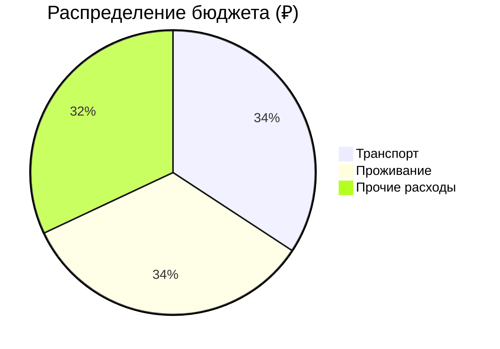
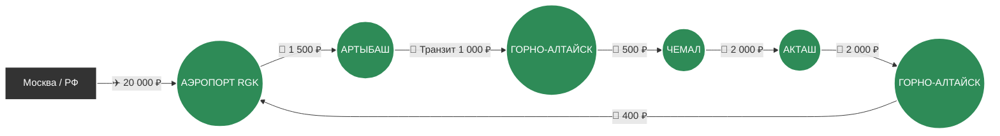

# 🗺️ Маршрут: РФ → Горный Алтай → РФ

> [!summary]+ 💰 Общий бюджет поездки: **80 000 ₽** (на 1 человека)
> - ✈️ **Транспорт (междугородний + авиа):** 27 400 ₽
> - 🏨 **Проживание (9 ночей):** 27 000 ₽
> - 🍜 **Остальное (Еда, заброски, местный транспорт):** 25 600 ₽

---

### 📍 Визуальный маршрут

---
### 📋 Детализация расходов

> [!info]- ✈️ Логистика (27 400 ₽)
> *Нажмите, чтобы развернуть детали. Включает авиаперелет и основные междугородние переезды по Алтаю (частники, такси, автобусы).*
> 
> | Откуда | Куда | Тип | Стоимость |
> | :--- | :--- | :---: | ---: |
> | РФ (Москва) | Горно-Алтайск (RGK) | ✈️ Авиа *(туда-обратно, оценка)* | `20 000 ₽` |
> | Аэропорт RGK | Артыбаш | 🚐 Частный минивэн | `1 500 ₽` |
> | Артыбаш | Горно-Алтайск | 🚌 Рейсовый автобус | `1 000 ₽` |
> | Горно-Алтайск | Чемал | 🚐 Маршрутка / Transit | `500 ₽` |
> | Чемал | Акташ | 🚐 Попутка / BlaBlaCar | `2 000 ₽` |
> | Акташ | Горно-Алтайск | 🚐 Частник / Автобус | `2 000 ₽` |
> | Горно-Алтайск | Аэропорт RGK | 🚕 Яндекс.Такси | `400 ₽` |

> [!abstract]- 🏨 Проживание (27 000 ₽)
> *Нажмите, чтобы развернуть детали. Оценочная стоимость при размещении в комфортных гостевых домах и базах отдыха (в среднем 3000 ₽/сутки за человека).*
> 
> | Локация | Ночей | Стоимость |
> | :--- | :---: | ---: |
> | 🌲 Артыбаш (Телецкое озеро) | 2 | `6 000 ₽` |
> | ⛰️ Чемал | 3 | `9 000 ₽` |
> | 🏜️ Акташ | 3 | `9 000 ₽` |
> | 🏙️ Горно-Алтайск | 1 | `3 000 ₽` |

> [!todo]- 🍜 Повседневные расходы и экскурсии (25 600 ₽)
> *Нажмите, чтобы развернуть детали. Рассчитано на основе ежедневных смет из маршрутного плана.*
> 
> | Статья расходов | Стоимость | Описание |
> | :--- | ---: | :--- |
> | 🍽️ **Питание** | `13 000 ₽` | Кафе, столовые, продукты в дорогу, финальный ужин (в среднем ~1300 ₽/день) |
> | 🚙 **Экскурсии и «заброски»** | `9 500 ₽` | Катер на Телецком (2500₽), ГАЗ-66 на Караколы (3000₽), УАЗ на Марс (2000₽), УАЗ на Ретранслятор (2000₽) |
> | 🎟️ **Билеты и экологические сборы** | `1 100 ₽` | Входы на вдп. Корбу, Че-Чкыш, Гейзерное озеро, подъемник на г. Кокуя |
> | 🚕 **Локальное такси и сувениры** | `2 000 ₽` | Такси до Тилан-Туу, Че-Чкыш, покупка меда, чая и кедровых орехов |
