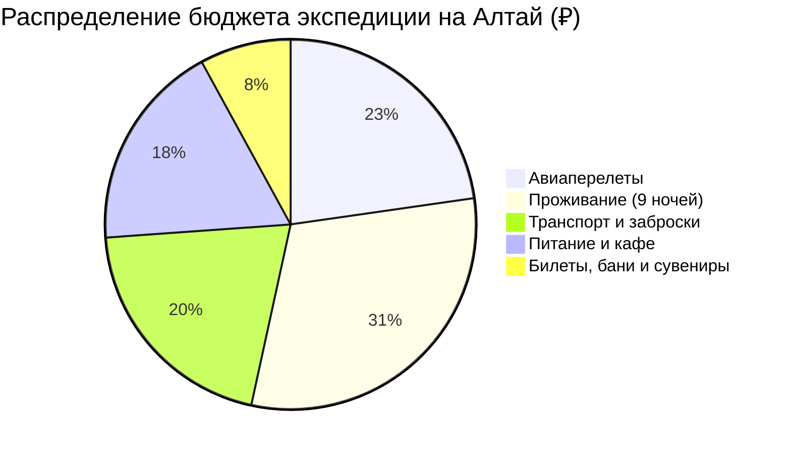

# 💰 Финансы и Полная смета тура: Алтайский Меридиан (10 дней)

> [!summary]+ 💰 Общий бюджет экспедиции «под ключ»: **~88 000 – 98 000 ₽** (на 1 человека)
> - ✈️ **Авиаперелеты (Москва ↔ RGK с багажом):** `~20 000 ₽`
> - 🏨 **Проживание (9 ночей в кедровых домиках):** `27 000 ₽`
> - 🚙 **Весь транспорт (трансферы, катер, ГАЗ-66, УАЗы):** `~18 000 ₽`
> - 🍜 **Питание, дегустации и рестораны:** `~16 000 ₽`
> - 🎟️ **Билеты, эко-сборы, бани и сувениры:** `~7 000 ₽`

---

## 📋 Детализированная структура расходов

### 1. ✈️ Авиаперелет (`20 000 ₽`)
* Регулярный рейс Москва ➔ Горно-Алтайск (RGK) ➔ Москва (S7 / Аэрофлот с багажом 23 кг).

### 2. 🏨 Проживание (9 ночей — `27 000 ₽`)
* 🌲 **Артыбаш (Телецкое озеро):** 2 ночи × `3 000 ₽` = `6 000 ₽`.
* 🌊 **Чемал:** 3 ночи × `3 000 ₽` = `9 000 ₽`.
* 🏜️ **Акташ:** 3 ночи × `3 000 ₽` = `9 000 ₽`.
* 🏙️ **Горно-Алтайск:** 1 ночь × `3 000 ₽` = `3 000 ₽`.

### 3. 🚙 Транспорт и внедорожные заброски (`~18 000 ₽`)
* Трансфер аэропорт RGK ➔ Артыбаш: `1 500 ₽`.
* Катер на Телецком озере (Корбу, Киште, Каменный залив): `3 000 ₽`.
* Трансфер Артыбаш ➔ Чемал: `1 500 ₽`.
* Транспорт по Чемальскому тракту (Еланда, Ороктой): `1 200 ₽`.
* Внедорожная заброска на ГАЗ-66 на Каракольские озера: `3 800 ₽`.
* Переезд Чемал ➔ Акташ по Чуйскому тракту: `2 000 ₽`.
* УАЗ-заброска на Марс-1 и Марс-2: `1 300 ₽`.
* Джип-подъем на Акташский ретранслятор (3038 м): `2 500 ₽`.
* Трансфер Акташ ➔ Горно-Алтайск: `2 000 ₽`.
* Такси в аэропорт RGK: `350 ₽`.

### 4. 🍽️ Питание и дегустации (`~16 000 ₽`)
* Завтраки, обеды в кафе Чуйского тракта, ужины с алтайскими специалитетами: `~1 600 ₽/день` × 10 дней.

### 5. 🎟️ Билеты, эко-сборы, бани и сувениры (`~7 000 ₽`)
* Вход на водопад Корбу (250₽), подъемник Кокуя (2000₽), Че-Чкыш (150₽), Калбак-Таш (300₽), Гейзерное (200₽), Марс (300₽), музей Анохина (350₽): `~3 550 ₽`.
* Русская баня на дровах (2 сеанса): `~1 500 ₽`.
* Кедровые орехи, горный мед, таежный чай и бальзамы: `~3 000 ₽`.
