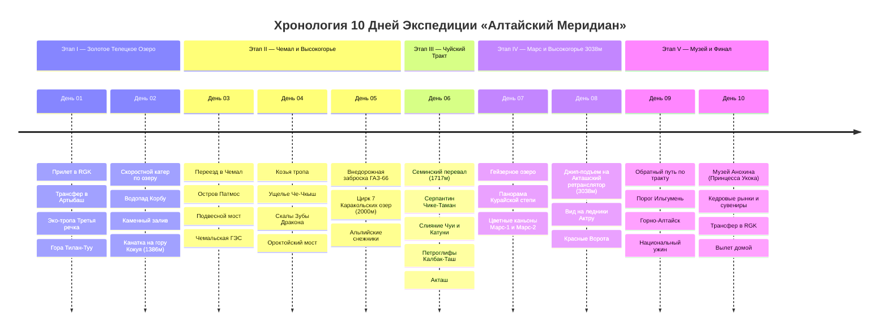

# 🌲 Алтайский Меридиан — 10 Дней Гранд-Экспедиции по Горному Алтаю

## 📝 Краткое описание

Насыщенная 10-дневная экспедиция по главным природным и сакральным ландшафтам Горного Алтая: от черневой прителецкой тайги и бирюзовых вод Катуни до марсианских каньонов Чуйской степи и вечных ледников Северо-Чуйского хребта на высоте 3038 м.

## 📖 Подробная концепция путешествия

Оптимизированный кольцевой маршрут по 5 ключевым этапам:

1. 🌲 **Этап I (Дни 01–02): Золотое озеро (Алтын-Кёль) и Северная тайга.** Прилет в Горно-Алтайск (RGK), живописный трансфер вдоль реки Бия в Артыбаш, прогулка по реликтовой эко-тропе «Третья речка», закатная панорама озера с горы Тилан-Туу, экспедиция на скоростном катере к водопадам Корбу и Киште, Каменный залив и подъем на канатной дороге на вершину горы Кокуя (1386 м).
2. 🌊 **Этап II (Дни 03–05): Чемальский оазис, пороги Катуни и Каракольские озера.** Переезд в Чемальский район, подвесной мост к храму на скалистом острове Патмос, живописная Козья тропа над бурлящей Катунью, Чемальская ГЭС, Долина горных духов Че-Чкыш, тектонический Ороктойский мост и полнодневная внедорожная экспедиция на вездеходе ГАЗ-66 к 7 высокогорным Каракольским озерам (2000 м) со снежниками.
3. 🛣️ **Этап III (День 06): Легендарный Чуйский тракт.** Проезд по одной из 10 красивейших дорог мира по версии National Geographic: кедровый Семинский перевал (1717 м), головокружительный серпантин Чике-Таман (1295 м), священное слияние мутной Чуи и бирюзовой Катуни (Чуй-Оозы), древние петроглифы урочища Калбак-Таш и прибытие в высокогорный Акташ.
4. 🚀 **Этап IV (Дни 07–08): Марсианские каньоны, Гейзерное озеро и Вершина 3038 м.** Таинственное пульсирующее Гейзерное озеро, инопланетные цветные глины каньонов Кызыл-Чин (Марс-1 и Марс-2), панорама заснеженных четырехтысячников в Курайской степи, экстремальный подъем на внедорожнике на Акташский ретранслятор (3038 м) с видом на ледники Актру и ущелье Красные Ворота.
5. 🛫 **Этап V (Дни 09–10): Возвращение по тракту, Культурный код и Вылет.** Обратный спуск вдоль Катуни, бурлящий порог Ильгумень, заселение в Горно-Алтайске, Национальный музей имени Анохина (знаменитый саркофаг «Принцессы Укока»), дегустация алтайской кухни (куурдак, чегень, талкан, копченый хариус), покупка кедровых орехов и таежного меда, трансфер в аэропорт RGK и вылет.

---

## 🗺️ Ключевые параметры экспедиции

* **Продолжительность:** 10 дней / 9 ночей.
* **Тайминг и сезон:** Идеально с конца мая по конец сентября (пик красок бирюзовой Катуни и золотой тайги — конец августа и сентябрь).
* **Формат:** 100% активное путешествие — без рутины, сбалансированное чередование пеших треков, водных переходов на катере, автопереездов по живописному Чуйскому тракту и внедорожных забросок на смотровые вершины.
* **Бюджет под ключ на 1 чел:** `~88 000 – 98 000 ₽` (авиабилеты Москва ↔ RGK `~20 000 – 25 000 ₽`, проживание 9 ночей в уютных турбазах и кедровых домиках `~27 000 ₽`, все внедорожные заброски, катер и логистика `~22 000 ₽`, питание, дегустации и билеты `~16 000 – 20 000 ₽`).

---

## 📋 Разделы проекта `-- Altai`

1. **[[Personal Note/Travel/-- Altai/02 - Маршрутный план/Маршрутный план|🗓️ Сводный Маршрутный план (10 Дней)]]**
2. **[[Телецкое озеро и Прителецкая тайга|🌲 Заметки: Телецкое озеро и Прителецкая тайга]]**
3. **[[Чемал, Долина Катуни и Еланда|🌊 Заметки: Чемал, Долина Катуни и Ороктойский мост]]**
4. **[[Каракольские озера и Высокогорье|🏔️ Заметки: Каракольские озера и высокогорье]]**
5. **[[Чуйский тракт, Семинский и Чике-Таман|🛣️ Заметки: Чуйский тракт, перевалы и петроглифы]]**
6. **[[Акташ, Курайская степь и Гейзерное озеро|✨ Заметки: Акташ, Курайская степь и Гейзерное озеро]]**
7. **[[Марс (Кызыл-Чин) и Чуйская степь|🚀 Заметки: Марс (Кызыл-Чин) и Чуйская степь]]**
8. **[[Акташский ретранслятор и Панорама Северо-Чуйского хребта|📡 Заметки: Акташский ретранслятор (3038 м) и ледники Актру]]**
9. **[[Гайд по связи, логистике и экипировке на Алтае|🎒 Заметки: Гайд по связи, логистике и экипировке на Алтае]]**
10. **[[Авиаперелеты|✈️ Бронирования: Авиаперелеты в Горно-Алтайск (RGK)]]**
11. **[[Отели, Турбазы и Глэмпинги|🏨 Бронирования: Отели, Турбазы и Кедровые домики]]**
12. **[[Внедорожные заброски, Экскурсии и Общественный транспорт (Без авто)|🚙 Бронирования: Внедорожные заброски, Катера и Автобусы (Без авто)]]**
13. **[[Personal Note/Travel/-- Altai/04 - Финансы/Финансы|💰 Бюджет и Полная смета (10 дней)]]**
14. **[[05 - Полезная информация|📖 Полезная информация: Сакральный Алтай, Традиции и Безопасность]]**
