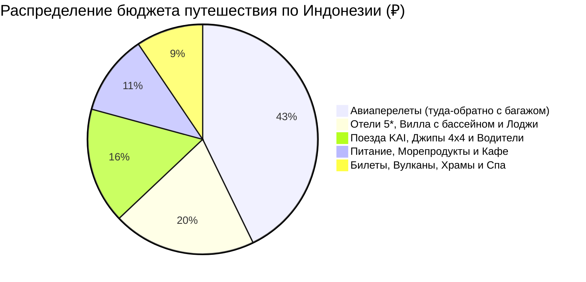

# 💰 Финансы и Полная смета тура: Индонезия (11 дней / 10 ночей)

> [!summary]+ 💰 Общий бюджет экспедиции «под ключ»: **~155 000 – 178 000 ₽** (`~26 000 000 – 29 500 000 IDR` / `~1 650 – 1 900 $`) на 1 человека
> - ✈️ **Авиаперелеты (Москва ➔ Джокьякарта // Бали ➔ Москва с багажом):** `~68 000 ₽`
> - 🏨 **Проживание (10 ночей: отели 5*, горные лоджи у вулканов, вилла с бассейном):** `~32 000 ₽` (из расчета `~54 600 ₽` на двоих / `~38 000 ₽` соло)
> - 🚆 **Весь транспорт (поезда KAI, джипы 4x4, паром, авто с водителями, Grab):** `~25 900 ₽` (`~4 315 000 IDR`)
> - 🍲 **Питание, стритфуд, свежие морепродукты в Джимбаране, спешелти-кофе:** `~18 000 ₽` (`~3 000 000 IDR`)
> - 🎟️ **Билеты и Экскурсии (Боробудур, Прамбанан, Бромо, Иджен, Секумпул, Улувату, Спа):** `~15 000 ₽` (`~2 500 000 IDR`)

