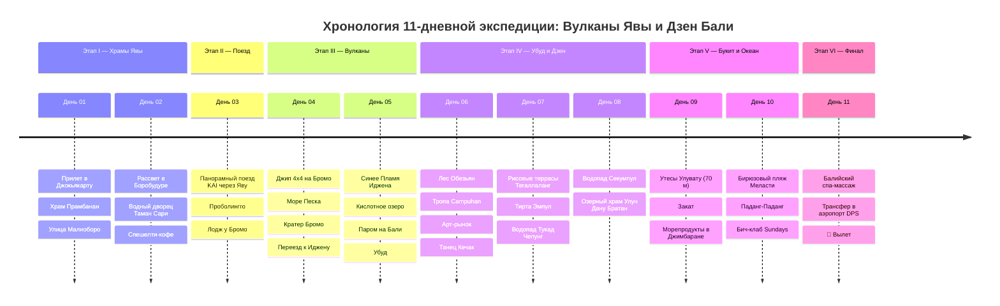

# 🌋 Индонезия: Огненные Вулканы Явы и Тропический Дзен Бали (11 Дней)

> **Концепция экспедиции:** Грандиозное 11-дневное приключение по контрастной Индонезии для соло-путешественника без автомобиля: от древнейших буддийских и индуистских храмов ЮНЕСКО и ночных джип-экспедиций на действующие вулканы острова Ява до дзен-релакса в джунглях Убуда, купания под мощнейшими водопадами и закатов на 70-метровых утесах Улувату над Индийским океаном.
> 
> 1. ⛩️ **Этап I (Дни 01–02): Древняя Джокьякарта (Ява).** Величественный индуистский комплекс Прамбанан X века, рассвет над крупнейшим в мире буддийским храмом Боробудур (ЮНЕСКО), Водный дворец султанов Таман Сари и яванский спешелти-кофе.
> 2. 🚆 **Этап II (День 03): Панорамный поезд через Яву.** Комфортабельный поезд *Kereta Api Executive* с панорамными окнами сквозь террасы рисовых полей, тропические джунгли и яванские деревушки к подножию вулканов.
> 3. 🌋 **Этап III (Дни 04–05): Огненное Кольцо Явы — Бромо и Иджен.** Джип-тур 4x4 на рассвете к космической кальдере вулкана Бромо, подъем к дымящемуся кратеру по «Морю Песка», ночное восхождение на вулкан Иджен к феномену «Синего Пламени» (Blue Fire) и бирюзовому кислотному озеру, паром через Балийский пролив и прибытие в Убуд.
> 4. 🌿 **Этап IV (Дни 06–08): Сердце Бали — Дзен Убуда, Водопады и Террасы.** Священный Лес Обезьян, живописная тропа Campuhan Ridge Walk, изумрудные рисовые террасы Тегаллаланг, омовение в священных источниках храма Тирта Эмпул, скрытый в пещере водопад Тукад Чепунг, мощный каскад Секумпул и водный храм Улун Дану на горном озере Братан.
> 5. 🌊 **Этап V (Дни 09–10): Полуостров Букит — Утёсы Улувату и Океан.** Скальный храм Улувату на краю 70-метрового обрыва над бушующим океаном, бирюзовые пляжи Меласти и Паданг-Паданг, вечерний закат и пир с морепродуктами на гриле на пляже Джимбаран.
> 6. 🛫 **Этап VI (День 11): Финальный Релакс, Балийский Спа и Вылет.** Традиционный балийский массаж с ароматическими маслами, закупка органического кофе и сувениров, трансфер в аэропорт Денпасар (DPS) и вылет домой.

---

## 🗺️ Ключевые параметры экспедиции

* **Продолжительность:** 11 дней / 10 ночей.
* **Сезонность:** Май – октябрь (сухой сезон: идеальная ясная видимость на вулканах и комфортный океан).
* **Формат перемещений:** 100% без необходимости садиться за руль (комфортные поезда **KAI Executive** на Яве, лицензированные джипы 4x4 с местными водителями на вулканах Бромо и Иджен, паромы и персональные авто с англоязычными водителями на Бали через сервис **Grab / Klook** за `~$35` в день).
* **Бюджет под ключ на 1 чел:** `~150 000 – 180 000 ₽` (`~1 600 – 1 950 $` / `~25 000 000 – 30 000 000 IDR`), включая международные перелеты, внутренние поезда, все отели и виллы с бассейнами, джип-туры на вулканы, спа и свежие морепродукты.

---

## 📋 Разделы проекта `-- Indonesia`

1. **[[Personal Note/Travel/-- Indonesia/02 - Маршрутный план/Маршрутный план|🗓️ Сводный Маршрутный план (11 Дней)]]**
2. **[[Вулканы Явы, Космический Бромо и Синее Пламя Иджена|🌋 Заметки: Вулканы Явы — Космический Бромо и Синее Пламя Иджена]]**
3. **[[Древние храмы Джокьякарты, Боробудур и Прамбанан|⛩️ Заметки: Древние храмы — Боробудур и Прамбанан]]**
4. **[[Дзен Убуда, Рисовые террасы Тегаллаланг и Священные источники|🌿 Заметки: Дзен Убуда — Тегаллаланг, Тирта Эмпул и Лес Обезьян]]**
5. **[[Водопады Бали, Секумпул, Тукад Чепунг и Каньон Тегенунган|🌊 Заметки: Водопады Бали — Секумпул и Тукад Чепунг]]**
6. **[[Полуостров Букит, Утёсы Улувату, Пляж Меласти и Джимбаран|🏄 Заметки: Букит — Улувату, Пляж Меласти и Закат в Джимбаране]]**
7. **[[Балийская и Яванская гастрономия, Наси Горенг, Сате и Морепродукты|🍲 Заметки: Индонезийская кухня — Наси Горенг, Сате и Свежий Улов]]**
8. **[[Гайд по транспорту без прав, Поезда KAI, Grab и Водители на день|🚗 Заметки: Гайд по транспорту — Поезда KAI, Джипы и Водители]]**
9. **[[Авиаперелеты (Indonesia)|✈️ Бронирования: Авиаперелеты (Джокьякарта YIA / Бали DPS)]]**
10. **[[Отели, Виллы в джунглях и Лоджи у вулканов|🏨 Бронирования: Виллы с бассейнами, Отели и Лоджи]]**
11. **[[Транспорт, Поезда KAI, Джипы и Трансферы Grab (Без авто)|🚆 Бронирования: Поезда KAI, Джип-туры 4x4 и Grab]]**
12. **[[Финансы (Indonesia)|💰 Бюджет и Полная смета тура (11 дней)]]**
13. **[[05 - Полезная информация|📖 Полезная информация: Электронная виза e-VOA, Дресс-код в храмах и Деньги]]**
