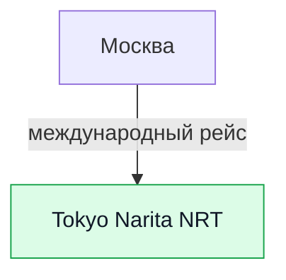
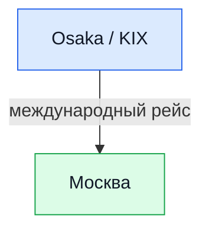

# ✈️ Бронирования: Авиаперелёты в Японию (14 дней)

> [!SUCCESS]+ 🥇 Плановый open-jaw: **Москва ➔ NRT / KIX ➔ Москва**
> * **Даты:** прилёт 28.09.2026, вылет 11.10.2026 — рабочее допущение.
> * **Оценка:** `~80 000 ₽` туда-обратно с багажом; не является купленным тарифом.
> * **Статус:** `план`; выбрать единый билет с разными аэропортами прилёта и вылета.
> * **Почему так:** NRT удобен для первого дня через N'EX, KIX убирает возврат
>   из Осаки в Токио в день международного рейса.

## 🛫 1. Перелёт туда

| Сегмент | Рейс / борт | Дата | Вылет | Прилёт | Багаж | Статус |
| :--- | :--- | :---: | :---: | :---: | :--- | :--- |
| Москва ➔ Tokyo Narita (NRT) | выбрать после сравнения | 28.09.2026 | по билету | по билету | проверить тариф | план |

> [!TIP]
> Если фактический билет приводит в HND, замените первый день целиком на
> Keikyu/Monorail до Токио: N'EX относится к NRT.

## 🛫 2. Перелёт обратно

| Сегмент | Рейс / борт | Дата | Вылет | Прилёт | Багаж | Статус |
| :--- | :--- | :---: | :---: | :---: | :--- | :--- |
| Kansai (KIX) ➔ Москва | выбрать после сравнения | 11.10.2026 | по билету | по билету | проверить тариф | план |

> [!IMPORTANT]
> Не покупать маршрут с вылетом из NRT, пока не рассчитан отдельный день
> Osaka ➔ Tokyo ➔ NRT. Это не тот же самый трансфер, что KIX из текущего плана.

## 🧳 Виза и Visit Japan Web

* Для граждан РФ требования и пакет документов сверяйте на странице
  [МИД Японии для граждан России](https://www.mofa.go.jp/j_info/visit/visa/short/russia.html).
  Visit Japan Web — это предварительное заполнение иммиграционных и таможенных
  данных, а не замена визе.
* [Официальный Visit Japan Web](https://www.digital.go.jp/en/services/visit_japan_web)
  заполняется после фиксации рейсов и адресов проживания.

## 💡 Практические советы

* Сравнивайте open-jaw и два отдельных билета; оставляйте запас на стыковках.
* Powerbank перевозится в ручной клади по правилам авиакомпании.
* Номер рейса, терминал, багаж и возвратность заносятся сюда только после оплаты.

