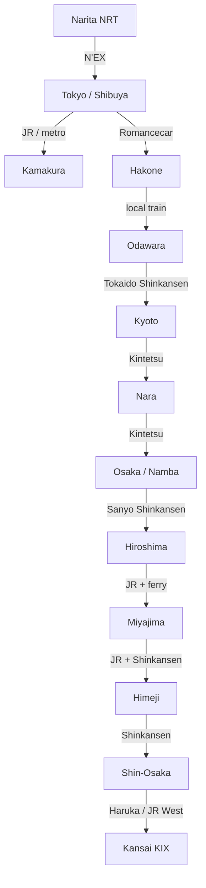

# 🚆 Бронирования: поезда, паром, Хаконэ и KIX (14 дней)

> **Транспортная архитектура:** маршрут идёт на восток ➔ запад без возврата в
> Токио: NRT ➔ Tokyo ➔ Hakone ➔ Kyoto ➔ Nara/Osaka ➔ Hiroshima/Miyajima ➔
> Himeji/Osaka ➔ KIX. Все цены плановые и сверяются после фиксации дат.

## 📍 Сквозная схема маршрута

## 📋 График междугороднего транспорта

| День | Сегмент | Транспорт | Время в пути | Способ бронирования / оплата |
| :---: | :--- | :--- | :---: | :--- |
| **01** | NRT ➔ Shibuya | 🚆 N'EX | ~1 ч 15 мин | JR East, `~3 250 JPY` *(план)* |
| **05** | Tokyo ➔ Kamakura ➔ Tokyo | 🚆 JR/Enoden | ~2 ч суммарно | IC-карта, `~2 200 JPY` *(план)* |
| **06** | Shinjuku ➔ Hakone | 🚆 Romancecar + Freepass | ~1 ч 20 мин | Odakyu, `~8 300 JPY` *(план)* |
| **07** | Hakone ➔ Odawara ➔ Kyoto | 🚆 local + Shinkansen | ~3 ч | SmartEX/JR, `~13 000 JPY` *(план)* |
| **10** | Kyoto ➔ Nara ➔ Namba | 🚆 Kintetsu | ~2 ч суммарно | IC/касса, `~1 800 JPY` *(план)* |
| **12** | Shin-Osaka ➔ Hiroshima ➔ Miyajimaguchi | 🚆 Shinkansen + JR | ~2 ч 40 мин | SmartEX/JR, `~11 500 JPY` *(план)* |
| **12** | Miyajimaguchi ➔ Miyajima | ⛴️ JR ferry | ~10 мин | IC/касса, `~500 JPY` *(план)* |
| **13** | Miyajima ➔ Hiroshima ➔ Himeji ➔ Osaka | 🚆 JR + Shinkansen | ~3 ч | JR/SmartEX, `~8 500 JPY` *(план)* |
| **14** | Shin-Osaka ➔ KIX | 🚆 Haruka / JR West | ~1 ч | JR West, `~2 400 JPY` *(план)* |
| **01–14** | Городские поездки | 🚇 метро/JR/автобусы | — | IC-карта, `~8 500 JPY` *(план)* |
| **01–14** | Такси, камеры, багаж | 🚖 резерв | — | `~10 000 JPY` *(план)* |
| **ИТОГО** | **Все перемещения** | — | — | **`~69 450 JPY` / `~37 503 ₽`** |

## 💡 Практические советы

* [JR East N'EX](https://www.jreast.co.jp/en/multi/nex/) обслуживает NRT и
  напрямую доходит до Shibuya/Shinjuku; он не является трансфером из HND.
* [SmartEX](https://smart-ex.jp/en/) используется для Tokaido/Sanyo Shinkansen.
* [Odakyu Hakone Freepass](https://odakyu-global.com/passes/hakone-freepass/)
  указывает 7 100 JPY из Shinjuku и отдельную доплату Romancecar 1 200 JPY
  в одну сторону; выход через Odawara нужно подтвердить у кассира.
* При багаже больше 160 см по сумме трёх измерений бронируйте место с
  oversized-baggage area; на дни 10 и 13 предпочтителен Takkyubin.
