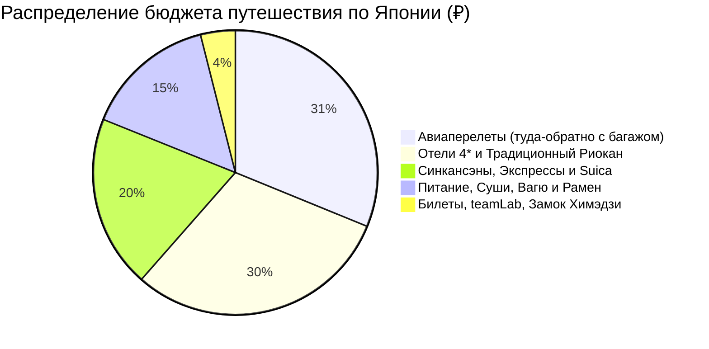

# 💰 Финансы и Полная смета тура: Япония (14 дней / 13 ночей)

> [!summary]+ 💰 Общий бюджет экспедиции «под ключ»: **~220 000 – 250 000 ₽** (`~350 000 – 395 000 JPY` / `~2 400 – 2 700 $`) на 1 человека
> - ✈️ **Авиаперелеты (Москва ↔ Токио с багажом 23 кг):** `~75 000 ₽`
> - 🏨 **Проживание (12 ночей в отелях 4* + 1 ночь в риокане с онсэном и кайсэки):** `~72 900 ₽` (из расчета `~145 800 ₽` на двоих / `~80 000 ₽` соло)
> - 🚅 **Весь транспорт (синкансэны Shinkansen, Romancecar, Suica, метро):** `~47 200 ₽` (`~73 750 JPY`)
> - 🍜 **Питание, суши, рамен, вагю A5, стритфуд и рестораны:** `~36 000 ₽` (`~56 000 JPY`)
> - 🎟️ **Билеты и Экскурсии (Shibuya Sky, teamLab, Umeda Sky, Замок Химэдзи, храмы):** `~9 500 ₽` (`~14 800 JPY`)

