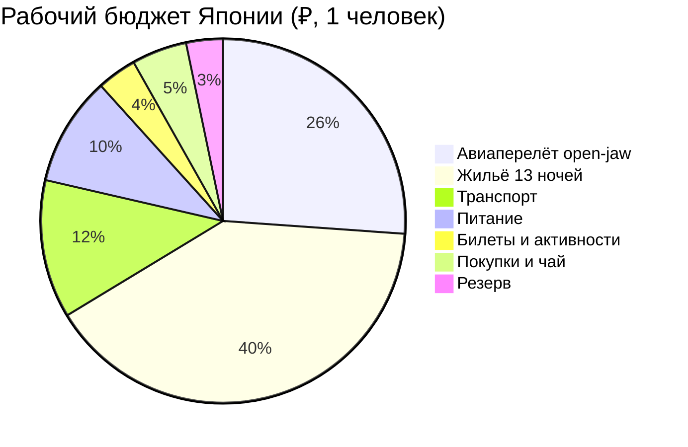

# 💰 Финансы и полная смета тура: Япония (14 дней / 13 ночей)

> [!summary]+ 💰 Общий бюджет «под ключ»: **306 231 ₽ на 1 человека**
> - ✈️ **Open-jaw перелёт:** `~80 000 ₽` *(план)*
> - 🏨 **Проживание (отели), 13 ночей:** `~123 120 ₽` *(цена комнаты; соло-консервативно)*
> - 🚄 **Поезда, паром, такси и IC:** `~37 611 ₽` *(план)*
> - 🍜 **Питание:** `~29 700 ₽` *(лимит 55 000 JPY)*
> - 🎟️ **Билеты и активности:** `~10 800 ₽` *(лимит 20 000 JPY)*
> - 🎁 **Покупки и чай:** `~15 000 ₽` *(отдельный конверт)*
> - 🛡️ **Резерв неопределённости:** `~10 000 ₽` *(не расход до фактической траты)*

Курс для рабочего пересчёта: `1 JPY ≈ 0,54 ₽`, проверен 24.09.2026 по
[Wise](https://wise.com/us/currency-converter/jpy-to-rub-rate). Это не курс
оплаты картой и не гарантия будущей цены.

### ✈️ 1. Международный авиаперелёт

| Сегмент | Стоимость ₽ | Дата | Статус |
| :--- | :---: | :---: | :--- |
| Москва ➔ NRT / KIX ➔ Москва, open-jaw | `~80 000 ₽` | 28.09 / 11.10 | *(план)* |

### 🚄 2. Поезда, междугородний транспорт и трансферы

| Маршрут | Стоимость ₽ | Дата / день | Статус / примечание |
| :--- | :---: | :---: | :--- |
| NRT ➔ Shibuya, N'EX | `~1 755 ₽` | День 01 (28.09) | *(план)* |
| Tokyo ➔ Kamakura ➔ Tokyo | `~1 188 ₽` | День 05 (02.10) | *(план)* |
| Hakone Freepass + Romancecar | `~4 482 ₽` | День 06 (03.10) | *(план)* |
| Hakone ➔ Odawara ➔ Kyoto | `~7 020 ₽` | День 07 (04.10) | *(план)* |
| Kyoto ➔ Nara ➔ Osaka | `~972 ₽` | День 10 (07.10) | *(план)* |
| Osaka ➔ Hiroshima ➔ Miyajima | `~6 210 ₽` | День 12 (09.10) | *(план)* |
| Miyajimaguchi ➔ Miyajima, JR ferry | `~108 ₽` | День 12 (09.10) | *(план)* |
| Miyajima ➔ Himeji ➔ Osaka | `~4 590 ₽` | День 13 (10.10) | *(план)* |
| Shin-Osaka ➔ KIX | `~1 296 ₽` | День 14 (11.10) | *(план)* |
| Городской транспорт | `~4 590 ₽` | Дни 01–14 | лимит *(план)* |
| Такси, камеры и багажный резерв | `~5 400 ₽` | Дни 01–14 | лимит *(план)* |
| **ИТОГО** | **`~37 611 ₽`** | — | — |

### 🏨 3. Проживание (Отели и апартаменты)

Риокан Хаконэ и риокан/отель Миядзимы учитываются в этой же категории жилья.

| Локация | Ночей | Тариф / ночь | Итого ₽ | Статус |
| :--- | :---: | :---: | :---: | :--- |
| Токио | 5 | `~9 720 ₽` | `~48 600 ₽` | *(план)* |
| Хаконэ | 1 | `~14 040 ₽` | `~14 040 ₽` | *(план)* |
| Киото | 3 | `~8 640 ₽` | `~25 920 ₽` | *(план)* |
| Осака, Namba | 2 | `~8 100 ₽` | `~16 200 ₽` | *(план)* |
| Миядзима | 1 | `~9 720 ₽` | `~9 720 ₽` | *(план)* |
| Осака, Shin-Osaka | 1 | `~8 640 ₽` | `~8 640 ₽` | *(план)* |
| **ИТОГО** | **13** | — | **`~123 120 ₽`** | — |

### 🍜 4. Питание, кофе и гастрономия

| Конверт | Лимит | Расчёт | Статус |
| :--- | :---: | :--- | :--- |
| Питание и кофе | `~55 000 JPY` / `~29 700 ₽` | 14 дней × `~3 930 JPY` | лимит *(план)* |

### 🎟️ 5. Входные билеты, канатки и активности

Лимит конверта — `~20 000 JPY` (`~10 800 ₽`): Shibuya Sky сейчас `3 400 JPY`
после 15:00, teamLab Planets — ориентир от `~4 200 JPY`, Himeji Castle —
`2 500 JPY`, Itsukushima Shrine — `300 JPY`; остальные храмы и смотровые
перепроверяются по официальным страницам перед оплатой. Это лимит категории,
а не одна фиктивная транзакция.

| Активность | Лимит ₽ | День | Статус |
| :--- | :---: | :---: | :--- |
| Shibuya Sky, teamLab, храмы, замок Химэдзи, Umeda Sky | `~10 800 ₽` | 01–13 | лимит *(план)* |

### 🎁 6. Сувениры, локальные специалитеты и резервный буфер

| Конверт | Лимит ₽ | Примечание | Статус |
| :--- | :---: | :--- | :--- |
| Покупки, чай и подарки | `~15 000 ₽` | отдельный конверт; не смешивать с обязательными билетами и едой | лимит *(план)* |
| Резерв неопределённости | `~10 000 ₽` | не считать расходом до фактической траты | резерв *(план)* |

> [!WARNING]
> До покупки отелей или перелёта пересчитать таблицу по фактической валютной
> операции. Сейчас это согласованный рабочий бюджет, а не подтверждённый факт.
