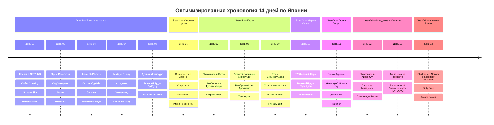

# 🗾 Золотое Кольцо Японии — 14 Дней Бесшовной Гранд-Экспедиции

> **Концепция путешествия:** Оптимизированный линейный маршрут по Японии (*Golden Route*), исключающий двойные заселения в Токио и лишние переезды с чемоданами. Полное погружение в Токио в первой части поездки, плавное движение на запад по скоростной линии Синкансэн (Фудзи/Хаконэ ➔ Киото ➔ Нара ➔ Осака ➔ Хиросима и Миядзима ➔ Замок Химэдзи) и быстрый комфортный экспресс-трансфер в аэропорт в финальный день.
> 
> 1. 🏙️ **Этап I (Дни 01–05): Большой Токио и Камакура (5 дней / 1 отель).** Сибуя Crossing, Shibuya Sky, исторический Сенсо-дзи в Асакусе, сад Хамарикю, арт-музей teamLab Planets, Одайба, Акихабара, Мэйдзи Дзингу, Синдзюку и выезд к Большому Будде в древнюю Камакуру.
> 2. 🗻 **Этап II (День 06): Национальный парк Хаконэ и Гора Фудзи.** Поезд *Romancecar*, пиратский корабль по озеру Аси, канатная дорога Овакудани, черные яйца долголетия и традиционный риокан с онсэном и ужином *кайсэки*.
> 3. ⛩️ **Этап III (Дни 07–09): Древняя столица Киото (3 дня).** 10 000 алых тории в Фусими Инари, Золотой павильон Кинкаку-дзи, бамбуковый лес Арасияма, храм на сваях Киёмидзу-дэра, улочки Нинэндзака, рынок Нисики и вечерний квартал гейш Гион.
> 4. 🦌 **Этап IV (День 10): Священная Нара и Переезд в Осаку.** 1200 ручных оленей парка Нара, 15-метровый Великий Будда в Тодай-дзи и пятиэтажный Замок Осаки.
> 5. 🐙 **Этап V (День 11): Осака — Столица японского стритфуда.** Рынок морепродуктов Куромон (вагю A5, уни), парящий сад небоскреба Umeda Sky Building и неоновый Дотонбори (Glico Man, такояки и окономияки).
> 6. ⛩️ **Этап VI (Дни 12–13): Священный остров Миядзима, Хиросима и Замок Химэдзи.** Сверхскоростной синкансэн в Хиросиму, паром на остров Миядзима, Плавающие Тории Ицукусима в морском приливе, устрицы и шедевр ЮНЕСКО — белоснежный Замок Белой Цапли Химэдзи.
> 7. 🛫 **Этап VII (День 14): Экспресс Shinkansen в Токио и Вылет домой.** Прямой 2-часовой синкансэн Nozomi прямо в Токио/аэропорт Нарита (NRT), шопинг Duty Free и вечерний вылет домой без необходимости повторного заселения в отель.

---

## 🗺️ Ключевые параметры экспедиции

* **Продолжительность:** 14 дней / 13 ночей.
* **Логистическая схема:** Линейный бесшовный маршрут `Токио (5н) ➔ Хаконэ (1н) ➔ Киото (3н) ➔ Осака (2н) ➔ Миядзима/Хиросима (2н) ➔ Прямой экспресс в аэропорт Токио`.
* **Формат перемещений:** 100% без авто (сверхскоростные поезда **Shinkansen**, цифровая карта **Suica / Pasmo**, горные экспрессы и паромы).
* **Бюджет под ключ на 1 чел:** `~220 000 – 250 000 ₽` (`~350 000 – 395 000 JPY` / `~2 400 – 2 700 $`), включая перелеты, все отели и риокан с онсэном, синкансэны, вагю A5 и экскурсии.

---

## 📋 Разделы проекта `-- Japan`

1. **[[Personal Note/Travel/-- Japan/02 - Маршрутный план/Маршрутный план|🗓️ Сводный Маршрутный план (14 Дней)]]**
2. **[[Токио, Небоскребы Сибуя, Асакуса и Акихабара|🏙️ Заметки: Токио — Сибуя, Асакуса, teamLab и Акихабара]]**
3. **[[Хаконэ, Вид на гору Фудзи, Озеро Аси и Онсэны|🗻 Заметки: Хаконэ, Вид на Фудзи, Озеро Аси и Онсэны]]**
4. **[[Киото, Тысяча Тории Фусими Инари, Бамбуковый лес и Золотой Павильон|⛩️ Заметки: Киото — Фусими Инари, Арасияма и Киёмидзу-дэра]]**
5. **[[Нара, Священные олени и Великий Будда Тодай-дзи|🦌 Заметки: Нара — Священные олени и Храм Тодай-дзи]]**
6. **[[Осака, Гастрономический рай Дотонбори и Замок Осаки|🐙 Заметки: Осака — Дотонбори, Куромон и Замок]]**
7. **[[Хиросима, Священный остров Миядзима и Плавающие Тории|⛩️ Заметки: Миядзима, Хиросима и Замок Химэдзи]]**
8. **[[Японская гастрономия, Рамен, Вагю A5, Суши и Кайсэки|🍜 Заметки: Японская кухня — Рамен, Вагю, Суши и Кайсэки]]**
9. **[[Гайд по транспорту без прав, Синкансэны, Suica и Метро Японии|🚅 Заметки: Гайд по поездам Синкансэн, Suica и метро без авто]]**
10. **[[Авиаперелеты (Japan)|✈️ Бронирования: Авиаперелеты в Токио (NRT / HND)]]**
11. **[[Отели, Риоканы и Онсэны|🏨 Бронирования: Отели, Риокан с онсэном и графики заселений]]**
12. **[[Транспорт, Синкансэны Shinkansen и Suica (Без авто)|🚅 Бронирования: Синкансэны, SmartEX и Suica]]**
13. **[[Финансы (Japan)|💰 Бюджет и Полная смета (14 дней)]]**
14. **[[05 - Полезная информация|📖 Полезная информация: Visit Japan Web, Этикет, Онсэны и Правила]]**
