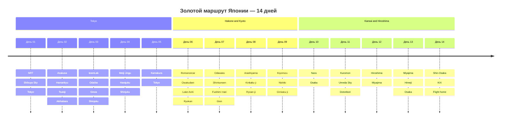

# 🗾 Золотой маршрут Японии — 14 дней без автомобиля

## 📝 Краткое описание

Линейный маршрут по Японии на 14 дней: Токио и Камакура, Хаконэ с онсэном,
Киото, Нара, Осака, Хиросима и Миядзима. Маршрут заканчивается в Осаке,
откуда предусмотрен поезд в аэропорт Кансай (KIX), поэтому в день вылета нет
рискованного возврата в Токио.

> [!IMPORTANT]
> Даты `2026-09-28 — 2026-10-11` — рабочее допущение по ближайшему понедельнику,
> потому что исходный план содержал только дни недели. До покупки билетов замените
> даты во всех YAML-шапках и перепроверьте часы прилива, расписания и цены.

## 📖 Подробная концепция путешествия

1. 🏙️ **Дни 01–05 — Токио и Камакура:** один базовый отель, городские районы
   и один день на древнюю столицу самураев.
2. 🗻 **День 06 — Хаконэ:** Romancecar, петля горного транспорта, Овакудани,
   озеро Аси и ночь в риокане.
3. ⛩️ **Дни 07–09 — Киото:** Фусими Инари, Арасияма, Кинкаку-дзи,
   Киёмидзу-дэра, Нисики и Гинкаку-дзи с отдельными переходами.
4. 🦌 **День 10 — Нара и Осака:** парк Нара, Тодай-дзи, переезд в Осаку и
   спокойный вечер без дополнительной гонки по достопримечательностям.
5. 🐙 **День 11 — Осака:** Куромон, Umeda Sky и Дотонбори.
6. ⛩️ **Дни 12–13 — Хиросима, Миядзима и Химэдзи:** западный Shinkansen,
   Мемориальный парк, островная ночёвка, затем Химэдзи по пути в Осаку.
7. 🛫 **День 14 — вылет из KIX:** Haruka из Shin-Osaka с минимум трёхчасовым
   запасом до международного рейса.

## 🗺️ Ключевые параметры

* **Продолжительность:** 14 дней / 13 ночей.
* **Ночёвки:** Токио 5н ➔ Хаконэ 1н ➔ Киото 3н ➔ Осака 2н ➔
  Миядзима 1н ➔ Осака 1н.
* **Авиалогика:** прилёт в NRT; обратный вылет из KIX. HND не используется
  в этой версии, потому что N'EX обслуживает Narita, а не Haneda.
* **Формат перемещений:** без автомобиля — Shinkansen, JR и частные железные
  дороги, метро, автобус Хаконэ, паром JR и IC-карта.
* **Рабочий бюджет на 1 человека:** `~300 000–340 000 ₽`, включая плановый
  open-jaw перелёт, жильё по варианту №1, транспорт, питание, билеты и резерв.
  Расчёт использует ориентир `1 JPY ≈ 0,54 ₽` на 24.09.2026; курс и цены
  перепроверяются перед оплатой.

## 📋 Разделы проекта `-- Japan`

1. **[[02 - Маршрутный план/Маршрутный план|🗓️ Сводный маршрутный план]]**
2. **[[01 - Заметки/Токио, Небоскребы Сибуя, Асакуса и Акихабара|🏙️ Заметки: Токио]]**
3. **[[01 - Заметки/Хаконэ, Вид на гору Фудзи, Озеро Аси и Онсэны|🗻 Заметки: Хаконэ]]**
4. **[[01 - Заметки/Киото, Тысяча Тории Фусими Инари, Бамбуковый лес и Золотой Павильон|⛩️ Заметки: Киото]]**
5. **[[01 - Заметки/Нара, Священные олени и Великий Будда Тодай-дзи|🦌 Заметки: Нара]]**
6. **[[01 - Заметки/Осака, Гастрономический рай Дотонбори и Замок Осаки|🐙 Заметки: Осака]]**
7. **[[01 - Заметки/Хиросима, Священный остров Миядзима и Плавающие Тории|⛩️ Заметки: Миядзима и Хиросима]]**
8. **[[01 - Заметки/Японская гастрономия, Рамен, Вагю A5, Суши и Кайсэки|🍜 Заметки: кухня]]**
9. **[[01 - Заметки/Гайд по транспорту без прав, Синкансэны, Suica и Метро Японии|🚅 Заметки: транспорт]]**
10. **[[03 - Бронирования/Авиаперелеты|✈️ Бронирования: open-jaw NRT ➔ KIX]]**
11. **[[03 - Бронирования/Отели|🏨 Бронирования: жильё]]**
12. **[[03 - Бронирования/Транспорт|🚅 Бронирования: поезда, Хаконэ и KIX]]**
13. **[[04 - Финансы/Финансы|💰 Бюджет и смета]]**
14. **[[05 - Полезная информация/05 - Полезная информация|📖 Въезд, этикет, онсэны и ЧС]]**
15. **[[06 - Чек лист/06 - Чек лист|✅ Чек-листы поездки]]**
