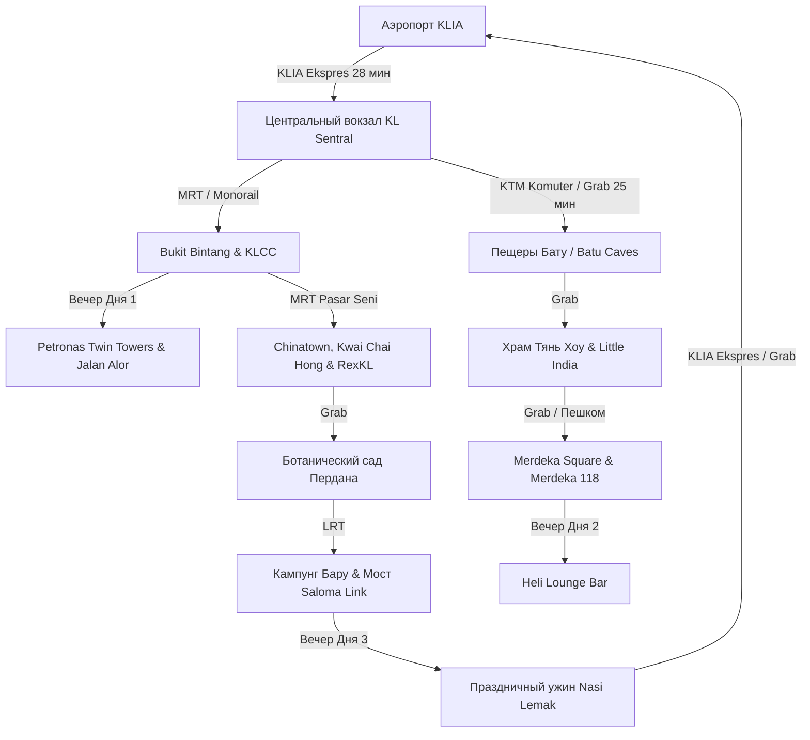

# 🗺️ Куала-Лумпур: Тропический футуризм и плавильный котел культур (3 дня)

> [!INFO] О путешествии
> **Длительность:** 3 дня / 3 ночи
> **Маршрут:** Аэропорт KLIA ➔ Золотой треугольник (Bukit Bintang / KLCC) ➔ Башни Петронас ➔ Пещеры Бату (Batu Caves) ➔ Храм Тянь Хоу ➔ Little India ➔ Merdeka Square & River of Life ➔ Heli Lounge ➔ Арт-Чайнатаун & RexKL ➔ Ботанический сад Пердана ➔ Деревня Кампунг Бару & Мост Салома ➔ KLIA
> **Концепция:** Идеально сбалансированный маршрут по столице Малайзии. Знакомство со сверкающими символами мегаполиса (Petronas Twin Towers, Merdeka 118), подъем по 272 цветным ступеням к золотому колоссу бога Муругана в известняковых гротах Бату, даосский шестиярусный храм Тянь Хоу, колониальные мавританские ансамбли, тенистые аллеи тропического ботанического сада, легендарный ночной стритфуд на улице Джалан Алор и последний оазис аутентичной малайской деревенской жизни Кампунг Бару прямо под сенью супернебоскребов.
> **Транспорт:** Скоростной экспресс KLIA Ekspres, пригородный поезд KTM Komuter, метро RapidKL MRT/LRT, монорельс KL Monorail, такси Grab и пешеходные видовые мосты.

---

## 🌴 Программа маршрута по дням

### 🇲🇾 День 01 | Врата в Малайзию и огни Петронас
* **Подробная страница:** [[01 Куала-Лумпур (д1) 🛬 Врата в Малайзию и огни Петронас]]
* **Краткое содержание:**
  Прибытие в международный аэропорт KLIA, скоростной трансфер на поезде **KLIA Ekspres** до вокзала KL Sentral и заселение в отель в районе Bukit Bintang / KLCC. Отдых у инфинити-бассейна на крыше. Вечерняя прогулка к сияющим башням-близнецам **Petronas Twin Towers**, светомузыкальное шоу фонтанов Lake Symphony в парке KLCC и погружение в культовый ночной стритфуд на улице **Jalan Alor** (хрустящие куриные крылышки Wong Ah Wah, сатай на углях, димсамы и кокосовое мороженое в скорлупе).

---

### 🛕 День 02 | Колосс Муругана, пещеры Бату и Тянь Хоу
* **Подробная страница:** [[02 Куала-Лумпур (д2) 🛕 Колосс Муругана, пещеры Бату и Тянь Хоу]]
* **Краткое содержание:**
  Утренний выезд к грандиозным 400-миллионнолетним **Пещерам Бату (Batu Caves)**: золотая 43-метровая статуя бога Муругана и подъем по 272 разноцветным ступеням в окружении макак. Традиционный индийский завтрак Масала Доса. Днем — шестиярусный китайский храм **Тянь Хоу (Thean Hou Temple)** с тысячами красных фонариков и панорамой на город. Обед на банановом листе в Little India (Brickfields). Историческая площадь Независимости (**Merdeka Square**), мавританский дворец Султана Абдул-Самада, набережная River of Life и шпиль **Merdeka 118**. Закатный коктейль на открытой вертолетной площадке бара **Heli Lounge** (360° панорама) и ужин в Madam Kwan's.

---

### 🏮 День 03 | Этнический микс, джунгли Пердана и Кампунг Бару
* **Подробная страница:** [[03 Куала-Лумпур (д3) 🏮 Этнический микс, джунгли Пердана и Кампунг Бару]]
* **Краткое содержание:**
  Винтажный Чайнатаун: тосты с кайей и кофе в старинной кофейне Ho Kow Kopitiam, фото-муралы переулка **Kwai Chai Hong**, индуистский храм Шри Махамариамман, арт-лабиринт книжных полок **RexKL** и покупки батика на Центральном рынке (Central Market). Прогулка среди тропических пальм в Ботаническом саду **Perdana Botanical Gardens** (по желанию — Парк птиц KL Bird Park). На закате — аутентичная малайская деревня **Кампунг Бару (Kampung Baru)** с деревянными домами на сваях на фоне башен Петронас, футуристичный мост **Saloma Link Bridge** и праздничный ужин с эталонным **Наси Лемак (Nasi Lemak Ayam Goreng)**. Выезд в аэропорт KLIA на KLIA Ekspres.

---

## 🗺️ Карта ключевых точек маршрута

