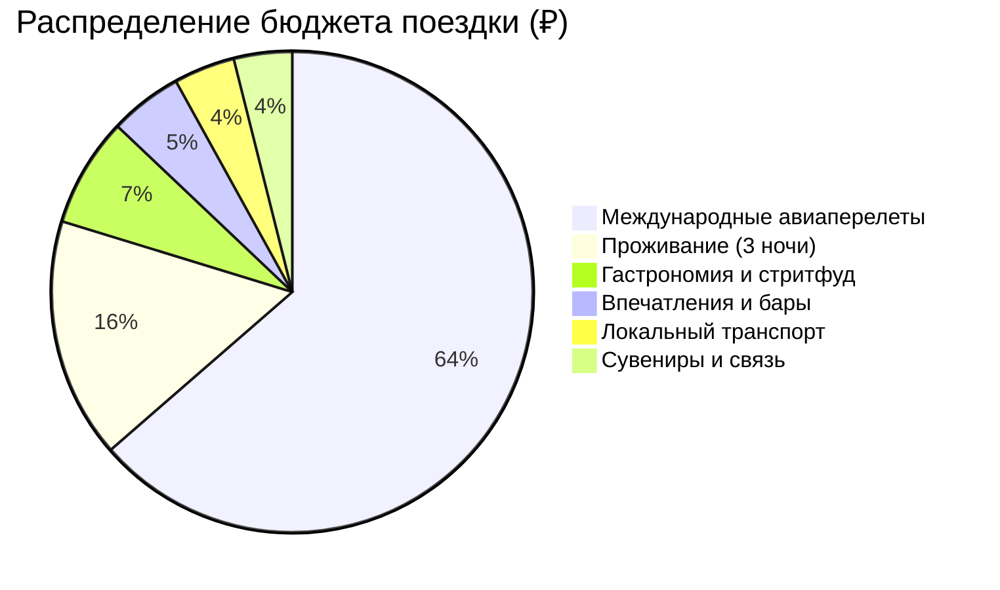
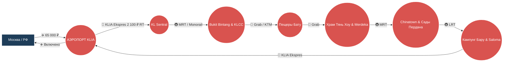

# 🗺️ Маршрут: РФ → Куала-Лумпур → РФ (3 дня)

> [!summary]+ 💰 Общий ориентировочный бюджет поездки: **102 200 ₽** (на 1 человека)
> - ✈️ **Международные авиаперелеты (РФ ➔ KUL ➔ РФ):** 65 000 ₽
> - 🏨 **Проживание (3 ночи в видовом отеле с инфинити-бассейном):** 16 500 ₽ (при 1-местном) / 8 250 ₽ (при 2-местном)
> - 🍜 **Питание, стритфуд Джалан Алор и рестораны:** 7 500 ₽ (`~360 MYR`)
> - 🎟️ **Впечатления, вертолетная площадка Heli Lounge и развлечения:** 5 000 ₽ (`~240 MYR`)
> - 🚇 **Транспорт (KLIA Ekspres туда-обратно + Grab + метро MRT):** 4 200 ₽ (`~200 MYR`)
> - 🛍️ **Связь (eSIM), сувениры и малайский батик:** 4 000 ₽ (`~190 MYR`)

---

### 📍 Визуальная схема логистики

---

### 📋 Детализация расходов

> [!info]- ✈️ Логистика и Транспорт (~69 200 ₽)
> *Нажмите, чтобы развернуть детали. Включает международный авиаперелет, аэропортовый экспресс и городские поездки.*
> 
> | Статья расходов | Стоимость (MYR) | Стоимость (RUB) | Описание |
> | :--- | :---: | ---: | :--- |
> | ✈️ **Международный авиаперелет (туда-обратно)** | — | `65 000 ₽` | Регулярный рейс (Qatar / Emirates / China Eastern / Etihad) |
> | 🚄 **Скоростной поезд KLIA Ekspres (RT)** | `100 MYR` | `2 100 ₽` | Билет туда-обратно из аэропорта до центрального вокзала |
> | 🚕 **Такси Grab (6–8 поездок по городу)** | `~80 MYR` | `1 680 ₽` | Поездки в Пещеры Бату, Храм Тянь Хоу, Сады Пердана |
> | 🚇 **Метро RapidKL MRT / LRT / Монорельс** | `~20 MYR` | `420 ₽` | Бесконтактная оплата картой на турникетах |
> | **Всего по разделу** | | **~69 200 ₽** | |

> [!abstract]- 🏨 Проживание (16 500 ₽ / 8 250 ₽ при 2-местном)
> *Нажмите, чтобы развернуть детали. Оценочная стоимость при размещении в комфортных отелях 4* в «Золотом треугольнике».*
> 
> | Локация | Ночей | Стоимость за номер / ночь | Итого (при 1-местном) |
> | :--- | :---: | :---: | ---: |
> | 🇲🇾 **Куала-Лумпур (The FACE Suites / citizenM Bukit Bintang)** | 3 | `~5 500 ₽` (`260 MYR`) | `16 500 ₽` |
> | *Туристический сбор (Tourism Tax)* | 3 | `10 MYR` / ночь | `~630 ₽` (`30 MYR`) |

> [!todo]- 🍜 Гастрономия, Впечатления и Покупки (~16 500 ₽)
> *Нажмите, чтобы развернуть детали. Рассчитано на основе подробных ежедневных смет.*
> 
> | Статья расходов | Стоимость (MYR) | Стоимость (RUB) | Описание |
> | :--- | :---: | ---: | :--- |
> | 🍽️ **Питание и стритфуд (3 дня)** | `~360 MYR` | `7 500 ₽` | Крылышки Wong Ah Wah и сатай на Джалан Алор, Nasi Lemak Wanjo, Madam Kwan's, Ho Kow Kopitiam |
> | 🍸 **Коктейль на вертолетной площадке Heli Lounge** | `~45 MYR` | `950 ₽` | Входной напиток на закатной вертолетной площадке Menara KH |
> | 🦜 **Входные билеты (KL Bird Park по желанию)** | `~85 MYR` | `1 780 ₽` | Крупнейший в мире открытый авиарий свободного полета |
> | 🛕 **Пещеры Бату и Храм Тянь Хоу** | `Бесплатно` | `0 ₽` | Вход свободный (пожертвования по желанию) |
> | 📱 **Связь (Местная eSIM Celcom/Maxis 15GB)** | `~35 MYR` | `730 ₽` | Покупка в зоне прилета KLIA |
> | 🛍️ **Сувениры (Малайский батик на Central Market, чай)** | `~150 MYR` | `3 150 ₽` | Ремесленные изделия, батик ручной работы, чай Cameron Valley |
