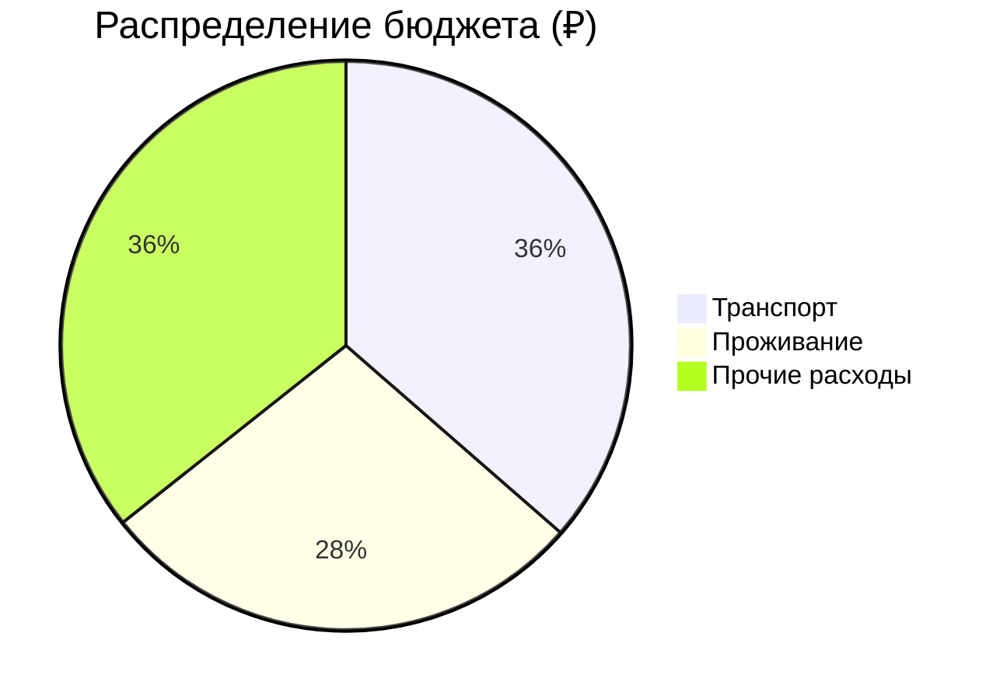
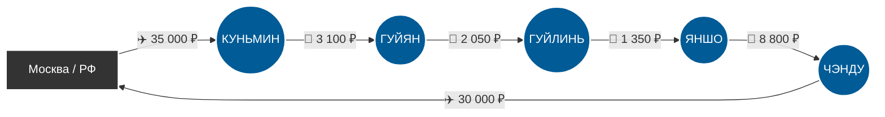

# 🗺️ Маршрут: РФ → Юго-Запад Китая → РФ

> [!summary]+ 💰 Общий бюджет поездки: **220 460 ₽** (на 1 человека)
> - ✈️ **Транспорт (междугородний + авиа):** 80 300 ₽
> - 🏨 **Проживание (17 ночей):** 61 500 ₽
> - 🍜 **Остальное (Еда, билеты, местный транспорт):** 78 660 ₽

---

### 📍 Визуальный маршрут

---
### 📋 Детализация расходов

> [!info]- ✈️ Логистика (80 300 ₽)
> *Нажмите, чтобы развернуть детали. Включает основные переезды между локациями.*
> 
> | Откуда | Куда | Тип | Стоимость |
> | :--- | :--- | :---: | ---: |
> | РФ (Москва) | Куньмин | ✈️ Авиа *(оценка)* | `35 000 ₽` |
> | Куньмин | Гуйян | 🚂 Поезд | `3 100 ₽` |
> | Гуйян | Гуйлинь | 🚂 Поезд | `2 050 ₽` |
> | Гуйлинь | Яншо | 🚕 Такси DiDi | `1 350 ₽` |
> | Яншо | Чэнду | 🚂 Поезд (1 класс) | `8 800 ₽` |
> | Чэнду | РФ (Москва) | ✈️ Авиа *(оценка)* | `30 000 ₽` |

> [!abstract]- 🏨 Проживание (61 500 ₽)
> *Нажмите, чтобы развернуть детали. Оценочная стоимость при размещении в комфортных отелях/бутик-отелях 3-4*.*
> 
> | Город | Ночей | Стоимость |
> | :--- | :---: | ---: |
> | 🇨🇳 Куньмин | 3 | `10 500 ₽` |
> | 🇨🇳 Гуйян | 3 | `9 000 ₽` |
> | 🇨🇳 Гуйлинь | 2 | `6 000 ₽` |
> | 🇨🇳 Яншо | 3 | `12 000 ₽` |
> | 🇨🇳 Чэнду | 6 | `24 000 ₽` |

> [!todo]- 🍜 Повседневные расходы (78 660 ₽)
> *Нажмите, чтобы развернуть детали. Рассчитано на основе подробных ежедневных смет из маршрута.*
> 
> | Статья расходов | Стоимость | Описание |
> | :--- | ---: | :--- |
> | 🍽️ **Еда и напитки** | `32 000 ₽` | Хот-поты, стритфуд, кофе, снеки (в среднем ~1 800 ₽/день) |
> | 🎟️ **Развлечения и билеты** | `32 660 ₽` | Входы в парки, База панд, Опера в Чэнду, канатные дороги, сплав на плоту, массаж, сувениры и чай |
> | 🚕 **Местный транспорт** | `14 000 ₽` | Метро, такси внутри городов, аренда скутера, билеты на радиальные выезды (Шилинь, Аньшунь, Лэшань) |
