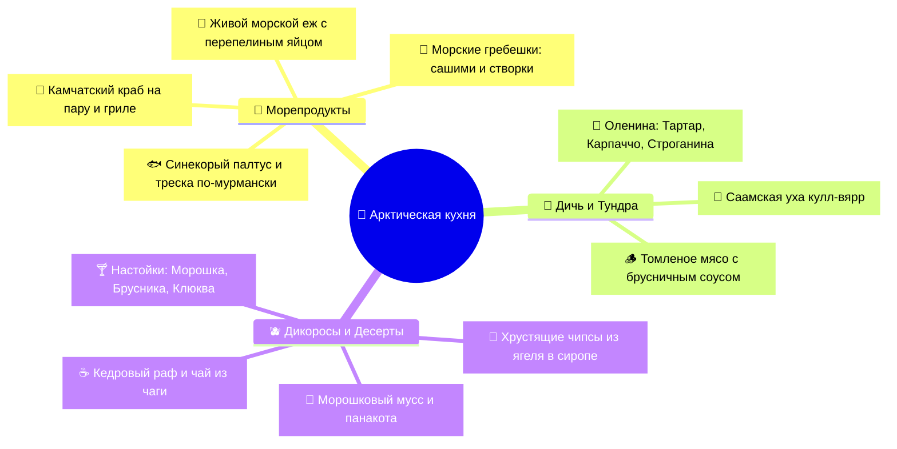

# 🦀 Арктическая кухня, Морепродукты и Рестораны Мурманска

> **Гастрономический бренд:** Арктическая кухня (*Arctic Cuisine / Taste of the Arctic*) — динамично развивающийся мировой гастрономический феномен, основанный на диких дарах Баренцева моря, тундры и тайги: камчатский краб, морские ежи, дикая семга, синекорый палтус, оленина свободного выпаса и таежные дикоросы (морошка, брусника, ягель, чага).

  Шкала рейтинга впечатлений:
  9.5–10Must-try
  8.5–9.4Очень стоит
  7.5–8.4Интересно

---

## 🍽️ Главные деликатесы Заполярья

| Продукт | Описание и Вкусовой профиль | Где пробовать | Рейтинг |
| :--- | :--- | :--- | :---: |
| **Камчатский краб** | Сладковатое сочное белое мясо клешней и фаланг. Подается вареным на пару со сливочным маслом. | «Тундра», «Царская Охота», «Grebeshki» | 9.9Must-try |
| **Живые морские ежи** | Вскрываются при госте. Едят оранжевую икру с перепелиным желтком и соевым соусом — чистый вкус океана. | «Grebeshki» (Териберка), «Тундра» | 9.8Must-try |
| **Морские гребешки** | Нежнейший сладковатый мускул: сырые сашими с лимоном или запеченные на створках под сливочным соусом. | «Grebeshki», «Mole» (Териберка) | 9.7Must-try |
| **Синекорый палтус** | Маслянистая белая рыба с тающей текстурой, запеченная с можжевеловым соусом или копченая. | «Царская Охота», «Седьмой Океан» | 9.4Очень стоит |
| **Тартар и Карпаччо из оленины** | Нежнейшая сырая оленина с брусникой, кедровым орехом и четверговой солью. Абсолютно постное мясо. | «Царская Охота», «Тундра» | 9.3Очень стоит |
| **Чипсы из ягеля** | Вымоченный в ягодных сиропах (черника, брусника, морошка) и дегидрированный олений мох. Хрустящий шедевр. | «Царская Охота», сувенирные лавки | 9.1Очень стоит |
| **Северные настойки** | Авторские крафтовые настойки на морошке, бруснике, клюкве и кедровых шишках. | «Тундра. Grill & Bar», «Царская Охота» | 9.0Очень стоит |

---

## 🏆 Топ-рестораны Мурманска и Териберки

### 1. 🌲 Ресторан «Царская Охота» (Мурманск)
* **Концепция:** Флагман арктической кухни от шеф-повара Светланы Козейко. Атмосфера охотничьего дома, аутентичные северные рецепты в современной подаче.
* **Фирменные блюда:** Оленина с пюре из печеного яблока, карпаччо из оленя с брусникой, солянка с дичью, чипсы из ягеля, палтус на гриле.
* **Локация:** Кольский просп., 86.
* **Средний чек:** `~2 500 – 3 500 ₽`.

---

### 2. 🔥 Ресторан «Тундра. Grill & Bar» (Мурманск)
* **Концепция:** Стильный современный лофт с открытой кухней, хоспером (дровяной печью) и собственной пивоварней.
* **Фирменные блюда:** Фаланги краба на гриле, тартар из оленины, бургер с оленьей котлетой, уха из семги, морошковые коктейли.
* **Локация:** Ул. Полярные Зори, 49/2.
* **Средний чек:** `~2 000 – 3 000 ₽`.

---

### 3. 🌊 Ресторан «Grebeshki» / «Teriberka Tour» (Териберка)
* **Концепция:** Панорамный ресторан прямо на побережье Териберской губы с аквариумами с живыми морепродуктами.
* **Фирменные блюда:** Сет «Еж + Гребешок», крабовый биск, свежая треска по-териберски.
* **Локация:** Село Териберка, ул. Комсомольская.
* **Средний чек:** `~2 500 – 4 000 ₽`.

---

### 4. ☕ Спешелти-кофе в Мурманске
* **«Юность» (просп. Ленина, 61):** Лучший спешелти-кофе города, авторский кедровый раф с брусничным грильяжем, фильтр-кофе свежей обжарки.
* **«Coffee & People»:** Уютная кофейня с десертами и авторским латте с дикой морошкой.
