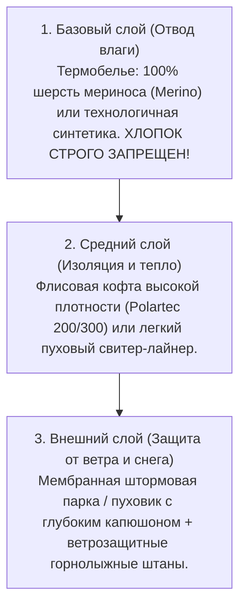
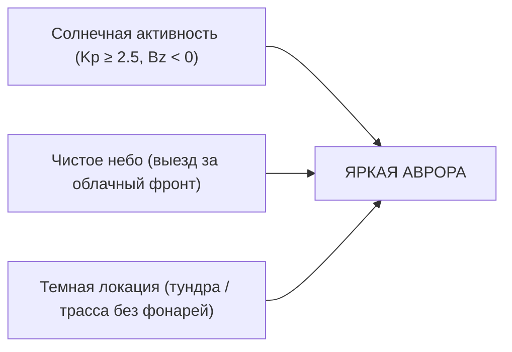

# 🌌 Гайд: Экипировка, Полярная ночь и Охота за Северным сиянием

> **Цель гайда:** Обеспечить 100% готовность к суровым арктическим условиям Заполярья: правильный подбор многослойной одежды против ветра и мороза, понимание светового режима полярной ночи, стратегия успешной ночной охоты за Авророй (Северным сиянием) и настройки фототехники для идеальных кадров.

---

## ❄️ Климат, Ветер и «Правило 3-х слоев»

Заполярный климат Кольского полуострова коварен: из-за близости Баренцева моря и теплого течения Гольфстрим здесь высокая влажность и постоянные штормовые ветра. Мороз `-10°C` при ветре 15 м/с ощущается как `-25°C...-30°C`.

### 🧤 Критически важные аксессуары
1. **Обувь:** Зимние ботинки на толстой рифленой подошве (EVA / резина с термоноском, запас +1 размер для воздушной подушки) или специализированная арктическая обувь (Baffin, Sorel, Salomon Toundra).
2. **Защита лица:** Плотный флисовый бафф или балаклава (защищает нос и щеки от обморожения) + горнолыжная маска/очки на случай метели в Териберке.
3. **Руки:** Двухслойная система — тонкие сенсорные перчатки (touch-screen) + непродуваемые теплые варежки/верхонки поверх.
4. **Химические самогревы:** Одноразовые теплоиды (для рук, для стелек обуви и для смартфонов).

---

## 🌌 Физика и Стратегия Охоты за Северным сиянием (Aurora Borealis)

Северное сияние возникает при взаимодействии солнечного ветра с магнитосферой Земли. Для успешного наблюдения необходимы 3 фактора: **Геомагнитная активность (Kp-индекс)**, **Чистое небо (отсутствие плотной облачности)** и **Отсутствие светового загрязнения города**.

### 📱 Приложения для мониторинга
* **Aurora (My Aurora Forecast):** Прогноз Kp-индекса, вероятность видимости в текущей геолокации и карта овала сияния.
* **Windy.com:** Самый точный послойный спутниковый прогноз облачности (Low, Mid, High clouds).
* **SpaceWeatherLive:** Детальные параметры солнечного ветра (скорость, плотность, вектор Bz — отрицательный Bz открывает «ворота» для ярких вспышек).

> [!TIP] Тактика «Выездной охоты»
> Не стойте на одном месте! Если над Мурманском пасмурно, профессиональные гиды анализируют спутниковые карты и уезжают на 50–100 км в сторону Финской границы (Печенга), Серебрянского шоссе или на юг (Оленегорск), где есть разрывы в облаках.

---

## 📷 Гайд по съемке Северного сияния

* **Смартфоны (iPhone Pro / Pixel / Samsung Ultra):**
  * Включите «Ночной режим» (Night Mode) и установите выдержку `3 – 10 секунд`.
  * **Обязательно зафиксируйте телефон:** используйте компактный штатив или устойчивый упор. Держать телефон в замерзших руках неподвижно 5 секунд невозможно.
* **Камеры (Зеркальные / Беззеркальные):**
  * **Фокус:** Строго **ручной (Manual Focus)**, выставленный по яркой звезде или далеким огням на бесконечность ($\infty$).
  * **Диафрагма (Aperture):** Максимально открытая ($f/1.4 - f/2.8$).
  * **ISO:** `1600 – 3200` (в зависимости от светосилы оптики).
  * **Выдержка (Shutter Speed):** `2 – 6 секунд` при динамичном сиянии; `8 – 15 секунд` при слабом свечении.
* **Защита аккумуляторов:** Литиевые батареи разряжаются на морозе за 15–20 минут. Держите запасные аккумуляторы во внутреннем кармане ближе к телу, а powerbank подключайте только через длинный провод под куртку.

---

## 🌓 Световой режим Полярной ночи

* **Период полярной ночи в Мурманске:** Со 2 декабря по 11 января (солнце не поднимается из-за горизонта).
* **Гражданские сумерки:** Примерно с **10:30 до 14:30** город погружается в невероятно красивый сине-розовый свет («арктический рассвето-закат»), идеальный для атмосферных фотосессий.
* **В остальное время:** Город освещен тысячами праздничных гирлянд, а за городом царит глубокая темнота, идеальная для охоты за звездами и Авророй.
