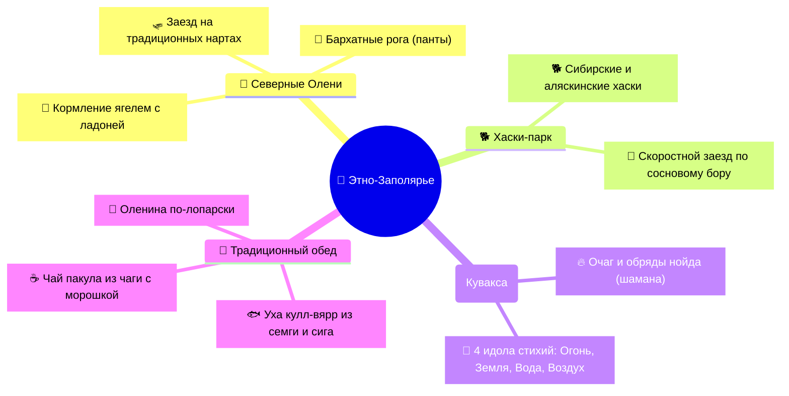

# 🦌 Саамы, Северные олени и Этно-Заполярье

> **Культурный код:** Саамы (лопари) — коренной малочисленный финно-угорский народ, населяющий Кольский полуостров свыше девяти тысяч лет.
> **Роль в 4-дневном туре:** День 04 — погружение в традиционный быт оленеводов, кормление северных оленей ягелем прямо с рук, катание на упряжках хаски и саамских нартах, знакомство с шаманизмом у костра и традиционная саамская кухня.

  Шкала рейтинга впечатлений:
  9.5–10Must-visit
  8.5–9.4Очень стоит
  7.5–8.4Интересно

---

## 🧭 Карта этнографического опыта

---

## ⭐ Ключевые активности этно-программы

### 1. 9.8Must-visit Кормление Северных оленей с рук
* **Впечатление:** Вы заходите в открытый просторный загон, где свободно пасется оленье стадо. Олени невероятно контактные, осторожно и нежно берут сухой белый мох ягель прямо с раскрытой ладони.
* **Тактильный восторг:** Их рога покрыты нежным бархатистым пухом (панты) и остаются теплыми на ощупь даже в лютый мороз благодаря развитой сети кровеносных сосудов.

---

### 2. 9.4Must-visit Катание на оленьих и собачьих упряжках
* **Саамские нарты:** Длинные деревянные сани с приподнятым носом, управляемые каюром с помощью длинного шеста (хорея).
* **Хаски-драйв:** Заезд в упряжке из 6–8 сибирских хаски, мчащихся по заснеженной лесной трассе среди пушистых сосен.

---

### 3. 9.2Очень стоит Чум, Священные Идолы (Сейды) и Саамская Уха
* **Обряд у костра в куваксе:** Посиделки на оленьих шкурах вокруг живого очага, шаманские мифы о первопредке Мяндаше и загадывание заветных желаний у деревянных идолов стихий.
* **Традиционный обед:**
  * **Кулл-вярр:** Густая горячая уха из дикой семги и сига.
  * **Оленина по-лопарски:** Нежное томленое мясо с картофелем и брусничным взваром.
  * **Чай Пакула:** Целебный настой на березовой чаге с лесными ягодами и открытыми пирогами с морошкой.

---

## 📍 Где находится и как бронировать

* **Этно-парк «Самь-Сыйт»:** Ловозерский район (110 км к юго-востоку от Мурманска).
* **Официальный сайт:** **[sam-syit.ru](https://sam-syit.ru/)**.
* **Стоимость комплексного тура с трансфером и обедом:** `~6 500 – 7 500 ₽`.
