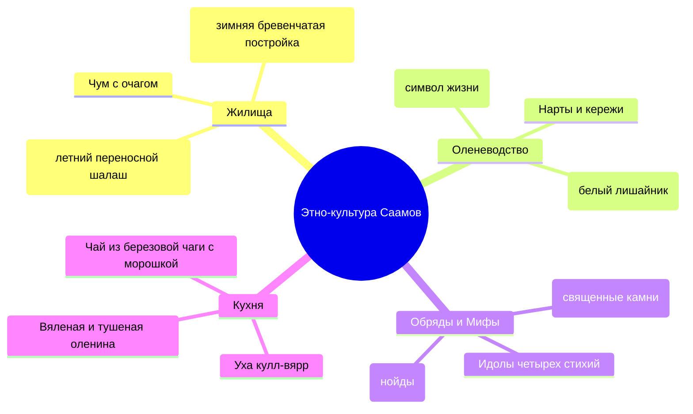

# 🦌 Саамы, Северные олени и Этно-Заполярье

> **Регион:** Ловозерский и Кольский районы Мурманской области — историческая родина коренного малочисленного финно-угорского народа саамов (лопарей).
> **Роль в 4-дневном туре:** День 04 — финальный этнокультурный день: знакомство с традициями и бытом коренных жителей Кольского Севера, кормление северных оленей ягелем с рук, катание на собачьих упряжках сибирских хаски, чайные обряды в чуме и традиционная саамская кухня.

---

## ⛺ Культура и традиции Саамов (Лопарей)

Саамы — древнейший коренной народ Северной Европы, населяющий Лапландию на территории четырех государств (России, Норвегии, Швеции и Финляндии). На Кольском полуострове саамы веками вели полукочевой образ жизни, занимаясь оленеводством, охотой и рыбной ловлей.

---

## 🛷 Этно-парки и Активности

### 1. 🦌 Саамская деревня «Самь-Сыйт» / Этно-парк «Лесная Елань»
* **Северные олени:** Общение в открытом загоне с полудикими и ручными северными оленями. Олени невероятно дружелюбны и с удовольствием едят ягель (сухой белый мох) прямо с раскрытых ладоней.
* **Катание на оленьих упряжках:** Традиционные деревянные сани-нарты, управляемые погонщиком с помощью длинного шеста (хорея).
* **Саамский чум и огонь:** Посиделки у открытого очага, рассказы хранителей традиций о духах тундры, легендах и шаманских обрядах.
* **Саамские национальные игры:** Метание аркана (нянька) на оленьи рога, стрельба из лука, саамский футбол (мяч из оленьей шкуры).

---

### 2. 🐕 Сибирские Хаски и Ездовой спорт
* **Питомник северных ездовых собак:** Дружелюбные сибирские и аляскинские хаски, самоедские лайки.
* **Заезд на собачьей упряжке:** 1.5–3 км по заснеженному хвойному лесу с инструктором-каюром. Невероятный заряд адреналина и скорости.

---

## 🍲 Традиционная кухня оленеводов

1. **Кулл-вярр (Kull-vyarr):** Наваристая саамская уха из свежей северной рыбы (семга, сиг, палия) с добавлением сливок и специй.
2. **Оленина по-лопарски:** Нежнейшее мясо, тушенное с брусничным соусом и лесными грибами.
3. **Пакула:** Традиционный горячий травяной чай, заваренный на береговой чаге, шиповнике и листьях брусники, который подается с открытыми пирогами с морошкой (ягодные сочни).
