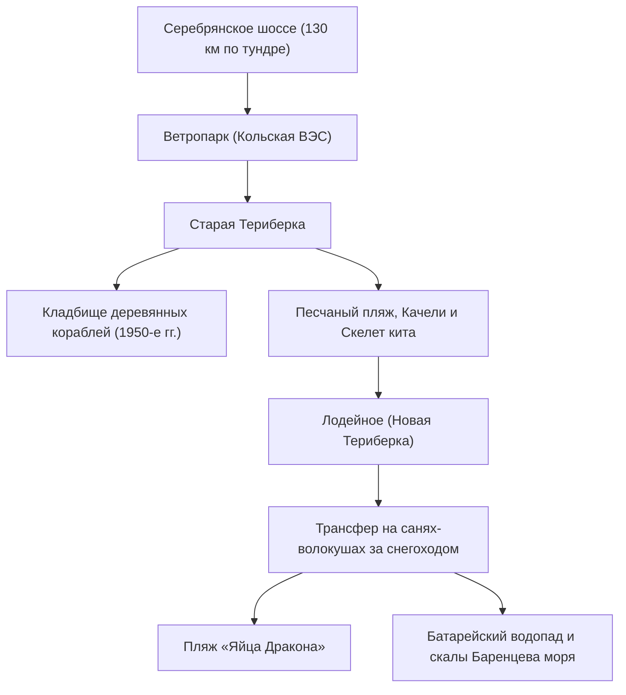

# 🌊 Териберка, Баренцево море и Край Земли

> **Регион:** Село Териберка (Кольский район Мурманской области) — единственный поселок на европейском севере России, куда можно доехать на автомобиле прямо к открытому побережью Баренцева моря и Северного Ледовитого океана.
> **Роль в 4-дневном туре:** День 03 — кульминационная арктическая экспедиция: бескрайняя заснеженная тундра, Кладбище деревянных кораблей, Песчаный пляж с качелями, Природный парк «Териберка», ледяной Батарейский водопад, каменный пляж «Яйца Дракона» и дегустация свежих морепродуктов.

  Шкала рейтинга впечатлений:
  9.5–10Must-visit
  8.5–9.4Очень стоит
  7.5–8.4Интересно

---

## ⭐ Главные природные и исторические объекты Териберки

### 1. 9.2Must-visit Кладбище деревянных кораблей
* **Контекст:** Остовы малых рыболовных траулеров и баркасов середины XX века, оставленные в Териберской губе после укрупнения рыбокомбинатов и перевода флота в Мурманск.
* **Атмосфера:** Деревянные шпангоуты и кили торчат из песка и морского ила, напоминая ребра доисторических гигантских ящеров. Во время отлива к остовам можно подойти вплотную.

---

### 2. 9.1Must-visit Песчаный пляж, Гигантские качели и Выброшенное судно
* **Контекст:** Широкая песчаная дуга на берегу губы, контрастирующая с суровыми северными скалами и сугробами.
* **Арт-объекты:**
  * **Гигантские качели:** Высокая деревянная конструкция прямо у кромки прибоя — полет над ледяной гладью океана.
  * **Корабль, выброшенный штормом:** Металлический рыболовный сейнер, севший на мель в 2020 году.
  * **Скелет кита:** Точная реплика скелета синего кита, изготовленная для культового фильма Андрея Звягинцева «Левиафан» (2014 г.).

---

### 3. 9.7Must-visit Пляж «Яйца Дракона» (Каменный пляж)
* **Геология:** Побережье, усыпанное гигантскими округлыми валунами из кварцита и гранита (размером от арбуза до полуметрового валуна), идеально отшлифованными вековыми океанскими штормами.
* **Звуковой феномен:** При откате волн валуны с глухим низким гулом перекатываются по дну, создавая неповторимый звук «дыхания океана».
* **Безопасность:** Камни обледенелые и скользкие. Запрещено подходить вплотную к кромке прибоя (риск внезапной волны).

---

### 4. 9.6Must-visit Замерзший Батарейский водопад и Ущелье
* **Контекст:** Бурный исток Малого Батарейского озера, прорезающий скалы из красного гранита и срывающийся в узкий морской каньон.
* **Зимний облик:** Зимой водопад превращается в фантастический ледопад бирюзово-голубого цвета с парящей внутри проточной водой.
* **Мыс Батарейский:** Смотровая площадка на скалах, где в годы Великой Отечественной войны стояла береговая артиллерийская батарея 199-го отдельного артдивизиона. Отсюда открывается вид на бескрайние свинцовые воды Баренцева моря вплоть до Северного полюса.

---

## 🦔 Арктический промысел: Морские ежи и Гребешки

Териберка — центр прибрежного дайвинг-промысла на Баренцевом море.
* **Зеленый морской еж (Strongylocentrotus droebachiensis):** Добывается водолазами на глубинах 5–25 м (`~250–350 ₽ / шт`). Подается живым с перепелиным желтком и каплей соевого соуса. Икра ежа содержит рекордную концентрацию полиненасыщенных жирных кислот, йода и витамина D.
* **Морской гребешок:** Свежайшее мясо с нежной сладковатой текстурой (`~350–500 ₽ / шт`). Употребляется в сыром виде (сашими) или слегка запеченным на створке раковины на гриле с травами.

---

## Фотогалерея локаций

> [!INFO]- Картинки
> ![[20251225153453.png]]
> ![[20251225153456.png]]
> ![[20251225153501.png]]
> ![[20251225153506.png]]
> ![[20251225153541.png]]
> ![[20251225153545.png]]
> ![[20251225153549.png]]
> ![[20251225153619.png]]
> ![[20251225153622.png]]
> ![[20251225153843.png]]
> ![[20251225153919.png]]
> ![[20251225153923.png]]
> ![[20251225153931.png]]
