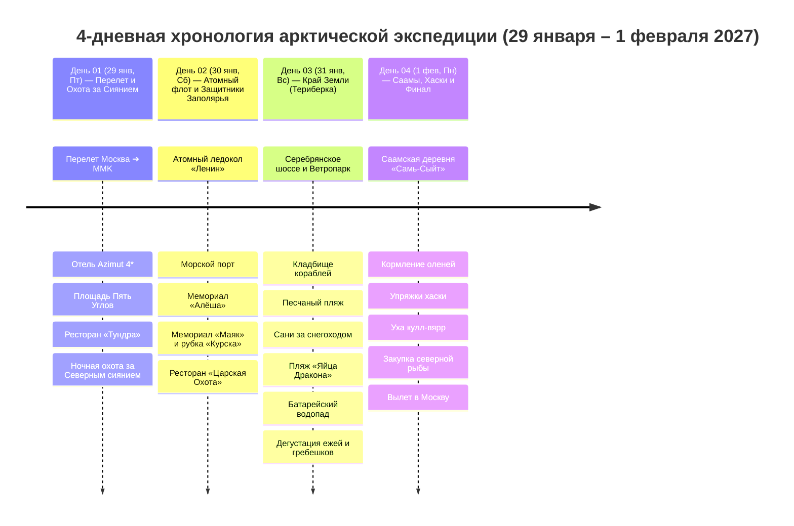

# 🗺️ Сводный Маршрутный план: Мурманск и Русская Арктика (4 Дня / 29 января – 1 февраля 2027)

> **Концепция экспедиции:** Идеально выверенная 4-дневная полярная экспедиция за 68-ю параллель (29 января – 1 февраля 2027: Пятница ➔ Понедельник) с комфортным городским базированием в Мурманске и контрастными радиальными выездами:
> 1. 🏙️ **День 01 (Пт, 29 янв) — Столица Заполярья и Ночная Аврора:** Перелет Москва ➔ Мурманск, панорама заснеженной тундры с борта самолета, заселение в видовой отель на площади Пять Углов, прогулка по освещенному огнями проспекту Ленина, гастрономический старт в «Тундре» и ночная выездная охота за Авророй (Северным сиянием) на 4WD джипах в тундре.
> 2. ⚓ **День 02 (Сб, 30 янв) — Морская мощь и Стальное сердце Арктики:** Первый в мире атомный ледокол «Ленин» (кают-компания из карельской березы, ходовой мостик, реакторный зал), незамерзающий Мурманский морской торговый порт со «стальными жирафами», 35-метровый монумент «Алёша» на вершине сопки Зеленый Мыс с круговой панорамой Кольского залива, мемориальный комплекс «Маяк», рубка АПЛ «Курск» и ужин в ресторане «Царская Охота».
> 3. 🌊 **День 03 (Вс, 31 янв) — Экспедиция на Край Земли (Териберка):** Джип-сафари сквозь тундру и Ветропарк по Серебрянскому шоссе к Северному Ледовитому океану (Баренцево море): мистическое Кладбище деревянных кораблей, Песчаный пляж с гигантскими качелями и скелетом кита, сани-волокуши за снегоходом в Природный парк, каменный пляж «Яйца Дракона», ледяной Батарейский водопад и дегустация живых морских ежей и гребешков в ресторане «Grebeshki».
> 4. 🦌 **День 04 (Пн, 1 фев) — Этно-Заполярье, Олени и Вылет:** Погружение в культуру коренного народа саамов в этно-парке «Самь-Сыйт», кормление северных оленей ягелем прямо с рук, катание на оленьих и собачьих упряжках хаски, согревающая саамская уха *кулл-вярр*, закупка северных деликатесов (вяленый ерш, палтус, печень трески, морошка) и вечерний вылет домой.

---

## 🗓️ Сводная таблица всех 4 дней

| День | Дата | День нед. | Регион / Базирование | Программа дня | Фаза тура / Акцент |
| :---: | :---: | :---: | :--- | :--- | :---: |
| **[[01 Мурманск (ср) 🌌 За Полярный круг к сиянию\|01]]** | **29 янв** | Пт | 🏙️ Мурманск *(Azimut 4\*)* | Перелет Москва (SVO/DME) ➔ Мурманск (MMK), заселение в Azimut 4*, площадь Пять Углов, проспект Ленина, ужин в «Тундре», ночная охота за Северным сиянием на 4WD | 🛬 Прилет и Аврора |
| **[[02 Мурманск (чт) ⚓ Атомная мощь и стражи Арктики\|02]]** | **30 янв** | Сб | ⚓ Мурманск *(Azimut 4\*)* | Экскурсия на Атомный ледокол «Ленин», Морской вокзал, сопка Зеленый Мыс («Алёша»), мемориал «Маяк» и рубка «Курска», ужин в ресторане «Царская Охота» | 🚢 Атомный флот и Память |
| **[[03 Териберка (пт) 🌊 На самом Краю Земли\|03]]** | **31 янв** | Вс | 🌊 Териберка *(Azimut 4\*)* | 4WD сафари по тундре через Ветропарк, Кладбище кораблей, Песчаный пляж, качели, сани за снегоходом к «Яйцам Дракона» и водопаду, ресторан «Grebeshki» | 🌊 Край Земли и Океан |
| **[[04 Саамская деревня (сб) 🦌 Дух тундры и дорога домой\|04]]** | **1 фев** | Пн | 🦌 Саамы ➔ Вылет | Этно-парк «Самь-Сыйт», кормление северных оленей, упряжки хаски, чум, уха кулл-вярр, рыбный рынок, вечерний вылет в Москву | 🦌 Этнос и Финал |
