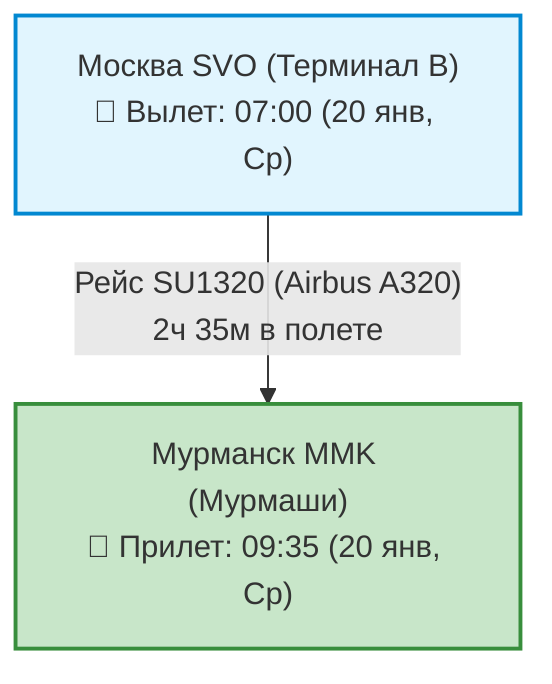
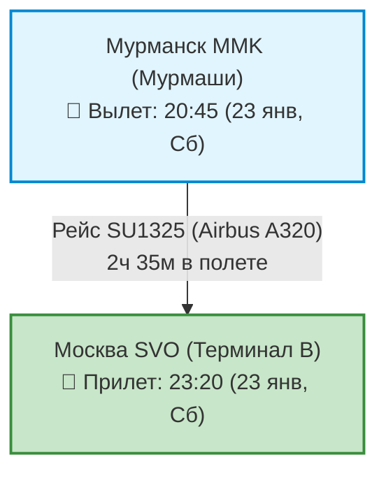

# ✈️ Бронирования: Авиаперелеты (4 дня / 3 ночи)

> [!SUCCESS]+ 🥇 Выбранный рейс: **Аэрофлот (Москва ⇌ Мурманск, прямой рейс)**
> * **Даты полета:** **20–23 января (Среда ➔ Суббота, 4 дня / 3 ночи)**.
> * **Стоимость:** **`13 500 ₽`** туда и обратно с багажом (23 кг регистрируемый багаж + 10 кг ручная кладь).
> * **Прямая ссылка на бронирование:** [🔗 Оформить билет на Авиасейлс / Оф. сайте Аэрофлота в рублях](https://www.aviasales.ru/)
> * **Преимущества тарифа:** Оплата картами любых банков РФ (МИР, СБП, Visa/MC), включенный багаж 23 кг для зимней арктической экипировки, горячие напитки и снеки на борту, утреннее прибытие в Мурманск (09:35) и вечерний обратный вылет (20:45) — максимум полезного времени для экспедиции.

---

## 🛫 1. Перелет ТУДА: Москва (SVO) ➔ Мурманск (MMK)

* **Дата отправления:** **20 января (День 01, Среда)**
* **Общая продолжительность:** **2 часа 35 минут** (прямой беспосадочный рейс)

| Сегмент маршрута | Рейс / Борт | Время отправления | Время прибытия | Время в пути | Питание / Удобства |
| :--- | :---: | :---: | :---: | :---: | :---: |
| **Москва (SVO-B) ➔ Мурманск (MMK)** | **SU1320** `Airbus A320` | **07:00** *(20 янв, Ср)* | **09:35** *(20 янв, Ср)* | **2 ч 35 мин** | ⚡ USB-розетки 🥪 Завтрак / чай / кофе 📺 Мультимедиа стриминг |

> [!TIP]
> **Прибытие в Мурманск в 09:35 и панорама тундры:** Идеальный тайминг! Дорога на такси Яндекс Go до отеля Azimut в центре города занимает всего 35 минут (`~1 000–1 300 ₽`). Вы прибудете в отель к 10:30, оставите вещи в камере хранения, выпьете бодрящий кедровый кофе и уже в 11:30 выйдете на полноценный дневной маршрут по площади Пять Углов.
> * **Секрет панорамных мест:** При онлайн-регистрации за 24 часа до вылета выбирайте **место у иллюминатора (ряд A или F)**. При снижении за 25 минут до посадки открывается потрясающая панорама заснеженной тундры, изрезанных русел рек, сопок и освещенных полярных поселков.

---

## 🛫 2. Перелет ОБРАТНО: Мурманск (MMK) ➔ Москва (SVO)

* **Дата отправления:** **23 января (День 04, Суббота)**
* **Общая продолжительность:** **2 часа 35 минут** (прямой беспосадочный рейс)

| Сегмент маршрута | Рейс / Борт | Время отправления | Время прибытия | Время в пути | Питание / Удобства |
| :--- | :---: | :---: | :---: | :---: | :---: |
| **Мурманск (MMK) ➔ Москва (SVO-B)** | **SU1325** `Airbus A320` | **20:45** *(23 янв, Сб)* | **23:20** *(23 янв, Сб)* | **2 ч 35 мин** | ⚡ USB-розетки 🥪 Закуски / напитки 📺 Мультимедиа стриминг |

> [!IMPORTANT]
> **Особенности обратного вылета и перевозки деликатесов:**
> 1. **Бесшовная логистическая стыковка:** После экскурсии в Саамскую деревню («Самь-Сыйт») трансфер доставляет вас с багажом прямо в аэропорт MMK к 18:30–19:00, за 1.5–2 часа до вылета рейса.
> 2. **Свежая рыба и морские деликатесы:** Вяленый мурманский ерш и синекорый палтус холодного копчения перевозятся в багаже или ручной клади **только в герметичной заводской вакуумной упаковке** (чтобы специфический запах не распространялся по салону).
> 3. **Консервы и ягодное варенье:** Баночки с печенью трески по-мурмански и вареньем из морошки объемом более 100 мл перевозятся **строго в регистрируемом багаже** (в ручной клади они изымаются службой безопасности как жидкости). Оберните стеклянные и жестяные банки мягкими слоями одежды.
> 4. **Ночное сияние с эшелона:** При вечернем вылете в темное время суток пассажиры у иллюминаторов правого и левого бортов нередко наблюдают зеленое свечение Авроры прямо над облаками на высоте 10 000 метров.

---

## 💡 Практические советы по перелету и багажу

1. **Оплата билетов в рублях:** На официальном сайте Аэрофлота, S7 или через сервис Aviasales билеты оплачиваются **картами любых российских банков (МИР, Visa, Mastercard)**, по СБП и через сервисы рассрочки («Долями», «Сплит»).
2. **Багажные нормы (23 кг):** Рекомендуется приобретать тариф с включенным местом багажа **23 кг** + ручная кладь **10 кг**. Зимняя арктическая 3-слойная экипировка (тяжелый мембранный пуховик, термобелье, горнолыжные штаны, треккинговые ботинки), термосы, штативы и сувениры полностью заполняют стандартный чемодан.
3. **Литиевые аккумуляторы и Powerbank (Ручная кладь):** Все внешние аккумуляторы (Powerbank), запасные батареи для фотоаппаратов, дронов и налобных фонарей перевозятся **строго в ручной клади** — в багажном отсеке провоз литиевых батарей категорически запрещен правилами авиационной безопасности. На заполярном морозе аккумуляторы быстро садятся, держите их во внутренних карманах одежды ближе к телу.
4. **Ледоходы и треккинговые палки (Сдаваемый багаж):** Съемные шипы-ледоходы («кошки») для обуви и треккинговые палки с металлическими наконечниками сдаются **строго в регистрируемый багаж** (в ручную кладь через предполетный досмотр их не пропустят).
5. **Трансфер из аэропорта Мурманск (MMK):** Аэропорт расположен в поселке Мурмаши (30 км от Мурманска). Самый быстрый и комфортный способ добраться до города — **Яндекс Go** (тариф «Комфорт» `~1 000 – 1 300 ₽`, подача 3–5 минут, время в пути 35 минут прямо к крыльцу отеля Azimut).
