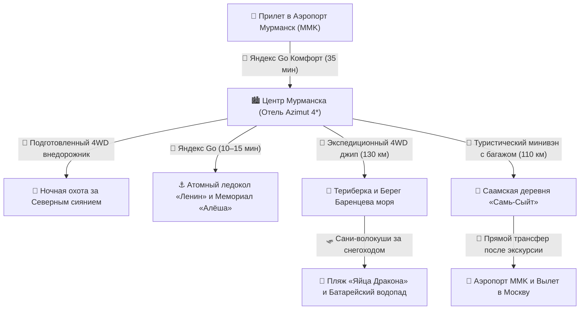

# 🚙 Бронирования: Транспорт, Джипы и Экскурсии (4 дня)

> **Транспортная архитектура:** Комфортное радиальное путешествие без необходимости аренды автомобиля и рискованного самостоятельного вождения по заснеженным заполярным перевалам: теплое городское такси Яндекс Go для быстрого перемещения между объектами Мурманска (3–5 мин подача), ночная 5-часовая охота за Авророй на подготовленном 4WD-внедорожнике с гидом-астрономом и фотографом, организованный экспедиционный джип-тур в Териберку (130 км x 2) по Серебрянскому шоссе через Кольскую ВЭС с доставкой на снегоходных санях к Батарейскому водопаду и пляжу «Яйца Дракона», а также этно-тур в Саамскую деревню «Самь-Сыйт» (110 км) с бесшовным трансфером прямо в международный аэропорт Мурманск (MMK) к вечернему вылету.

---

## 📍 Сквозная схема логистики и перемещений

---

## 📋 График междугороднего транспорта и экскурсий

|  День  | Сегмент                                             |             Транспорт             |  Время в пути  | Способ бронирования / Оплата                           |
| :----: | :-------------------------------------------------- | :-------------------------------: | :------------: | :----------------------------------------------------- |
| **01** | Аэропорт MMK ➔ Отель Azimut (Центр)                 |      🚖 Яндекс Go (Комфорт)       |     35 мин     | В приложении по прилету (`~1 200 ₽`)                   |
| **01** | Мурманск ➔ Тундра (Охота за Авророй) ➔ Отель        |   🚙 Внедорожник 4WD / Минивэн    |   4–6 часов    | Онлайн у гида-астронома (`~5 000 ₽`)                   |
| **02** | Отель ➔ Морвокзал (Атомный ледокол «Ленин»)         |           🚖 Яндекс Go            |     10 мин     | В приложении Яндекс Go (`~250 ₽`)                      |
| **02** | Экскурсионный сеанс на Атомном ледоколе «Ленин»     | 🚢 Музейная экскурсия Росатомфлот |     1 час      | Онлайн на rosatomflot.ru (`800 ₽`)                     |
| **02** | Морвокзал ➔ Сопка Зеленый Мыс (Мемориал «Алёша»)    |           🚖 Яндекс Go            |     15 мин     | В приложении Яндекс Go (`~350 ₽`)                      |
| **02** | Алёша ➔ Мемориал «Маяк» / рубка «Курска» ➔ Отель    |           🚖 Яндекс Go            |     15 мин     | В приложении Яндекс Go (`~300 ₽`)                      |
| **03** | Мурманск ➔ Кольская ВЭС ➔ Териберка                 |    🚙 Экспедиционный 4WD джип     |   2 ч 30 мин   | Онлайн за 1–2 недели (`~3 750 ₽` в составе тура)       |
| **03** | Электронный пропуск в ООПТ «Териберка»              |    📄 Эко-сбор природного парка   |     1 день     | Онлайн на oopt-murman.ru (`500 ₽`)                     |
| **03** | Лодейное ➔ Пляж «Яйца Дракона» ➔ Водопад            |  🛷 Сани-волокуши за снегоходом   |     2 часа     | На месте в Лодейном (`~1 800 ₽`)                       |
| **03** | Териберка (ресторан Grebeshki) ➔ Мурманск           |    🚙 Экспедиционный 4WD джип     |   2 ч 30 мин   | В составе дневного тура (`~3 750 ₽`)                   |
| **04** | Отель Azimut ➔ Саамская деревня «Самь-Сыйт»         | 🚐 Туристический минивэн с багажом|   1 ч 30 мин   | Онлайн на sam-syit.ru (`~3 500 ₽` в составе тура)      |
| **04** | Саамская деревня ➔ Аэропорт Мурманск (MMK)          |  🚐 Прямой трансфер в аэропорт    |   1 ч 15 мин   | В составе тура на sam-syit.ru (`~3 500 ₽`)             |

---

## 💡 Практические советы по транспорту и логистике

1. **Городское такси Яндекс Go:** В Мурманске отлично развит сервис Яндекс Такси (тарифы Эконом, Комфорт). Время подачи авто в центре города — 3–5 минут. Все автомобили хорошо отапливаются, оплата списывается с карты или СБП.
2. **Отказ от самостоятельной аренды авто зимой:** Зимние заполярные трассы (особенно Серебрянское шоссе в Териберку) коварны снежными переметами, гололедицей и штормовым ветром. Дорогу регулярно перекрывают для проводки колонн спецтехники. Поездка с местным профессиональным гидом-водителем на подготовленном 4WD джипе (Toyota Land Cruiser, Nissan Patrol) гарантирует безопасность и надежность.
3. **Охота за Северным сиянием (День 01):** Выезд бронируется заранее за 1–2 недели у проверенных мурманских гидов-астрономов («Север для Вас», «Arctic Aurora», «Murman Discovery»). Гиды отслеживают солнечную активность по спутникам (индекс Kp) и карты облачности (Ventusky, Windy), выезжая на 50–100 км от города туда, где есть «окно чистого неба». В стоимость тура включена профессиональная фотосессия со штатива.
4. **Онлайн-бронирование билетов на ледокол «Ленин»:** В 2026 году кассовая продажа на причале ограничена. Билеты приобретаются строго онлайн на официальном сайте **[rosatomflot.ru](https://www.rosatomflot.ru/atomnyy-ledokol-lenin)** по фиксированным сеансам со среды по воскресенье. Выкупайте билеты за 5–7 дней до визита!
5. **Снегоходные сани в Териберке:** В зимний сезон проезд колесного транспорта вглубь Природного парка (к Батарейскому водопаду и пляжу «Яйца Дракона») заблокирован снежными заносами. На въезде в поселок Лодейное работают снегоходчики с теплыми санями-волокушами (`~1 500 – 2 000 ₽` за человека туда-обратно с ожиданием).
6. **Электронный пропуск в ООПТ «Териберка»:** Природный парк «Териберка» является особо охраняемой природной территорией. Обязательно оформите и оплатите разрешение за 1–2 дня до поездки на региональном портале **[oopt-murman.ru](https://oopt-murman.ru)** (500 ₽ для граждан РФ). Сохраните PDF с QR-кодом в память телефона (на побережье Баренцева моря мобильная связь часто отсутствует).
