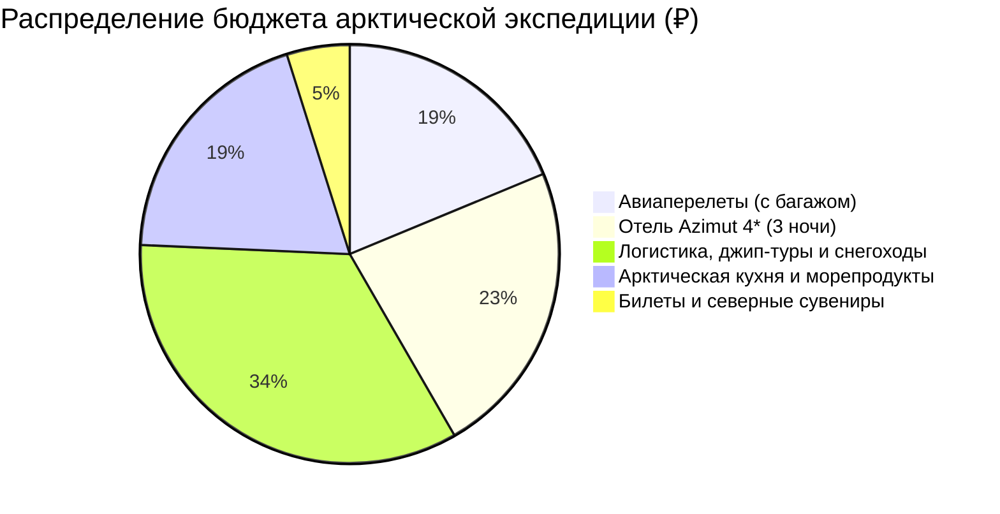

# 💰 Финансы и Полная смета тура: Мурманск и Арктика (4 дня)

> [!summary]+ 💰 Общий бюджет экспедиции «под ключ»: **~64 000 – 72 000 ₽** (на 1 человека)
> - ✈️ **Авиаперелеты (Москва ↔ Мурманск с багажом 23 кг):** `~13 500 ₽`
> - 🏨 **Проживание (3 ночи в Azimut Hotel Murmansk 4*):** `~16 500 ₽`
> - 🚙 **Весь транспорт, джип в Териберку, снегоходы, трансферы и такси:** `~24 500 ₽`
> - 🦀 **Питание, арктическая кухня, крабы, ежи, гребешки:** `~14 000 ₽`
> - 🎟️ **Билеты (Ледокол, ООПТ Териберка) и сувениры:** `~3 500 ₽`

---

## 📋 Детализированная структура расходов на 2026 год

### 1. ✈️ Авиаперелет (`~13 500 ₽`)
* Регулярный прямой рейс Москва (SVO / DME / VKO) ➔ Мурманск (MMK) ➔ Москва (Аэрофлот / S7 / Smartavia с багажом 23 кг для теплой экипировки).

### 2. 🏨 Проживание (3 ночи — `~16 500 ₽`)
* **Azimut Hotel Murmansk 4\*** на площади Пять Углов: 3 ночи × `~5 500 ₽` = `16 500 ₽`.

### 3. 🚙 Транспорт и экскурсионные программы (`~24 500 ₽`)
* Яндекс Go из аэропорта MMK в отель и обратно: `~1 100 ₽`.
* Ночная выездная охота за Северным сиянием с гидом-фотографом: `~5 000 ₽`.
* Поездки на такси по Мурманску (Ледокол, Алёша, Маяк, рестораны): `~900 ₽`.
* Сборная однодневная экспедиция в Териберку на внедорожнике 4WD: `~7 500 ₽`.
* Сани-волокуши за снегоходом в Природный парк (Лодейное): `~1 800 ₽`.
* Комплексный тур в Саамскую деревню с катанием на оленях/хаски и трансфером в аэропорт: `~7 000 ₽`.
* Пропуск в ООПТ «Териберка»: `500 ₽`.
* Билет на Атомный ледокол «Ленин»: `800 ₽`.

### 4. 🍽️ Питание и Арктическая гастрономия (`~14 000 ₽`)
* Завтраки в отеле «шведский стол» (включены в стоимость номера).
* Ужин в ресторане «Тундра. Grill & Bar»: `~3 000 ₽`.
* Ужин в ресторане «Царская Охота» / «Седьмой Океан»: `~3 200 ₽`.
* Обед с живыми морскими ежами и гребешками в Териберке («Grebeshki»): `~4 000 ₽`.
* Традиционный обед в саамском чуме (включен в тур).
* Кофе, настойки на морошке, перекусы: `~2 000 ₽`.

### 5. 🎁 Сувениры и дары Севера (`~2 500 ₽`)
* Вяленый мурманский ерш, копченый палтус в вакууме, печень трески, варенье из морошки: `~2 500 ₽`.
