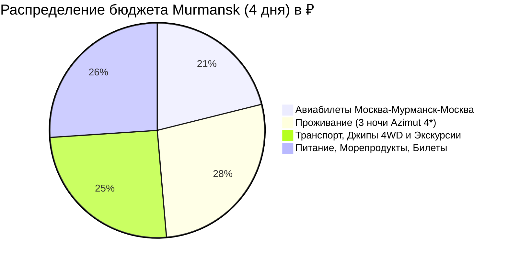

# 💰 Полный Бюджет: Murmansk (4 дня / 3 ночи)

> [!summary]+ 💰 Общий бюджет поездки: **~48 500 ₽** (на 1 человека под ключ)
> - ✈️ **Авиаперелет (Москва ➔ Мурманск ➔ Москва):** `~11 500 ₽`
> - 🏨 **Проживание (3 ночи в комфортном отеле Azimut 4* на пл. Пять Углов):** `~15 000 ₽`
> - 🚙 **Внутренний транспорт, Джип 4WD в Териберку, Охота за Авророй, Снегоходы, Такси:** `~13 800 ₽`
> - 🦀 **Арктическое питание, крабы, морские ежи, гребешки, оленина, билеты в музеи:** `~14 200 ₽`

---

## 📋 Детализация расходов по категориям

### 1. ✈️ Транспорт и Логистика (~25 300 ₽)

| Статья расходов | Сумма (RUB) | Описание |
| :--- | :---: | :--- |
| Авиабилеты Москва ➔ Мурманск ➔ Москва | `11 500 ₽` | Прямой рейс Аэрофлот / S7 / Smartavia с багажом 23 кг |
| Выездная охота за Северным сиянием (5 часов) | `4 500 ₽` | 4WD внедорожник/минивэн, гид-астроном, горячий чай, фотосессия |
| Экспедиционный тур в Териберку на джипе (весь день) | `6 500 ₽` | Место в полноприводном внедорожнике (туда-обратно 260 км) |
| Снегоходные сани-волокуши в Природный парк Териберка | `1 800 ₽` | Трансфер до водопада и пляжа «Яйца Дракона» (туда-обратно) |
| Трансфер в Саамскую деревню и аэропорт (доля) | `1 500 ₽` | Междугородний трансфер в Ловозерский район и аэропорт MMK |
| Городское такси Яндекс Go (Мурманск, 4 дня) | `1 000 ₽` | Поездки к ледоколу «Ленин», мемориалу «Алёша», «Маяку» |
| **Итого транспорт (с авиаперелетом):** | **`~26 800 ₽`** | *(без авиа — `~15 300 ₽`)* |

---

### 2. 🏨 Проживание (3 ночи — ~15 000 ₽)

* **Отель:** *Azimut Hotel Murmansk 4\** (центр, площадь Пять Углов) — `~5 000 ₽ / ночь`.
* **Альтернатива:** *Renaissance Boutique Hotel 4\** — `~5 200 ₽ / ночь` или *Park Inn Полярные Зори* — `~4 700 ₽ / ночь`.
* **Итого за 3 ночи на 1 чел:** **`~15 000 ₽`** *(при двухместном размещении `~7 500 – 8 500 ₽ / чел`)*.

---

### 3. 🦀 Питание, Морепродукты, Дегустации и Билеты (~14 200 ₽)

| Статья расходов | Сумма (RUB) | Описание |
| :--- | :---: | :--- |
| Ужин в ресторане «Тундра. Grill & Bar» (День 01) | `2 200 ₽` | Оленина, настойки на морошке, закуски |
| Обед и ужин в Мурманске («Седьмой Океан» / «Царская Охота», День 02) | `3 300 ₽` | Палтус, карпаччо из оленя, авторские десерты |
| Обед с морепродуктами в Териберке («Grebeshki», День 03) | `3 000 ₽` | Живые морские ежи, свежие гребешки, крабовый суп |
| Пакетная программа в Саамской деревне с ухой и чаем (День 04) | `4 500 ₽` | Экскурсия, кормление оленей, упряжки хаски, обед в чуме |
| Билет на Атомный ледокол «Ленин» (День 02) | `700 ₽` | Входной билет с экскурсионным обслуживанием |
| Электронный пропуск в ООПТ «Природный парк Териберка» (День 03) | `380 ₽` | Разрешение Минприроды Мурманской области |
| Кофе, десерты и перекусы на ходу (4 дня) | `1 200 ₽` | Спешелти-кофе в «Юности», горячие напитки в термосы |
| **Итого по статье:** | **`~16 280 ₽`** | |

---

## 🎁 Сувенирный бюджет (Опционально: ~3 500 – 6 000 ₽)

* **Мурманский вяленый ерш и копченый палтус (в вакууме):** `~2 000 – 3 000 ₽`.
* **Баночка варенья из заполярной морошки (250 г):** `~600 – 900 ₽`.
* **Печень трески по-мурмански (2–3 банки):** `~700 – 1 000 ₽`.
* **Чипсы из ягеля в сиропе:** `~400 ₽`.
