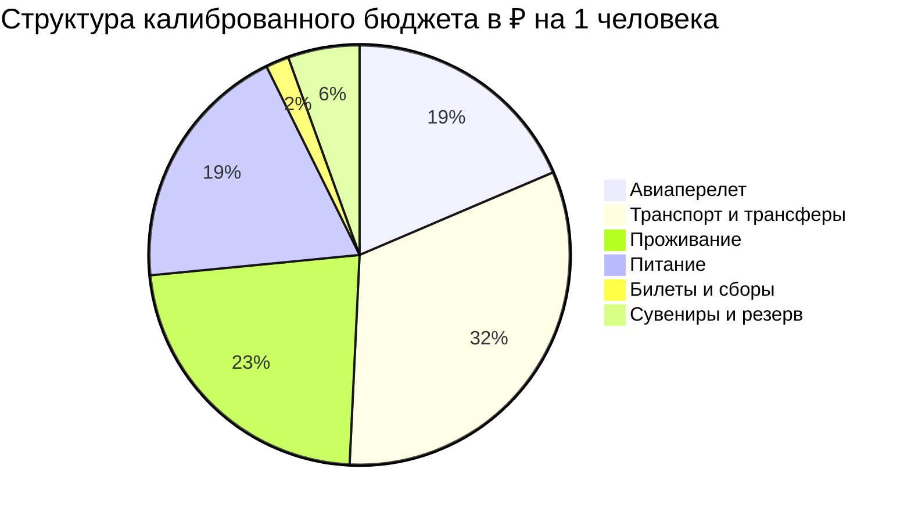

# 💰 Финансы: Мурманск и Русская Арктика (4 дня / 3 ночи)

> [!summary]+ 💰 Общий калиброванный бюджет: **72 700 ₽** на 1 человека
> - ✈️ Авиаперелет: `13 500 ₽`.
> - 🚄 Транспорт и трансферы: `23 400 ₽`.
> - 🏨 Проживание: `16 500 ₽`.
> - 🍜 Питание: `14 000 ₽`.
> - 🎟️ Билеты и сборы: `1 300 ₽`.
> - 🎁 Сувениры и резерв: `4 000 ₽`.

### ✈️ 1. Международный авиаперелет

| Статья расхода | Стоимость в ₽ | Примечание |
| :--- | ---: | :--- |
| Москва ↔ Мурманск, прямой тариф с багажом | 13 500 ₽ | Туда и обратно |

### 🚄 2. Поезда, междугородний транспорт и трансферы

| Статья расхода | Стоимость в ₽ | Примечание |
| :--- | ---: | :--- |
| Такси аэропорт и городские поездки | 2 100 ₽ | MMK и Мурманск |
| Охота за Северным сиянием | 5 000 ₽ | 4WD с гидом |
| Экспедиция в Териберку | 7 500 ₽ | Групповой 4WD-тур |
| Сани за снегоходом в природный парк | 1 800 ₽ | Териберка |
| Тур в саамскую деревню с трансферами | 7 000 ₽ | Программа и дорога в MMK |

### 🏨 3. Проживание (Отели и апартаменты)

| Статья расхода | Стоимость в ₽ | Примечание |
| :--- | ---: | :--- |
| Azimut Hotel Murmansk, 3 ночи | 16 500 ₽ | 5 500 ₽ за ночь; сумма совпадает с `Отели.md` |

### 🍜 4. Питание, кофе и гастрономия

| Статья расхода | Стоимость в ₽ | Примечание |
| :--- | ---: | :--- |
| Рестораны, кофе, перекусы и северные деликатесы | 14 000 ₽ | Включая ужины в Мурманске и обед в Териберке |

### 🎟️ 5. Входные билеты, канатки и активности

| Статья расхода | Стоимость в ₽ | Примечание |
| :--- | ---: | :--- |
| Экскурсия на ледокол «Ленин» | 800 ₽ | Билет в музей-ледокол |
| Сбор ООПТ «Териберка» | 500 ₽ | Если не включен в тур |

### 🎁 6. Сувениры, локальные специалитеты и резервный буфер

| Статья расхода | Стоимость в ₽ | Примечание |
| :--- | ---: | :--- |
| Рыба, морошка и подарки | 4 000 ₽ | Вяленый ерш, палтус, печень трески |

> [!TIP]
> Финансовый резерв уже включен в шесть категорий: выбирайте только одну версию расходов дня в Териберке и не суммируйте альтернативные варианты из дневной таблицы.
