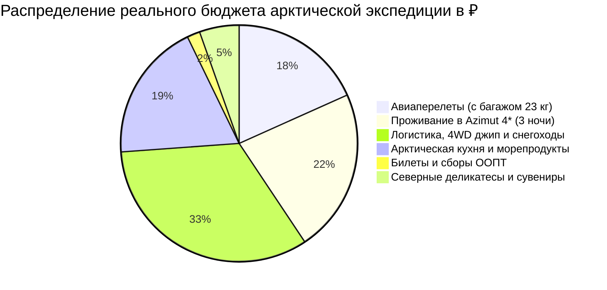

# 💰 Финансы и Полная смета тура: Мурманск и Арктика (4 дня)

> [!summary]+ 💰 Общий бюджет экспедиции «под ключ»: **~68 000 – 74 000 ₽** (на 1 человека под ключ)
> - ✈️ **Авиаперелеты (Москва ↔ Мурманск с багажом 23 кг):** `~13 500 ₽`
> - 🏨 **Проживание (3 ночи в Azimut Hotel Murmansk 4*):** `~16 500 ₽` *(~5 500 ₽ / ночь)*
> - 🚙 **Внутренний транспорт, 4WD джип в Териберку, снегоходы, трансферы и такси:** `~24 500 ₽`
> - 🦀 **Питание, арктическая кухня, крабы, живые ежи, гребешки, настойки:** `~14 000 ₽`
> - 🎟️ **Билеты и сборы (Атомный ледокол «Ленин», пропуск в ООПТ Териберка):** `~1 300 ₽`
> - 🎁 **Северные деликатесы и сувениры (ерш, палтус, печень трески, морошка):** `~4 000 ₽`

---

## 📋 Детализированная структура расходов на 2026 год

### 1. ✈️ Авиаперелет (`~13 500 ₽`)
* Регулярный прямой рейс Москва (SVO / DME / VKO) ➔ Мурманск (MMK) ➔ Москва (Аэрофлот / S7 Airlines / Smartavia).
* **Тариф:** С включенным зарегистрированным багажом **до 23 кг** (критично для объемной зимней 3-слойной экипировки, обуви, термосов и обратной перевозки рыбных деликатесов).
* **Справочник:** [[Personal Note/Travel/-- Murmansk/03 - Бронирования/Авиаперелеты|✈️ Бронирования: Авиаперелеты]].

---

### 2. 🏨 Проживание (3 ночи — `~16 500 ₽`)
* **Azimut Hotel Murmansk 4\*** (Рекомендуемый выбор): 3 ночи × `~5 500 ₽` = `16 500 ₽`.
  * *Плюсы:* Самое высокое здание за Полярным кругом, эпицентр на площади Пять Углов, сытные завтраки «шведский стол» включены, панорамные виды на огни ночного города.
* **Альтернатива:** *Renaissance Boutique Hotel* (`~5 200 ₽ / ночь` = `15 600 ₽`) или *Park Inn by Radisson Полярные Зори 4\** (`~4 700 ₽ / ночь` = `14 100 ₽`).
* **Справочник:** [[Personal Note/Travel/-- Murmansk/03 - Бронирования/Отели|🏨 Бронирования: Отели и Базы отдыха]].

---

### 3. 🚙 Транспорт, Экскурсии и Активности (`~24 500 ₽`)
* **Яндекс Go:** Трансфер из аэропорта MMK в отель Azimut и обратно (`~1 200 ₽`).
* **Охота за Северным сиянием (День 01):** Выездная 5-часовая ночная охота на 4WD внедорожнике с гидом-астрономом и профессиональной фотосессией (`~5 000 ₽`).
* **Такси по Мурманску (День 02):** Поездки к морвокзалу, сопке «Алёша», мемориалу «Маяк» и ресторанам (`~900 ₽`).
* **Экспедиция в Териберку (День 03):** Место в сборной группе на подготовленном 4WD джипе (Toyota Land Cruiser / Nissan Patrol) по тундре и Ветропарку туда-обратно (`~7 500 ₽`).
* **Сани-волокуши за снегоходом:** Доставка в Природный парк к пляжу «Яйца Дракона» и Батарейскому водопаду (`~1 800 ₽`).
* **Тур в Саамскую деревню («Самь-Сыйт», День 04):** Трансфер из Мурманска, интерактивная программа, кормление оленей, упряжки хаски, обед в чуме и финальный трансфер в аэропорт MMK (`~7 000 ₽`).
* **Билеты и сборы ООПТ:**
  * Экскурсионный билет на Атомный ледокол «Ленин»: `800 ₽` *(сайт rosatomflot.ru)*.
  * Электронный пропуск в ООПТ «Териберка»: `500 ₽` *(портал oopt-murman.ru)*.
* **Справочник:** [[Personal Note/Travel/-- Murmansk/03 - Бронирования/Транспорт|🚙 Бронирования: Транспорт, Джипы и Экскурсии]].

---

### 4. 🍽️ Питание и Арктическая гастрономия (`~14 000 ₽`)
* **Завтраки:** Включены в стоимость проживания в отеле (шведский стол с горячими блюдами).
* **День 01 (Мурманск):** Ужин-знакомство в ресторане «Тундра. Grill & Bar» (карпаччо из оленя, уха из семги, северные настойки, кофе) — `~2 800 ₽`.
* **День 02 (Мурманск):** Обед в кофейне «Юность» + праздничный ужин в ресторане «Царская Охота» (стейк из палтуса, тартар из оленины, чипсы из ягеля) — `~3 800 ₽`.
* **День 03 (Териберка):** Поздний панорамный обед в ресторане «Grebeshki» (сет из живых морских ежей с перепелиным яйцом, свежие гребешки на створках, крабовый биск, горячий чай) — `~4 200 ₽`.
* **День 04 (Саамы):** Традиционный обед в чуме (уха *кулл-вярр*, оленина, чай *пакула*) включен в тур; кофе и перекусы перед вылетом — `~1 200 ₽`.
* **Буфер на кофе и снеки:** Кедровый раф, глинтвейн в тундре, выпечка — `~2 000 ₽`.
* **Справочник:** [[Personal Note/Travel/-- Murmansk/01 - Заметки/Арктическая кухня и Рестораны Мурманска|🦀 Заметки: Арктическая кухня и Рестораны]].

---

### 5. 🎁 Сувениры, рыба и подарки (`~4 000 ₽`)
* **Вяленый мурманский ерш:** 1 кг в двойном вакуумном пакете — `~1 600 ₽`.
* **Синекорый палтус холодного копчения:** 0.5 кг в вакууме — `~1 000 ₽`.
* **Печень трески по-мурмански (изготовлено в море):** 2 банки — `~800 ₽`.
* **Варенье из дикой морошки / чипсы из ягеля / минерал эвдиалит:** `~600 ₽`.
* **Справочник:** [[Personal Note/Travel/-- Murmansk/06 - Чек лист/Что попробовать и купить (Must-Try & Must-Buy)|🎯 Что попробовать и купить (Must-Try & Must-Buy)]].

---

## 📊 Сравнительная таблица бюджетов по форматам

| Статья расходов | Базовый расчет (Минимум) | Комфорт-экспедиция (Основной) | Премиум (Териберка 5* и вертолет) |
| :--- | :---: | :---: | :---: |
| ✈️ Авиабилеты (туда-обратно) | 9 500 ₽ *(без багажа)* | **13 500 ₽** *(с багажом 23 кг)* | 28 000 ₽ *(бизнес-класс)* |
| 🏨 Проживание (3 ночи) | 10 500 ₽ *(хостел/апартаменты)* | **16 500 ₽** *(Azimut Hotel 4\*)* | 36 000 ₽ *(Cedar Grass купол у моря)* |
| 🚙 Логистика и экскурсии | 16 000 ₽ *(автобусы, групповые)* | **24 500 ₽** *(4WD джип, снегоходы)* | 65 000 ₽ *(индивидуальный гид 24/7)* |
| 🦀 Гастрономия и питание | 7 500 ₽ *(кафе, столовые)* | **14 000 ₽** *(топ-рестораны, ежи, краб)* | 25 000 ₽ *(ежедневные крабовые сеты)* |
| 🎟️ Билеты, сборы ООПТ | 1 300 ₽ | **1 300 ₽** | 3 500 ₽ *(VIP-экскурсии)* |
| 🎁 Сувениры и рыба | 1 500 ₽ | **4 000 ₽** | 10 000 ₽ *(целый ящик деликатесов)* |
| **ИТОГО** | **~46 300 ₽** | **`~73 800 ₽`** | **~167 500 ₽** |
