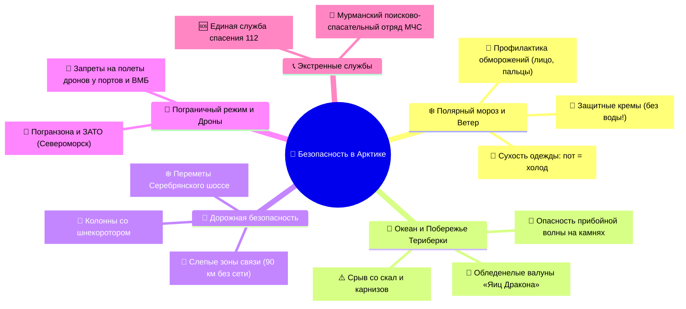
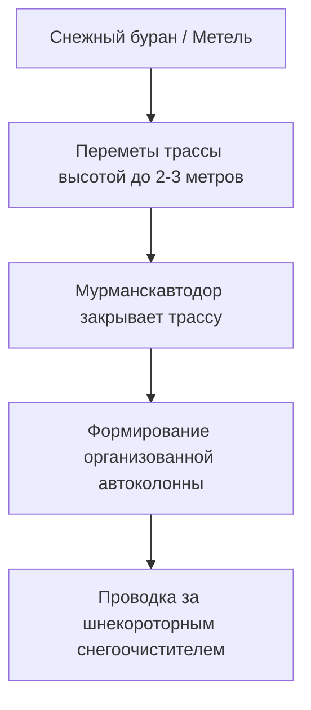

# 🚨 Безопасность, Полярный мороз, Шторма и Экстренная помощь

> [!CAUTION] Золотое правило арктической безопасности
> В Заполярье природа не прощает легкомыслия. Сочетание высокой влажности Баренцева моря, штормового ветра со скоростью до 25–30 м/с и температуры `-10°C...-25°C` создает эффективную температуру охлаждения (Wind Chill) до **`-35°C...-40°C`**. Подготовка, правильная экипировка и соблюдение правил безопасности сохранят здоровье и жизнь.

---

## 🧭 Карта рисков и протоколов безопасности

---

## ❄️ 1. Экстремальный мороз и Ветро-холодовой индекс (Wind Chill)

### 🌡️ Таблица реального ощущения температуры
Шкала ветро-холодового индекса показывает, как ощущается мороз на открытой коже в зависимости от скорости ветра:

| Температура воздуха | Ветер 5 м/с (Легкий бриз) | Ветер 10 м/с (Свежий ветер) | Ветер 15 м/с (Крепкий ветер) | Ветер 20 м/с (Шторм в Териберке) |
| :---: | :---: | :---: | :---: | :---: |
| **`-5°C`** | `-9°C` | `-13°C` | `-16°C` | **`-19°C`** |
| **`-10°C`** | `-15°C` | `-20°C` | `-24°C` | **`-27°C`** *(Риск обморожения за 30 мин)* |
| **`-15°C`** | `-21°C` | `-27°C` | `-31°C` | **`-35°C`** *(Риск обморожения за 15 мин)* |
| **`-20°C`** | `-27°C` | `-34°C` | `-39°C` | **`-43°C`** *(Критический риск за 5–10 мин)* |

### 🚨 Первые признаки и профилактика обморожения
1. **Симптомы 1-й степени:** Потеря чувствительности («деревянные» пальцы), покалывание, побеление или восковой оттенок кожи (кончик носа, мочки ушей, щеки, пальцы рук и ног).
2. **Что делать немедленно:**
   - Срочно зайти в теплое помещение или салон автомобиля.
   - Согревать замерзшие участки **теплом собственного тела** (руки — под мышки или на живот; лицо — теплыми ладонями).
   - Выпить горячий сладкий чай из термоса.
3. **Чего КАТЕГОРИЧЕСКИ НЕЛЬЗЯ делать:**
   - ❌ **Не растирать кожу снегом!** Кристаллы льда наносят микротравмы и заносят инфекцию в поврежденную кожу.
   - ❌ **Не опускать замерзшие руки/ноги в горячую воду и не прислонять к батарее!** Из-за потери чувствительности легко получить термический ожог и некроз тканей. Согревание должно быть плавным.
   - ❌ **Не употреблять алкоголь на морозе!** Алкоголь расширяет периферические сосуды, создавая обманчивое ощущение тепла, но ускоряет потерю внутреннего тепла организмом.

---

## 🌊 2. Безопасность на побережье Баренцева моря (Териберка)

> [!WARNING] Правило океанского прибоя
> **НИКОГДА НЕ ПОВОРАЧИВАЙТЕСЬ СПИНОЙ К БАРЕНЦЕВУ МОРЮ!**

1. **Коварство волн-убийц (Sneaker Waves):**
   - Баренцево море — открытая акватория Северного Ледовитого океана. Периодически на берег накатывает аномально высокая волна, которая поднимается на 2–3 метра выше средней полосы прибоя.
   - Океанская вода имеет температуру `+1...+3°C`. Падение в такую воду в зимней одежде приводит к холодовому шоку за 60 секунд и моментальному намоканию пуховика, утягивающего на глубину.
2. **Обледенелые валуны пляжа «Яйца Дракона»:**
   - Каменные валуны покрыты тончайшей незаметной ледяной глазурью от брызг прибоя.
   - Ходите только в обуви с надетыми шипами-ледоходами, не прыгайте с камня на камень, не подходите к мокрой границе камней.
3. **Скальные обрывы и снежные карнизы:**
   - У Батарейского водопада и на мысах скалы обрываются в море с высоты 20–40 метров.
   - Зимой ветер надувает над обрывом снежные «козырьки» (карнизы), которые выглядят как твердая почва, но мгновенно обламываются под весом человека. Держите дистанцию не менее 3–4 метров от края обрыва.

---

## 🚗 3. Зимнее Серебрянское шоссе и Снежные заносы

Дорога Мурманск ➔ Териберка (130 км) проходит через открытую тундру. Последние 40 км дороги не имеют лесозащитных полос.

### 📋 Протокол действий при перекрытии дороги
1. **Проверка статуса трассы:** Перед выездом гид и водитель проверяют диспетчерскую службу Мурманскавтодора: `+7 (8152) 21-40-70`.
2. **Движение в колонне:** Если трасса открыта только по расписанию, проезд осуществляется строго в составе организованной автоколонны за тяжелым шнекоротором. Обгон снегоочистителя и сход с накатанной колеи строго запрещены.
3. **Запас автономии:** В автомобиле всегда должен быть полный бак топлива, теплые пледы, термос с кипятком, запас перекуса и буксировочный трос.
4. **Слепая зона связи:** На 90-километровом участке Серебрянского шоссе между 35-м и 120-м км полностью отсутствует сотовая связь. В случае поломки оставайтесь внутри машины с работающим двигателем до прибытия спасателей или дорожной службы.

---

## 🪪 4. Пограничный режим, ЗАТО и Полеты квадрокоптеров

1. **Режим пограничной зоны:**
   - Териберка и Мурманск открыты для свободного посещения гражданами РФ (спецпропуск ФСБ не требуется).
   - Внимание: Закрытые административно-территориальные образования (**ЗАТО Североморск, Видяево, Александровск, Заозерск**) закрыты для въезда без официального пропуска Минобороны. Не сворачивайте на закрытые КПП.
2. **Правила использования дронов (БПЛА):**
   - На территории Мурманска (акватория порта, Атомфлот, военные причалы) полеты любых беспилотников строго запрещены.
   - В Териберке полеты возможны только при согласовании и соблюдении правил безопасности вне зон государственных объектов. В условиях штормового ветра (свыше 12 м/с) полет дрона неизбежно закончится его сносом в океан.

---

## 📱 5. Оперативные каналы мониторинга дорог и погоды (в телефон)

- **Статус дорог Мурманской области:** Официальный Telegram-канал и сайт диспетчерской службы **Мурманскавтодор** (`madroad.ru`, круглосуточный телефон горячей линии: `+7 (8152) 21-40-70`).
- **Мониторинг Авроры:** Мобильные приложения **«My Aurora Forecast»** и сайт **«SpaceWeatherLive»** (отслеживание вектора $B_z$, скорости и плотности солнечного ветра).
- **Облачность:** Мобильное приложение и сервис **«Windy»** (послойный спутниковый слой *Low Clouds* — низкая облачность).

---

## 📞 6. Экстренные контакты и Службы спасения

> [!IMPORTANT] Номера телефонов экстренных служб Мурманской области
> Рекомендуется сохранить эти номера в телефонную книгу до вылета:

* 🆘 **Единая служба спасения (МЧС, Скорая, Полиция):** `112` *(работает даже без SIM-карты и при нулевом балансе)*.
* 🚒 **Главное управление МЧС России по Мурманской области:** `+7 (8152) 39-99-99`.
* 🏔️ **Мурманский арктический комплексный аварийно-спасательный центр МЧС России:** `+7 (8152) 52-80-00`.
* 🚜 **Диспетчерская служба автодорог (Мурманскавтодор):** `+7 (8152) 21-40-70` *(круглосуточная информация о закрытии и открытии дороги на Териберку)*.
* 🏥 **Мурманская областная клиническая больница им. П.А. Баяндина:** `+7 (8152) 28-51-00` *(ул. Академика Павлова, 6)*.
* 🏥 **Травмпункт Мурманска (круглосуточно):** `+7 (8152) 45-48-84` *(ул. Шмидта, 41/9)*.
* ✈️ **Справочная Международного аэропорта Мурманск (MMK):** `+7 (8152) 281-331`, `+7 (8152) 281-431`.
* 🚢 **Музей «Атомный ледокол "Ленин"» (Росатомфлот):** `+7 (8152) 55-35-13`.
