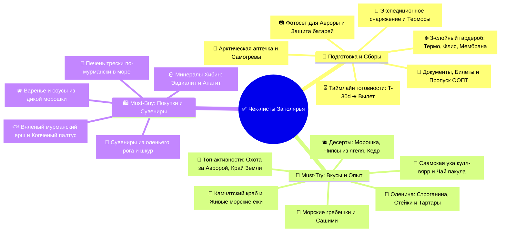

# ✅ 06 - Чек-листы: Подготовка, Сборы, Must-Try и Покупки

> [!TIP] Интерактивный навигатор экспедиции
> Полный комплект контрольных списков для безупречной подготовки к арктической экспедиции, сборов многослойной зимней экипировки, фототехники для охоты за Авророй, а также исчерпывающий каталог гастрономических экспериментов, уникальных северных активностей и аутентичного заполярного шопинга.

---

## 🧭 Навигация по разделу чек-листов

---

## 📂 Документы раздела

| Раздел | Документ | Ключевой фокус |
| :--- | :--- | :--- |
| 🧳 **Сборы и Подготовка** | **[[Чек-лист подготовки и сборов\|📋 Чек-лист подготовки и сборов]]** | Документы, пропуск в ООПТ «Териберка», 3-слойный арктический гардероб, защита техники от мороза -20°C, аптечка, таймлайн T-30d до вылета |
| 🦀 **Опыт и Покупки** | **[[Что попробовать и купить (Must-Try & Must-Buy)\|🎯 Что попробовать и купить (Must-Try & Must-Buy)]]** | Живые ежи и гребешки, крабы, оленина, уха кулл-вярр, охота за сиянием, ледокол «Ленин», шопинг рыбы (ерш, палтус), печень трески, морошка |

---

## ⚡ Экспресс-трекер ключевой готовности

### 🚨 Критические шаги перед вылетом (Не забыть!)
- [ ] **Паспорт РФ:** Проверен оригинал паспорта гражданина РФ для посадки на рейс и заселения в отель.
- [ ] **Авиабилеты с багажом (23 кг):** Оформлен тариф с включенным багажом (объемные пуховики, зимняя обувь и термобелье не поместятся в ручную кладь).
- [ ] **Электронный пропуск в ООПТ «Териберка»:** Оформлен заранее онлайн на портале `oopt-murman.ru` (`500 ₽` для иногородних граждан РФ).
- [ ] **Билет на Атомный ледокол «Ленин»:** Забронирован экскурсионный слот онлайн на официальном сайте `rosatomflot.ru`.
- [ ] **Бронь тура в Териберку и Охоты за Авророй:** Забронированы места в сборных группах на подготовленных 4WD внедорожниках с гидами.
- [ ] **Базовый слой (Термобелье):** 100% шерсть мериноса или качественная технологичная синтетика (хлопок категорически исключен!).
- [ ] **Обувь на толстой подошве:** Зимние ботинки с мембраной/EVA с запасом +1 размер под толстый термоносок.
- [ ] **Химические самогревы:** Куплен комплект теплоидов (для рук, для стелек и для смартфона).
- [ ] **Powerbank и штатив:** Внешний аккумулятор (в ручную кладь!) + компактный штатив для ночной съемки сияния на длинной выдержке.
- [ ] **Термос 0.7–1.0 л:** Подготовлен надежный вакуумный термос для горячего чая в тундре.
- [ ] **Приложения для мониторинга Авроры:** Установлены *Aurora*, *Windy* и *SpaceWeatherLive*.
