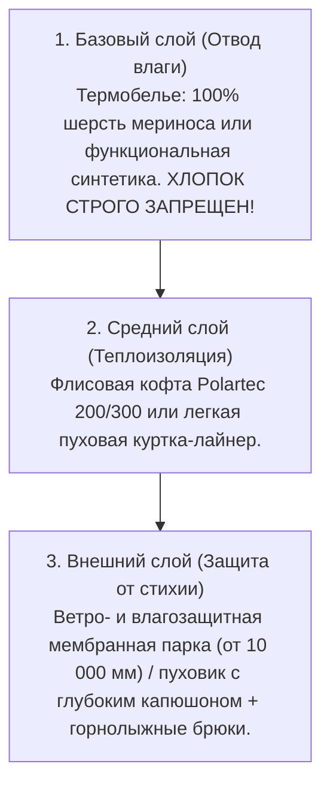
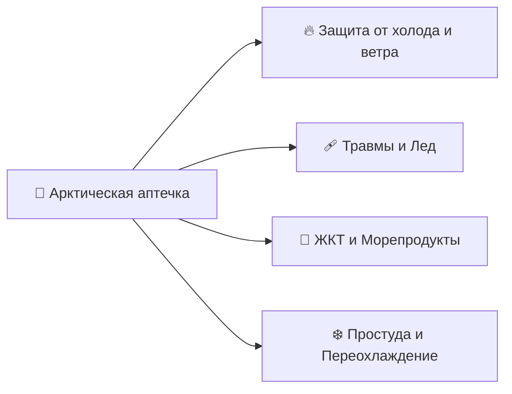
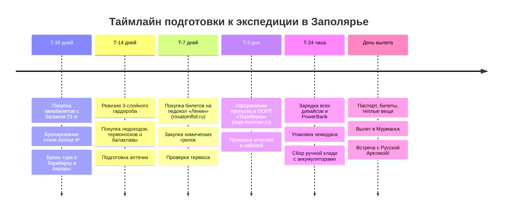

# 📋 Чек-лист подготовки и сборов

> [!INFO] Практическое руководство по экипировке и таймлайну
> Комплексный чек-лист сборов, охватывающий подготовку документов и пропусков, упаковку профессионального 3-слойного арктического гардероба против штормового ветра Баренцева моря, фотосет для ночной охоты за Авророй, защиту аккумуляторов от мороза до `-25°C`, походную аптечку и контрольный предполетный таймлайн.

---

## 🪪 1. Документы, Пропуска и Бронирования

### 📄 Документы и въездные процедуры
- [ ] **Паспорт гражданина РФ:** Оригинал паспорта с действующим сроком (проверен на целостность страниц).
- [ ] **Электронный пропуск в ООПТ «Природный парк Териберка»:** Оформлен заранее онлайн на региональном портале `oopt-murman.ru` (`500 ₽` для граждан РФ, не зарегистрированных в Мурманской области; QR-код сохранен в галерее телефона и распечатан).
- [ ] **Билеты на Атомный ледокол «Ленин»:** Забронирован и выкуплен экскурсионный сеанс на официальном сайте Росатомфлота: `rosatomflot.ru` (`800 ₽`).
- [ ] **Авиабилеты Москва ↔ Мурманск:** Маршрутные квитанции сохранены в формате PDF офлайн на смартфоне (проверен включенный багаж 23 кг).
- [ ] **Ваучер бронирования отеля:** Подтверждение бронирования в *Azimut Hotel Murmansk 4\** или *Renaissance Boutique Hotel* на 3 ночи.
- [ ] **Подтверждения экскурсионных программ:** Зафиксированы контакты гида по охоте за Северным сиянием, водителя 4WD в Териберку и этно-парка «Самь-Сыйт».
- [ ] **Медицинский полис (ОМС / ДМС):** Полис ОМС или расширенная страховка путешественника с опцией активного отдыха на свежем воздухе.
- [ ] **Водительское удостоверение:** На случай форс-мажорной аренды автомобиля (хотя маршрут полностью спроектирован без необходимости садиться за руль).

### 💳 Финансы и платежные средства
- [ ] **Банковские карты (МИР):** Бесконтактная оплата картой или через СБП / Mir Pay работает во всех ресторанах, кофейнях и супермаркетах Мурманска.
- [ ] **Наличные деньги (`~5 000 – 10 000 ₽`):** Необходимы мелкими купюрами для оплаты саней-волокуш за снегоходом в Териберке, чаевых каюрам, покупки свежих морепродуктов у водолазов и сувениров на стихийных рынках.
- [ ] **Приложения банков:** Проверен баланс и настроены быстрые переводы по СБП (в Териберке некоторые частные гиды принимают переводы).

---

## ❄️ 2. Послойный гардероб: «Правило 3-х слоев»

| Слой | Назначение | Материал / Модель | Почему это важно |
| :--- | :--- | :--- | :--- |
| **1. Базовый (Внутренний)** | Отвод пота от тела, сохранение сухости | Термобелье из шерсти мериноса (*Merino 200–260 g/m²*) или спортивная синтетика | Хлопок впитывает влагу, моментально остывает и приводит к быстрому переохлаждению |
| **2. Средний (Утепляющий)** | Удержание теплого воздуха вокруг тела | Толстый флис (*Polartec Classic 200/300*) или компактная ультралегкая пуховка | Создает термобарьер, легко снимается при входе в теплое помещение или авто |
| **3. Внешний (Защитный)** | Блокировка штормового ветра, снега и брызг | Мембранная штормовка с проклеенными швами (Gore-Tex / Dermizax) или теплый пуховик | На побережье Баренцева моря ветер 15–20 м/с пробивает любую обычную городскую одежду |

### 🧦 Термобелье и Средний слой
- [ ] **Комплект теплого термобелья (верх + низ):** 100% шерсть мериноса (плотность от 200 г/м²) — 1–2 комплекта.
- [ ] **Флисовая кофта высокой плотности:** Толстый флис (Polartec 200/300) с высоким воротом на молнии.
- [ ] **Компактная пуховая куртка (Packable Down):** Ультралегкая пуховка, которая надевается под мембрану во время многочасового ожидания Авроры в ночной тундре.
- [ ] **Термоноски (3–4 пары):** Специализированные треккинговые или горнолыжные носки с высоким содержанием шерсти мериноса и усиленной пяткой/носком.

### 🧥 Верхняя одежда и Брюки
- [ ] **Зимняя ветрозащитная парка / пуховик:** С глубоким регулируемым капюшоном с утяжкой, ветрозащитной юбкой и манжетами.
- [ ] **Горнолыжные / треккинговые утепленные брюки:** Непродуваемые мембранные штаны с утеплителем (холлофайбер / Thinsulate) и снегозащитными гетрами снизу.

### 🧤 Обувь и Аксессуары
- [ ] **Зимняя обувь на толстой подошве:** Ботинки с мембраной (Salomon Toundra, Baffin, Sorel, The North Face) с запасом **+1 размер**, чтобы пальцы свободно шевелились в термоноске. Толщина подошвы — не менее 2–3 см (холод идет от мерзлой земли).
- [ ] **Съемные шипы на обувь («Ледоходы»):** Резиновые накладки с металлическими шипами — критически важны для безопасного передвижения по обледенелым тропам сопок Мурманска, спуску к ледоколу «Ленин» и скользким валунам Териберки.
- [ ] **Балаклава или плотный флисовый бафф:** Полная защита лица, подбородка и шеи от обморожения на штормовом ветру.
- [ ] **Теплая шапка:** Плотная шапка с флисовой подкладкой, закрывающая уши и лоб.
- [ ] **Двухслойная система для рук:**
  - [ ] Тонкие сенсорные перчатки (Touchscreen) для работы со смартфоном и фотоаппаратом.
  - [ ] Теплые непродуваемые варежки/верхонки поверх с флисовым или пуховым утеплителем.
- [ ] **Горнолыжная маска / ветрозащитные очки:** Спасает глаза от ледяного колючего снега и поземки во время поездки на санях за снегоходом в Териберке.

---

## 📷 3. Фототехника, Гаджеты и Защита от холода

### 🔋 Электроника и Питание
- [ ] **PowerBank (10 000 – 20 000 мАч):** Высокоемкий внешний аккумулятор с поддержкой быстрой зарядки Power Delivery (**строго в ручной клади!**).
- [ ] **Длинный зарядный кабель (1.5–2 м):** Позволяет держать пауэрбанк во внутреннем теплом кармане пуховика, пока телефон закреплен на штативе.
- [ ] **Сетевой блок GaN 65–100W:** Многопортовое зарядное устройство для одновременной быстрой зарядки смартфона, часов, фотоаппарата и пауэрбанка в отеле.
- [ ] **Запасные аккумуляторы для фотокамеры (2–3 шт.):** На морозе `-15°C` емкость батареи падает в 2–3 раза. Носите запасные аккумуляторы во внутреннем кармане ближе к телу!

### 🔭 Оптика и Съемка Авроры
- [ ] **Устойчивый штатив (Трипод):** Для фиксации смартфона или камеры на длинной выдержке (2–10 секунд). Легкий пластиковый штатив может сдуть полярным ветром — выбирайте устойчивую модель.
- [ ] **Крепление для смартфона на штатив:** Надежный зажим с резьбой 1/4".
- [ ] **Светосильный широкоугольный объектив:** Для камер (фокусное расстояние 14–24 мм, диафрагма $f/1.4 - f/2.8$).
- [ ] **Салфетки из микрофибры и груша для оптики:** Очистка линз от инея и капель морских брызг.
- [ ] **Герметичные зип-пакеты для техники:** При входе с арктического мороза в теплое помещение или салон авто фотоаппарат моментально покрывается конденсатом. Положите камеру в закрытый зип-пакет еще на улице и дайте согреться 30 минут внутри пакета!

### 📱 Приложения и Навигация
- [ ] **My Aurora Forecast / Aurora:** Мониторинг Kp-индекса, вероятности сияния и карты овала Авроры.
- [ ] **Windy.com:** Послойный спутниковый анализ облачности (Low / Medium / High clouds).
- [ ] **SpaceWeatherLive:** Данные параметров солнечного ветра и вектора Bz.
- [ ] **Яндекс Карты:** Загружена офлайн-карта Мурманской области.
- [ ] **Яндекс Go:** Для вызова такси в аэропорту и по Мурманску.

---

## 💊 4. Арктическая аптечка и Защита здоровья

### 🔥 Защита от обморожений и переохлаждения
- [ ] **Химические самогревы (Теплоиды):**
  - [ ] Грелки-вкладыши для рук (в варежки) — 6–8 пар.
  - [ ] Грелки-стельки для обуви (клеятся на носок) — 4–6 пар.
  - [ ] Самоклеящиеся мини-грелки (для приклеивания на заднюю крышку смартфона во время съемки).
- [ ] **Защитный жирный крем от мороза (Cold Cream):** Кольдкрем без содержания воды (наносить на лицо за 20–30 минут до выхода на улицу; крем на водной основе замерзнет на коже!).
- [ ] **Гигиеническая помада с пантенолом:** Защита губ от обветривания и растрескивания.

### 🦀 ЖКТ и Адаптация к морским деликатесам
- [ ] **Сорбенты (Полисорб, Энтеросгель, Смекта):** Первая помощь при непривычной белковой пище (сырые морские ежи, гребешки, краб).
- [ ] **Ферменты (Мезим / Креон / Панкреатин):** Для облегчения переваривания обильной жирной северной рыбы (палтус) и дичи.
- [ ] **Противодиарейные препараты (Лоперамид / Имодиум).**

### 🩹 Травмы, Мышцы и Глаза
- [ ] **Пластыри бактерицидные и мозольные (Compeed).**
- [ ] **Разогревающая / обезболивающая мазь (Вольтарен / Найз):** Для уставших мышц ног и спины после снегоходов и хайкинга.
- [ ] **Увлажняющие глазные капли (Систейн / Оксиал):** Снимают сухость и резь в глазах от морозного ветра.
- [ ] **Эластичный бинт:** Фиксация голеностопа.

### ❄️ Простуда, Горло и Обезболивание
- [ ] **Обезболивающее / Жаропонижающее (Ибупрофен, Парацетамол).**
- [ ] **Леденцы от боли в горле (Стрепсилс, Граммидин).**
- [ ] **Сосудосуживающий спрей в нос (Снуп / Ринонорм).**
- [ ] **Порошки от простуды (Терафлю / Анвимакс).**

---

## 🎒 5. Снаряжение, Термосы и Полезные мелочи

- [ ] **Вакуумный термос (0.7 – 1.0 л):** Высококачественный термос из нержавеющей стали (Thermos, Stanley, Арктика), держащий кипяток не менее 12–18 часов на морозе.
- [ ] **Термокружка с герметичной крышкой:** Для кофе на прогулках по Мурманску.
- [ ] **Городской рюкзак (18–25 л):** Для ношения термоса, теплого флиса, пауэрбанка, сменных перчаток и фотоаппарата.
- [ ] **Налобный фонарик с красным светом:** Для передвижения по ночной тундре и подсветки настроек камеры (красный свет не сбивает ночную адаптацию глаз).
- [ ] **Термопакеты и плотные зип-пакеты:** Для упаковки копченой рыбы (палтус, ерш) и морепродуктов перед укладкой в чемодан.
- [ ] **Сушилка для обуви (ультрафиолетовая / электрическая):** Компактные сушилки для обуви, чтобы за ночь полностью высушить стельки ботинок в отеле.

---

## ⏳ 6. Контрольный таймлайн готовности

### 🗓️ За 30 дней до вылета (T-30d)
- [ ] Выкупить авиабилеты Москва ↔ Мурманск с включенным багажом (до 23 кг).
- [ ] Забронировать номер в *Azimut Hotel Murmansk 4\** на площади Пять Углов.
- [ ] Связаться с проверенными гидами и забронировать место в однодневной 4WD экспедиции в Териберку и на ночную охоту за Северным сиянием.

### 🗓️ За 14 дней до вылета (T-14d)
- [ ] Провести примерку 3-слойного комплекта: термобелье + флис + ветрозащитная парка + штаны.
- [ ] Проверить зимнюю обувь: толщину подошвы, рифленый протектор и отсутствие сдавливания стопы в термоноске.
- [ ] Приобрести ледоходы (накладки с шипами) и балаклаву/бафф.
- [ ] Собрать базовую арктическую аптечку (кольдкрем, сорбенты, обезболивающие).

### 🗓️ За 7 дней до вылета (T-7d)
- [ ] **Купить онлайн билет на экскурсию на Атомный ледокол «Ленин»** на сайте `rosatomflot.ru` на фиксированный слот.
- [ ] Заказать упаковку химических самогревов (для рук, для ног, для телефона).
- [ ] Протестировать термос: залить кипяток и проверить температуру через 12 часов.
- [ ] Установить на смартфон приложения *Aurora*, *Windy*, *SpaceWeatherLive* и скачать офлайн-карты.

### 🗓️ За 3 дня до вылета (T-3d)
- [ ] **Оформить электронный пропуск в ООПТ «Териберка»** на региональном портале `oopt-murman.ru` (сохранить QR-код).
- [ ] Проверить работу штатива, крепления для смартфона и целостность зарядных кабелей.
- [ ] Сохранить все билеты, ваучеры и контакты гидов в офлайн-заметки.

### 🗓️ За 24 часа до вылета (T-24h)
- [ ] Пройти онлайн-регистрацию на авиарейс (выбрать место у окна A или F для панорамы тундры).
- [ ] Полностью зарядить смартфон, часы, наушники, фотоаппарат и пауэрбанк.
- [ ] Сложить **PowerBank и запасные батареи строго в ручную кладь**!
- [ ] Проверить укладку чемодана: теплые вещи, обувь, ледоходы, аптечка, термос.
- [ ] Подготовить наличные деньги (`~5 000 – 10 000 ₽`) мелкими купюрами.

### 🛫 В день вылета (День 01)
- [ ] Финальный контроль: Паспорт РФ, Билеты, Деньги, Телефон, Зарядка, Варежки, Шапка.
- [ ] Одеться на посадку комфортно, но держать теплый пуховик, шапку и перчатки в зоне быстрого доступа (в Мурманске высадка через трап прямо на мороз!).
- [ ] Прибыть в аэропорт за 2 часа до вылета, сдать багаж и взлететь навстречу полярным сияниям и Баренцеву морю!
