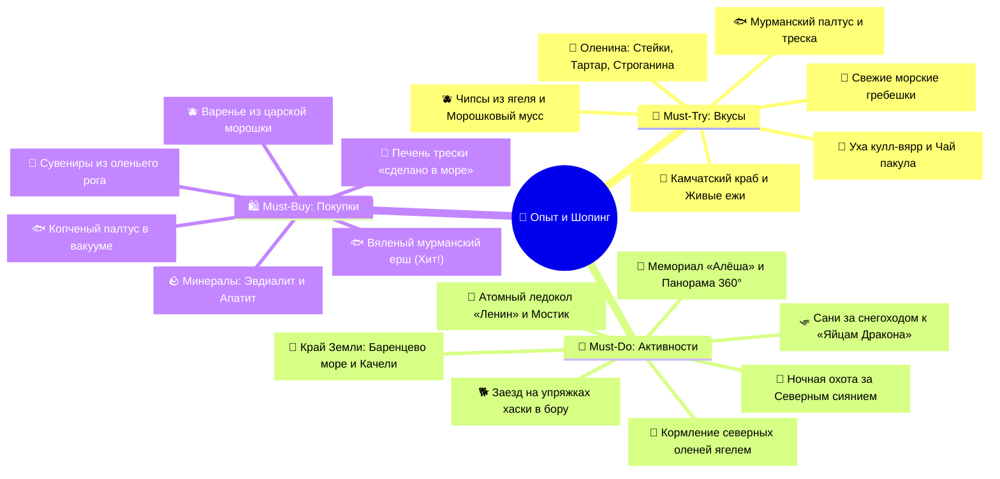
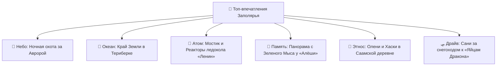
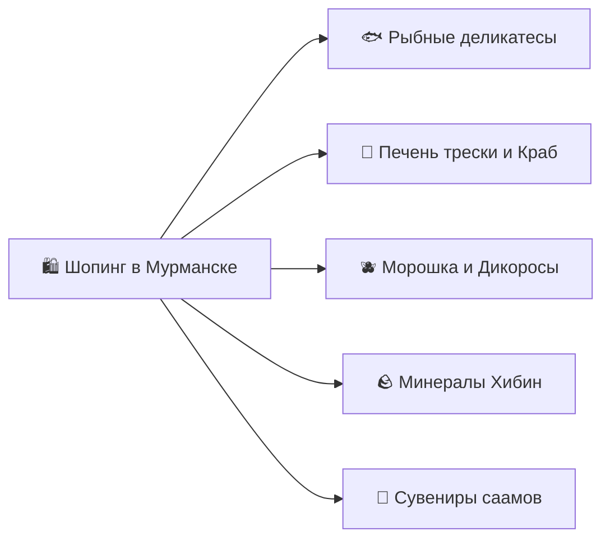

# 🎯 Что попробовать и купить (Must-Try & Must-Buy)

> [!INFO] Полный каталог гастрономии, впечатлений и аутентичного шопинга
> Интерактивный трекер всех вкусов Арктической кухни, культовых активностей за Полярным кругом и лучших сувениров Кольского полуострова с ориентировочными ценами, адресами и проверенными рекомендациями.

---

## 🧭 Карта гастрономии и шопинга

---

## 🦀 I. Must-Try: Гастрономический гид (Что попробовать)

### 🌊 1. Морепродукты Баренцева моря и Арктический фреш
- [ ] **Камчатский краб (Баренцевоморский гигант):**
  - *Что это:* Сладковатое, нежнейшее белое мясо фаланг и клешней. В Баренцевом море краб нагулял колоссальную массу и плотность волокон благодаря богатой кормовой базе.
  - *Как подается:* Свежесваренные фаланги на пару с растопленным сливочным маслом и лимоном или запеченные на гриле с чесночными травами.
  - *Где пробовать:* Рестораны «Тундра. Grill & Bar», «Царская Охота», «Grebeshki» (`~1 200 – 1 800 ₽` за 100 г / порция фаланг `~2 500 – 4 000 ₽`).
- [ ] **Живые зеленые морские ежи (*Strongylocentrotus droebachiensis*):**
  - *Что это:* Добытые водолазами в Териберке ежи вскрываются прямо при вас. Внутри — 5 лепестков оранжевой икры, обладающей ярким минерально-йодистым вкусом морской свежести.
  - *Ритуал дегустации:* В панцирь разбивается перепелиный желток, добавляется капля соевого соуса, перемешивается и съедается ложкой.
  - *Где пробовать:* Рестораны «Grebeshki», «Mole» (Териберка), «Тундра» (`~250 – 350 ₽ / шт`).
- [ ] **Свежайший морской гребешок (Сашими и Гриль):**
  - *Что это:* Нежнейший мускул гребешка, извлеченный из раковины. Имеет тающую во рту кремовую текстуру и сладковатый вкус.
  - *Как подается:* В сыром виде со слайсом лимона и соевым соусом либо запеченным на створке раковины под пармезаном и сливочно-чесночным соусом.
  - *Где пробовать:* Панорамные рестораны Териберки («Grebeshki», «Teriberka Tour») и Мурманска (`~350 – 500 ₽ / шт`).
- [ ] **Мурманская треска «по-мурмански» (Секрет поморов):**
  - *Что это:* Сочное филе свежевыловленной трески, запеченное на подушке из картофеля и лука под нежной шапкой из домашнего майонеза, яиц и сыра.
  - *Где пробовать:* Рестораны «Царская Охота», «Седьмой Океан», «Белый Кролик» (`~750 – 1 100 ₽`).
- [ ] **Стейк из синекорого мурманского палтуса:**
  - *Что это:* Нежнейшая жирная белая рыба с маслянистой текстурой, обжаренная на гриле или запеченная с пюре из печеного сельдерея и можжевеловым соусом.
  - *Где пробовать:* Ресторан «Царская Охота» (`~1 200 – 1 600 ₽`).

---

### 🦌 2. Дичь, Оленина и Саамские традиции
- [ ] **Тартар и Карпаччо из северного оленя:**
  - *Что это:* Тончайшие слайсы или мелкая рубка сырого оленьего филе свободного выпаса, приправленные моченой брусникой, можжевеловым маслом, кедровыми орешками и чипсами из ягеля. Мясо абсолютно нежирное, нежное и с чистым лесным вкусом.
  - *Где пробовать:* Рестораны «Царская Охота», «Тундра» (`~750 – 950 ₽`).
- [ ] **Строганина из оленины с четверговой солью:**
  - *Что это:* Замороженное до твердости камня оленье мясо, наструганное тончайшей стружкой специальным ножом. Стружка тает на языке, макается в смесь крупной соли и черного дробленого перца.
  - *Где пробовать:* Ресторан «Царская Охота» (`~850 – 1 100 ₽`).
- [ ] **Томленая оленина с картофелем и брусничным взваром:**
  - *Что это:* Долго томленная в чугунке оленья мякоть, распадающаяся на волокна, с соусом из лесных ягод и печеными кореньями.
  - *Где пробовать:* Традиционный обед в Саамской деревне «Самь-Сыйт» и рестораны Мурманска (`~900 – 1 400 ₽`).
- [ ] **Саамская уха «Кулл-вярр»:**
  - *Что это:* Традиционный саамский наваристый рыбный суп из дикой семги, сига и трески, сваренный на родниковой воде с добавлением лука и ароматных трав. Обладает мощным согревающим эффектом!
  - *Где пробовать:* Саамская деревня «Самь-Сыйт» (включено в программу).

---

### 🫐 3. Таежные дикоросы, Десерты и Напитки
- [ ] **Чипсы из ягеля в брусничном и черничном сиропе:**
  - *Что это:* Главный гастрономический сувенир и десерт Кольского полуострова: настоящий олений лишайник (кладония), вымоченный в натуральных сиропах северных ягод и бережно высушенный. Хрустит, тает во рту, раскрываясь ягодным взрывом!
  - *Где пробовать:* Ресторан «Царская Охота», сувенирные лавки отеля Azimut (`~250 – 400 ₽`).
- [ ] **Десерт «Морошковое облако» / Панна-котта с морошкой:**
  - *Что это:* Нежнейший сливочный мусс с прослойкой из натурального золотистого джема из дикой болотной морошки с легким таежным ароматом.
  - *Где пробовать:* Рестораны «Тундра», «Царская Охота» (`~450 – 650 ₽`).
- [ ] **Чай «Пакула» (Настой на чаге с травами):**
  - *Что это:* Древний саамский целебный напиток на основе березового гриба чаги, листьев брусники, иван-чая и сушеных ягод можжевельника.
  - *Где пробовать:* Саамская деревня «Самь-Сыйт», кофейни Мурманска.
- [ ] **Кедровый раф и Латте с морошкой:**
  - *Что это:* Спешелти-кофе на основе эспрессо, взбитых сливок с добавлением пасты из кедрового ореха или натурального морошкового соуса.
  - *Где пробовать:* Кофейни «Юность» (ул. Ленина, 61), «Coffee & People» (`~300 – 420 ₽`).
- [ ] **Северные настойки (Морошковая, Клюквенная, Брусничная):**
  - *Что это:* Крафтовые домашние настойки на дикоросах Кольского полуострова крепостью 28–35°.
  - *Где пробовать:* Бар ресторана «Тундра», сет настоек в «Царской Охоте» (`~250 – 350 ₽` за шот / `~900 – 1 200 ₽` за дегустационный сет).

---

## 🎯 II. Must-Do: Топ-впечатления и Арктические ритуалы

### 🌌 Небо и Природа
- [ ] **Выездная ночная охота за Северным сиянием (Авророй) на 4WD:**
  - *Детали:* Выезд с гидом-астрономом в ночную тундру на 50–100 км от городских огней. Поиск разрывов в облаках по спутникам, наблюдение за зелеными и фиолетовыми всполохами в небе, горячий чай из термоса и профессиональная ночная фотосессия.
- [ ] **Свидание с Северным Ледовитым океаном в Териберке:**
  - *Детали:* Выйти на берег незамерзающего Баренцева моря, вдохнуть соленый арктический бриз и осознать, что впереди — только ледяные воды вплоть до Северного полюса.
- [ ] **Полет над океаном на Гигантских деревянных качелях:**
  - *Детали:* Культовая фотолокация на песчаном пляже Старой Териберки прямо у полосы морского прибоя.

### ⚓ История и Индустриальная мощь
- [ ] **Подняться на ходовой мостик первого в мире Атомного ледокола «Ленин»:**
  - *Детали:* Пройти по парадной кают-компании из карельской березы, заглянуть в шахты атомных реакторов и встать за тяжелый штурвал легендарного атомохода на Морвокзале Мурманска.
- [ ] **Увидеть панораму Кольского залива с вершины сопки Зеленый Мыс у мемориала «Алёша»:**
  - *Детали:* Постоять у Вечного огня под взглядом 35-метрового каменного защитника Заполярья и насладиться 360-градусным видом на заснеженный Мурманск и порт.
- [ ] **Поклониться мужеству подводников у рубки АПЛ «Курск»:**
  - *Детали:* Посетить мемориал «Маяк» на сопке над Семеновским озером и увидеть подлинную рубку погибшей субмарины К-141.

### 🦌 Этнос, Животные и Драйв
- [ ] **Покормить северных оленей ягелем прямо с рук:**
  - *Детали:* Зайти в просторный загон в Саамской деревне «Самь-Сыйт», прикоснуться к бархатным рогам и почувствовать мягкое дыхание оленей.
- [ ] **Промчаться на санях за снегоходом по Природному парку «Териберка»:**
  - *Детали:* 15 минут адреналина в санях-волокушах по заснеженным сопкам мимо замерзших озер прямо к каменному пляжу «Яйца Дракона» и ледяному Батарейскому водопаду.
- [ ] **Обнимашки с сибирскими хаски и заезд на собачьей упряжке:**
  - *Детали:* Заряд безудержного позитива от самых дружелюбных ездовых собак Заполярья.

---

## 🛍️ III. Must-Buy: Что привезти домой (Шопинг-гид)

### 🐟 1. Рыбные деликатесы Заполярья (Главный багаж!)

| Продукт | Описание и Вкус | Где покупать | Ориентировочная цена |
| :--- | :--- | :--- | :---: |
| **Вяленый мурманский ёрш (Морской ерш)** | Абсолютный культ и гастро-хит №1! Жирная, ароматная, невероятно вкусная камбалообразная рыба. | Рыбный рынок на ул. Свердлова, магазин «Портовый», «Рыбный островок» в аэропорту MMK | `~1 400 – 1 900 ₽ / кг` |
| **Синекорый палтус холодного копчения** | Нежнейшая тающая маслянистая рыба золотистого цвета в вакуумной упаковке. | Рыбные лавки Мурманска, магазин «Меридиан» | `~1 600 – 2 300 ₽ / кг` |
| **Семга мурманская слабосоленая / х/к** | Благородное красное филе дикой или выращенной в чистых фьордах рыбы. | Рыбные магазины Мурманска | `~1 800 – 2 500 ₽ / кг` |
| **Копченый морской окунь** | Ярко-красная океанская рыба горячего копчения с плотным сочным белым мясом. | Рыбные лавки | `~800 – 1 100 ₽ / кг` |

- [ ] **Покупка вяленого ерша:** Обязательно попросите упаковать ерша в **двойной вакуумный пакет** (рыба имеет очень сильный характерный аромат, который без вакуума пропитает все вещи в чемодане).

---

### 🥫 2. Консервы, Дикоросы и Сладости
- [ ] **Печень трески по-мурмански («Изготовлено в море»):**
  - *Секрет выбора:* Ищите на банке надпись **«Из свежего сырья на борту судна»** (или код рыболовецкого траулера). Такая печень не подвергалась заморозке, невероятно нежная, кремовая и богата омега-3 и витамином A/D (`~350 – 550 ₽` за банку 230 г).
- [ ] **Мясо камчатского краба в стеклянной банке:**
  - *Что это:* Цельные фаланги или салатное мясо краба в собственном соку без консервантов (`~1 500 – 2 800 ₽` за банку 500 г).
- [ ] **Варенье и соусы из дикой царской морошки:**
  - *Что это:* Стеклянные баночки янтарного варенья из ягод, собранных вручную на болотах Кольского полуострова (`~500 – 850 ₽` за банку 250 г).
- [ ] **Соус из брусники с можжевельником к дичи и сырам:**
  - *Что это:* Пикантный кисло-сладкий соус, идеально дополняющий домашние стейки (`~350 – 500 ₽`).
- [ ] **Упаковки хрустящих чипсов из ягеля:**
  - *Что это:* Подарочные коробочки с лишайником в черничном и брусничном сиропе — удивите друзей оригинальным десертом! (`~300 – 450 ₽`).
- [ ] **Чай из березовой чаги с ягодами:**
  - *Что это:* Экологически чистый сбор для заваривания в френч-прессе или термосе (`~250 – 400 ₽`).

---

### 🪨 3. Минералы Хибин и Саамские сувениры
- [ ] **Изделия из эвдиалита («Лопарская кровь»):**
  - *Легенда:* Темно-малиновый минерал из Хибин и Ловозерских тундр, по легенде застывший из капель крови саамских богатырей.
  - *Что купить:* Кулоны, кабошоны, брелоки, полированные образцы минералов (`~400 – 1 500 ₽`).
- [ ] **Астрофиллит и Апатит:**
  - *Особенность:* Минералы с золотисто-бронзовыми лучистыми звездами (астрофиллит) и изумрудно-зеленый апатит.
- [ ] **Сувениры из резного оленьего рога:**
  - *Что купить:* Амулеты с саамскими рунами, рукояти охотничьих ножей, фигурки полярных животных (`~600 – 2 500 ₽`).
- [ ] **Теплые варежки и носки из овечьей шерсти с саамскими орнаментами:**
  - *Особенность:* Связанные вручную плотные изделия с геометрическими защитными узорами коренных народов Севера (`~800 – 1 500 ₽`).

---

## 🛄 IV. Памятка по предполетной упаковке северных покупок (День 04)

> [!WARNING] В. Памятка по предполетной упаковке северных покупок (День 04)
> 1. **Вяленый мурманский ёрш и копченый палтус:** Покупайте на рыбном рынке строго в **двойной заводской вакуумной запайке** (чтобы специфический аромат рыбы не распространялся по салону самолета и багажному отделению).
> 2. **Стеклянные банки с морошковым вареньем и печень трески:** Только в **сдаваемый багаж** (в ручной клади они изымаются службой авиационной безопасности как жидкости свыше 100 мл). Оберните банки мягкими флисовыми слоями одежды в центре чемодана.
> 3. **Замороженные морепродукты (краб, гребешки):** Приобретайте в термопакетах с хладоэлементами непосредственно перед выездом в аэропорт. За 2.5 часа полета в багажном отсеке самолета при температуре около `0...+4°C` морепродукты сохранят идеальную свежесть.
> 4. **Ножи с рукоятями из рога и ледоходы:** Любые колюще-режущие сувениры и насадки на обувь с металлическими шипами перевозятся **строго в сдаваемом багаже**.
