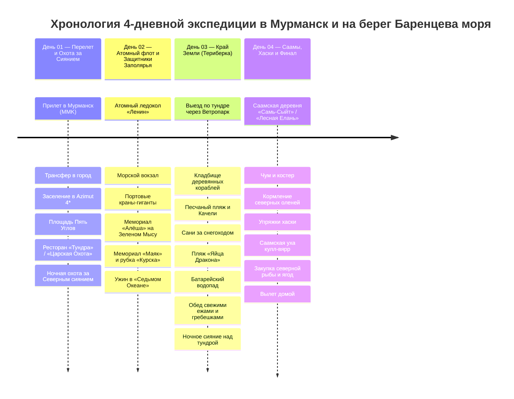

# 🌌 Мурманск и Русская Арктика — 4 Дня на Краю Земли (Кольский полуостров)

> **Концепция путешествия:** Насыщенная 4-дневная экспедиция за Полярный круг, объединяющая 4 ключевые грани Русского Севера:
> 1. 🏙️ **День 01 (Чт) — Столица Заполярья и Ночная Аврора:** Перелет за 68-ю параллель, панорама заснеженной тундры с борта самолета, заселение в видовой отель, знакомство с монументальным ансамблем площади Пять Углов, гастрономический старт в «Тундре» / «Царской Охоте» и ночная выездная охота за Северным сиянием с профессиональным гидом-фотографом.
> 2. ⚓ **День 02 (Пт) — Морская мощь и Стальное сердце Арктики:** Первый в мире атомный ледокол «Ленин» (кают-компания, капитанский мостик и реакторный отсек), незамерзающий Мурманский морской торговый порт, грандиозный 35.5-метровый мемориал «Алёша» на сопке Зеленый Мыс с панорамой Кольского залива, мемориальный комплекс «Маяк» и рубка АПЛ «Курск».
> 3. 🌊 **День 03 (Сб) — Экспедиция на Край Земли (Териберка):** Джип-сафари сквозь тундру и Ветропарк по Серебрянскому шоссе к Северному Ледовитому океану (Баренцево море): мистическое Кладбище кораблей, Песчаный пляж с гигантскими качелями и скелетом кита, сани-волокуши за снегоходом в Природный парк, каменный пляж «Яйца Дракона», замерзший Батарейский водопад и дегустация живых морских ежей и гребешков в ресторане «Grebeshki».
> 4. 🦌 **День 04 (Вс) — Этно-Заполярье, Олени и Вылет:** Погружение в культуру коренного народа саамов в этно-парке «Самь-Сыйт» / «Лесная Елань», кормление северных оленей ягелем с рук, катание на оленьих и собачьих упряжках хаски, согревающая саамская уха *кулл-вярр*, закупка северных деликатесов и вечерний вылет домой.

---

## 🗺️ Ключевые параметры

* **Продолжительность:** 4 дня / 3 ночи.
* **Сезонность:** Ноябрь – март (идеальный период для наблюдения Северного сияния, устойчивого снежного покрова и зимней арктической атмосферы).
* **Формат тура:** Активная авто-экспедиция с комфортным городским базированием (Мурманск) и радиальными выездами (Териберка к океану, Саамская деревня).
* **Бюджет проживания (3 ночи):** `~13 500 – 18 000 ₽` (комфортный номер в *Azimut Hotel Murmansk 4\** на площади Пять Углов или *Renaissance Boutique Hotel*).
* **Бюджет под ключ на 1 чел:** `~48 500 ₽` (авиабилеты Москва ➔ Мурманск ➔ Москва `~11 500 ₽`, проживание `~15 000 ₽`, джип-экспедиция в Териберку + снегоходы `~7 500 ₽`, охота за сиянием с фотографом `~4 500 ₽`, саамская программа с хаски `~4 500 ₽`, арктическая гастрономия, свежие крабы, ежи, гребешки, оленина `~12 000 ₽`).

---

## 📋 Разделы проекта `-- Murmansk`

1. **[[Personal Note/Travel/-- Murmansk/02 - Маршрутный план/Маршрутный план|🗓️ Сводный Маршрутный план (4 Дня)]]**
2. **[[Гайд по экипировке, полярной ночи и охоте за Северным сиянием|🌌 Гайд: Экипировка, Полярная ночь и Охота за Авророй]]**
3. **[[Мурманск, Атомный флот и История Заполярья|⚓ Заметки: Мурманск, Атомный ледокол «Ленин» и Алёша]]**
4. **[[Териберка, Баренцево море и Край Земли|🌊 Заметки: Териберка, Баренцево море и Край Земли]]**
5. **[[Саамы, Северные олени и Этно-Заполярье|🦌 Заметки: Саамская деревня, Северные олени и Хаски]]**
6. **[[Арктическая кухня и Рестораны Мурманска|🦀 Заметки: Арктическая кухня, Морепродукты и Рестораны]]**
7. **[[Отели и Базы отдыха|🏨 Бронирования: Отели и Базы отдыха]]**
8. **[[Транспорт, Джипы и Экскурсии|🚙 Бронирования: Транспорт, Джипы и Экскурсии]]**
9. **[[Personal Note/Travel/-- Murmansk/03 - Бронирования/Авиаперелеты|✈️ Бронирования: Авиаперелеты]]**
10. **[[Финансы (Murmansk)|💰 Бюджет и Полная смета (4 дня)]]**
11. **[[05 - Полезная информация|📖 Полезная информация: История, Дух Арктики и Культурный Код]]**
