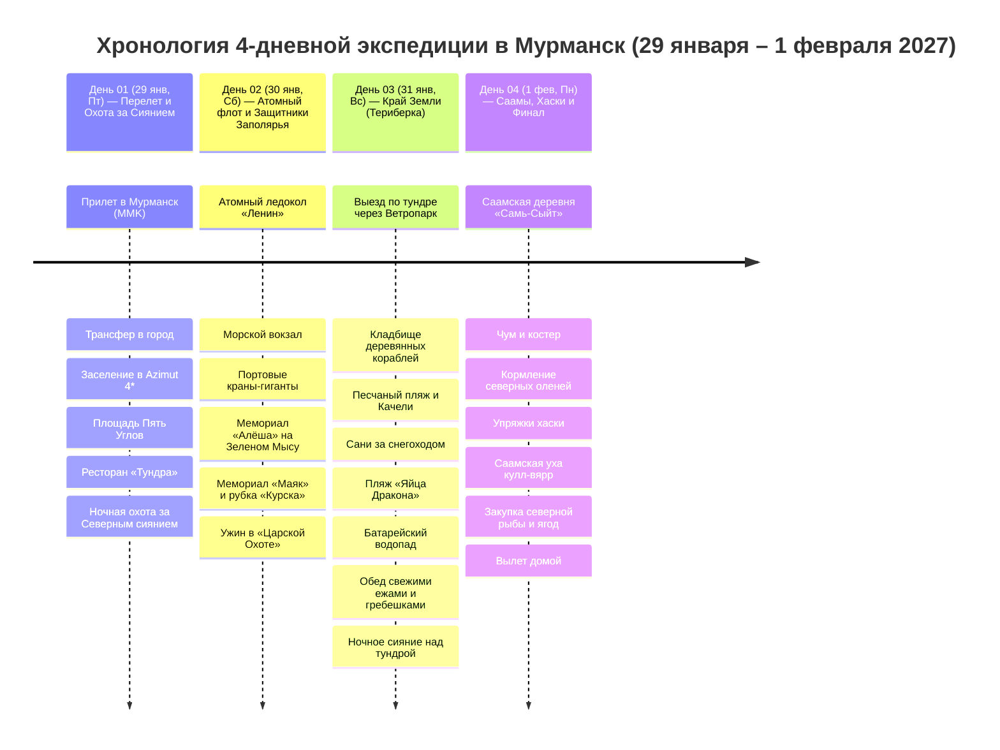

# 🌌 Мурманск и Русская Арктика — 4 Дня на Краю Земли (29 января – 1 февраля 2027)

## 📝 Краткое описание

Насыщенная 4-дневная полярная экспедиция за 68-ю параллель: охота за Северным сиянием на внедорожниках, атомный ледокол «Ленин» в незамерзающем порту, джип-сафари на Край Земли в Териберку к Баренцеву морю и знакомство с культурой саамов и оленями.

## 📖 Подробная концепция путешествия

Насыщенная 4-дневная полярная экспедиция за 68-ю параллель (29 января – 1 февраля 2027: Пятница ➔ Понедельник), объединяющая 4 ключевые грани Русского Севера:

1. 🏙️ **День 01 (Пт, 29 янв) — Столица Заполярья и Ночная Аврора:** Перелет за 68-ю параллель, панорама заснеженной тундры с борта самолета, заселение в видовой отель, знакомство с монументальным ансамблем площади Пять Углов, гастрономический старт в «Тундре» / «Царской Охоте» и ночная выездная охота за Северным сиянием с профессиональным гидом-фотографом на 4WD внедорожнике.
2. ⚓ **День 02 (Сб, 30 янв) — Морская мощь и Стальное сердце Арктики:** Первый в мире атомный ледокол «Ленин» (кают-компания, капитанский мостик и реакторный отсек), незамерзающий Мурманский морской торговый порт, грандиозный 35.5-метровый мемориал «Алёша» на сопке Зеленый Мыс с круговой панорамой Кольского залива, мемориальный комплекс «Маяк» и рубка АПЛ «Курск».
3. 🌊 **День 03 (Вс, 31 янв) — Экспедиция на Край Земли (Териберка):** Джип-сафари сквозь тундру и Ветропарк по Серебрянскому шоссе к Северному Ледовитому океану (Баренцево море): мистическое Кладбище деревянных кораблей, Песчаный пляж с гигантскими качелями и скелетом кита, сани-волокуши за снегоходом в Природный парк, каменный пляж «Яйца Дракона», замерзший бирюзовый Батарейский водопад и дегустация живых морских ежей и гребешков в панорамном ресторане «Grebeshki».
4. 🦌 **День 04 (Пн, 1 фев) — Этно-Заполярье, Олени и Вылет:** Погружение в культуру коренного народа саамов в этно-парке «Самь-Сыйт», кормление северных оленей ягелем прямо с ладоней, катание на оленьих и собачьих упряжках хаски, согревающая саамская уха *кулл-вярр*, закупка северных рыбных деликатесов (ерш, палтус, печень трески, морошка) и вечерний вылет в Москву.

---

## 🗺️ Ключевые параметры

* **Продолжительность:** 4 дня / 3 ночи.
* **Сезонность:** Ноябрь – март (идеальный период для наблюдения Северного сияния, устойчивого снежного покрова и полярных сумерек).
* **Формат тура:** Активная экспедиция без необходимости вождения с комфортным городским базированием (*Azimut Hotel Murmansk 4\**) и радиальными выездами (Териберка к океану, Саамская деревня).
* **Структура ночевок (3 ночи):**
  * Мурманск — **3 ночи** (*Azimut Hotel Murmansk 4\** на площади Пять Углов).
* **Калиброванный бюджет проживания (3 ночи):** **`16 500 ₽`** (в среднем `~5 500 ₽ / ночь` с сытными завтраками «шведский стол»).
* **Бюджет под ключ на 1 чел:** **`~72 700 ₽`** (авиабилеты Москва ↔ Мурманск с багажом 23 кг `13 500 ₽`, проживание 3 ночи в отеле 4* `16 500 ₽`, транспорт и экспедиции `23 400 ₽`, питание `14 000 ₽`, билеты и сборы `1 300 ₽`, северная рыба и сувениры `4 000 ₽`).

---

## 📋 Разделы проекта `-- Murmansk`

1. **[[Personal Note/Travel/-- Murmansk/02 - Маршрутный план/Маршрутный план|🗓️ Сводный Маршрутный план (4 Дня)]]**
2. **[[Personal Note/Travel/-- Murmansk/01 - Заметки/Гайд по экипировке, полярной ночи и охоте за Северным сиянием|🌌 Гайд: Экипировка, Полярная ночь и Охота за Авророй]]**
3. **[[Personal Note/Travel/-- Murmansk/01 - Заметки/Мурманск, Атомный флот и История Заполярья|⚓ Заметки: Мурманск, Атомный ледокол «Ленин» и Алёша]]**
4. **[[Personal Note/Travel/-- Murmansk/01 - Заметки/Териберка, Баренцево море и Край Земли|🌊 Заметки: Териберка, Баренцево море и Край Земли]]**
5. **[[Personal Note/Travel/-- Murmansk/01 - Заметки/Саамы, Северные олени и Этно-Заполярье|🦌 Заметки: Саамская деревня, Северные олени и Хаски]]**
6. **[[Personal Note/Travel/-- Murmansk/01 - Заметки/Арктическая кухня и Рестораны Мурманска|🦀 Заметки: Арктическая кухня, Морепродукты и Рестораны]]**
7. **[[Personal Note/Travel/-- Murmansk/03 - Бронирования/Отели|🏨 Бронирования: Отели, Глэмпинги и Базы отдыха]]**
8. **[[Personal Note/Travel/-- Murmansk/03 - Бронирования/Транспорт|🚙 Бронирования: Транспорт, Джипы и Экскурсии]]**
9. **[[Personal Note/Travel/-- Murmansk/03 - Бронирования/Авиаперелеты|✈️ Бронирования: Авиаперелеты]]**
10. **[[Personal Note/Travel/-- Murmansk/04 - Финансы/Финансы|💰 Бюджет и Полная смета (4 дня)]]**
11. **[[Personal Note/Travel/-- Murmansk/05 - Полезная информация/Полезная информация|📖 Полезная информация: История, Дух Арктики и Культурный Код]]**
12. **[[Personal Note/Travel/-- Murmansk/05 - Полезная информация/Безопасность, Полярный мороз и Экстренная помощь|🚨 Безопасность, Полярный мороз и Экстренная помощь]]**
13. **[[Personal Note/Travel/-- Murmansk/06 - Чек лист/Чек лист|✅ Чек-листы: Подготовка, Сборы, Must-Try & Must-Buy]]**
14. **[[Personal Note/Travel/-- Murmansk/06 - Чек лист/Чек-лист подготовки и сборов|📋 Чек-лист подготовки и сборов (T-30d ➔ Вылет)]]**
15. **[[Personal Note/Travel/-- Murmansk/06 - Чек лист/Что попробовать и купить (Must-Try & Must-Buy)|🎯 Что попробовать и купить (Must-Try & Must-Buy)]]**
