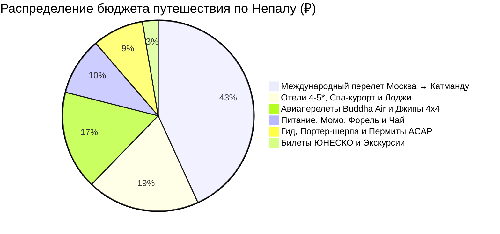

# 💰 Финансы и Полная смета тура: Непал (9 дней / 8 ночей)

> [!summary]+ 💰 Общий бюджет экспедиции «под ключ»: **~118 000 – 136 000 ₽`** (`~160 000 – 185 000 NPR` / `~1 250 – 1 450 $`) на 1 человека
> - ✈️ **Международный авиаперелет (Москва ↔ Катманду с багажом 23–30 кг):** `~62 000 ₽`
> - 🏨 **Проживание (8 ночей: отели 4-5*, озерный спа-курорт, горные лоджи):** `~27 365 ₽` (из расчета `~54 730 ₽` на двоих / `~31 000 ₽` соло)
> - 🛫 **Весь транспорт (авиарейсы Buddha Air x2, джипы 4x4, авто с водителем):** `~24 000 ₽` (`~33 000 NPR`)
> - 🥾 **Горный трекинг (пермиты ACAP/TIMS, лицензированный гид и портер-шерпа):** `~12 400 ₽` (`~17 000 NPR`)
> - 🥟 **Питание (момо, дал-бат, озерная форель, чай масала, ужин Невари):** `~14 000 ₽` (`~19 000 NPR`)
> - 🎟️ **Билеты в памятники ЮНЕСКО (Бхактапур, Боднатх, Сваямбунатх, Патан):** `~3 800 ₽` (`~5 200 NPR`)

