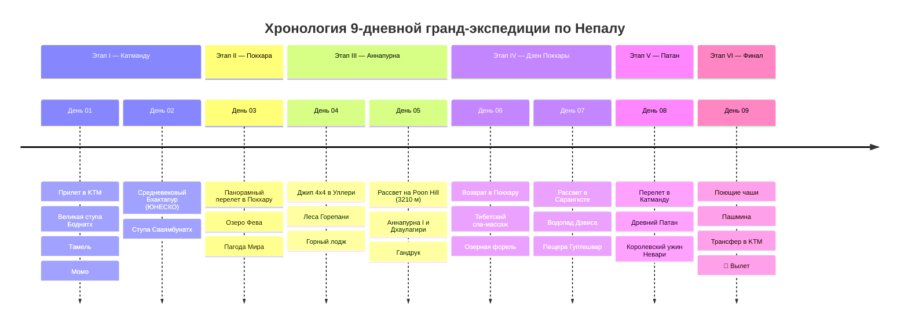

# 🇳🇵 Непал: Крыша Мира, Дзен Покхары и Панорама Аннапурны (9 Дней)

> **Концепция экспедиции:** Незабываемое 9-дневное путешествие в сердце высочайшей горной системы планеты для соло-путешественника без автомобиля: мистические ступы древней долины Катманду (Боднатх и Сваямбунатх), панорамный авиаперелет на легкомоторном самолете вдоль Гималайского хребта в озерную Покхару, комфортный видовой трекинг к панорамной вершине Poon Hill (3210 м) с золотым рассветом над восьмитысячниками Дхаулагири (8167 м) и Аннапурна I (8091 м), колоритные каменные деревни народа гурунгов и расслабляющий дзен у озера Фева.
> 
> 1. ⛩️ **Этап I (Дни 01–02): Сакральная Долина Катманду.** Гигантская белая ступа Боднатх (ЮНЕСКО) с тибетскими мантрами, древнейший Обезьяний Храм Сваямбунатх на холме и средневековый резной город мастеров Бхактапур IX века.
> 2. 🌊 **Этап II (День 03): Панорамный Перелет и Курортная Покхара.** Живописный 25-минутный полет на самолете вдоль заснеженных пиков, лодочная прогулка по зеркальному озеру Фева и белоснежная Пагода Мира с видом на священную гору Мачапучаре («Рыбий Хвост» 6993 м).
> 3. 🏔️ **Этап III (Дни 04–05): Гималайский Трекинг — Рассвет на Poon Hill (3210 м).** Джип 4x4 в горы, трекинг с персональным гидом и портером (весь багаж несет портер!) через сказочные рододендроновые леса Горепани, кульминационный рассвет над гигантскими восьмитысячниками Аннапурна (8091 м) и Дхаулагири (8167 м), традиционная каменная деревня Гандрук.
> 4. 🧘‍♂️ **Этап IV (Дни 06–07): Дзен Покхары — Спа, Озеро и Водопады.** Возвращение в озерный спа-курорт, тибетский масляный массаж, подземный водопад Дэвиса, священная сталактитовая пещера Гуптешвар и ужин свежей форелью.
> 5. 👑 **Этап V (День 08): Древнее Королевство Патан.** Перелет в Катманду, шедевры бронзового литья и Золотой Храм в древнем Патане (Лалитпур), ужин традиционным королевским сетом Невари с рисовым вином *айла*.
> 6. 🛫 **Этап VI (День 09): Поющие Чаши, Кашемир и Вылет.** Закупка кованых тибетских поющих чаш, шарфов из пашмины и гималайского чая, трансфер в аэропорт Tribhuvan (KTM) и вылет домой.

---

## 🗺️ Ключевые параметры экспедиции

* **Продолжительность:** 9 дней / 8 ночей.
* **Сезонность:** Октябрь – декабрь (идеальная кристальная видимость заснеженных Гималаев) или март – май (цветение гигантских древовидных рододендронов).
* **Формат перемещений:** 100% без водительских прав (панорамные 25-минутные авиаперелеты **Buddha Air / Yeti Airlines**, джипы 4x4 Toyota/Mahindra для горных участков, сертифицированный горный гид и портер-шерпа, несущий багаж, персональные авто в городах).
* **Бюджет под ключ на 1 чел:** `~115 000 – 138 000 ₽` (`~1 250 – 1 480 $` / `~165 000 – 195 000 NPR`), включая перелеты, внутренние авиарейсы, отели 4-5*, горные лоджи, портера, гида, пермиты ACAP/TIMS и питание.

---

## 📋 Разделы проекта `-- Nepal`

1. **[[Personal Note/Travel/-- Nepal/02 - Маршрутный план/Маршрутный план|🗓️ Сводный Маршрутный план (9 Дней)]]**
2. **[[Ступы Катманду, Великий Боднатх, Сваямбунатх и Патан|⛩️ Заметки: Ступы Катманду — Боднатх, Сваямбунатх и Патан]]**
3. **[[Средневековый Бхактапур, Город Мастеров и Пагода Ньятапола|🏛️ Заметки: Бхактапур — Город резных деревянных дворцов]]**
4. **[[Озерная Покхара, Зеркало озера Фева и Пагода Мира|🌊 Заметки: Покхара — Озеро Фева, Пагода Мира и Сарангкот]]**
5. **[[Панорама Аннапурны, Рассвет на Poon Hill (3210 м) и Дхаулагири|🏔️ Заметки: Poon Hill (3210 м) — Панорама восьмитысячников]]**
6. **[[Деревня гурунгов Гандрук и Рододендроновые леса Горепани|🌿 Заметки: Тропа Аннапурны — Деревня Гандрук и Рододендроны]]**
7. **[[Непальская и Тибетская гастрономия, Момо, Дал-Бат и Масала-чай|🥟 Заметки: Кухня Гималаев — Момо, Дал-Бат и Чай]]**
8. **[[Гайд по транспорту без прав, Рейсы Buddha Air, Джипы 4x4 и Портеры|✈️ Заметки: Гайд по транспорту — Самолеты, Джипы 4x4 и Портеры]]**
9. **[[Авиаперелеты (Nepal)|✈️ Бронирования: Авиаперелеты (Москва ↔ Катманду ↔ Покхара)]]**
10. **[[Отели, Курортные спа и Горные лоджи в Гималаях|🏨 Бронирования: Отели в Катманду, Покхаре и Лоджи в горах]]**
11. **[[Транспорт, Авиарейсы Buddha Air, Джипы 4x4 и Пермиты (Без авто)|🚙 Бронирования: Buddha Air, Джипы 4x4 и Пермиты ACAP]]**
12. **[[Финансы (Nepal)|💰 Бюджет и Полная смета тура (9 дней)]]**
13. **[[05 - Полезная информация|📖 Полезная информация: Виза по прилете, Этика ступ, Портеры и Деньги]]**
